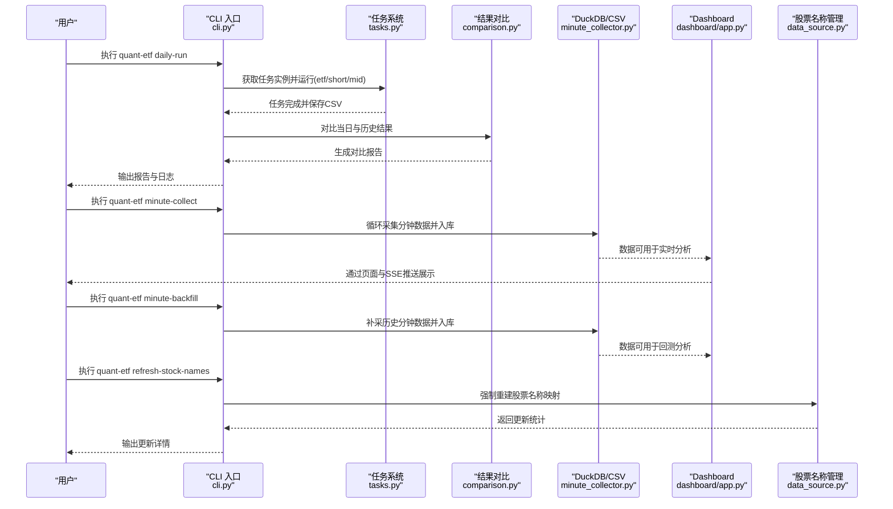
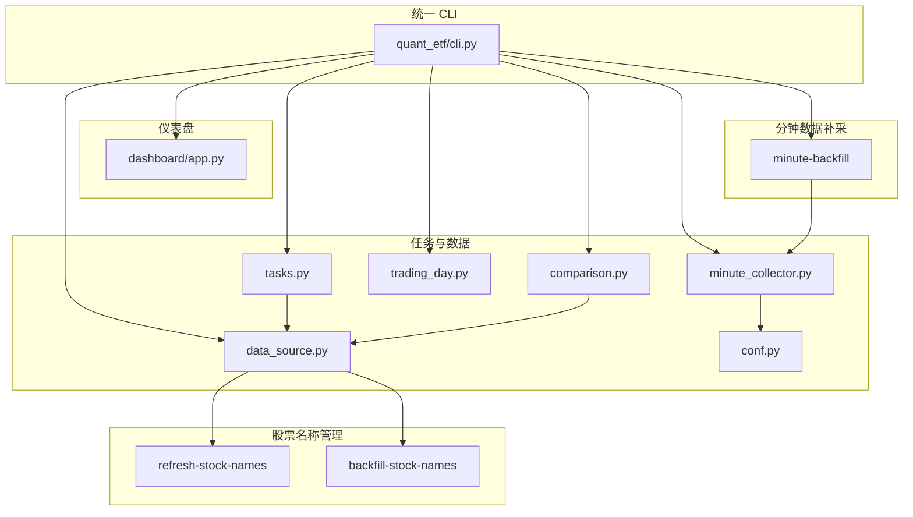
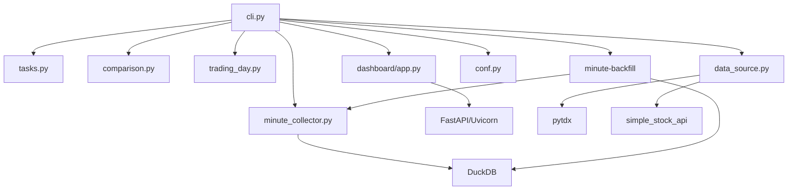

# CLI命令参考

<cite>
**本文引用的文件**
- [src/quant_etf/cli.py](file://src/quant_etf/cli.py)
- [src/main.py](file://src/main.py)
- [README.md](file://README.md)
- [DEVELOPMENT.md](file://DEVELOPMENT.md)
- [pyproject.toml](file://pyproject.toml)
- [src/quant_etf/tasks.py](file://src/quant_etf/tasks.py)
- [src/quant_etf/comparison.py](file://src/quant_etf/comparison.py)
- [src/quant_etf/trading_day.py](file://src/quant_etf/trading_day.py)
- [src/quant_etf/minute_collector.py](file://src/quant_etf/minute_collector.py)
- [src/quant_etf/dashboard/app.py](file://src/quant_etf/dashboard/app.py)
- [src/quant_etf/data_source.py](file://src/quant_etf/data_source.py)
- [src/quant_etf/conf.py](file://src/quant_etf/conf.py)
- [run_daily.py](file://run_daily.py)
- [run_dashboard.py](file://run_dashboard.py)
- [plan_daily_run.md](file://plan_daily_run.md)
- [tests/test_name_refresh.py](file://tests/test_name_refresh.py)
- [logs/minute_backfill_2026-05-25.log](file://logs/minute_backfill_2026-05-25.log)
</cite>

## 目录
1. [简介](#简介)
2. [项目结构](#项目结构)
3. [核心组件](#核心组件)
4. [架构总览](#架构总览)
5. [详细组件分析](#详细组件分析)
6. [依赖分析](#依赖分析)
7. [性能考虑](#性能考虑)
8. [故障排除指南](#故障排除指南)
9. [结论](#结论)
10. [附录](#附录)

## 简介
本文件为 Quant-ETF 项目的统一命令行接口"quant-etf"的权威参考文档。围绕每日运行、单任务运行、任务列表、仪表盘、分钟级数据采集、历史补跑、分钟级数据补采等核心命令，提供完整的语法说明、参数选项、默认值、使用示例与最佳实践。文档还解释命令间的依赖关系、错误处理与调试技巧，并给出批量操作与自动化脚本的建议。

**更新** 新增 minute-backfill 命令，提供历史分钟级K线数据补采功能，替代了原有的手动脚本方法。新增 refresh-stock-names 命令，支持强制重建股票名称映射、干运行模式、自定义目标文件路径等功能。增强了 backfill-stock-names 功能，改进了冲突解决机制和错误处理。**重大更新** Ctrl+C 终止机制现已大幅改进，wait_until_trading_start nc函数支持响应式中断，用户可在约1秒内响应 Ctrl+C，而不是之前的阻塞等待。

## 项目结构
- 统一 CLI 入口位于 src/quant_etf/cli.py，负责参数解析与命令分发。
- 旧版脚本 run_daily.py、run_dashboard.py 等已迁移至统一 CLI，保持向后兼容。
- 仪表盘服务位于 src/quant_etf/dashboard/app.py，通过 FastAPI 提供 Web 界面与 API。
- 数据采集、任务执行、结果对比、交易日历等功能分布在相应模块中。
- 股票名称管理功能位于 src/quant_etf/data_source.py，提供全量重建和补齐功能。
- 分钟级数据补采功能位于 src/quant_etf/minute_collector.py，提供历史数据补采能力。

```mermaid
graph TB
CLI["CLI 入口<br/>src/quant_etf/cli.py"] --> DailyRun["daily-run<br/>运行每日选股任务"]
CLI --> RunCmd["run<br/>运行单个选股任务"]
CLI --> ListTasks["list-tasks<br/>列出所有可用任务"]
CLI --> Dashboard["dashboard<br/>启动 Dashboard 监控系统"]
CLI --> MinuteCollect["minute-collect<br/>启动分钟级K线数据采集器"]
CLI --> MinuteBackfill["minute-backfill<br/>补采历史分钟级K线数据"]
CLI --> Backfill["backfill<br/>批量补跑历史日期任务"]
CLI --> RestartDash["restart-dashboard<br/>一键重启 Dashboard 服务"]
CLI --> CheckDash["check<br/>Dashboard 健康检查"]
CLI --> BackfillNames["backfill-stock-names<br/>补齐股票代码名称"]
CLI --> RefreshNames["refresh-stock-names<br/>强制重建股票名称映射"]
DailyRun --> Tasks["任务注册与执行<br/>src/quant_etf/tasks.py"]
RunCmd --> Tasks
Backfill --> Tasks
Backfill --> TradingDay["交易日历<br/>src/quant_etf/trading_day.py"]
DailyRun --> Compare["结果对比<br/>src/quant_etf/comparison.py"]
MinuteCollect --> MinuteDB["分钟数据存储 DuckDB<br/>src/quant_etf/minute_collector.py"]
MinuteBackfill --> MinuteDB
Dashboard --> DashApp["FastAPI 应用<br/>src/quant_etf/dashboard/app.py"]
RestartDash --> DashApp
CheckDash --> DashApp
BackfillNames --> DataSource["数据源与名称映射<br/>src/quant_etf/data_source.py"]
RefreshNames --> DataSource
```

**图示来源**
- [src/quant_etf/cli.py:324-398](file://src/quant_etf/cli.py#L324-L398)
- [src/quant_etf/tasks.py:411-450](file://src/quant_etf/tasks.py#L411-L450)
- [src/quant_etf/comparison.py:8-129](file://src/quant_etf/comparison.py#L8-L129)
- [src/quant_etf/trading_day.py:62-88](file://src/quant_etf/trading_day.py#L62-L88)
- [src/quant_etf/minute_collector.py:458-488](file://src/quant_etf/minute_collector.py#L458-L488)
- [src/quant_etf/dashboard/app.py:17-87](file://src/quant_etf/dashboard/app.py#L17-L87)
- [src/quant_etf/data_source.py:15-200](file://src/quant_etf/data_source.py#L15-L200)

**章节来源**
- [README.md:70-276](file://README.md#L70-L276)
- [src/quant_etf/cli.py:18-403](file://src/quant_etf/cli.py#L18-L403)

## 核心组件
- 统一 CLI 入口：解析参数、分发到各命令处理器。
- 任务系统：ETFTask、ShortTermStockTask、MidTermReboundTask，通过 TaskRegistry 管理与调度。
- 结果对比：ResultComparator 对比当日与历史结果，生成调仓建议报告。
- 交易日历：基于 TDX 数据读取可用交易日，支撑 backfill 的日期选择。
- 分钟数据采集：基于 pytdx 获取分钟级 K 线，存储到 DuckDB，支持响应式中断控制。
- 分钟数据补采：历史分钟级数据补采功能，支持指定日期范围和标的代码过滤。
- Dashboard：FastAPI + SSE 实时推送，提供策略、持仓、监控、告警等页面。
- 数据源：ETFDataSource 负责名称映射与缓存、数据加载策略（本地/TDX/缓存/在线）。
- 股票名称管理：提供全量重建和补齐两种模式，支持干运行和自定义目标路径。

**章节来源**
- [src/quant_etf/tasks.py:30-160](file://src/quant_etf/tasks.py#L30-L160)
- [src/quant_etf/comparison.py:8-129](file://src/quant_etf/comparison.py#L8-L129)
- [src/quant_etf/trading_day.py:33-88](file://src/quant_etf/trading_day.py#L33-L88)
- [src/quant_etf/minute_collector.py:41-102](file://src/quant_etf/minute_collector.py#L41-L102)
- [src/quant_etf/dashboard/app.py:17-87](file://src/quant_etf/dashboard/app.py#L17-L87)
- [src/quant_etf/data_source.py:15-200](file://src/quant_etf/data_source.py#L15-L200)

## 架构总览
统一 CLI 作为入口，将命令分发到对应模块；部分命令之间存在数据与流程依赖（如 daily-run 依赖 tasks 与 comparison，backfill 依赖 trading_day 与 tasks）；Dashboard 通过 SSE 实时推送策略结果与告警；股票名称管理功能独立于主要流程，提供数据维护能力；分钟数据补采功能与分钟数据采集功能共享相同的数据库接口。

**图示来源**
- [src/quant_etf/cli.py:24-70](file://src/quant_etf/cli.py#L24-L70)
- [src/quant_etf/tasks.py:114-160](file://src/quant_etf/tasks.py#L114-L160)
- [src/quant_etf/comparison.py:37-129](file://src/quant_etf/comparison.py#L37-L129)
- [src/quant_etf/minute_collector.py:458-488](file://src/quant_etf/minute_collector.py#L458-L488)
- [src/quant_etf/dashboard/app.py:39-50](file://src/quant_etf/dashboard/app.py#L39-L50)
- [src/quant_etf/data_source.py:346-463](file://src/quant_etf/data_source.py#L346-L463)

## 详细组件分析

### daily-run —— 运行每日选股任务
- 功能概述：同时运行 ETF、短线股票、中期反弹三种策略，生成汇总对比报告。
- 语法与参数
  - 语法：quant-etf daily-run [--days N] [--date YYYY-MM-DD]
  - 参数
    - --days, -d：运行最近 N 个交易日，默认 1
    - --date：指定某一天（与 --days 互斥，若指定则忽略 --days）
- 行为细节
  - 若未指定日期，按自然日倒序运行最近 N 天
  - 依次运行 etf、short、mid 任务
  - 每个任务完成后，调用 ResultComparator 对比当日与历史结果，输出报告
  - 报告保存到 data/results/{date}/daily_summary.txt
- 使用示例
  - 运行今天：quant-etf daily-run
  - 运行最近 5 个交易日：quant-etf daily-run --days 5
  - 运行指定日期：quant-etf daily-run --date 2026-05-20
- 错误处理
  - 任务未找到或执行失败会记录错误日志并继续下一个任务
  - 报告保存失败会记录错误但不中断整体流程
- 依赖关系
  - 依赖 TaskRegistry 与具体任务类
  - 依赖 ResultComparator 生成对比报告
  - 依赖日志系统输出执行过程

**章节来源**
- [src/quant_etf/cli.py:24-70](file://src/quant_etf/cli.py#L24-L70)
- [src/quant_etf/tasks.py:411-450](file://src/quant_etf/tasks.py#L411-L450)
- [src/quant_etf/comparison.py:37-129](file://src/quant_etf/comparison.py#L37-L129)
- [README.md:95-109](file://README.md#L95-L109)

### run —— 运行单个选股任务
- 功能概述：运行指定的单个任务（etf/short/mid），可指定日期。
- 语法与参数
  - 语法：quant-etf run [task] [--date YYYY-MM-DD]
  - 参数
    - task：任务名称，可选值 etf、short、mid，默认 etf
    - --date：指定日期（格式 YYYY-MM-DD）
- 行为细节
  - 校验任务名称有效性
  - 通过 TaskRegistry 获取任务实例并执行
  - 成功输出完成日志，异常时记录异常并退出码 1
- 使用示例
  - 运行 ETF 任务：quant-etf run etf
  - 指定日期运行：quant-etf run short --date 2026-05-20
- 错误处理
  - 未知任务名：记录错误并退出
  - 任务加载失败：记录错误并退出
  - 任务执行异常：记录异常并退出

**章节来源**
- [src/quant_etf/cli.py:257-294](file://src/quant_etf/cli.py#L257-L294)
- [src/quant_etf/tasks.py:422-432](file://src/quant_etf/tasks.py#L422-L432)
- [README.md:110-123](file://README.md#L110-L123)

### list-tasks —— 列出所有可用选股任务
- 功能概述：打印所有注册的任务名称与描述。
- 语法与参数
  - 语法：quant-etf list-tasks
  - 无参数
- 行为细节
  - 通过 TaskRegistry.list_tasks 获取任务列表并打印
- 使用示例
  - quant-etf list-tasks

**章节来源**
- [src/quant_etf/cli.py:296-307](file://src/quant_etf/cli.py#L296-L307)
- [src/quant_etf/tasks.py:434-442](file://src/quant_etf/tasks.py#L434-L442)
- [README.md:124-128](file://README.md#L124-L128)

### dashboard —— 启动 Dashboard 监控系统
- 功能概述：启动 Web Dashboard（FastAPI + Uvicorn），提供策略结果、持仓、市场概览等页面。
- 语法与参数
  - 语法：quant-etf dashboard [--port PORT] [--host HOST] [--no-reload]
  - 参数
    - --port, -p：监听端口，默认 8522
    - --host：监听地址，默认 127.0.0.1
    - --no-reload：禁用热重载
- 行为细节
  - 通过环境变量 DASHBOARD_PORT、DASHBOARD_HOST、DASHBOARD_RELOAD 控制行为
  - 启动时初始化数据库并启动调度器
  - 提供 SSE /events 实时事件流
- 使用示例
  - 默认启动：quant-etf dashboard
  - 自定义端口：quant-etf dashboard --port 8080
  - 开放网络访问：quant-etf dashboard --host 0.0.0.0
  - 禁用热重载：quant-etf dashboard --no-reload
- 依赖关系
  - 依赖 dashboard/app.py 的 main 函数
  - 依赖配置项 DASHBOARD_HOST、DASHBOARD_PORT

**章节来源**
- [src/quant_etf/cli.py:72-83](file://src/quant_etf/cli.py#L72-L83)
- [src/quant_etf/dashboard/app.py:74-87](file://src/quant_etf/dashboard/app.py#L74-L87)
- [README.md:130-146](file://README.md#L130-L146)

### minute-collect —— 分钟级 K 线数据采集器
- 功能概述：持续运行，在交易时段内每分钟采集 ALL_POOL 标的的 1 分钟 K 线数据，存储到 DuckDB。
- 语法与参数
  - 语法：quant-etf minute-collect
  - 无参数
- 行为细节
  - 通过 is_trading_time 与 wait_until_trading_start 控制采集节奏
  - 使用 pytdx 获取分钟数据，保存到 DuckDB 表 minute_bars
  - **重大更新** 支持响应式中断：使用 should_stop 回调参数实现快速响应 Ctrl+C，用户可在约1秒内响应终止
  - **重大更新** wait_until_trading_start 函数现在支持 should_stop 参数，分段睡眠（1秒间隔）以便快速响应中断
- 使用示例
  - quant-etf minute-collect
- 依赖关系
  - 依赖 conf.ALL_POOL 与 TDX 服务器配置
  - 依赖 minute_collector.init_minute_db 与 save_minute_data_from_dicts
  - **重大更新** 依赖 wait_until_trading_start 的 should_stop 回调机制

**更新** minute-collect 命令现在使用 should_stop 回调参数实现快速响应 Ctrl+C 终止

**章节来源**
- [src/quant_etf/cli.py:86-142](file://src/quant_etf/cli.py#L86-L142)
- [src/quant_etf/minute_collector.py:158-243](file://src/quant_etf/minute_collector.py#L158-L243)
- [src/quant_etf/minute_collector.py:245-277](file://src/quant_etf/minute_collector.py#L245-L277)
- [src/quant_etf/minute_collector.py:355-395](file://src/quant_etf/minute_collector.py#L355-L395)
- [README.md:147-156](file://README.md#L147-L156)

### minute-backfill —— 历史分钟级K线数据补采
- 功能概述：补采指定日期范围内的历史分钟级 K 线数据，支持指定标的代码过滤，替代了原有的手动脚本方法。
- 语法与参数
  - 语法：quant-etf minute-backfill [--days N] [--start YYYY-MM-DD] [--end YYYY-MM-DD] [--codes CODE1,CODE2,...]
  - 参数
    - --days, -d：最近 N 个交易日，默认 30
    - --start：开始日期（格式 YYYY-MM-DD）
    - --end：结束日期（格式 YYYY-MM-DD）
    - --codes：逗号分隔的标的代码（默认：ALL_POOL）
- 行为细节
  - 自动推导交易日范围：根据开始/结束日期或天数参数计算交易日列表
  - 支持标的代码过滤：可指定特定标的进行补采
  - 数据完整性检查：检查数据库中是否存在目标日期范围内的数据，避免重复补采
  - 分批补采：从 TDX 服务器获取历史数据，按目标日期范围筛选并保存
  - 统计输出：显示成功/失败数量和总数据条数
  - 使用 get_minute_bars 获取历史数据，使用 save_minute_data_from_dicts 保存到 DuckDB
- 使用示例
  - 补采最近30个交易日：quant-etf minute-backfill
  - 指定日期范围：quant-etf minute-backfill --start 2026-05-01 --end 2026-05-20
  - 指定标的代码：quant-etf minute-backfill --codes 510050,159991 --days 10
  - 混合使用：quant-etf minute-backfill --start 2026-05-01 --codes 510050
- 错误处理
  - 无交易日：记录警告并退出
  - 无数据：记录警告并继续下一个标的
  - 保存失败：记录警告并继续下一个标的
  - 目标日期范围内无数据：记录警告并继续下一个标的
- 依赖关系
  - 依赖 conf.ALL_POOL 与 TDX 服务器配置
  - 依赖 minute_collector.get_minute_bars、save_minute_data_from_dicts、load_minute_data
  - 依赖 trading_day 交易日计算功能

**更新** 新增 minute-backfill 命令，提供历史分钟级K线数据补采功能

**章节来源**
- [src/quant_etf/cli.py:145-248](file://src/quant_etf/cli.py#L145-L248)
- [src/quant_etf/minute_collector.py:85-200](file://src/quant_etf/minute_collector.py#L85-L200)
- [src/quant_etf/minute_collector.py:436-477](file://src/quant_etf/minute_collector.py#L436-L477)
- [src/quant_etf/minute_collector.py:479-523](file://src/quant_etf/minute_collector.py#L479-L523)
- [logs/minute_backfill_2026-05-25.log:1-26](file://logs/minute_backfill_2026-05-25.log#L1-L26)

### backfill —— 批量补跑历史日期任务
- 功能概述：在指定日期范围内，对每个交易日依次运行 etf、short、mid 任务，并生成对比报告。
- 语法与参数
  - 语法：quant-etf backfill START_DATE END_DATE
  - 参数
    - START_DATE：开始日期（格式 YYYY-MM-DD，必填）
    - END_DATE：结束日期（格式 YYYY-MM-DD，必填）
- 行为细节
  - 使用 trading_day.get_trading_dates_between 获取交易日列表
  - 对每个交易日重复 daily-run 的任务执行与对比流程
  - 报告保存到 data/results/{date}/daily_summary.txt
- 使用示例
  - quant-etf backfill 2026-03-02 2026-03-05
- 依赖关系
  - 依赖 trading_day.get_trading_dates_between
  - 依赖 TaskRegistry 与 ResultComparator

**章节来源**
- [src/quant_etf/cli.py:250-293](file://src/quant_etf/cli.py#L250-L293)
- [src/quant_etf/trading_day.py:62-88](file://src/quant_etf/trading_day.py#L62-L88)
- [src/quant_etf/tasks.py:411-450](file://src/quant_etf/tasks.py#L411-L450)
- [src/quant_etf/comparison.py:37-129](file://src/quant_etf/comparison.py#L37-L129)
- [README.md:157-167](file://README.md#L157-L167)

### restart-dashboard —— 一键重启 Dashboard 服务
- 功能概述：查找并终止现有 Dashboard 进程，然后在同一端口启动新服务。
- 语法与参数
  - 语法：quant-etf restart-dashboard
  - 无参数
- 行为细节
  - 通过 netstat 查找占用端口的进程并尝试 SIGTERM 终止
  - 等待端口释放后，使用 uv run quant-etf dashboard 启动新服务
- 使用示例
  - quant-etf restart-dashboard
- 依赖关系
  - 依赖 DASHBOARD_PORT、DASHBOARD_HOST 环境变量
  - 依赖系统 netstat 命令

**章节来源**
- [src/quant_etf/cli.py:295-361](file://src/quant_etf/cli.py#L295-L361)
- [README.md:168-175](file://README.md#L168-L175)

### check —— Dashboard 健康检查
- 功能概述：遍历 Dashboard 各页面路由，验证服务是否正常。
- 语法与参数
  - 语法：quant-etf check [--port PORT]
  - 参数
    - --port：Dashboard 端口，默认 8080
- 行为细节
  - 访问 /pages/overview、/pages/portfolio、/pages/strategy、/pages/monitor、/pages/alerts、/pages/settings
  - 输出每个路由的状态码与响应长度
- 使用示例
  - 默认端口：quant-etf check
  - 指定端口：quant-etf check --port 8522

**章节来源**
- [src/quant_etf/cli.py:415-428](file://src/quant_etf/cli.py#L415-L428)
- [README.md:176-188](file://README.md#L176-L188)

### backfill-stock-names —— 补齐股票代码名称
- 功能概述：从在线数据源补齐 stock_code_name.json 中缺失的股票名称。
- 语法与参数
  - 语法：quant-etf backfill-stock-names
  - 无参数
- 行为细节
  - 通过 ETFDataSource.backfill_stock_names 执行补齐逻辑
  - 输出完成统计结果
  - 仅补齐缺失的代码，不覆盖现有条目
  - 支持原子写入，失败时不破坏现有文件
- 使用示例
  - quant-etf backfill-stock-names
- 错误处理
  - 查询失败的代码：记录警告并跳过，不破坏现有数据
  - JSON 解析失败：视为无数据，继续处理
  - 支持原子写入，失败时不破坏现有文件

**更新** 增强了冲突解决机制，现在仅补齐缺失的代码，不覆盖现有条目

**章节来源**
- [src/quant_etf/cli.py:481-488](file://src/quant_etf/cli.py#L481-L488)
- [src/quant_etf/data_source.py:465-533](file://src/quant_etf/data_source.py#L465-L533)
- [README.md:189-196](file://README.md#L189-L196)

### refresh-stock-names —— 强制重建股票名称映射
- 功能概述：强制全量重建 stock_code_name.json，覆盖错误条目，支持干运行模式和自定义目标文件路径。
- 语法与参数
  - 语法：quant-etf refresh-stock-names [--dry-run] [--target PATH]
  - 参数
    - --dry-run：只打印差异，不写文件
    - --target：自定义目标文件路径，默认 data/meta/stock_code_name.json
- 行为细节
  - 从 ETF_POOL、STOCK_POOL、MID_TERM_STOCK_POOL 获取所有代码
  - 使用 SimpleStockAPI 从在线数据源查询权威名称
  - 与现有 JSON 比对，覆盖错误条目
  - market 字段统一用 _market_for_code 判定
  - 查询失败的代码：保留 JSON 中已有条目，返回 failed 列表
  - 支持干运行模式，仅生成报告不写文件
  - 改进冲突解决机制：优先使用在线 API 返回值，market 字段统一由本地逻辑判定
  - 支持原子写入，失败时不破坏现有文件
- 使用示例
  - 强制重建：quant-etf refresh-stock-names
  - 干运行模式：quant-etf refresh-stock-names --dry-run
  - 自定义目标路径：quant-etf refresh-stock-names --target /custom/path/stock_code_name.json
- 错误处理
  - 在线查询失败时保留旧条目
  - JSON 解析失败时将视为空
  - 支持原子写入，失败时不破坏现有文件
  - market 字段修正：5xxxxx 代码统一修正为 sh，其他代码按规则判定
- 输出格式
  - 显示 new、updated、unchanged、failed 数量统计
  - 如果有更新条目，显示具体的代码、旧名称→新名称、旧市场→新市场的变更详情
  - 如果有失败代码，显示保留旧条目的失败列表

**更新** 新增 refresh-stock-names 命令，提供更强大的股票名称管理功能。改进了冲突解决机制，现在会覆盖错误条目并统一市场字段。

**章节来源**
- [src/quant_etf/cli.py:491-514](file://src/quant_etf/cli.py#L491-L514)
- [src/quant_etf/data_source.py:346-463](file://src/quant_etf/data_source.py#L346-L463)
- [tests/test_name_refresh.py:18-181](file://tests/test_name_refresh.py#L18-L181)
- [README.md:189-196](file://README.md#L189-L196)

### 与主流程的关系
- 所有功能模块均通过 src/quant_etf/cli.py 统一调度。
- 旧版脚本 run_daily.py、run_dashboard.py 等已迁移至统一 CLI，内部重定向到对应命令。
- 股票名称管理功能独立于主要选股流程，提供数据维护能力。
- 分钟数据补采功能与分钟数据采集功能共享相同的数据库接口，但工作方式不同。

**图示来源**
- [README.md:197-230](file://README.md#L197-L230)
- [src/quant_etf/cli.py:324-398](file://src/quant_etf/cli.py#L324-L398)

## 依赖分析
- CLI 与模块耦合
  - daily-run、run、backfill 依赖 TaskRegistry 与具体任务类
  - daily-run、backfill 依赖 ResultComparator
  - backfill 依赖 trading_day.get_trading_dates_between
  - minute-collect 依赖 conf.ALL_POOL 与 minute_collector 的数据库接口
  - **重大更新** minute-collect 依赖 wait_until_trading_start 的 should_stop 回调机制
  - minute-backfill 依赖 conf.ALL_POOL 与 minute_collector 的数据获取和保存接口
  - dashboard 依赖 dashboard/app.py 的 main 函数与配置
  - refresh-stock-names 依赖 ETFDataSource 的 refresh_stock_names 方法
  - backfill-stock-names 依赖 ETFDataSource 的 backfill_stock_names 方法
- 外部依赖
  - pytdx：在线数据获取
  - duckdb：分钟数据存储
  - fastapi/uvicorn：Dashboard 服务
  - loguru：日志记录
  - simple_stock_api：股票名称查询

**图示来源**
- [src/quant_etf/cli.py:324-398](file://src/quant_etf/cli.py#L324-L398)
- [src/quant_etf/tasks.py:411-450](file://src/quant_etf/tasks.py#L411-L450)
- [src/quant_etf/comparison.py:37-129](file://src/quant_etf/comparison.py#L37-L129)
- [src/quant_etf/trading_day.py:62-88](file://src/quant_etf/trading_day.py#L62-L88)
- [src/quant_etf/minute_collector.py:245-277](file://src/quant_etf/minute_collector.py#L245-L277)
- [src/quant_etf/dashboard/app.py:74-87](file://src/quant_etf/dashboard/app.py#L74-L87)
- [src/quant_etf/data_source.py:15-200](file://src/quant_etf/data_source.py#L15-L200)

**章节来源**
- [pyproject.toml:7-22](file://pyproject.toml#L7-L22)

## 性能考虑
- 数据采集
  - minute-collect 在非交易时间等待，减少无效请求
  - **重大更新** wait_until_trading_start 函数采用分段睡眠（1秒间隔）机制，显著提升中断响应速度
  - 服务器冷却机制避免频繁失败服务器导致的阻塞
- 数据补采
  - minute-backfill 支持标的代码过滤，避免不必要的数据获取
  - 数据完整性检查避免重复补采，提高效率
  - 分批补采机制，按目标日期范围筛选数据
- 任务执行
  - 任务按需加载数据，支持按 target_date 过滤数据以减少计算量
  - CSV 导出采用批量写入，降低 I/O 压力
- Dashboard
  - SSE 心跳保活，避免长时间空闲连接断开
  - 调度器在启动时初始化，避免重复初始化开销
- 股票名称管理
  - refresh-stock-names 使用批处理查询，delay=0.3 秒避免请求过快
  - 支持干运行模式，先生成报告再决定是否写入
  - 原子写入机制，避免部分更新导致的数据损坏
  - backfill-stock-names 仅处理缺失代码，提高效率
  - 两种模式互补：refresh 用于全量校准，backfill 用于增量补齐

## 故障排除指南
- CLI 无法识别命令
  - 确认已通过 uv run 安装并注册了 quant-etf 脚本
  - 检查 pyproject.toml 的 [project.scripts] 配置
- Dashboard 启动失败
  - 检查端口占用：quant-etf check --port 指定端口
  - 使用 quant-etf restart-dashboard 重启服务
  - 确认 DASHBOARD_PORT、DASHBOARD_HOST 环境变量
- 数据采集异常
  - 检查 TDX 服务器连通性与冷却时间
  - 确认 DuckDB 数据库文件可写
  - **重大更新** Ctrl+C 终止现在响应更快，约1秒内生效
- 数据补采异常
  - 检查 TDX 服务器连通性和冷却时间
  - 确认 DuckDB 数据库文件可写
  - 验证日期范围参数是否正确
  - 检查标的代码是否在 ALL_POOL 中
  - 确认目标日期范围内是否有数据
- 任务执行失败
  - 查看 logs 目录中的日志文件定位错误
  - 确认数据源可用（本地 TDX 文件、缓存、在线数据）
- 历史补跑无数据
  - 确认 trading_day.get_trading_dates_between 返回了有效日期
  - 检查 data/results/{date} 目录权限
- 股票名称刷新失败
  - 检查网络连接和在线数据源可用性
  - 使用 --dry-run 模式先预览差异，确认无误后再写入
  - 确认目标文件路径权限，特别是自定义目标路径
  - 如果某些代码查询失败，会保留旧条目，不会破坏现有数据
- backfill-stock-names 无效果
  - 确认 stock_code_name.json 中确实存在缺失的代码
  - 检查在线数据源是否可访问
  - 注意：该命令仅补齐缺失代码，不覆盖现有条目
- refresh-stock-names 冲突处理
  - 该命令会覆盖错误条目，注意备份重要数据
  - 使用 --dry-run 预览变更后再执行实际写入
  - 市场字段修正：5xxxxx 统一修正为 sh，其他代码按规则判定
- **重大更新** Ctrl+C 终止响应速度
  - minute-collect 命令现在支持快速响应 Ctrl+C，约1秒内生效
  - wait_until_trading_start 函数采用分段睡眠机制，每秒检查一次中断请求
  - should_stop 回调参数允许外部代码优雅地请求停止
- 性能优化建议
  - refresh-stock-names 适合定期全量校准，backfill-stock-names 适合日常增量维护
  - 两种模式可以结合使用：先 refresh 全量校准，再 backfill 补齐缺失
  - minute-backfill 建议按标的分批执行，避免一次性补采过多数据
  - 使用 --codes 参数精确指定需要补采的标的，提高效率

**更新** 新增 Ctrl+C 终止响应速度相关的故障排除指南和 minute-backfill 相关的故障排除指南

**章节来源**
- [pyproject.toml:28-30](file://pyproject.toml#L28-L30)
- [src/quant_etf/cli.py:415-428](file://src/quant_etf/cli.py#L415-L428)
- [src/quant_etf/cli.py:295-361](file://src/quant_etf/cli.py#L295-L361)
- [src/quant_etf/minute_collector.py:41-102](file://src/quant_etf/minute_collector.py#L41-L102)
- [src/quant_etf/data_source.py:189-200](file://src/quant_etf/data_source.py#L189-L200)
- [src/quant_etf/trading_day.py:62-88](file://src/quant_etf/trading_day.py#L62-L88)
- [logs/minute_backfill_2026-05-25.log:1-26](file://logs/minute_backfill_2026-05-25.log#L1-L26)

## 结论
quant-etf 的统一 CLI 将复杂的量化流程封装为一组清晰、可组合的命令。通过 daily-run、run、list-tasks、dashboard、minute-collect、minute-backfill、backfill、backfill-stock-names、refresh-stock-names 等命令，用户可以高效完成日常的选股、监控、数据维护和股票名称管理等工作。配合 Dashboard 的实时可视化与 SSE 推送，用户能够及时掌握策略执行与市场动态。

**更新** 新增的 minute-backfill 命令提供了历史分钟级K线数据补采功能，替代了原有的手动脚本方法，大大简化了历史数据补采流程。新增的 refresh-stock-names 命令提供了更强大的股票名称管理能力，支持强制重建、干运行模式和自定义目标路径，满足了更复杂的数据维护需求。增强了 backfill-stock-names 功能，改进了冲突解决机制，现在更加智能地处理数据同步。两种模式互补，为用户提供完整的股票名称维护解决方案。

**重大更新** Ctrl+C 终止机制现已大幅改进，wait_until_trading_start 函数支持响应式中断，用户可在约1秒内响应 Ctrl+C，而不是之前的阻塞等待。CLI 中的 minute-collect 和 minute-backfill 命令现在使用 should_stop 回调参数实现快速响应，显著提升了用户体验和系统响应性。

## 附录

### 命令速查表
- daily-run：运行每日选股任务（etf/short/mid），生成对比报告
- run：运行单个选股任务（etf/short/mid），可指定日期
- list-tasks：列出所有可用任务
- dashboard：启动 Dashboard 监控系统
- minute-collect：启动分钟级 K 线数据采集器（支持快速响应 Ctrl+C）
- minute-backfill：补采历史分钟级 K 线数据（支持日期范围和标的过滤）
- backfill：批量补跑历史日期任务
- restart-dashboard：一键重启 Dashboard 服务
- check：Dashboard 健康检查
- backfill-stock-names：补齐股票代码名称（仅补齐缺失，不覆盖现有）
- refresh-stock-names：强制重建股票名称映射（覆盖错误条目，统一市场字段）

**更新** 新增 minute-backfill 命令，增强 backfill-stock-names 功能

**章节来源**
- [README.md:79-92](file://README.md#L79-L92)

### 旧版脚本与统一 CLI 的对应关系
- run_daily.py → quant-etf daily-run
- run_dashboard.py → quant-etf dashboard
- run_minute_collector.py → quant-etf minute-collect
- restart_dashboard.py → quant-etf restart-dashboard
- backfill_daily.py → quant-etf backfill
- _check.py → quant-etf check
- src/main.py → quant-etf run / quant-etf list-tasks

**章节来源**
- [README.md:217-230](file://README.md#L217-L230)
- [run_daily.py:1-20](file://run_daily.py#L1-L20)
- [run_dashboard.py:1-20](file://run_dashboard.py#L1-L20)

### 任务与输出文件
- 任务结果：data/results/{date}/{task}.csv
- 每日汇总：data/results/{date}/daily_summary.txt
- TDX 导入文件：output/TDX_Strategy_Pick.txt
- TDX 自定义公式：output/TDX_Formula_Momentum.txt
- 股票代码名称映射：data/meta/stock_code_name.json（默认路径）
- 股票名称管理输出：统计报告和更新详情
- 分钟数据补采日志：logs/minute_backfill_YYYY-MM-DD.log

**更新** 新增分钟数据补采日志文件

**章节来源**
- [plan_daily_run.md:10-33](file://plan_daily_run.md#L10-L33)
- [README.md:231-239](file://README.md#L231-L239)
- [logs/minute_backfill_2026-05-25.log:1-26](file://logs/minute_backfill_2026-05-25.log#L1-L26)

### 股票名称管理策略对比
- backfill-stock-names：仅补齐缺失代码，不覆盖现有条目
- refresh-stock-names：强制重建，覆盖错误条目，统一市场字段
- 冲突解决机制：refresh-stock-names 优先使用在线 API 返回值，market 字段统一由本地逻辑判定
- 性能特点：refresh 使用批处理查询，delay=0.3秒；backfill 仅处理缺失代码，提高效率
- 使用场景：refresh 用于定期全量校准，backfill 用于日常增量维护

**更新** 新增两种不同的股票名称管理策略对比

**章节来源**
- [src/quant_etf/data_source.py:346-533](file://src/quant_etf/data_source.py#L346-L533)
- [tests/test_name_refresh.py:18-181](file://tests/test_name_refresh.py#L18-L181)

### Ctrl+C 终止机制改进说明
- **wait_until_trading_start 函数**：现在支持 should_stop 回调参数，实现响应式中断
- **分段睡眠机制**：采用 1 秒间隔的分段睡眠，每秒检查一次中断请求
- **响应速度**：用户可在约 1 秒内响应 Ctrl+C，而不是之前的阻塞等待
- **应用场景**：主要用于 minute-collect 和 minute-backfill 命令，提升用户体验和系统响应性
- **实现原理**：should_stop 回调参数允许外部代码优雅地请求停止，wait_until_trading_start 函数在每次循环中检查该回调

**新增** Ctrl+C 终止机制改进相关的技术说明

**章节来源**
- [src/quant_etf/minute_collector.py:211-243](file://src/quant_etf/minute_collector.py#L211-L243)
- [src/quant_etf/cli.py:116-142](file://src/quant_etf/cli.py#L116-L142)
- [src/quant_etf/cli.py:145-195](file://src/quant_etf/cli.py#L145-L195)

### minute-backfill 命令使用最佳实践
- **日期范围选择**：建议使用 --days 参数而非 --start/--end 参数，避免周末和节假日干扰
- **标的代码过滤**：使用 --codes 参数精确指定需要补采的标的，避免不必要的数据获取
- **分批执行**：对于大量标的的补采，建议分批执行，避免一次性补采过多数据
- **监控进度**：关注日志输出，特别是目标范围内数据条数统计
- **错误处理**：遇到保存失败时，检查 TDX 服务器状态和 DuckDB 数据库权限
- **数据验证**：补采完成后，使用 query_minute_data 验证数据完整性
- **性能优化**：合理设置 --days 参数，避免过长的历史数据补采时间

**新增** minute-backfill 命令使用最佳实践指南

**章节来源**
- [src/quant_etf/cli.py:145-248](file://src/quant_etf/cli.py#L145-L248)
- [src/quant_etf/minute_collector.py:479-523](file://src/quant_etf/minute_collector.py#L479-L523)
- [logs/minute_backfill_2026-05-25.log:1-26](file://logs/minute_backfill_2026-05-25.log#L1-L26)