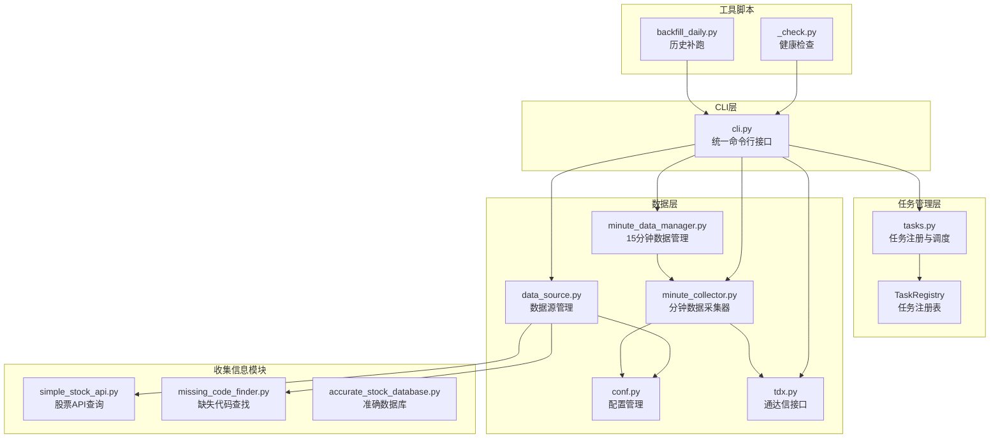
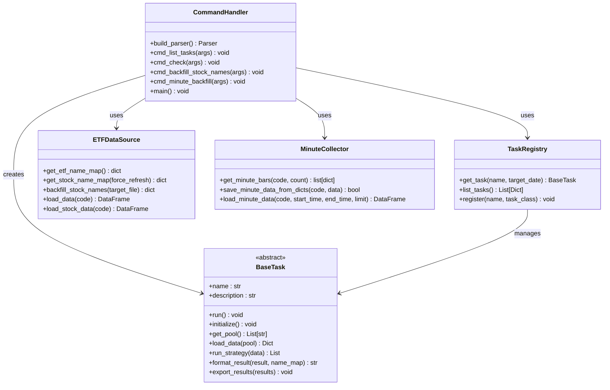
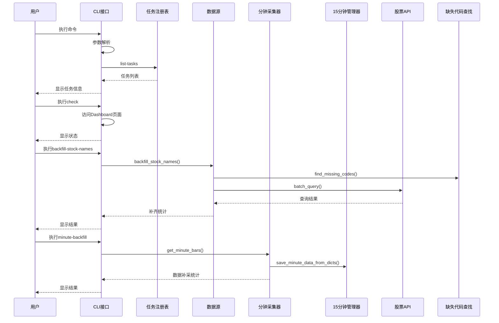
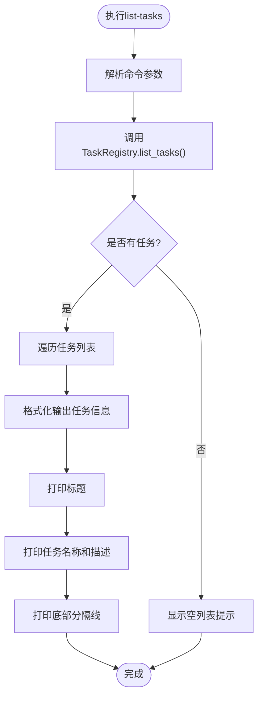
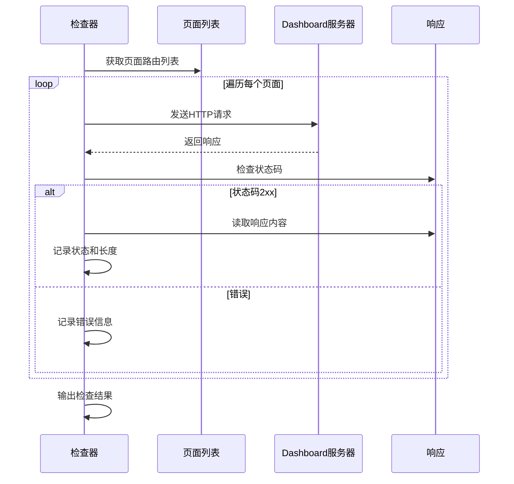
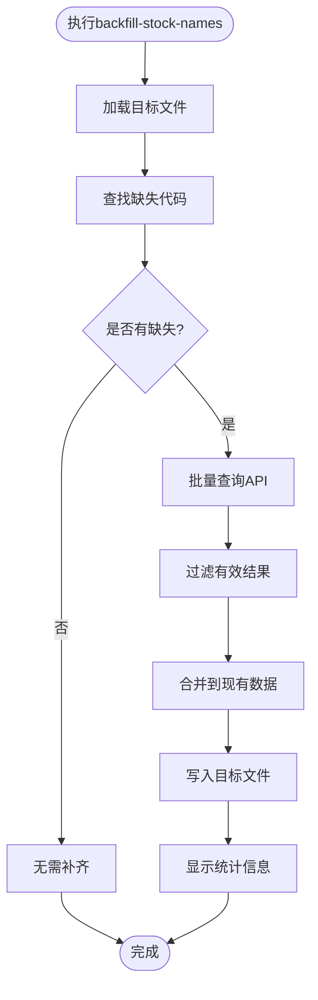
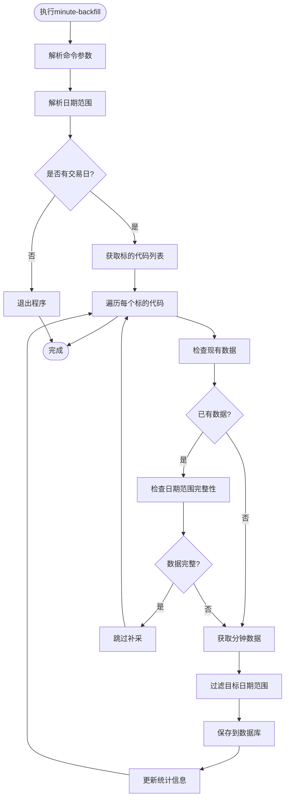
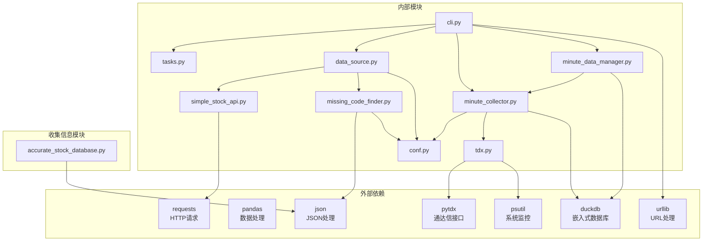

# 实用工具命令

<cite>
**本文档引用的文件**
- [cli.py](file://src/quant_etf/cli.py)
- [tasks.py](file://src/quant_etf/tasks.py)
- [data_source.py](file://src/quant_etf/data_source.py)
- [_check.py](file://_check.py)
- [backfill_daily.py](file://backfill_daily.py)
- [README.md](file://README.md)
- [conf.py](file://src/quant_etf/conf.py)
- [simple_stock_api.py](file://src/collect_info/simple_stock_api.py)
- [missing_code_finder.py](file://src/collect_info/missing_code_finder.py)
- [accurate_stock_database.py](file://src/collect_info/accurate_stock_database.py)
- [minute_collector.py](file://src/quant_etf/minute_collector.py)
- [minute_data_manager.py](file://src/quant_etf/minute_data_manager.py)
- [tdx.py](file://src/quant_etf/tdx.py)
</cite>

## 目录
1. [简介](#简介)
2. [项目结构](#项目结构)
3. [核心组件](#核心组件)
4. [架构概览](#架构概览)
5. [详细组件分析](#详细组件分析)
6. [依赖分析](#依赖分析)
7. [性能考虑](#性能考虑)
8. [故障排除指南](#故障排除指南)
9. [结论](#结论)

## 简介

Quant-ETF项目提供了四个重要的实用工具命令，用于系统维护、数据验证和问题诊断。这些命令包括：

- **list-tasks**: 列出所有可用的选股任务及其描述
- **check**: Dashboard健康检查，验证页面访问状态
- **backfill-stock-names**: 补齐股票代码名称数据
- **minute-backfill**: 补采历史分钟级K线数据

这些命令通过统一的CLI接口提供，简化了系统的日常维护工作。

## 项目结构

Quant-ETF项目采用模块化的架构设计，主要组件分布如下：



**图表来源**
- [cli.py:1-549](file://src/quant_etf/cli.py#L1-L549)
- [tasks.py:428-467](file://src/quant_etf/tasks.py#L428-L467)
- [data_source.py:15-381](file://src/quant_etf/data_source.py#L15-L381)
- [minute_collector.py:1-586](file://src/quant_etf/minute_collector.py#L1-L586)
- [minute_data_manager.py:1-283](file://src/quant_etf/minute_data_manager.py#L1-L283)
- [tdx.py:1-546](file://src/quant_etf/tdx.py#L1-L546)

**章节来源**
- [cli.py:1-549](file://src/quant_etf/cli.py#L1-L549)
- [README.md:70-276](file://README.md#L70-L276)

## 核心组件

### CLI命令系统

CLI系统通过统一的命令分发机制管理所有子命令，提供了一致的用户体验和参数处理。



**图表来源**
- [cli.py:296-382](file://src/quant_etf/cli.py#L296-L382)
- [tasks.py:30-177](file://src/quant_etf/tasks.py#L30-L177)
- [data_source.py:15-381](file://src/quant_etf/data_source.py#L15-L381)
- [minute_collector.py:85-226](file://src/quant_etf/minute_collector.py#L85-L226)

**章节来源**
- [cli.py:296-382](file://src/quant_etf/cli.py#L296-L382)
- [tasks.py:428-467](file://src/quant_etf/tasks.py#L428-L467)

## 架构概览

四个实用工具命令在系统中的位置和相互关系如下：



**图表来源**
- [cli.py:296-382](file://src/quant_etf/cli.py#L296-L382)
- [data_source.py:303-371](file://src/quant_etf/data_source.py#L303-L371)
- [minute_collector.py:145-248](file://src/quant_etf/minute_collector.py#L145-L248)

## 详细组件分析

### list-tasks 命令

#### 功能概述
list-tasks命令用于显示系统中所有可用的选股任务，包括任务名称和描述信息。

#### 实现机制
该命令通过任务注册表查询所有已注册的任务，并以友好的格式展示给用户。



**图表来源**
- [cli.py:296-307](file://src/quant_etf/cli.py#L296-L307)
- [tasks.py:452-459](file://src/quant_etf/tasks.py#L452-L459)

#### 使用场景
- 系统维护时了解可用任务
- 新用户学习系统功能
- 故障排查时确认任务状态

#### 参数说明
- 无参数选项
- 直接执行：`uv run quant-etf list-tasks`

#### 输出格式
```
========================================
Available tasks:
========================================
  etf        - ETF组合选股任务
  short      - 短线股票选股任务
  mid        - 中期反弹股票选股任务
========================================
```

**章节来源**
- [cli.py:296-307](file://src/quant_etf/cli.py#L296-L307)
- [tasks.py:452-459](file://src/quant_etf/tasks.py#L452-L459)

### check 命令

#### 功能概述
check命令用于Dashboard健康检查，验证各个页面路由的可访问性和响应状态。

#### 实现机制
该命令通过HTTP请求访问Dashboard的所有页面路由，检查响应状态码和内容长度。



**图表来源**
- [cli.py:309-322](file://src/quant_etf/cli.py#L309-L322)

#### 使用场景
- 系统启动后的健康验证
- 部署后的功能检查
- 故障排查时的快速诊断

#### 参数说明
- `--port`: 指定Dashboard端口，默认8080
- 示例：`uv run quant-etf check --port 8522`

#### 输出格式
```
/pages/overview: Status=200 Len=1234
/pages/portfolio: Status=200 Len=5678
/pages/strategy: Status=200 Len=9012
/pages/monitor: Status=200 Len=3456
/pages/alerts: Status=200 Len=7890
/pages/settings: Status=200 Len=2345
```

#### 错误处理
- 超时错误：显示超时信息
- 连接错误：显示连接失败
- 状态码非2xx：显示错误状态

**章节来源**
- [cli.py:309-322](file://src/quant_etf/cli.py#L309-L322)
- [_check.py:1-20](file://_check.py#L1-L20)

### backfill-stock-names 命令

#### 功能概述
backfill-stock-names命令用于补齐`stock_code_name.json`文件中缺失的股票代码名称信息。

#### 实现机制
该命令通过以下步骤完成数据补齐：



**图表来源**
- [cli.py:362-370](file://src/quant_etf/cli.py#L362-L370)
- [data_source.py:303-371](file://src/quant_etf/data_source.py#L303-L371)

#### 数据补齐流程

1. **缺失代码检测**：使用`missing_code_finder.find_missing_codes()`比较配置池与现有数据
2. **批量API查询**：通过`SimpleStockAPI.batch_query()`查询缺失代码的名称
3. **数据清洗**：标准化代码格式，过滤无效结果
4. **数据合并**：将新数据合并到现有JSON文件
5. **结果统计**：返回补齐统计信息

#### 使用场景
- 初始化项目时补齐基础数据
- 新增股票池后的数据同步
- 数据损坏后的恢复操作

#### 参数说明
- 无参数选项
- 直接执行：`uv run quant-etf backfill-stock-names`

#### 输出格式
```
补齐完成: {'missing': 15, 'filled': 12, 'failed': ['000001', '600036']}
```

#### 统计信息
- `missing`: 总缺失数量
- `filled`: 成功补齐数量  
- `failed`: 补齐失败的代码列表

**章节来源**
- [cli.py:362-370](file://src/quant_etf/cli.py#L362-L370)
- [data_source.py:303-371](file://src/quant_etf/data_source.py#L303-L371)

### minute-backfill 命令

#### 功能概述
minute-backfill命令用于补采历史分钟级K线数据，支持按天数、日期范围或指定标的代码进行数据补采。

#### 实现机制
该命令通过以下步骤完成历史数据补采：



**图表来源**
- [cli.py:145-248](file://src/quant_etf/cli.py#L145-L248)
- [minute_collector.py:145-248](file://src/quant_etf/minute_collector.py#L145-L248)

#### 数据补采流程

1. **日期范围解析**：根据`--days`、`--start`、`--end`参数解析交易日范围
2. **标的代码获取**：使用`ALL_POOL`配置或`--codes`参数指定的代码列表
3. **现有数据检查**：检查数据库中是否已有目标日期范围内的数据
4. **分钟数据获取**：通过`get_minute_bars()`从通达信服务器获取历史分钟数据
5. **数据过滤**：筛选目标日期范围内的分钟数据
6. **数据保存**：使用`save_minute_data_from_dicts()`保存到DuckDB数据库
7. **统计汇总**：输出补采结果统计信息

#### 使用场景
- 系统初始化后的历史数据补采
- 数据库损坏后的数据恢复
- 新增标的后的数据补齐
- 系统升级后的数据完整性检查

#### 参数说明
- `--days`: 最近N个交易日，默认30天
- `--start`: 开始日期，格式YYYY-MM-DD
- `--end`: 结束日期，格式YYYY-MM-DD
- `--codes`: 逗号分隔的标的代码列表，默认使用ALL_POOL

#### 输出格式
```
============================================================
分钟级K线数据补采
日期范围: 2026-01-01 ~ 2026-01-31
交易日: 22 天
标的数: 50
每只目标条数: ~5500
============================================================
[1/50] 补采 510050 ...
  数据已完整，跳过
[2/50] 补采 510310 ...
  数据库中最新: 2026-01-31 15:00:00
  目标范围内 250 条
  保存成功
...
补采完成!
  成功: 45/50
  失败: 5/50
  总数据: 5500 条
```

#### 统计信息
- `成功`: 补采成功的标的数量
- `失败`: 补采失败的标的数量
- `总数据`: 补采的分钟数据总条数

**章节来源**
- [cli.py:145-248](file://src/quant_etf/cli.py#L145-L248)
- [minute_collector.py:85-226](file://src/quant_etf/minute_collector.py#L85-L226)

## 依赖分析

### 组件间依赖关系



**图表来源**
- [cli.py:18-22](file://src/quant_etf/cli.py#L18-L22)
- [data_source.py:1-12](file://src/quant_etf/data_source.py#L1-L12)
- [simple_stock_api.py:8-13](file://src/collect_info/simple_stock_api.py#L8-L13)
- [minute_collector.py:13-23](file://src/quant_etf/minute_collector.py#L13-L23)
- [minute_data_manager.py:14-17](file://src/quant_etf/minute_data_manager.py#L14-L17)
- [tdx.py:4-8](file://src/quant_etf/tdx.py#L4-L8)

### 关键依赖特性

1. **HTTP客户端依赖**：使用`requests`库进行API查询
2. **数据处理依赖**：使用`pandas`进行数据操作
3. **数据库依赖**：使用`duckdb`进行高性能数据存储
4. **通达信接口依赖**：使用`pytdx`进行行情数据获取
5. **系统监控依赖**：使用`psutil`进行进程监控
6. **配置管理依赖**：通过`conf.py`集中管理配置
7. **文件系统依赖**：使用`pathlib`进行文件路径操作

**章节来源**
- [cli.py:18-22](file://src/quant_etf/cli.py#L18-L22)
- [data_source.py:1-12](file://src/quant_etf/data_source.py#L1-L12)

## 性能考虑

### list-tasks命令性能
- 时间复杂度：O(n)，其中n为任务数量
- 空间复杂度：O(n)
- 性能特点：几乎瞬时完成，无外部依赖

### check命令性能
- 时间复杂度：O(p)，其中p为页面数量
- 平均响应时间：< 5秒（默认超时）
- 并发处理：串行访问，避免过度请求

### backfill-stock-names命令性能
- 时间复杂度：O(m×d)，其中m为缺失代码数量，d为查询延迟
- 批量处理：使用0.3秒延迟避免API限制
- 数据缓存：利用现有缓存减少重复查询

### minute-backfill命令性能
- 时间复杂度：O(c×t×b)，其中c为标的数量，t为交易日数量，b为每交易日条数
- 数据库写入：使用批量插入优化写入性能
- 内存管理：分批处理避免内存溢出
- 服务器选择：智能选择可用的通达信服务器

## 故障排除指南

### list-tasks命令问题
**问题**：命令无法执行
- 检查Python环境和依赖安装
- 验证CLI入口配置
- 查看日志文件定位错误

**问题**：无任务显示
- 确认任务注册表配置
- 检查任务类继承关系
- 验证任务描述设置

### check命令问题
**问题**：页面访问失败
- 检查Dashboard服务状态
- 验证端口配置正确性
- 确认防火墙设置

**问题**：超时错误
- 增加超时时间参数
- 检查网络连接稳定性
- 验证服务器负载情况

### backfill-stock-names命令问题
**问题**：API查询失败
- 检查网络连接
- 验证API可用性
- 调整查询频率

**问题**：数据未更新
- 检查文件权限
- 验证JSON格式
- 确认目标路径存在

### minute-backfill命令问题
**问题**：数据获取失败
- 检查通达信服务器连接
- 验证标的代码有效性
- 确认交易日范围正确

**问题**：数据库写入失败
- 检查磁盘空间
- 验证数据库权限
- 确认DuckDB版本兼容性

**问题**：性能问题
- 减少同时处理的标的数量
- 调整批量大小参数
- 检查网络带宽限制

**章节来源**
- [cli.py:309-322](file://src/quant_etf/cli.py#L309-L322)
- [data_source.py:303-371](file://src/quant_etf/data_source.py#L303-L371)
- [minute_collector.py:145-248](file://src/quant_etf/minute_collector.py#L145-L248)

## 结论

Quant-ETF项目的实用工具命令为系统维护提供了强大的支持。通过list-tasks命令，用户可以轻松了解系统功能；通过check命令，可以快速验证系统健康状况；通过backfill-stock-names命令，可以自动化处理数据补齐任务；通过minute-backfill命令，可以高效补采历史分钟级数据。

这些命令的设计体现了以下特点：
- **统一接口**：通过CLI统一管理所有工具命令
- **模块化设计**：每个命令职责单一，便于维护
- **错误处理**：完善的异常处理和用户反馈机制
- **性能优化**：合理的超时设置和并发控制
- **数据完整性**：完整的数据补采和验证机制

建议在日常运维中定期使用这些工具命令，确保系统的稳定运行和数据的准确性。特别是minute-backfill命令，对于保证历史数据的完整性和系统分析的准确性具有重要意义。