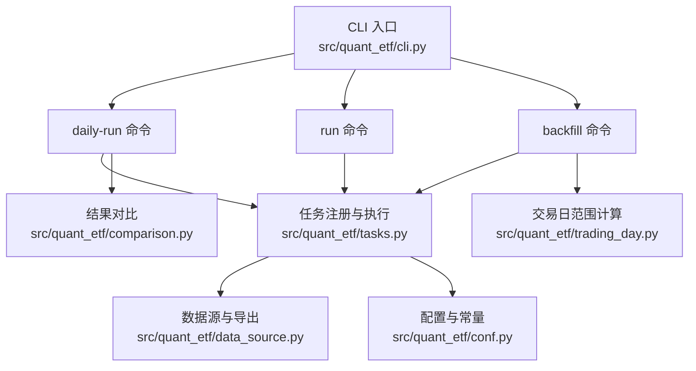
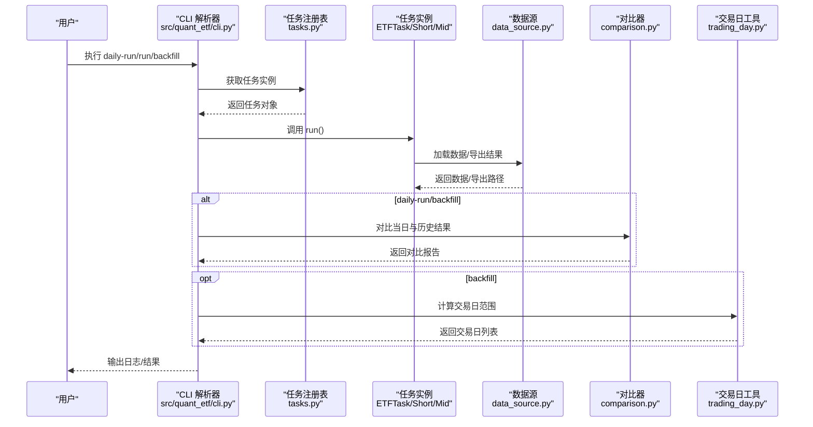
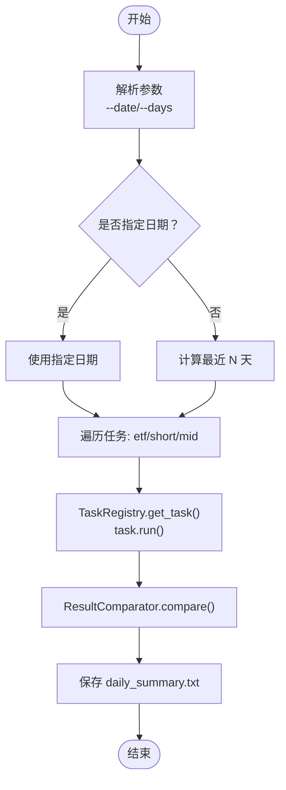
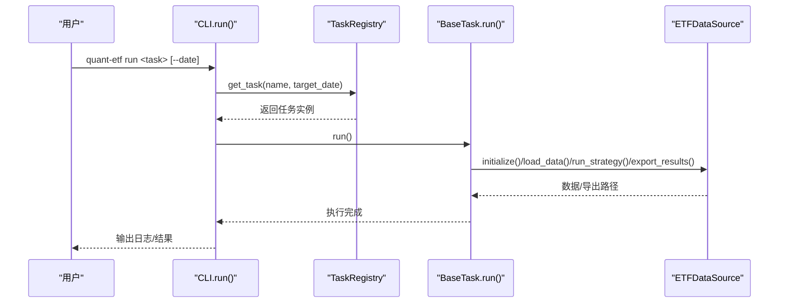
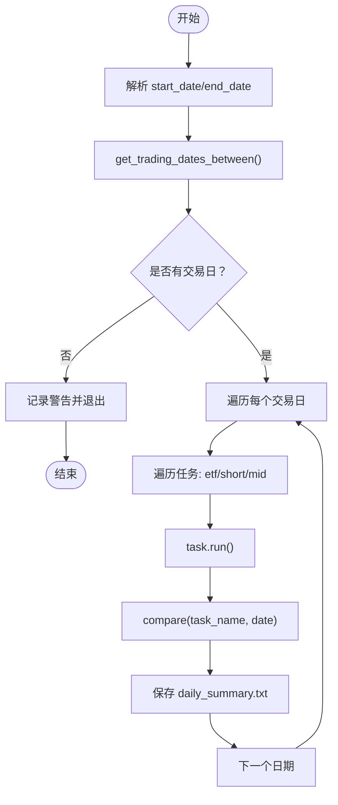
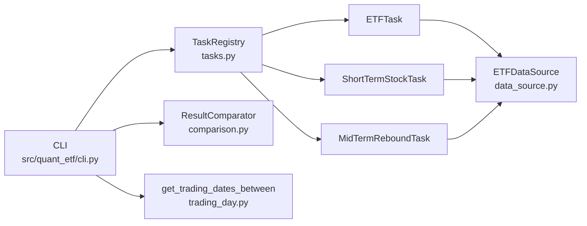

# 核心命令

<cite>
**本文引用的文件**
- [src/quant_etf/cli.py](file://src/quant_etf/cli.py)
- [run_daily.py](file://run_daily.py)
- [backfill_daily.py](file://backfill_daily.py)
- [src/quant_etf/tasks.py](file://src/quant_etf/tasks.py)
- [src/quant_etf/comparison.py](file://src/quant_etf/comparison.py)
- [src/quant_etf/trading_day.py](file://src/quant_etf/trading_day.py)
- [src/quant_etf/dashboard/services/strategy_runner.py](file://src/quant_etf/dashboard/services/strategy_runner.py)
- [README.md](file://README.md)
- [plan_daily_run.md](file://plan_daily_run.md)
- [src/quant_etf/conf.py](file://src/quant_etf/conf.py)
- [src/quant_etf/data_source.py](file://src/quant_etf/data_source.py)
</cite>

## 目录
1. [简介](#简介)
2. [项目结构](#项目结构)
3. [核心组件](#核心组件)
4. [架构总览](#架构总览)
5. [详细组件分析](#详细组件分析)
6. [依赖分析](#依赖分析)
7. [性能考虑](#性能考虑)
8. [故障排查指南](#故障排查指南)
9. [结论](#结论)
10. [附录](#附录)

## 简介
本文件聚焦 Quant-ETF 的三大核心命令：daily-run、run、backfill。它们分别负责：
- daily-run：每日批量执行 etf、short、mid 三种策略，并生成对比报告。
- run：单任务执行模式，按需选择 etf、short 或 mid 策略。
- backfill：历史日期批量补跑，支持交易日范围内的连续执行与结果对比。

文档将从命令语法、参数详解、执行流程、错误处理、日志记录、调试技巧等方面进行系统化说明，并结合项目中的计划文档与实现细节，帮助用户高效、稳定地使用这些命令。

## 项目结构
Quant-ETF 通过统一 CLI 入口集中管理所有命令，核心文件关系如下：
- 统一 CLI：src/quant_etf/cli.py
- 旧版脚本（兼容）：run_daily.py、backfill_daily.py
- 任务与策略：src/quant_etf/tasks.py
- 结果对比：src/quant_etf/comparison.py
- 交易日工具：src/quant_etf/trading_day.py
- Dashboard 异步执行器：src/quant_etf/dashboard/services/strategy_runner.py
- 配置与数据源：src/quant_etf/conf.py、src/quant_etf/data_source.py
- 文档与计划：README.md、plan_daily_run.md

**图示来源**
- [src/quant_etf/cli.py:324-399](file://src/quant_etf/cli.py#L324-L399)
- [src/quant_etf/tasks.py:411-450](file://src/quant_etf/tasks.py#L411-L450)
- [src/quant_etf/comparison.py:8-129](file://src/quant_etf/comparison.py#L8-L129)
- [src/quant_etf/trading_day.py:62-88](file://src/quant_etf/trading_day.py#L62-L88)
- [src/quant_etf/data_source.py:15-200](file://src/quant_etf/data_source.py#L15-L200)
- [src/quant_etf/conf.py:1-137](file://src/quant_etf/conf.py#L1-L137)

**章节来源**
- [README.md:70-230](file://README.md#L70-L230)
- [src/quant_etf/cli.py:324-399](file://src/quant_etf/cli.py#L324-L399)

## 核心组件
- CLI 解析与分发：统一解析参数并分发到各命令处理器。
- 任务注册与执行：通过 TaskRegistry 获取任务实例并执行 run()。
- 结果对比：ResultComparator 对比当日与历史 CSV，生成差异报告。
- 交易日范围：get_trading_dates_between 仅在交易日范围内执行 backfill。
- Dashboard 异步执行器：strategy_runner 提供异步策略执行与 SSE 广播能力（与 CLI 命令互补）。

**章节来源**
- [src/quant_etf/cli.py:24-186](file://src/quant_etf/cli.py#L24-L186)
- [src/quant_etf/tasks.py:411-450](file://src/quant_etf/tasks.py#L411-L450)
- [src/quant_etf/comparison.py:8-129](file://src/quant_etf/comparison.py#L8-L129)
- [src/quant_etf/trading_day.py:62-88](file://src/quant_etf/trading_day.py#L62-L88)
- [src/quant_etf/dashboard/services/strategy_runner.py:25-125](file://src/quant_etf/dashboard/services/strategy_runner.py#L25-L125)

## 架构总览
下图展示了 daily-run、run、backfill 三命令在系统中的位置与交互关系。

**图示来源**
- [src/quant_etf/cli.py:24-186](file://src/quant_etf/cli.py#L24-L186)
- [src/quant_etf/tasks.py:114-160](file://src/quant_etf/tasks.py#L114-L160)
- [src/quant_etf/comparison.py:37-129](file://src/quant_etf/comparison.py#L37-L129)
- [src/quant_etf/trading_day.py:62-88](file://src/quant_etf/trading_day.py#L62-L88)
- [src/quant_etf/data_source.py:189-200](file://src/quant_etf/data_source.py#L189-L200)

## 详细组件分析

### daily-run 命令
- 作用：每日批量执行 etf、short、mid 三种策略；对每个日期生成汇总对比报告；支持指定日期或最近 N 天。
- 关键行为：
  - 日期参数处理：支持 --date 指定日期或 --days 指定最近 N 天（默认 1 天）。
  - 批量运行：按顺序执行 etf、short、mid 任务，每个任务使用 TaskRegistry.get_task(name, target_date) 获取实例并调用 run()。
  - 结果对比：执行完成后，使用 ResultComparator.compare(task_name, date_str) 对比当日与历史结果，打印并保存到 data/results/{date}/daily_summary.txt。
  - 日志：将日志输出到 logs/daily_run_{YYYY-MM-DD}.log，便于排障。
- 使用示例：
  - 运行今天：uv run quant-etf daily-run
  - 运行最近 5 天：uv run quant-etf daily-run --days 5
  - 指定日期：uv run quant-etf daily-run --date 2026-05-20
- 最佳实践：
  - 建议在交易日结束后运行，确保数据完整。
  - 若需要历史回测，配合 backfill 命令使用。
  - 关注 logs 中的错误信息，定位任务加载或数据加载失败的原因。

**图示来源**
- [src/quant_etf/cli.py:24-70](file://src/quant_etf/cli.py#L24-L70)
- [src/quant_etf/comparison.py:37-129](file://src/quant_etf/comparison.py#L37-L129)

**章节来源**
- [src/quant_etf/cli.py:24-70](file://src/quant_etf/cli.py#L24-L70)
- [src/quant_etf/comparison.py:37-129](file://src/quant_etf/comparison.py#L37-L129)
- [README.md:95-109](file://README.md#L95-L109)

### run 命令
- 作用：单任务执行模式，按需选择 etf、short 或 mid 策略。
- 关键行为：
  - 任务选择：通过参数 task 指定（默认 etf）。
  - 日期指定：--date 指定目标日期（YYYY-MM-DD），用于数据切片与结果保存目录。
  - 执行过程：TaskRegistry.get_task(task_name, target_date) 获取实例，调用 run() 完成初始化、数据加载、策略运行、结果导出。
  - 日志：同时输出到控制台与 data/logs/quant_etf_{YYYY-MM-DD}.log。
- 使用示例：
  - ETF 选股：uv run quant-etf run etf
  - 短线选股：uv run quant-etf run short
  - 指定日期：uv run quant-etf run etf --date 2026-05-20
- 最佳实践：
  - 单任务调试时使用该命令，便于快速验证策略与数据。
  - 若任务失败，查看日志文件定位具体环节（初始化、数据加载、策略运行、导出）。

**图示来源**
- [src/quant_etf/cli.py:257-294](file://src/quant_etf/cli.py#L257-L294)
- [src/quant_etf/tasks.py:114-160](file://src/quant_etf/tasks.py#L114-L160)
- [src/quant_etf/data_source.py:189-200](file://src/quant_etf/data_source.py#L189-L200)

**章节来源**
- [src/quant_etf/cli.py:257-294](file://src/quant_etf/cli.py#L257-L294)
- [README.md:110-123](file://README.md#L110-L123)

### backfill 命令
- 作用：批量补跑历史日期任务，支持指定开始与结束日期。
- 关键行为：
  - 日期范围：接收 start_date 与 end_date，使用 trading_day.get_trading_dates_between 计算交易日列表。
  - 批量执行：对每个交易日依次运行 etf、short、mid 任务，并生成对比报告。
  - 结果比较：调用 ResultComparator.compare 对比当日与历史结果，打印并保存到 data/results/{date}/daily_summary.txt。
  - 日志：将日志输出到 logs/backfill_{YYYY-MM-DD}.log。
- 使用示例：
  - 补跑 2026-03-02 至 2026-03-05：uv run quant-etf backfill 2026-03-02 2026-03-05
- 最佳实践：
  - 确保交易日范围有效，避免非交易日导致任务不执行。
  - 补跑完成后，核对 data/results/{date}/daily_summary.txt 中的对比报告，确认策略结果稳定性。

**图示来源**
- [src/quant_etf/cli.py:144-186](file://src/quant_etf/cli.py#L144-L186)
- [src/quant_etf/trading_day.py:62-88](file://src/quant_etf/trading_day.py#L62-L88)
- [src/quant_etf/comparison.py:37-129](file://src/quant_etf/comparison.py#L37-L129)

**章节来源**
- [src/quant_etf/cli.py:144-186](file://src/quant_etf/cli.py#L144-L186)
- [src/quant_etf/trading_day.py:62-88](file://src/quant_etf/trading_day.py#L62-L88)
- [README.md:157-167](file://README.md#L157-L167)

## 依赖分析
- 命令到任务：daily-run/run/backfill 均依赖 TaskRegistry 获取任务实例，任务继承 BaseTask，统一 run() 流程。
- 任务到数据源：任务通过 ETFDataSource 加载 ETF/股票数据，导出 CSV 与 TDX 文件。
- 对比器：ResultComparator 依赖 CSV 文件与 ETFDataSource 名称映射，进行代码与名称的对比。
- 交易日：backfill 依赖 trading_day.get_trading_dates_between 保证只在交易日执行。
- Dashboard 异步执行器：strategy_runner 与 CLI 命令并行存在，前者用于 Dashboard 的异步策略执行与 SSE 广播。

**图示来源**
- [src/quant_etf/cli.py:24-186](file://src/quant_etf/cli.py#L24-L186)
- [src/quant_etf/tasks.py:411-450](file://src/quant_etf/tasks.py#L411-L450)
- [src/quant_etf/comparison.py:8-129](file://src/quant_etf/comparison.py#L8-L129)
- [src/quant_etf/trading_day.py:62-88](file://src/quant_etf/trading_day.py#L62-L88)
- [src/quant_etf/data_source.py:15-200](file://src/quant_etf/data_source.py#L15-L200)

**章节来源**
- [src/quant_etf/tasks.py:411-450](file://src/quant_etf/tasks.py#L411-L450)
- [src/quant_etf/comparison.py:8-129](file://src/quant_etf/comparison.py#L8-L129)
- [src/quant_etf/trading_day.py:62-88](file://src/quant_etf/trading_day.py#L62-L88)
- [src/quant_etf/data_source.py:15-200](file://src/quant_etf/data_source.py#L15-L200)

## 性能考虑
- 数据加载：ETFDataSource 优先使用本地 TDX 文件，其次缓存，最后在线获取，减少重复下载开销。
- 任务并行：CLI 命令为串行执行（逐日期、逐任务），避免并发竞争；如需加速可在业务层面引入外部调度器。
- CSV 导出：任务导出 CSV 与 TDX 文件，注意磁盘 IO；建议定期清理旧日志与结果文件。
- 对比器：对比逻辑基于 CSV 文件，建议保持文件命名规范与目录结构稳定，避免路径解析开销。

[本节为通用指导，无需特定文件来源]

## 故障排查指南
- 常见错误与定位：
  - 任务未找到：检查任务名是否为 etf/short/mid，确认 TaskRegistry 注册。
  - 数据加载失败：检查 TDX 数据目录配置（TDX_DATA_PATH），确认 .day 文件存在。
  - 日期参数错误：确保 --date 或 start_date/end_date 格式为 YYYY-MM-DD。
  - 交易日范围为空：backfill 时检查日期区间是否包含交易日。
- 日志与输出：
  - daily-run：logs/daily_run_{YYYY-MM-DD}.log
  - run：控制台 + data/logs/quant_etf_{YYYY-MM-DD}.log
  - backfill：logs/backfill_{YYYY-MM-DD}.log
- 调试技巧：
  - 使用 run 命令单独执行某个任务，缩小问题范围。
  - 检查 data/results/{date} 下的 CSV 文件是否存在，确认导出成功。
  - 对比 data/results/{date}/daily_summary.txt，关注新增、退出、变化项。

**章节来源**
- [src/quant_etf/cli.py:24-186](file://src/quant_etf/cli.py#L24-L186)
- [src/quant_etf/tasks.py:114-160](file://src/quant_etf/tasks.py#L114-L160)
- [src/quant_etf/comparison.py:37-129](file://src/quant_etf/comparison.py#L37-L129)
- [src/quant_etf/data_source.py:189-200](file://src/quant_etf/data_source.py#L189-L200)

## 结论
- daily-run：适合日常批量执行与对比，建议在交易日结束后运行，配合 backfill 进行历史验证。
- run：适合单任务调试与验证，参数灵活，日志完备。
- backfill：适合历史回测与对比，注意交易日范围的有效性。
- 建议：结合 Dashboard 的异步执行器（strategy_runner）与 CLI 命令形成“离线批处理 + 在线监控”的完整工作流。

[本节为总结，无需特定文件来源]

## 附录

### 命令语法与参数速查
- daily-run
  - 语法：uv run quant-etf daily-run [--days N] [--date YYYY-MM-DD]
  - 参数：
    - --days, -d：运行最近 N 天（默认 1）
    - --date：指定日期（YYYY-MM-DD）
- run
  - 语法：uv run quant-etf run [task] [--date YYYY-MM-DD]
  - 参数：
    - task：etf/short/mid（默认 etf）
    - --date：指定日期（YYYY-MM-DD）
- backfill
  - 语法：uv run quant-etf backfill start_date end_date
  - 参数：
    - start_date：开始日期（YYYY-MM-DD）
    - end_date：结束日期（YYYY-MM-DD）

**章节来源**
- [README.md:95-167](file://README.md#L95-L167)
- [src/quant_etf/cli.py:324-399](file://src/quant_etf/cli.py#L324-L399)

### 任务与导出
- 任务导出 CSV：data/results/{date}/{task}.csv
- ETF 导出 TDX 文件：自定义板块与公式文件
- 股票导出 TDX 文件：blk 文件

**章节来源**
- [src/quant_etf/tasks.py:56-78](file://src/quant_etf/tasks.py#L56-L78)
- [src/quant_etf/tasks.py:241-278](file://src/quant_etf/tasks.py#L241-L278)
- [src/quant_etf/tasks.py:312-342](file://src/quant_etf/tasks.py#L312-L342)
- [src/quant_etf/tasks.py:379-409](file://src/quant_etf/tasks.py#L379-L409)

### 与计划文档的对应
- daily-run 的设计目标与实现基本一致：批量执行、CSV 持久化、对比报告、日志记录。
- backfill 的设计目标：交易日范围内的批量补跑与对比。

**章节来源**
- [plan_daily_run.md:1-59](file://plan_daily_run.md#L1-L59)