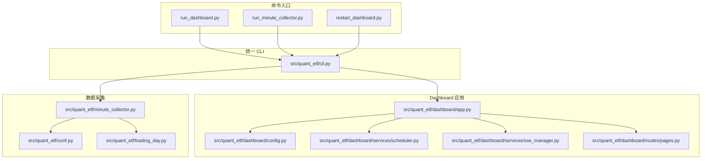
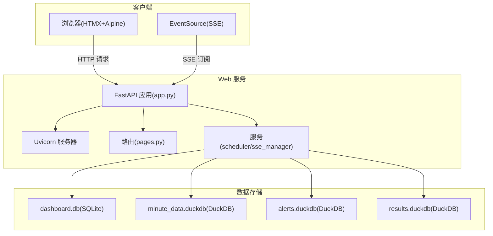
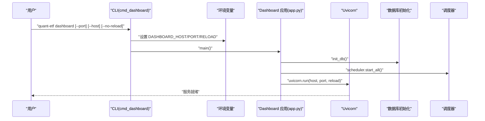
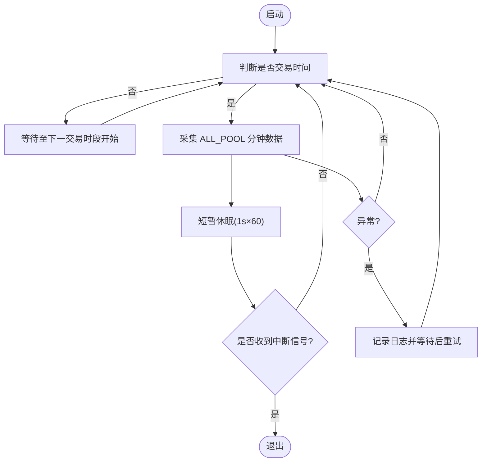
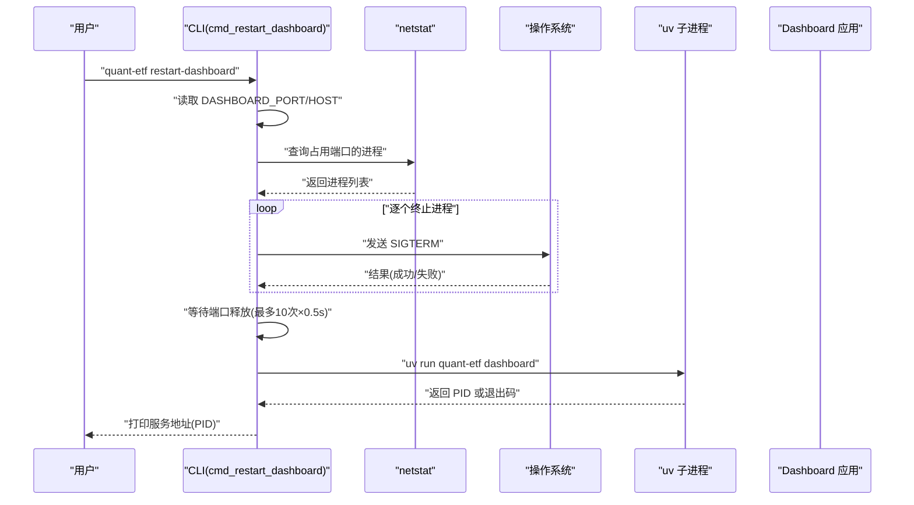
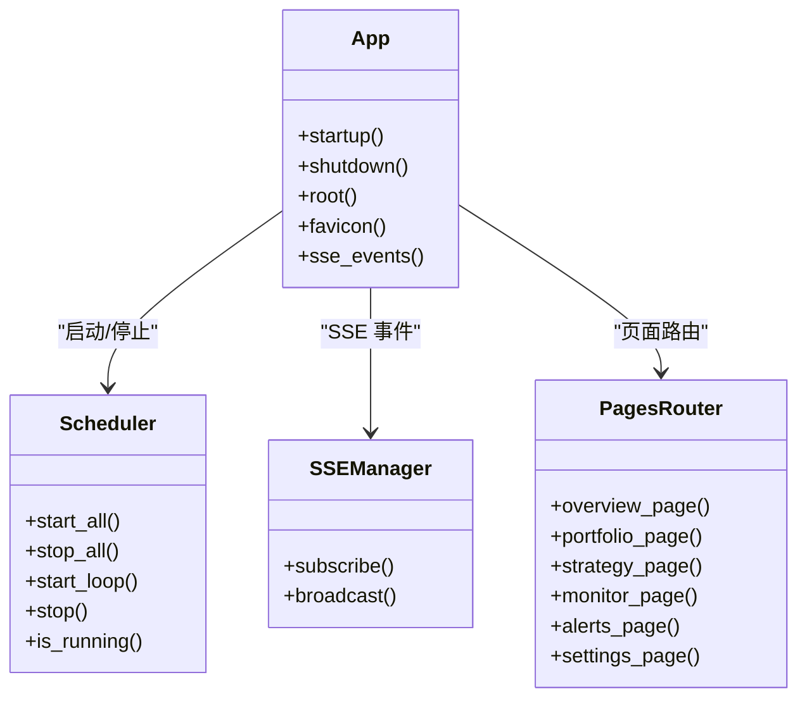
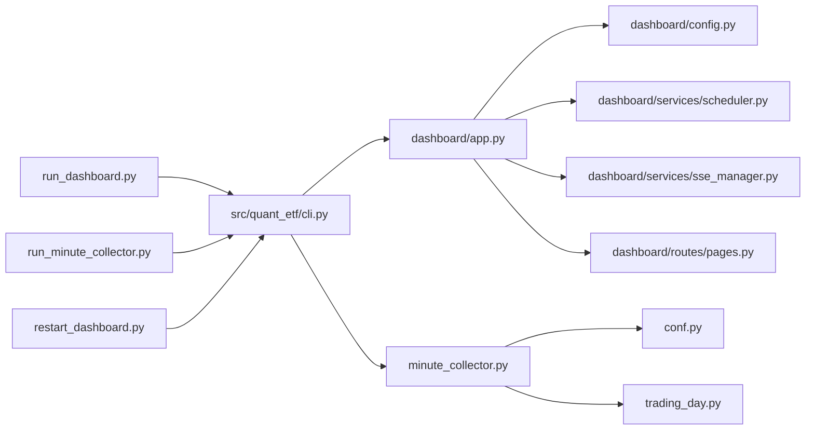

# 监控命令

<cite>
**本文引用的文件**
- [run_dashboard.py](file://run_dashboard.py)
- [run_minute_collector.py](file://run_minute_collector.py)
- [restart_dashboard.py](file://restart_dashboard.py)
- [src/quant_etf/cli.py](file://src/quant_etf/cli.py)
- [src/quant_etf/dashboard/app.py](file://src/quant_etf/dashboard/app.py)
- [src/quant_etf/dashboard/config.py](file://src/quant_etf/dashboard/config.py)
- [src/quant_etf/minute_collector.py](file://src/quant_etf/minute_collector.py)
- [src/quant_etf/dashboard/services/scheduler.py](file://src/quant_etf/dashboard/services/scheduler.py)
- [src/quant_etf/dashboard/services/sse_manager.py](file://src/quant_etf/dashboard/services/sse_manager.py)
- [src/quant_etf/dashboard/routes/pages.py](file://src/quant_etf/dashboard/routes/pages.py)
- [src/quant_etf/conf.py](file://src/quant_etf/conf.py)
- [src/quant_etf/trading_day.py](file://src/quant_etf/trading_day.py)
- [README.md](file://README.md)
</cite>

## 目录
1. [简介](#简介)
2. [项目结构](#项目结构)
3. [核心组件](#核心组件)
4. [架构总览](#架构总览)
5. [详细组件分析](#详细组件分析)
6. [依赖分析](#依赖分析)
7. [性能考虑](#性能考虑)
8. [故障排除指南](#故障排除指南)
9. [结论](#结论)
10. [附录](#附录)

## 简介
本文件面向 Quant-ETF 的监控相关命令，聚焦以下三个命令的完整使用与原理说明：
- dashboard：Web 监控系统启动与配置
- minute-collect：分钟级 K 线实时采集与异常恢复
- restart-dashboard：服务重启流程与健康检查

文档将从系统架构、组件关系、数据流、处理逻辑、集成点、错误处理与性能特性等方面进行深入剖析，并提供参数说明、运行示例与故障排除建议。

## 项目结构
监控相关命令位于项目根目录的入口脚本与统一 CLI 中，配合 Dashboard 的 FastAPI 应用、定时调度与 SSE 实时推送服务，形成完整的监控体系。

**图示来源**
- [run_dashboard.py:1-20](file://run_dashboard.py#L1-L20)
- [run_minute_collector.py:1-20](file://run_minute_collector.py#L1-L20)
- [restart_dashboard.py:1-20](file://restart_dashboard.py#L1-L20)
- [src/quant_etf/cli.py:324-359](file://src/quant_etf/cli.py#L324-L359)
- [src/quant_etf/dashboard/app.py:17-101](file://src/quant_etf/dashboard/app.py#L17-L101)
- [src/quant_etf/dashboard/config.py:16-25](file://src/quant_etf/dashboard/config.py#L16-L25)
- [src/quant_etf/dashboard/services/scheduler.py:15-82](file://src/quant_etf/dashboard/services/scheduler.py#L15-L82)
- [src/quant_etf/dashboard/services/sse_manager.py:10-45](file://src/quant_etf/dashboard/services/sse_manager.py#L10-L45)
- [src/quant_etf/dashboard/routes/pages.py:13-75](file://src/quant_etf/dashboard/routes/pages.py#L13-L75)
- [src/quant_etf/minute_collector.py:158-233](file://src/quant_etf/minute_collector.py#L158-L233)
- [src/quant_etf/conf.py:97-99](file://src/quant_etf/conf.py#L97-L99)
- [src/quant_etf/trading_day.py:33-89](file://src/quant_etf/trading_day.py#L33-L89)

**章节来源**
- [run_dashboard.py:1-20](file://run_dashboard.py#L1-L20)
- [run_minute_collector.py:1-20](file://run_minute_collector.py#L1-L20)
- [restart_dashboard.py:1-20](file://restart_dashboard.py#L1-L20)
- [src/quant_etf/cli.py:324-359](file://src/quant_etf/cli.py#L324-L359)
- [README.md:319-381](file://README.md#L319-L381)

## 核心组件
- dashboard 命令：通过统一 CLI 解析参数，设置环境变量，调用 Dashboard 应用入口启动 Web 服务；支持端口、主机与热重载控制。
- minute-collect 命令：解析参数后启动分钟级数据采集循环，基于交易时间判断与等待逻辑，处理信号与异常，实现稳定的数据采集。
- restart-dashboard 命令：查询并终止旧进程，等待端口释放，再以 uv 子进程方式启动新服务，并进行健康检查。

**章节来源**
- [src/quant_etf/cli.py:72-84](file://src/quant_etf/cli.py#L72-L84)
- [src/quant_etf/cli.py:86-142](file://src/quant_etf/cli.py#L86-L142)
- [src/quant_etf/cli.py:189-255](file://src/quant_etf/cli.py#L189-L255)

## 架构总览
Dashboard 采用 FastAPI + Uvicorn，结合 SQLite/DuckDB 数据存储与 SSE 实时推送，提供策略执行、持仓管理、监控调度与告警展示的全栈监控界面。

**图示来源**
- [src/quant_etf/dashboard/app.py:17-101](file://src/quant_etf/dashboard/app.py#L17-L101)
- [src/quant_etf/dashboard/routes/pages.py:13-75](file://src/quant_etf/dashboard/routes/pages.py#L13-L75)
- [src/quant_etf/dashboard/services/scheduler.py:15-82](file://src/quant_etf/dashboard/services/scheduler.py#L15-L82)
- [src/quant_etf/dashboard/services/sse_manager.py:10-45](file://src/quant_etf/dashboard/services/sse_manager.py#L10-L45)
- [README.md:319-381](file://README.md#L319-L381)

## 详细组件分析

### dashboard 命令
- 参数与行为
  - --port/-p：监听端口，默认 8522，可通过环境变量覆盖。
  - --host：监听地址，默认 127.0.0.1，可通过环境变量覆盖。
  - --no-reload：禁用热重载。
- 环境变量控制
  - DASHBOARD_HOST、DASHBOARD_PORT：分别控制主机与端口。
  - DASHBOARD_RELOAD：默认 true，设为 false 可禁用热重载。
- 启动流程
  - CLI 解析参数后设置环境变量，调用 Dashboard 应用入口。
  - 应用在 startup 事件中初始化数据库与调度器，在 shutdown 事件中停止调度器。
  - Uvicorn 根据配置启动服务，支持 Windows 下的信号处理以保证 Ctrl+C 正常退出。

**图示来源**
- [src/quant_etf/cli.py:72-84](file://src/quant_etf/cli.py#L72-L84)
- [src/quant_etf/dashboard/app.py:53-65](file://src/quant_etf/dashboard/app.py#L53-L65)
- [src/quant_etf/dashboard/app.py:74-96](file://src/quant_etf/dashboard/app.py#L74-L96)
- [src/quant_etf/dashboard/config.py:16-18](file://src/quant_etf/dashboard/config.py#L16-L18)

**章节来源**
- [src/quant_etf/cli.py:72-84](file://src/quant_etf/cli.py#L72-L84)
- [src/quant_etf/dashboard/app.py:74-96](file://src/quant_etf/dashboard/app.py#L74-L96)
- [src/quant_etf/dashboard/config.py:16-18](file://src/quant_etf/dashboard/config.py#L16-L18)

### minute-collect 命令
- 参数与行为
  - 无参数，支持 Ctrl+C 优雅退出。
- 交易时间判断与等待
  - is_trading_time()：判断当前是否为周一至周五的 9:30-11:30 或 13:00-15:00。
  - wait_until_trading_start()：计算下一个交易时段开始时间并循环等待，支持中断。
- 数据采集循环
  - 循环内若非交易时间则等待；进入交易时间后采集 ALL_POOL 标的的分钟数据，使用 collect_minute_data_for_all() 并记录结果。
  - 每次采集完成后休眠若干秒，期间可响应信号中断。
- 异常恢复机制
  - 捕获异常并记录日志，等待一段时间后继续循环，避免因个别错误导致整个采集器崩溃。
- 信号处理
  - 注册 SIGINT/SIGTERM 处理器，收到信号后设置 running 标志，优雅退出。

**图示来源**
- [src/quant_etf/minute_collector.py:158-233](file://src/quant_etf/minute_collector.py#L158-L233)
- [src/quant_etf/minute_collector.py:458-488](file://src/quant_etf/minute_collector.py#L458-L488)
- [src/quant_etf/cli.py:86-142](file://src/quant_etf/cli.py#L86-L142)
- [src/quant_etf/conf.py:97-99](file://src/quant_etf/conf.py#L97-L99)

**章节来源**
- [src/quant_etf/minute_collector.py:158-233](file://src/quant_etf/minute_collector.py#L158-L233)
- [src/quant_etf/minute_collector.py:458-488](file://src/quant_etf/minute_collector.py#L458-L488)
- [src/quant_etf/cli.py:86-142](file://src/quant_etf/cli.py#L86-L142)
- [src/quant_etf/conf.py:97-99](file://src/quant_etf/conf.py#L97-L99)

### restart-dashboard 命令
- 端口检测
  - 读取 DASHBOARD_PORT（默认 8522）与 DASHBOARD_HOST（默认 127.0.0.1），使用 netstat 查询占用该端口的进程。
- 进程终止
  - 对找到的进程发送 SIGTERM，打印终止信息；若失败则输出警告。
- 端口释放等待
  - 循环等待最多 10 次，每次 0.5 秒，确认端口不再被占用。
- 新服务启动
  - 使用 uv 子进程以 “quant-etf dashboard” 启动新服务，隐藏标准输出与错误输出，创建新进程组。
  - 若子进程立即退出，打印错误并退出码。
- 健康检查
  - 启动后打印新服务 URL（http://HOST:PORT，PID），便于确认服务状态。

**图示来源**
- [src/quant_etf/cli.py:189-255](file://src/quant_etf/cli.py#L189-L255)

**章节来源**
- [src/quant_etf/cli.py:189-255](file://src/quant_etf/cli.py#L189-L255)

### Dashboard 应用与服务
- 应用入口与路由
  - FastAPI 应用挂载页面路由与 API 路由，提供根路径重定向、favicon、SSE 事件流端点。
- 启停事件
  - startup：初始化数据库与调度器；shutdown：停止所有调度任务。
- SSE 实时推送
  - SSEManager 维护订阅队列集合，心跳保活，广播策略执行结果与错误事件。
- 调度器
  - 从数据库查询启用的调度，异步循环执行策略，更新最后运行时间并通过 SSE 广播结果。

**图示来源**
- [src/quant_etf/dashboard/app.py:17-101](file://src/quant_etf/dashboard/app.py#L17-L101)
- [src/quant_etf/dashboard/services/scheduler.py:15-82](file://src/quant_etf/dashboard/services/scheduler.py#L15-L82)
- [src/quant_etf/dashboard/services/sse_manager.py:10-45](file://src/quant_etf/dashboard/services/sse_manager.py#L10-L45)
- [src/quant_etf/dashboard/routes/pages.py:13-75](file://src/quant_etf/dashboard/routes/pages.py#L13-L75)

**章节来源**
- [src/quant_etf/dashboard/app.py:17-101](file://src/quant_etf/dashboard/app.py#L17-L101)
- [src/quant_etf/dashboard/services/scheduler.py:15-82](file://src/quant_etf/dashboard/services/scheduler.py#L15-L82)
- [src/quant_etf/dashboard/services/sse_manager.py:10-45](file://src/quant_etf/dashboard/services/sse_manager.py#L10-L45)
- [src/quant_etf/dashboard/routes/pages.py:13-75](file://src/quant_etf/dashboard/routes/pages.py#L13-L75)

## 依赖分析
- 命令入口脚本与统一 CLI 的关系
  - run_dashboard.py、run_minute_collector.py、restart_dashboard.py 作为旧版入口脚本，现已重定向到统一 CLI，便于维护与扩展。
- Dashboard 应用依赖
  - 依赖配置模块读取主机与端口，依赖数据库初始化与调度器，依赖模板与路由模块。
- 数据采集依赖
  - 依赖配置中的 ALL_POOL，依赖交易日工具与 TDX 数据源。

**图示来源**
- [run_dashboard.py:13-19](file://run_dashboard.py#L13-L19)
- [run_minute_collector.py:13-19](file://run_minute_collector.py#L13-L19)
- [restart_dashboard.py:13-19](file://restart_dashboard.py#L13-L19)
- [src/quant_etf/cli.py:72-84](file://src/quant_etf/cli.py#L72-L84)
- [src/quant_etf/dashboard/app.py:10-15](file://src/quant_etf/dashboard/app.py#L10-L15)
- [src/quant_etf/minute_collector.py:19](file://src/quant_etf/minute_collector.py#L19)

**章节来源**
- [run_dashboard.py:13-19](file://run_dashboard.py#L13-L19)
- [run_minute_collector.py:13-19](file://run_minute_collector.py#L13-L19)
- [restart_dashboard.py:13-19](file://restart_dashboard.py#L13-L19)
- [src/quant_etf/cli.py:72-84](file://src/quant_etf/cli.py#L72-L84)
- [src/quant_etf/dashboard/app.py:10-15](file://src/quant_etf/dashboard/app.py#L10-L15)
- [src/quant_etf/minute_collector.py:19](file://src/quant_etf/minute_collector.py#L19)

## 性能考虑
- 热重载控制
  - 在开发阶段启用热重载可提升迭代效率；生产环境建议禁用热重载以减少资源消耗。
- SSE 心跳与连接管理
  - SSE 心跳间隔默认 30 秒，有助于维持长连接稳定；订阅端断开后自动清理队列，避免内存泄漏。
- 数据库与索引
  - 分钟数据表建立复合主键与索引，提高查询与插入性能；建议定期维护索引与统计信息。
- 采集频率与并发
  - minute-collect 采用顺序采集 ALL_POOL 标的，避免对行情服务器造成过大压力；可根据网络与服务器能力适当调整采集间隔。
- 端口与进程管理
  - restart-dashboard 在终止旧进程后等待端口释放，避免端口冲突；新服务以子进程方式启动，便于隔离与监控。

[本节为通用性能建议，不直接分析具体文件]

## 故障排除指南
- dashboard 启动失败
  - 检查端口占用：确认 DASHBOARD_PORT 未被其他进程占用；必要时更换端口。
  - 环境变量：确认 DASHBOARD_HOST 与 DASHBOARD_PORT 设置正确。
  - 热重载：在 Windows 下如遇 Ctrl+C 无法退出，可添加 --no-reload 参数。
- minute-collect 无法采集数据
  - 交易时间：确保在交易时间内运行；非交易时间会自动等待。
  - 服务器连通性：检查 TDX 数据源与网络；若服务器失败会被加入冷却列表，稍后再试。
  - 日志：查看 logs 目录下对应日期的日志文件，定位异常。
- restart-dashboard 无法重启
  - 权限：确保当前用户有权限终止目标进程。
  - 端口释放：等待端口释放超时后仍被占用，可手动排查 netstat 输出。
  - 新服务启动：若 uv 子进程立即退出，检查返回码与日志。

**章节来源**
- [src/quant_etf/dashboard/app.py:80-96](file://src/quant_etf/dashboard/app.py#L80-L96)
- [src/quant_etf/minute_collector.py:23-102](file://src/quant_etf/minute_collector.py#L23-L102)
- [src/quant_etf/cli.py:189-255](file://src/quant_etf/cli.py#L189-L255)

## 结论
本文档系统梳理了 Quant-ETF 监控相关命令的实现与使用方法，涵盖 dashboard、minute-collect、restart-dashboard 的启动流程、参数配置、异常恢复与服务重启机制。通过统一 CLI 与模块化设计，监控系统具备良好的可维护性与扩展性。建议在生产环境中合理配置端口与热重载，关注 SSE 连接与数据库性能，并结合日志与健康检查保障系统稳定运行。

[本节为总结性内容，不直接分析具体文件]

## 附录
- 命令参数与示例
  - dashboard
    - 参数：--port/-p、--host、--no-reload
    - 示例：uv run quant-etf dashboard --port 8080 --host 0.0.0.0 --no-reload
  - minute-collect
    - 参数：无
    - 示例：uv run quant-etf minute-collect
  - restart-dashboard
    - 参数：无
    - 示例：uv run quant-etf restart-dashboard
  - check（健康检查）
    - 参数：--port
    - 示例：uv run quant-etf check --port 8522

**章节来源**
- [README.md:130-188](file://README.md#L130-L188)
- [src/quant_etf/cli.py:335-359](file://src/quant_etf/cli.py#L335-L359)