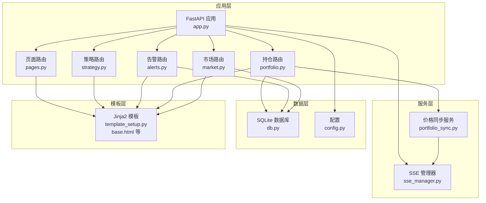
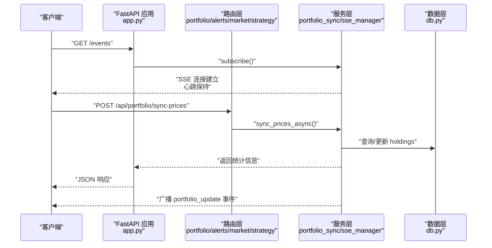
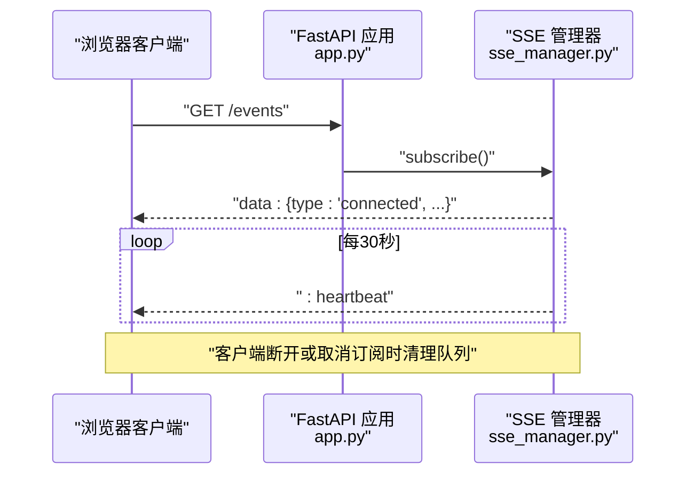
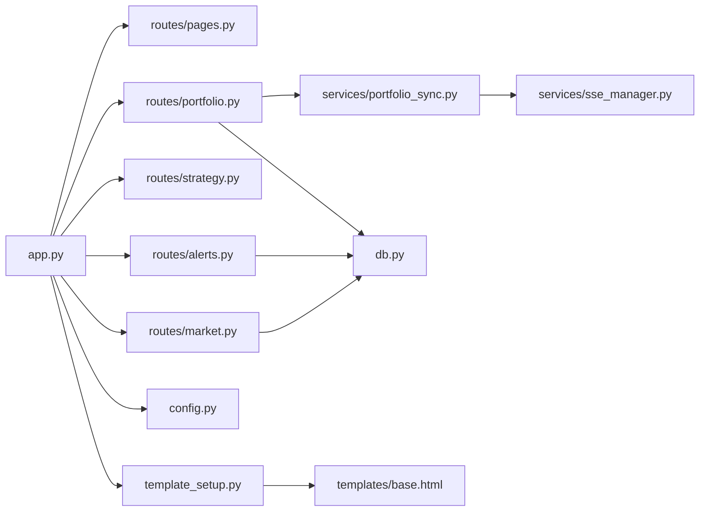
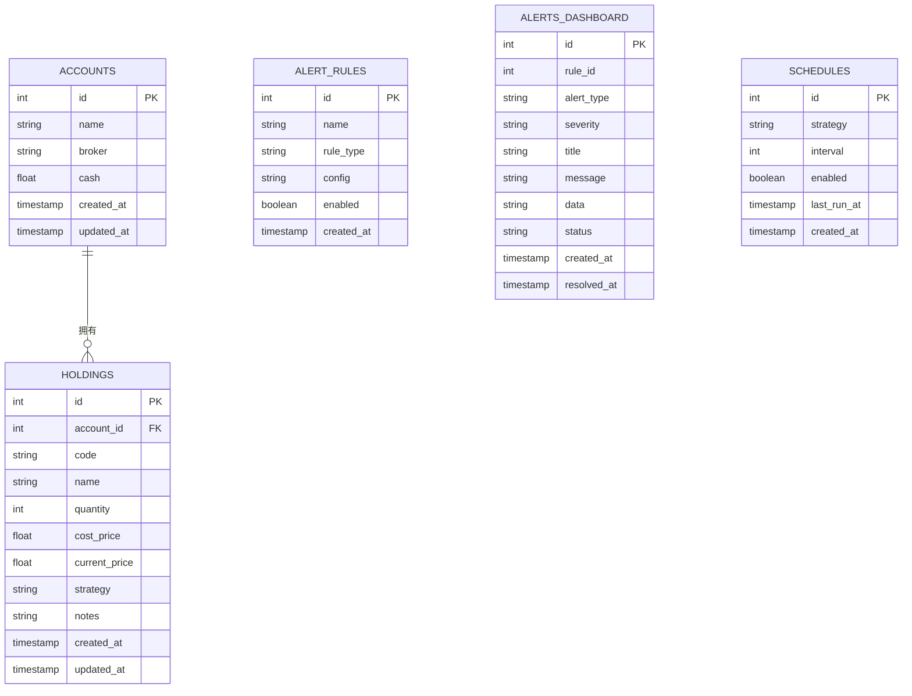

# API接口文档

<cite>
**本文档引用的文件**
- [app.py](file://src/quant_etf/dashboard/app.py)
- [portfolio.py](file://src/quant_etf/dashboard/routes/portfolio.py)
- [alerts.py](file://src/quant_etf/dashboard/routes/alerts.py)
- [market.py](file://src/quant_etf/dashboard/routes/market.py)
- [strategy.py](file://src/quant_etf/dashboard/routes/strategy.py)
- [pages.py](file://src/quant_etf/dashboard/routes/pages.py)
- [sse_manager.py](file://src/quant_etf/dashboard/services/sse_manager.py)
- [portfolio_sync.py](file://src/quant_etf/dashboard/services/portfolio_sync.py)
- [models.py](file://src/quant_etf/dashboard/models.py)
- [db.py](file://src/quant_etf/dashboard/db.py)
- [config.py](file://src/quant_etf/dashboard/config.py)
- [base.html](file://src/quant_etf/dashboard/templates/base.html)
- [test_dashboard_api_e2e.py](file://tests/e2e/test_dashboard_api_e2e.py)
</cite>

## 目录
1. [简介](#简介)
2. [项目结构](#项目结构)
3. [核心组件](#核心组件)
4. [架构总览](#架构总览)
5. [详细组件分析](#详细组件分析)
6. [依赖关系分析](#依赖关系分析)
7. [性能考虑](#性能考虑)
8. [故障排除指南](#故障排除指南)
9. [结论](#结论)
10. [附录](#附录)

## 简介
本文件为 Dashboard 的 RESTful API 接口文档，覆盖以下业务域：
- 持仓管理：账户与持仓的增删改查、价格同步
- 策略执行：策略列表、启动执行、状态查询与结果渲染
- 告警管理：告警规则的增删查、仪表盘告警列表与状态变更、监控信号查看
- 市场数据：市场状态、总览统计、调度配置的增删改查与启停
- 实时事件：SSE 事件流的连接、心跳与断线重连

同时包含 API 版本控制、错误码与状态码说明、认证授权机制、请求与响应示例。

## 项目结构
Dashboard 使用 FastAPI 提供 REST API，并通过 Jinja2 模板渲染页面；SSE 事件由独立管理器统一广播；数据持久化采用 SQLite，部分监控信号存储在 DuckDB。

**图示来源**
- [app.py:17-24](file://src/quant_etf/dashboard/app.py#L17-L24)
- [portfolio.py:15](file://src/quant_etf/dashboard/routes/portfolio.py#L15)
- [strategy.py:15](file://src/quant_etf/dashboard/routes/strategy.py#L15)
- [alerts.py:13](file://src/quant_etf/dashboard/routes/alerts.py#L13)
- [market.py:15](file://src/quant_etf/dashboard/routes/market.py#L15)
- [pages.py:13](file://src/quant_etf/dashboard/routes/pages.py#L13)
- [sse_manager.py:10-45](file://src/quant_etf/dashboard/services/sse_manager.py#L10-L45)
- [portfolio_sync.py:15-87](file://src/quant_etf/dashboard/services/portfolio_sync.py#L15-L87)
- [db.py:69-133](file://src/quant_etf/dashboard/db.py#L69-L133)
- [config.py:1-25](file://src/quant_etf/dashboard/config.py#L1-L25)
- [base.html:1-154](file://src/quant_etf/dashboard/templates/base.html#L1-L154)

**章节来源**
- [app.py:17-24](file://src/quant_etf/dashboard/app.py#L17-L24)
- [config.py:1-25](file://src/quant_etf/dashboard/config.py#L1-L25)

## 核心组件
- FastAPI 应用与路由挂载：在应用启动时注册页面与各业务模块路由，并暴露 SSE 事件流端点。
- SSE 管理器：维护客户端队列，支持订阅、广播与心跳。
- 数据层：SQLite 表结构涵盖账户、持仓、告警规则、仪表盘告警与调度配置。
- 模型校验：Pydantic 模型用于请求体参数校验。
- 模板系统：Jinja2 渲染页面片段，支持 HTMX 无刷新交互。

**章节来源**
- [app.py:17-50](file://src/quant_etf/dashboard/app.py#L17-L50)
- [sse_manager.py:10-45](file://src/quant_etf/dashboard/services/sse_manager.py#L10-L45)
- [db.py:11-66](file://src/quant_etf/dashboard/db.py#L11-L66)
- [models.py:1-54](file://src/quant_etf/dashboard/models.py#L1-L54)
- [template_setup.py:1-10](file://src/quant_etf/dashboard/template_setup.py#L1-L10)

## 架构总览
Dashboard API 采用分层架构：路由层负责 HTTP 协议与参数解析，服务层处理业务逻辑，数据层负责持久化，模板层负责页面渲染。SSE 作为独立服务向客户端推送事件。

**图示来源**
- [app.py:39-50](file://src/quant_etf/dashboard/app.py#L39-L50)
- [portfolio_sync.py:69-87](file://src/quant_etf/dashboard/services/portfolio_sync.py#L69-L87)
- [sse_manager.py:14-41](file://src/quant_etf/dashboard/services/sse_manager.py#L14-L41)
- [portfolio.py:170-175](file://src/quant_etf/dashboard/routes/portfolio.py#L170-L175)

## 详细组件分析

### 持仓管理 API
- 前缀：/api/portfolio
- 支持账户与持仓的增删改查，以及手动价格同步。

端点定义
- GET /api/portfolio/accounts
  - 响应：HTML 片段（账户列表）
  - 认证：无需
  - 权限：无需
  - 参数：无
  - 响应：HTML 片段
- POST /api/portfolio/accounts
  - 请求体：AccountCreate
  - 响应：HTML 片段（更新后的账户列表）
  - 响应：HTML 片段
- PUT /api/portfolio/accounts/{account_id}
  - 路径参数：account_id
  - 请求体：AccountUpdate
  - 响应：HTML 片段（更新后的账户列表）
- DELETE /api/portfolio/accounts/{account_id}
  - 路径参数：account_id
  - 响应：HTML 片段（更新后的账户列表）

- GET /api/portfolio/accounts/{account_id}/holdings
  - 路径参数：account_id
  - 响应：HTML 片段（持仓表格）
- POST /api/portfolio/holdings
  - 请求体：HoldingCreate
  - 响应：HTML 片段（更新后的持仓表格）
- PUT /api/portfolio/holdings/{holding_id}
  - 路径参数：holding_id
  - 请求体：HoldingUpdate
  - 响应：HTML 片段（更新后的持仓表格）
- DELETE /api/portfolio/holdings/{holding_id}
  - 路径参数：holding_id
  - 响应：HTML 片段（更新后的持仓表格）

- POST /api/portfolio/sync-prices
  - 请求体：无
  - 响应：JSON 统计信息（更新数、跳过数、错误数）
  - 事件：SSE 广播 portfolio_update

请求体模型
- AccountCreate
  - 字段：name, broker, cash
- AccountUpdate
  - 字段：name?, broker?, cash?
- HoldingCreate
  - 字段：account_id, code(6位), name, quantity≥0, cost_price≥0, strategy, notes
- HoldingUpdate
  - 字段：code?, name?, quantity?, cost_price?, strategy?, notes?

错误处理
- 404：账户或持仓不存在
- 400：更新时未提供任何字段

**章节来源**
- [portfolio.py:31-88](file://src/quant_etf/dashboard/routes/portfolio.py#L31-L88)
- [portfolio.py:93-167](file://src/quant_etf/dashboard/routes/portfolio.py#L93-L167)
- [portfolio.py:170-175](file://src/quant_etf/dashboard/routes/portfolio.py#L170-L175)
- [models.py:6-35](file://src/quant_etf/dashboard/models.py#L6-L35)
- [db.py:11-66](file://src/quant_etf/dashboard/db.py#L11-L66)

### 策略执行 API
- 前缀：/api/strategy
- 列出可用策略、启动策略执行、查询任务状态、渲染结果页面。

端点定义
- GET /api/strategy/strategies
  - 响应：JSON 策略名称数组
- POST /api/strategy/run
  - 请求体：StrategyRunRequest（至少一个策略名）
  - 响应：JSON 包含 run_ids 与消息
- GET /api/strategy/status/{run_id}
  - 路径参数：run_id
  - 响应：JSON 任务状态
- GET /api/strategy/results/{run_id}
  - 路径参数：run_id
  - 响应：HTML 片段（结果表格与图表）

请求体模型
- StrategyRunRequest
  - 字段：strategies(list[str], 非空)

错误处理
- 404：未知 run_id

**章节来源**
- [strategy.py:18-53](file://src/quant_etf/dashboard/routes/strategy.py#L18-L53)
- [models.py:52-54](file://src/quant_etf/dashboard/models.py#L52-L54)

### 告警管理 API
- 前缀：/api/alerts
- 告警规则的增删查；仪表盘告警列表、状态更新；监控信号查看。

端点定义
- GET /api/alerts/rules
  - 响应：JSON 告警规则列表
- POST /api/alerts/rules
  - 请求体：AlertRuleCreate
  - 响应：JSON {id}
- DELETE /api/alerts/rules/{rule_id}
  - 路径参数：rule_id
  - 响应：JSON {"message": "Deleted"}
- GET /api/alerts/dashboard
  - 响应：HTML 片段（最近告警列表）
- PUT /api/alerts/dashboard/{alert_id}/status
  - 路径参数：alert_id
  - 请求体：AlertUpdate（status: active/acknowledged/resolved）
  - 响应：JSON {"message": "Updated"}
- GET /api/alerts/dashboard/stats
  - 响应：JSON {total, active}
- GET /api/alerts/monitor-signals
  - 查询参数：limit(int，默认50)
  - 响应：HTML 片段（监控信号列表）

请求体模型
- AlertRuleCreate
  - 字段：name, rule_type, config(JSON字符串)
- AlertUpdate
  - 字段：status

错误处理
- 404：规则或告警不存在

**章节来源**
- [alerts.py:16-105](file://src/quant_etf/dashboard/routes/alerts.py#L16-L105)
- [models.py:37-45](file://src/quant_etf/dashboard/models.py#L37-L45)

### 市场数据 API
- 前缀：/api/market
- 市场状态、总览卡片、调度配置的增删改查与启停。

端点定义
- GET /api/market/status
  - 响应：JSON 市场状态（包含类型、时间、指数与ETF池回报、波动率、趋势强度、均线对比）
- GET /api/market/overview
  - 响应：HTML 片段（总览卡片）
- GET /api/market/schedules
  - 响应：HTML 片段（调度表格，包含运行状态）
- POST /api/market/schedules
  - 请求体：ScheduleCreate（strategy, interval≥60）
  - 响应：HTML 片段（更新后的调度表格）
- DELETE /api/market/schedules/{schedule_id}
  - 路径参数：schedule_id
  - 响应：HTML 片段（更新后的调度表格）
- POST /api/market/schedules/{schedule_id}/toggle
  - 路径参数：schedule_id
  - 响应：HTML 片段（更新后的调度表格）

请求体模型
- ScheduleCreate
  - 字段：strategy, interval≥60

错误处理
- 404：调度不存在

**章节来源**
- [market.py:18-116](file://src/quant_etf/dashboard/routes/market.py#L18-L116)
- [models.py:47-50](file://src/quant_etf/dashboard/models.py#L47-L50)

### 页面路由（HTMX + 模板）
- 前缀：/pages/*
- 浏览器直连返回完整页面，HTMX 请求返回内容片段，避免重复嵌套。

端点定义
- GET /pages/overview
- GET /pages/portfolio
- GET /pages/strategy
- GET /pages/monitor
- GET /pages/alerts
- GET /pages/settings

**章节来源**
- [pages.py:40-75](file://src/quant_etf/dashboard/routes/pages.py#L40-L75)
- [base.html:100-151](file://src/quant_etf/dashboard/templates/base.html#L100-L151)

### SSE 事件流
- 端点：/events
- 方法：GET
- 响应：text/event-stream
- 头部：Cache-Control: no-cache, Connection: keep-alive, X-Accel-Buffering: no
- 客户端连接后立即发送初始连接事件，随后每30秒心跳一次
- 事件类型：
  - connected：连接建立
  - portfolio_update：持仓价格同步完成（包含 updated、timestamp）

**图示来源**
- [app.py:39-50](file://src/quant_etf/dashboard/app.py#L39-L50)
- [sse_manager.py:14-32](file://src/quant_etf/dashboard/services/sse_manager.py#L14-L32)

**章节来源**
- [app.py:39-50](file://src/quant_etf/dashboard/app.py#L39-L50)
- [sse_manager.py:10-45](file://src/quant_etf/dashboard/services/sse_manager.py#L10-L45)
- [config.py:20-22](file://src/quant_etf/dashboard/config.py#L20-L22)

## 依赖关系分析

**图示来源**
- [app.py:13-24](file://src/quant_etf/dashboard/app.py#L13-L24)
- [portfolio.py:12](file://src/quant_etf/dashboard/routes/portfolio.py#L12)
- [portfolio_sync.py:10-12](file://src/quant_etf/dashboard/services/portfolio_sync.py#L10-L12)
- [sse_manager.py:44](file://src/quant_etf/dashboard/services/sse_manager.py#L44)
- [db.py:9](file://src/quant_etf/dashboard/db.py#L9)
- [config.py:1-25](file://src/quant_etf/dashboard/config.py#L1-L25)
- [template_setup.py:5-9](file://src/quant_etf/dashboard/template_setup.py#L5-L9)
- [base.html:1-154](file://src/quant_etf/dashboard/templates/base.html#L1-L154)

**章节来源**
- [app.py:13-24](file://src/quant_etf/dashboard/app.py#L13-L24)
- [db.py:69-133](file://src/quant_etf/dashboard/db.py#L69-L133)

## 性能考虑
- SSE 心跳：每30秒发送一次心跳，避免代理超时导致连接中断。
- 异步执行：价格同步通过线程池异步执行，避免阻塞主事件循环。
- 数据库：WAL 模式与外键开启提升并发与一致性。
- DuckDB 读取：监控信号与分钟数据读取采用只读连接，降低锁竞争。

**章节来源**
- [config.py:20-22](file://src/quant_etf/dashboard/config.py#L20-L22)
- [portfolio_sync.py:69-87](file://src/quant_etf/dashboard/services/portfolio_sync.py#L69-L87)
- [db.py:74-76](file://src/quant_etf/dashboard/db.py#L74-L76)

## 故障排除指南
- 404 未找到
  - 可能原因：账户、持仓、规则、告警或调度 ID 不存在
  - 处理建议：确认资源 ID 是否正确，检查数据库状态
- 400 参数错误
  - 可能原因：更新请求未提供任何可更新字段
  - 处理建议：确保至少提供一个可更新字段
- 500 内部错误
  - 可能原因：数据库异常、DuckDB 文件缺失或不可读
  - 处理建议：检查数据文件存在性与权限，查看日志
- SSE 断开
  - 可能原因：网络不稳定、心跳超时、客户端主动断开
  - 处理建议：检查网络与代理设置，确认客户端 EventSource 正常

**章节来源**
- [portfolio.py:67-68](file://src/quant_etf/dashboard/routes/portfolio.py#L67-L68)
- [portfolio.py:141-142](file://src/quant_etf/dashboard/routes/portfolio.py#L141-L142)
- [alerts.py:32-36](file://src/quant_etf/dashboard/routes/alerts.py#L32-L36)
- [market.py:100-102](file://src/quant_etf/dashboard/routes/market.py#L100-L102)
- [app.py:68-72](file://src/quant_etf/dashboard/app.py#L68-L72)

## 结论
Dashboard API 以清晰的模块划分与简洁的 REST 设计覆盖了投资组合、策略执行、告警与市场监控的核心需求，并通过 SSE 提供实时事件推送。配合 HTMX 与模板系统，实现了良好的前后端协作体验。建议在生产环境中关注 DuckDB 文件完整性、SSE 心跳与断线重连策略，以及数据库 WAL 模式的运维。

## 附录

### API 版本控制
- 应用标题与版本：quant-ETF Dashboard 1.0.0
- 当前未实现基于 URL 的版本前缀，建议后续扩展 /v1 前缀以兼容未来变更

**章节来源**
- [app.py:17](file://src/quant_etf/dashboard/app.py#L17)

### 错误码与状态码说明
- 200 OK：成功
- 204 No Content：favicon 端点
- 404 Not Found：资源不存在
- 400 Bad Request：参数无效或未提供可更新字段
- 500 Internal Server Error：服务器内部异常

**章节来源**
- [portfolio.py:67-68](file://src/quant_etf/dashboard/routes/portfolio.py#L67-L68)
- [portfolio.py:141-142](file://src/quant_etf/dashboard/routes/portfolio.py#L141-L142)
- [alerts.py:32-36](file://src/quant_etf/dashboard/routes/alerts.py#L32-L36)
- [market.py:100-102](file://src/quant_etf/dashboard/routes/market.py#L100-L102)
- [app.py:33-36](file://src/quant_etf/dashboard/app.py#L33-L36)
- [app.py:68-72](file://src/quant_etf/dashboard/app.py#L68-L72)

### 认证与授权
- 当前未实现认证与授权中间件，所有端点均为公开访问
- 建议在生产环境中引入 JWT 或会话认证，并按功能模块细化权限控制

**章节来源**
- [app.py:17-24](file://src/quant_etf/dashboard/app.py#L17-L24)

### 请求与响应示例
- 持仓价格同步
  - 请求：POST /api/portfolio/sync-prices
  - 响应：{"updated": 0, "skipped": 0, "errors": 0}
- 策略执行
  - 请求：POST /api/strategy/run
  - 请求体：{"strategies": ["momentum_breakthrough"]}
  - 响应：{"run_ids": ["..."], "message": "Started 1 strategy run(s)"}
- 告警规则创建
  - 请求：POST /api/alerts/rules
  - 请求体：{"name": "top3", "rule_type": "top3_entry", "config": "{}"}
  - 响应：{"id": 1}
- SSE 事件
  - 连接：GET /events
  - 事件：{"type":"connected","message":"SSE connected"}

**章节来源**
- [portfolio.py:170-175](file://src/quant_etf/dashboard/routes/portfolio.py#L170-L175)
- [strategy.py:24-31](file://src/quant_etf/dashboard/routes/strategy.py#L24-L31)
- [alerts.py:22-29](file://src/quant_etf/dashboard/routes/alerts.py#L22-L29)
- [app.py:39-50](file://src/quant_etf/dashboard/app.py#L39-L50)
- [sse_manager.py:20](file://src/quant_etf/dashboard/services/sse_manager.py#L20)

### 数据模型与表结构

**图示来源**
- [db.py:11-66](file://src/quant_etf/dashboard/db.py#L11-L66)