# Dashboard监控系统

<cite>
**本文档引用的文件**
- [src/quant_etf/dashboard/app.py](file://src/quant_etf/dashboard/app.py)
- [src/quant_etf/dashboard/config.py](file://src/quant_etf/dashboard/config.py)
- [src/quant_etf/dashboard/db.py](file://src/quant_etf/dashboard/db.py)
- [src/quant_etf/dashboard/models.py](file://src/quant_etf/dashboard/models.py)
- [src/quant_etf/dashboard/template_setup.py](file://src/quant_etf/dashboard/template_setup.py)
- [src/quant_etf/dashboard/routes/pages.py](file://src/quant_etf/dashboard/routes/pages.py)
- [src/quant_etf/dashboard/routes/portfolio.py](file://src/quant_etf/dashboard/routes/portfolio.py)
- [src/quant_etf/dashboard/routes/strategy.py](file://src/quant_etf/dashboard/routes/strategy.py)
- [src/quant_etf/dashboard/routes/alerts.py](file://src/quant_etf/dashboard/routes/alerts.py)
- [src/quant_etf/dashboard/routes/market.py](file://src/quant_etf/dashboard/routes/market.py)
- [src/quant_etf/dashboard/services/sse_manager.py](file://src/quant_etf/dashboard/services/sse_manager.py)
- [src/quant_etf/dashboard/services/scheduler.py](file://src/quant_etf/dashboard/services/scheduler.py)
- [src/quant_etf/dashboard/services/strategy_runner.py](file://src/quant_etf/dashboard/services/strategy_runner.py)
- [src/quant_etf/dashboard/services/alert_engine.py](file://src/quant_etf/dashboard/services/alert_engine.py)
- [src/quant_etf/dashboard/services/portfolio_sync.py](file://src/quant_etf/dashboard/services/portfolio_sync.py)
- [src/quant_etf/dashboard/templates/strategy/index.html](file://src/quant_etf/dashboard/templates/strategy/index.html)
- [src/quant_etf/dashboard/templates/strategy/_content.html](file://src/quant_etf/dashboard/templates/strategy/_content.html)
- [src/quant_etf/dashboard/templates/strategy/_results.html](file://src/quant_etf/dashboard/templates/strategy/_results.html)
</cite>

## 更新摘要
**所做更改**
- 更新了策略执行界面部分，反映从Chart.js图表改为静态HTML表格的变更
- 更新了前端交互机制，说明从HTMX轮询改为原生fetch API的实现
- 新增了错误处理和用户反馈机制的详细说明
- 更新了策略执行流程图和相关架构图

## 目录
1. [简介](#简介)
2. [项目结构](#项目结构)
3. [核心组件](#核心组件)
4. [架构总览](#架构总览)
5. [详细组件分析](#详细组件分析)
6. [依赖关系分析](#依赖关系分析)
7. [性能考虑](#性能考虑)
8. [故障排除指南](#故障排除指南)
9. [结论](#结论)
10. [附录](#附录)

## 简介
本项目为Quant-ETF的Dashboard监控系统，采用FastAPI + HTMX + SQLite/DuckDB + SSE的全栈架构。系统提供总览页面、持仓管理、策略执行、监控调度、告警管理与设置页面等核心功能，并通过SSE实现实时事件推送，结合HTMX实现无刷新页面片段更新，提升用户体验。数据库方面，看板业务数据使用SQLite，策略结果与监控信号使用DuckDB，形成清晰的数据分层。

**更新** 策略执行界面已从依赖Chart.js的动态图表改为静态HTML表格展示，使用原生fetch API替代HTMX进行轮询控制，增强了错误处理和用户反馈机制。

## 项目结构
系统采用按功能域划分的目录结构，核心模块包括：
- 应用入口与配置：app.py、config.py
- 数据库层：db.py（SQLite）、DuckDB相关路径在config.py中定义
- 路由层：pages.py、portfolio.py、strategy.py、alerts.py、market.py
- 服务层：sse_manager.py、scheduler.py、strategy_runner.py、alert_engine.py、portfolio_sync.py
- 模板与静态资源：templates/（Jinja2模板）

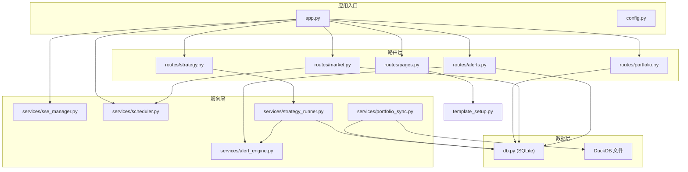

**图示来源**
- [src/quant_etf/dashboard/app.py:1-92](file://src/quant_etf/dashboard/app.py#L1-L92)
- [src/quant_etf/dashboard/config.py:1-25](file://src/quant_etf/dashboard/config.py#L1-L25)
- [src/quant_etf/dashboard/db.py:1-133](file://src/quant_etf/dashboard/db.py#L1-L133)
- [src/quant_etf/dashboard/template_setup.py:1-10](file://src/quant_etf/dashboard/template_setup.py#L1-L10)

**章节来源**
- [src/quant_etf/dashboard/app.py:1-92](file://src/quant_etf/dashboard/app.py#L1-L92)
- [src/quant_etf/dashboard/config.py:1-25](file://src/quant_etf/dashboard/config.py#L1-L25)
- [src/quant_etf/dashboard/db.py:1-133](file://src/quant_etf/dashboard/db.py#L1-L133)
- [src/quant_etf/dashboard/template_setup.py:1-10](file://src/quant_etf/dashboard/template_setup.py#L1-L10)

## 核心组件
- FastAPI应用入口：负责路由挂载、SSE事件流端点、应用生命周期事件处理与异常处理。
- 配置模块：集中管理数据库路径、DuckDB路径、SSE心跳间隔、告警阈值等配置项。
- 数据库层：封装SQLite连接、建表、查询与写入操作，支持WAL模式与外键约束。
- 路由层：按页面与功能拆分，支持HTMX片段渲染与纯HTML响应。
- 服务层：
  - SSE管理器：维护客户端队列，提供订阅与广播能力。
  - 调度器：基于asyncio的轻量级调度，周期性触发策略执行并广播结果。
  - 策略执行器：异步执行策略，读取CSV结果，集成告警引擎并通过SSE广播事件。
  - 告警引擎：内置规则检查（新进入前三、动量突变、持仓偏离），保存告警至数据库。
  - 持仓同步：从DuckDB读取最新价格，更新SQLite中的current_price并通过SSE广播。

**章节来源**
- [src/quant_etf/dashboard/app.py:17-92](file://src/quant_etf/dashboard/app.py#L17-L92)
- [src/quant_etf/dashboard/config.py:1-25](file://src/quant_etf/dashboard/config.py#L1-L25)
- [src/quant_etf/dashboard/db.py:69-133](file://src/quant_etf/dashboard/db.py#L69-L133)
- [src/quant_etf/dashboard/services/sse_manager.py:10-45](file://src/quant_etf/dashboard/services/sse_manager.py#L10-L45)
- [src/quant_etf/dashboard/services/scheduler.py:15-82](file://src/quant_etf/dashboard/services/scheduler.py#L15-L82)
- [src/quant_etf/dashboard/services/strategy_runner.py:25-164](file://src/quant_etf/dashboard/services/strategy_runner.py#L25-L164)
- [src/quant_etf/dashboard/services/alert_engine.py:20-120](file://src/quant_etf/dashboard/services/alert_engine.py#L20-L120)
- [src/quant_etf/dashboard/services/portfolio_sync.py:15-87](file://src/quant_etf/dashboard/services/portfolio_sync.py#L15-L87)

## 架构总览
系统采用前后端分离但以模板渲染为主的架构，后端通过FastAPI提供REST接口与SSE事件流，前端通过HTMX进行无刷新片段更新。数据层分为两部分：看板业务数据（账户、持仓、告警规则、调度配置）存储在SQLite；策略结果与监控信号存储在DuckDB，便于高性能分析。

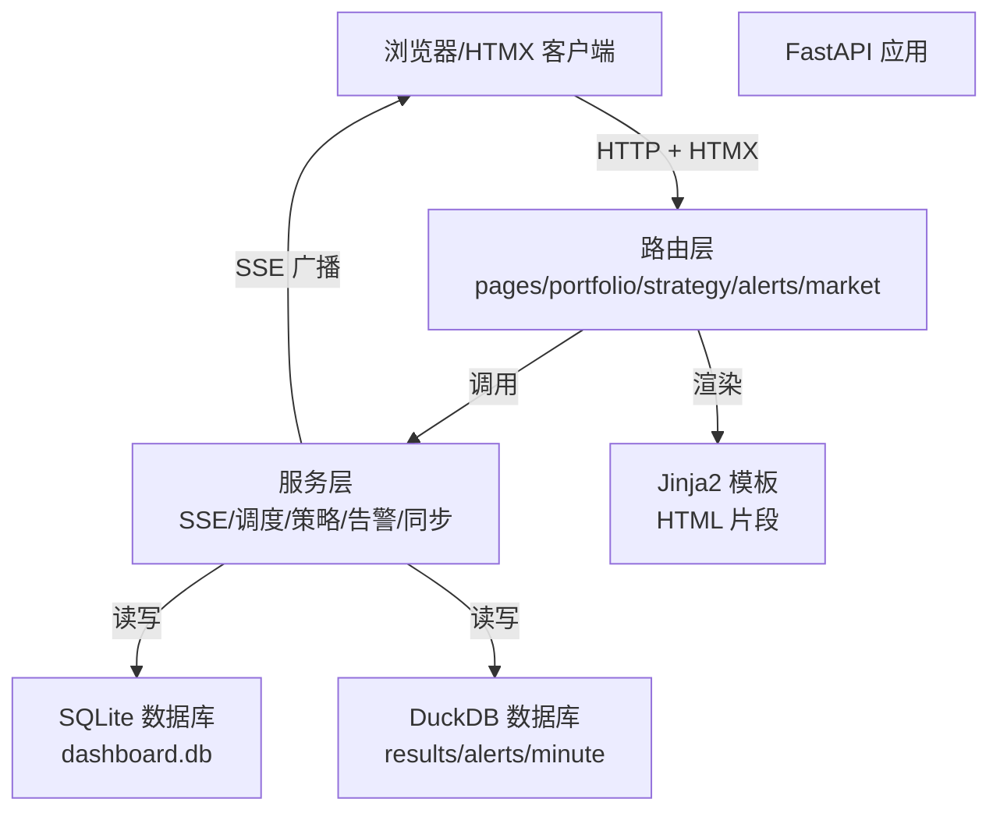

**图示来源**
- [src/quant_etf/dashboard/app.py:17-50](file://src/quant_etf/dashboard/app.py#L17-L50)
- [src/quant_etf/dashboard/routes/pages.py:40-75](file://src/quant_etf/dashboard/routes/pages.py#L40-L75)
- [src/quant_etf/dashboard/services/sse_manager.py:14-41](file://src/quant_etf/dashboard/services/sse_manager.py#L14-L41)

## 详细组件分析

### 应用入口与生命周期
- 路由挂载：根路径重定向至总览页面；SSE事件流端点/streaming；各功能模块路由按前缀分组。
- 生命周期：启动时初始化SQLite表与调度器；关闭时停止所有调度任务。
- 异常处理：统一捕获未处理异常并返回JSON错误。

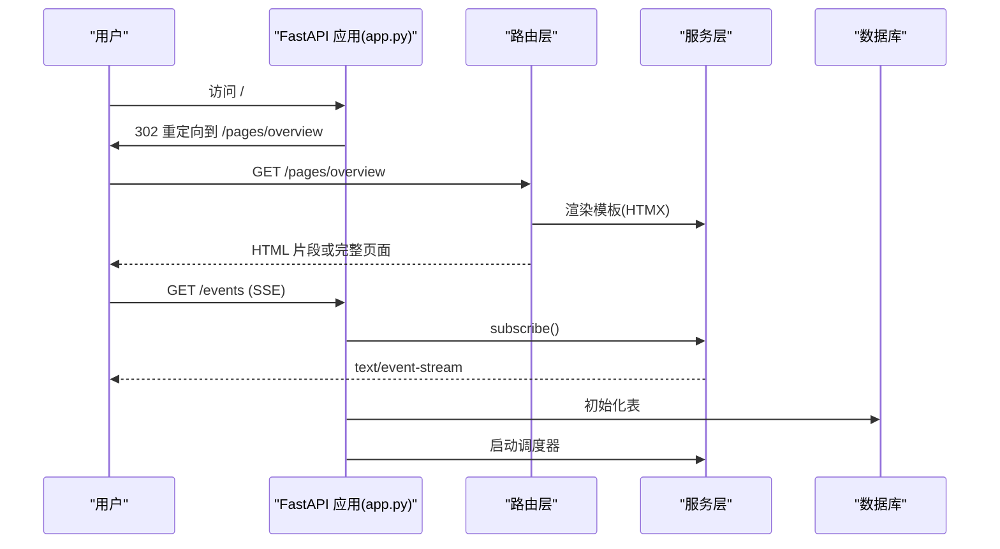

**图示来源**
- [src/quant_etf/dashboard/app.py:27-66](file://src/quant_etf/dashboard/app.py#L27-L66)
- [src/quant_etf/dashboard/routes/pages.py:40-75](file://src/quant_etf/dashboard/routes/pages.py#L40-L75)
- [src/quant_etf/dashboard/services/sse_manager.py:14-32](file://src/quant_etf/dashboard/services/sse_manager.py#L14-L32)

**章节来源**
- [src/quant_etf/dashboard/app.py:17-92](file://src/quant_etf/dashboard/app.py#L17-L92)

### 总览页面与HTMX交互
- 统计数据：账户数、当日告警数、启用调度数。
- HTMX判断：根据HX-Request头决定返回完整页面或内容片段。
- 模板渲染：使用Jinja2模板，支持片段复用。

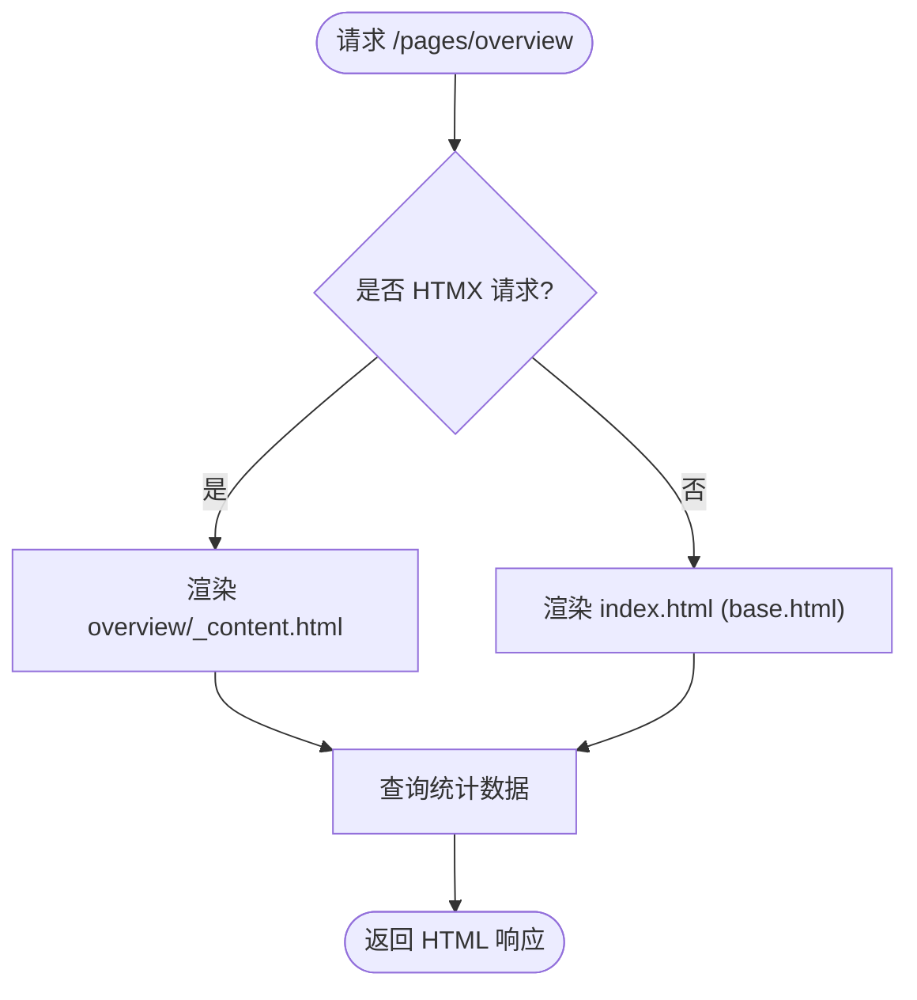

**图示来源**
- [src/quant_etf/dashboard/routes/pages.py:25-44](file://src/quant_etf/dashboard/routes/pages.py#L25-L44)

**章节来源**
- [src/quant_etf/dashboard/routes/pages.py:1-75](file://src/quant_etf/dashboard/routes/pages.py#L1-L75)
- [src/quant_etf/dashboard/template_setup.py:1-10](file://src/quant_etf/dashboard/template_setup.py#L1-L10)

### 持仓管理API
- 账户管理：增删改查账户，返回账户列表片段。
- 持仓管理：按账户查询、增删改持仓，返回持仓表格片段。
- 价格同步：手动触发从DuckDB读取最新收盘价并更新current_price，SSE广播更新事件。

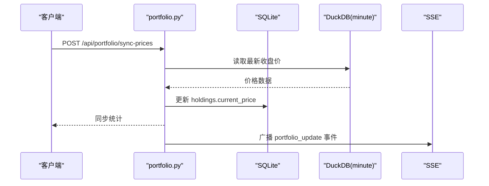

**图示来源**
- [src/quant_etf/dashboard/routes/portfolio.py:170-175](file://src/quant_etf/dashboard/routes/portfolio.py#L170-L175)
- [src/quant_etf/dashboard/services/portfolio_sync.py:69-87](file://src/quant_etf/dashboard/services/portfolio_sync.py#L69-L87)

**章节来源**
- [src/quant_etf/dashboard/routes/portfolio.py:1-175](file://src/quant_etf/dashboard/routes/portfolio.py#L1-L175)
- [src/quant_etf/dashboard/services/portfolio_sync.py:1-87](file://src/quant_etf/dashboard/services/portfolio_sync.py#L1-L87)

### 策略执行API与前端交互

**更新** 策略执行界面已从Chart.js图表改为静态HTML表格展示，使用原生fetch API进行轮询控制，增强了错误处理和用户反馈机制。

- 列表策略：返回TaskRegistry中的可用策略。
- 执行策略：异步启动策略执行，返回run_id；支持轮询状态与查看结果。
- 结果处理：读取CSV结果，对比上一次结果触发告警，SSE广播策略结果与错误事件。

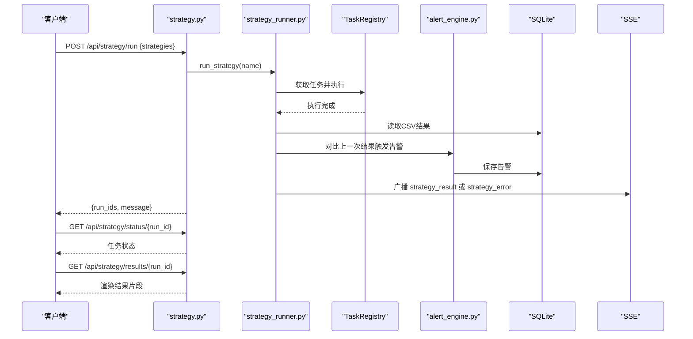

**图示来源**
- [src/quant_etf/dashboard/routes/strategy.py:24-53](file://src/quant_etf/dashboard/routes/strategy.py#L24-L53)
- [src/quant_etf/dashboard/services/strategy_runner.py:25-126](file://src/quant_etf/dashboard/services/strategy_runner.py#L25-L126)
- [src/quant_etf/dashboard/services/alert_engine.py:82-96](file://src/quant_etf/dashboard/services/alert_engine.py#L82-L96)

**章节来源**
- [src/quant_etf/dashboard/routes/strategy.py:1-53](file://src/quant_etf/dashboard/routes/strategy.py#L1-L53)
- [src/quant_etf/dashboard/services/strategy_runner.py:1-164](file://src/quant_etf/dashboard/services/strategy_runner.py#L1-L164)
- [src/quant_etf/dashboard/services/alert_engine.py:1-120](file://src/quant_etf/dashboard/services/alert_engine.py#L1-L120)

### 前端策略执行界面与交互机制

**更新** 前端策略执行界面已从HTMX轮询改为原生fetch API实现，移除了Chart.js依赖，使用静态HTML表格展示结果。

- 策略选择：通过fetch API动态加载可用策略列表，支持多选。
- 执行控制：使用原生fetch API提交执行请求，显示执行进度指示器。
- 结果展示：静态HTML表格展示策略结果，移除Chart.js图表依赖。
- 错误处理：完善的错误处理机制，提供用户友好的错误反馈。
- 轮询机制：使用原生JavaScript定时器进行状态轮询，自动刷新结果。

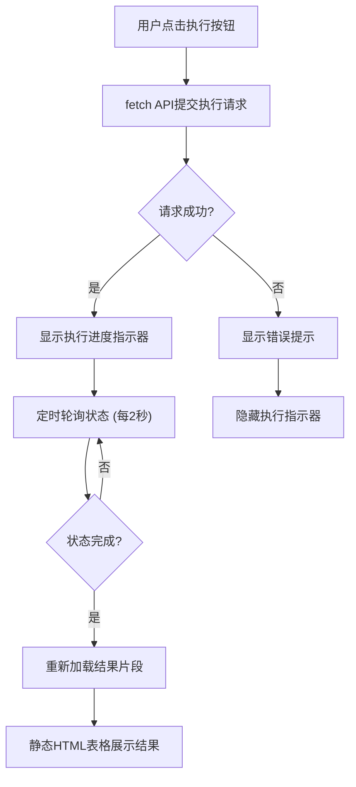

**图示来源**
- [src/quant_etf/dashboard/templates/strategy/index.html:18-37](file://src/quant_etf/dashboard/templates/strategy/index.html#L18-L37)
- [src/quant_etf/dashboard/templates/strategy/_content.html:18-34](file://src/quant_etf/dashboard/templates/strategy/_content.html#L18-L34)

**章节来源**
- [src/quant_etf/dashboard/templates/strategy/index.html:1-71](file://src/quant_etf/dashboard/templates/strategy/index.html#L1-L71)
- [src/quant_etf/dashboard/templates/strategy/_content.html:1-67](file://src/quant_etf/dashboard/templates/strategy/_content.html#L1-L67)
- [src/quant_etf/dashboard/templates/strategy/_results.html:1-64](file://src/quant_etf/dashboard/templates/strategy/_results.html#L1-L64)

### 告警管理API
- 规则管理：创建、删除告警规则。
- 仪表板告警：分页展示当日告警，支持更新状态（激活/确认/解决）。
- 监控信号：从DuckDB读取监控信号，渲染信号列表片段。
- 统计数据：提供告警总数与活跃数。

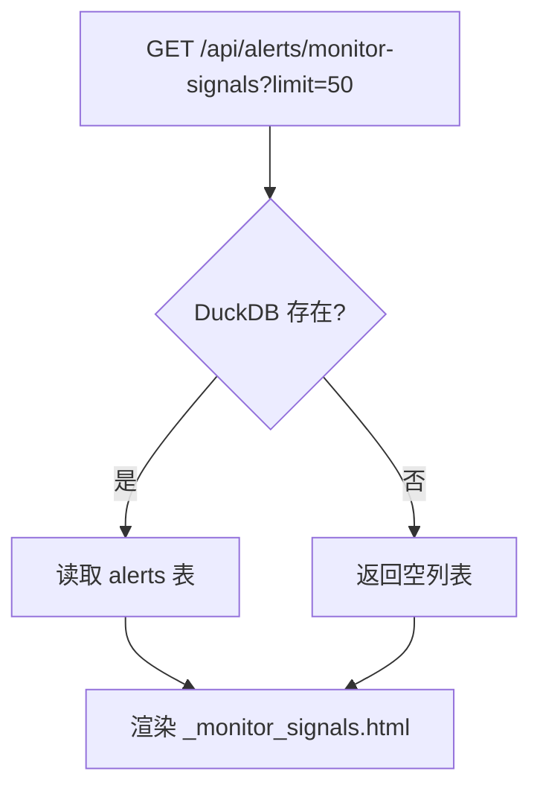

**图示来源**
- [src/quant_etf/dashboard/routes/alerts.py:79-105](file://src/quant_etf/dashboard/routes/alerts.py#L79-L105)

**章节来源**
- [src/quant_etf/dashboard/routes/alerts.py:1-105](file://src/quant_etf/dashboard/routes/alerts.py#L1-L105)
- [src/quant_etf/dashboard/services/alert_engine.py:20-120](file://src/quant_etf/dashboard/services/alert_engine.py#L20-L120)

### 市场状态与监控调度API
- 市场状态：基于指数与ETF池数据分析，返回市场类型与关键指标。
- 总览数据：返回账户数、当日告警数、启用调度数。
- 调度管理：创建、删除、启停调度；显示运行状态；SSE广播调度结果。

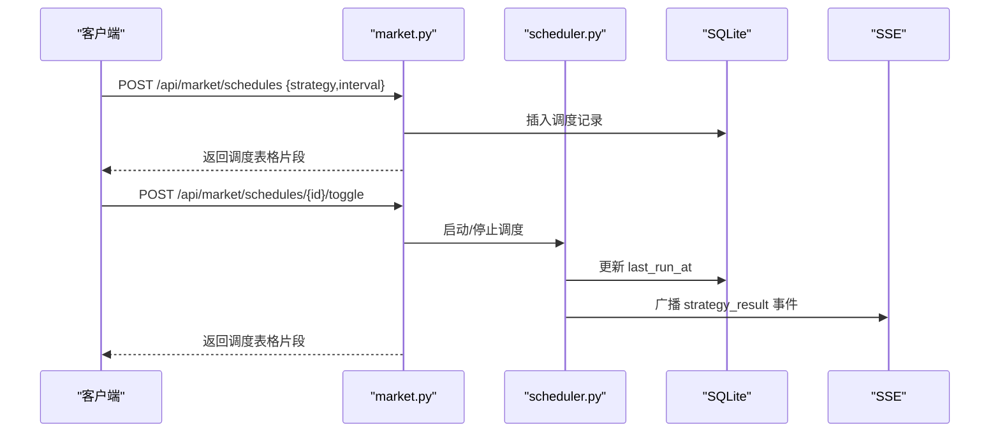

**图示来源**
- [src/quant_etf/dashboard/routes/market.py:67-116](file://src/quant_etf/dashboard/routes/market.py#L67-L116)
- [src/quant_etf/dashboard/services/scheduler.py:19-53](file://src/quant_etf/dashboard/services/scheduler.py#L19-L53)

**章节来源**
- [src/quant_etf/dashboard/routes/market.py:1-116](file://src/quant_etf/dashboard/routes/market.py#L1-L116)
- [src/quant_etf/dashboard/services/scheduler.py:1-82](file://src/quant_etf/dashboard/services/scheduler.py#L1-L82)

### SSE事件流与浏览器交互
- 订阅端点：/events，返回text/event-stream，支持心跳与断开清理。
- 广播事件：策略执行结果、错误、告警、价格同步等。
- 浏览器交互：通过EventSource接收事件，更新页面片段或提示框。

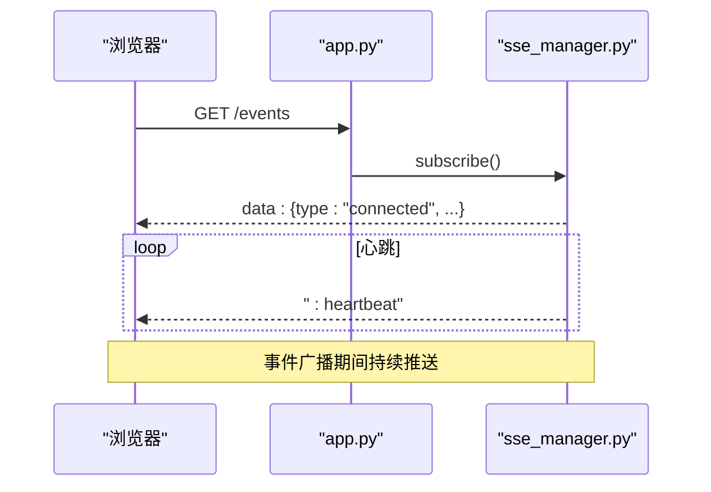

**图示来源**
- [src/quant_etf/dashboard/app.py:39-50](file://src/quant_etf/dashboard/app.py#L39-L50)
- [src/quant_etf/dashboard/services/sse_manager.py:14-32](file://src/quant_etf/dashboard/services/sse_manager.py#L14-L32)

**章节来源**
- [src/quant_etf/dashboard/app.py:39-50](file://src/quant_etf/dashboard/app.py#L39-L50)
- [src/quant_etf/dashboard/services/sse_manager.py:1-45](file://src/quant_etf/dashboard/services/sse_manager.py#L1-L45)

## 依赖关系分析
- 组件耦合：路由层依赖服务层；服务层依赖数据库与配置；SSE作为横切关注点被多个服务共享。
- 外部依赖：DuckDB用于高性能读取；SQLite用于看板业务数据；Jinja2用于模板渲染。
- 循环依赖规避：模板配置独立于应用入口，避免app与routes循环导入。

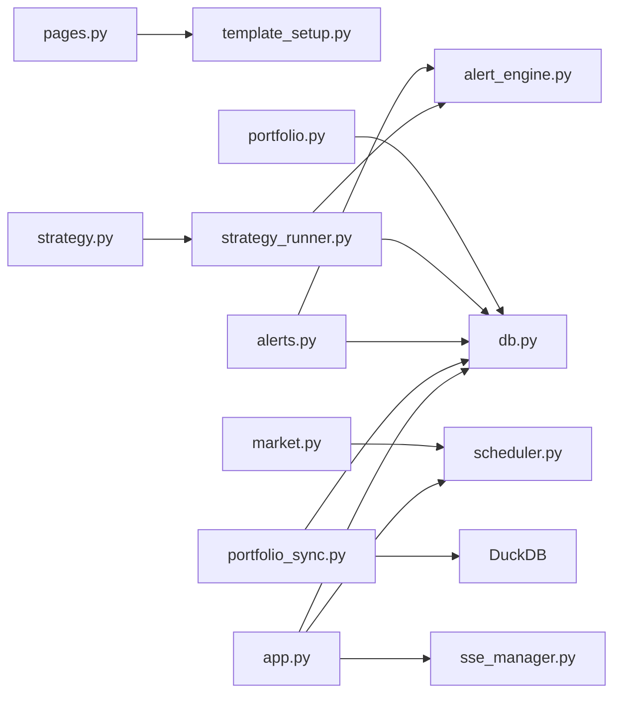

**图示来源**
- [src/quant_etf/dashboard/routes/pages.py:10-13](file://src/quant_etf/dashboard/routes/pages.py#L10-L13)
- [src/quant_etf/dashboard/routes/portfolio.py:8-13](file://src/quant_etf/dashboard/routes/portfolio.py#L8-L13)
- [src/quant_etf/dashboard/routes/strategy.py:8-13](file://src/quant_etf/dashboard/routes/strategy.py#L8-L13)
- [src/quant_etf/dashboard/routes/alerts.py:7-11](file://src/quant_etf/dashboard/routes/alerts.py#L7-L11)
- [src/quant_etf/dashboard/routes/market.py:9-12](file://src/quant_etf/dashboard/routes/market.py#L9-L12)
- [src/quant_etf/dashboard/services/strategy_runner.py:15-18](file://src/quant_etf/dashboard/services/strategy_runner.py#L15-L18)
- [src/quant_etf/dashboard/services/portfolio_sync.py:10-12](file://src/quant_etf/dashboard/services/portfolio_sync.py#L10-L12)
- [src/quant_etf/dashboard/app.py:10-15](file://src/quant_etf/dashboard/app.py#L10-L15)

**章节来源**
- [src/quant_etf/dashboard/app.py:1-92](file://src/quant_etf/dashboard/app.py#L1-L92)
- [src/quant_etf/dashboard/db.py:1-133](file://src/quant_etf/dashboard/db.py#L1-L133)

## 性能考虑
- 数据库优化：
  - SQLite使用WAL模式与外键约束，提升并发与一致性。
  - DuckDB用于只读分析场景，减少主业务数据库压力。
- 异步执行：
  - 策略执行与价格同步通过线程池与事件循环配合，避免阻塞。
  - SSE广播采用队列模型，支持多客户端连接与心跳维持。
- 缓存与预计算：
  - ETF名称映射缓存在内存，减少文件I/O。
  - 上一次策略结果按日期目录缓存，快速对比。
- 网络传输：
  - SSE长连接减少HTTP开销；心跳保持连接活性。
  - HTMX片段更新降低页面刷新成本。
- 前端性能优化：
  - 移除Chart.js依赖，减少JavaScript包体积和渲染开销。
  - 使用原生fetch API替代HTMX，降低前端框架依赖。
  - 静态HTML表格展示结果，提高渲染性能。

**更新** 前端性能优化：移除Chart.js依赖显著减少了JavaScript包体积，使用原生fetch API替代HTMX降低了前端框架依赖，静态HTML表格展示结果提高了渲染性能。

## 故障排除指南
- SSE连接问题：
  - 检查/evnets端点是否返回text/event-stream；确认心跳输出与客户端断开清理逻辑。
  - 参考：[src/quant_etf/dashboard/app.py:39-50](file://src/quant_etf/dashboard/app.py#L39-L50)、[src/quant_etf/dashboard/services/sse_manager.py:14-32](file://src/quant_etf/dashboard/services/sse_manager.py#L14-L32)
- 策略执行失败：
  - 查看策略执行器日志与SSE错误事件；确认TaskRegistry中策略是否存在。
  - 参考：[src/quant_etf/dashboard/services/strategy_runner.py:102-122](file://src/quant_etf/dashboard/services/strategy_runner.py#L102-L122)
- DuckDB读取失败：
  - 检查DuckDB文件路径与权限；确认表结构与字段名。
  - 参考：[src/quant_etf/dashboard/routes/alerts.py:84-98](file://src/quant_etf/dashboard/routes/alerts.py#L84-L98)、[src/quant_etf/dashboard/services/portfolio_sync.py:34-63](file://src/quant_etf/dashboard/services/portfolio_sync.py#L34-L63)
- SQLite写入异常：
  - 检查表结构与外键约束；确认事务提交与连接关闭。
  - 参考：[src/quant_etf/dashboard/db.py:79-91](file://src/quant_etf/dashboard/db.py#L79-L91)
- HTMX片段不更新：
  - 确认HX-Request头与模板路径；检查路由返回的片段是否正确。
  - 参考：[src/quant_etf/dashboard/routes/pages.py:20-22](file://src/quant_etf/dashboard/routes/pages.py#L20-L22)
- 前端交互问题：
  - 检查浏览器控制台是否有JavaScript错误；确认fetch API请求是否成功。
  - 参考：[src/quant_etf/dashboard/templates/strategy/index.html:18-37](file://src/quant_etf/dashboard/templates/strategy/index.html#L18-L37)、[src/quant_etf/dashboard/templates/strategy/_content.html:18-34](file://src/quant_etf/dashboard/templates/strategy/_content.html#L18-L34)

**更新** 新增前端交互问题排查指南，包括JavaScript错误检查和fetch API请求验证。

**章节来源**
- [src/quant_etf/dashboard/app.py:39-50](file://src/quant_etf/dashboard/app.py#L39-L50)
- [src/quant_etf/dashboard/services/sse_manager.py:14-32](file://src/quant_etf/dashboard/services/sse_manager.py#L14-L32)
- [src/quant_etf/dashboard/services/strategy_runner.py:102-122](file://src/quant_etf/dashboard/services/strategy_runner.py#L102-L122)
- [src/quant_etf/dashboard/routes/alerts.py:84-98](file://src/quant_etf/dashboard/routes/alerts.py#L84-L98)
- [src/quant_etf/dashboard/services/portfolio_sync.py:34-63](file://src/quant_etf/dashboard/services/portfolio_sync.py#L34-L63)
- [src/quant_etf/dashboard/db.py:79-91](file://src/quant_etf/dashboard/db.py#L79-L91)
- [src/quant_etf/dashboard/routes/pages.py:20-22](file://src/quant_etf/dashboard/routes/pages.py#L20-L22)
- [src/quant_etf/dashboard/templates/strategy/index.html:18-37](file://src/quant_etf/dashboard/templates/strategy/index.html#L18-L37)
- [src/quant_etf/dashboard/templates/strategy/_content.html:18-34](file://src/quant_etf/dashboard/templates/strategy/_content.html#L18-L34)

## 结论
本Dashboard监控系统通过FastAPI + HTMX + SQLite/DuckDB + SSE实现了低耦合、高扩展的监控平台。路由层清晰分层，服务层职责明确，SSE提供实时事件推送，HTMX实现无刷新交互体验。配置集中化管理，便于部署与维护。

**更新** 最新版本中，策略执行界面已优化为更简洁的静态HTML表格展示，移除了Chart.js依赖，使用原生fetch API替代HTMX进行轮询控制，提升了系统性能和用户体验。错误处理和用户反馈机制得到显著改善，为用户提供更好的操作体验。

后续可进一步完善告警规则与可视化展示，增强策略结果的历史对比分析功能。

## 附录

### API接口文档概览
- 页面路由
  - GET /pages/overview → 返回总览页面或片段
  - GET /pages/portfolio → 返回持仓页面或片段
  - GET /pages/strategy → 返回策略页面或片段
  - GET /pages/monitor → 返回监控页面或片段
  - GET /pages/alerts → 返回告警页面或片段
  - GET /pages/settings → 返回设置页面或片段
- 持仓API
  - GET /api/portfolio/accounts → 返回账户列表片段
  - POST /api/portfolio/accounts → 创建账户
  - PUT /api/portfolio/accounts/{account_id} → 更新账户
  - DELETE /api/portfolio/accounts/{account_id} → 删除账户
  - GET /api/portfolio/accounts/{account_id}/holdings → 返回持仓表格片段
  - POST /api/portfolio/holdings → 创建持仓
  - PUT /api/portfolio/holdings/{holding_id} → 更新持仓
  - DELETE /api/portfolio/holdings/{holding_id} → 删除持仓
  - POST /api/portfolio/sync-prices → 手动同步价格
- 策略API
  - GET /api/strategy/strategies → 列出可用策略
  - POST /api/strategy/run → 执行策略（返回run_id）
  - GET /api/strategy/status/{run_id} → 查询执行进度
  - GET /api/strategy/results/{run_id} → 渲染结果片段（静态HTML表格）
- 告警API
  - GET /api/alerts/rules → 列出告警规则
  - POST /api/alerts/rules → 创建告警规则
  - DELETE /api/alerts/rules/{rule_id} → 删除告警规则
  - GET /api/alerts/dashboard → 返回告警列表片段
  - PUT /api/alerts/dashboard/{alert_id}/status → 更新告警状态
  - GET /api/alerts/dashboard/stats → 告警统计数据
  - GET /api/alerts/monitor-signals → 返回监控信号片段
- 市场与调度API
  - GET /api/market/status → 市场状态
  - GET /api/market/overview → 总览数据卡片
  - GET /api/market/schedules → 返回调度表格片段
  - POST /api/market/schedules → 创建调度
  - DELETE /api/market/schedules/{schedule_id} → 删除调度
  - POST /api/market/schedules/{schedule_id}/toggle → 启停调度

**章节来源**
- [src/quant_etf/dashboard/routes/pages.py:40-75](file://src/quant_etf/dashboard/routes/pages.py#L40-L75)
- [src/quant_etf/dashboard/routes/portfolio.py:31-175](file://src/quant_etf/dashboard/routes/portfolio.py#L31-L175)
- [src/quant_etf/dashboard/routes/strategy.py:18-53](file://src/quant_etf/dashboard/routes/strategy.py#L18-L53)
- [src/quant_etf/dashboard/routes/alerts.py:16-105](file://src/quant_etf/dashboard/routes/alerts.py#L16-L105)
- [src/quant_etf/dashboard/routes/market.py:18-116](file://src/quant_etf/dashboard/routes/market.py#L18-L116)

### 数据模型与复杂度
- 数据模型：Pydantic模型用于请求参数校验，确保输入合法性。
- 复杂度分析：
  - SQLite查询：基于索引的简单查询为O(log n)；分页查询O(k)。
  - DuckDB读取：按code过滤与排序，依赖索引与列式存储，读取效率高。
  - SSE广播：队列操作O(1)，支持多客户端并发。

**章节来源**
- [src/quant_etf/dashboard/models.py:1-54](file://src/quant_etf/dashboard/models.py#L1-L54)
- [src/quant_etf/dashboard/db.py:93-133](file://src/quant_etf/dashboard/db.py#L93-L133)

### 部署配置要点
- 环境变量：
  - DASHBOARD_HOST：监听地址，默认127.0.0.1
  - DASHBOARD_PORT：监听端口，默认8522
- 数据路径：
  - dashboard.db：看板业务SQLite数据库
  - results.duckdb：策略结果DuckDB
  - alerts.duckdb：告警信号DuckDB
  - minute_data.duckdb：分钟级行情DuckDB
- 启动方式：通过CLI入口启动uvicorn服务，自动初始化数据库与调度器。

**章节来源**
- [src/quant_etf/dashboard/config.py:16-25](file://src/quant_etf/dashboard/config.py#L16-L25)
- [src/quant_etf/dashboard/app.py:74-92](file://src/quant_etf/dashboard/app.py#L74-L92)
- [src/quant_etf/dashboard/db.py:79-91](file://src/quant_etf/dashboard/db.py#L79-L91)