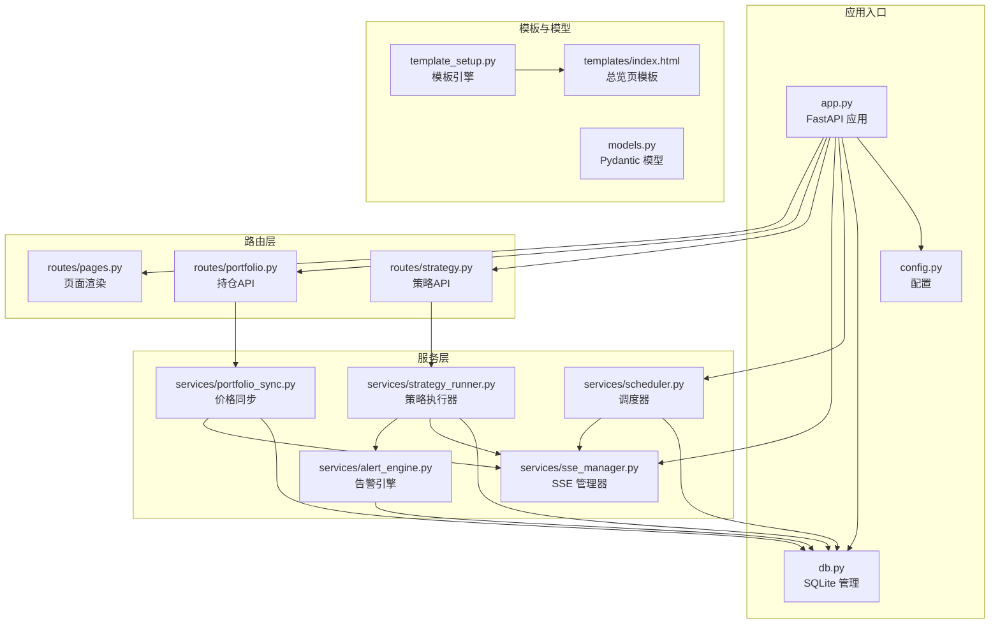
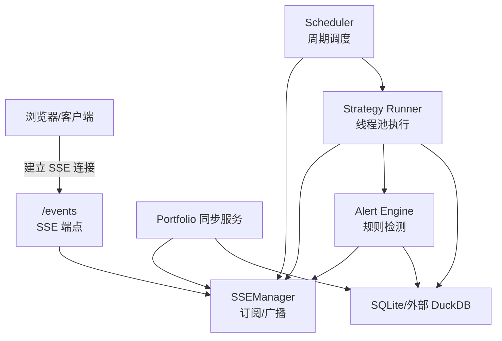
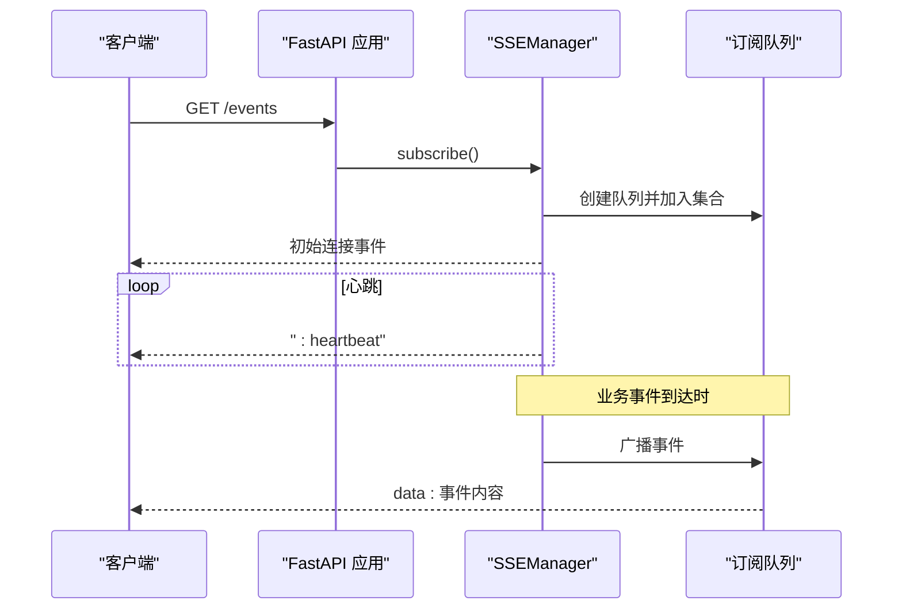
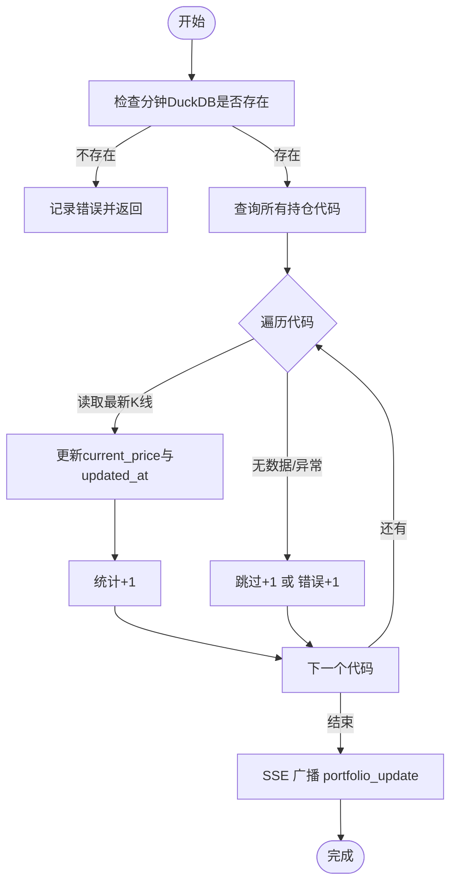
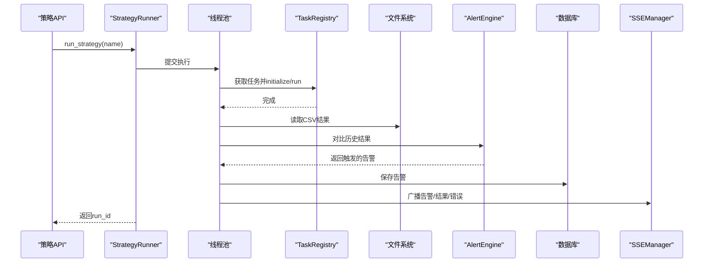
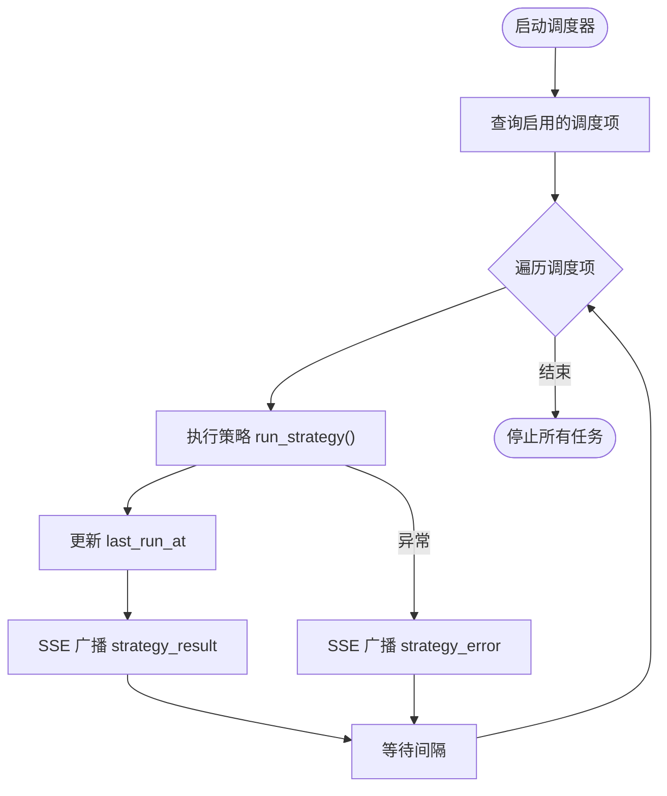
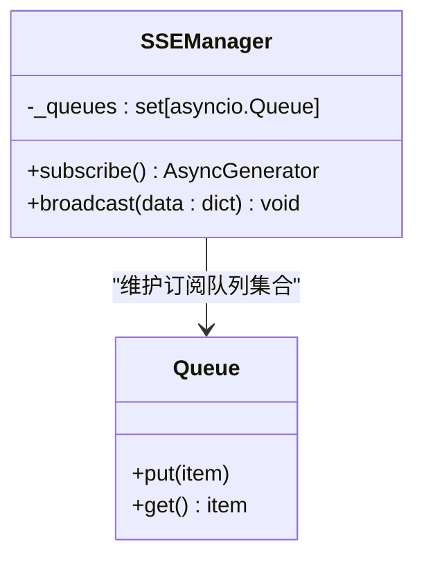
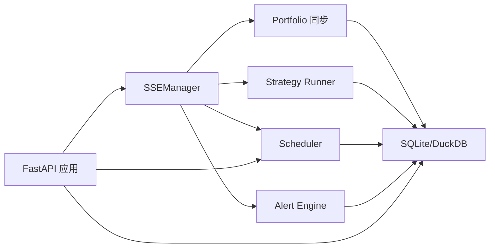

# 实时监控机制

<cite>
**本文引用的文件**
- [src/quant_etf/dashboard/app.py](file://src/quant_etf/dashboard/app.py)
- [src/quant_etf/dashboard/config.py](file://src/quant_etf/dashboard/config.py)
- [src/quant_etf/dashboard/db.py](file://src/quant_etf/dashboard/db.py)
- [src/quant_etf/dashboard/services/sse_manager.py](file://src/quant_etf/dashboard/services/sse_manager.py)
- [src/quant_etf/dashboard/services/portfolio_sync.py](file://src/quant_etf/dashboard/services/portfolio_sync.py)
- [src/quant_etf/dashboard/services/strategy_runner.py](file://src/quant_etf/dashboard/services/strategy_runner.py)
- [src/quant_etf/dashboard/services/scheduler.py](file://src/quant_etf/dashboard/services/scheduler.py)
- [src/quant_etf/dashboard/services/alert_engine.py](file://src/quant_etf/dashboard/services/alert_engine.py)
- [src/quant_etf/dashboard/routes/portfolio.py](file://src/quant_etf/dashboard/routes/portfolio.py)
- [src/quant_etf/dashboard/routes/strategy.py](file://src/quant_etf/dashboard/routes/strategy.py)
- [src/quant_etf/dashboard/routes/pages.py](file://src/quant_etf/dashboard/routes/pages.py)
- [src/quant_etf/dashboard/models.py](file://src/quant_etf/dashboard/models.py)
- [src/quant_etf/dashboard/template_setup.py](file://src/quant_etf/dashboard/template_setup.py)
- [src/quant_etf/dashboard/templates/index.html](file://src/quant_etf/dashboard/templates/index.html)
</cite>

## 目录
1. [引言](#引言)
2. [项目结构](#项目结构)
3. [核心组件](#核心组件)
4. [架构总览](#架构总览)
5. [详细组件分析](#详细组件分析)
6. [依赖分析](#依赖分析)
7. [性能考虑](#性能考虑)
8. [故障排查指南](#故障排查指南)
9. [结论](#结论)
10. [附录](#附录)

## 引言
本技术文档围绕Dashboard的实时监控机制展开，系统性阐述SSE（Server-Sent Events）事件流的实现原理、连接管理与消息推送；深入解析Portfolio同步服务的价格更新策略、Strategy Runner的实时执行监控以及Scheduler的任务调度机制；解释事件订阅模式、消息队列管理与并发处理策略；并给出实时数据刷新频率、客户端连接处理、服务器负载均衡建议，以及性能监控指标、错误处理与故障恢复策略。同时提供WebSocket替代方案与混合架构设计思路，帮助读者在实际部署中做出合理选择。

## 项目结构
Dashboard采用FastAPI作为Web框架，路由按功能模块划分，服务层封装业务逻辑，模板系统负责页面渲染。SSE管理器集中维护订阅者队列，Portfolio同步服务与策略执行器通过SSE向客户端推送事件，Scheduler负责周期性任务调度并在每次执行后广播结果或错误。

**图示来源**
- [src/quant_etf/dashboard/app.py:1-107](file://src/quant_etf/dashboard/app.py#L1-L107)
- [src/quant_etf/dashboard/config.py:1-25](file://src/quant_etf/dashboard/config.py#L1-L25)
- [src/quant_etf/dashboard/db.py:1-133](file://src/quant_etf/dashboard/db.py#L1-L133)
- [src/quant_etf/dashboard/services/sse_manager.py:1-45](file://src/quant_etf/dashboard/services/sse_manager.py#L1-L45)
- [src/quant_etf/dashboard/services/portfolio_sync.py:1-87](file://src/quant_etf/dashboard/services/portfolio_sync.py#L1-L87)
- [src/quant_etf/dashboard/services/strategy_runner.py:1-164](file://src/quant_etf/dashboard/services/strategy_runner.py#L1-L164)
- [src/quant_etf/dashboard/services/scheduler.py:1-82](file://src/quant_etf/dashboard/services/scheduler.py#L1-L82)
- [src/quant_etf/dashboard/services/alert_engine.py:1-120](file://src/quant_etf/dashboard/services/alert_engine.py#L1-L120)
- [src/quant_etf/dashboard/routes/portfolio.py:1-175](file://src/quant_etf/dashboard/routes/portfolio.py#L1-L175)
- [src/quant_etf/dashboard/routes/strategy.py:1-53](file://src/quant_etf/dashboard/routes/strategy.py#L1-L53)
- [src/quant_etf/dashboard/routes/pages.py:1-75](file://src/quant_etf/dashboard/routes/pages.py#L1-L75)
- [src/quant_etf/dashboard/template_setup.py:1-10](file://src/quant_etf/dashboard/template_setup.py#L1-L10)
- [src/quant_etf/dashboard/templates/index.html:1-100](file://src/quant_etf/dashboard/templates/index.html#L1-L100)

**章节来源**
- [src/quant_etf/dashboard/app.py:1-107](file://src/quant_etf/dashboard/app.py#L1-L107)
- [src/quant_etf/dashboard/config.py:1-25](file://src/quant_etf/dashboard/config.py#L1-L25)
- [src/quant_etf/dashboard/db.py:1-133](file://src/quant_etf/dashboard/db.py#L1-L133)

## 核心组件
- SSE管理器：维护订阅者集合，提供订阅生成器与广播方法，支持心跳保活与异常断开清理。
- Portfolio同步服务：从分钟级DuckDB读取最新收盘价，更新持仓current_price，并在有更新时通过SSE广播事件。
- Strategy Runner：在后台线程池中执行策略，记录任务状态，完成后读取CSV结果并通过SSE广播结果与告警事件。
- Scheduler：基于asyncio任务的轻量调度器，周期性触发策略执行，更新数据库并广播执行结果或错误。
- 告警引擎：定义多条告警规则，比较当前与历史策略结果，触发后持久化并广播告警事件。
- 路由与模板：提供页面渲染与API接口，模板中通过HTMX与SSE实现动态刷新与交互。

**章节来源**
- [src/quant_etf/dashboard/services/sse_manager.py:1-45](file://src/quant_etf/dashboard/services/sse_manager.py#L1-L45)
- [src/quant_etf/dashboard/services/portfolio_sync.py:1-87](file://src/quant_etf/dashboard/services/portfolio_sync.py#L1-L87)
- [src/quant_etf/dashboard/services/strategy_runner.py:1-164](file://src/quant_etf/dashboard/services/strategy_runner.py#L1-L164)
- [src/quant_etf/dashboard/services/scheduler.py:1-82](file://src/quant_etf/dashboard/services/scheduler.py#L1-L82)
- [src/quant_etf/dashboard/services/alert_engine.py:1-120](file://src/quant_etf/dashboard/services/alert_engine.py#L1-L120)
- [src/quant_etf/dashboard/routes/portfolio.py:1-175](file://src/quant_etf/dashboard/routes/portfolio.py#L1-L175)
- [src/quant_etf/dashboard/routes/strategy.py:1-53](file://src/quant_etf/dashboard/routes/strategy.py#L1-L53)
- [src/quant_etf/dashboard/routes/pages.py:1-75](file://src/quant_etf/dashboard/routes/pages.py#L1-L75)
- [src/quant_etf/dashboard/templates/index.html:1-100](file://src/quant_etf/dashboard/templates/index.html#L1-L100)

## 架构总览
Dashboard采用“事件驱动 + 轻量调度”的架构。SSE作为单向事件通道，向客户端推送Portfolio更新、策略执行结果、告警等事件；Scheduler与Strategy Runner在后台异步执行任务，通过SSE进行实时反馈；Portfolio同步服务在需要时主动触发并广播更新。数据库层统一管理看板业务数据，模板系统负责前端渲染与交互。

**图示来源**
- [src/quant_etf/dashboard/app.py:39-50](file://src/quant_etf/dashboard/app.py#L39-L50)
- [src/quant_etf/dashboard/services/sse_manager.py:10-45](file://src/quant_etf/dashboard/services/sse_manager.py#L10-L45)
- [src/quant_etf/dashboard/services/portfolio_sync.py:69-87](file://src/quant_etf/dashboard/services/portfolio_sync.py#L69-L87)
- [src/quant_etf/dashboard/services/strategy_runner.py:25-125](file://src/quant_etf/dashboard/services/strategy_runner.py#L25-L125)
- [src/quant_etf/dashboard/services/scheduler.py:19-52](file://src/quant_etf/dashboard/services/scheduler.py#L19-L52)
- [src/quant_etf/dashboard/services/alert_engine.py:82-96](file://src/quant_etf/dashboard/services/alert_engine.py#L82-L96)
- [src/quant_etf/dashboard/db.py:69-133](file://src/quant_etf/dashboard/db.py#L69-L133)

## 详细组件分析

### SSE（Server-Sent Events）事件流
- 订阅流程：客户端发起GET /events，服务端返回StreamingResponse，SSEManager为每个连接创建独立队列，先发送初始连接事件，随后持续推送事件；若30秒未收到事件则发送心跳行，维持连接。
- 广播流程：任何业务事件（如价格同步、策略结果、告警、错误）通过SSEManager广播至所有订阅者队列；对异常队列进行清理，避免内存泄漏。
- 心跳与保活：心跳间隔由配置控制，确保长连接稳定；断开时自动移除队列并记录日志。

**图示来源**
- [src/quant_etf/dashboard/app.py:39-50](file://src/quant_etf/dashboard/app.py#L39-L50)
- [src/quant_etf/dashboard/services/sse_manager.py:14-32](file://src/quant_etf/dashboard/services/sse_manager.py#L14-L32)
- [src/quant_etf/dashboard/config.py:20-22](file://src/quant_etf/dashboard/config.py#L20-L22)

**章节来源**
- [src/quant_etf/dashboard/services/sse_manager.py:1-45](file://src/quant_etf/dashboard/services/sse_manager.py#L1-L45)
- [src/quant_etf/dashboard/app.py:39-50](file://src/quant_etf/dashboard/app.py#L39-L50)
- [src/quant_etf/dashboard/config.py:20-22](file://src/quant_etf/dashboard/config.py#L20-L22)

### Portfolio同步服务
- 数据源：从分钟级DuckDB读取每只持仓的最新收盘价，逐个更新数据库中的current_price与updated_at。
- 统计返回：返回更新数量、跳过数量与错误数量，便于前端展示与审计。
- 实时推送：当有更新时，通过SSE广播portfolio_update事件，携带更新数量与时间戳，客户端可据此刷新UI。

**图示来源**
- [src/quant_etf/dashboard/services/portfolio_sync.py:15-66](file://src/quant_etf/dashboard/services/portfolio_sync.py#L15-L66)
- [src/quant_etf/dashboard/services/portfolio_sync.py:69-87](file://src/quant_etf/dashboard/services/portfolio_sync.py#L69-L87)

**章节来源**
- [src/quant_etf/dashboard/services/portfolio_sync.py:1-87](file://src/quant_etf/dashboard/services/portfolio_sync.py#L1-L87)
- [src/quant_etf/dashboard/routes/portfolio.py:170-175](file://src/quant_etf/dashboard/routes/portfolio.py#L170-L175)

### Strategy Runner 实时执行监控
- 线程池执行：在固定大小的线程池中执行策略任务，避免阻塞事件循环；任务状态存储于内存字典，包含状态、进度、开始/结束时间、结果与错误。
- 结果读取：完成后从结果目录读取CSV，过滤无效记录，填充任务结果与数量。
- 告警集成：对比本次与上次结果，触发告警规则，保存到数据库并广播告警事件。
- 错误处理：捕获异常并标记任务状态为error，同时通过SSE广播strategy_error事件。

**图示来源**
- [src/quant_etf/dashboard/routes/strategy.py:24-31](file://src/quant_etf/dashboard/routes/strategy.py#L24-L31)
- [src/quant_etf/dashboard/services/strategy_runner.py:25-125](file://src/quant_etf/dashboard/services/strategy_runner.py#L25-L125)
- [src/quant_etf/dashboard/services/alert_engine.py:82-96](file://src/quant_etf/dashboard/services/alert_engine.py#L82-L96)

**章节来源**
- [src/quant_etf/dashboard/services/strategy_runner.py:1-164](file://src/quant_etf/dashboard/services/strategy_runner.py#L1-L164)
- [src/quant_etf/dashboard/routes/strategy.py:1-53](file://src/quant_etf/dashboard/routes/strategy.py#L1-L53)
- [src/quant_etf/dashboard/services/alert_engine.py:1-120](file://src/quant_etf/dashboard/services/alert_engine.py#L1-L120)

### Scheduler 任务调度机制
- 轻量调度：启动时扫描启用的调度项，为每个调度创建无限循环的asyncio任务，按设定间隔执行策略。
- 执行记录：每次执行后更新数据库的last_run_at字段，并通过SSE广播strategy_result事件。
- 错误处理：执行失败时记录错误并通过SSE广播strategy_error事件，保证可观测性。
- 生命周期：应用启动时自动启动所有调度，关闭时取消并停止所有任务。

**图示来源**
- [src/quant_etf/dashboard/services/scheduler.py:54-79](file://src/quant_etf/dashboard/services/scheduler.py#L54-L79)
- [src/quant_etf/dashboard/services/scheduler.py:19-52](file://src/quant_etf/dashboard/services/scheduler.py#L19-L52)

**章节来源**
- [src/quant_etf/dashboard/services/scheduler.py:1-82](file://src/quant_etf/dashboard/services/scheduler.py#L1-L82)
- [src/quant_etf/dashboard/app.py:53-65](file://src/quant_etf/dashboard/app.py#L53-L65)

### 事件订阅模式与消息队列管理
- 订阅模式：每个SSE客户端对应一个队列，服务端通过队列进行事件分发；断开连接时自动清理队列，避免资源泄露。
- 广播策略：广播时对异常队列进行剔除，保证高可用；心跳机制降低空闲连接的资源占用。
- 并发处理：SSEManager内部使用set维护队列集合，广播时遍历副本，避免迭代期间修改导致的竞态。

**图示来源**
- [src/quant_etf/dashboard/services/sse_manager.py:10-45](file://src/quant_etf/dashboard/services/sse_manager.py#L10-L45)

**章节来源**
- [src/quant_etf/dashboard/services/sse_manager.py:1-45](file://src/quant_etf/dashboard/services/sse_manager.py#L1-L45)

### 前端交互与实时刷新
- 模板渲染：页面路由根据是否为HTMX请求决定返回完整页面或内容片段，提升交互效率。
- 总览页刷新：模板中通过HTMX定时请求告警列表与市场状态，结合SSE事件实现双通道实时更新。
- 事件消费：客户端通过EventSource监听/events端点，接收portfolio_update、strategy_result、alert、strategy_error等事件并更新UI。

**章节来源**
- [src/quant_etf/dashboard/routes/pages.py:20-22](file://src/quant_etf/dashboard/routes/pages.py#L20-L22)
- [src/quant_etf/dashboard/templates/index.html:1-100](file://src/quant_etf/dashboard/templates/index.html#L1-L100)

## 依赖分析
- 组件耦合：SSEManager是事件中枢，Portfolio同步、Strategy Runner、Scheduler、Alert Engine均依赖其进行事件广播；各服务之间通过SSE解耦。
- 外部依赖：DuckDB用于分钟级行情数据读取；SQLite用于看板业务数据；线程池用于CPU密集型策略执行；FastAPI提供路由与SSE响应。
- 循环依赖规避：模板引擎配置独立于应用入口，避免app与routes之间的循环导入。

**图示来源**
- [src/quant_etf/dashboard/app.py:1-107](file://src/quant_etf/dashboard/app.py#L1-L107)
- [src/quant_etf/dashboard/services/sse_manager.py:1-45](file://src/quant_etf/dashboard/services/sse_manager.py#L1-L45)
- [src/quant_etf/dashboard/services/portfolio_sync.py:1-87](file://src/quant_etf/dashboard/services/portfolio_sync.py#L1-L87)
- [src/quant_etf/dashboard/services/strategy_runner.py:1-164](file://src/quant_etf/dashboard/services/strategy_runner.py#L1-L164)
- [src/quant_etf/dashboard/services/scheduler.py:1-82](file://src/quant_etf/dashboard/services/scheduler.py#L1-L82)
- [src/quant_etf/dashboard/services/alert_engine.py:1-120](file://src/quant_etf/dashboard/services/alert_engine.py#L1-L120)
- [src/quant_etf/dashboard/db.py:1-133](file://src/quant_etf/dashboard/db.py#L1-L133)

**章节来源**
- [src/quant_etf/dashboard/app.py:1-107](file://src/quant_etf/dashboard/app.py#L1-L107)
- [src/quant_etf/dashboard/db.py:1-133](file://src/quant_etf/dashboard/db.py#L1-L133)

## 性能考虑
- 实时刷新频率
  - SSE心跳：默认30秒，可在配置中调整，平衡保活与带宽消耗。
  - Portfolio同步：按需触发或结合定时任务；建议在交易时段增加频率，非交易时段降低。
  - 策略执行：Scheduler间隔≥60秒，避免过于频繁的I/O与计算压力。
- 并发与资源
  - 线程池大小：Strategy Runner使用固定大小线程池，避免过多并发导致上下文切换开销。
  - 队列管理：SSE队列集合在广播时遍历副本，减少锁竞争；异常队列自动清理，防止内存膨胀。
- 数据库与I/O
  - SQLite采用WAL模式与外键约束，保障一致性；DuckDB只读连接，降低锁争用。
  - Portfolio同步逐条更新，建议在低峰期执行或分批处理。
- 客户端连接
  - 单向事件流适合大量并发客户端；若需双向通信，可考虑WebSocket或混合方案。
- 服务器负载均衡
  - SSE为无状态协议，可水平扩展多个实例；注意共享会话与全局状态的处理。

[本节为通用指导，无需特定文件引用]

## 故障排查指南
- SSE连接问题
  - 现象：客户端长时间无事件或连接中断。
  - 排查：检查心跳间隔设置、网络代理缓存头、Nginx/Apache的缓冲配置；确认客户端EventSource正确处理心跳与重连。
- 事件未送达
  - 现象：客户端未收到portfolio_update或strategy_result。
  - 排查：查看SSEManager广播日志与异常队列清理记录；确认业务服务已调用广播接口。
- 策略执行异常
  - 现象：任务状态为error，SSE广播strategy_error。
  - 排查：检查线程池执行日志、TaskRegistry任务可用性、CSV结果路径与权限。
- 告警未触发
  - 现象：策略结果变更但未产生告警。
  - 排查：核对AlertEngine规则与阈值、历史结果加载逻辑、数据库保存状态。
- 数据库异常
  - 现象：Portfolio同步或调度更新失败。
  - 排查：检查SQLite连接与WAL模式、DuckDB文件路径与权限、事务提交与回滚。

**章节来源**
- [src/quant_etf/dashboard/services/sse_manager.py:28-32](file://src/quant_etf/dashboard/services/sse_manager.py#L28-L32)
- [src/quant_etf/dashboard/services/strategy_runner.py:102-122](file://src/quant_etf/dashboard/services/strategy_runner.py#L102-L122)
- [src/quant_etf/dashboard/services/alert_engine.py:98-115](file://src/quant_etf/dashboard/services/alert_engine.py#L98-L115)
- [src/quant_etf/dashboard/db.py:79-90](file://src/quant_etf/dashboard/db.py#L79-L90)

## 结论
Dashboard的实时监控机制以SSE为核心，结合Portfolio同步、策略执行与调度，形成“事件驱动”的闭环。通过心跳保活、异常清理与线程池并发，系统在保证实时性的同时具备良好的稳定性。建议在生产环境中根据业务负载调整心跳与调度间隔，必要时引入WebSocket或混合架构以满足双向交互需求。

[本节为总结，无需特定文件引用]

## 附录

### WebSocket替代方案与混合架构设计
- 替代方案
  - WebSocket：适用于双向通信场景（如实时下单、指令下发），但实现复杂度高于SSE；可与SSE并存，SSE负责事件推送，WebSocket负责命令交互。
  - 长轮询：兼容性好但延迟与资源消耗较高，不推荐用于高频事件推送。
- 混合架构
  - SSE用于事件推送（价格更新、策略结果、告警）。
  - WebSocket用于交互控制（启动/停止策略、参数配置、实时指令）。
  - 负载均衡：SSE无状态，可多实例横向扩展；WebSocket需考虑粘性会话或共享状态存储。

[本节为概念性说明，无需特定文件引用]