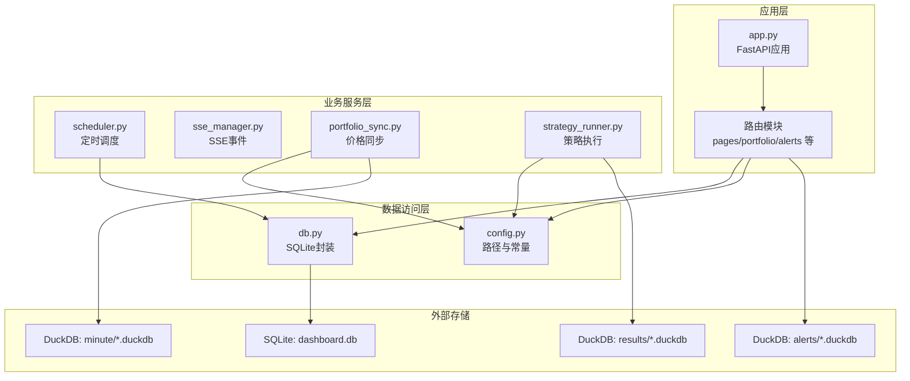
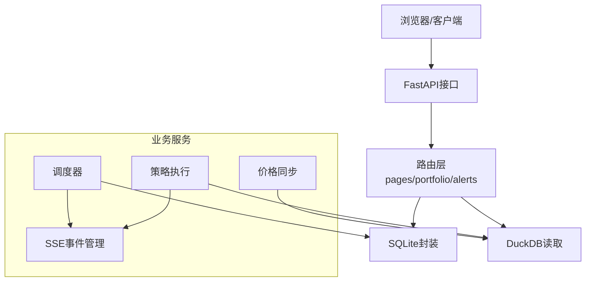
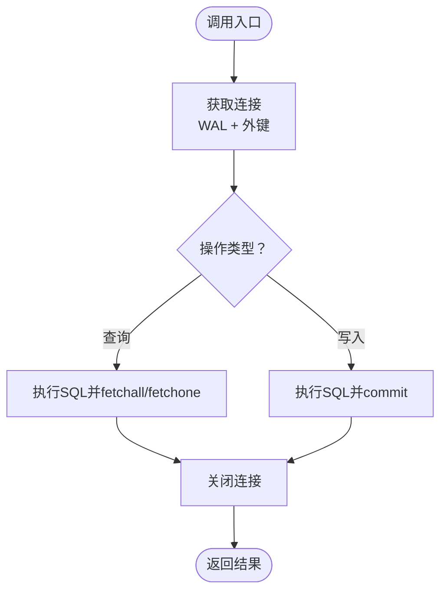
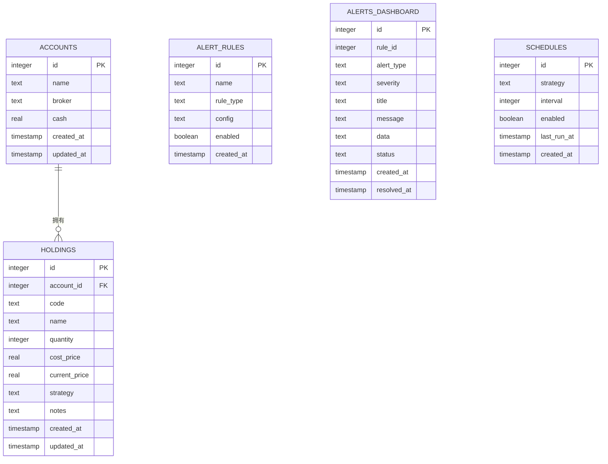
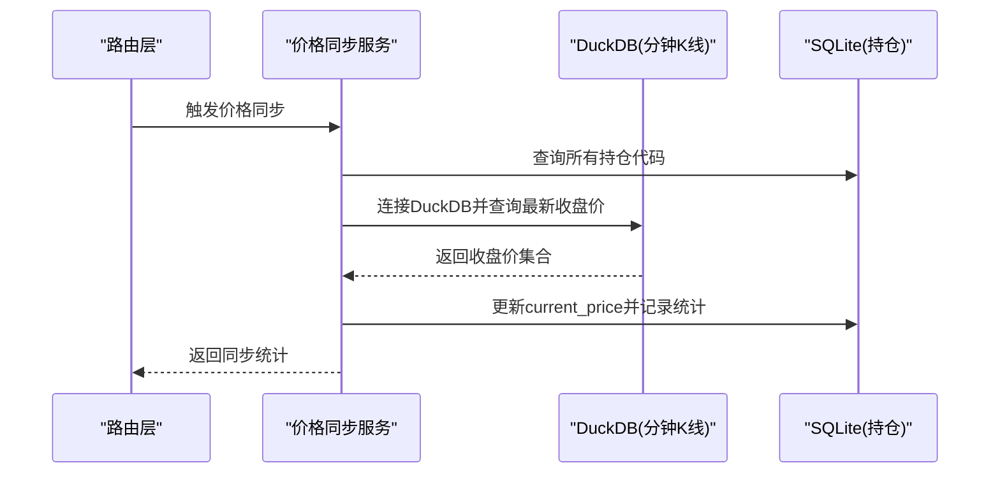
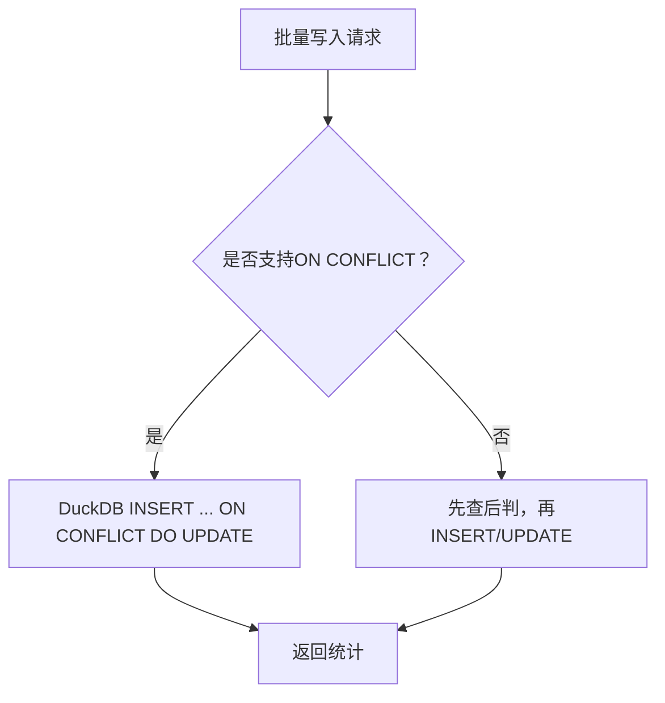
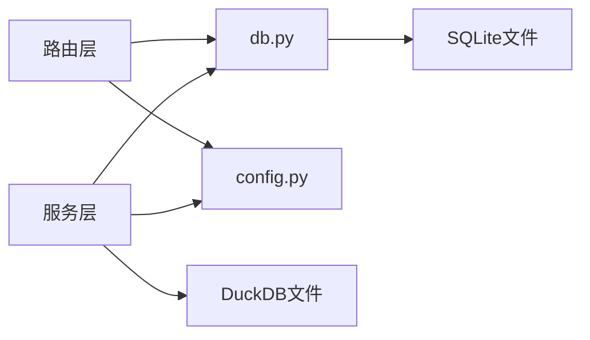

# 数据存储设计

<cite>
**本文档引用的文件**
- [src/quant_etf/dashboard/db.py](file://src/quant_etf/dashboard/db.py)
- [src/quant_etf/dashboard/models.py](file://src/quant_etf/dashboard/models.py)
- [src/quant_etf/dashboard/app.py](file://src/quant_etf/dashboard/app.py)
- [src/quant_etf/dashboard/config.py](file://src/quant_etf/dashboard/config.py)
- [src/quant_etf/dashboard/routes/portfolio.py](file://src/quant_etf/dashboard/routes/portfolio.py)
- [src/quant_etf/dashboard/routes/alerts.py](file://src/quant_etf/dashboard/routes/alerts.py)
- [src/quant_etf/dashboard/services/scheduler.py](file://src/quant_etf/dashboard/services/scheduler.py)
- [src/quant_etf/dashboard/services/sse_manager.py](file://src/quant_etf/dashboard/services/sse_manager.py)
- [src/quant_etf/dashboard/services/portfolio_sync.py](file://src/quant_etf/dashboard/services/portfolio_sync.py)
- [src/quant_etf/dashboard/services/strategy_runner.py](file://src/quant_etf/dashboard/services/strategy_runner.py)
- [src/quant_etf/dashboard/routers/pages.py](file://src/quant_etf/dashboard/routers/pages.py)
- [src/quant_etf/conf.py](file://src/quant_etf/conf.py)
- [tests/test_duckdb_conflict.py](file://tests/test_duckdb_conflict.py)
</cite>

## 目录
1. [简介](#简介)
2. [项目结构](#项目结构)
3. [核心组件](#核心组件)
4. [架构总览](#架构总览)
5. [详细组件分析](#详细组件分析)
6. [依赖关系分析](#依赖关系分析)
7. [性能考量](#性能考量)
8. [故障排查指南](#故障排查指南)
9. [结论](#结论)
10. [附录](#附录)

## 简介
本文件面向Dashboard数据存储系统，围绕SQLite与DuckDB混合存储架构进行系统化技术说明。重点涵盖：
- 数据库连接与事务管理
- 数据模型、表结构与索引策略
- 数据迁移、备份与一致性保障
- ORM映射与查询优化、批量操作
- 数据访问模式、缓存与性能调优
- 安全、权限与审计日志

该系统采用“看板业务数据用SQLite、历史/实时行情与策略结果用DuckDB”的混合架构，既满足看板业务的低复杂度、强一致需求，又利用DuckDB在分析型场景下的高性能。

## 项目结构
Dashboard数据存储相关模块分布如下：
- 应用入口与路由：FastAPI应用、页面路由、业务API路由
- 数据访问层：SQLite封装、DuckDB读取
- 业务服务：调度、SSE事件、价格同步、策略执行
- 配置与常量：数据库路径、阈值、主机端口等

**图表来源**
- [src/quant_etf/dashboard/app.py:1-107](file://src/quant_etf/dashboard/app.py#L1-L107)
- [src/quant_etf/dashboard/db.py:1-133](file://src/quant_etf/dashboard/db.py#L1-L133)
- [src/quant_etf/dashboard/config.py:1-25](file://src/quant_etf/dashboard/config.py#L1-L25)
- [src/quant_etf/dashboard/services/scheduler.py:1-82](file://src/quant_etf/dashboard/services/scheduler.py#L1-L82)
- [src/quant_etf/dashboard/services/sse_manager.py:1-45](file://src/quant_etf/dashboard/services/sse_manager.py#L1-L45)
- [src/quant_etf/dashboard/services/portfolio_sync.py:1-87](file://src/quant_etf/dashboard/services/portfolio_sync.py#L1-L87)
- [src/quant_etf/dashboard/services/strategy_runner.py:1-164](file://src/quant_etf/dashboard/services/strategy_runner.py#L1-L164)

**章节来源**
- [src/quant_etf/dashboard/app.py:1-107](file://src/quant_etf/dashboard/app.py#L1-L107)
- [src/quant_etf/dashboard/config.py:1-25](file://src/quant_etf/dashboard/config.py#L1-L25)

## 核心组件
- SQLite封装（db.py）
  - 提供连接工厂、初始化建表、查询、单行查询、写入、批量写入等基础能力
  - 使用WAL模式与外键约束，确保并发与一致性
- DuckDB读取（多处服务）
  - 从DuckDB读取监控信号、分钟K线、策略结果，用于展示与分析
  - 支持只读连接与按需查询
- 业务路由与服务
  - 持仓管理、告警规则与看板告警、页面渲染、SSE事件、调度与策略执行
- 配置中心
  - 统一管理数据库路径、主机端口、心跳间隔、阈值等

**章节来源**
- [src/quant_etf/dashboard/db.py:1-133](file://src/quant_etf/dashboard/db.py#L1-L133)
- [src/quant_etf/dashboard/config.py:1-25](file://src/quant_etf/dashboard/config.py#L1-L25)
- [src/quant_etf/dashboard/services/portfolio_sync.py:1-87](file://src/quant_etf/dashboard/services/portfolio_sync.py#L1-L87)
- [src/quant_etf/dashboard/services/strategy_runner.py:1-164](file://src/quant_etf/dashboard/services/strategy_runner.py#L1-L164)

## 架构总览
系统采用“看板业务数据（SQLite）+ 分析数据（DuckDB）”的混合架构：
- SQLite负责看板业务的强一致数据：账户、持仓、告警规则、调度配置
- DuckDB负责历史/实时行情与策略结果：分钟K线、监控信号、策略输出
- 通过SSE实现事件推送，通过调度器周期性触发策略执行

**图表来源**
- [src/quant_etf/dashboard/app.py:1-107](file://src/quant_etf/dashboard/app.py#L1-L107)
- [src/quant_etf/dashboard/routes/portfolio.py:1-175](file://src/quant_etf/dashboard/routes/portfolio.py#L1-L175)
- [src/quant_etf/dashboard/routes/alerts.py:1-105](file://src/quant_etf/dashboard/routes/alerts.py#L1-L105)
- [src/quant_etf/dashboard/services/scheduler.py:1-82](file://src/quant_etf/dashboard/services/scheduler.py#L1-L82)
- [src/quant_etf/dashboard/services/sse_manager.py:1-45](file://src/quant_etf/dashboard/services/sse_manager.py#L1-L45)
- [src/quant_etf/dashboard/services/portfolio_sync.py:1-87](file://src/quant_etf/dashboard/services/portfolio_sync.py#L1-L87)
- [src/quant_etf/dashboard/services/strategy_runner.py:1-164](file://src/quant_etf/dashboard/services/strategy_runner.py#L1-L164)

## 详细组件分析

### SQLite封装与事务管理
- 连接工厂
  - 自动创建目录、设置Row工厂、启用WAL模式、开启外键约束
- 初始化建表
  - 原子脚本执行，确保表结构一次性就绪
- 查询与写入
  - 提供查询列表、查询单行、写入并返回lastrowid、批量写入
- 事务特性
  - 写操作显式commit；未使用上下文管理器，建议在关键路径增加with/commit/rollback保护

**图表来源**
- [src/quant_etf/dashboard/db.py:69-133](file://src/quant_etf/dashboard/db.py#L69-L133)

**章节来源**
- [src/quant_etf/dashboard/db.py:1-133](file://src/quant_etf/dashboard/db.py#L1-L133)

### 数据模型与表结构
- 账户表（accounts）
  - 字段：自增主键、名称、券商、现金、时间戳
- 持仓表（holdings）
  - 字段：自增主键、账户外键、股票代码、名称、数量、成本价、当前价、策略、备注、时间戳
  - 外键约束：账户删除级联删除持仓
- 告警规则表（alert_rules）
  - 字段：自增主键、规则名、规则类型、配置（JSON）、启用状态、创建时间
- 看板告警表（alerts_dashboard）
  - 字段：自增主键、规则ID、告警类型、严重级别、标题、消息、数据、状态、创建时间、解决时间
- 调度表（schedules）
  - 字段：自增主键、策略名、间隔秒、启用状态、最后运行时间、创建时间

**图表来源**
- [src/quant_etf/dashboard/db.py:11-66](file://src/quant_etf/dashboard/db.py#L11-L66)

**章节来源**
- [src/quant_etf/dashboard/db.py:11-66](file://src/quant_etf/dashboard/db.py#L11-L66)

### DuckDB读取与混合存储
- 价格同步（portfolio_sync）
  - 从DuckDB minute_bars读取最新收盘价，回写到SQLite holdings.current_price
- 监控信号（alerts）
  - 从DuckDB alerts读取监控信号，用于前端展示
- 策略结果（strategy_runner）
  - 从CSV读取策略结果，用于告警对比与前端展示

**图表来源**
- [src/quant_etf/dashboard/services/portfolio_sync.py:15-87](file://src/quant_etf/dashboard/services/portfolio_sync.py#L15-L87)
- [src/quant_etf/dashboard/db.py:93-133](file://src/quant_etf/dashboard/db.py#L93-L133)

**章节来源**
- [src/quant_etf/dashboard/services/portfolio_sync.py:1-87](file://src/quant_etf/dashboard/services/portfolio_sync.py#L1-L87)
- [src/quant_etf/dashboard/routes/alerts.py:79-105](file://src/quant_etf/dashboard/routes/alerts.py#L79-L105)
- [src/quant_etf/dashboard/services/strategy_runner.py:128-164](file://src/quant_etf/dashboard/services/strategy_runner.py#L128-L164)

### 事务处理与一致性
- SQLite写操作均显式commit，保证单次操作原子性
- 外键级联删除确保账户删除时自动清理其持仓
- 建议在跨多语句事务中引入上下文管理器或显式回滚逻辑，以提升健壮性

**章节来源**
- [src/quant_etf/dashboard/db.py:114-133](file://src/quant_etf/dashboard/db.py#L114-L133)

### ORM映射与数据校验
- Pydantic模型用于请求体校验与默认值设置
  - AccountCreate/Update、HoldingCreate/Update、AlertRuleCreate、AlertUpdate、ScheduleCreate、StrategyRunRequest
- 建议在数据访问层引入SQLAlchemy ORM，以获得更丰富的CRUD与关系映射能力，并统一事务管理

**章节来源**
- [src/quant_etf/dashboard/models.py:1-54](file://src/quant_etf/dashboard/models.py#L1-L54)

### 查询优化与批量操作
- 查询优化
  - 对高频字段建立索引（如holdings.code、accounts.id、alerts_dashboard.status等）
  - 使用LIMIT限制结果集大小（如告警列表限制100条）
- 批量操作
  - 使用executemany进行批量写入
  - DuckDB支持ON CONFLICT DO UPDATE，可用于高效合并写入（见测试用例）

**图表来源**
- [tests/test_duckdb_conflict.py:1-364](file://tests/test_duckdb_conflict.py#L1-L364)

**章节来源**
- [src/quant_etf/dashboard/db.py:125-133](file://src/quant_etf/dashboard/db.py#L125-L133)
- [tests/test_duckdb_conflict.py:1-364](file://tests/test_duckdb_conflict.py#L1-L364)

### 数据迁移、备份与恢复
- 迁移
  - 建议采用版本化迁移脚本，先备份再变更，结合SQLite的PRAGMA与ALTER TABLE
- 备份
  - SQLite：直接复制dashboard.db文件；DuckDB：复制对应.duckdb文件
- 恢复
  - 停止服务后替换数据库文件，重启后验证数据完整性

**章节来源**
- [src/quant_etf/dashboard/db.py:79-91](file://src/quant_etf/dashboard/db.py#L79-L91)

### 数据访问模式与缓存策略
- 访问模式
  - 路由层调用db.py执行SQL；服务层读取DuckDB并回写SQLite
- 缓存
  - 可在服务层对热点数据（如ETF名称映射）做内存缓存，减少IO
  - SSE事件用于前端增量更新，降低轮询压力

**章节来源**
- [src/quant_etf/dashboard/routes/portfolio.py:18-27](file://src/quant_etf/dashboard/routes/portfolio.py#L18-L27)
- [src/quant_etf/dashboard/services/sse_manager.py:1-45](file://src/quant_etf/dashboard/services/sse_manager.py#L1-L45)

### 安全、权限与审计
- 安全
  - 仅本地监听（默认127.0.0.1），可通过反向代理暴露
  - 环境变量控制主机与端口
- 权限
  - 文件系统层面控制数据库文件读写权限
- 审计
  - 日志记录异常与关键事件；SSE事件可用于前端审计展示

**章节来源**
- [src/quant_etf/dashboard/config.py:17-18](file://src/quant_etf/dashboard/config.py#L17-L18)
- [src/quant_etf/dashboard/app.py:68-72](file://src/quant_etf/dashboard/app.py#L68-L72)

## 依赖关系分析
- 组件耦合
  - 路由层依赖db.py与config.py；服务层依赖db.py与config.py
  - DuckDB路径集中于config.py，便于统一管理
- 外部依赖
  - sqlite3、duckdb、pandas、loguru、fastapi、pydantic

**图表来源**
- [src/quant_etf/dashboard/routes/portfolio.py:1-175](file://src/quant_etf/dashboard/routes/portfolio.py#L1-L175)
- [src/quant_etf/dashboard/routes/alerts.py:1-105](file://src/quant_etf/dashboard/routes/alerts.py#L1-L105)
- [src/quant_etf/dashboard/services/portfolio_sync.py:1-87](file://src/quant_etf/dashboard/services/portfolio_sync.py#L1-L87)
- [src/quant_etf/dashboard/services/strategy_runner.py:1-164](file://src/quant_etf/dashboard/services/strategy_runner.py#L1-L164)
- [src/quant_etf/dashboard/db.py:1-133](file://src/quant_etf/dashboard/db.py#L1-L133)
- [src/quant_etf/dashboard/config.py:1-25](file://src/quant_etf/dashboard/config.py#L1-L25)

**章节来源**
- [src/quant_etf/dashboard/db.py:1-133](file://src/quant_etf/dashboard/db.py#L1-L133)
- [src/quant_etf/dashboard/config.py:1-25](file://src/quant_etf/dashboard/config.py#L1-L25)

## 性能考量
- SQLite
  - WAL模式提升并发读写；外键约束带来额外开销，但保证数据一致性
  - 建议对高频查询字段建立索引
- DuckDB
  - 适用于大规模分析查询；支持ON CONFLICT DO UPDATE，适合批量合并写入
- 事件驱动
  - SSE心跳与广播降低轮询成本，提升用户体验

**章节来源**
- [src/quant_etf/dashboard/db.py:74-76](file://src/quant_etf/dashboard/db.py#L74-L76)
- [src/quant_etf/dashboard/services/sse_manager.py:14-32](file://src/quant_etf/dashboard/services/sse_manager.py#L14-L32)
- [tests/test_duckdb_conflict.py:1-364](file://tests/test_duckdb_conflict.py#L1-L364)

## 故障排查指南
- 数据库连接失败
  - 检查DASHBOARD_DB_PATH是否存在且可写
  - 确认WAL模式与外键设置是否生效
- DuckDB读取异常
  - 确认对应.duckdb文件存在且可读
  - 检查表结构与列名是否匹配
- SSE连接中断
  - 检查心跳间隔与客户端超时设置
- 事务问题
  - 确保写操作后commit；必要时引入回滚逻辑

**章节来源**
- [src/quant_etf/dashboard/db.py:69-91](file://src/quant_etf/dashboard/db.py#L69-L91)
- [src/quant_etf/dashboard/services/portfolio_sync.py:22-25](file://src/quant_etf/dashboard/services/portfolio_sync.py#L22-L25)
- [src/quant_etf/dashboard/services/sse_manager.py:23-32](file://src/quant_etf/dashboard/services/sse_manager.py#L23-L32)

## 结论
本系统通过SQLite与DuckDB的混合架构，实现了看板业务的强一致与分析场景的高性能读取。建议后续引入ORM、索引优化、事务上下文管理与更完善的备份恢复流程，以进一步提升可维护性与稳定性。

## 附录
- 环境变量
  - DASHBOARD_HOST、DASHBOARD_PORT、DASHBOARD_RELOAD
- 常量
  - SSE_HEARTBEAT_INTERVAL、ALERT_MOMENTUM_SHOCK_THRESHOLD

**章节来源**
- [src/quant_etf/dashboard/config.py:17-25](file://src/quant_etf/dashboard/config.py#L17-L25)
- [src/quant_etf/conf.py:1-137](file://src/quant_etf/conf.py#L1-L137)