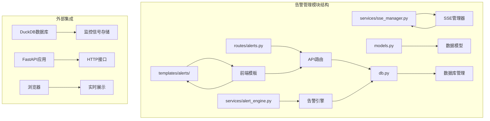
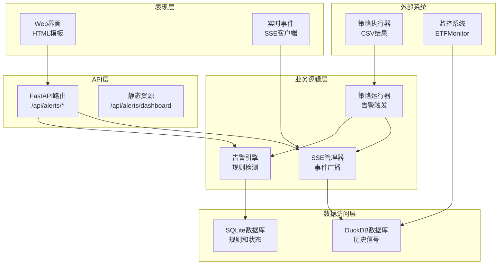
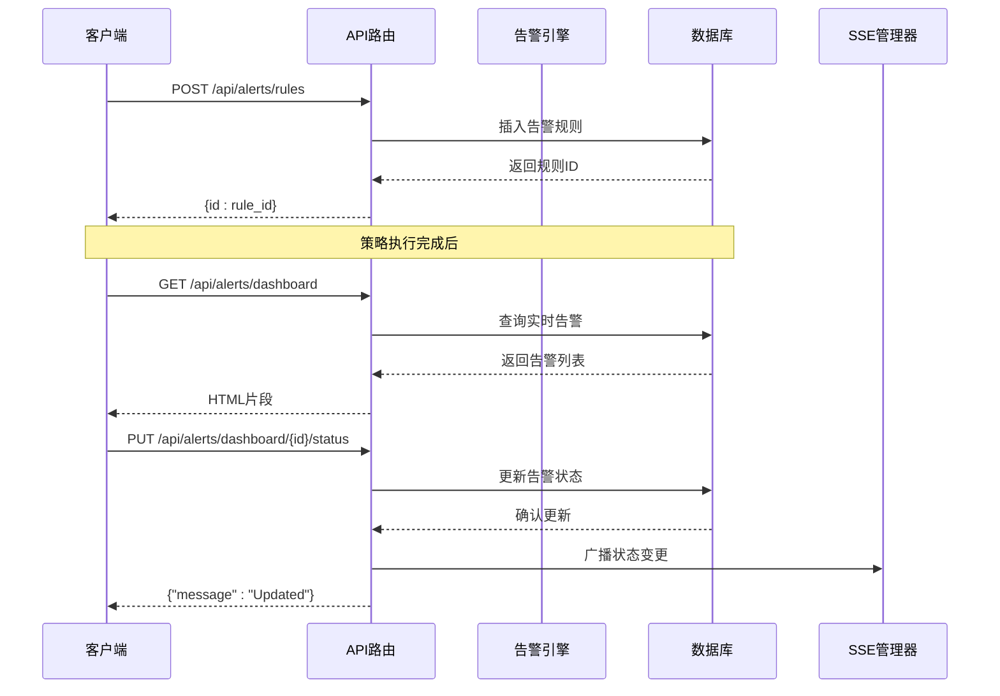
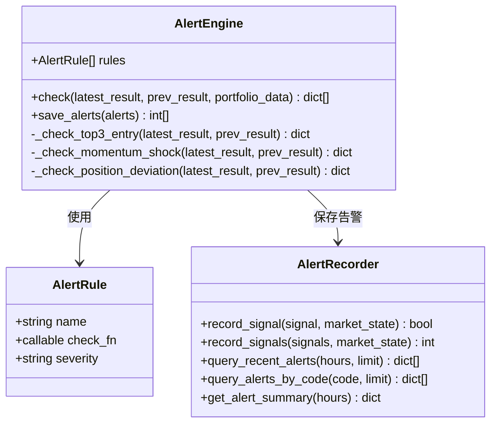
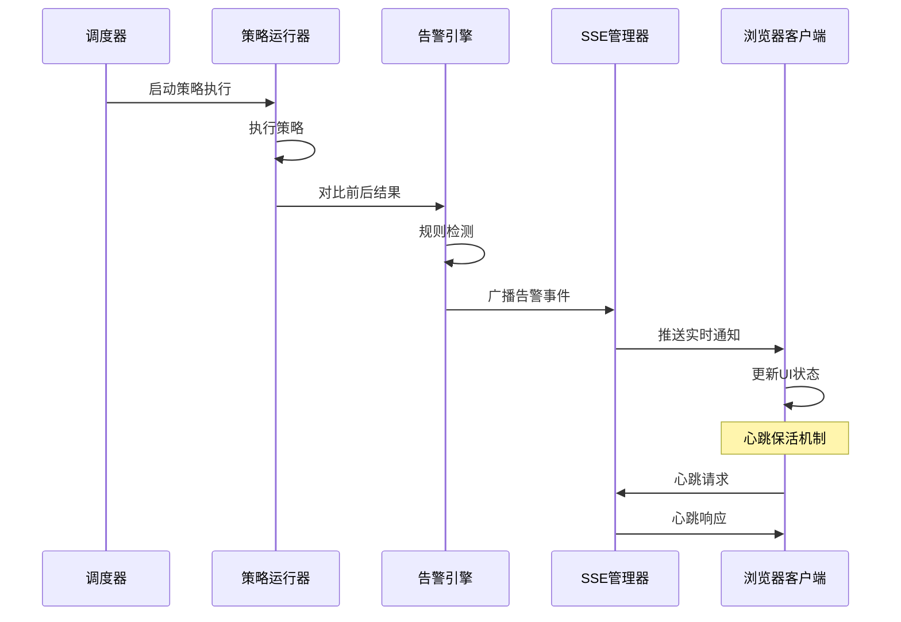
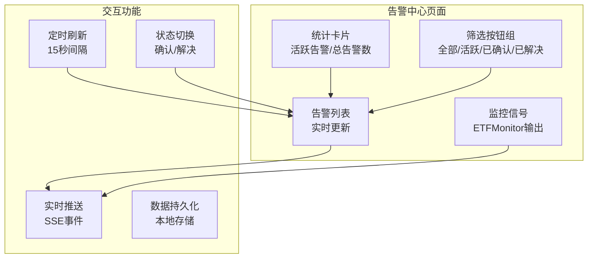
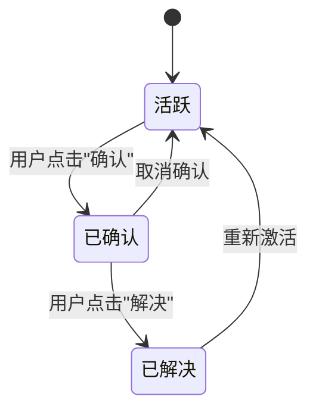
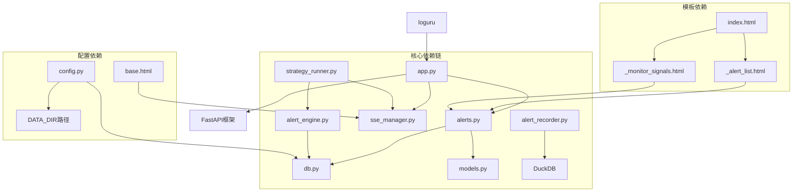
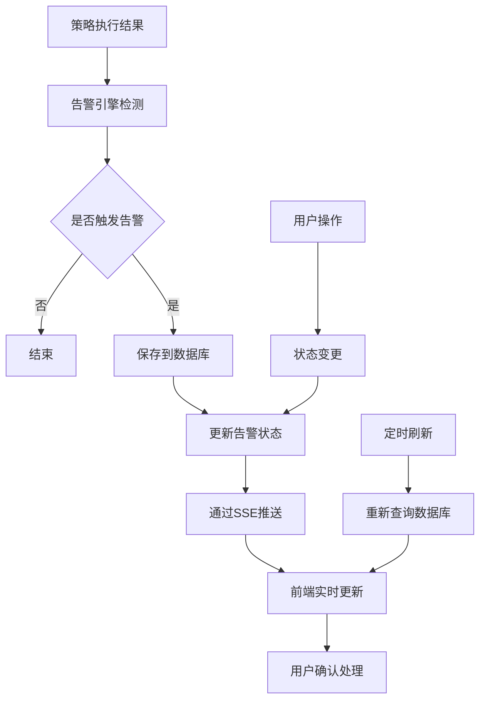

# 告警管理页面

<cite>
**本文档引用的文件**
- [alerts.py](file://src/quant_etf/dashboard/routes/alerts.py)
- [alert_engine.py](file://src/quant_etf/dashboard/services/alert_engine.py)
- [sse_manager.py](file://src/quant_etf/dashboard/services/sse_manager.py)
- [alert_recorder.py](file://src/quant_etf/alert_recorder.py)
- [index.html](file://src/quant_etf/dashboard/templates/alerts/index.html)
- [_alert_list.html](file://src/quant_etf/dashboard/templates/alerts/_alert_list.html)
- [_monitor_signals.html](file://src/quant_etf/dashboard/templates/alerts/_monitor_signals.html)
- [models.py](file://src/quant_etf/dashboard/models.py)
- [db.py](file://src/quant_etf/dashboard/db.py)
- [app.py](file://src/quant_etf/dashboard/app.py)
- [config.py](file://src/quant_etf/dashboard/config.py)
- [strategy_runner.py](file://src/quant_etf/dashboard/services/strategy_runner.py)
- [base.html](file://src/quant_etf/dashboard/templates/base.html)
</cite>

## 目录
1. [简介](#简介)
2. [项目结构](#项目结构)
3. [核心组件](#核心组件)
4. [架构概览](#架构概览)
5. [详细组件分析](#详细组件分析)
6. [依赖关系分析](#依赖关系分析)
7. [性能考虑](#性能考虑)
8. [故障排除指南](#故障排除指南)
9. [结论](#结论)

## 简介

告警管理页面是量化ETF看板系统的核心功能模块，负责监控和管理交易过程中的各种异常情况和重要事件。该系统实现了完整的告警生命周期管理，包括告警规则配置、实时告警展示、历史告警查询、监控信号管理等功能。

系统采用分层架构设计，通过FastAPI提供RESTful API接口，使用SQLite存储告警规则和状态，通过DuckDB存储历史监控信号，并利用Server-Sent Events (SSE)实现实时推送功能。告警系统支持多种告警级别（信息、警告、危险），提供灵活的通知方式配置和用户自定义规则设置。

## 项目结构

告警管理模块位于`src/quant_etf/dashboard/`目录下，采用功能模块化组织：

**图表来源**
- [alerts.py:1-105](file://src/quant_etf/dashboard/routes/alerts.py#L1-L105)
- [alert_engine.py:1-120](file://src/quant_etf/dashboard/services/alert_engine.py#L1-L120)
- [sse_manager.py:1-45](file://src/quant_etf/dashboard/services/sse_manager.py#L1-L45)

**章节来源**
- [alerts.py:1-105](file://src/quant_etf/dashboard/routes/alerts.py#L1-L105)
- [alert_engine.py:1-120](file://src/quant_etf/dashboard/services/alert_engine.py#L1-L120)
- [sse_manager.py:1-45](file://src/quant_etf/dashboard/services/sse_manager.py#L1-L45)

## 核心组件

### 告警规则引擎

告警引擎是系统的核心决策组件，负责检测和评估潜在问题。当前实现包含三个预定义规则：

1. **评分进入前三** - 检测是否有新的标的首次进入评分前3名
2. **动量得分突变** - 监控标的动量得分的大幅变化（阈值15%）
3. **持仓偏离目标** - 预留功能，用于检测投资组合偏离目标配置

每个规则都有对应的严重级别分类：
- 信息级 (info) - 一般性提示信息
- 警告级 (warning) - 需要关注但不紧急的情况
- 危险级 (danger) - 需要立即处理的紧急情况

### 数据存储架构

系统采用双数据库架构：
- **SQLite数据库** (`dashboard.db`) - 存储告警规则、状态和配置
- **DuckDB数据库** (`alerts/alerts.duckdb`) - 存储历史监控信号和统计信息

关键数据表结构：
- `alert_rules` - 告警规则配置表
- `alerts_dashboard` - 实时告警状态表
- `alerts` - 历史监控信号表

### 实时推送系统

通过Server-Sent Events (SSE)实现低延迟的实时通知：
- 支持心跳保活机制
- 自动断线重连
- 多客户端并发支持
- 事件类型区分（告警、策略执行、错误等）

**章节来源**
- [alert_engine.py:20-120](file://src/quant_etf/dashboard/services/alert_engine.py#L20-L120)
- [db.py:36-56](file://src/quant_etf/dashboard/db.py#L36-L56)
- [config.py:23-25](file://src/quant_etf/dashboard/config.py#L23-L25)

## 架构概览

告警管理系统采用分层架构，各层职责明确：

**图表来源**
- [app.py:17-25](file://src/quant_etf/dashboard/app.py#L17-L25)
- [alerts.py:16-105](file://src/quant_etf/dashboard/routes/alerts.py#L16-L105)
- [strategy_runner.py:72-101](file://src/quant_etf/dashboard/services/strategy_runner.py#L72-L101)

## 详细组件分析

### API路由层

告警管理API提供完整的RESTful接口：

#### 告警规则管理
- `GET /api/alerts/rules` - 列出所有告警规则
- `POST /api/alerts/rules` - 创建新告警规则
- `DELETE /api/alerts/rules/{rule_id}` - 删除告警规则

#### 实时告警管理
- `GET /api/alerts/dashboard` - 获取实时告警列表
- `PUT /api/alerts/dashboard/{alert_id}/status` - 更新告警状态
- `GET /api/alerts/dashboard/stats` - 获取告警统计信息

#### 监控信号管理
- `GET /api/alerts/monitor-signals` - 获取监控信号列表

**图表来源**
- [alerts.py:16-68](file://src/quant_etf/dashboard/routes/alerts.py#L16-L68)
- [alert_engine.py:98-116](file://src/quant_etf/dashboard/services/alert_engine.py#L98-L116)

**章节来源**
- [alerts.py:16-105](file://src/quant_etf/dashboard/routes/alerts.py#L16-L105)
- [models.py:37-45](file://src/quant_etf/dashboard/models.py#L37-L45)

### 告警引擎

告警引擎采用可扩展的设计模式，支持动态规则注册和执行：

**图表来源**
- [alert_engine.py:13-120](file://src/quant_etf/dashboard/services/alert_engine.py#L13-L120)
- [alert_recorder.py:78-233](file://src/quant_etf/alert_recorder.py#L78-L233)

#### 规则检测算法

系统实现了三种核心检测算法：

1. **评分进入前三检测**
   - 比较最新和之前的评分结果
   - 识别从队外进入前三的新标的
   - 计算变化百分比和影响范围

2. **动量得分突变检测**
   - 计算相邻时刻的得分变化率
   - 应用15%的阈值判断突变
   - 生成详细的变动报告

3. **持仓偏离检测**（预留）
   - 结合投资组合数据进行分析
   - 为后续功能扩展做准备

**章节来源**
- [alert_engine.py:30-80](file://src/quant_etf/dashboard/services/alert_engine.py#L30-L80)
- [config.py:24](file://src/quant_etf/dashboard/config.py#L24)

### SSE实时推送系统

SSE管理器提供高效的消息推送机制：

**图表来源**
- [strategy_runner.py:72-99](file://src/quant_etf/dashboard/services/strategy_runner.py#L72-L99)
- [sse_manager.py:14-41](file://src/quant_etf/dashboard/services/sse_manager.py#L14-L41)

#### 连接管理特性

- **心跳保活**：每30秒发送心跳包防止连接中断
- **自动清理**：异常断开时自动移除失效连接
- **并发支持**：支持多个客户端同时连接
- **事件类型**：区分不同类型的推送消息

**章节来源**
- [sse_manager.py:10-45](file://src/quant_etf/dashboard/services/sse_manager.py#L10-L45)
- [base.html:119-143](file://src/quant_etf/dashboard/templates/base.html#L119-L143)

### 前端界面组件

告警管理页面采用响应式设计，提供直观的用户交互体验：

#### 主界面布局

**图表来源**
- [index.html:8-51](file://src/quant_etf/dashboard/templates/alerts/index.html#L8-L51)
- [_alert_list.html:16-62](file://src/quant_etf/dashboard/templates/alerts/_alert_list.html#L16-L62)

#### 状态管理流程

告警状态从"活跃"到"已解决"的完整流转过程：

**图表来源**
- [alerts.py:55-68](file://src/quant_etf/dashboard/routes/alerts.py#L55-L68)
- [_alert_list.html:40-59](file://src/quant_etf/dashboard/templates/alerts/_alert_list.html#L40-L59)

**章节来源**
- [index.html:1-77](file://src/quant_etf/dashboard/templates/alerts/index.html#L1-L77)
- [_monitor_signals.html:1-69](file://src/quant_etf/dashboard/templates/alerts/_monitor_signals.html#L1-L69)

## 依赖关系分析

告警管理系统各组件之间的依赖关系清晰明确：

**图表来源**
- [app.py:13-24](file://src/quant_etf/dashboard/app.py#L13-L24)
- [alerts.py:7-11](file://src/quant_etf/dashboard/routes/alerts.py#L7-L11)
- [alert_engine.py:10](file://src/quant_etf/dashboard/services/alert_engine.py#L10)

### 数据流分析

告警数据在系统内的完整流转路径：

**图表来源**
- [strategy_runner.py:72-99](file://src/quant_etf/dashboard/services/strategy_runner.py#L72-L99)
- [alert_engine.py:82-96](file://src/quant_etf/dashboard/services/alert_engine.py#L82-L96)

**章节来源**
- [db.py:11-66](file://src/quant_etf/dashboard/db.py#L11-L66)
- [config.py:1-25](file://src/quant_etf/dashboard/config.py#L1-L25)

## 性能考虑

### 数据库优化

系统采用多种优化策略确保高性能：

1. **索引优化**
   - SQLite: 为常用查询字段建立索引
   - DuckDB: 优化时间序列查询性能

2. **连接池管理**
   - SQLite: WAL模式提高并发性能
   - DuckDB: 只读连接优化查询速度

3. **查询优化**
   - 分页查询避免大数据集传输
   - 条件过滤减少数据处理量

### 实时推送优化

SSE系统采用以下优化措施：

1. **心跳机制**
   - 30秒心跳保活，平衡资源消耗
   - 异常断开自动清理

2. **事件压缩**
   - 合并相似事件
   - 批量推送减少网络开销

3. **客户端缓存**
   - 前端状态缓存
   - 避免重复渲染

### 内存管理

系统注意内存使用效率：

- 及时释放数据库连接
- 异常处理中的资源清理
- 大数据集的分批处理

## 故障排除指南

### 常见问题及解决方案

#### SSE连接问题

**症状**：浏览器显示连接断开状态
**可能原因**：
- 网络防火墙阻止SSE连接
- 服务器配置问题
- 客户端浏览器限制

**解决方案**：
1. 检查服务器端口开放情况
2. 验证CORS配置
3. 确认浏览器支持EventSource API

#### 告警不触发

**症状**：策略执行完成但无告警产生
**可能原因**：
- 规则配置不正确
- 数据格式不匹配
- 阈值设置过于严格

**解决方案**：
1. 检查规则配置的有效性
2. 验证输入数据格式
3. 调整检测阈值

#### 数据库连接问题

**症状**：无法查询或保存告警数据
**可能原因**：
- 数据库文件损坏
- 权限不足
- 磁盘空间不足

**解决方案**：
1. 检查数据库文件完整性
2. 验证文件权限设置
3. 清理磁盘空间

**章节来源**
- [base.html:135-143](file://src/quant_etf/dashboard/templates/base.html#L135-L143)
- [alert_engine.py:45-47](file://src/quant_etf/dashboard/services/alert_engine.py#L45-L47)

### 日志分析

系统使用loguru进行详细日志记录：

1. **告警检测日志**：记录规则执行结果
2. **数据库操作日志**：跟踪数据读写操作
3. **SSE连接日志**：监控实时推送状态
4. **异常处理日志**：记录错误和警告信息

### 监控指标

建议关注的关键指标：
- 告警触发频率
- 数据库查询响应时间
- SSE连接数量
- 系统内存使用率

## 结论

告警管理页面是一个功能完整、架构清晰的实时监控系统。通过合理的分层设计和模块化组织，系统实现了高效的告警检测、存储和展示功能。

### 主要优势

1. **实时性强**：基于SSE的低延迟推送机制
2. **扩展性好**：可插拔的规则引擎设计
3. **用户体验佳**：直观的界面和流畅的交互
4. **可靠性高**：完善的错误处理和恢复机制

### 技术特色

- **双数据库架构**：兼顾实时性和历史数据存储
- **智能告警规则**：基于业务逻辑的自动化检测
- **可视化展示**：丰富的图表和状态指示
- **移动端适配**：响应式设计支持多设备访问

### 发展建议

1. **增强规则引擎**：支持更复杂的业务规则
2. **完善通知渠道**：集成邮件、短信等多种通知方式
3. **优化性能**：引入缓存机制提升查询速度
4. **扩展监控维度**：增加更多业务指标监控

该系统为量化ETF交易提供了重要的风险控制和决策支持功能，为后续的功能扩展和性能优化奠定了良好的基础。