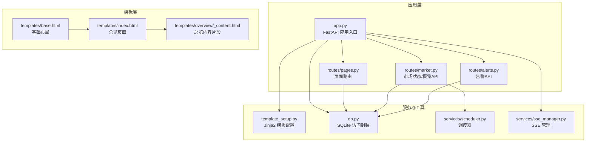
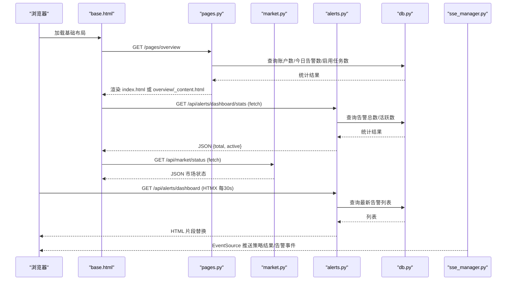
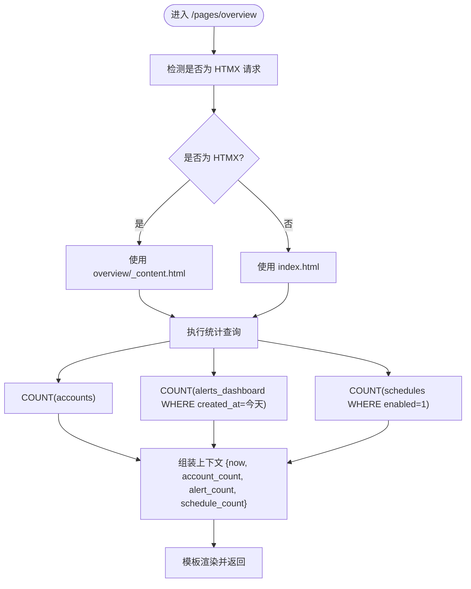
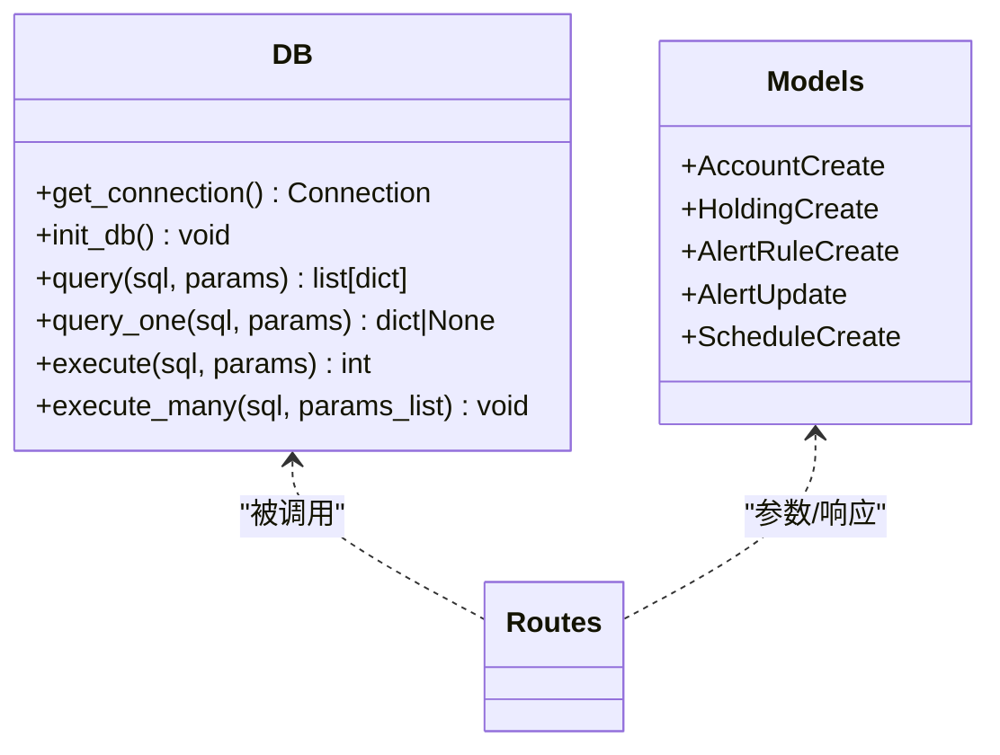
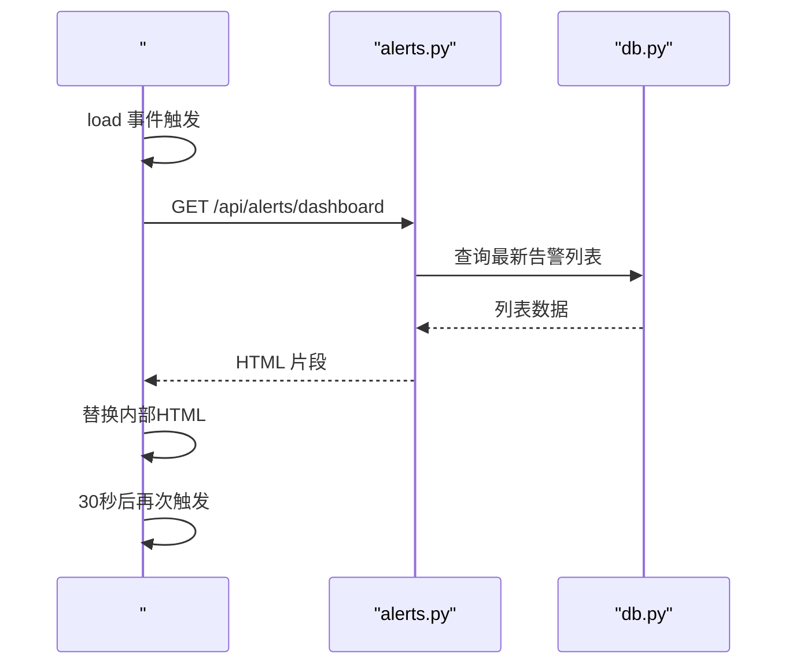
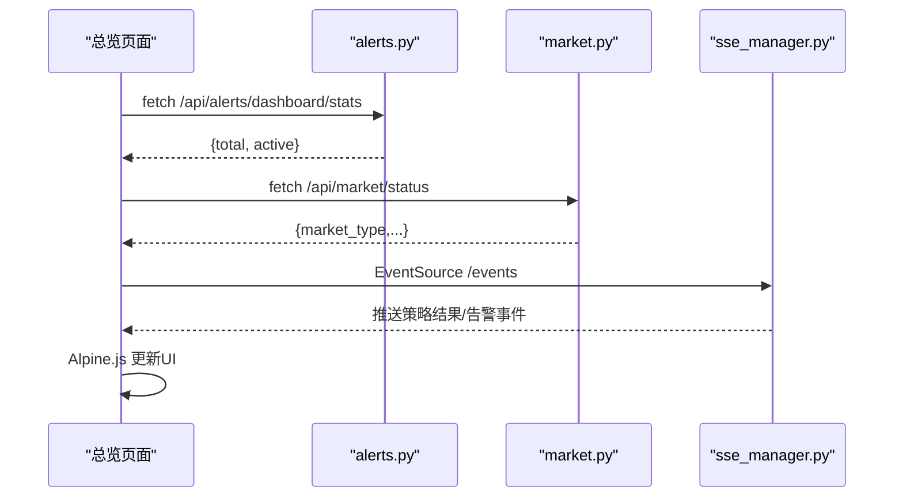
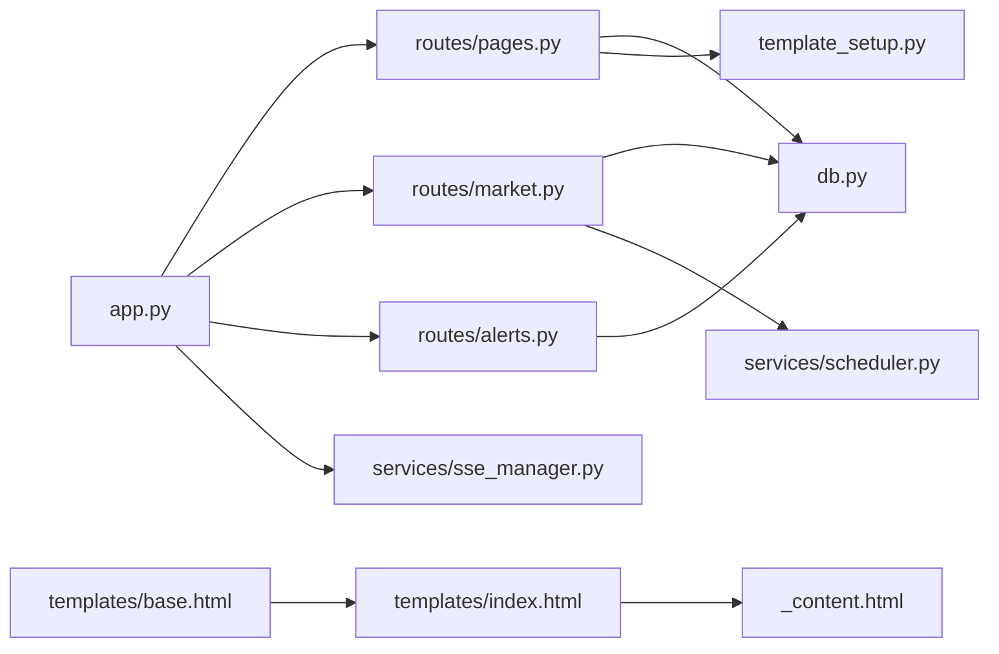

# 总览页面

<cite>
**本文引用的文件**
- [src/quant_etf/dashboard/app.py](file://src/quant_etf/dashboard/app.py)
- [src/quant_etf/dashboard/routes/pages.py](file://src/quant_etf/dashboard/routes/pages.py)
- [src/quant_etf/dashboard/routes/market.py](file://src/quant_etf/dashboard/routes/market.py)
- [src/quant_etf/dashboard/routes/alerts.py](file://src/quant_etf/dashboard/routes/alerts.py)
- [src/quant_etf/dashboard/db.py](file://src/quant_etf/dashboard/db.py)
- [src/quant_etf/dashboard/template_setup.py](file://src/quant_etf/dashboard/template_setup.py)
- [src/quant_etf/dashboard/templates/base.html](file://src/quant_etf/dashboard/templates/base.html)
- [src/quant_etf/dashboard/templates/index.html](file://src/quant_etf/dashboard/templates/index.html)
- [src/quant_etf/dashboard/templates/overview/_content.html](file://src/quant_etf/dashboard/templates/overview/_content.html)
- [src/quant_etf/dashboard/services/scheduler.py](file://src/quant_etf/dashboard/services/scheduler.py)
- [src/quant_etf/dashboard/services/sse_manager.py](file://src/quant_etf/dashboard/services/sse_manager.py)
- [src/quant_etf/dashboard/config.py](file://src/quant_etf/dashboard/config.py)
</cite>

## 目录
1. [简介](#简介)
2. [项目结构](#项目结构)
3. [核心组件](#核心组件)
4. [架构总览](#架构总览)
5. [详细组件分析](#详细组件分析)
6. [依赖分析](#依赖分析)
7. [性能考虑](#性能考虑)
8. [故障排查指南](#故障排查指南)
9. [结论](#结论)
10. [附录](#附录)

## 简介
本文件为 Dashboard 总览页面的功能文档，聚焦以下目标：
- 解释总览页面的核心统计信息展示功能，包括账户数量、今日告警数、启用任务数等关键指标的实时显示。
- 说明统计数据的数据库查询逻辑、模板渲染机制和 HTMX 异步加载实现。
- 描述页面布局结构、响应式设计与用户交互体验。
- 提供统计数据的来源分析与更新频率说明。

## 项目结构
总览页面由 FastAPI 应用驱动，通过路由渲染模板，并结合 SQLite 数据库查询、Alpine.js 与 HTMX 实现前端动态更新，同时通过 SSE 推送策略执行结果等事件。

图表来源
- [src/quant_etf/dashboard/app.py:17-24](file://src/quant_etf/dashboard/app.py#L17-L24)
- [src/quant_etf/dashboard/routes/pages.py:13-13](file://src/quant_etf/dashboard/routes/pages.py#L13-L13)
- [src/quant_etf/dashboard/routes/market.py:15-15](file://src/quant_etf/dashboard/routes/market.py#L15-L15)
- [src/quant_etf/dashboard/routes/alerts.py:13-13](file://src/quant_etf/dashboard/routes/alerts.py#L13-L13)
- [src/quant_etf/dashboard/template_setup.py:8-9](file://src/quant_etf/dashboard/template_setup.py#L8-L9)
- [src/quant_etf/dashboard/db.py:69-133](file://src/quant_etf/dashboard/db.py#L69-L133)
- [src/quant_etf/dashboard/services/scheduler.py:15-82](file://src/quant_etf/dashboard/services/scheduler.py#L15-L82)
- [src/quant_etf/dashboard/services/sse_manager.py:10-45](file://src/quant_etf/dashboard/services/sse_manager.py#L10-L45)
- [src/quant_etf/dashboard/templates/base.html:1-154](file://src/quant_etf/dashboard/templates/base.html#L1-L154)
- [src/quant_etf/dashboard/templates/index.html:1-100](file://src/quant_etf/dashboard/templates/index.html#L1-L100)
- [src/quant_etf/dashboard/templates/overview/_content.html:1-96](file://src/quant_etf/dashboard/templates/overview/_content.html#L1-L96)

章节来源
- [src/quant_etf/dashboard/app.py:17-24](file://src/quant_etf/dashboard/app.py#L17-L24)
- [src/quant_etf/dashboard/template_setup.py:8-9](file://src/quant_etf/dashboard/template_setup.py#L8-L9)
- [src/quant_etf/dashboard/templates/base.html:1-154](file://src/quant_etf/dashboard/templates/base.html#L1-L154)

## 核心组件
- 应用入口与路由挂载：应用启动时挂载页面与各模块路由，并在启动/关闭时初始化数据库与调度器。
- 页面路由与上下文：总览页面路由负责生成“当前时间”和三大核心指标（账户数、今日告警数、启用任务数），并根据是否为 HTMX 请求选择完整页面或内容片段。
- 数据库查询封装：统一的 SQLite 查询接口，支持字典行工厂、WAL 模式与外键约束，确保查询结果可直接用于模板渲染。
- 模板系统：基于 Jinja2 的模板配置，支持完整页面与内容片段两种渲染模式；基础模板引入 Bootstrap、Alpine.js、HTMX、Chart.js 等资源。
- 前端动态更新：总览页面模板通过 Alpine.js 初始化并使用 fetch 获取活跃告警数与市场状态；通过 HTMX 每 30 秒轮询最新告警列表；SSE 事件流用于接收策略执行结果等推送消息。
- 市场状态与概览 API：提供市场状态接口与总览数据卡片接口，用于后端直出与前端动态更新。

章节来源
- [src/quant_etf/dashboard/app.py:53-65](file://src/quant_etf/dashboard/app.py#L53-L65)
- [src/quant_etf/dashboard/routes/pages.py:25-44](file://src/quant_etf/dashboard/routes/pages.py#L25-L44)
- [src/quant_etf/dashboard/db.py:93-133](file://src/quant_etf/dashboard/db.py#L93-L133)
- [src/quant_etf/dashboard/template_setup.py:8-9](file://src/quant_etf/dashboard/template_setup.py#L8-L9)
- [src/quant_etf/dashboard/templates/index.html:4-24](file://src/quant_etf/dashboard/templates/index.html#L4-L24)
- [src/quant_etf/dashboard/routes/market.py:18-33](file://src/quant_etf/dashboard/routes/market.py#L18-L33)
- [src/quant_etf/dashboard/routes/alerts.py:71-76](file://src/quant_etf/dashboard/routes/alerts.py#L71-L76)

## 架构总览
下图展示了从浏览器请求到数据渲染与动态更新的整体流程。

图表来源
- [src/quant_etf/dashboard/routes/pages.py:40-44](file://src/quant_etf/dashboard/routes/pages.py#L40-L44)
- [src/quant_etf/dashboard/routes/market.py:18-33](file://src/quant_etf/dashboard/routes/market.py#L18-L33)
- [src/quant_etf/dashboard/routes/alerts.py:71-76](file://src/quant_etf/dashboard/routes/alerts.py#L71-L76)
- [src/quant_etf/dashboard/db.py:93-133](file://src/quant_etf/dashboard/db.py#L93-L133)
- [src/quant_etf/dashboard/templates/base.html:100-143](file://src/quant_etf/dashboard/templates/base.html#L100-L143)
- [src/quant_etf/dashboard/templates/overview/_content.html:89-91](file://src/quant_etf/dashboard/templates/overview/_content.html#L89-L91)

## 详细组件分析

### 页面路由与统计计算
- 路由定义：总览页面路由支持完整页面与内容片段两种返回方式，依据请求头判断是否为 HTMX 请求。
- 统计计算：
  - 账户数量：对 accounts 表进行 COUNT(*)。
  - 今日告警数：对 alerts_dashboard 表按创建日期等于“今天”进行 COUNT(*)。
  - 启用任务数：对 schedules 表按 enabled=1 进行 COUNT(*)。
- 上下文注入：将“当前时间”与三大统计指标一并传入模板上下文。

图表来源
- [src/quant_etf/dashboard/routes/pages.py:25-44](file://src/quant_etf/dashboard/routes/pages.py#L25-L44)
- [src/quant_etf/dashboard/db.py:93-133](file://src/quant_etf/dashboard/db.py#L93-L133)

章节来源
- [src/quant_etf/dashboard/routes/pages.py:40-44](file://src/quant_etf/dashboard/routes/pages.py#L40-L44)
- [src/quant_etf/dashboard/db.py:93-133](file://src/quant_etf/dashboard/db.py#L93-L133)

### 数据库查询逻辑
- 连接与初始化：首次使用时创建数据库目录与 WAL 模式开启，保证并发读写性能与可靠性。
- 查询封装：提供通用 query/query_one/execute/execute_many，返回字典行以适配模板渲染。
- 关键查询：
  - 账户数：accounts 表 COUNT。
  - 今日告警数：alerts_dashboard 表按日期过滤 COUNT。
  - 启用任务数：schedules 表按 enabled=1 COUNT。
  - 告警统计：alerts 表 COUNT 与按 status='active' COUNT。
  - 市场状态：调用外部市场分析模块返回状态类型与指标。

图表来源
- [src/quant_etf/dashboard/db.py:69-133](file://src/quant_etf/dashboard/db.py#L69-L133)
- [src/quant_etf/dashboard/models.py:1-54](file://src/quant_etf/dashboard/models.py#L1-L54)

章节来源
- [src/quant_etf/dashboard/db.py:69-133](file://src/quant_etf/dashboard/db.py#L69-L133)
- [src/quant_etf/dashboard/models.py:1-54](file://src/quant_etf/dashboard/models.py#L1-L54)

### 模板渲染机制
- 完整页面 vs 内容片段：
  - 完整页面：index.html 继承 base.html，包含完整的头部、侧边栏与主内容区。
  - 内容片段：overview/_content.html 仅包含总览卡片与最新告警区域，用于 HTMX 局部刷新。
- 上下文变量：
  - now：当前时间字符串，用于显示“最后更新”。
  - account_count、alert_count、schedule_count：来自后端统计。
- 响应式布局：Bootstrap 响应式网格在不同屏幕尺寸下自动调整卡片排列。

章节来源
- [src/quant_etf/dashboard/templates/index.html:1-100](file://src/quant_etf/dashboard/templates/index.html#L1-L100)
- [src/quant_etf/dashboard/templates/overview/_content.html:1-96](file://src/quant_etf/dashboard/templates/overview/_content.html#L1-L96)
- [src/quant_etf/dashboard/templates/base.html:1-154](file://src/quant_etf/dashboard/templates/base.html#L1-L154)

### HTMX 异步加载实现
- 最新告警列表：容器元素设置 hx-get 与每 30 秒触发一次，自动拉取最新告警列表片段并替换内容。
- 事件触发：load 事件在初次加载时触发，确保页面打开即开始轮询。
- 局部更新：仅替换容器内部 HTML，避免整页刷新，提升交互流畅度。

图表来源
- [src/quant_etf/dashboard/templates/overview/_content.html:89-91](file://src/quant_etf/dashboard/templates/overview/_content.html#L89-L91)
- [src/quant_etf/dashboard/routes/alerts.py:39-52](file://src/quant_etf/dashboard/routes/alerts.py#L39-L52)

章节来源
- [src/quant_etf/dashboard/templates/overview/_content.html:89-91](file://src/quant_etf/dashboard/templates/overview/_content.html#L89-L91)
- [src/quant_etf/dashboard/routes/alerts.py:39-52](file://src/quant_etf/dashboard/routes/alerts.py#L39-L52)

### 前端动态更新与 SSE 推送
- 活跃告警数与市场状态：页面加载时通过 fetch 获取 /api/alerts/dashboard/stats 与 /api/market/status，并使用 Alpine.js 双向绑定更新界面。
- SSE 事件流：浏览器通过 EventSource 订阅 /events，接收策略执行结果、告警事件等推送消息；SSE 管理器维护队列并在心跳间隔内发送心跳，保持长连接。
- 交互反馈：SSE 连接状态在顶部导航栏徽章中显示“已连接/已断开”。

图表来源
- [src/quant_etf/dashboard/templates/index.html:4-24](file://src/quant_etf/dashboard/templates/index.html#L4-L24)
- [src/quant_etf/dashboard/routes/alerts.py:71-76](file://src/quant_etf/dashboard/routes/alerts.py#L71-L76)
- [src/quant_etf/dashboard/routes/market.py:18-33](file://src/quant_etf/dashboard/routes/market.py#L18-L33)
- [src/quant_etf/dashboard/services/sse_manager.py:14-41](file://src/quant_etf/dashboard/services/sse_manager.py#L14-L41)
- [src/quant_etf/dashboard/templates/base.html:119-143](file://src/quant_etf/dashboard/templates/base.html#L119-L143)

章节来源
- [src/quant_etf/dashboard/templates/index.html:4-24](file://src/quant_etf/dashboard/templates/index.html#L4-L24)
- [src/quant_etf/dashboard/routes/alerts.py:71-76](file://src/quant_etf/dashboard/routes/alerts.py#L71-L76)
- [src/quant_etf/dashboard/routes/market.py:18-33](file://src/quant_etf/dashboard/routes/market.py#L18-L33)
- [src/quant_etf/dashboard/services/sse_manager.py:14-41](file://src/quant_etf/dashboard/services/sse_manager.py#L14-L41)
- [src/quant_etf/dashboard/templates/base.html:119-143](file://src/quant_etf/dashboard/templates/base.html#L119-L143)

### 市场状态与可用策略
- 市场状态：聚合指数与 ETF 池的多项指标，返回市场类型与相关比率，前端据此为卡片文本添加颜色类名。
- 可用策略：当前固定显示为 3（占位），后续可扩展为从策略注册中心动态获取。

章节来源
- [src/quant_etf/dashboard/routes/market.py:18-33](file://src/quant_etf/dashboard/routes/market.py#L18-L33)
- [src/quant_etf/dashboard/templates/index.html:58-61](file://src/quant_etf/dashboard/templates/index.html#L58-L61)

## 依赖分析
- 组件耦合：
  - app.py 作为入口，集中挂载路由、初始化数据库与调度器，耦合度较低但职责集中。
  - routes/pages.py 依赖 db.py 进行统计查询，依赖 template_setup.py 进行模板渲染。
  - templates/index.html 与 overview/_content.html 依赖前端库（Alpine.js、HTMX、Chart.js）与后端 API。
  - services/scheduler.py 与 services/sse_manager.py 分别负责后台任务与事件推送，与路由层通过广播/查询间接耦合。
- 外部依赖：
  - SQLite：本地存储账户、持仓、告警规则、调度配置。
  - DuckDB：用于监控信号读取（告警模块），与总览页面无直接耦合。
  - Bootstrap/Bootstrap Icons/Chart.js/Alpine.js/HTMX：前端 UI 与交互能力。

图表来源
- [src/quant_etf/dashboard/app.py:17-24](file://src/quant_etf/dashboard/app.py#L17-L24)
- [src/quant_etf/dashboard/routes/pages.py:10-13](file://src/quant_etf/dashboard/routes/pages.py#L10-L13)
- [src/quant_etf/dashboard/routes/market.py:9-12](file://src/quant_etf/dashboard/routes/market.py#L9-L12)
- [src/quant_etf/dashboard/routes/alerts.py:8-11](file://src/quant_etf/dashboard/routes/alerts.py#L8-L11)
- [src/quant_etf/dashboard/db.py:69-133](file://src/quant_etf/dashboard/db.py#L69-L133)
- [src/quant_etf/dashboard/template_setup.py:8-9](file://src/quant_etf/dashboard/template_setup.py#L8-L9)
- [src/quant_etf/dashboard/services/scheduler.py:15-82](file://src/quant_etf/dashboard/services/scheduler.py#L15-L82)
- [src/quant_etf/dashboard/services/sse_manager.py:10-45](file://src/quant_etf/dashboard/services/sse_manager.py#L10-L45)
- [src/quant_etf/dashboard/templates/base.html:1-154](file://src/quant_etf/dashboard/templates/base.html#L1-L154)
- [src/quant_etf/dashboard/templates/index.html:1-100](file://src/quant_etf/dashboard/templates/index.html#L1-L100)
- [src/quant_etf/dashboard/templates/overview/_content.html:1-96](file://src/quant_etf/dashboard/templates/overview/_content.html#L1-L96)

章节来源
- [src/quant_etf/dashboard/app.py:17-24](file://src/quant_etf/dashboard/app.py#L17-L24)
- [src/quant_etf/dashboard/routes/pages.py:10-13](file://src/quant_etf/dashboard/routes/pages.py#L10-L13)
- [src/quant_etf/dashboard/db.py:69-133](file://src/quant_etf/dashboard/db.py#L69-L133)
- [src/quant_etf/dashboard/services/scheduler.py:15-82](file://src/quant_etf/dashboard/services/scheduler.py#L15-L82)
- [src/quant_etf/dashboard/services/sse_manager.py:10-45](file://src/quant_etf/dashboard/services/sse_manager.py#L10-L45)
- [src/quant_etf/dashboard/templates/base.html:1-154](file://src/quant_etf/dashboard/templates/base.html#L1-L154)

## 性能考虑
- 数据库优化：
  - 使用 WAL 模式提升并发读写性能；外键约束保障数据一致性。
  - 查询封装返回字典行，减少 ORM 开销，适合小规模本地数据库。
- 前端性能：
  - HTMX 局部刷新避免整页重绘；Chart.js 按需引入，减少首屏体积。
  - Alpine.js 双向绑定仅作用于局部 DOM，降低全局重排成本。
- SSE 连接：
  - 心跳机制维持长连接，避免频繁握手；客户端断线自动重连。
- 更新频率：
  - 最新告警列表每 30 秒轮询一次，平衡实时性与服务器压力。
  - 市场状态与活跃告警数在页面加载时一次性获取，后续由 SSE 推送增量更新。

## 故障排查指南
- 页面空白或 404：
  - 检查路由挂载与模板路径；确认 base.html 是否正确继承 index.html。
- 统计数据不更新：
  - 确认 /api/alerts/dashboard/stats 与 /api/market/status 能正常返回 JSON。
  - 检查 SQLite 表是否存在且有数据（accounts、alerts_dashboard、schedules）。
- HTMX 轮询无效：
  - 查看浏览器网络面板，确认 /api/alerts/dashboard 是否返回 200 与 HTML 片段。
  - 确认容器元素的 hx-get 与 hx-trigger 配置正确。
- SSE 断开：
  - 查看顶部“SSE 状态”徽章；检查 /events 是否返回 200；查看浏览器控制台错误。
  - 确认服务端未因优雅关闭超时导致 SSE 阻塞。

章节来源
- [src/quant_etf/dashboard/routes/alerts.py:71-76](file://src/quant_etf/dashboard/routes/alerts.py#L71-L76)
- [src/quant_etf/dashboard/routes/market.py:18-33](file://src/quant_etf/dashboard/routes/market.py#L18-L33)
- [src/quant_etf/dashboard/db.py:93-133](file://src/quant_etf/dashboard/db.py#L93-L133)
- [src/quant_etf/dashboard/templates/base.html:119-143](file://src/quant_etf/dashboard/templates/base.html#L119-L143)

## 结论
总览页面通过清晰的路由分层、简洁的数据库封装与成熟的前端技术栈，实现了账户数、今日告警数、启用任务数等关键指标的实时展示。HTMX 与 Alpine.js 的组合提供了良好的交互体验，SSE 则保证了事件的即时推送。整体架构易于扩展，后续可在“可用策略”等占位区域接入动态数据源。

## 附录
- 数据统计来源与更新频率
  - 账户数：来自 accounts 表 COUNT，页面加载时一次性获取。
  - 今日告警数：来自 alerts_dashboard 表按创建日期过滤 COUNT，页面加载时一次性获取。
  - 启用任务数：来自 schedules 表按 enabled=1 COUNT，页面加载时一次性获取。
  - 活跃告警数：来自 /api/alerts/dashboard/stats 的实时统计，页面加载时一次性获取。
  - 市场状态：来自 /api/market/status 的实时状态，页面加载时一次性获取。
  - 最新告警列表：每 30 秒通过 HTMX 轮询更新。
  - 策略执行结果与告警事件：通过 SSE 推送，实时更新界面。

章节来源
- [src/quant_etf/dashboard/routes/pages.py:25-44](file://src/quant_etf/dashboard/routes/pages.py#L25-L44)
- [src/quant_etf/dashboard/routes/alerts.py:71-76](file://src/quant_etf/dashboard/routes/alerts.py#L71-L76)
- [src/quant_etf/dashboard/routes/market.py:18-33](file://src/quant_etf/dashboard/routes/market.py#L18-L33)
- [src/quant_etf/dashboard/templates/overview/_content.html:89-91](file://src/quant_etf/dashboard/templates/overview/_content.html#L89-L91)
- [src/quant_etf/dashboard/services/sse_manager.py:14-41](file://src/quant_etf/dashboard/services/sse_manager.py#L14-L41)