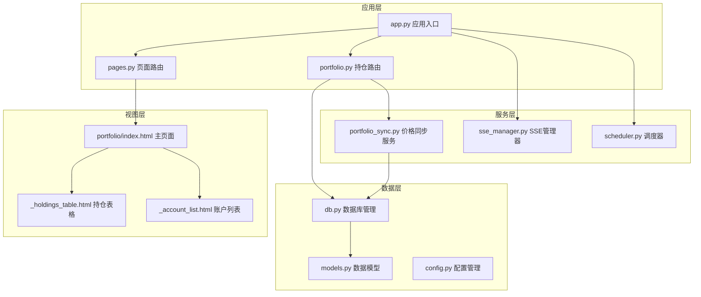
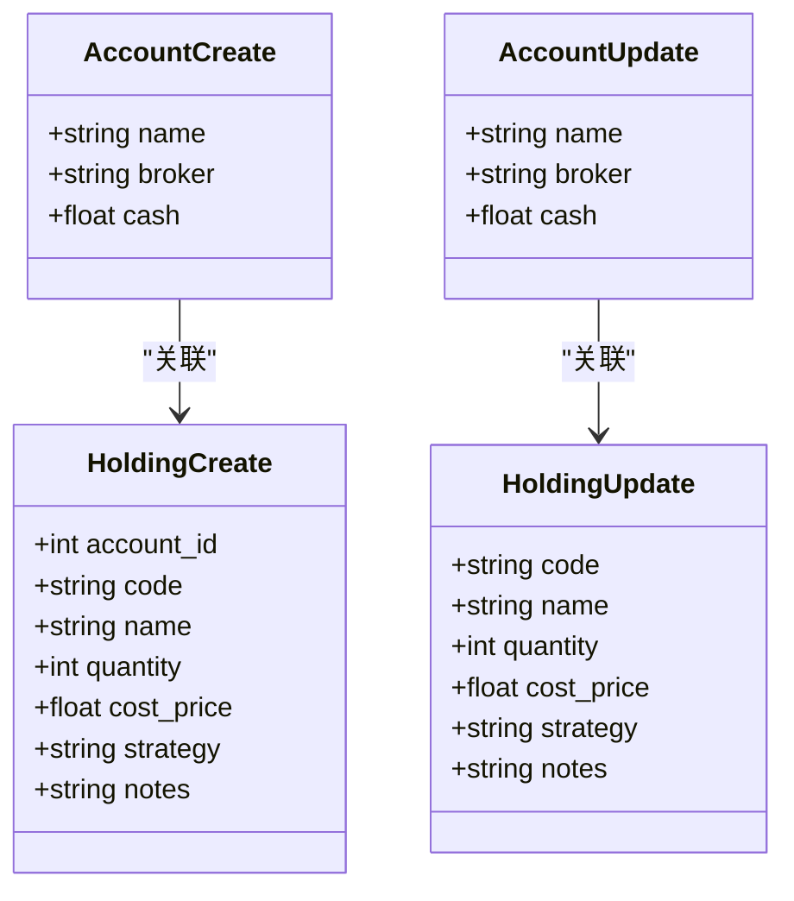
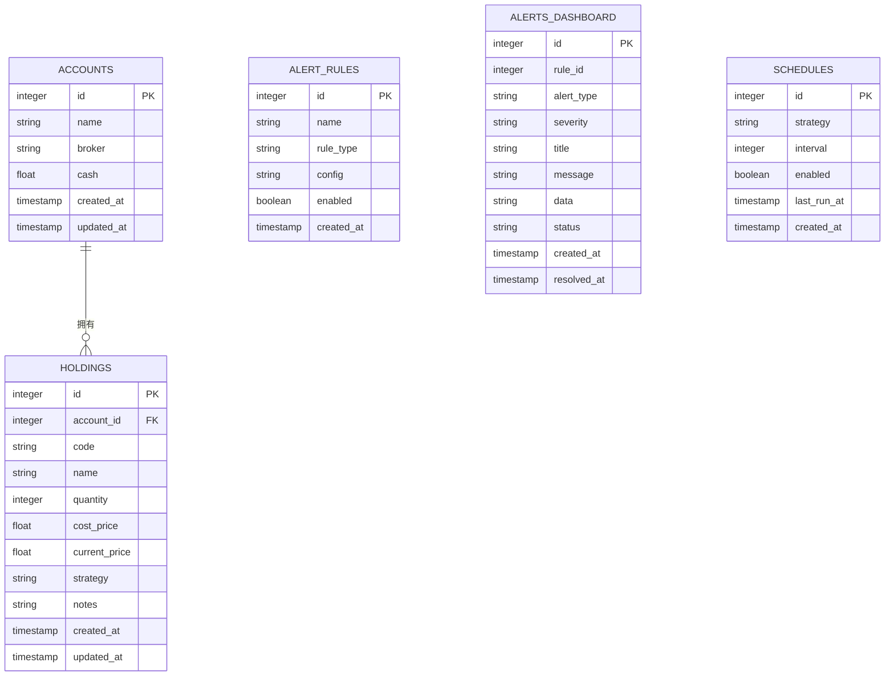
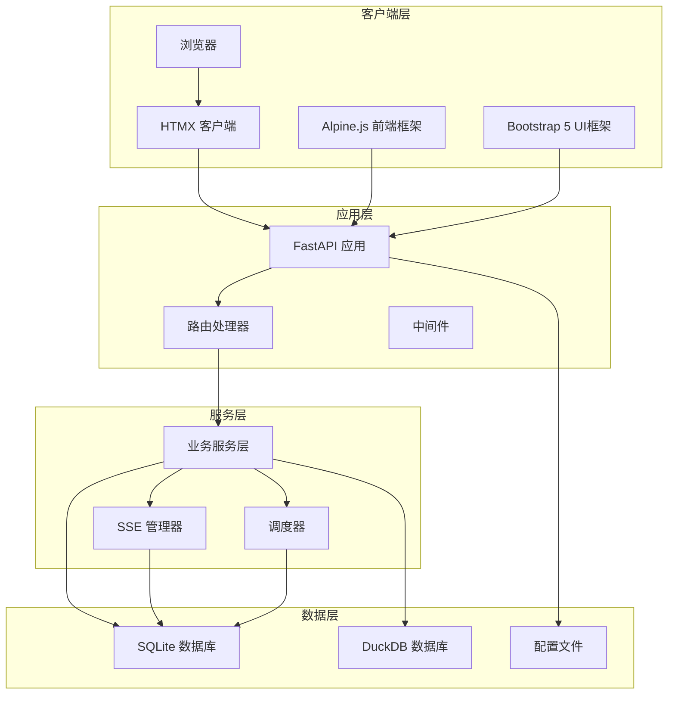
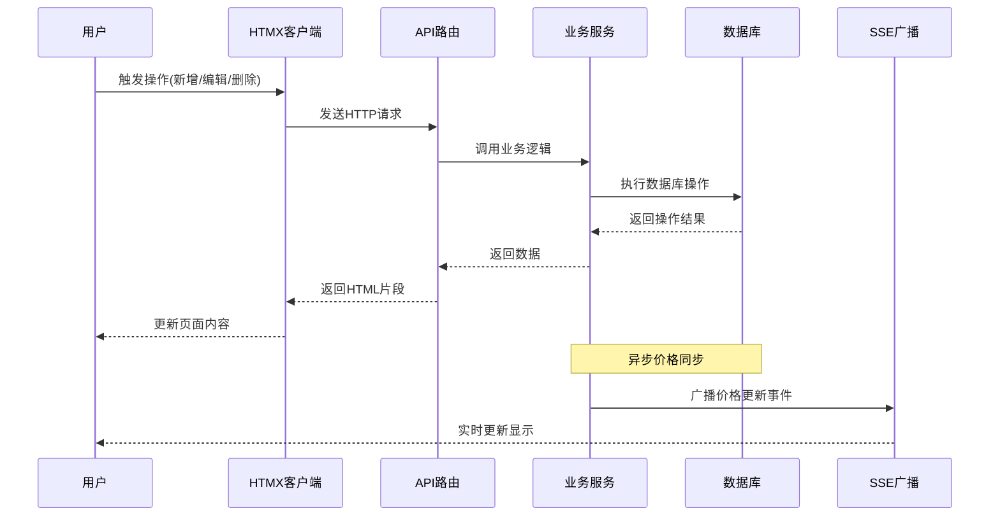
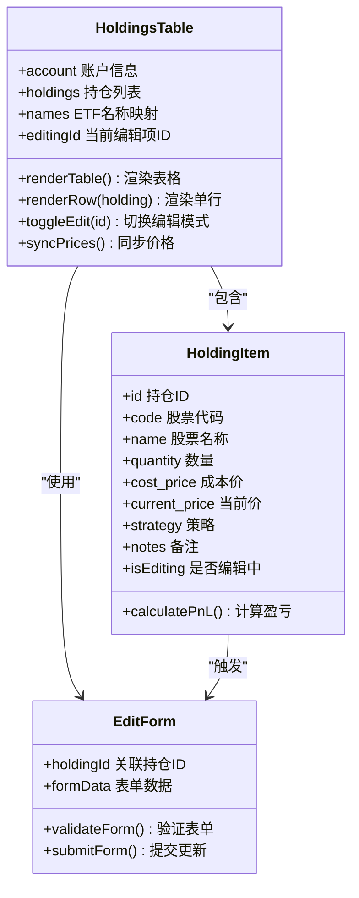
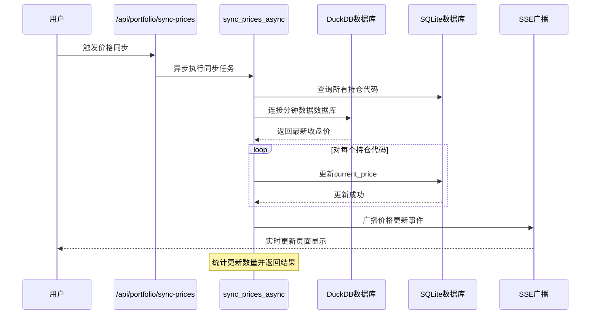
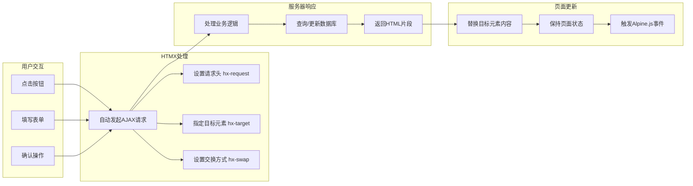
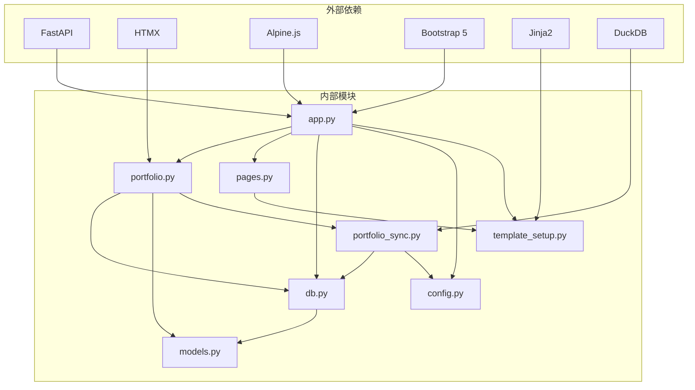
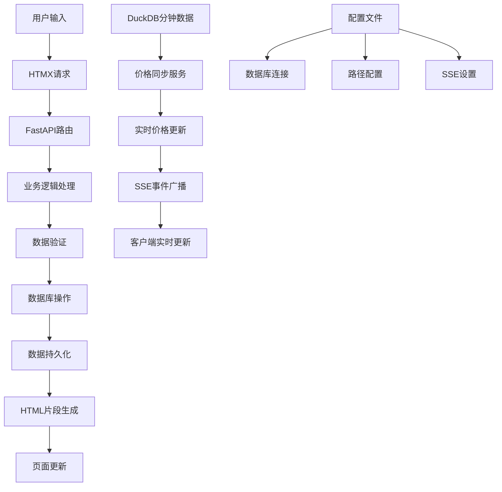

# 持仓管理页面

<cite>
**本文档引用的文件**
- [app.py](file://src/quant_etf/dashboard/app.py)
- [portfolio.py](file://src/quant_etf/dashboard/routes/portfolio.py)
- [pages.py](file://src/quant_etf/dashboard/routes/pages.py)
- [portfolio/index.html](file://src/quant_etf/dashboard/templates/portfolio/index.html)
- [_holdings_table.html](file://src/quant_etf/dashboard/templates/portfolio/_holdings_table.html)
- [_account_list.html](file://src/quant_etf/dashboard/templates/portfolio/_account_list.html)
- [models.py](file://src/quant_etf/dashboard/models.py)
- [db.py](file://src/quant_etf/dashboard/db.py)
- [portfolio_sync.py](file://src/quant_etf/dashboard/services/portfolio_sync.py)
- [config.py](file://src/quant_etf/dashboard/config.py)
- [template_setup.py](file://src/quant_etf/dashboard/template_setup.py)
</cite>

## 目录
1. [简介](#简介)
2. [项目结构](#项目结构)
3. [核心组件](#核心组件)
4. [架构概览](#架构概览)
5. [详细组件分析](#详细组件分析)
6. [依赖关系分析](#依赖关系分析)
7. [性能考虑](#性能考虑)
8. [故障排除指南](#故障排除指南)
9. [结论](#结论)

## 简介

持仓管理页面是量化ETF看板系统的核心功能模块，基于FastAPI + HTMX + Alpine.js + Bootstrap 5技术栈构建。该页面提供了完整的股票持仓数据展示和管理功能，包括账户信息管理、持仓明细查看、历史交易记录等功能模块。

系统采用前后端分离的设计理念，使用HTMX实现无刷新的页面交互，Alpine.js提供前端状态管理和事件处理，Bootstrap 5确保响应式界面设计。通过SSE（Server-Sent Events）实现实时数据更新和状态同步。

## 项目结构

Dashboard持仓管理页面采用模块化组织方式，主要分为以下几个层次：



**图表来源**
- [app.py:1-92](file://src/quant_etf/dashboard/app.py#L1-L92)
- [portfolio.py:1-175](file://src/quant_etf/dashboard/routes/portfolio.py#L1-L175)
- [pages.py:1-75](file://src/quant_etf/dashboard/routes/pages.py#L1-L75)

**章节来源**
- [app.py:1-92](file://src/quant_etf/dashboard/app.py#L1-L92)
- [template_setup.py:1-10](file://src/quant_etf/dashboard/template_setup.py#L1-L10)

## 核心组件

### 数据模型定义

系统使用Pydantic定义了完整的数据模型，确保数据验证和类型安全：



**图表来源**
- [models.py:6-35](file://src/quant_etf/dashboard/models.py#L6-L35)

### 数据库架构

系统采用SQLite作为主数据库，支持完整的CRUD操作和外键约束：



**图表来源**
- [db.py:11-66](file://src/quant_etf/dashboard/db.py#L11-L66)

**章节来源**
- [models.py:1-54](file://src/quant_etf/dashboard/models.py#L1-L54)
- [db.py:1-133](file://src/quant_etf/dashboard/db.py#L1-L133)

## 架构概览

### 整体架构设计

系统采用分层架构设计，实现了清晰的关注点分离：



**图表来源**
- [app.py:17-92](file://src/quant_etf/dashboard/app.py#L17-L92)
- [portfolio_sync.py:1-87](file://src/quant_etf/dashboard/services/portfolio_sync.py#L1-L87)

### 数据流处理机制

系统实现了完整的数据流处理机制，从用户交互到数据持久化：



**图表来源**
- [portfolio.py:111-175](file://src/quant_etf/dashboard/routes/portfolio.py#L111-L175)
- [portfolio_sync.py:69-87](file://src/quant_etf/dashboard/services/portfolio_sync.py#L69-L87)

## 详细组件分析

### 账户管理模块

#### 账户列表渲染

账户管理模块提供了完整的账户生命周期管理功能：

```mermaid
flowchart TD
A[页面加载] --> B[HTMX GET /api/portfolio/accounts]
B --> C[查询数据库 accounts 表]
C --> D[渲染 _account_list.html 片段]
D --> E[显示账户列表]
F[用户点击新增] --> G[打开新增模态框]
G --> H[提交表单到 /api/portfolio/accounts]
H --> I[插入新账户记录]
I --> J[重新查询并渲染列表]
K[用户编辑账户] --> L[打开编辑模态框]
L --> M[发送 PUT 请求到 /api/portfolio/accounts/{id}]
M --> N[更新账户信息]
N --> O[重新渲染列表]
P[用户删除账户] --> Q[确认删除对话框]
Q --> R[发送 DELETE 请求]
R --> S[级联删除持仓记录]
S --> T[重新渲染列表]
```

**图表来源**
- [portfolio.py:31-88](file://src/quant_etf/dashboard/routes/portfolio.py#L31-L88)
- [portfolio/_account_list.html:1-34](file://src/quant_etf/dashboard/templates/portfolio/_account_list.html#L1-L34)

#### 账户数据模型

账户管理使用严格的Pydantic模型进行数据验证：

| 字段名 | 类型 | 必填 | 描述 | 验证规则 |
|--------|------|------|------|----------|
| name | string | 是 | 账户名称 | 长度1-100字符 |
| broker | string | 否 | 券商名称 | 默认为空字符串 |
| cash | float | 否 | 初始资金 | 默认0.0 |

**章节来源**
- [portfolio.py:31-88](file://src/quant_etf/dashboard/routes/portfolio.py#L31-L88)
- [models.py:6-16](file://src/quant_etf/dashboard/models.py#L6-L16)

### 持仓管理模块

#### 持仓表格渲染

持仓管理模块实现了复杂的表格渲染机制：



**图表来源**
- [_holdings_table.html:1-131](file://src/quant_etf/dashboard/templates/portfolio/_holdings_table.html#L1-L131)

#### 持仓数据计算

系统实现了实时的盈亏计算功能：

| 计算项目 | 公式 | 描述 | 精度要求 |
|----------|------|------|----------|
| 当前价值 | current_price × quantity | 当前持有价值 | 保留3位小数 |
| 成本价值 | cost_price × quantity | 成本持有价值 | 保留3位小数 |
| 盈亏金额 | (current_price - cost_price) × quantity | 绝对盈亏金额 | 保留2位小数 |
| 盈亏比例 | ((current_price - cost_price) / cost_price) × 100 | 盈亏百分比 | 保留2位小数 |

**章节来源**
- [_holdings_table.html:44-62](file://src/quant_etf/dashboard/templates/portfolio/_holdings_table.html#L44-L62)

### 价格同步服务

#### 异步价格同步机制

价格同步服务实现了高效的实时数据更新：



**图表来源**
- [portfolio_sync.py:15-87](file://src/quant_etf/dashboard/services/portfolio_sync.py#L15-L87)

#### 性能优化策略

价格同步服务采用了多项性能优化措施：

1. **批量查询优化**：一次性获取所有需要更新的持仓代码
2. **异步执行**：使用线程池避免阻塞主线程
3. **错误隔离**：单个代码的价格同步失败不影响其他代码
4. **SSE广播**：仅在有更新时才广播事件

**章节来源**
- [portfolio_sync.py:15-87](file://src/quant_etf/dashboard/services/portfolio_sync.py#L15-L87)

### 前端交互机制

#### HTMX集成方案

系统深度集成了HTMX，实现了无刷新的页面交互：



**图表来源**
- [portfolio/index.html:22-142](file://src/quant_etf/dashboard/templates/portfolio/index.html#L22-L142)

#### Alpine.js状态管理

Alpine.js提供了轻量级的状态管理解决方案：

| 状态变量 | 类型 | 用途 | 生命周期 |
|----------|------|------|----------|
| showAccountModal | boolean | 新增账户模态框显示状态 | 组件级 |
| showEditAccountModal | boolean | 编辑账户模态框显示状态 | 组件级 |
| showHoldingModal | boolean | 新增持仓模态框显示状态 | 组件级 |
| holdingAccountId | number | 当前选中的账户ID | 组件级 |
| accountForm | object | 新增账户表单数据 | 组件级 |
| editAccountForm | object | 编辑账户表单数据 | 组件级 |
| holdingForm | object | 新增持仓表单数据 | 组件级 |
| editingId | number | 当前编辑的持仓ID | 表格级 |

**章节来源**
- [portfolio/index.html:4-17](file://src/quant_etf/dashboard/templates/portfolio/index.html#L4-L17)

## 依赖关系分析

### 组件依赖图

系统各组件之间存在清晰的依赖关系：



**图表来源**
- [app.py:10-15](file://src/quant_etf/dashboard/app.py#L10-L15)
- [portfolio.py:8-13](file://src/quant_etf/dashboard/routes/portfolio.py#L8-L13)

### 数据依赖链

系统形成了完整的数据依赖链：



**图表来源**
- [portfolio_sync.py:34-66](file://src/quant_etf/dashboard/services/portfolio_sync.py#L34-L66)
- [config.py:5-25](file://src/quant_etf/dashboard/config.py#L5-L25)

**章节来源**
- [app.py:10-24](file://src/quant_etf/dashboard/app.py#L10-L24)
- [portfolio.py:8-13](file://src/quant_etf/dashboard/routes/portfolio.py#L8-L13)

## 性能考虑

### 数据库性能优化

系统在数据库层面采用了多项优化策略：

1. **WAL模式**：启用Write-Ahead Logging提高并发性能
2. **外键约束**：确保数据一致性的同时维护引用完整性
3. **索引优化**：在常用查询字段上建立适当的索引
4. **连接池**：复用数据库连接减少开销

### 网络传输优化

1. **HTMX局部更新**：仅传输必要的HTML片段，减少带宽消耗
2. **SSE长连接**：避免频繁的轮询请求
3. **缓存策略**：合理利用浏览器缓存机制

### 前端性能优化

1. **虚拟DOM**：Alpine.js提供轻量级响应式更新
2. **按需加载**：仅在需要时加载相关资源
3. **事件委托**：减少事件监听器的数量

## 故障排除指南

### 常见问题及解决方案

#### 数据库连接问题

**症状**：页面无法加载或出现数据库错误
**原因**：数据库文件损坏或权限不足
**解决方案**：
1. 检查数据库文件是否存在
2. 验证文件权限设置
3. 重启应用服务

#### DuckDB连接失败

**症状**：价格同步功能不可用
**原因**：分钟数据文件缺失或格式不正确
**解决方案**：
1. 确认DuckDB文件路径配置正确
2. 检查数据文件完整性
3. 重新生成分钟数据

#### HTMX请求失败

**症状**：表单提交后页面无响应
**原因**：请求头或目标元素配置错误
**解决方案**：
1. 检查hx-reqest头是否正确设置
2. 验证hx-target指向正确的元素ID
3. 确认hx-swap设置符合预期

**章节来源**
- [portfolio_sync.py:22-25](file://src/quant_etf/dashboard/services/portfolio_sync.py#L22-L25)
- [db.py:79-90](file://src/quant_etf/dashboard/db.py#L79-L90)

### 调试工具和方法

1. **浏览器开发者工具**：监控网络请求和JavaScript错误
2. **日志系统**：使用loguru记录详细的错误信息
3. **SSE调试**：检查服务器推送事件的接收情况
4. **数据库监控**：使用SQLite工具查看SQL执行计划

## 结论

Dashboard持仓管理页面是一个功能完整、架构清晰的现代化Web应用。系统通过合理的分层设计和先进的技术栈，实现了高性能、高可用的持仓数据管理功能。

### 主要优势

1. **技术先进性**：采用FastAPI、HTMX、Alpine.js等前沿技术
2. **用户体验**：无刷新交互和实时数据更新提升用户体验
3. **可扩展性**：模块化设计便于功能扩展和维护
4. **性能优化**：多层优化策略确保系统高效运行

### 改进建议

1. **增加单元测试**：为关键业务逻辑添加自动化测试
2. **增强错误处理**：完善异常捕获和用户友好的错误提示
3. **性能监控**：集成APM工具监控系统性能指标
4. **安全加固**：增加CSRF保护和输入验证

该系统为量化投资组合管理提供了坚实的技术基础，能够满足日常投资管理的各种需求，并为未来的功能扩展奠定了良好的技术基础。