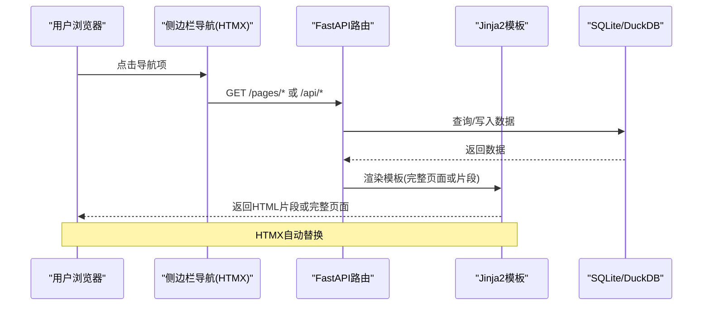
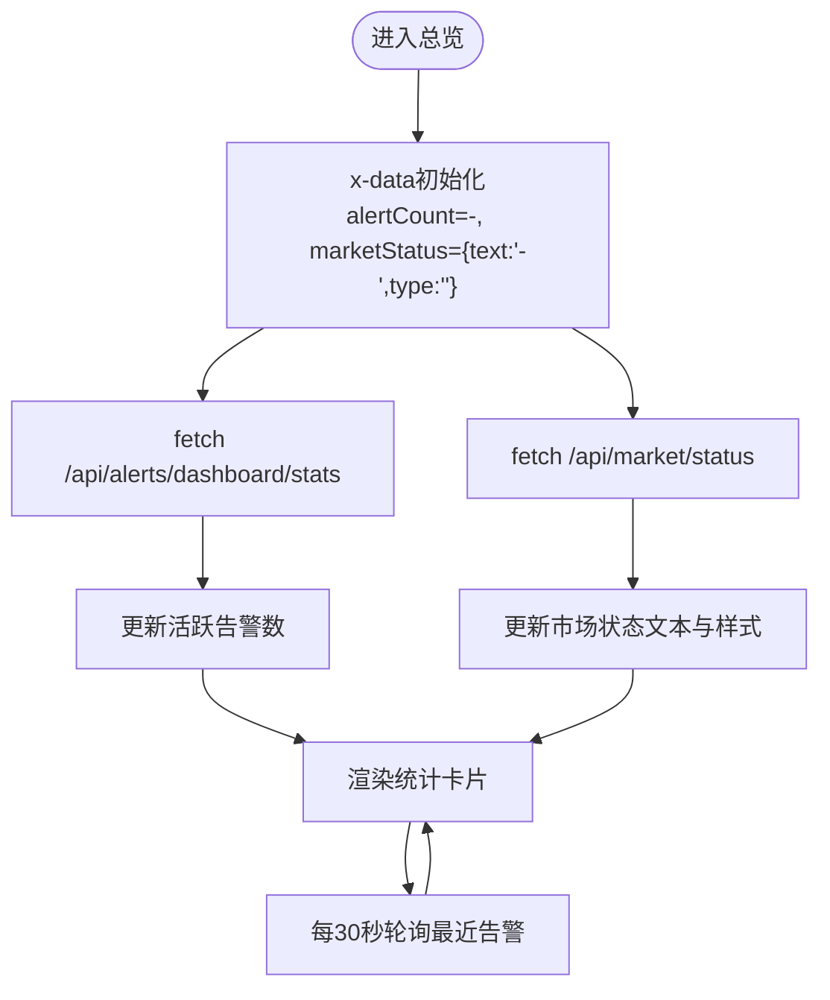
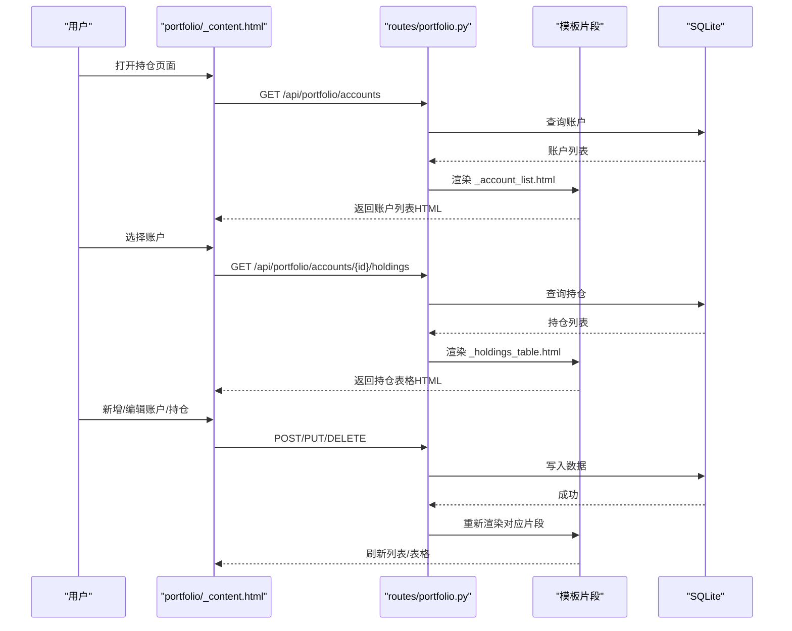
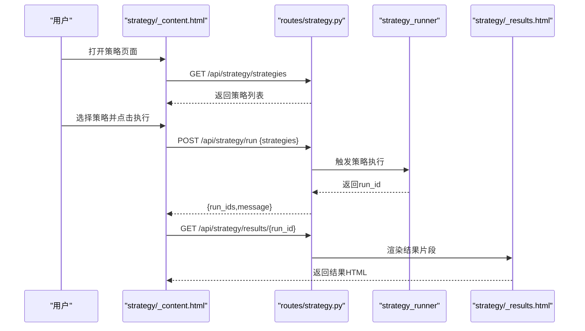
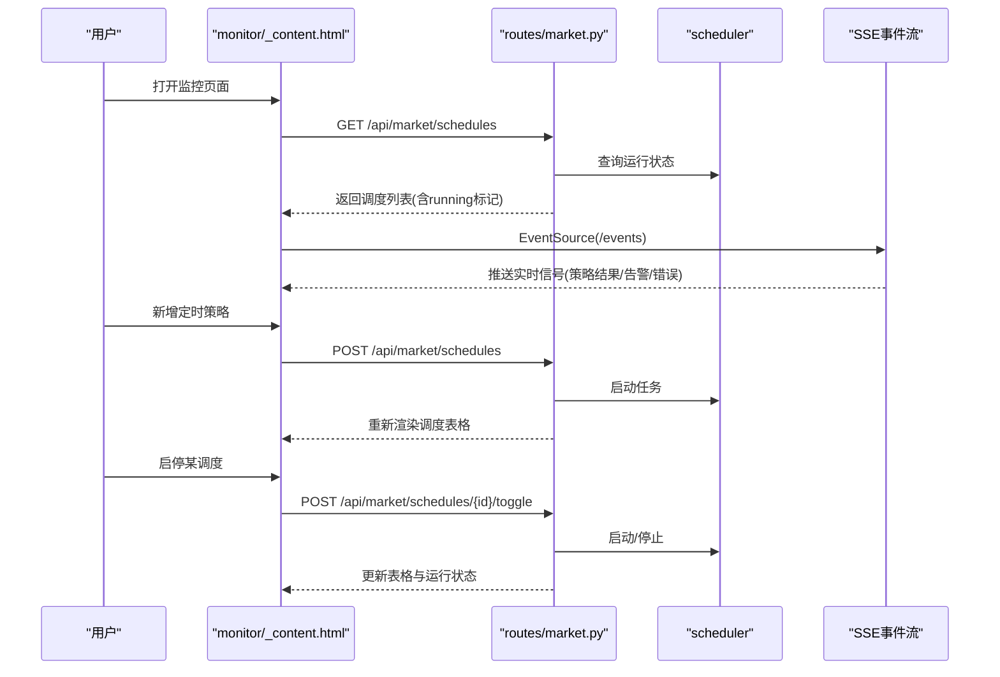
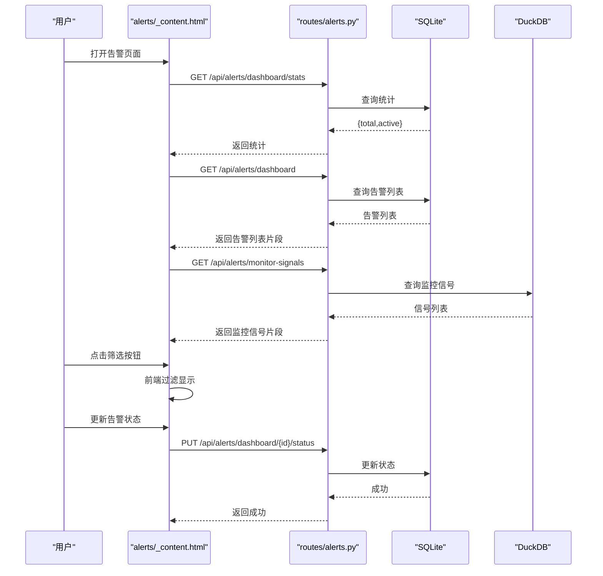
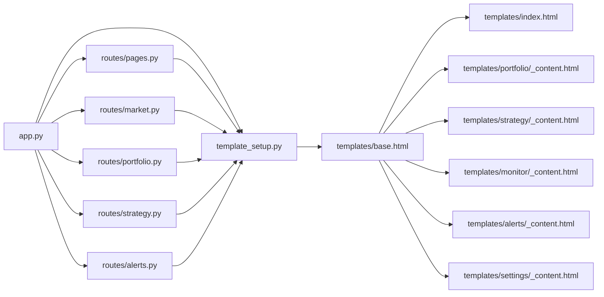

# 核心页面功能

<cite>
**本文引用的文件**
- [src/quant_etf/dashboard/app.py](file://src/quant_etf/dashboard/app.py)
- [src/quant_etf/dashboard/routes/pages.py](file://src/quant_etf/dashboard/routes/pages.py)
- [src/quant_etf/dashboard/routes/market.py](file://src/quant_etf/dashboard/routes/market.py)
- [src/quant_etf/dashboard/routes/portfolio.py](file://src/quant_etf/dashboard/routes/portfolio.py)
- [src/quant_etf/dashboard/routes/strategy.py](file://src/quant_etf/dashboard/routes/strategy.py)
- [src/quant_etf/dashboard/routes/alerts.py](file://src/quant_etf/dashboard/routes/alerts.py)
- [src/quant_etf/dashboard/templates/base.html](file://src/quant_etf/dashboard/templates/base.html)
- [src/quant_etf/dashboard/templates/index.html](file://src/quant_etf/dashboard/templates/index.html)
- [src/quant_etf/dashboard/templates/overview/_content.html](file://src/quant_etf/dashboard/templates/overview/_content.html)
- [src/quant_etf/dashboard/templates/portfolio/_content.html](file://src/quant_etf/dashboard/templates/portfolio/_content.html)
- [src/quant_etf/dashboard/templates/portfolio/_account_list.html](file://src/quant_etf/dashboard/templates/portfolio/_account_list.html)
- [src/quant_etf/dashboard/templates/portfolio/_holdings_table.html](file://src/quant_etf/dashboard/templates/portfolio/_holdings_table.html)
- [src/quant_etf/dashboard/templates/strategy/_content.html](file://src/quant_etf/dashboard/templates/strategy/_content.html)
- [src/quant_etf/dashboard/templates/strategy/_results.html](file://src/quant_etf/dashboard/templates/strategy/_results.html)
- [src/quant_etf/dashboard/templates/monitor/_content.html](file://src/quant_etf/dashboard/templates/monitor/_content.html)
- [src/quant_etf/dashboard/templates/monitor/_schedule_table.html](file://src/quant_etf/dashboard/templates/monitor/_schedule_table.html)
- [src/quant_etf/dashboard/templates/alerts/_content.html](file://src/quant_etf/dashboard/templates/alerts/_content.html)
- [src/quant_etf/dashboard/templates/alerts/_alert_list.html](file://src/quant_etf/dashboard/templates/alerts/_alert_list.html)
- [src/quant_etf/dashboard/templates/alerts/_monitor_signals.html](file://src/quant_etf/dashboard/templates/alerts/_monitor_signals.html)
- [src/quant_etf/dashboard/templates/settings/_content.html](file://src/quant_etf/dashboard/templates/settings/_content.html)
- [src/quant_etf/dashboard/models.py](file://src/quant_etf/dashboard/models.py)
- [src/quant_etf/dashboard/db.py](file://src/quant_etf/dashboard/db.py)
- [src/quant_etf/dashboard/config.py](file://src/quant_etf/dashboard/config.py)
- [src/quant_etf/dashboard/template_setup.py](file://src/quant_etf/dashboard/template_setup.py)
</cite>

## 目录
1. [简介](#简介)
2. [项目结构](#项目结构)
3. [核心组件](#核心组件)
4. [架构总览](#架构总览)
5. [详细组件分析](#详细组件分析)
6. [依赖分析](#依赖分析)
7. [性能考虑](#性能考虑)
8. [故障排查指南](#故障排查指南)
9. [结论](#结论)
10. [附录](#附录)

## 简介
本文件面向Dashboard核心页面功能，围绕总览、持仓管理、策略执行、监控调度、告警管理、设置等页面，系统阐述前端模板结构、数据绑定方式、用户交互逻辑、页面路由配置、权限控制与响应式设计，并给出页面间导航关系与数据传递机制说明。目标是帮助开发者与非技术读者快速理解并使用Dashboard。

## 项目结构
Dashboard采用FastAPI + Jinja2模板 + HTMX + Alpine.js + Bootstrap的前后端协作模式：
- 后端：路由按页面与功能模块划分，统一通过模板渲染HTML片段或完整页面。
- 前端：base.html提供全局布局与导航；各页面模板负责局部内容与交互；HTMX实现无刷新内容切换；Alpine.js提供轻量级MVVM；Chart.js用于可视化；SSE提供实时事件推送。

```mermaid
graph TB
subgraph "后端(FastAPI)"
APP["app.py 应用入口"]
ROUTES_PAGES["routes/pages.py 页面路由"]
ROUTES_MARKET["routes/market.py 市场/调度API"]
ROUTES_PORTFOLIO["routes/portfolio.py 持仓API"]
ROUTES_STRATEGY["routes/strategy.py 策略API"]
ROUTES_ALERTS["routes/alerts.py 告警API"]
TPL_SETUP["template_setup.py 模板配置"]
DB["db.py 数据库封装"]
MODELS["models.py Pydantic模型"]
CONFIG["config.py 配置常量"]
end
subgraph "前端(Jinja2 + HTMX + Alpine.js)"
BASE["templates/base.html 基础布局"]
OVERVIEW_IDX["templates/index.html 总览页面"]
OVERVIEW_CT["templates/overview/_content.html 总览片段"]
PORTFOLIO_CT["templates/portfolio/_content.html 持仓片段"]
PORTFOLIO_ACCT["templates/portfolio/_account_list.html 账户片段"]
PORTFOLIO_HOLD["templates/portfolio/_holdings_table.html 持仓表格片段"]
STRATEGY_CT["templates/strategy/_content.html 策略片段"]
STRATEGY_RES["templates/strategy/_results.html 结果片段"]
MONITOR_CT["templates/monitor/_content.html 监控片段"]
MONITOR_SCHED["templates/monitor/_schedule_table.html 调度表格片段"]
ALERTS_CT["templates/alerts/_content.html 告警片段"]
ALERTS_LIST["templates/alerts/_alert_list.html 告警列表片段"]
ALERTS_SIG["templates/alerts/_monitor_signals.html 监控信号片段"]
SETTINGS_CT["templates/settings/_content.html 设置片段"]
end
APP --> ROUTES_PAGES
APP --> ROUTES_MARKET
APP --> ROUTES_PORTFOLIO
APP --> ROUTES_STRATEGY
APP --> ROUTES_ALERTS
APP --> TPL_SETUP
APP --> DB
ROUTES_PAGES --> TPL_SETUP
ROUTES_MARKET --> TPL_SETUP
ROUTES_PORTFOLIO --> TPL_SETUP
ROUTES_STRATEGY --> TPL_SETUP
ROUTES_ALERTS --> TPL_SETUP
TPL_SETUP --> BASE
BASE --> OVERVIEW_IDX
BASE --> PORTFOLIO_CT
BASE --> STRATEGY_CT
BASE --> MONITOR_CT
BASE --> ALERTS_CT
BASE --> SETTINGS_CT
ROUTES_PORTFOLIO --> PORTFOLIO_ACCT
ROUTES_PORTFOLIO --> PORTFOLIO_HOLD
ROUTES_MARKET --> MONITOR_SCHED
ROUTES_ALERTS --> ALERTS_LIST
ROUTES_ALERTS --> ALERTS_SIG
ROUTES_STRATEGY --> STRATEGY_RES
```

**图示来源**
- [src/quant_etf/dashboard/app.py:1-87](file://src/quant_etf/dashboard/app.py#L1-L87)
- [src/quant_etf/dashboard/routes/pages.py:1-75](file://src/quant_etf/dashboard/routes/pages.py#L1-L75)
- [src/quant_etf/dashboard/routes/market.py:1-116](file://src/quant_etf/dashboard/routes/market.py#L1-L116)
- [src/quant_etf/dashboard/routes/portfolio.py:1-175](file://src/quant_etf/dashboard/routes/portfolio.py#L1-L175)
- [src/quant_etf/dashboard/routes/strategy.py:1-53](file://src/quant_etf/dashboard/routes/strategy.py#L1-L53)
- [src/quant_etf/dashboard/routes/alerts.py:1-105](file://src/quant_etf/dashboard/routes/alerts.py#L1-L105)
- [src/quant_etf/dashboard/template_setup.py:1-10](file://src/quant_etf/dashboard/template_setup.py#L1-L10)

**章节来源**
- [src/quant_etf/dashboard/app.py:17-24](file://src/quant_etf/dashboard/app.py#L17-L24)
- [src/quant_etf/dashboard/routes/pages.py:40-74](file://src/quant_etf/dashboard/routes/pages.py#L40-L74)
- [src/quant_etf/dashboard/template_setup.py:8-9](file://src/quant_etf/dashboard/template_setup.py#L8-L9)

## 核心组件
- 应用入口与路由挂载：在应用启动时注册页面路由与API路由，根路径重定向至总览页，提供SSE事件流端点。
- 页面路由：根据是否为HTMX请求决定返回完整页面或内容片段，统一注入当前时间戳上下文。
- 数据层：SQLite封装查询/写入接口，支持单行查询与批量写入；DuckDB用于告警监控信号读取。
- 模型层：Pydantic模型定义API输入输出结构，确保参数校验与类型安全。
- 模板层：基于Jinja2，base.html提供全局布局、导航与SSE/HTMX脚本；各页面模板负责局部内容与交互。

**章节来源**
- [src/quant_etf/dashboard/app.py:27-36](file://src/quant_etf/dashboard/app.py#L27-L36)
- [src/quant_etf/dashboard/routes/pages.py:16-37](file://src/quant_etf/dashboard/routes/pages.py#L16-L37)
- [src/quant_etf/dashboard/db.py:93-132](file://src/quant_etf/dashboard/db.py#L93-L132)
- [src/quant_etf/dashboard/models.py:6-54](file://src/quant_etf/dashboard/models.py#L6-L54)
- [src/quant_etf/dashboard/config.py:6-25](file://src/quant_etf/dashboard/config.py#L6-L25)

## 架构总览
Dashboard采用“后端渲染 + 前端交互”的混合架构：
- 后端负责业务逻辑与数据持久化，通过模板渲染HTML；API路由提供数据与状态变更能力。
- 前端通过HTMX进行无刷新内容切换，Alpine.js处理本地状态与表单提交，Bootstrap提供响应式布局。
- SSE用于实时推送策略执行结果、告警与组合持仓更新等事件。

**图示来源**
- [src/quant_etf/dashboard/templates/base.html:42-87](file://src/quant_etf/dashboard/templates/base.html#L42-L87)
- [src/quant_etf/dashboard/routes/pages.py:40-74](file://src/quant_etf/dashboard/routes/pages.py#L40-L74)
- [src/quant_etf/dashboard/routes/portfolio.py:31-88](file://src/quant_etf/dashboard/routes/portfolio.py#L31-L88)
- [src/quant_etf/dashboard/routes/strategy.py:18-52](file://src/quant_etf/dashboard/routes/strategy.py#L18-L52)
- [src/quant_etf/dashboard/routes/market.py:55-115](file://src/quant_etf/dashboard/routes/market.py#L55-L115)
- [src/quant_etf/dashboard/routes/alerts.py:16-104](file://src/quant_etf/dashboard/routes/alerts.py#L16-L104)

## 详细组件分析

### 总览页面（Overview）
- 模板结构：index.html继承base.html，提供统计卡片与最近告警列表；overview/_content.html为可复用片段。
- 数据绑定：通过x-data与x-init初始化本地状态，使用fetch调用/api/alerts/dashboard/stats与/api/market/status获取活跃告警数与市场状态。
- 用户交互：时钟每秒更新；最近告警列表每30秒轮询一次；策略结果占位待策略执行后填充。
- 响应式设计：Bootstrap网格系统自适应不同屏幕尺寸。

**图示来源**
- [src/quant_etf/dashboard/templates/index.html:4-24](file://src/quant_etf/dashboard/templates/index.html#L4-L24)
- [src/quant_etf/dashboard/templates/overview/_content.html:1-21](file://src/quant_etf/dashboard/templates/overview/_content.html#L1-L21)

**章节来源**
- [src/quant_etf/dashboard/templates/index.html:1-100](file://src/quant_etf/dashboard/templates/index.html#L1-L100)
- [src/quant_etf/dashboard/templates/overview/_content.html:1-96](file://src/quant_etf/dashboard/templates/overview/_content.html#L1-L96)
- [src/quant_etf/dashboard/routes/pages.py:25-37](file://src/quant_etf/dashboard/routes/pages.py#L25-L37)

### 持仓管理页面（Portfolio）
- 模板结构：portfolio/_content.html包含账户列表与持仓表格区域；账户列表片段portfolio/_account_list.html；持仓表格片段portfolio/_holdings_table.html。
- 数据绑定：通过HTMX在页面加载时拉取账户列表；选择账户后拉取该账户的持仓表格。
- 用户交互：支持新增账户、编辑账户、新增/编辑/删除持仓；通过模态框收集表单数据并通过fetch提交；提交后重新拉取对应片段。
- 响应式设计：左侧账户列表与右侧持仓表格自适应布局；表单字段包含必填与格式校验。

**图示来源**
- [src/quant_etf/dashboard/templates/portfolio/_content.html:17-28](file://src/quant_etf/dashboard/templates/portfolio/_content.html#L17-L28)
- [src/quant_etf/dashboard/routes/portfolio.py:31-88](file://src/quant_etf/dashboard/routes/portfolio.py#L31-L88)
- [src/quant_etf/dashboard/routes/portfolio.py:93-167](file://src/quant_etf/dashboard/routes/portfolio.py#L93-L167)
- [src/quant_etf/dashboard/templates/portfolio/_account_list.html](file://src/quant_etf/dashboard/templates/portfolio/_account_list.html)
- [src/quant_etf/dashboard/templates/portfolio/_holdings_table.html](file://src/quant_etf/dashboard/templates/portfolio/_holdings_table.html)

**章节来源**
- [src/quant_etf/dashboard/routes/portfolio.py:18-26](file://src/quant_etf/dashboard/routes/portfolio.py#L18-L26)
- [src/quant_etf/dashboard/routes/portfolio.py:31-88](file://src/quant_etf/dashboard/routes/portfolio.py#L31-L88)
- [src/quant_etf/dashboard/routes/portfolio.py:93-167](file://src/quant_etf/dashboard/routes/portfolio.py#L93-L167)

### 策略执行页面（Strategy）
- 模板结构：strategy/_content.html提供策略选择与执行按钮；strategy/_results.html用于渲染结果与图表。
- 数据绑定：页面加载时通过fetch获取可用策略列表；执行时将选中的策略名数组POST到/api/strategy/run，得到run_ids后拉取对应结果片段。
- 用户交互：多选策略执行；执行过程中显示指示器；结果区域支持轮询展示。
- 响应式设计：卡片式布局，按钮与表单自适应。

**图示来源**
- [src/quant_etf/dashboard/templates/strategy/_content.html:1-47](file://src/quant_etf/dashboard/templates/strategy/_content.html#L1-L47)
- [src/quant_etf/dashboard/routes/strategy.py:18-52](file://src/quant_etf/dashboard/routes/strategy.py#L18-L52)
- [src/quant_etf/dashboard/templates/strategy/_results.html](file://src/quant_etf/dashboard/templates/strategy/_results.html)

**章节来源**
- [src/quant_etf/dashboard/routes/strategy.py:18-52](file://src/quant_etf/dashboard/routes/strategy.py#L18-L52)

### 监控调度页面（Monitor）
- 模板结构：monitor/_content.html提供运行状态、定时策略配置与信号流展示；monitor/_schedule_table.html为调度表格片段。
- 数据绑定：定时策略配置每10秒轮询；SSE流实时展示策略执行结果、告警与错误信息。
- 用户交互：支持新增定时策略（策略名与执行间隔），启停指定调度；运行状态与调度数量动态更新。
- 响应式设计：卡片与表格自适应。

**图示来源**
- [src/quant_etf/dashboard/templates/monitor/_content.html:1-95](file://src/quant_etf/dashboard/templates/monitor/_content.html#L1-L95)
- [src/quant_etf/dashboard/routes/market.py:55-115](file://src/quant_etf/dashboard/routes/market.py#L55-L115)
- [src/quant_etf/dashboard/templates/monitor/_schedule_table.html](file://src/quant_etf/dashboard/templates/monitor/_schedule_table.html)

**章节来源**
- [src/quant_etf/dashboard/routes/market.py:55-115](file://src/quant_etf/dashboard/routes/market.py#L55-L115)

### 告警管理页面（Alerts）
- 模板结构：alerts/_content.html提供活跃/总数统计与过滤按钮；alerts/_alert_list.html为告警列表片段；alerts/_monitor_signals.html为DuckDB监控信号片段。
- 数据绑定：页面加载时获取统计；最近告警列表每15秒轮询；监控信号每30秒轮询。
- 用户交互：支持按状态筛选（全部/活跃/已确认/已解决）；可通过API更新告警状态。
- 响应式设计：卡片与按钮组自适应。

**图示来源**
- [src/quant_etf/dashboard/templates/alerts/_content.html:1-73](file://src/quant_etf/dashboard/templates/alerts/_content.html#L1-L73)
- [src/quant_etf/dashboard/routes/alerts.py:16-104](file://src/quant_etf/dashboard/routes/alerts.py#L16-L104)
- [src/quant_etf/dashboard/templates/alerts/_alert_list.html](file://src/quant_etf/dashboard/templates/alerts/_alert_list.html)
- [src/quant_etf/dashboard/templates/alerts/_monitor_signals.html](file://src/quant_etf/dashboard/templates/alerts/_monitor_signals.html)

**章节来源**
- [src/quant_etf/dashboard/routes/alerts.py:16-104](file://src/quant_etf/dashboard/routes/alerts.py#L16-L104)

### 设置页面（Settings）
- 模板结构：settings/_content.html提供看板设置占位，当前包含SSE心跳间隔与告警刷新间隔的只读展示。
- 数据绑定：页面加载时显示默认值；功能开发中，后续将开放可配置项。
- 用户交互：当前不可编辑，预留扩展空间。
- 响应式设计：卡片式布局。

**章节来源**
- [src/quant_etf/dashboard/templates/settings/_content.html:1-20](file://src/quant_etf/dashboard/templates/settings/_content.html#L1-L20)

## 依赖分析
- 组件耦合：路由层仅依赖模板引擎与数据库封装，保持低耦合；模板层通过HTMX与Alpine.js实现交互，不直接依赖后端逻辑。
- 外部依赖：FastAPI提供路由与异步支持；Jinja2负责模板渲染；HTMX/Alpine.js提供前端交互；Bootstrap提供UI；Chart.js提供可视化；DuckDB用于监控信号读取。
- 循环依赖：通过独立的template_setup.py避免app.py与routes之间的循环导入。

**图示来源**
- [src/quant_etf/dashboard/app.py:17-24](file://src/quant_etf/dashboard/app.py#L17-L24)
- [src/quant_etf/dashboard/template_setup.py:8-9](file://src/quant_etf/dashboard/template_setup.py#L8-L9)

**章节来源**
- [src/quant_etf/dashboard/app.py:17-24](file://src/quant_etf/dashboard/app.py#L17-L24)
- [src/quant_etf/dashboard/template_setup.py:8-9](file://src/quant_etf/dashboard/template_setup.py#L8-L9)

## 性能考虑
- HTMX按需加载：页面通过HTMX仅加载必要片段，减少全页刷新带来的开销。
- 轮询策略：总览与告警列表采用定时轮询，建议根据实际数据变化频率调整周期，避免过度请求。
- SSE长连接：SSE用于高频实时事件推送，注意浏览器限制与网络波动下的重连策略。
- 数据库优化：SQLite WAL模式与外键约束保证一致性；批量写入使用execute_many降低往返次数。
- 前端渲染：Alpine.js与Chart.js在移动端可能带来额外开销，建议在大数据量场景下进行节流与虚拟滚动优化。

## 故障排查指南
- 页面空白或404：检查路由是否正确挂载，确认模板路径是否存在；HTMX请求与普通请求区分逻辑。
- 数据未更新：确认轮询定时器是否生效；检查API返回状态码与模板渲染是否成功。
- SSE断开：检查EventSource连接状态与错误回调；确认SSE端点与心跳配置。
- 数据库异常：检查init_db是否成功执行；查询/写入函数的参数与SQL是否匹配。
- 权限控制：当前路由未实现鉴权逻辑，如需权限控制可在路由层增加中间件或装饰器。

**章节来源**
- [src/quant_etf/dashboard/app.py:68-71](file://src/quant_etf/dashboard/app.py#L68-L71)
- [src/quant_etf/dashboard/routes/pages.py:20-22](file://src/quant_etf/dashboard/routes/pages.py#L20-L22)
- [src/quant_etf/dashboard/db.py:79-90](file://src/quant_etf/dashboard/db.py#L79-L90)

## 结论
Dashboard通过清晰的页面职责划分与前后端协作模式，实现了从数据展示到业务操作的完整闭环。总览页面提供全局视图，持仓管理页面支撑资产配置，策略执行页面驱动自动化，监控调度页面保障任务运行，告警管理页面覆盖风险预警，设置页面预留扩展空间。建议在生产环境中进一步完善权限控制、日志追踪与性能监控，并持续迭代前端交互体验。

## 附录
- 页面路由与导航
  - 根路径“/”重定向至“/pages/overview”
  - 侧边栏导航通过HTMX发起GET请求，hx-target="#content"替换主内容区
  - 页面间通过“/pages/*”访问完整页面，“/api/*”访问数据与状态变更API
- 数据模型
  - 持仓与账户：AccountCreate/AccountUpdate、HoldingCreate/HoldingUpdate
  - 告警：AlertRuleCreate、AlertUpdate
  - 调度：ScheduleCreate
  - 策略：StrategyRunRequest
- 数据库表
  - accounts、holdings、alert_rules、alerts_dashboard、schedules

**章节来源**
- [src/quant_etf/dashboard/routes/pages.py:27-30](file://src/quant_etf/dashboard/routes/pages.py#L27-L30)
- [src/quant_etf/dashboard/templates/base.html:30-86](file://src/quant_etf/dashboard/templates/base.html#L30-L86)
- [src/quant_etf/dashboard/models.py:6-54](file://src/quant_etf/dashboard/models.py#L6-L54)
- [src/quant_etf/dashboard/db.py:11-66](file://src/quant_etf/dashboard/db.py#L11-L66)