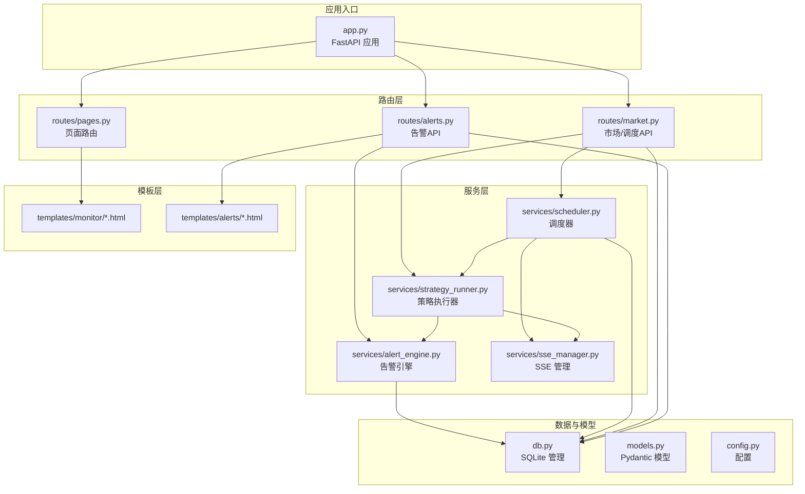
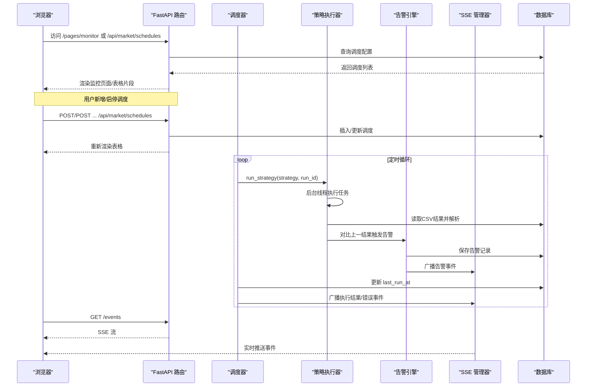
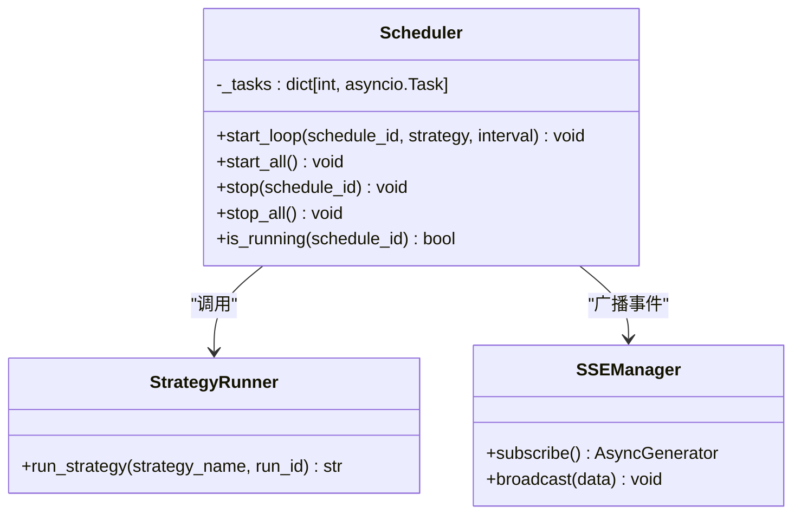
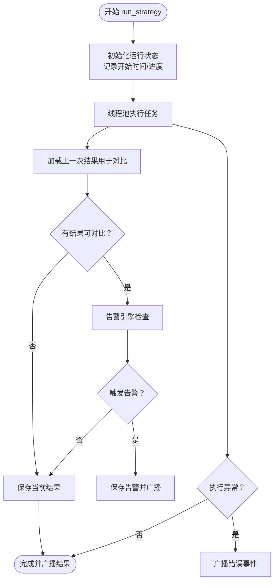
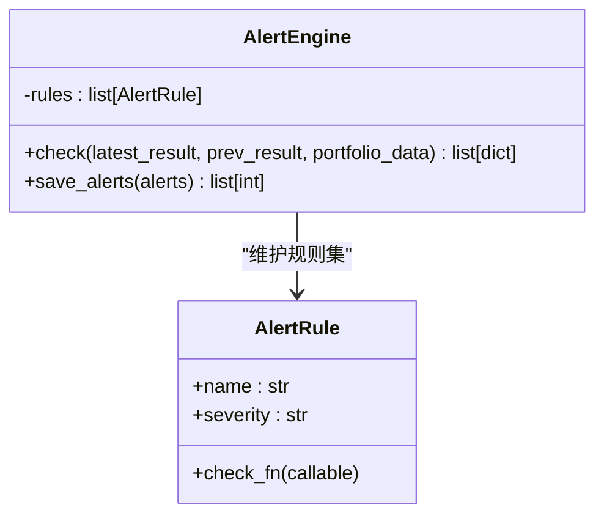
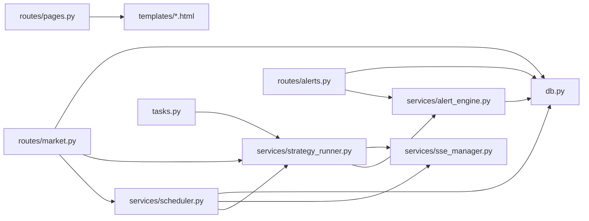

# 监控调度页面

<cite>
**本文档引用的文件**
- [src/quant_etf/dashboard/app.py](file://src/quant_etf/dashboard/app.py)
- [src/quant_etf/dashboard/services/scheduler.py](file://src/quant_etf/dashboard/services/scheduler.py)
- [src/quant_etf/dashboard/services/strategy_runner.py](file://src/quant_etf/dashboard/services/strategy_runner.py)
- [src/quant_etf/dashboard/services/alert_engine.py](file://src/quant_etf/dashboard/services/alert_engine.py)
- [src/quant_etf/dashboard/services/sse_manager.py](file://src/quant_etf/dashboard/services/sse_manager.py)
- [src/quant_etf/dashboard/routes/market.py](file://src/quant_etf/dashboard/routes/market.py)
- [src/quant_etf/dashboard/routes/pages.py](file://src/quant_etf/dashboard/routes/pages.py)
- [src/quant_etf/dashboard/routes/alerts.py](file://src/quant_etf/dashboard/routes/alerts.py)
- [src/quant_etf/dashboard/db.py](file://src/quant_etf/dashboard/db.py)
- [src/quant_etf/dashboard/models.py](file://src/quant_etf/dashboard/models.py)
- [src/quant_etf/dashboard/config.py](file://src/quant_etf/dashboard/config.py)
- [src/quant_etf/dashboard/templates/monitor/index.html](file://src/quant_etf/dashboard/templates/monitor/index.html)
- [src/quant_etf/dashboard/templates/monitor/_schedule_table.html](file://src/quant_etf/dashboard/templates/monitor/_schedule_table.html)
- [src/quant_etf/dashboard/templates/alerts/index.html](file://src/quant_etf/dashboard/templates/alerts/index.html)
- [src/quant_etf/tasks.py](file://src/quant_etf/tasks.py)
</cite>

## 目录
1. [简介](#简介)
2. [项目结构](#项目结构)
3. [核心组件](#核心组件)
4. [架构总览](#架构总览)
5. [详细组件分析](#详细组件分析)
6. [依赖关系分析](#依赖关系分析)
7. [性能考虑](#性能考虑)
8. [故障排除指南](#故障排除指南)
9. [结论](#结论)
10. [附录](#附录)

## 简介
本文件为 Dashboard 监控调度页面的功能文档，聚焦于任务调度与监控能力，涵盖定时任务管理、执行计划配置、监控状态跟踪、实时事件推送、告警检测与展示等核心模块。文档解释调度任务的创建与管理逻辑、任务状态的实时更新机制以及用户界面设计，并提供调度算法与性能优化策略说明。

## 项目结构
Dashboard 采用 FastAPI 应用入口，按功能拆分为路由层、服务层、模板层与数据库层。监控调度页面位于 dashboard 子系统内，主要涉及市场状态与调度管理、策略执行器、SSE 事件广播、告警引擎与数据库持久化。

图表来源
- [src/quant_etf/dashboard/app.py:1-92](file://src/quant_etf/dashboard/app.py#L1-L92)
- [src/quant_etf/dashboard/routes/market.py:1-116](file://src/quant_etf/dashboard/routes/market.py#L1-L116)
- [src/quant_etf/dashboard/routes/pages.py:1-75](file://src/quant_etf/dashboard/routes/pages.py#L1-L75)
- [src/quant_etf/dashboard/routes/alerts.py:1-105](file://src/quant_etf/dashboard/routes/alerts.py#L1-L105)
- [src/quant_etf/dashboard/services/scheduler.py:1-82](file://src/quant_etf/dashboard/services/scheduler.py#L1-L82)
- [src/quant_etf/dashboard/services/strategy_runner.py:1-164](file://src/quant_etf/dashboard/services/strategy_runner.py#L1-L164)
- [src/quant_etf/dashboard/services/alert_engine.py:1-120](file://src/quant_etf/dashboard/services/alert_engine.py#L1-L120)
- [src/quant_etf/dashboard/services/sse_manager.py:1-45](file://src/quant_etf/dashboard/services/sse_manager.py#L1-L45)
- [src/quant_etf/dashboard/db.py:1-133](file://src/quant_etf/dashboard/db.py#L1-L133)
- [src/quant_etf/dashboard/models.py:1-54](file://src/quant_etf/dashboard/models.py#L1-L54)
- [src/quant_etf/dashboard/config.py:1-25](file://src/quant_etf/dashboard/config.py#L1-L25)

章节来源
- [src/quant_etf/dashboard/app.py:1-92](file://src/quant_etf/dashboard/app.py#L1-L92)
- [src/quant_etf/dashboard/routes/market.py:1-116](file://src/quant_etf/dashboard/routes/market.py#L1-L116)
- [src/quant_etf/dashboard/routes/pages.py:1-75](file://src/quant_etf/dashboard/routes/pages.py#L1-L75)
- [src/quant_etf/dashboard/routes/alerts.py:1-105](file://src/quant_etf/dashboard/routes/alerts.py#L1-L105)

## 核心组件
- 调度器（Scheduler）：基于 asyncio 的轻量定时任务管理，支持启动/停止/批量启动、状态查询与数据库记录更新。
- 策略执行器（StrategyRunner）：异步执行策略任务，后台线程调用任务注册表，产出 CSV 结果并触发告警。
- 告警引擎（AlertEngine）：规则驱动的告警检测，支持多规则并行检查，结果持久化与 SSE 广播。
- SSE 管理器（SSEManager）：事件流订阅与广播，维持心跳，向客户端推送策略执行结果与告警事件。
- 数据库（db.py）：SQLite 表结构定义与 CRUD 封装，存储账户、持仓、告警规则、调度配置等。
- 路由与模板：页面路由、API 接口、HTMX 内容片段与前端模板，实现监控调度页面与告警中心的交互。

章节来源
- [src/quant_etf/dashboard/services/scheduler.py:15-82](file://src/quant_etf/dashboard/services/scheduler.py#L15-L82)
- [src/quant_etf/dashboard/services/strategy_runner.py:25-125](file://src/quant_etf/dashboard/services/strategy_runner.py#L25-L125)
- [src/quant_etf/dashboard/services/alert_engine.py:20-120](file://src/quant_etf/dashboard/services/alert_engine.py#L20-L120)
- [src/quant_etf/dashboard/services/sse_manager.py:10-45](file://src/quant_etf/dashboard/services/sse_manager.py#L10-L45)
- [src/quant_etf/dashboard/db.py:11-133](file://src/quant_etf/dashboard/db.py#L11-L133)

## 架构总览
监控调度页面围绕“定时任务 + 实时事件 + 告警检测”构建，整体流程如下：

图表来源
- [src/quant_etf/dashboard/app.py:39-50](file://src/quant_etf/dashboard/app.py#L39-L50)
- [src/quant_etf/dashboard/services/scheduler.py:19-52](file://src/quant_etf/dashboard/services/scheduler.py#L19-L52)
- [src/quant_etf/dashboard/services/strategy_runner.py:25-125](file://src/quant_etf/dashboard/services/strategy_runner.py#L25-L125)
- [src/quant_etf/dashboard/services/alert_engine.py:82-115](file://src/quant_etf/dashboard/services/alert_engine.py#L82-L115)
- [src/quant_etf/dashboard/db.py:93-122](file://src/quant_etf/dashboard/db.py#L93-L122)

## 详细组件分析

### 调度器（Scheduler）
- 职责：维护调度任务集合，按间隔周期执行策略，更新数据库记录，通过 SSE 广播结果或错误。
- 关键行为：
  - 启动所有已启用的调度：扫描数据库，为每个启用的调度创建 asyncio 任务。
  - 单个调度启停：支持动态启停指定调度 ID。
  - 循环执行：每次迭代记录 run_id，调用策略执行器，更新 last_run_at，广播事件。
  - 错误处理：捕获异常并广播错误事件，不影响其他调度。
- 状态管理：通过内存字典维护任务句柄，提供 is_running 查询。

图表来源
- [src/quant_etf/dashboard/services/scheduler.py:15-82](file://src/quant_etf/dashboard/services/scheduler.py#L15-L82)
- [src/quant_etf/dashboard/services/strategy_runner.py:25-125](file://src/quant_etf/dashboard/services/strategy_runner.py#L25-L125)
- [src/quant_etf/dashboard/services/sse_manager.py:10-45](file://src/quant_etf/dashboard/services/sse_manager.py#L10-L45)

章节来源
- [src/quant_etf/dashboard/services/scheduler.py:15-82](file://src/quant_etf/dashboard/services/scheduler.py#L15-L82)

### 策略执行器（StrategyRunner）
- 职责：在独立线程中执行策略任务，产出 CSV 结果，计算任务进度，触发告警并与 SSE 通信。
- 关键行为：
  - 异步包装：使用线程池执行耗时任务，主线程通过事件循环安全广播事件。
  - 结果读取：从项目数据目录读取当天 CSV，解析为记录列表，用于告警对比。
  - 告警集成：对比当前与上一次结果，触发规则检查，保存告警并广播。
  - 错误处理：捕获异常，标记任务状态为 error，广播错误事件。
- 可扩展性：通过任务注册表支持多种策略类型。

图表来源
- [src/quant_etf/dashboard/services/strategy_runner.py:25-125](file://src/quant_etf/dashboard/services/strategy_runner.py#L25-L125)
- [src/quant_etf/dashboard/services/alert_engine.py:82-115](file://src/quant_etf/dashboard/services/alert_engine.py#L82-L115)

章节来源
- [src/quant_etf/dashboard/services/strategy_runner.py:25-164](file://src/quant_etf/dashboard/services/strategy_runner.py#L25-L164)

### 告警引擎（AlertEngine）
- 职责：基于规则集对策略结果进行对比分析，生成告警并持久化。
- 规则示例：
  - 新标的进入前三：比较当前与上一次结果的前三名单，检测新增项。
  - 动量得分突变：计算同一标的得分变化幅度，超过阈值触发。
  - 持仓偏离目标：预留规则，当前版本为空实现。
- 存储与广播：将告警写入数据库，并通过 SSE 广播到前端。

图表来源
- [src/quant_etf/dashboard/services/alert_engine.py:13-115](file://src/quant_etf/dashboard/services/alert_engine.py#L13-L115)

章节来源
- [src/quant_etf/dashboard/services/alert_engine.py:20-120](file://src/quant_etf/dashboard/services/alert_engine.py#L20-L120)

### SSE 管理器（SSEManager）
- 职责：管理客户端连接，提供订阅接口与广播能力，维持心跳。
- 关键行为：
  - 订阅：为每个客户端创建队列，发送初始连接事件，持续输出心跳。
  - 广播：向所有队列投递事件，自动清理断开连接。
- 与调度器/执行器协作：在策略执行成功或失败时广播事件，前端实时展示。

章节来源
- [src/quant_etf/dashboard/services/sse_manager.py:10-45](file://src/quant_etf/dashboard/services/sse_manager.py#L10-L45)

### 数据库（db.py）
- 职责：封装 SQLite 连接与常用操作，初始化表结构，提供查询/执行接口。
- 表结构要点：
  - accounts：账户信息
  - holdings：持仓明细
  - alert_rules：告警规则
  - alerts_dashboard：看板告警记录
  - schedules：调度配置（strategy、interval、enabled、last_run_at）

章节来源
- [src/quant_etf/dashboard/db.py:11-133](file://src/quant_etf/dashboard/db.py#L11-L133)

### 路由与页面（pages/market/alerts）
- 页面路由：支持直接访问完整页面与 HTMX 请求返回内容片段，减少重复嵌套。
- 市场/调度 API：
  - 列表调度：渲染调度表格片段，标注运行状态。
  - 创建/删除/启停：写入数据库并返回更新后的表格片段。
- 告警 API：
  - 列表与状态更新：支持按状态过滤与更新。
  - 监控信号：从 DuckDB 读取 ETFMonitor 产生的信号并展示。

章节来源
- [src/quant_etf/dashboard/routes/pages.py:16-75](file://src/quant_etf/dashboard/routes/pages.py#L16-L75)
- [src/quant_etf/dashboard/routes/market.py:55-116](file://src/quant_etf/dashboard/routes/market.py#L55-L116)
- [src/quant_etf/dashboard/routes/alerts.py:16-105](file://src/quant_etf/dashboard/routes/alerts.py#L16-L105)

### 前端模板与交互
- 监控页面：
  - 定时策略配置表格：支持新增、启停、删除；每10秒刷新。
  - 实时信号流：SSE 推送策略结果与告警事件，限制显示数量。
  - 新增调度模态框：表单校验最小间隔为60秒。
- 告警中心：
  - 统计活跃/总数；状态过滤按钮；DuckDB 监控信号展示。

章节来源
- [src/quant_etf/dashboard/templates/monitor/index.html:1-119](file://src/quant_etf/dashboard/templates/monitor/index.html#L1-L119)
- [src/quant_etf/dashboard/templates/monitor/_schedule_table.html:1-49](file://src/quant_etf/dashboard/templates/monitor/_schedule_table.html#L1-L49)
- [src/quant_etf/dashboard/templates/alerts/index.html:1-77](file://src/quant_etf/dashboard/templates/alerts/index.html#L1-L77)

## 依赖关系分析
- 组件耦合：
  - 调度器依赖策略执行器与 SSE 管理器，负责控制执行节奏与事件广播。
  - 策略执行器依赖任务注册表与文件系统，产出 CSV 供告警引擎对比。
  - 告警引擎依赖数据库与 SSE 管理器，负责规则检查与事件传播。
  - 路由层依赖服务层与模板层，提供 API 与页面渲染。
- 外部依赖：
  - FastAPI 提供 Web 服务与路由。
  - SQLite 用于本地数据持久化。
  - DuckDB 用于读取监控信号（只读）。
  - Pandas 用于 CSV 解析与数据处理。
  - asyncio/线程池用于并发执行与事件循环集成。

图表来源
- [src/quant_etf/dashboard/routes/market.py:1-116](file://src/quant_etf/dashboard/routes/market.py#L1-L116)
- [src/quant_etf/dashboard/routes/alerts.py:1-105](file://src/quant_etf/dashboard/routes/alerts.py#L1-L105)
- [src/quant_etf/dashboard/services/scheduler.py:1-82](file://src/quant_etf/dashboard/services/scheduler.py#L1-L82)
- [src/quant_etf/dashboard/services/strategy_runner.py:1-164](file://src/quant_etf/dashboard/services/strategy_runner.py#L1-L164)
- [src/quant_etf/dashboard/services/alert_engine.py:1-120](file://src/quant_etf/dashboard/services/alert_engine.py#L1-L120)
- [src/quant_etf/dashboard/services/sse_manager.py:1-45](file://src/quant_etf/dashboard/services/sse_manager.py#L1-L45)
- [src/quant_etf/dashboard/db.py:1-133](file://src/quant_etf/dashboard/db.py#L1-L133)
- [src/quant_etf/tasks.py:428-467](file://src/quant_etf/tasks.py#L428-L467)

章节来源
- [src/quant_etf/dashboard/routes/market.py:1-116](file://src/quant_etf/dashboard/routes/market.py#L1-L116)
- [src/quant_etf/dashboard/routes/alerts.py:1-105](file://src/quant_etf/dashboard/routes/alerts.py#L1-L105)
- [src/quant_etf/tasks.py:428-467](file://src/quant_etf/tasks.py#L428-L467)

## 性能考虑
- 并发与资源：
  - 使用线程池执行耗时策略任务，避免阻塞事件循环。
  - 调度器以独立 asyncio 任务运行，互不干扰。
- I/O 优化：
  - SQLite 使用 WAL 模式与外键约束，提升并发读写稳定性。
  - 前端 SSE 心跳维持长连接，减少连接建立开销。
- 数据访问：
  - 策略结果读取仅限当天 CSV，避免全量扫描。
  - 告警对比仅在存在上一次结果时进行，降低计算成本。
- 前端渲染：
  - HTMX 分片更新表格，减少页面重绘。
  - 信号流限制显示条数，避免 DOM 过大。

## 故障排除指南
- 策略执行失败：
  - 现象：SSE 推送错误事件，任务状态标记为 error。
  - 排查：检查策略名称是否存在、数据源是否可用、CSV 是否生成。
- 告警未触发：
  - 现象：无告警记录或前端未显示。
  - 排查：确认上一次结果存在且 CSV 可读；检查规则阈值与数据字段。
- SSE 连接中断：
  - 现象：前端信号流停止。
  - 排查：检查 /events 端点可达性、心跳响应、客户端网络。
- 调度启停异常：
  - 现象：启停按钮无效或状态不同步。
  - 排查：确认数据库 enabled 字段更新、任务句柄存在且未完成。

章节来源
- [src/quant_etf/dashboard/services/strategy_runner.py:102-122](file://src/quant_etf/dashboard/services/strategy_runner.py#L102-L122)
- [src/quant_etf/dashboard/services/alert_engine.py:82-115](file://src/quant_etf/dashboard/services/alert_engine.py#L82-L115)
- [src/quant_etf/dashboard/services/sse_manager.py:14-32](file://src/quant_etf/dashboard/services/sse_manager.py#L14-L32)
- [src/quant_etf/dashboard/routes/market.py:97-115](file://src/quant_etf/dashboard/routes/market.py#L97-L115)

## 结论
监控调度页面通过“调度器 + 策略执行器 + 告警引擎 + SSE”的组合，实现了定时任务的自动化执行、实时状态更新与告警通知。前端采用 HTMX 与 SSE，提供低延迟的交互体验。数据库层以 SQLite 为核心，配合 DuckDB 读取外部监控信号，满足看板数据需求。建议后续增强任务优先级与执行历史详情展示，进一步完善异常告警与审计日志。

## 附录
- 关键配置：
  - 仪表盘主机与端口、SSE 心跳间隔、动量突变阈值等。
- 数据模型：
  - 调度创建模型要求最小间隔为60秒，确保系统稳定。
- 任务注册表：
  - 支持 etf、short、mid 三种策略，可通过注册表扩展。

章节来源
- [src/quant_etf/dashboard/config.py:17-25](file://src/quant_etf/dashboard/config.py#L17-L25)
- [src/quant_etf/dashboard/models.py:47-50](file://src/quant_etf/dashboard/models.py#L47-L50)
- [src/quant_etf/tasks.py:428-467](file://src/quant_etf/tasks.py#L428-L467)