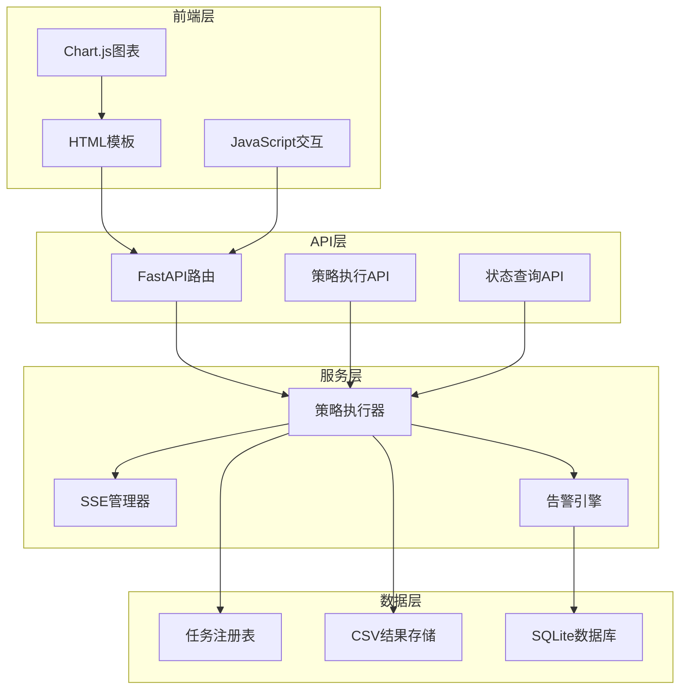
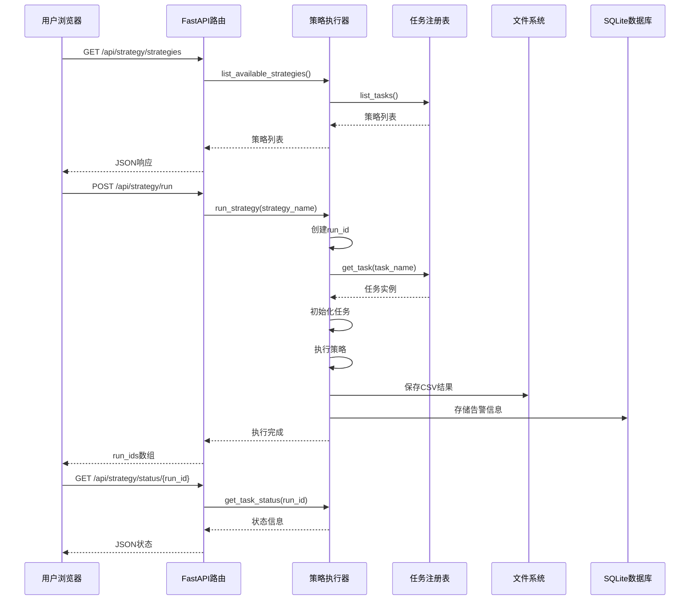
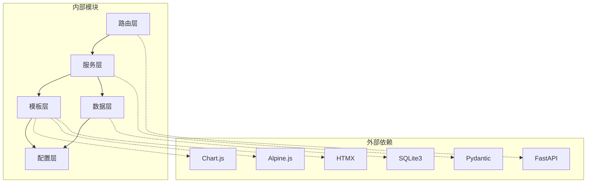

# 策略执行页面

<cite>
**本文档引用的文件**
- [src/quant_etf/dashboard/routes/strategy.py](file://src/quant_etf/dashboard/routes/strategy.py)
- [src/quant_etf/dashboard/services/strategy_runner.py](file://src/quant_etf/dashboard/services/strategy_runner.py)
- [src/quant_etf/dashboard/templates/strategy/index.html](file://src/quant_etf/dashboard/templates/strategy/index.html)
- [src/quant_etf/dashboard/templates/strategy/_content.html](file://src/quant_etf/dashboard/templates/strategy/_content.html)
- [src/quant_etf/dashboard/templates/strategy/_results.html](file://src/quant_etf/dashboard/templates/strategy/_results.html)
- [src/quant_etf/tasks.py](file://src/quant_etf/tasks.py)
- [src/quant_etf/dashboard/models.py](file://src/quant_etf/dashboard/models.py)
- [src/quant_etf/dashboard/services/sse_manager.py](file://src/quant_etf/dashboard/services/sse_manager.py)
- [src/quant_etf/dashboard/services/alert_engine.py](file://src/quant_etf/dashboard/services/alert_engine.py)
- [src/quant_etf/dashboard/app.py](file://src/quant_etf/dashboard/app.py)
- [src/quant_etf/dashboard/db.py](file://src/quant_etf/dashboard/db.py)
- [src/quant_etf/dashboard/template_setup.py](file://src/quant_etf/dashboard/template_setup.py)
- [src/quant_etf/strategy.py](file://src/quant_etf/strategy.py)
</cite>

## 目录
1. [简介](#简介)
2. [项目结构](#项目结构)
3. [核心组件](#核心组件)
4. [架构概览](#架构概览)
5. [详细组件分析](#详细组件分析)
6. [依赖关系分析](#依赖关系分析)
7. [性能考虑](#性能考虑)
8. [故障排除指南](#故障排除指南)
9. [结论](#结论)

## 简介

策略执行页面是量化ETF看板系统中的核心功能模块，负责提供策略运行状态的实时监控和结果显示功能。该页面支持多策略并行执行、实时进度监控、历史回测结果展示、性能指标可视化等功能。用户可以通过直观的界面选择策略、配置参数，并获得详细的执行结果和图表展示。

## 项目结构

策略执行页面采用模块化设计，主要由以下层次组成：

**图表来源**
- [src/quant_etf/dashboard/routes/strategy.py:1-53](file://src/quant_etf/dashboard/routes/strategy.py#L1-L53)
- [src/quant_etf/dashboard/services/strategy_runner.py:1-164](file://src/quant_etf/dashboard/services/strategy_runner.py#L1-L164)

**章节来源**
- [src/quant_etf/dashboard/routes/strategy.py:1-53](file://src/quant_etf/dashboard/routes/strategy.py#L1-L53)
- [src/quant_etf/dashboard/services/strategy_runner.py:1-164](file://src/quant_etf/dashboard/services/strategy_runner.py#L1-L164)

## 核心组件

### 策略执行API路由
策略执行页面的核心路由提供了完整的策略生命周期管理：
- 策略列表查询：`/api/strategy/strategies`
- 策略执行：`/api/strategy/run`
- 进度查询：`/api/strategy/status/{run_id}`
- 结果渲染：`/api/strategy/results/{run_id}`

### 异步策略执行器
采用线程池异步执行策略，支持：
- 多策略并行执行
- 实时进度跟踪（0-100%）
- 错误处理和异常恢复
- SSE事件广播

### 模板渲染系统
提供动态HTML模板渲染，支持：
- 策略选择界面
- 实时进度显示
- 结果表格展示
- 图表可视化

**章节来源**
- [src/quant_etf/dashboard/routes/strategy.py:18-52](file://src/quant_etf/dashboard/routes/strategy.py#L18-L52)
- [src/quant_etf/dashboard/services/strategy_runner.py:25-125](file://src/quant_etf/dashboard/services/strategy_runner.py#L25-L125)

## 架构概览

策略执行页面采用分层架构设计，确保了良好的可维护性和扩展性：

**图表来源**
- [src/quant_etf/dashboard/routes/strategy.py:24-52](file://src/quant_etf/dashboard/routes/strategy.py#L24-L52)
- [src/quant_etf/dashboard/services/strategy_runner.py:25-125](file://src/quant_etf/dashboard/services/strategy_runner.py#L25-L125)

## 详细组件分析

### 策略执行API路由

策略执行API路由提供了RESTful接口，支持完整的策略生命周期管理：

#### 策略列表查询
- **端点**：`GET /api/strategy/strategies`
- **功能**：返回所有可用策略的列表
- **响应**：JSON格式的策略信息数组

#### 策略执行
- **端点**：`POST /api/strategy/run`
- **请求体**：包含策略名称数组
- **功能**：异步启动多个策略执行
- **响应**：包含run_id数组和执行消息

#### 状态查询
- **端点**：`GET /api/strategy/status/{run_id}`
- **功能**：查询指定run_id的执行状态
- **响应**：包含进度、状态、时间戳等信息

#### 结果渲染
- **端点**：`GET /api/strategy/results/{run_id}`
- **功能**：渲染HTML结果页面
- **响应**：包含表格和图表的完整HTML页面

**章节来源**
- [src/quant_etf/dashboard/routes/strategy.py:18-52](file://src/quant_etf/dashboard/routes/strategy.py#L18-L52)

### 异步策略执行器

策略执行器是整个系统的核心组件，负责协调策略的执行过程：

#### 执行流程
1. **初始化**：生成唯一run_id，设置初始状态
2. **任务获取**：从任务注册表获取具体任务实例
3. **执行阶段**：
   - 初始化阶段：30%进度
   - 运行阶段：50%进度  
   - 结果处理：80%进度
4. **完成**：设置完成状态和最终进度

#### 状态管理
执行器维护一个全局字典来跟踪所有正在运行的任务：
- `status`: 当前执行状态（running/complete/error）
- `strategy`: 策略名称
- `started_at`: 开始时间
- `finished_at`: 完成时间
- `progress`: 执行进度百分比
- `result`: 执行结果数据
- `count`: 结果数量

#### 错误处理机制
- 捕获所有执行异常
- 设置错误状态和错误信息
- 通过SSE广播错误事件
- 记录详细的错误日志

**章节来源**
- [src/quant_etf/dashboard/services/strategy_runner.py:25-125](file://src/quant_etf/dashboard/services/strategy_runner.py#L25-L125)

### 模板渲染系统

模板系统提供了丰富的用户界面，支持多种交互模式：

#### 主页面模板
- **策略选择区域**：动态加载可用策略
- **执行按钮**：批量执行选中的策略
- **结果容器**：显示执行结果和图表

#### 结果模板
- **状态显示**：实时显示执行进度
- **自动刷新**：每2秒自动查询状态
- **图表展示**：使用Chart.js绘制柱状图
- **数据表格**：显示详细的执行结果

#### JavaScript交互
- **策略加载**：异步获取策略列表
- **执行控制**：处理执行请求和响应
- **状态轮询**：自动刷新执行状态
- **HTMX集成**：无缝的AJAX交互

**章节来源**
- [src/quant_etf/dashboard/templates/strategy/index.html:1-71](file://src/quant_etf/dashboard/templates/strategy/index.html#L1-L71)
- [src/quant_etf/dashboard/templates/strategy/_results.html:1-97](file://src/quant_etf/dashboard/templates/strategy/_results.html#L1-L97)

### 任务注册表

任务注册表管理所有可用的策略任务：

#### 支持的策略类型
- **ETF组合策略**：基于动量因子的ETF筛选
- **短线股票策略**：短期强势股识别
- **中期反弹策略**：技术面反弹机会捕捉

#### 任务接口规范
所有任务必须实现以下方法：
- `initialize()`: 初始化数据源和策略引擎
- `get_pool()`: 获取证券池
- `load_data()`: 加载数据
- `run_strategy()`: 执行策略
- `format_result()`: 格式化结果
- `export_results()`: 导出结果

**章节来源**
- [src/quant_etf/tasks.py:428-467](file://src/quant_etf/tasks.py#L428-L467)

### 告警引擎

告警引擎提供智能的策略结果监控功能：

#### 告警规则
- **评分进入前三**：检测新进入前3的标的
- **动量得分突变**：监控评分的大幅变化
- **持仓偏离目标**：（预留功能）

#### 告警严重程度
- **info**: 一般信息
- **warning**: 警告级别
- **danger**: 危险级别

#### 数据库集成
告警信息存储在SQLite数据库中，支持：
- 告警规则管理
- 告警历史记录
- 状态跟踪

**章节来源**
- [src/quant_etf/dashboard/services/alert_engine.py:20-120](file://src/quant_etf/dashboard/services/alert_engine.py#L20-L120)

### SSE事件系统

服务器推送事件（SSE）系统提供实时通知功能：

#### 事件类型
- **策略错误**：策略执行失败通知
- **告警事件**：策略结果变化告警
- **连接状态**：客户端连接管理

#### 连接管理
- **订阅管理**：跟踪所有活跃连接
- **心跳机制**：保持连接活跃
- **异常处理**：优雅处理断开连接

**章节来源**
- [src/quant_etf/dashboard/services/sse_manager.py:10-45](file://src/quant_etf/dashboard/services/sse_manager.py#L10-L45)

## 依赖关系分析

策略执行页面的依赖关系清晰明确，遵循单一职责原则：

**图表来源**
- [src/quant_etf/dashboard/app.py:17-25](file://src/quant_etf/dashboard/app.py#L17-L25)
- [src/quant_etf/dashboard/services/strategy_runner.py:15-19](file://src/quant_etf/dashboard/services/strategy_runner.py#L15-L19)

### 关键依赖关系

1. **路由到服务**：API路由调用策略执行服务
2. **服务到任务**：执行器使用任务注册表
3. **模板到数据**：模板渲染使用状态数据
4. **服务到数据库**：告警引擎访问SQLite
5. **服务到SSE**：事件广播通过SSE管理器

**章节来源**
- [src/quant_etf/dashboard/app.py:17-25](file://src/quant_etf/dashboard/app.py#L17-L25)
- [src/quant_etf/dashboard/services/strategy_runner.py:15-19](file://src/quant_etf/dashboard/services/strategy_runner.py#L15-L19)

## 性能考虑

### 异步执行优化
- **线程池管理**：使用ThreadPoolExecutor限制并发数量
- **事件循环集成**：正确处理异步事件循环
- **资源清理**：确保线程安全的资源管理

### 内存管理
- **状态缓存**：内存中缓存执行状态
- **CSV读取优化**：使用pandas高效读取结果
- **模板渲染**：Jinja2模板的内存使用优化

### 数据持久化
- **SQLite WAL模式**：提高并发性能
- **外键约束**：确保数据完整性
- **索引优化**：为常用查询建立索引

## 故障排除指南

### 常见问题及解决方案

#### 策略执行失败
**症状**：执行状态显示error，包含错误信息
**原因**：
- 策略名称不存在
- 数据加载失败
- 计算过程中出现异常

**解决步骤**：
1. 检查策略名称是否正确
2. 验证数据源连接
3. 查看日志文件获取详细错误信息

#### 结果数据为空
**症状**：结果显示"无结果数据"
**可能原因**：
- 策略未产生符合条件的结果
- 数据文件不存在或格式错误
- 权重配置不当

**排查方法**：
1. 检查CSV结果文件是否存在
2. 验证数据文件格式
3. 调整策略参数配置

#### 进度停滞
**症状**：执行进度长时间停留在某个百分比
**可能原因**：
- 策略计算过于复杂
- 数据加载耗时过长
- 系统资源不足

**处理建议**：
1. 优化策略算法
2. 增加系统资源
3. 分批处理大数据集

#### SSE连接问题
**症状**：无法接收实时更新
**解决方法**：
1. 检查网络连接
2. 验证SSE端点可达性
3. 查看浏览器控制台错误

**章节来源**
- [src/quant_etf/dashboard/services/strategy_runner.py:102-122](file://src/quant_etf/dashboard/services/strategy_runner.py#L102-L122)
- [src/quant_etf/dashboard/services/alert_engine.py:82-96](file://src/quant_etf/dashboard/services/alert_engine.py#L82-L96)

## 结论

策略执行页面是一个功能完整、架构清晰的量化策略执行系统。它提供了以下核心价值：

### 技术优势
- **实时监控**：通过SSE实现实时状态更新
- **可视化展示**：集成Chart.js提供直观的数据可视化
- **异步处理**：支持多策略并行执行
- **错误处理**：完善的异常捕获和恢复机制

### 用户体验
- **简洁界面**：直观的策略选择和执行界面
- **自动刷新**：无需手动刷新即可获取最新状态
- **详细反馈**：完整的执行进度和结果展示
- **图表分析**：支持多维度的数据可视化

### 扩展性
- **模块化设计**：清晰的分层架构便于功能扩展
- **插件机制**：支持新策略的快速集成
- **配置灵活**：参数化配置支持不同需求场景

该系统为量化ETF投资提供了强大的技术支持，能够满足专业投资者对策略执行、监控和分析的各种需求。