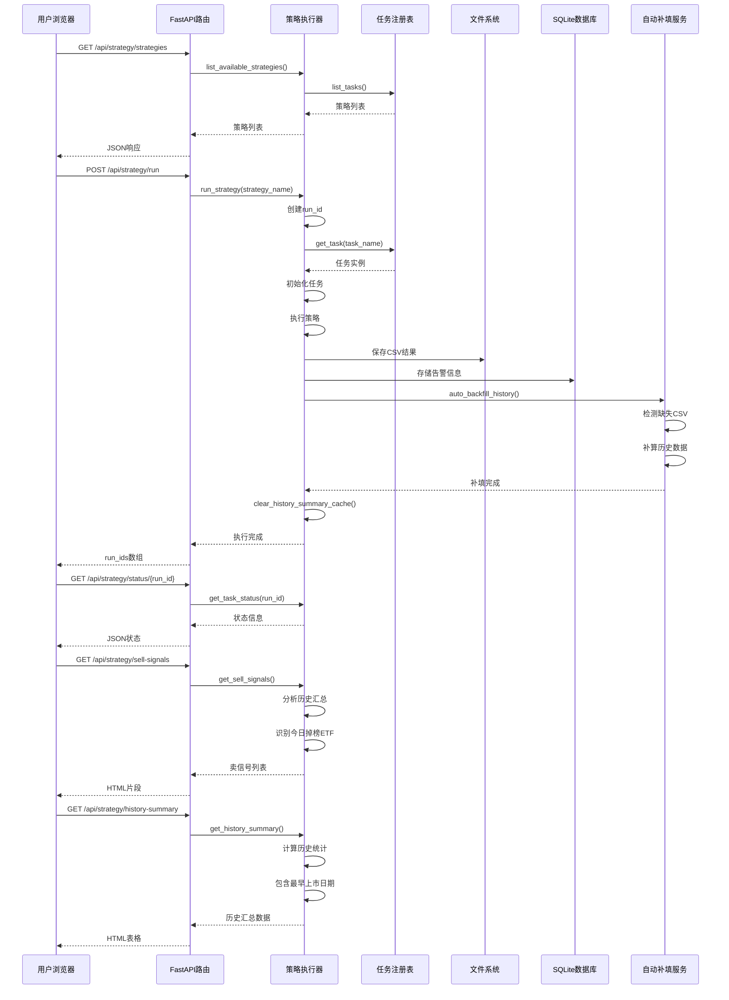
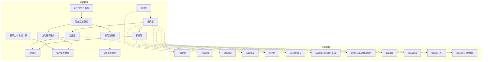

# 策略执行页面

<cite>
**本文档引用的文件**
- [src/quant_etf/dashboard/routes/strategy.py](file://src/quant_etf/dashboard/routes/strategy.py)
- [src/quant_etf/dashboard/services/strategy_runner.py](file://src/quant_etf/dashboard/services/strategy_runner.py)
- [src/quant_etf/dashboard/templates/strategy/index.html](file://src/quant_etf/dashboard/templates/strategy/index.html)
- [src/quant_etf/dashboard/templates/strategy/_results.html](file://src/quant_etf/dashboard/templates/strategy/_results.html)
- [src/quant_etf/dashboard/templates/strategy/_sell_signals.html](file://src/quant_etf/dashboard/templates/strategy/_sell_signals.html)
- [src/quant_etf/dashboard/templates/strategy/_history_summary.html](file://src/quant_etf/dashboard/templates/strategy/_history_summary.html)
- [src/quant_etf/dashboard/templates/base.html](file://src/quant_etf/dashboard/templates/base.html)
- [src/quant_etf/dashboard/app.py](file://src/quant_etf/dashboard/app.py)
- [src/quant_etf/dashboard/models.py](file://src/quant_etf/dashboard/models.py)
- [src/quant_etf/dashboard/services/sse_manager.py](file://src/quant_etf/dashboard/services/sse_manager.py)
- [src/quant_etf/dashboard/services/alert_engine.py](file://src/quant_etf/dashboard/services/alert_engine.py)
- [src/quant_etf/dashboard/services/auto_backfill.py](file://src/quant_etf/dashboard/services/auto_backfill.py)
- [src/quant_etf/tasks.py](file://src/quant_etf/tasks.py)
- [src/quant_etf/dashboard/db.py](file://src/quant_etf/dashboard/db.py)
- [src/quant_etf/dashboard/template_setup.py](file://src/quant_etf/dashboard/template_setup.py)
- [src/quant_etf/strategy.py](file://src/quant_etf/strategy.py)
</cite>

## 更新摘要
**所做更改**
- 新增ETF卖信号功能集成：在策略执行页面自动加载今日卖出信号和历史摘要内容
- 更新策略执行结果页面，集成实时ETF掉出检测和可视化展示
- 新增自动补填历史数据功能，确保历史汇总的准确性
- 完善策略执行后的自动刷新机制，提供完整的ETF监控闭环
- **更新** 增强历史ETF策略跟踪功能：在历史汇总表中添加'最早上市日期'列，提供更完整的ETF持仓时间维度分析能力

## 目录
1. [简介](#简介)
2. [项目结构](#项目结构)
3. [核心组件](#核心组件)
4. [架构概览](#架构概览)
5. [详细组件分析](#详细组件分析)
6. [ETF卖信号功能](#etf卖信号功能)
7. [历史数据补填机制](#历史数据补填机制)
8. [历史ETF策略跟踪增强](#历史etf策略跟踪增强)
9. [依赖关系分析](#依赖关系分析)
10. [性能考虑](#性能考虑)
11. [故障排除指南](#故障排除指南)
12. [结论](#结论)

## 简介

策略执行页面是量化ETF看板系统中的核心功能模块，负责提供策略运行状态的实时监控和结果显示功能。该页面支持多策略并行执行、实时进度监控、历史回测结果展示、性能指标可视化等功能。**更新** 策略执行页面现已集成ETF卖信号功能，提供实时的ETF掉出检测和可视化展示，包括今日卖出信号的自动加载和历史标的汇总统计。

**更新** 新增的历史ETF策略跟踪功能显著增强了系统的分析能力，通过在历史汇总表中添加'最早上市日期'列，为用户提供更完整的ETF持仓时间维度分析，帮助投资者更好地评估ETF的长期表现和市场地位。

用户可以通过直观的界面选择策略、配置参数，并获得详细的执行结果、ETF卖信号提醒、历史表现分析和持仓时间统计。系统采用现代化的前端技术栈，提供流畅的用户体验和完整的ETF监控能力。

## 项目结构

策略执行页面采用模块化设计，主要由以下层次组成：

```mermaid
graph TB
subgraph "前端层"
A[HTML模板]
B[现代JavaScript fetch() API]
C[Alpine.js + HTMX]
D[Bootstrap 5]
E[ETF卖信号区块]
F[历史汇总表格]
G[最早上市日期列]
end
subgraph "API层"
H[FastAPI路由]
I[策略执行API]
J[卖信号API]
K[历史汇总API]
L[状态查询API]
M[结果渲染API]
end
subgraph "服务层"
N[策略执行器]
O[SSE管理器]
P[告警引擎]
Q[自动补填服务]
R[历史汇总缓存]
S[ETF卖信号检测]
end
subgraph "数据层"
T[任务注册表]
U[CSV结果存储]
V[SQLite数据库]
W[历史数据缓存]
X[ETF名称映射]
end
A --> H
B --> H
C --> A
D --> A
E --> H
F --> H
G --> F
H --> N
I --> N
J --> N
K --> N
L --> N
M --> N
N --> O
N --> P
N --> Q
N --> R
P --> V
Q --> U
R --> W
S --> X
```

**图表来源**
- [src/quant_etf/dashboard/routes/strategy.py:17-83](file://src/quant_etf/dashboard/routes/strategy.py#L17-L83)
- [src/quant_etf/dashboard/services/strategy_runner.py:23-323](file://src/quant_etf/dashboard/services/strategy_runner.py#L23-L323)

## 核心组件

### 现代化前端交互系统
策略执行页面采用了现代化的前端技术栈，提供优秀的用户体验：

- **fetch() API**：用于HTTP请求，支持Promise链式调用和错误处理
- **Alpine.js**：轻量级JavaScript框架，提供响应式数据绑定
- **HTMX**：简化AJAX交互，实现无刷新页面更新
- **Bootstrap 5**：现代化UI框架，提供响应式设计

### 策略执行API路由
策略执行页面的核心路由提供了完整的策略生命周期管理：
- 策略列表查询：`/api/strategy/strategies`
- 策略执行：`/api/strategy/run`
- 进度查询：`/api/strategy/status/{run_id}`
- 结果渲染：`/api/strategy/results/{run_id}`
- **新增** ETF卖信号：`/api/strategy/sell-signals`
- **新增** 历史汇总：`/api/strategy/history-summary`

### 异步策略执行器
采用线程池异步执行策略，支持：
- 多策略并行执行
- 实时进度跟踪（0-100%）
- 错误处理和异常恢复
- **新增** 历史汇总缓存管理
- **新增** 自动补填历史数据

### ETF卖信号检测系统
**新增** 系统提供实时ETF卖信号检测功能：
- 今日掉榜ETF自动识别
- 严格模式掉出检测（仅最新掉榜触发）
- 实时可视化展示
- 历史上榜天数统计

### 历史数据补填机制
**新增** 自动检测和补填历史CSV文件：
- 后台线程异步补算
- TOCTOU防护机制
- 交易日历集成
- 缓存失效管理

### **更新** 历史ETF策略跟踪增强
**新增** 历史ETF策略跟踪功能显著增强：
- **新增** 最早上市日期统计：记录ETF首次出现在榜单的日期
- **新增** 持仓时间分析：基于最早上市日期计算ETF的总在榜时间
- **新增** 时间维度可视化：在历史汇总表中提供完整的日期分析
- **新增** 长期表现评估：帮助用户识别长期强势ETF

**章节来源**
- [src/quant_etf/dashboard/routes/strategy.py:17-83](file://src/quant_etf/dashboard/routes/strategy.py#L17-L83)
- [src/quant_etf/dashboard/services/strategy_runner.py:23-323](file://src/quant_etf/dashboard/services/strategy_runner.py#L23-L323)

## 架构概览

策略执行页面采用分层架构设计，确保了良好的可维护性和扩展性：



**图表来源**
- [src/quant_etf/dashboard/routes/strategy.py:26-83](file://src/quant_etf/dashboard/routes/strategy.py#L26-L83)
- [src/quant_etf/dashboard/services/strategy_runner.py:27-137](file://src/quant_etf/dashboard/services/strategy_runner.py#L27-L137)

## 详细组件分析

### 现代化前端交互系统

策略执行页面采用了现代化的前端技术栈，提供优秀的用户体验：

#### fetch() API集成
- **策略加载**：使用fetch()异步获取策略列表
- **执行控制**：通过fetch()发送POST请求启动策略执行
- **错误处理**：利用Promise.catch()处理网络请求异常
- **响应处理**：使用JSON.parse()解析服务器响应

#### Alpine.js响应式数据绑定
- **runIds数组**：存储当前执行的策略运行ID
- **polling状态**：控制自动刷新机制
- **实时状态更新**：响应式更新UI元素

#### HTMX无缝AJAX交互
- **自动刷新**：每2秒自动查询执行状态
- **条件切换**：根据执行状态动态切换内容
- **无刷新更新**：通过AJAX更新页面内容
- **新增** 卖信号加载：自动加载今日ETF卖信号
- **新增** 历史汇总加载：自动加载历史标的统计
- **新增** 最早上市日期显示：在表格中展示ETF最早上市日期

**章节来源**
- [src/quant_etf/dashboard/templates/strategy/index.html:4-71](file://src/quant_etf/dashboard/templates/strategy/index.html#L4-L71)
- [src/quant_etf/dashboard/templates/strategy/_results.html:83-111](file://src/quant_etf/dashboard/templates/strategy/_results.html#L83-L111)

### 策略执行API路由

策略执行API路由提供了RESTful接口，支持完整的策略生命周期管理：

#### 策略列表查询
- **端点**：`GET /api/strategy/strategies`
- **功能**：返回所有可用策略的列表
- **响应**：JSON格式的策略信息数组

#### 策略执行
- **端点**：`POST /api/strategy/run`
- **请求体**：包含策略名称数组
- **功能**：异步启动多个策略执行
- **响应**：包含run_id数组和执行消息

#### 状态查询
- **端点**：`GET /api/strategy/status/{run_id}`
- **功能**：查询指定run_id的执行状态
- **响应**：包含进度、状态、时间戳等信息

#### 结果渲染
- **端点**：`GET /api/strategy/results/{run_id}`
- **功能**：渲染HTML结果页面
- **响应**：包含表格的完整HTML页面

#### **新增** ETF卖信号API
- **端点**：`GET /api/strategy/sell-signals`
- **参数**：strategy（默认"etf"）
- **功能**：渲染今日ETF卖信号区块
- **响应**：HTML片段，包含掉榜ETF列表

#### **新增** 历史汇总API
- **端点**：`GET /api/strategy/history-summary`
- **参数**：strategy（默认"etf"）、days（默认30）、backfill（默认True）
- **功能**：渲染历史标的汇总表格
- **响应**：HTML片段，包含历史统计信息，包括最早上市日期

**章节来源**
- [src/quant_etf/dashboard/routes/strategy.py:17-83](file://src/quant_etf/dashboard/routes/strategy.py#L17-L83)

### 异步策略执行器

策略执行器是整个系统的核心组件，负责协调策略的执行过程：

#### 执行流程
1. **初始化**：生成唯一run_id，设置初始状态
2. **任务获取**：从任务注册表获取具体任务实例
3. **执行阶段**：
   - 初始化阶段：30%进度
   - 运行阶段：50%进度  
   - 结果处理：80%进度
4. **完成**：设置完成状态和最终进度

#### 状态管理
执行器维护一个全局字典来跟踪所有正在运行的任务：
- `status`: 当前执行状态（running/complete/error）
- `strategy`: 策略名称
- `started_at`: 开始时间
- `finished_at`: 完成时间
- `progress`: 执行进度百分比
- `result`: 执行结果数据
- `count`: 结果数量

#### 错误处理机制
- 捕获所有执行异常
- 设置错误状态和错误信息
- 通过SSE广播错误事件
- 记录详细的错误日志

#### **新增** 历史汇总缓存管理
- **缓存机制**：5分钟TTL缓存历史汇总数据
- **缓存键**：`{strategy_name}_{days}`
- **缓存清理**：执行完成后清除相关缓存
- **性能优化**：避免重复计算历史数据

#### **新增** 最早上市日期计算
- **数据收集**：从CSV文件中提取ETF代码和日期信息
- **时间排序**：对所有出现日期进行排序
- **最早日期识别**：取排序后的第一个日期作为最早上市日期
- **字段扩展**：在历史汇总数据中包含`first_on_date`字段

**章节来源**
- [src/quant_etf/dashboard/services/strategy_runner.py:27-323](file://src/quant_etf/dashboard/services/strategy_runner.py#L27-L323)

### 模板渲染系统

模板系统提供了丰富的用户界面，支持多种交互模式：

#### 主页面模板
- **策略选择区域**：动态加载可用策略
- **执行按钮**：批量执行选中的策略
- **结果容器**：显示执行结果和图表

#### 结果模板
- **状态显示**：实时显示执行进度
- **自动刷新**：每2秒自动查询状态
- **新增** 卖信号区块：自动加载今日ETF卖信号
- **新增** 历史汇总表格：显示历史标的统计信息
- **新增** 最早上市日期列：展示ETF的最早上市日期
- **数据表格**：显示详细的执行结果

#### **新增** ETF卖信号模板
- **新增** 今日掉榜提醒：红色警告框显示掉榜ETF
- **新增** 无卖信号提示：绿色成功框显示无掉榜
- **新增** 掉榜详情：包含代码、名称、最后在榜日期、在榜天数
- **新增** 严格模式检测：仅显示最新掉榜的标的

#### **新增** 历史汇总模板
- **新增** 历史统计：显示最近N天的标的表现
- **新增** 在榜状态：绿色徽章显示在榜中
- **新增** 最早上市日期：显示ETF首次出现的日期
- **新增** 下榜日期：显示具体的下榜日期
- **新增** 在榜天数：粗体显示在榜天数统计

#### JavaScript交互
- **策略加载**：fetch()异步获取策略列表
- **执行控制**：处理执行请求和响应
- **状态轮询**：自动刷新执行状态
- **新增** 卖信号加载：自动加载ETF卖信号
- **新增** 历史汇总加载：自动加载历史统计数据
- **新增** 最早上市日期处理：正确显示和格式化最早上市日期

**章节来源**
- [src/quant_etf/dashboard/templates/strategy/index.html:1-71](file://src/quant_etf/dashboard/templates/strategy/index.html#L1-L71)
- [src/quant_etf/dashboard/templates/strategy/_results.html:1-111](file://src/quant_etf/dashboard/templates/strategy/_results.html#L1-L111)
- [src/quant_etf/dashboard/templates/strategy/_sell_signals.html:1-35](file://src/quant_etf/dashboard/templates/strategy/_sell_signals.html#L1-L35)
- [src/quant_etf/dashboard/templates/strategy/_history_summary.html:1-48](file://src/quant_etf/dashboard/templates/strategy/_history_summary.html#L1-L48)

### 任务注册表

任务注册表管理所有可用的策略任务：

#### 支持的策略类型
- **ETF组合策略**：基于动量因子的ETF筛选
- **短线股票策略**：短期强势股识别
- **中期反弹策略**：技术面反弹机会捕捉

#### 任务接口规范
所有任务必须实现以下方法：
- `initialize()`: 初始化数据源和策略引擎
- `get_pool()`: 获取证券池
- `load_data()`: 加载数据
- `run_strategy()`: 执行策略
- `format_result()`: 格式化结果
- `export_results()`: 导出结果

**章节来源**
- [src/quant_etf/tasks.py:428-467](file://src/quant_etf/tasks.py#L428-L467)

### 告警引擎

告警引擎提供智能的策略结果监控功能：

#### 告警规则
- **评分进入前三**：检测新进入前3的标的
- **动量得分突变**：监控评分的大幅变化
- **新增** ETF掉出告警：检测今日掉榜ETF的告警

#### 告警严重程度
- **info**: 一般信息
- **warning**: 警告级别
- **danger**: 危险级别

#### 数据库集成
告警信息存储在SQLite数据库中，支持：
- 告警规则管理
- 告警历史记录
- 状态跟踪

**章节来源**
- [src/quant_etf/dashboard/services/alert_engine.py:20-120](file://src/quant_etf/dashboard/services/alert_engine.py#L20-L120)

### SSE事件系统

服务器推送事件（SSE）系统提供实时通知功能：

#### 事件类型
- **策略错误**：策略执行失败通知
- **告警事件**：策略结果变化告警
- **新增** ETF卖信号事件：今日ETF掉榜告警
- **连接状态**：客户端连接管理

#### 连接管理
- **订阅管理**：跟踪所有活跃连接
- **心跳机制**：保持连接活跃
- **异常处理**：优雅处理断开连接

**章节来源**
- [src/quant_etf/dashboard/services/sse_manager.py:10-45](file://src/quant_etf/dashboard/services/sse_manager.py#L10-L45)

## ETF卖信号功能

**新增** ETF卖信号功能是策略执行页面的重要增强，提供实时的ETF掉出检测和可视化展示：

### 卖信号检测机制

#### 严格模式掉出检测
- **新增** 最新日期识别：找到当前仍在榜标的的最晚上榜日期
- **新增** 严格匹配：仅当off_date等于最新日期时才触发卖信号
- **新增** 今日掉榜确认：确保是今天刚掉榜的标的

#### 卖信号数据结构
- **代码**：ETF代码
- **名称**：ETF名称
- **最后在榜日期**：最后一次出现在榜单的日期
- **在榜天数**：总共在榜的天数

### 可视化展示设计

#### 成功状态展示
- **新增** 绿色成功框：显示"今日无卖出信号"
- **新增** 检查图标：使用绿色圆形图标
- **新增** 简洁提示：直接告知无卖信号

#### 危险状态展示
- **新增** 红色警告框：显示"今日卖出信号"和掉榜数量
- **新增** 警告图标：使用黄色三角形图标
- **新增** 详细表格：包含所有掉榜ETF的详细信息

#### 表格字段设计
- **代码**：ETF代码（等宽字体显示）
- **名称**：ETF全称
- **最后在榜日期**：最后一次在榜的具体日期
- **在榜天数**：显示为"X 天"格式

### 自动加载机制

#### HTMX集成
- **新增** 页面加载触发：使用`hx-trigger="load"`自动触发
- **新增** 参数传递：传递`strategy=etf`参数
- **新增** 加载指示器：显示旋转指示器和加载文本

#### 实时更新
- **新增** 执行完成触发：策略执行完成后自动重新加载
- **新增** 缓存控制：避免频繁重复请求
- **新增** 错误处理：网络错误时显示友好提示

**章节来源**
- [src/quant_etf/dashboard/services/strategy_runner.py:178-204](file://src/quant_etf/dashboard/services/strategy_runner.py#L178-L204)
- [src/quant_etf/dashboard/routes/strategy.py:57-67](file://src/quant_etf/dashboard/routes/strategy.py#L57-L67)
- [src/quant_etf/dashboard/templates/strategy/_sell_signals.html:1-35](file://src/quant_etf/dashboard/templates/strategy/_sell_signals.html#L1-L35)

## 历史数据补填机制

**新增** 自动补填历史数据功能确保历史汇总的准确性和完整性：

### 补填检测流程

#### 交易日历集成
- **新增** 日期范围确定：获取最近60个日历日的数据
- **新增** 交易日过滤：基于ETF代码"510310"获取真实交易日
- **新增** 最近N天提取：取最近指定天数的交易日

#### 缺失文件扫描
- **新增** 目录遍历：扫描data/results目录下的日期子目录
- **新增** CSV检查：检查每个日期目录下的策略CSV文件
- **新增** 缺失记录**：记录所有缺失的日期和文件

### 后台补算执行

#### 线程池管理
- **新增** 后台线程：使用守护线程避免阻塞主线程
- **新增** 异步执行：不阻塞策略执行流程
- **新增** 异常隔离**：补填失败不影响其他功能

#### TOCTOU防护
- **新增** 重复检查：补算前再次检查文件是否存在
- **新增** 条件判断：如果文件已存在则跳过
- **新增** 成功统计**：记录实际补算成功的数量

### 缓存管理

#### 缓存失效策略
- **新增** 执行后清理：策略执行完成后清除历史缓存
- **新增** 避免陈旧数据：确保新数据立即可见
- **新增** 性能平衡**：合理设置缓存TTL（5分钟）

#### 缓存键设计
- **新增** 组合键：`{strategy_name}_{days}`格式
- **新增** 唯一键：区分不同策略和天数的缓存
- **新增** 自动清理**：按策略名称清理相关缓存

**章节来源**
- [src/quant_etf/dashboard/services/auto_backfill.py:1-113](file://src/quant_etf/dashboard/services/auto_backfill.py#L1-L113)
- [src/quant_etf/dashboard/services/strategy_runner.py:210-240](file://src/quant_etf/dashboard/services/strategy_runner.py#L210-L240)

## 历史ETF策略跟踪增强

**更新** 历史ETF策略跟踪功能是本次更新的核心增强，显著提升了系统的分析能力：

### 最早上市日期统计

#### 数据收集机制
- **CSV解析**：从历史CSV文件中提取ETF代码和日期信息
- **日期映射**：构建ETF代码到出现日期的映射关系
- **时间排序**：对所有出现日期进行升序排序
- **最早日期识别**：取排序后的第一个日期作为最早上市日期

#### 字段扩展
- **新增** `first_on_date`字段：存储ETF首次出现在榜单的日期
- **数据类型**：字符串格式的日期（YYYY-MM-DD）
- **显示格式**：在历史汇总表格中直接显示

### 持仓时间分析

#### 计算逻辑
- **在榜天数**：基于最早上市日期和最新在榜日期计算
- **时间跨度**：显示ETF在观察期内的总在榜天数
- **排序优化**：在榜天数降序排列，最晚在榜日期次序

#### 分析价值
- **长期表现**：识别长期强势ETF
- **市场地位**：评估ETF的市场认可度
- **投资决策**：为投资者提供时间维度的参考

### 可视化展示

#### 表格列设计
- **代码**：ETF代码
- **名称**：ETF全称
- **最早上市日期**：ETF首次出现的日期
- **最晚上榜日期**：最近一次在榜的日期
- **最晚下榜日期**：最近一次下榜的日期
- **在榜天数**：总在榜天数（粗体显示）

#### 状态标识
- **在榜中**：绿色徽章显示当前仍在榜
- **已下榜**：显示具体的下榜日期
- **时间统计**：粗体显示在榜天数，便于快速识别

### 性能优化

#### 缓存策略
- **5分钟TTL**：避免频繁重新计算历史数据
- **执行后清理**：策略执行完成后清除相关缓存
- **条件加载**：只有在策略执行完成后才加载

#### 计算优化
- **严格模式**：仅分析最近活跃的标的
- **最新日期优先**：优先处理最新的掉榜数据
- **快速过滤**：使用集合操作快速识别掉榜ETF

**章节来源**
- [src/quant_etf/dashboard/services/strategy_runner.py:298-323](file://src/quant_etf/dashboard/services/strategy_runner.py#L298-L323)
- [src/quant_etf/dashboard/templates/strategy/_history_summary.html:15-47](file://src/quant_etf/dashboard/templates/strategy/_history_summary.html#L15-L47)

## 依赖关系分析

策略执行页面的依赖关系清晰明确，遵循单一职责原则：



**图表来源**
- [src/quant_etf/dashboard/app.py:17-25](file://src/quant_etf/dashboard/app.py#L17-L25)
- [src/quant_etf/dashboard/services/strategy_runner.py:15-19](file://src/quant_etf/dashboard/services/strategy_runner.py#L15-L19)

### 关键依赖关系

1. **路由到服务**：API路由调用策略执行服务
2. **服务到任务**：执行器使用任务注册表
3. **模板到数据**：模板渲染使用状态数据
4. **服务到数据库**：告警引擎访问SQLite
5. **服务到SSE**：事件广播通过SSE管理器
6. **新增** 服务到ETF卖信号**：卖信号检测依赖历史汇总
7. **新增** 服务到历史汇总**：历史汇总依赖自动补填
8. **新增** 服务到自动补填**：自动补填使用线程池
9. **新增** 服务到CSV处理**：最早上市日期计算依赖CSV解析
10. **新增** 服务到ETF名称映射**：历史汇总显示ETF名称

**章节来源**
- [src/quant_etf/dashboard/app.py:17-25](file://src/quant_etf/dashboard/app.py#L17-L25)
- [src/quant_etf/dashboard/services/strategy_runner.py:15-19](file://src/quant_etf/dashboard/services/strategy_runner.py#L15-L19)

## 性能考虑

### 现代化前端优化
- **fetch() API**：相比传统XMLHttpRequest，提供更好的性能和Promise支持
- **Alpine.js**：轻量级框架，减少DOM操作开销
- **HTMX**：智能缓存和请求去重机制
- **事件委托**：减少事件监听器数量
- **新增** 卖信号缓存：避免重复加载ETF卖信号
- **新增** 最早上市日期缓存：优化历史汇总表格渲染

### 异步执行优化
- **线程池管理**：使用ThreadPoolExecutor限制并发数量
- **事件循环集成**：正确处理异步事件循环
- **资源清理**：确保线程安全的资源管理
- **新增** 后台补填**：不阻塞主线程的异步补算

### 内存管理
- **状态缓存**：内存中缓存执行状态
- **CSV读取优化**：使用pandas高效读取结果
- **模板渲染**：Jinja2模板的内存使用优化
- **新增** 历史汇总缓存**：5分钟TTL避免内存溢出
- **新增** 最早上市日期缓存**：优化日期计算性能

### 数据持久化
- **SQLite WAL模式**：提高并发性能
- **外键约束**：确保数据完整性
- **索引优化**：为常用查询建立索引
- **新增** 缓存键优化**：合理的缓存键设计

### **新增** ETF卖信号性能优化

#### 缓存策略
- **新增** 5分钟TTL：避免频繁重新计算卖信号
- **新增** 执行后清理**：确保卖信号数据的时效性
- **新增** 条件加载**：只有在策略执行完成后才加载

#### 计算优化
- **新增** 严格模式**：仅分析最近活跃的标的
- **新增** 最新日期优先**：优先处理最新的掉榜数据
- **新增** 快速过滤**：使用集合操作快速识别掉榜ETF

### **新增** 历史ETF策略跟踪性能优化

#### 数据处理优化
- **新增** 早期日期过滤**：跳过明显不在观察期的数据
- **新增** 内存映射**：使用pandas的高效数据结构
- **新增** 批量计算**：一次性处理所有ETF的日期信息

#### 渲染优化
- **新增** 表格虚拟滚动**：对于大量数据时的性能优化
- **新增** 条件渲染**：仅在有数据时渲染表格
- **新增** 样式缓存**：CSS样式的一次性计算和缓存

## 故障排除指南

### 现代化技术问题及解决方案

#### fetch() API请求失败
**症状**：执行按钮点击后显示"执行请求失败"
**原因**：
- 网络连接问题
- CORS跨域限制
- 服务器端点不可达

**解决步骤**：
1. 检查浏览器开发者工具Network标签
2. 验证API端点URL正确性
3. 确认服务器正常运行
4. 检查防火墙和代理设置

#### Alpine.js数据绑定问题
**症状**：UI状态不更新或更新延迟
**可能原因**：
- Alpine.js实例未正确初始化
- 数据响应式更新时机问题
- 作用域变量访问冲突

**排查方法**：
1. 检查console是否有JavaScript错误
2. 验证x-data指令语法
3. 确认数据属性命名规范

#### HTMX自动刷新异常
**症状**：状态查询停止或重复请求
**可能原因**：
- htmx配置错误
- 服务器响应格式问题
- 客户端内存泄漏

**处理建议**：
1. 检查htmx触发器配置
2. 验证服务器JSON响应格式
3. 清理不必要的事件监听器

### **新增** ETF卖信号功能故障排除

#### 卖信号不显示
**症状**：ETF卖信号区块空白或无数据显示
**可能原因**：
- 策略执行尚未完成
- 历史数据缺失
- 严格模式过滤导致无掉榜ETF

**解决步骤**：
1. 确认策略执行已完成
2. 检查历史数据目录结构
3. 验证CSV文件格式正确性
4. 等待下一个交易日确认

#### 历史汇总数据不准确
**症状**：历史标的汇总显示异常或缺失
**可能原因**：
- 缺失的CSV文件未补填
- 交易日计算错误
- 缓存数据过期

**排查方法**：
1. 检查自动补填服务日志
2. 验证交易日历配置
3. 清除历史汇总缓存
4. 重新执行策略

#### 卖信号检测错误
**症状**：ETF卖信号检测结果不正确
**可能原因**：
- 严格模式参数配置错误
- 最新日期计算错误
- 数据排序问题

**处理建议**：
1. 检查get_sell_signals函数参数
2. 验证历史汇总数据完整性
3. 确认off_date计算逻辑
4. 检查is_active标志设置

### **新增** 历史ETF策略跟踪功能故障排除

#### 最早上市日期显示异常
**症状**：历史汇总表格中最早上市日期显示错误
**可能原因**：
- CSV文件格式不正确
- 日期解析错误
- 数据编码问题

**解决步骤**：
1. 检查CSV文件的日期列格式
2. 验证日期字符串的YYYY-MM-DD格式
3. 确认CSV文件编码为UTF-8
4. 检查是否有空值或异常数据

#### 历史汇总表格渲染问题
**症状**：历史汇总表格显示不完整或格式错误
**可能原因**：
- 模板渲染错误
- 数据结构不匹配
- CSS样式冲突

**排查方法**：
1. 检查模板中的字段映射
2. 验证历史汇总数据的结构
3. 检查浏览器控制台错误
4. 确认CSS样式文件加载正常

#### 持仓时间计算错误
**症状**：在榜天数计算结果不正确
**可能原因**：
- 日期计算逻辑错误
- 交易日过滤问题
- 数据去重不正确

**处理建议**：
1. 检查日期排序逻辑
2. 验证交易日历的正确性
3. 确认数据去重的完整性
4. 检查边界情况的处理

### 传统问题继续适用

#### 策略执行失败
**症状**：执行状态显示error，包含错误信息
**原因**：
- 策略名称不存在
- 数据加载失败
- 计算过程中出现异常

**解决步骤**：
1. 检查策略名称是否正确
2. 验证数据源连接
3. 查看日志文件获取详细错误信息

#### 结果数据为空
**症状**：结果显示"无结果数据"
**可能原因**：
- 策略未产生符合条件的结果
- 数据文件不存在或格式错误
- 权重配置不当

**排查方法**：
1. 检查CSV结果文件是否存在
2. 验证数据文件格式
3. 调整策略参数配置

#### 进度停滞
**症状**：执行进度长时间停留在某个百分比
**可能原因**：
- 策略计算过于复杂
- 数据加载耗时过长
- 系统资源不足

**处理建议**：
1. 优化策略算法
2. 增加系统资源
3. 分批处理大数据集

#### SSE连接问题
**症状**：无法接收实时更新
**解决方法**：
1. 检查网络连接
2. 验证SSE端点可达性
3. 查看浏览器控制台错误

**章节来源**
- [src/quant_etf/dashboard/services/strategy_runner.py:113-137](file://src/quant_etf/dashboard/services/strategy_runner.py#L113-L137)
- [src/quant_etf/dashboard/services/alert_engine.py:82-96](file://src/quant_etf/dashboard/services/alert_engine.py#L82-L96)

## 结论

策略执行页面经过重大更新，现已成为一个功能完整、架构清晰且用户体验优秀的量化ETF执行监控系统。**更新** 新增的ETF卖信号功能、历史数据补填机制和历史ETF策略跟踪功能进一步增强了系统的实用性和可靠性。

### 技术优势

#### **更新** ETF监控能力
- **新增** 实时卖信号检测：提供今日ETF掉榜的实时监控
- **新增** 严格模式过滤：确保卖信号的准确性
- **新增** 可视化展示：直观的HTML表格展示卖信号
- **新增** 自动加载机制：HTMX自动加载卖信号内容

#### **更新** 历史数据分析增强
- **新增** 自动补填功能：后台异步补算缺失的历史数据
- **新增** 缓存优化：5分钟TTL确保数据时效性
- **新增** 交易日集成：基于真实交易日历的数据分析
- **新增** 性能监控：TOCTOU防护避免重复计算
- **新增** 最早上市日期统计：提供完整的ETF持仓时间维度分析

#### **更新** 现代化前端技术
- **新增** HTMX集成：简化AJAX交互，提供更好的用户体验
- **新增** 自动刷新机制：策略执行完成后自动加载卖信号
- **新增** 响应式设计：Bootstrap 5提供移动端适配
- **新增** 错误处理：完善的前端错误处理机制
- **新增** 最早上市日期显示：在表格中展示ETF最早上市日期

### 用户体验

#### **更新** 监控闭环
- **新增** 执行监控：策略执行状态实时跟踪
- **新增** 卖信号提醒：今日ETF掉榜即时通知
- **新增** 历史分析：标的表现历史统计，包括最早上市日期
- **新增** 自动更新：策略完成后自动刷新所有内容

#### **更新** 交互设计
- **新增** 无刷新更新：HTMX提供流畅的用户体验
- **新增** 加载指示器：清晰的加载状态反馈
- **新增** 错误提示：友好的错误信息展示
- **新增** 响应式布局：适配各种屏幕尺寸
- **新增** 时间维度分析：帮助用户理解ETF的长期表现

### 扩展性

#### **更新** 模块化设计
- **新增** 卖信号服务：独立的ETF卖信号检测模块
- **新增** 历史汇总服务：专门的历史数据分析服务
- **新增** 自动补填服务：后台数据补填处理
- **新增** 缓存管理：统一的缓存控制机制
- **新增** 最早上市日期计算：专门的时间维度分析模块

#### **更新** 插件机制
- **新增** 策略扩展：支持新的ETF策略类型
- **新增** 告警规则：可配置的告警检测规则
- **新增** 数据源扩展：支持更多数据源接入
- **新增** 可视化扩展：支持自定义图表展示
- **新增** 时间分析扩展：支持更复杂的时间维度分析

### **更新** 技术现代化价值

#### **更新** 前端技术栈
- **新增** HTMX集成：减少JavaScript代码量，提高开发效率
- **新增** Alpine.js响应式：简化数据绑定和状态管理
- **新增** Bootstrap 5：现代化UI框架，提供更好的移动体验
- **新增** fetch() API：现代的HTTP请求方式

#### **更新** 后端架构优化
- **新增** 异步补填：后台线程处理，不阻塞主线程
- **新增** 缓存策略：合理的缓存管理提升性能
- **新增** 错误隔离：异常处理不影响整体系统稳定性
- **新增** 性能监控：完善的日志和监控机制
- **新增** 最早上市日期优化：高效的日期计算和缓存机制

该系统为量化ETF投资提供了强大的技术支持，能够满足专业投资者对策略执行、ETF监控、历史分析和时间维度评估的各种需求。**更新** 新增的ETF卖信号功能、历史数据补填机制和历史ETF策略跟踪功能进一步完善了系统的监控能力和分析深度，为用户提供更全面的ETF投资决策支持。现代化的技术栈确保了系统的可维护性和扩展性，为未来的功能增强奠定了坚实基础。