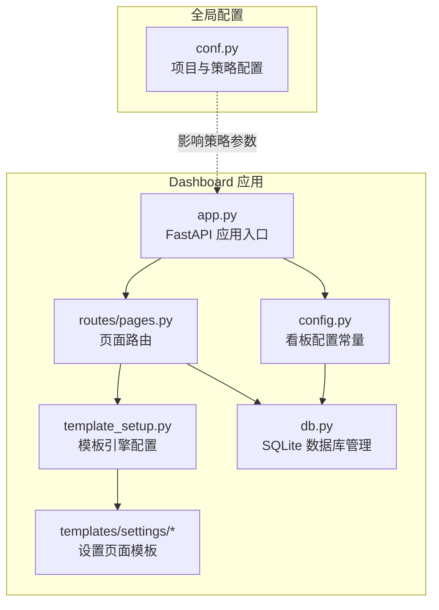
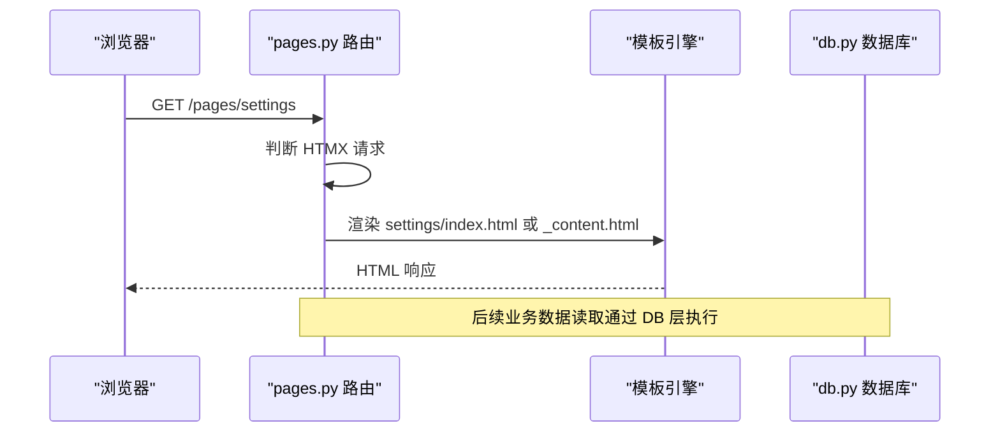
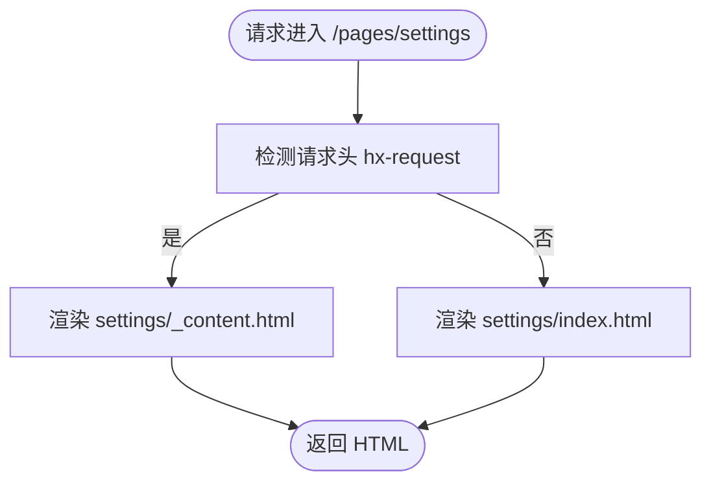
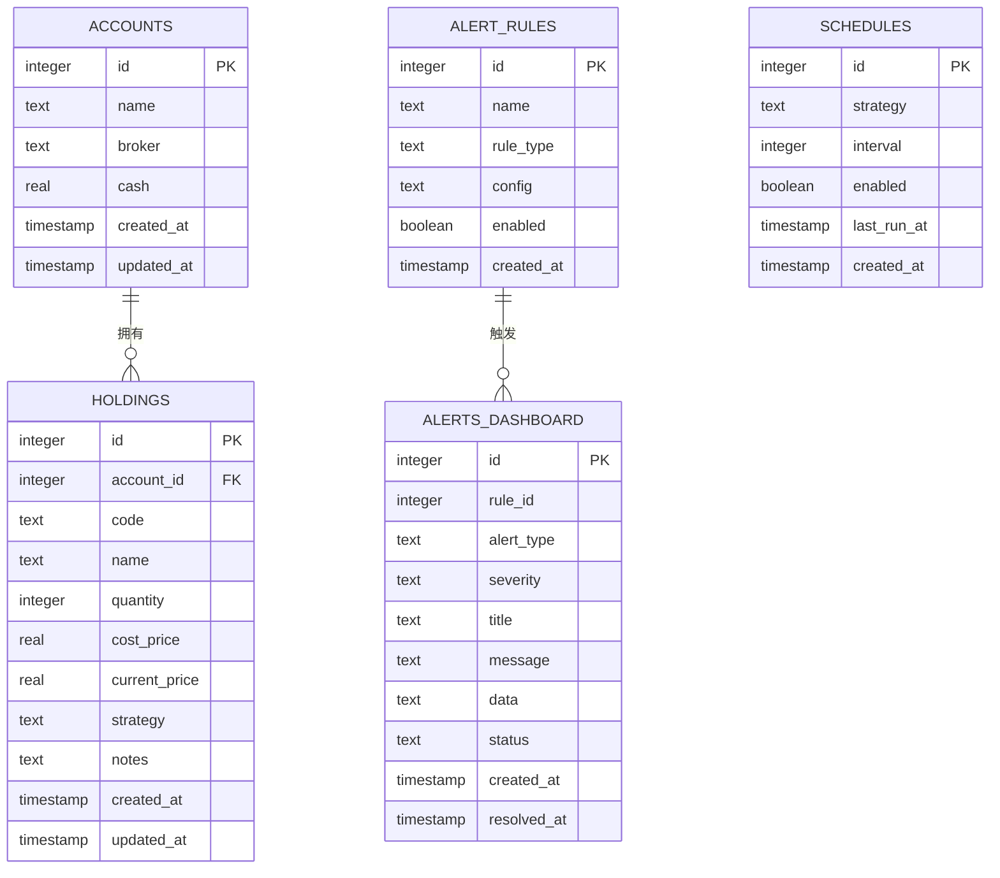
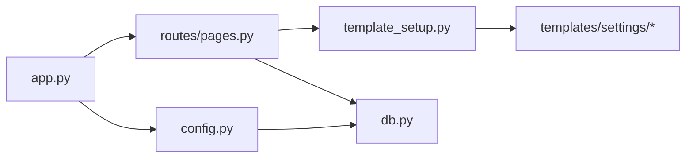

# 设置页面

<cite>
**本文引用的文件**
- [src/quant_etf/dashboard/templates/settings/index.html](file://src/quant_etf/dashboard/templates/settings/index.html)
- [src/quant_etf/dashboard/templates/settings/_content.html](file://src/quant_etf/dashboard/templates/settings/_content.html)
- [src/quant_etf/dashboard/routes/pages.py](file://src/quant_etf/dashboard/routes/pages.py)
- [src/quant_etf/dashboard/app.py](file://src/quant_etf/dashboard/app.py)
- [src/quant_etf/dashboard/db.py](file://src/quant_etf/dashboard/db.py)
- [src/quant_etf/dashboard/config.py](file://src/quant_etf/dashboard/config.py)
- [src/quant_etf/conf.py](file://src/quant_etf/conf.py)
- [src/quant_etf/dashboard/template_setup.py](file://src/quant_etf/dashboard/template_setup.py)
- [src/quant_etf/cli.py](file://src/quant_etf/cli.py)
</cite>

## 目录
1. [简介](#简介)
2. [项目结构](#项目结构)
3. [核心组件](#核心组件)
4. [架构概览](#架构概览)
5. [详细组件分析](#详细组件分析)
6. [依赖分析](#依赖分析)
7. [性能考虑](#性能考虑)
8. [故障排除指南](#故障排除指南)
9. [结论](#结论)
10. [附录](#附录)

## 简介
本文件为 Dashboard 设置页面的功能文档，聚焦系统配置与用户偏好的管理能力。当前实现处于开发中阶段，已提供基础的设置页面模板与路由入口，并通过 SQLite 数据库存储账户、持仓、告警规则与调度配置等业务数据。本文将从系统架构、组件关系、数据流、处理逻辑、集成点、错误处理与性能特征等方面进行深入解析，并给出面向非技术用户的可读说明。

## 项目结构
设置页面位于 Dashboard 子系统内，采用模板驱动的页面渲染方式，结合 FastAPI 路由与 SQLite 数据持久化。整体结构如下：

图表来源
- [src/quant_etf/dashboard/app.py:17-24](file://src/quant_etf/dashboard/app.py#L17-L24)
- [src/quant_etf/dashboard/routes/pages.py:13](file://src/quant_etf/dashboard/routes/pages.py#L13)
- [src/quant_etf/dashboard/template_setup.py:8-9](file://src/quant_etf/dashboard/template_setup.py#L8-L9)
- [src/quant_etf/dashboard/db.py:9](file://src/quant_etf/dashboard/db.py#L9)
- [src/quant_etf/dashboard/config.py:6-25](file://src/quant_etf/dashboard/config.py#L6-L25)
- [src/quant_etf/conf.py:5-137](file://src/quant_etf/conf.py#L5-L137)

章节来源
- [src/quant_etf/dashboard/app.py:17-24](file://src/quant_etf/dashboard/app.py#L17-L24)
- [src/quant_etf/dashboard/routes/pages.py:13](file://src/quant_etf/dashboard/routes/pages.py#L13)
- [src/quant_etf/dashboard/template_setup.py:8-9](file://src/quant_etf/dashboard/template_setup.py#L8-L9)
- [src/quant_etf/dashboard/db.py:9](file://src/quant_etf/dashboard/db.py#L9)
- [src/quant_etf/dashboard/config.py:6-25](file://src/quant_etf/dashboard/config.py#L6-L25)
- [src/quant_etf/conf.py:5-137](file://src/quant_etf/conf.py#L5-L137)

## 核心组件
- 页面路由与模板渲染
  - 路由层提供 /pages/settings 访问点，支持完整页面与 HTMX 内容片段两种响应模式。
  - 模板层包含 settings/index.html 与 settings/_content.html，前者用于完整页面，后者用于 HTMX 异步加载。
- 数据持久化
  - 使用 SQLite 存储账户、持仓、告警规则、调度配置等业务数据；数据库初始化在应用启动时完成。
- 配置常量
  - 定义看板数据库路径、SSE 心跳间隔、告警阈值等运行期参数；部分参数可通过环境变量覆盖。
- 全局配置
  - 提供策略权重、池子配置、通达信路径等全局参数，影响策略计算与数据源行为。

章节来源
- [src/quant_etf/dashboard/routes/pages.py:71-74](file://src/quant_etf/dashboard/routes/pages.py#L71-L74)
- [src/quant_etf/dashboard/templates/settings/index.html:1-24](file://src/quant_etf/dashboard/templates/settings/index.html#L1-L24)
- [src/quant_etf/dashboard/templates/settings/_content.html:1-20](file://src/quant_etf/dashboard/templates/settings/_content.html#L1-L20)
- [src/quant_etf/dashboard/db.py:79-91](file://src/quant_etf/dashboard/db.py#L79-L91)
- [src/quant_etf/dashboard/config.py:6-25](file://src/quant_etf/dashboard/config.py#L6-L25)
- [src/quant_etf/conf.py:100-137](file://src/quant_etf/conf.py#L100-L137)

## 架构概览
设置页面的请求处理流程如下：

图表来源
- [src/quant_etf/dashboard/routes/pages.py:71-74](file://src/quant_etf/dashboard/routes/pages.py#L71-L74)
- [src/quant_etf/dashboard/template_setup.py:8-9](file://src/quant_etf/dashboard/template_setup.py#L8-L9)
- [src/quant_etf/dashboard/db.py:93-112](file://src/quant_etf/dashboard/db.py#L93-L112)

## 详细组件分析

### 页面路由与模板渲染
- 路由设计
  - /pages/settings 对应设置页面，内部根据请求头 hx-request 判断是否返回完整页面或内容片段。
  - 该设计确保与 HTMX 的异步交互兼容，提升用户体验。
- 模板结构
  - settings/index.html 与 settings/_content.html 结构相似，均包含看板设置标题与提示信息。
  - 当前模板中的输入框为只读状态，体现“功能开发中”的现状。

图表来源
- [src/quant_etf/dashboard/routes/pages.py:20-22](file://src/quant_etf/dashboard/routes/pages.py#L20-L22)
- [src/quant_etf/dashboard/routes/pages.py:71-74](file://src/quant_etf/dashboard/routes/pages.py#L71-L74)

章节来源
- [src/quant_etf/dashboard/routes/pages.py:71-74](file://src/quant_etf/dashboard/routes/pages.py#L71-L74)
- [src/quant_etf/dashboard/templates/settings/index.html:1-24](file://src/quant_etf/dashboard/templates/settings/index.html#L1-L24)
- [src/quant_etf/dashboard/templates/settings/_content.html:1-20](file://src/quant_etf/dashboard/templates/settings/_content.html#L1-L20)

### 数据模型与持久化
- 数据库初始化
  - 应用启动时调用 init_db，创建账户、持仓、告警规则、调度配置等表。
- 查询与写入接口
  - 提供 query/query_one 执行查询，execute/execute_many 执行写操作。
  - 统一通过 get_connection 获取连接，启用 WAL 模式与外键约束，保证一致性与可靠性。
- 表结构要点
  - accounts: 账户基本信息
  - holdings: 持仓明细
  - alert_rules: 告警规则
  - alerts_dashboard: 告警记录
  - schedules: 调度配置

图表来源
- [src/quant_etf/dashboard/db.py:11-66](file://src/quant_etf/dashboard/db.py#L11-L66)

章节来源
- [src/quant_etf/dashboard/db.py:79-91](file://src/quant_etf/dashboard/db.py#L79-L91)
- [src/quant_etf/dashboard/db.py:93-133](file://src/quant_etf/dashboard/db.py#L93-L133)

### 配置常量与系统参数
- 看板配置
  - 数据库路径、SSE 心跳间隔、告警阈值等运行期参数集中定义。
  - 看板主机与端口可通过环境变量覆盖。
- 全局策略配置
  - 策略权重、池子集合、通达信路径等全局参数，影响策略计算与数据源行为。

章节来源
- [src/quant_etf/dashboard/config.py:6-25](file://src/quant_etf/dashboard/config.py#L6-L25)
- [src/quant_etf/conf.py:100-137](file://src/quant_etf/conf.py#L100-L137)

### CLI 与健康检查
- 页面清单
  - CLI 提供页面清单校验，包含 /pages/settings，便于快速验证各页面可用性。
- 健康检查
  - 提供独立的健康检查命令，可用于生产环境监控。

章节来源
- [src/quant_etf/cli.py:312-315](file://src/quant_etf/cli.py#L312-L315)
- [src/quant_etf/cli.py:354-356](file://src/quant_etf/cli.py#L354-L356)

## 依赖分析
- 组件耦合
  - 路由层依赖模板引擎与数据库层；模板层依赖模板目录；应用入口挂载路由并负责生命周期管理。
- 外部依赖
  - FastAPI、SQLite、Jinja2、loguru 等。
- 潜在风险
  - 模板与路由之间通过字符串模板名耦合，建议未来引入类型安全的模板注册机制。
  - 数据库层未暴露配置更新接口，当前设置页面仍为占位状态。

图表来源
- [src/quant_etf/dashboard/routes/pages.py:13](file://src/quant_etf/dashboard/routes/pages.py#L13)
- [src/quant_etf/dashboard/template_setup.py:8-9](file://src/quant_etf/dashboard/template_setup.py#L8-L9)
- [src/quant_etf/dashboard/db.py:9](file://src/quant_etf/dashboard/db.py#L9)
- [src/quant_etf/dashboard/app.py:17-24](file://src/quant_etf/dashboard/app.py#L17-L24)
- [src/quant_etf/dashboard/config.py:6-25](file://src/quant_etf/dashboard/config.py#L6-L25)

## 性能考虑
- 数据库性能
  - 启用 WAL 模式与外键约束，有助于并发读写与数据一致性。
  - 查询接口统一使用连接池化连接，减少连接开销。
- 事件流与 SSE
  - SSE 管理器与调度器在应用启动时初始化，注意长连接对优雅关闭的影响。
- 模板渲染
  - 模板缓存与静态资源优化可进一步提升页面加载速度。

## 故障排除指南
- 页面无法访问
  - 检查 /pages/settings 路由是否正确挂载；确认 CLI 页面清单输出。
- 数据库异常
  - 初始化失败时查看日志；确认数据库路径存在且可写。
- SSE 事件流问题
  - 关注优雅关闭超时设置，避免 Ctrl+C 阻塞退出。

章节来源
- [src/quant_etf/dashboard/app.py:53-65](file://src/quant_etf/dashboard/app.py#L53-L65)
- [src/quant_etf/dashboard/db.py:79-91](file://src/quant_etf/dashboard/db.py#L79-L91)
- [src/quant_etf/cli.py:312-315](file://src/quant_etf/cli.py#L312-L315)

## 结论
设置页面当前处于功能开发中阶段，具备基础的页面入口与模板结构，但未提供实际的配置编辑与持久化接口。建议后续按以下方向演进：
- 新增配置项的输入与校验逻辑，支持用户偏好保存。
- 实现配置的读写接口，与 SQLite 表结构对应。
- 完善主题切换、语言设置、通知偏好等具体选项。
- 提供配置备份与恢复机制，确保版本升级时的兼容性。

## 附录
- 当前设置页面模板展示的配置项（仅占位）
  - SSE 心跳间隔（秒）
  - 告警刷新间隔（秒）

章节来源
- [src/quant_etf/dashboard/templates/settings/index.html:12-18](file://src/quant_etf/dashboard/templates/settings/index.html#L12-L18)
- [src/quant_etf/dashboard/templates/settings/_content.html:8-16](file://src/quant_etf/dashboard/templates/settings/_content.html#L8-L16)