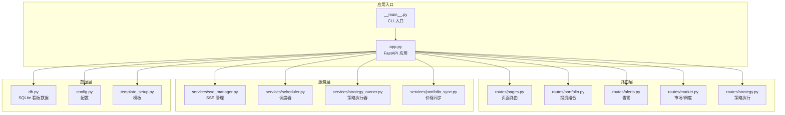
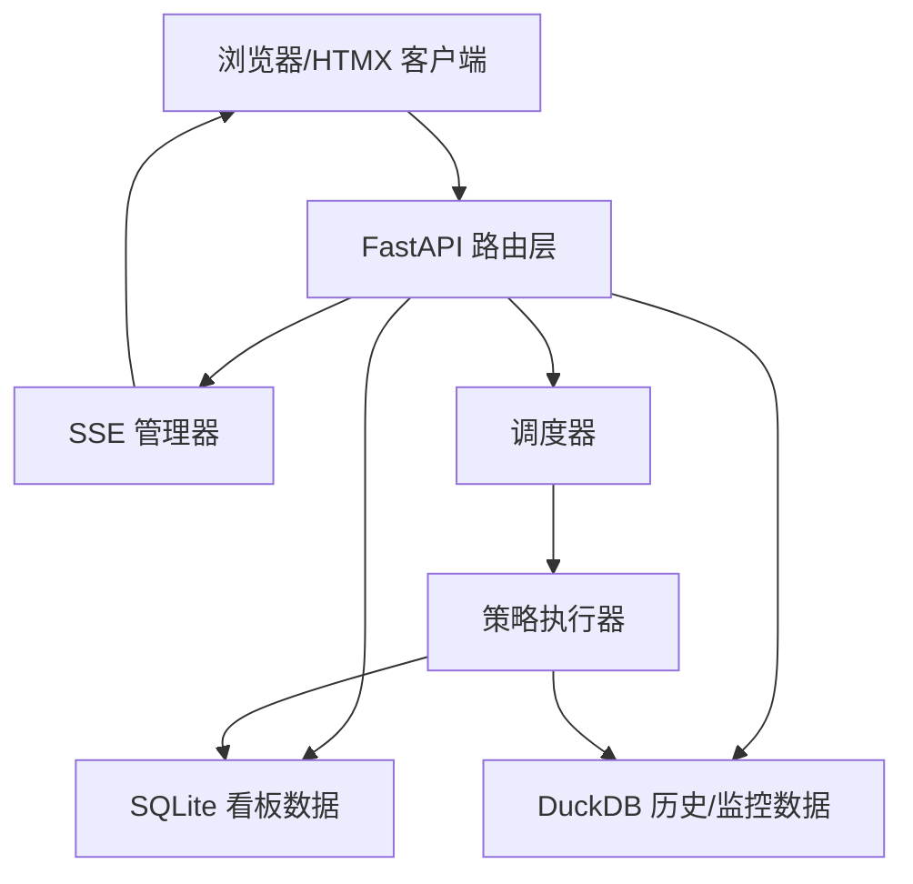
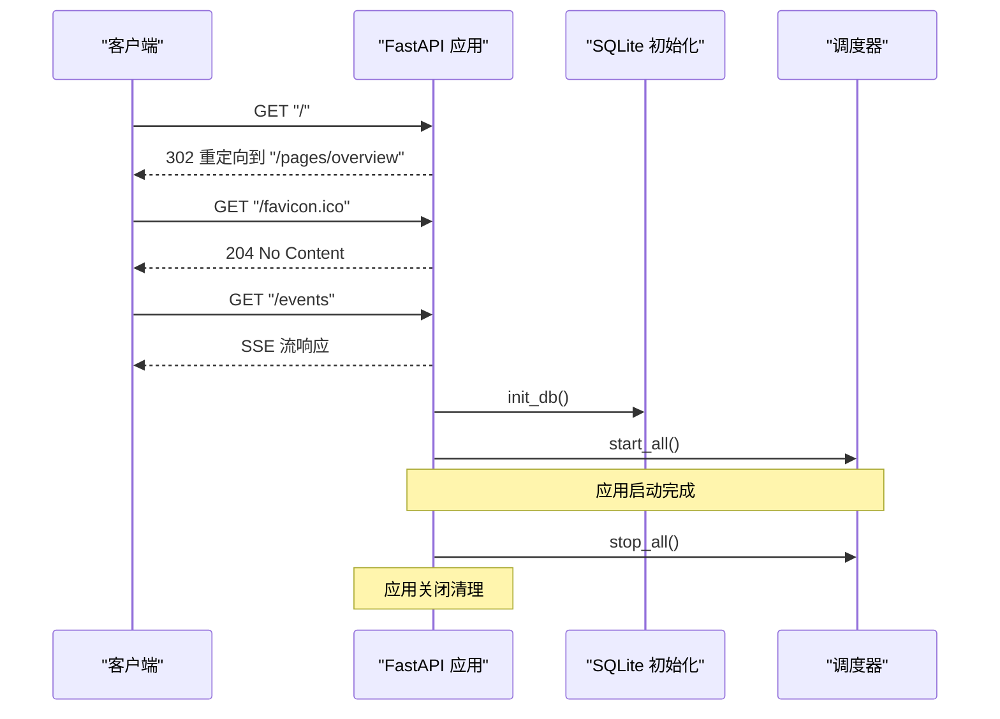
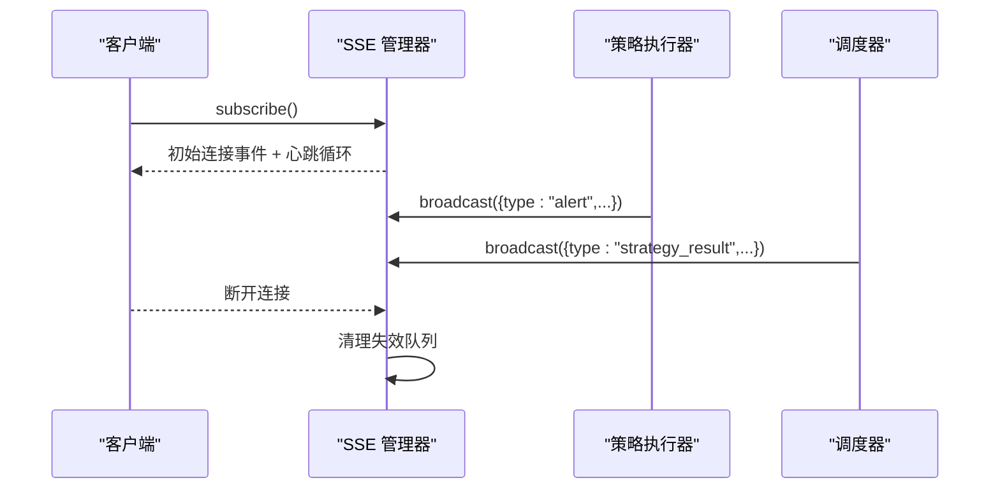
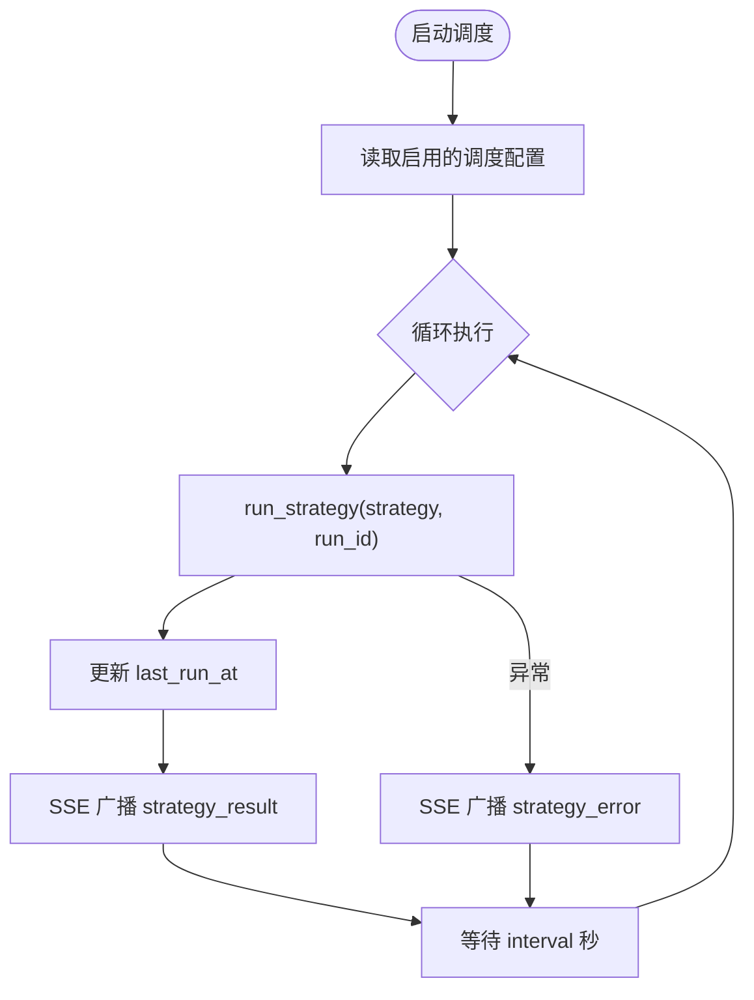
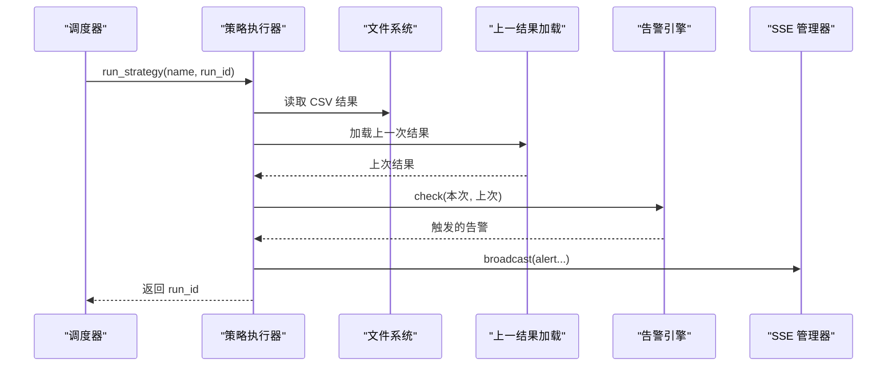
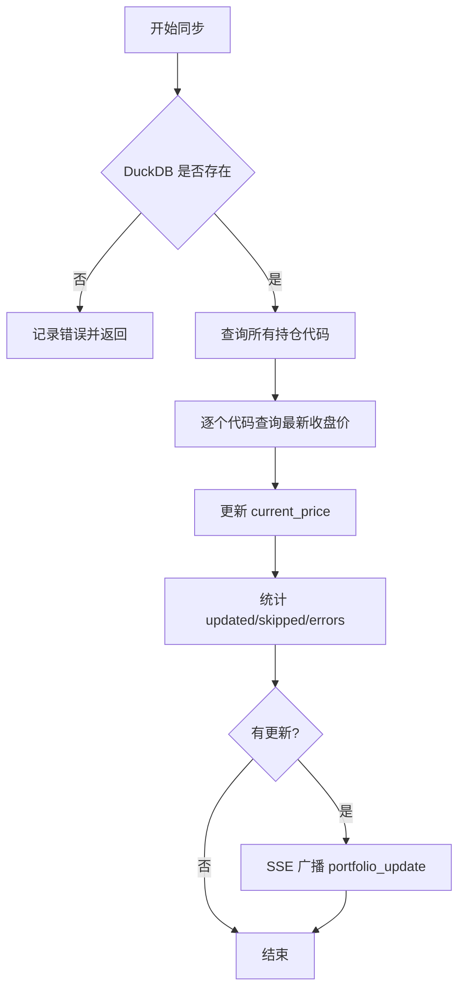
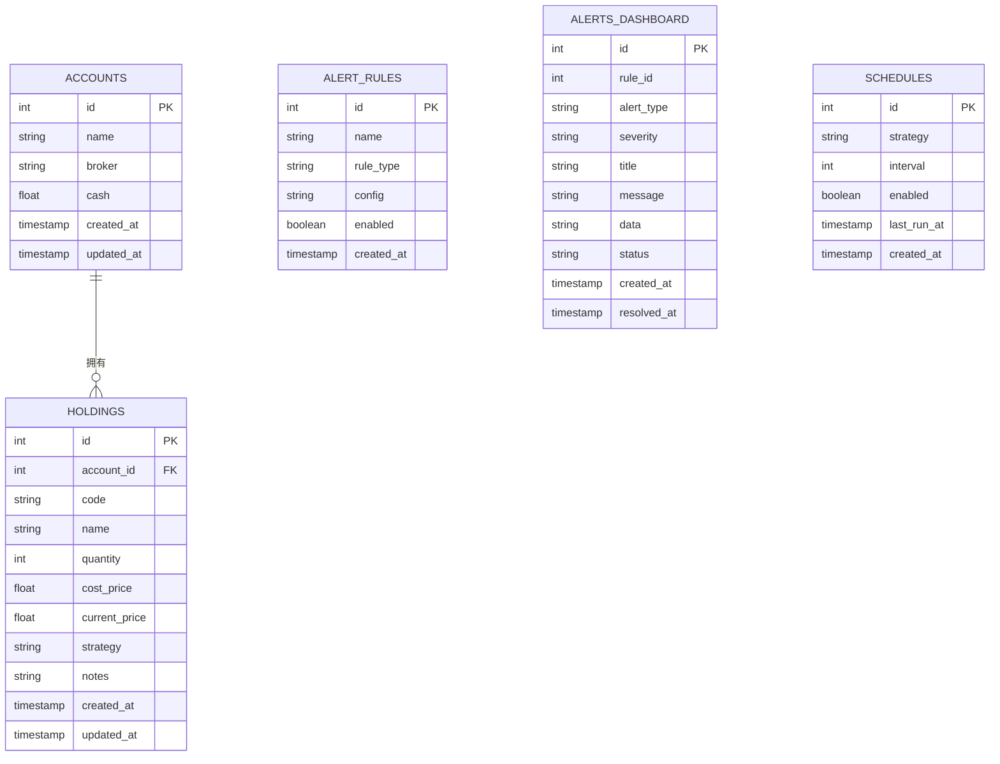
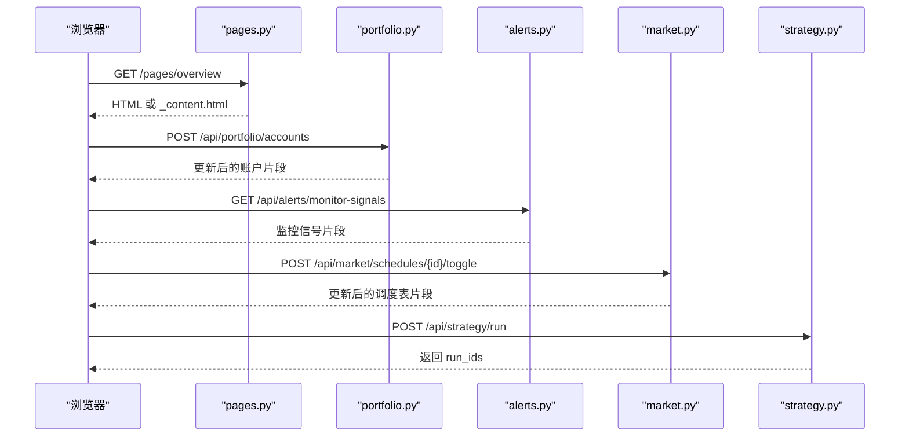
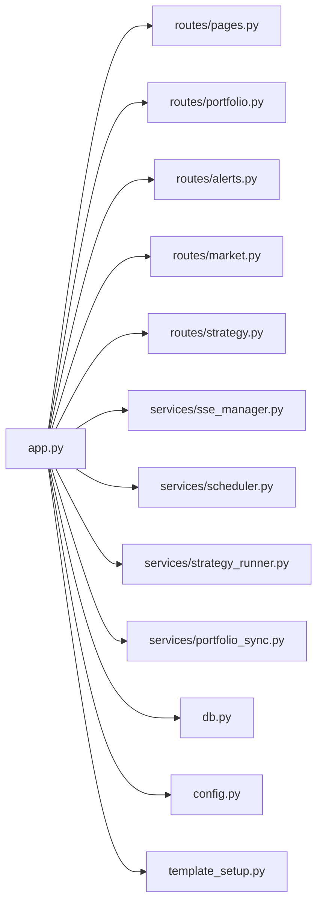

# 系统架构设计

<cite>
**本文档引用的文件**
- [src/quant_etf/dashboard/app.py](file://src/quant_etf/dashboard/app.py)
- [src/quant_etf/dashboard/__main__.py](file://src/quant_etf/dashboard/__main__.py)
- [src/quant_etf/dashboard/config.py](file://src/quant_etf/dashboard/config.py)
- [src/quant_etf/dashboard/db.py](file://src/quant_etf/dashboard/db.py)
- [src/quant_etf/dashboard/models.py](file://src/quant_etf/dashboard/models.py)
- [src/quant_etf/dashboard/template_setup.py](file://src/quant_etf/dashboard/template_setup.py)
- [src/quant_etf/dashboard/routes/pages.py](file://src/quant_etf/dashboard/routes/pages.py)
- [src/quant_etf/dashboard/routes/portfolio.py](file://src/quant_etf/dashboard/routes/portfolio.py)
- [src/quant_etf/dashboard/routes/alerts.py](file://src/quant_etf/dashboard/routes/alerts.py)
- [src/quant_etf/dashboard/routes/market.py](file://src/quant_etf/dashboard/routes/market.py)
- [src/quant_etf/dashboard/routes/strategy.py](file://src/quant_etf/dashboard/routes/strategy.py)
- [src/quant_etf/dashboard/services/sse_manager.py](file://src/quant_etf/dashboard/services/sse_manager.py)
- [src/quant_etf/dashboard/services/scheduler.py](file://src/quant_etf/dashboard/services/scheduler.py)
- [src/quant_etf/dashboard/services/strategy_runner.py](file://src/quant_etf/dashboard/services/strategy_runner.py)
- [src/quant_etf/dashboard/services/portfolio_sync.py](file://src/quant_etf/dashboard/services/portfolio_sync.py)
</cite>

## 目录
1. [引言](#引言)
2. [项目结构](#项目结构)
3. [核心组件](#核心组件)
4. [架构总览](#架构总览)
5. [详细组件分析](#详细组件分析)
6. [依赖关系分析](#依赖关系分析)
7. [性能考虑](#性能考虑)
8. [故障排查指南](#故障排查指南)
9. [结论](#结论)
10. [附录](#附录)

## 引言
本文件为 Quant-ETF Dashboard 的系统架构技术文档，围绕基于 FastAPI + HTMX + SQLite/DuckDB + SSE 的全栈架构进行深入解析。重点涵盖应用入口点、路由组织、中间件与异常处理、SSE 事件流与实时推送、数据库连接与配置管理、以及部署拓扑与可扩展性设计。文档同时提供架构决策的技术考量、性能优化策略与常见问题排查建议。

## 项目结构
系统采用模块化分层组织：
- 应用入口与生命周期：FastAPI 应用、启动/关闭钩子、SSE 端点、全局异常处理
- 路由层：按功能域划分的 APIRouter，支持页面渲染与纯 API 接口
- 服务层：SSE 管理、调度器、策略执行器、价格同步等
- 数据访问层：SQLite 看板业务数据与 DuckDB 历史/监控数据
- 配置与模板：环境变量驱动的配置、Jinja2 模板引擎

**图表来源**
- [src/quant_etf/dashboard/app.py:1-87](file://src/quant_etf/dashboard/app.py#L1-L87)
- [src/quant_etf/dashboard/__main__.py:1-8](file://src/quant_etf/dashboard/__main__.py#L1-L8)
- [src/quant_etf/dashboard/routes/pages.py:1-75](file://src/quant_etf/dashboard/routes/pages.py#L1-L75)
- [src/quant_etf/dashboard/routes/portfolio.py:1-175](file://src/quant_etf/dashboard/routes/portfolio.py#L1-L175)
- [src/quant_etf/dashboard/routes/alerts.py:1-105](file://src/quant_etf/dashboard/routes/alerts.py#L1-L105)
- [src/quant_etf/dashboard/routes/market.py:1-116](file://src/quant_etf/dashboard/routes/market.py#L1-L116)
- [src/quant_etf/dashboard/routes/strategy.py:1-53](file://src/quant_etf/dashboard/routes/strategy.py#L1-L53)
- [src/quant_etf/dashboard/services/sse_manager.py:1-45](file://src/quant_etf/dashboard/services/sse_manager.py#L1-L45)
- [src/quant_etf/dashboard/services/scheduler.py:1-82](file://src/quant_etf/dashboard/services/scheduler.py#L1-L82)
- [src/quant_etf/dashboard/services/strategy_runner.py:1-164](file://src/quant_etf/dashboard/services/strategy_runner.py#L1-L164)
- [src/quant_etf/dashboard/services/portfolio_sync.py:1-87](file://src/quant_etf/dashboard/services/portfolio_sync.py#L1-L87)
- [src/quant_etf/dashboard/db.py:1-133](file://src/quant_etf/dashboard/db.py#L1-L133)
- [src/quant_etf/dashboard/config.py:1-25](file://src/quant_etf/dashboard/config.py#L1-L25)
- [src/quant_etf/dashboard/template_setup.py:1-10](file://src/quant_etf/dashboard/template_setup.py#L1-L10)

**章节来源**
- [src/quant_etf/dashboard/app.py:1-87](file://src/quant_etf/dashboard/app.py#L1-L87)
- [src/quant_etf/dashboard/__main__.py:1-8](file://src/quant_etf/dashboard/__main__.py#L1-L8)
- [src/quant_etf/dashboard/config.py:1-25](file://src/quant_etf/dashboard/config.py#L1-L25)

## 核心组件
- 应用入口与生命周期
  - FastAPI 实例、路由挂载、根路径重定向、favicon、SSE 事件流端点
  - 启动/关闭事件：初始化数据库、启动调度器；关闭时停止调度器
  - 全局异常处理器：统一记录未处理异常并返回 JSON 错误
- 路由组织
  - 页面路由：HTMX 识别逻辑，区分完整页面与内容片段
  - 投资组合：账户与持仓的 CRUD、手动价格同步
  - 告警：规则 CRUD、仪表板告警列表、监控信号展示（DuckDB）
  - 市场/调度：市场状态、调度配置启停与列表
  - 策略：策略清单、手动执行、状态查询、结果渲染
- 服务层
  - SSE 管理：订阅/广播、心跳维持、客户端断开清理
  - 调度器：基于 asyncio 的轻量调度，周期执行策略并广播结果
  - 策略执行器：线程池执行策略任务，读取 CSV 结果并与告警引擎集成
  - 价格同步：从 DuckDB minute_bars 读取最新收盘价，更新 holdings.current_price 并广播
- 数据层
  - SQLite：看板业务数据（账户、持仓、告警规则、调度配置）
  - DuckDB：历史分钟线与监控信号，用于价格同步与告警信号展示
- 配置与模板
  - 环境变量驱动的主机/端口、SSE 心跳、阈值
  - Jinja2 模板目录分离，避免循环导入

**章节来源**
- [src/quant_etf/dashboard/app.py:17-87](file://src/quant_etf/dashboard/app.py#L17-L87)
- [src/quant_etf/dashboard/routes/pages.py:1-75](file://src/quant_etf/dashboard/routes/pages.py#L1-L75)
- [src/quant_etf/dashboard/routes/portfolio.py:1-175](file://src/quant_etf/dashboard/routes/portfolio.py#L1-L175)
- [src/quant_etf/dashboard/routes/alerts.py:1-105](file://src/quant_etf/dashboard/routes/alerts.py#L1-L105)
- [src/quant_etf/dashboard/routes/market.py:1-116](file://src/quant_etf/dashboard/routes/market.py#L1-L116)
- [src/quant_etf/dashboard/routes/strategy.py:1-53](file://src/quant_etf/dashboard/routes/strategy.py#L1-L53)
- [src/quant_etf/dashboard/services/sse_manager.py:1-45](file://src/quant_etf/dashboard/services/sse_manager.py#L1-L45)
- [src/quant_etf/dashboard/services/scheduler.py:1-82](file://src/quant_etf/dashboard/services/scheduler.py#L1-L82)
- [src/quant_etf/dashboard/services/strategy_runner.py:1-164](file://src/quant_etf/dashboard/services/strategy_runner.py#L1-L164)
- [src/quant_etf/dashboard/services/portfolio_sync.py:1-87](file://src/quant_etf/dashboard/services/portfolio_sync.py#L1-L87)
- [src/quant_etf/dashboard/db.py:1-133](file://src/quant_etf/dashboard/db.py#L1-L133)
- [src/quant_etf/dashboard/config.py:1-25](file://src/quant_etf/dashboard/config.py#L1-L25)
- [src/quant_etf/dashboard/template_setup.py:1-10](file://src/quant_etf/dashboard/template_setup.py#L1-L10)

## 架构总览
系统采用“前端 HTMX + 后端 FastAPI + 事件驱动 SSE + 多数据源”的混合架构：
- 前端：HTMX 触发局部更新，减少页面刷新；后端根据请求头判断返回完整页面或片段
- 后端：FastAPI 提供 REST API 与页面渲染；SSE 提供实时事件推送
- 数据：SQLite 存储看板业务数据，DuckDB 存储历史分钟线与监控信号
- 任务：调度器周期性触发策略执行，策略执行器在后台线程中运行，完成后通过 SSE 广播结果与告警

**图表来源**
- [src/quant_etf/dashboard/app.py:17-87](file://src/quant_etf/dashboard/app.py#L17-L87)
- [src/quant_etf/dashboard/services/sse_manager.py:1-45](file://src/quant_etf/dashboard/services/sse_manager.py#L1-L45)
- [src/quant_etf/dashboard/services/scheduler.py:1-82](file://src/quant_etf/dashboard/services/scheduler.py#L1-L82)
- [src/quant_etf/dashboard/services/strategy_runner.py:1-164](file://src/quant_etf/dashboard/services/strategy_runner.py#L1-L164)
- [src/quant_etf/dashboard/db.py:1-133](file://src/quant_etf/dashboard/db.py#L1-L133)
- [src/quant_etf/dashboard/config.py:1-25](file://src/quant_etf/dashboard/config.py#L1-L25)

## 详细组件分析

### 应用入口与生命周期（FastAPI）
- 路由挂载：页面路由与各 API 前缀路由
- 根路径重定向至总览页面，favicon 返回空内容
- SSE 端点：StreamingResponse，设置缓存控制与缓冲标志
- 启动/关闭事件：初始化 SQLite 表、启动调度器；关闭时停止所有任务
- 全局异常处理：记录错误并返回 JSON

**图表来源**
- [src/quant_etf/dashboard/app.py:27-87](file://src/quant_etf/dashboard/app.py#L27-L87)
- [src/quant_etf/dashboard/db.py:79-91](file://src/quant_etf/dashboard/db.py#L79-L91)
- [src/quant_etf/dashboard/services/scheduler.py:54-76](file://src/quant_etf/dashboard/services/scheduler.py#L54-L76)

**章节来源**
- [src/quant_etf/dashboard/app.py:17-87](file://src/quant_etf/dashboard/app.py#L17-L87)

### SSE 事件流架构
- 订阅：每个客户端建立独立队列，首次发送连接确认，随后心跳维持
- 广播：向所有队列投递消息；异常时自动清理失效队列
- 心跳：超时自动发送心跳帧，避免代理超时断开

**图表来源**
- [src/quant_etf/dashboard/services/sse_manager.py:14-41](file://src/quant_etf/dashboard/services/sse_manager.py#L14-L41)
- [src/quant_etf/dashboard/services/strategy_runner.py:80-98](file://src/quant_etf/dashboard/services/strategy_runner.py#L80-L98)
- [src/quant_etf/dashboard/services/scheduler.py:34-50](file://src/quant_etf/dashboard/services/scheduler.py#L34-L50)

**章节来源**
- [src/quant_etf/dashboard/services/sse_manager.py:1-45](file://src/quant_etf/dashboard/services/sse_manager.py#L1-L45)

### 调度器与异步任务
- 轻量调度：基于 asyncio.create_task，按间隔循环执行策略
- 生命周期：启动/停止指定调度；启动时持久化 last_run_at
- 事件广播：成功与失败均通过 SSE 广播，前端实时感知

**图表来源**
- [src/quant_etf/dashboard/services/scheduler.py:19-52](file://src/quant_etf/dashboard/services/scheduler.py#L19-L52)
- [src/quant_etf/dashboard/services/strategy_runner.py:25-125](file://src/quant_etf/dashboard/services/strategy_runner.py#L25-L125)

**章节来源**
- [src/quant_etf/dashboard/services/scheduler.py:1-82](file://src/quant_etf/dashboard/services/scheduler.py#L1-L82)

### 策略执行器与告警集成
- 线程池执行：在后台线程中调用 TaskRegistry 执行策略
- 结果读取：从 CSV 读取当日结果，过滤无效行，记录数量
- 告警对比：与上一次结果对比，触发告警并通过 SSE 广播
- 错误处理：异常状态写入运行状态，并广播错误事件

**图表来源**
- [src/quant_etf/dashboard/services/strategy_runner.py:25-125](file://src/quant_etf/dashboard/services/strategy_runner.py#L25-L125)

**章节来源**
- [src/quant_etf/dashboard/services/strategy_runner.py:1-164](file://src/quant_etf/dashboard/services/strategy_runner.py#L1-L164)

### 价格同步与实时推送
- 同步流程：遍历持仓代码，从 DuckDB minute_bars 读取最新收盘价，更新 holdings.current_price
- 统计上报：返回更新/跳过/错误计数
- 实时推送：当有更新时通过 SSE 广播 portfolio_update 事件

**图表来源**
- [src/quant_etf/dashboard/services/portfolio_sync.py:15-86](file://src/quant_etf/dashboard/services/portfolio_sync.py#L15-L86)

**章节来源**
- [src/quant_etf/dashboard/services/portfolio_sync.py:1-87](file://src/quant_etf/dashboard/services/portfolio_sync.py#L1-L87)

### 数据库与配置管理
- SQLite 看板数据：账户、持仓、告警规则、调度配置
- DuckDB 数据：历史分钟线与监控信号，用于价格同步与信号展示
- 配置项：主机/端口、SSE 心跳、阈值、元数据路径

**图表来源**
- [src/quant_etf/dashboard/db.py:11-66](file://src/quant_etf/dashboard/db.py#L11-L66)

**章节来源**
- [src/quant_etf/dashboard/db.py:1-133](file://src/quant_etf/dashboard/db.py#L1-L133)
- [src/quant_etf/dashboard/config.py:1-25](file://src/quant_etf/dashboard/config.py#L1-L25)

### 路由与页面渲染（HTMX 集成）
- 页面路由：根据请求头 hx-request 判断返回完整页面或内容片段
- 投资组合：账户与持仓 CRUD、手动价格同步接口
- 告警：规则 CRUD、仪表板告警列表、监控信号展示（DuckDB）
- 市场/调度：市场状态、调度启停与列表
- 策略：策略清单、手动执行、状态查询、结果渲染

**图表来源**
- [src/quant_etf/dashboard/routes/pages.py:40-74](file://src/quant_etf/dashboard/routes/pages.py#L40-L74)
- [src/quant_etf/dashboard/routes/portfolio.py:41-88](file://src/quant_etf/dashboard/routes/portfolio.py#L41-L88)
- [src/quant_etf/dashboard/routes/alerts.py:79-104](file://src/quant_etf/dashboard/routes/alerts.py#L79-L104)
- [src/quant_etf/dashboard/routes/market.py:97-115](file://src/quant_etf/dashboard/routes/market.py#L97-L115)
- [src/quant_etf/dashboard/routes/strategy.py:24-31](file://src/quant_etf/dashboard/routes/strategy.py#L24-L31)

**章节来源**
- [src/quant_etf/dashboard/routes/pages.py:1-75](file://src/quant_etf/dashboard/routes/pages.py#L1-L75)
- [src/quant_etf/dashboard/routes/portfolio.py:1-175](file://src/quant_etf/dashboard/routes/portfolio.py#L1-L175)
- [src/quant_etf/dashboard/routes/alerts.py:1-105](file://src/quant_etf/dashboard/routes/alerts.py#L1-L105)
- [src/quant_etf/dashboard/routes/market.py:1-116](file://src/quant_etf/dashboard/routes/market.py#L1-L116)
- [src/quant_etf/dashboard/routes/strategy.py:1-53](file://src/quant_etf/dashboard/routes/strategy.py#L1-L53)

## 依赖关系分析
- 组件耦合
  - app.py 作为中枢，依赖路由、服务、配置与模板
  - 路由层仅依赖 db 与模板，不直接依赖服务，降低耦合
  - 服务层内部通过接口松散耦合（如 sse_manager 单例）
- 外部依赖
  - FastAPI、loguru、duckdb、pandas、sqlite3
- 可能的循环依赖
  - 通过 template_setup.py 将模板配置抽离，避免 app 与 routes 循环导入

**图表来源**
- [src/quant_etf/dashboard/app.py:10-24](file://src/quant_etf/dashboard/app.py#L10-L24)
- [src/quant_etf/dashboard/routes/pages.py:1-13](file://src/quant_etf/dashboard/routes/pages.py#L1-L13)
- [src/quant_etf/dashboard/routes/portfolio.py:1-14](file://src/quant_etf/dashboard/routes/portfolio.py#L1-L14)
- [src/quant_etf/dashboard/routes/alerts.py:1-13](file://src/quant_etf/dashboard/routes/alerts.py#L1-L13)
- [src/quant_etf/dashboard/routes/market.py:1-15](file://src/quant_etf/dashboard/routes/market.py#L1-L15)
- [src/quant_etf/dashboard/routes/strategy.py:1-15](file://src/quant_etf/dashboard/routes/strategy.py#L1-L15)
- [src/quant_etf/dashboard/services/sse_manager.py:1-12](file://src/quant_etf/dashboard/services/sse_manager.py#L1-L12)
- [src/quant_etf/dashboard/services/scheduler.py:1-12](file://src/quant_etf/dashboard/services/scheduler.py#L1-L12)
- [src/quant_etf/dashboard/services/strategy_runner.py:1-18](file://src/quant_etf/dashboard/services/strategy_runner.py#L1-L18)
- [src/quant_etf/dashboard/services/portfolio_sync.py:1-12](file://src/quant_etf/dashboard/services/portfolio_sync.py#L1-L12)
- [src/quant_etf/dashboard/db.py:1-9](file://src/quant_etf/dashboard/db.py#L1-L9)
- [src/quant_etf/dashboard/config.py:1-4](file://src/quant_etf/dashboard/config.py#L1-L4)
- [src/quant_etf/dashboard/template_setup.py:1-9](file://src/quant_etf/dashboard/template_setup.py#L1-L9)

**章节来源**
- [src/quant_etf/dashboard/app.py:10-24](file://src/quant_etf/dashboard/app.py#L10-L24)

## 性能考虑
- 数据库
  - SQLite 使用 WAL 模式与外键约束，提升并发与一致性
  - 查询封装为通用方法，避免重复连接与资源泄漏
- DuckDB
  - 只读连接，避免写锁竞争；批量读取与按需过滤
- SSE
  - 心跳维持长连接，避免代理超时；广播时去重与清理失效队列
- 策略执行
  - 线程池限制并发（默认 2），避免 CPU 密集型任务阻塞事件循环
  - 异步回调通过 run_in_executor 调用，SSE 广播通过主线程安全通道
- HTMX
  - 局部更新减少传输与渲染开销；片段复用提高交互效率

[本节为通用性能指导，无需特定文件来源]

## 故障排查指南
- SSE 连接断开
  - 检查心跳是否正常；确认客户端网络代理未超时
  - 查看服务端日志中的断开清理信息
- 策略执行失败
  - 查看 run_strategy 的异常广播事件；检查策略 CSV 输出路径
  - 确认 TaskRegistry 中是否存在对应策略名
- 价格同步异常
  - 检查 DuckDB minute 数据库是否存在；确认代码映射文件是否正确
  - 关注每次同步的统计信息（updated/skipped/errors）
- 调度器未运行
  - 确认 schedules 表中 enabled 字段；查看启动日志
  - 检查 last_run_at 是否更新

**章节来源**
- [src/quant_etf/dashboard/services/sse_manager.py:28-32](file://src/quant_etf/dashboard/services/sse_manager.py#L28-L32)
- [src/quant_etf/dashboard/services/strategy_runner.py:102-121](file://src/quant_etf/dashboard/services/strategy_runner.py#L102-L121)
- [src/quant_etf/dashboard/services/portfolio_sync.py:22-25](file://src/quant_etf/dashboard/services/portfolio_sync.py#L22-L25)
- [src/quant_etf/dashboard/services/scheduler.py:54-63](file://src/quant_etf/dashboard/services/scheduler.py#L54-L63)

## 结论
该系统以 FastAPI 为核心，结合 HTMX 实现低耦合、高响应的前端体验，通过 SSE 提供实时事件推送，利用 SQLite 与 DuckDB 分治看板业务与历史/监控数据，形成清晰的数据边界与职责划分。调度器与策略执行器解耦了任务调度与业务执行，线程池与事件循环配合确保了并发与稳定性。整体架构在保证可维护性的同时，具备良好的可扩展性与部署灵活性。

[本节为总结性内容，无需特定文件来源]

## 附录
- 部署拓扑建议
  - 单机部署：Uvicorn + Nginx 反代，SSE 通过反代透传
  - 多实例部署：共享 DuckDB（只读）与 SQLite（本地或共享存储），SSE 通过反代轮询
- 环境变量
  - DASHBOARD_HOST、DASHBOARD_PORT 控制监听地址与端口
  - 数据路径与阈值通过 config.py 管理，便于不同环境差异化配置

[本节为概念性内容，无需特定文件来源]