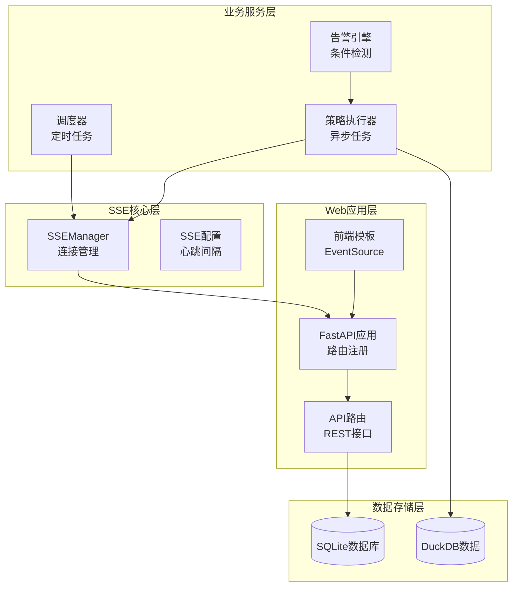
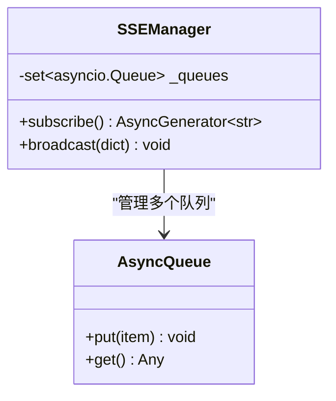
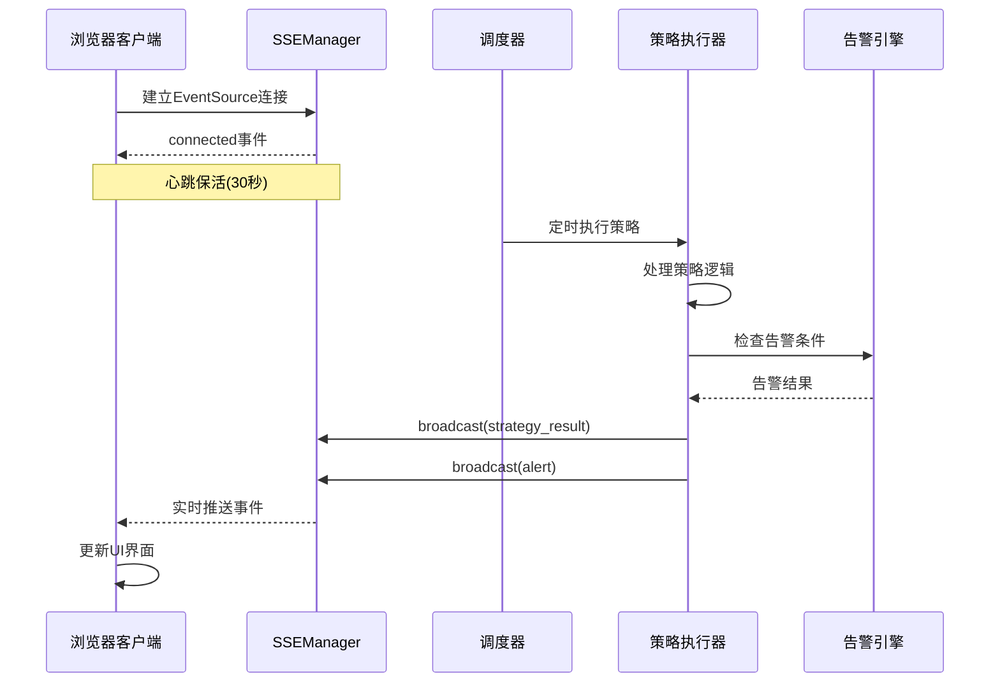
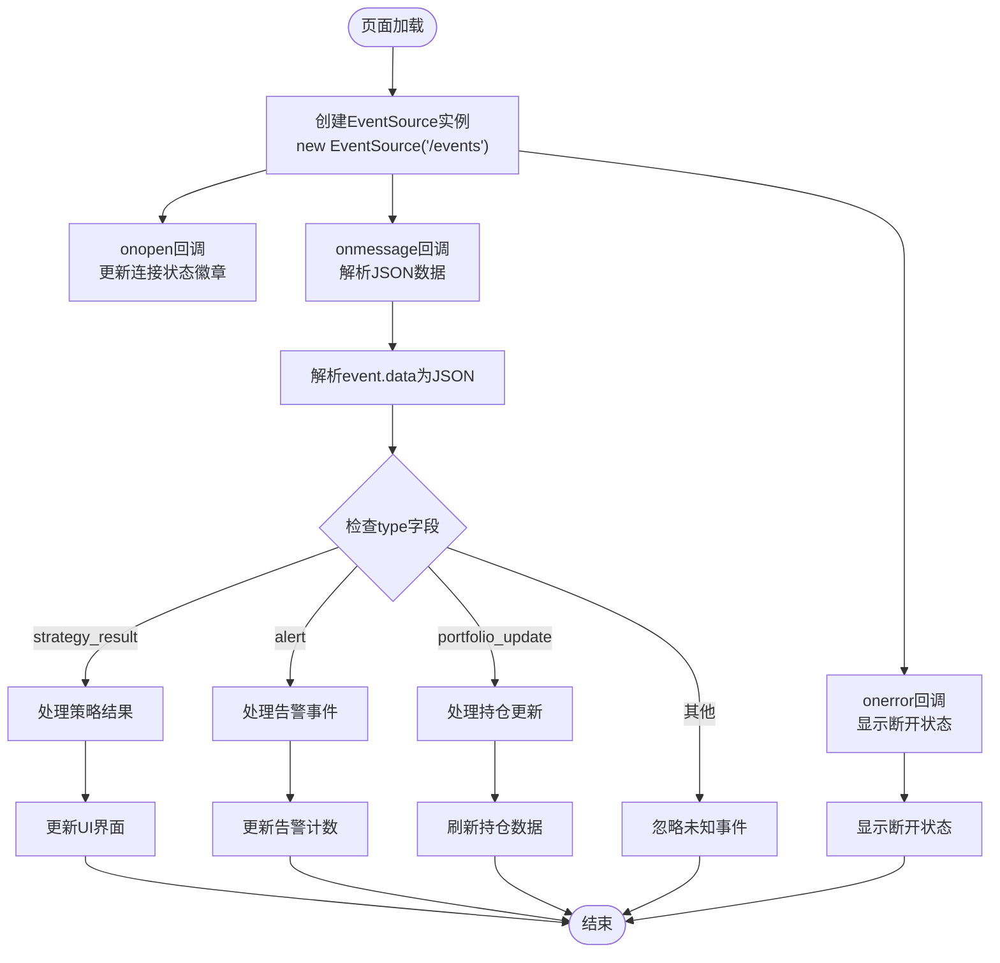
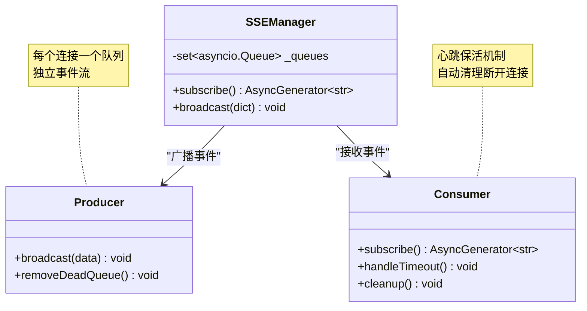
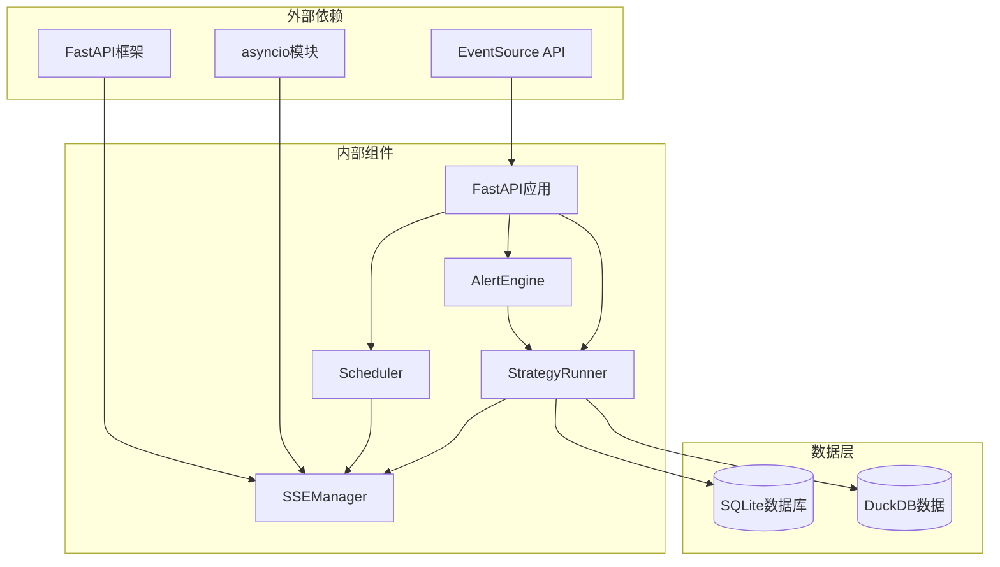

# SSE实时推送机制

<cite>
**本文档引用的文件**
- [src/quant_etf/dashboard/services/sse_manager.py](file://src/quant_etf/dashboard/services/sse_manager.py)
- [src/quant_etf/dashboard/app.py](file://src/quant_etf/dashboard/app.py)
- [src/quant_etf/dashboard/config.py](file://src/quant_etf/dashboard/config.py)
- [src/quant_etf/dashboard/services/scheduler.py](file://src/quant_etf/dashboard/services/scheduler.py)
- [src/quant_etf/dashboard/services/strategy_runner.py](file://src/quant_etf/dashboard/services/strategy_runner.py)
- [src/quant_etf/dashboard/services/alert_engine.py](file://src/quant_etf/dashboard/services/alert_engine.py)
- [src/quant_etf/dashboard/templates/base.html](file://src/quant_etf/dashboard/templates/base.html)
- [src/quant_etf/dashboard/templates/monitor/_content.html](file://src/quant_etf/dashboard/templates/monitor/_content.html)
- [src/quant_etf/dashboard/routes/alerts.py](file://src/quant_etf/dashboard/routes/alerts.py)
- [src/quant_etf/dashboard/routes/market.py](file://src/quant_etf/dashboard/routes/market.py)
- [README.md](file://README.md)
</cite>

## 目录
1. [简介](#简介)
2. [项目结构](#项目结构)
3. [核心组件](#核心组件)
4. [架构概览](#架构概览)
5. [详细组件分析](#详细组件分析)
6. [依赖关系分析](#依赖关系分析)
7. [性能考虑](#性能考虑)
8. [故障排除指南](#故障排除指南)
9. [结论](#结论)
10. [附录](#附录)

## 简介

Quant-ETF项目采用Server-Sent Events (SSE)技术实现从服务端到浏览器的实时事件推送。该机制相比WebSocket具有实现简单、资源占用低、自动重连等优势，特别适合本项目的数据推送场景。

SSE机制的核心价值在于：
- **简化实现**：无需复杂的双向通信协议
- **自动保活**：内置心跳机制防止连接中断
- **浏览器原生支持**：EventSource API提供标准接口
- **资源友好**：单向数据流，内存占用低

## 项目结构

基于SSE实时推送机制的相关文件组织如下：

**图表来源**
- [src/quant_etf/dashboard/services/sse_manager.py:1-45](file://src/quant_etf/dashboard/services/sse_manager.py#L1-L45)
- [src/quant_etf/dashboard/app.py:1-107](file://src/quant_etf/dashboard/app.py#L1-L107)

**章节来源**
- [src/quant_etf/dashboard/services/sse_manager.py:1-45](file://src/quant_etf/dashboard/services/sse_manager.py#L1-L45)
- [src/quant_etf/dashboard/app.py:1-107](file://src/quant_etf/dashboard/app.py#L1-L107)

## 核心组件

### SSEManager连接管理器

SSEManager是整个实时推送系统的核心组件，负责维护客户端连接和事件广播。

**主要特性：**
- **连接池管理**：使用asyncio.Queue集合跟踪所有活跃连接
- **事件队列**：为每个客户端创建独立的事件队列
- **自动清理**：连接断开时自动移除队列
- **心跳保活**：定期发送心跳信号维持连接

**关键实现模式：**

**图表来源**
- [src/quant_etf/dashboard/services/sse_manager.py:10-45](file://src/quant_etf/dashboard/services/sse_manager.py#L10-L45)

**章节来源**
- [src/quant_etf/dashboard/services/sse_manager.py:10-45](file://src/quant_etf/dashboard/services/sse_manager.py#L10-L45)

### FastAPI应用集成

应用通过StreamingResponse实现SSE端点，提供标准的HTTP接口。

**核心功能：**
- **SSE端点**：/events路由返回text/event-stream响应
- **头部设置**：禁用缓存，保持连接，禁用缓冲
- **优雅关闭**：应用生命周期管理

**章节来源**
- [src/quant_etf/dashboard/app.py:39-50](file://src/quant_etf/dashboard/app.py#L39-L50)

## 架构概览

SSE实时推送系统的整体架构采用事件驱动模式：

**图表来源**
- [src/quant_etf/dashboard/services/sse_manager.py:14-32](file://src/quant_etf/dashboard/services/sse_manager.py#L14-L32)
- [src/quant_etf/dashboard/services/scheduler.py:19-52](file://src/quant_etf/dashboard/services/scheduler.py#L19-L52)
- [src/quant_etf/dashboard/services/strategy_runner.py:25-125](file://src/quant_etf/dashboard/services/strategy_runner.py#L25-L125)

## 详细组件分析

### 实时事件类型定义

系统定义了多种实时事件类型，每种事件都有特定的触发场景和数据结构：

| 事件类型 | 触发场景 | 数据字段 | 推送方 |
|---------|---------|---------|--------|
| `connected` | 客户端初次连接 | `{type: "connected", message: "SSE connected"}` | sse_manager |
| `strategy_result` | 策略执行完成 | `{type, schedule_id, strategy, run_id, timestamp}` | scheduler/strategy_runner |
| `strategy_error` | 策略执行失败 | `{type, run_id, strategy, error, timestamp}` | scheduler/strategy_runner |
| `alert` | 新告警产生 | `{type, alert_type, severity, title, message, strategy, run_id, timestamp}` | strategy_runner |
| `portfolio_update` | 持仓更新 | `{type, action, data, timestamp}` | portfolio_sync |

**事件格式规范：**
- **消息结构**：JSON对象，包含type字段标识事件类型
- **序列化方式**：使用JSON编码，确保跨平台兼容性
- **传输格式**：SSE标准格式，每条消息以`\n\n`结尾

**章节来源**
- [README.md:445-454](file://README.md#L445-L454)
- [src/quant_etf/dashboard/services/scheduler.py:34-50](file://src/quant_etf/dashboard/services/scheduler.py#L34-L50)
- [src/quant_etf/dashboard/services/strategy_runner.py:80-98](file://src/quant_etf/dashboard/services/strategy_runner.py#L80-L98)

### 客户端连接建立与管理

浏览器端使用原生EventSource API实现SSE连接：

**图表来源**
- [src/quant_etf/dashboard/templates/base.html:119-143](file://src/quant_etf/dashboard/templates/base.html#L119-L143)

**章节来源**
- [src/quant_etf/dashboard/templates/base.html:119-143](file://src/quant_etf/dashboard/templates/base.html#L119-L143)

### 心跳检测与断线重连机制

系统实现了多层次的心跳和重连机制：

**服务端心跳：**
- **心跳间隔**：30秒
- **心跳信号**：SSE注释行格式 `: heartbeat`
- **保活机制**：超时未收到数据时发送心跳

**客户端重连：**
- **自动重连**：EventSource API自动处理重连
- **状态指示**：实时显示连接状态（已连接/已断开）
- **错误处理**：网络异常时自动重试

**章节来源**
- [src/quant_etf/dashboard/services/sse_manager.py:23-27](file://src/quant_etf/dashboard/services/sse_manager.py#L23-L27)
- [src/quant_etf/dashboard/config.py:20-22](file://src/quant_etf/dashboard/config.py#L20-L22)

### 事件队列与消息分发机制

SSEManager采用生产者-消费者模式实现高效的消息分发：

**图表来源**
- [src/quant_etf/dashboard/services/sse_manager.py:14-41](file://src/quant_etf/dashboard/services/sse_manager.py#L14-L41)

**消息分发流程：**
1. **生产者广播**：调用broadcast方法向所有队列发送事件
2. **队列存储**：每个客户端队列存储待发送事件
3. **消费者拉取**：客户端从队列获取事件数据
4. **自动清理**：断开连接时自动移除队列

**章节来源**
- [src/quant_etf/dashboard/services/sse_manager.py:34-41](file://src/quant_etf/dashboard/services/sse_manager.py#L34-L41)

### 并发连接处理与内存管理

系统采用异步编程模型处理高并发连接：

**并发模型：**
- **异步I/O**：使用asyncio实现非阻塞I/O操作
- **队列隔离**：每个连接独立队列，避免相互影响
- **内存控制**：连接断开时自动释放队列资源

**性能优化：**
- **批量广播**：使用集合进行批量队列遍历
- **异常容错**：单个队列异常不影响其他连接
- **资源清理**：finally块确保队列正确移除

**章节来源**
- [src/quant_etf/dashboard/services/sse_manager.py:36-40](file://src/quant_etf/dashboard/services/sse_manager.py#L36-L40)

## 依赖关系分析

SSE实时推送机制的组件依赖关系如下：

**图表来源**
- [src/quant_etf/dashboard/app.py:13-24](file://src/quant_etf/dashboard/app.py#L13-L24)
- [src/quant_etf/dashboard/services/scheduler.py:10-12](file://src/quant_etf/dashboard/services/scheduler.py#L10-L12)

**依赖特点：**
- **松耦合设计**：各组件通过接口交互，降低耦合度
- **单向依赖**：业务组件依赖SSEManager，但SSEManager不依赖业务组件
- **异步解耦**：使用异步模式实现非阻塞通信

**章节来源**
- [src/quant_etf/dashboard/app.py:13-24](file://src/quant_etf/dashboard/app.py#L13-L24)
- [src/quant_etf/dashboard/services/scheduler.py:10-12](file://src/quant_etf/dashboard/services/scheduler.py#L10-L12)

## 性能考虑

### 传输优化策略

**消息压缩：**
- 使用JSON格式传输，体积小，解析快
- 避免冗余字段，只传输必要信息

**连接优化：**
- 心跳间隔30秒，平衡保活和带宽
- 自动断线清理，释放内存资源

**并发优化：**
- 异步I/O模型，支持大量并发连接
- 队列隔离，避免相互影响

### 内存管理

**资源回收：**
- 连接断开时自动移除队列
- 使用弱引用避免循环引用
- 及时清理异常队列

**内存监控：**
- 监控队列长度，防止内存泄漏
- 连接数量上限控制
- 定期清理僵尸连接

## 故障排除指南

### 常见问题诊断

**连接无法建立：**
1. 检查SSE端点是否可达：`curl http://localhost:8522/events`
2. 验证CORS配置是否正确
3. 确认防火墙允许8522端口

**事件不更新：**
1. 检查调度器是否正常运行
2. 验证策略执行是否成功
3. 确认告警引擎配置正确

**内存占用过高：**
1. 检查连接数量是否异常增长
2. 验证队列清理机制是否正常
3. 监控异常队列情况

### 错误处理机制

**服务端错误处理：**
- 异常捕获和日志记录
- 连接异常自动清理
- 广播异常不影响其他连接

**客户端错误处理：**
- EventSource自动重连
- 连接状态实时显示
- 用户友好的错误提示

**章节来源**
- [src/quant_etf/dashboard/services/sse_manager.py:28-32](file://src/quant_etf/dashboard/services/sse_manager.py#L28-L32)
- [src/quant_etf/dashboard/templates/base.html:135-142](file://src/quant_etf/dashboard/templates/base.html#L135-L142)

## 结论

Quant-ETF项目的SSE实时推送机制通过简洁高效的架构实现了稳定可靠的实时数据推送。相比WebSocket，SSE具有实现简单、资源占用低、自动保活等优势，非常适合本项目的监控和告警场景。

**核心优势：**
- **实现简单**：基于标准EventSource API，无需复杂协议
- **性能优异**：异步I/O模型支持高并发连接
- **维护成本低**：代码简洁，易于理解和维护
- **扩展性强**：模块化设计便于功能扩展

**应用场景：**
- 实时监控面板数据更新
- 策略执行状态通知
- 告警事件推送
- 系统状态实时展示

## 附录

### 前端开发者集成指南

**基础集成步骤：**
1. 创建EventSource实例：`const evtSource = new EventSource('/events')`
2. 处理连接事件：监听onopen/onerror回调
3. 处理消息事件：解析event.data为JSON对象
4. 更新UI界面：根据事件类型更新相应组件

**最佳实践：**
- 实现自动重连机制
- 添加连接状态指示器
- 处理网络异常情况
- 优化消息解析性能

**浏览器兼容性：**
- 现代浏览器均支持EventSource API
- IE需要polyfill支持
- 移动端兼容性良好

**章节来源**
- [src/quant_etf/dashboard/templates/base.html:119-143](file://src/quant_etf/dashboard/templates/base.html#L119-L143)