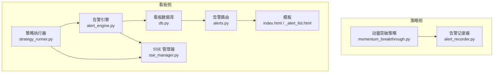
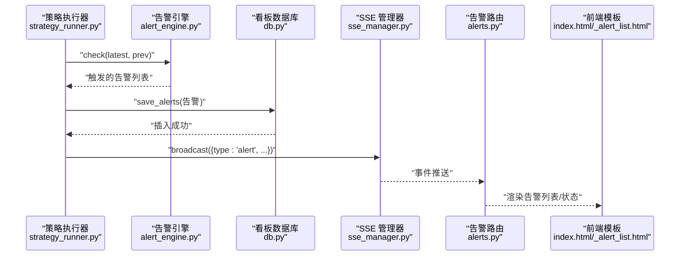
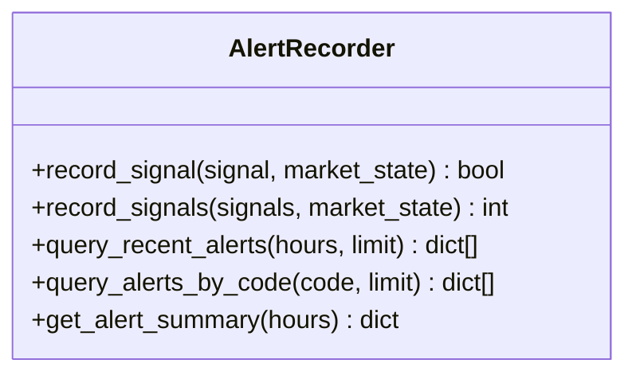
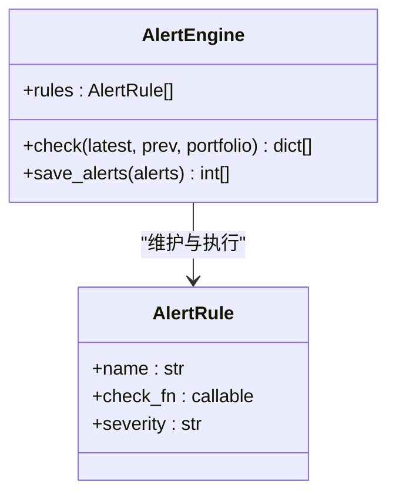
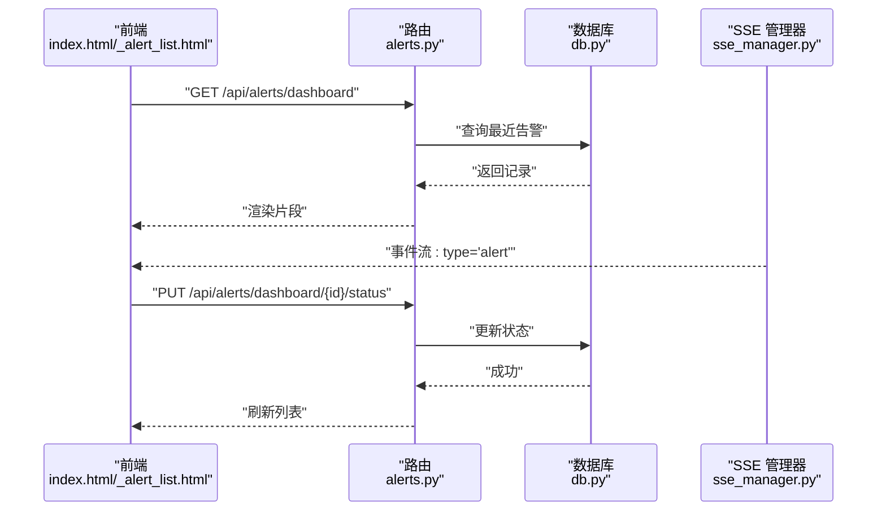
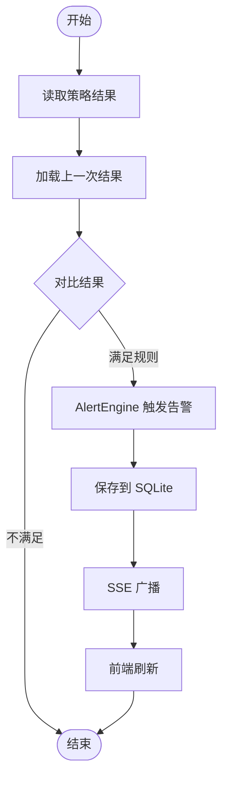
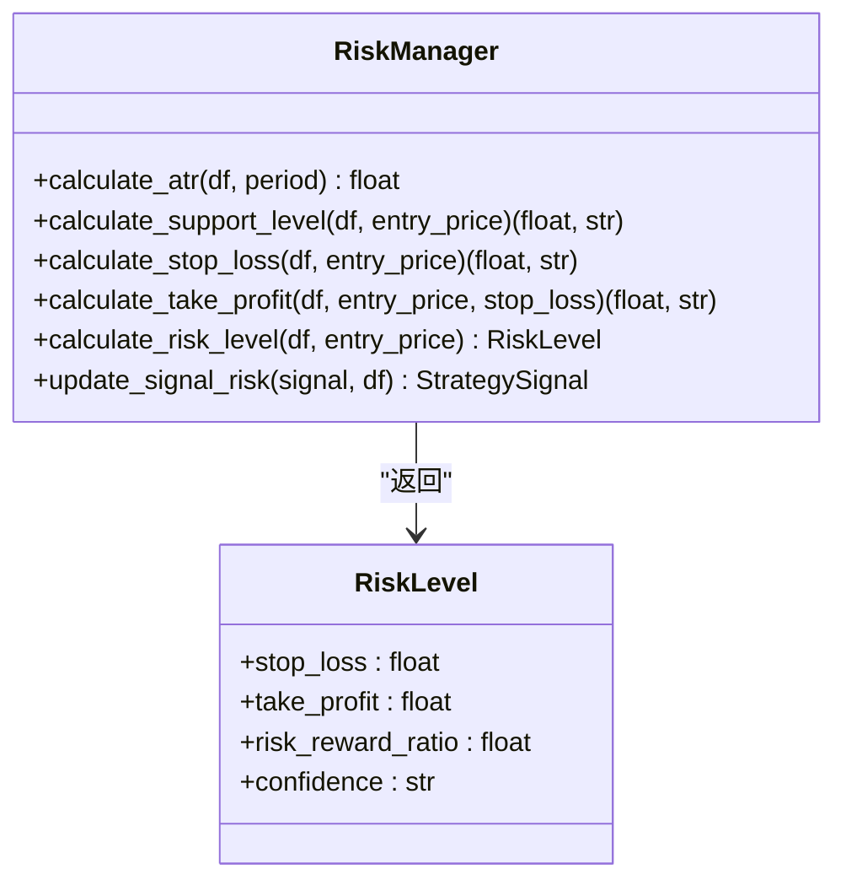
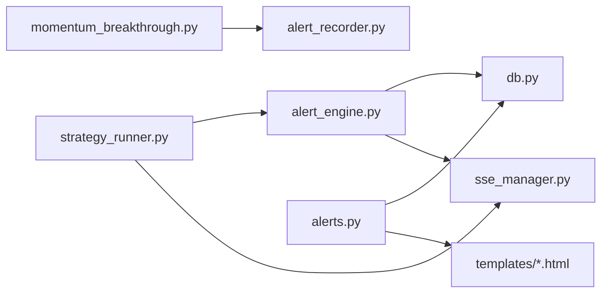

# 告警引擎

<cite>
**本文引用的文件**
- [alert_recorder.py](file://src/quant_etf/alert_recorder.py)
- [alert_engine.py](file://src/quant_etf/dashboard/services/alert_engine.py)
- [risk_manager.py](file://src/quant_etf/risk_manager.py)
- [alerts.py](file://src/quant_etf/dashboard/routes/alerts.py)
- [models.py](file://src/quant_etf/dashboard/models.py)
- [db.py](file://src/quant_etf/dashboard/db.py)
- [index.html](file://src/quant_etf/dashboard/templates/alerts/index.html)
- [_alert_list.html](file://src/quant_etf/dashboard/templates/alerts/_alert_list.html)
- [app.py](file://src/quant_etf/dashboard/app.py)
- [config.py](file://src/quant_etf/dashboard/config.py)
- [sse_manager.py](file://src/quant_etf/dashboard/services/sse_manager.py)
- [scheduler.py](file://src/quant_etf/dashboard/services/scheduler.py)
- [strategy_runner.py](file://src/quant_etf/dashboard/services/strategy_runner.py)
- [momentum_breakthrough.py](file://src/quant_etf/strategies/momentum_breakthrough.py)
</cite>

## 目录
1. [简介](#简介)
2. [项目结构](#项目结构)
3. [核心组件](#核心组件)
4. [架构总览](#架构总览)
5. [详细组件分析](#详细组件分析)
6. [依赖关系分析](#依赖关系分析)
7. [性能考量](#性能考量)
8. [故障排查指南](#故障排查指南)
9. [结论](#结论)
10. [附录](#附录)

## 简介
本文件为 Quant-ETF 的告警引擎提供系统化技术文档，覆盖两级告警体系的设计与实现：策略信号告警与风险控制告警；详解 AlertRecorder 的记录机制（类型分类、优先级管理、持久化）、Dashboard 告警机制与策略引擎的集成（触发条件、内容格式、状态管理）、告警规则配置与阈值设定、告警抑制策略、统计分析与历史查询、趋势分析，以及面向运维的配置管理、通知渠道与处理流程。

## 项目结构
告警相关能力由两条主线构成：
- 策略侧：策略信号生成后经 AlertRecorder 写入 DuckDB，支持查询与统计。
- 看板侧：策略执行后由 AlertEngine 对比前后结果触发 Dashboard 告警，写入 SQLite，并通过 SSE 推送给前端。

图表来源
- [momentum_breakthrough.py](file://src/quant_etf/strategies/momentum_breakthrough.py)
- [alert_recorder.py](file://src/quant_etf/alert_recorder.py)
- [strategy_runner.py](file://src/quant_etf/dashboard/services/strategy_runner.py)
- [alert_engine.py](file://src/quant_etf/dashboard/services/alert_engine.py)
- [db.py](file://src/quant_etf/dashboard/db.py)
- [alerts.py](file://src/quant_etf/dashboard/routes/alerts.py)
- [index.html](file://src/quant_etf/dashboard/templates/alerts/index.html)
- [_alert_list.html](file://src/quant_etf/dashboard/templates/alerts/_alert_list.html)
- [sse_manager.py](file://src/quant_etf/dashboard/services/sse_manager.py)

章节来源
- [app.py:17-25](file://src/quant_etf/dashboard/app.py#L17-L25)
- [config.py:1-25](file://src/quant_etf/dashboard/config.py#L1-L25)

## 核心组件
- AlertRecorder：负责将策略信号写入 DuckDB，提供批量记录、按时间/代码查询、统计摘要等能力。
- AlertEngine：基于策略结果对比的 Dashboard 告警引擎，内置规则（评分进入前三、动量得分突变、持仓偏离目标），支持保存告警至 SQLite。
- 策略执行器与 SSE：策略执行完成后对比前后结果，触发告警并通过 SSE 推送。
- Dashboard 数据库与路由：维护告警规则、状态与统计接口，提供前端模板渲染与交互。

章节来源
- [alert_recorder.py:78-233](file://src/quant_etf/alert_recorder.py#L78-L233)
- [alert_engine.py:20-120](file://src/quant_etf/dashboard/services/alert_engine.py#L20-L120)
- [strategy_runner.py:25-164](file://src/quant_etf/dashboard/services/strategy_runner.py#L25-L164)
- [db.py:36-66](file://src/quant_etf/dashboard/db.py#L36-L66)
- [alerts.py:1-105](file://src/quant_etf/dashboard/routes/alerts.py#L1-L105)

## 架构总览
告警引擎采用“策略侧记录 + 看板侧规则”的双轨设计：
- 策略侧：策略生成信号 → AlertRecorder 写入 DuckDB → 可视化与历史查询。
- 看板侧：策略执行 → 对比前后结果 → AlertEngine 规则检测 → 写入 SQLite → SSE 推送 → 前端展示与状态管理。

图表来源
- [strategy_runner.py:72-101](file://src/quant_etf/dashboard/services/strategy_runner.py#L72-L101)
- [alert_engine.py:82-116](file://src/quant_etf/dashboard/services/alert_engine.py#L82-L116)
- [db.py:45-56](file://src/quant_etf/dashboard/db.py#L45-L56)
- [sse_manager.py:34-41](file://src/quant_etf/dashboard/services/sse_manager.py#L34-L41)
- [alerts.py:39-77](file://src/quant_etf/dashboard/routes/alerts.py#L39-L77)
- [index.html:34-51](file://src/quant_etf/dashboard/templates/alerts/index.html#L34-L51)
- [_alert_list.html:16-65](file://src/quant_etf/dashboard/templates/alerts/_alert_list.html#L16-L65)

## 详细组件分析

### AlertRecorder（策略信号告警记录器）
- 设计理念
  - 将策略信号与市场状态持久化，便于回溯、统计与可视化。
  - 使用 DuckDB 存储，具备 SQL 查询与索引能力，适合高频写入与简单聚合。
- 关键能力
  - 单条/批量记录：record_signal、record_signals。
  - 查询：按时间窗口查询最近告警、按代码查询历史告警。
  - 统计：获取最近时段的告警总量、唯一代码数、平均分数、买卖信号分布。
- 数据模型要点
  - 字段覆盖时间、标的、策略名、信号类型、方向、打分、入场/止损/止盈、原因、市场状态与指标等。
  - 建立时间与代码索引以优化查询。
- 错误处理
  - 写入与查询异常均记录日志并返回安全结果。

图表来源
- [alert_recorder.py:78-233](file://src/quant_etf/alert_recorder.py#L78-L233)

章节来源
- [alert_recorder.py:18-233](file://src/quant_etf/alert_recorder.py#L18-L233)

### AlertEngine（Dashboard 告警引擎）
- 设计理念
  - 基于策略结果的规则引擎，对“评分前三进入”“动量得分突变”“持仓偏离目标”等进行检测。
  - 告警包含标题、消息、严重级别与附加数据，统一写入 SQLite。
- 规则与阈值
  - 动量突变阈值：默认 15%（可配置）。
  - 评分前三：比较最新与上一次结果的前三集合差集。
- 保存与推送
  - save_alerts 将告警写入 alerts_dashboard 表。
  - 策略执行器通过 SSE 广播告警事件，前端自动刷新。

图表来源
- [alert_engine.py:13-120](file://src/quant_etf/dashboard/services/alert_engine.py#L13-L120)

章节来源
- [alert_engine.py:20-120](file://src/quant_etf/dashboard/services/alert_engine.py#L20-L120)
- [config.py:23-25](file://src/quant_etf/dashboard/config.py#L23-L25)

### Dashboard 告警与前端集成
- 数据库表结构
  - alert_rules：规则定义（名称、类型、配置、启用状态）。
  - alerts_dashboard：告警实体（规则ID、类型、严重级别、标题、消息、数据、状态、时间戳）。
- 路由与模板
  - 列出规则、创建/删除规则。
  - 告警列表片段、状态更新（active/acknowledged/resolved）。
  - 统计接口返回总数与活跃数。
  - 前端模板支持过滤与 HTMX 自动刷新。
- SSE 推送
  - 策略执行与告警触发均通过 SSE 广播，前端实时接收。

图表来源
- [alerts.py:16-77](file://src/quant_etf/dashboard/routes/alerts.py#L16-L77)
- [db.py:36-66](file://src/quant_etf/dashboard/db.py#L36-L66)
- [index.html:34-51](file://src/quant_etf/dashboard/templates/alerts/index.html#L34-L51)
- [_alert_list.html:16-65](file://src/quant_etf/dashboard/templates/alerts/_alert_list.html#L16-L65)
- [sse_manager.py:34-41](file://src/quant_etf/dashboard/services/sse_manager.py#L34-L41)

章节来源
- [db.py:36-66](file://src/quant_etf/dashboard/db.py#L36-L66)
- [alerts.py:16-105](file://src/quant_etf/dashboard/routes/alerts.py#L16-L105)
- [index.html:1-77](file://src/quant_etf/dashboard/templates/alerts/index.html#L1-L77)
- [_alert_list.html:1-69](file://src/quant_etf/dashboard/templates/alerts/_alert_list.html#L1-L69)
- [sse_manager.py:10-45](file://src/quant_etf/dashboard/services/sse_manager.py#L10-L45)

### 策略执行与告警触发流程
- 流程概览
  - 策略执行器读取 CSV 结果，对比上一次结果。
  - 若满足规则，AlertEngine 生成告警并保存，同时通过 SSE 广播。
- 抑制策略
  - 通过规则函数返回 None 抑制告警；当前“持仓偏离目标”为占位，返回 None。
- 集成点
  - 与 SSE 管理器解耦，通过事件广播实现前端实时更新。

图表来源
- [strategy_runner.py:72-101](file://src/quant_etf/dashboard/services/strategy_runner.py#L72-L101)
- [alert_engine.py:82-96](file://src/quant_etf/dashboard/services/alert_engine.py#L82-L96)

章节来源
- [strategy_runner.py:25-164](file://src/quant_etf/dashboard/services/strategy_runner.py#L25-L164)
- [alert_engine.py:20-120](file://src/quant_etf/dashboard/services/alert_engine.py#L20-L120)

### 风险控制告警与优先级管理
- 风险计算
  - 基于 ATR、均线与近期低点计算止损位与止盈位，输出风险级别与置信度。
  - 与策略信号结合，更新 StrategySignal 的止损/止盈字段。
- 优先级与严重级别
  - Dashboard 告警的严重级别（info/warning/danger）用于前端展示与筛选。
  - 策略侧未直接定义“优先级”，可通过告警严重级别与规则类型进行区分。

图表来源
- [risk_manager.py:26-185](file://src/quant_etf/risk_manager.py#L26-L185)
- [momentum_breakthrough.py:25-44](file://src/quant_etf/strategies/momentum_breakthrough.py#L25-L44)

章节来源
- [risk_manager.py:26-185](file://src/quant_etf/risk_manager.py#L26-L185)
- [momentum_breakthrough.py:25-44](file://src/quant_etf/strategies/momentum_breakthrough.py#L25-L44)

## 依赖关系分析
- 组件耦合
  - AlertRecorder 与策略信号类（StrategySignal）强耦合，依赖市场分析模块。
  - AlertEngine 与策略执行器通过结果对比耦合，通过 SSE 松耦合。
  - Dashboard 路由依赖数据库层与模板层，SSE 管理器独立。
- 外部依赖
  - DuckDB 用于策略侧信号持久化。
  - SQLite 用于看板侧规则与告警持久化。
  - FastAPI/SSE/HTMX 用于接口与前端交互。

图表来源
- [momentum_breakthrough.py:1-187](file://src/quant_etf/strategies/momentum_breakthrough.py#L1-L187)
- [alert_recorder.py:1-233](file://src/quant_etf/alert_recorder.py#L1-L233)
- [strategy_runner.py:1-164](file://src/quant_etf/dashboard/services/strategy_runner.py#L1-L164)
- [alert_engine.py:1-120](file://src/quant_etf/dashboard/services/alert_engine.py#L1-L120)
- [db.py:1-133](file://src/quant_etf/dashboard/db.py#L1-L133)
- [alerts.py:1-105](file://src/quant_etf/dashboard/routes/alerts.py#L1-L105)
- [index.html:1-77](file://src/quant_etf/dashboard/templates/alerts/index.html#L1-L77)
- [_alert_list.html:1-69](file://src/quant_etf/dashboard/templates/alerts/_alert_list.html#L1-L69)
- [sse_manager.py:1-45](file://src/quant_etf/dashboard/services/sse_manager.py#L1-L45)

章节来源
- [app.py:17-25](file://src/quant_etf/dashboard/app.py#L17-L25)
- [scheduler.py:1-82](file://src/quant_etf/dashboard/services/scheduler.py#L1-L82)

## 性能考量
- DuckDB 写入
  - 批量记录（record_signals）优于逐条写入，建议在策略侧合并信号后一次性入库。
  - 建议定期归档历史数据，避免 alerts 表无限增长。
- SQLite 写入
  - 告警写入频率较低，使用 WAL 模式与外键约束保证一致性。
- 查询优化
  - 按时间与代码建立索引，合理设置 limit 与时间窗口。
- SSE 广播
  - 心跳保活避免连接中断，广播失败需清理队列防止内存泄漏。

## 故障排查指南
- 策略侧告警未入库
  - 检查 DuckDB 文件路径与权限，确认初始化成功。
  - 查看记录返回值与异常日志。
- 看板侧告警未显示
  - 确认策略执行器已调用 AlertEngine 并保存成功。
  - 检查 SSE 广播是否正常，前端是否订阅事件流。
  - 核对路由与模板渲染逻辑，确认状态更新接口可用。
- 阈值与规则问题
  - 动量突变阈值可在配置中调整。
  - 规则函数内部异常会被捕获并记录警告，检查日志定位问题。

章节来源
- [alert_recorder.py:94-128](file://src/quant_etf/alert_recorder.py#L94-L128)
- [alert_engine.py:30-96](file://src/quant_etf/dashboard/services/alert_engine.py#L30-L96)
- [alerts.py:55-68](file://src/quant_etf/dashboard/routes/alerts.py#L55-L68)
- [config.py:23-25](file://src/quant_etf/dashboard/config.py#L23-L25)

## 结论
该告警引擎通过“策略侧记录 + 看板侧规则”的双轨设计，实现了从信号生成到告警展示的完整闭环。策略侧侧重历史与统计，看板侧强调实时与交互。通过 DuckDB 与 SQLite 的组合、SSE 的事件推送以及清晰的规则与状态管理，系统具备良好的扩展性与可运维性。

## 附录

### 告警规则配置与阈值设置
- 规则管理
  - 创建/删除规则：通过 /api/alerts/rules 接口。
  - 规则类型：top3_entry、momentum_shock、position_deviation。
- 阈值设置
  - 动量突变阈值：ALERT_MOMENTUM_SHOCK_THRESHOLD（默认 15%）。
- 配置示例（概念性）
  - 规则配置字段为 JSON 字符串，可扩展参数如窗口大小、权重等。

章节来源
- [models.py:37-45](file://src/quant_etf/dashboard/models.py#L37-L45)
- [config.py:23-25](file://src/quant_etf/dashboard/config.py#L23-L25)

### 告警抑制策略
- 当前抑制
  - “持仓偏离目标”规则返回 None，表示抑制该类告警。
- 扩展建议
  - 引入去重窗口（如同一标的在 X 分钟内仅触发一次）。
  - 引入白名单/黑名单与市场状态过滤。

章节来源
- [alert_engine.py:76-80](file://src/quant_etf/dashboard/services/alert_engine.py#L76-L80)

### 告警统计分析与历史查询
- 策略侧
  - 最近 N 小时统计：总告警数、唯一代码数、平均分数、买卖信号分布。
  - 按代码查询历史告警，支持分页。
- 看板侧
  - 统计接口返回总数与活跃数，前端自动刷新。
  - 列表按状态排序与筛选，支持手动确认/解决。

章节来源
- [alert_recorder.py:147-233](file://src/quant_etf/alert_recorder.py#L147-L233)
- [alerts.py:71-77](file://src/quant_etf/dashboard/routes/alerts.py#L71-L77)
- [index.html:8-32](file://src/quant_etf/dashboard/templates/alerts/index.html#L8-L32)

### 运维操作指南
- 启动与部署
  - 通过 dashboard 应用入口启动，自动初始化数据库与调度器。
- 告警配置管理
  - 在看板界面管理告警规则，启用/禁用与编辑配置。
- 告警通知渠道
  - SSE 事件流可被外部系统订阅，实现邮件/IM 等二次通知。
- 告警处理流程
  - 前端查看 → 确认 → 解决；后端状态更新与时间戳记录。

章节来源
- [app.py:53-66](file://src/quant_etf/dashboard/app.py#L53-L66)
- [alerts.py:55-68](file://src/quant_etf/dashboard/routes/alerts.py#L55-L68)
- [_alert_list.html:40-61](file://src/quant_etf/dashboard/templates/alerts/_alert_list.html#L40-L61)