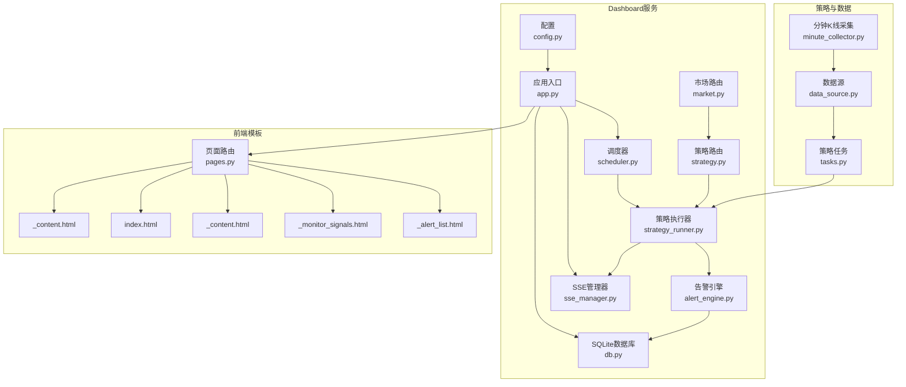
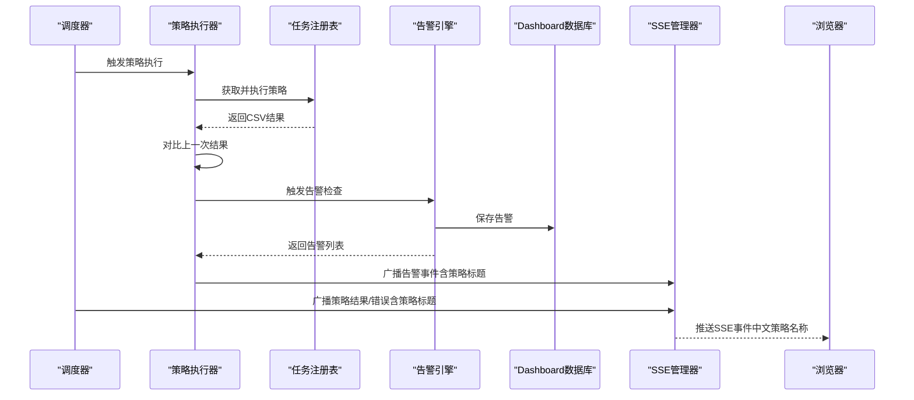
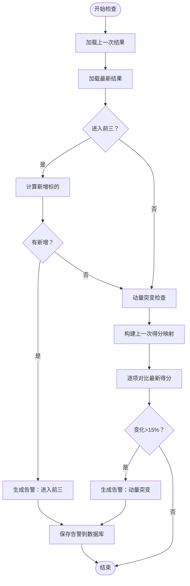
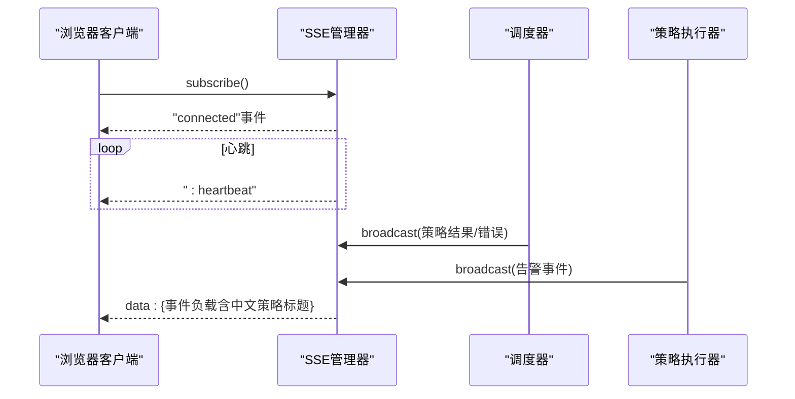
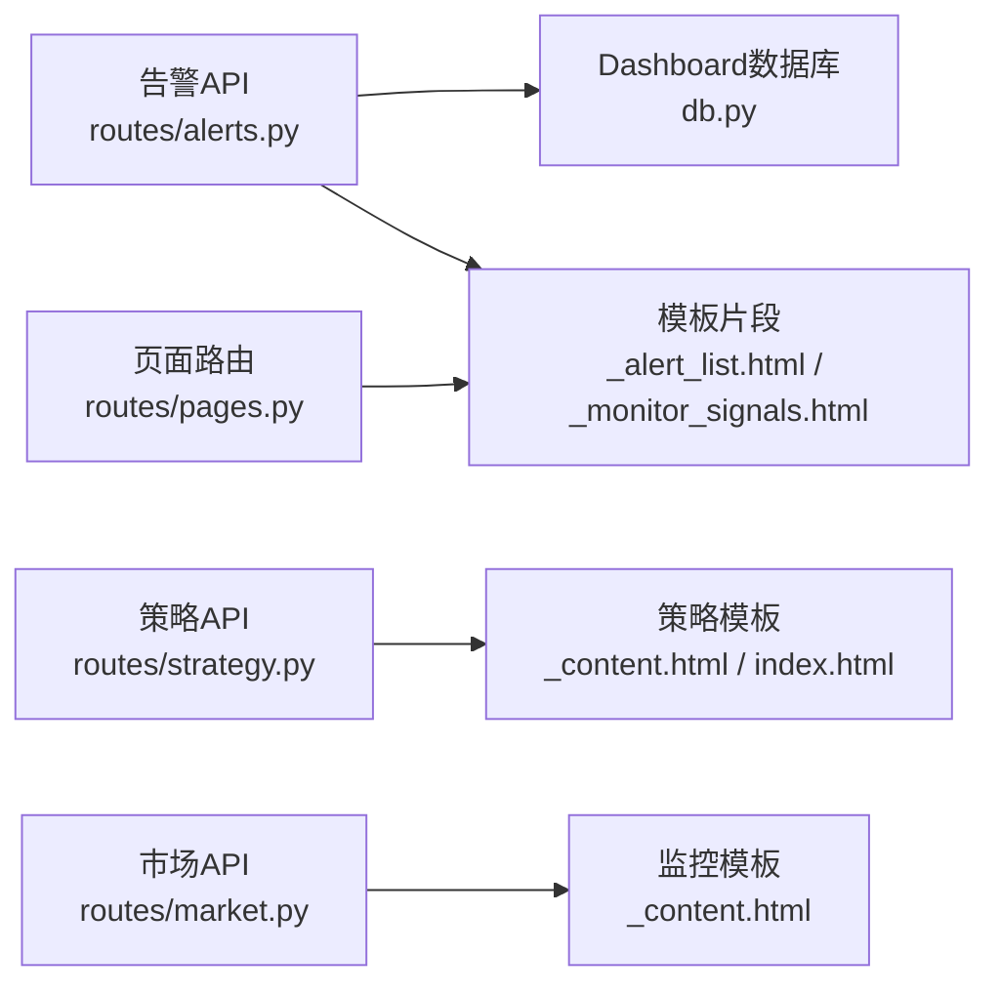
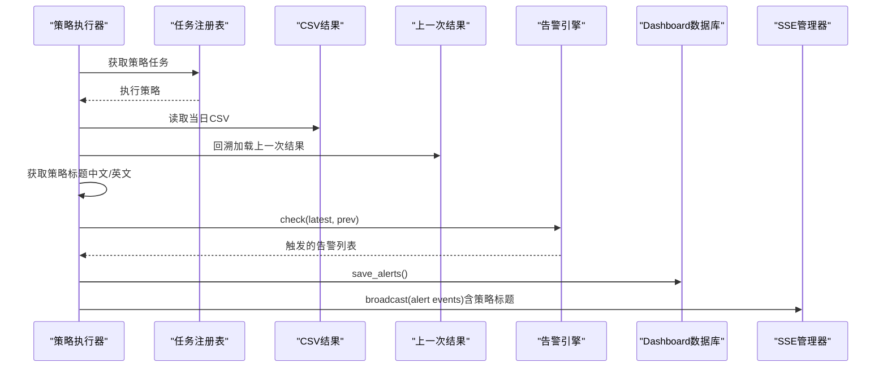
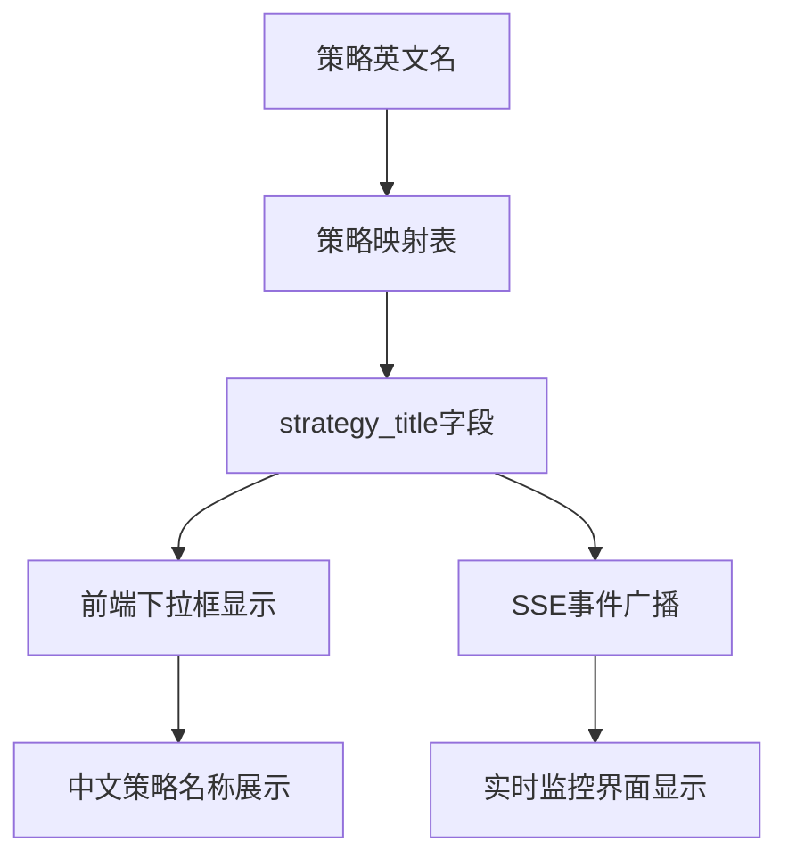
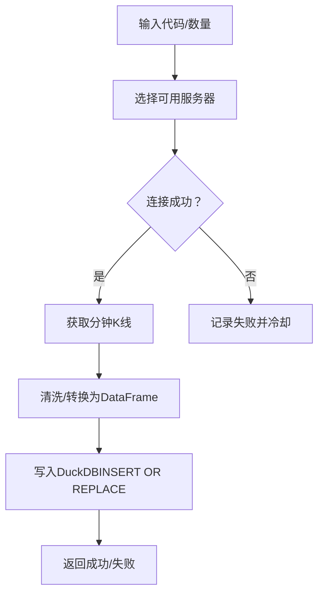
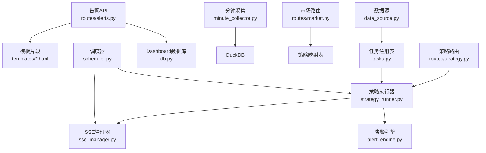

# 实时监控和告警系统

<cite>
**本文引用的文件**
- [src/quant_etf/dashboard/services/alert_engine.py](file://src/quant_etf/dashboard/services/alert_engine.py)
- [src/quant_etf/dashboard/services/sse_manager.py](file://src/quant_etf/dashboard/services/sse_manager.py)
- [src/quant_etf/dashboard/routes/alerts.py](file://src/quant_etf/dashboard/routes/alerts.py)
- [src/quant_etf/dashboard/app.py](file://src/quant_etf/dashboard/app.py)
- [src/quant_etf/dashboard/config.py](file://src/quant_etf/dashboard/config.py)
- [src/quant_etf/dashboard/db.py](file://src/quant_etf/dashboard/db.py)
- [src/quant_etf/dashboard/models.py](file://src/quant_etf/dashboard/models.py)
- [src/quant_etf/dashboard/services/scheduler.py](file://src/quant_etf/dashboard/services/scheduler.py)
- [src/quant_etf/dashboard/services/strategy_runner.py](file://src/quant_etf/dashboard/services/strategy_runner.py)
- [src/quant_etf/dashboard/routes/pages.py](file://src/quant_etf/dashboard/routes/pages.py)
- [src/quant_etf/dashboard/routes/market.py](file://src/quant_etf/dashboard/routes/market.py)
- [src/quant_etf/dashboard/routes/strategy.py](file://src/quant_etf/dashboard/routes/strategy.py)
- [src/quant_etf/dashboard/templates/alerts/_alert_list.html](file://src/quant_etf/dashboard/templates/alerts/_alert_list.html)
- [src/quant_etf/dashboard/templates/alerts/_monitor_signals.html](file://src/quant_etf/dashboard/templates/alerts/_monitor_signals.html)
- [src/quant_etf/dashboard/templates/strategy/_content.html](file://src/quant_etf/dashboard/templates/strategy/_content.html)
- [src/quant_etf/dashboard/templates/strategy/index.html](file://src/quant_etf/dashboard/templates/strategy/index.html)
- [src/quant_etf/dashboard/templates/monitor/_content.html](file://src/quant_etf/dashboard/templates/monitor/_content.html)
- [src/quant_etf/minute_collector.py](file://src/quant_etf/minute_collector.py)
- [src/quant_etf/data_source.py](file://src/quant_etf/data_source.py)
- [src/quant_etf/tasks.py](file://src/quant_etf/tasks.py)
</cite>

## 更新摘要
**所做更改**
- 新增中文策略名称支持机制，包括策略英文名到中文显示名的映射
- 更新策略执行界面，支持中文策略名称的显示和选择
- 增强实时监控界面，展示中文策略名称和实时信号流
- 完善SSE事件中的策略标题显示，支持中英文混合显示

## 目录
1. [简介](#简介)
2. [项目结构](#项目结构)
3. [核心组件](#核心组件)
4. [架构总览](#架构总览)
5. [详细组件分析](#详细组件分析)
6. [依赖关系分析](#依赖关系分析)
7. [性能考虑](#性能考虑)
8. [故障排查指南](#故障排查指南)
9. [结论](#结论)
10. [附录](#附录)

## 简介
本技术文档面向Quant-ETF项目的实时监控与告警系统，围绕分钟级K线数据采集、Dashboard告警机制与ETFMonitor监控信号、两级告警体系、SSE实时推送机制、监控指标与阈值设定、异常处理与性能优化、以及运维配置与故障排查等方面进行全面阐述。文档旨在帮助开发者与运维人员快速理解系统设计、掌握运行机制，并高效定位问题。

**更新** 系统现已支持中文策略名称显示，用户可以在策略执行和实时监控界面中看到友好的中文策略名称，如"ETF组合"、"短线股票"、"中期反弹"等。

## 项目结构
系统由"策略执行与结果导出"、"Dashboard前端与后端服务"、"SSE事件推送"、"分钟级K线采集与存储"四大部分组成。策略层负责打分与排序，结果以CSV形式落盘；Dashboard侧负责展示、规则管理、告警生成与持久化；SSE负责向浏览器推送实时事件；分钟级K线采集模块负责行情数据的获取、清洗与DuckDB存储。

**图表来源**
- [src/quant_etf/tasks.py:162-278](file://src/quant_etf/tasks.py#L162-L278)
- [src/quant_etf/dashboard/services/strategy_runner.py:25-125](file://src/quant_etf/dashboard/services/strategy_runner.py#L25-L125)
- [src/quant_etf/dashboard/services/alert_engine.py:20-119](file://src/quant_etf/dashboard/services/alert_engine.py#L20-L119)
- [src/quant_etf/dashboard/services/sse_manager.py:10-44](file://src/quant_etf/dashboard/services/sse_manager.py#L10-L44)
- [src/quant_etf/dashboard/services/scheduler.py:15-81](file://src/quant_etf/dashboard/services/scheduler.py#L15-L81)
- [src/quant_etf/dashboard/app.py:17-86](file://src/quant_etf/dashboard/app.py#L17-L86)
- [src/quant_etf/dashboard/db.py:11-66](file://src/quant_etf/dashboard/db.py#L11-L66)
- [src/quant_etf/dashboard/routes/pages.py:40-74](file://src/quant_etf/dashboard/routes/pages.py#L40-L74)
- [src/quant_etf/dashboard/routes/market.py:15-28](file://src/quant_etf/dashboard/routes/market.py#L15-L28)
- [src/quant_etf/dashboard/routes/strategy.py:18-21](file://src/quant_etf/dashboard/routes/strategy.py#L18-L21)
- [src/quant_etf/dashboard/templates/alerts/_alert_list.html:1-69](file://src/quant_etf/dashboard/templates/alerts/_alert_list.html#L1-L69)
- [src/quant_etf/dashboard/templates/alerts/_monitor_signals.html:1-69](file://src/quant_etf/dashboard/templates/alerts/_monitor_signals.html#L1-L69)
- [src/quant_etf/dashboard/templates/strategy/_content.html:55-62](file://src/quant_etf/dashboard/templates/strategy/_content.html#L55-L62)
- [src/quant_etf/dashboard/templates/strategy/index.html:58-65](file://src/quant_etf/dashboard/templates/strategy/index.html#L58-L65)
- [src/quant_etf/dashboard/templates/monitor/_content.html:97-99](file://src/quant_etf/dashboard/templates/monitor/_content.html#L97-L99)
- [src/quant_etf/minute_collector.py:41-156](file://src/quant_etf/minute_collector.py#L41-L156)

**章节来源**
- [src/quant_etf/dashboard/app.py:17-86](file://src/quant_etf/dashboard/app.py#L17-L86)
- [src/quant_etf/dashboard/services/scheduler.py:15-81](file://src/quant_etf/dashboard/services/scheduler.py#L15-L81)
- [src/quant_etf/dashboard/services/strategy_runner.py:25-125](file://src/quant_etf/dashboard/services/strategy_runner.py#L25-L125)
- [src/quant_etf/dashboard/services/alert_engine.py:20-119](file://src/quant_etf/dashboard/services/alert_engine.py#L20-L119)
- [src/quant_etf/dashboard/services/sse_manager.py:10-44](file://src/quant_etf/dashboard/services/sse_manager.py#L10-L44)
- [src/quant_etf/dashboard/db.py:11-66](file://src/quant_etf/dashboard/db.py#L11-L66)
- [src/quant_etf/dashboard/routes/pages.py:40-74](file://src/quant_etf/dashboard/routes/pages.py#L40-L74)
- [src/quant_etf/dashboard/routes/market.py:15-28](file://src/quant_etf/dashboard/routes/market.py#L15-L28)
- [src/quant_etf/dashboard/routes/strategy.py:18-21](file://src/quant_etf/dashboard/routes/strategy.py#L18-L21)
- [src/quant_etf/dashboard/templates/alerts/_alert_list.html:1-69](file://src/quant_etf/dashboard/templates/alerts/_alert_list.html#L1-L69)
- [src/quant_etf/dashboard/templates/alerts/_monitor_signals.html:1-69](file://src/quant_etf/dashboard/templates/alerts/_monitor_signals.html#L1-L69)
- [src/quant_etf/dashboard/templates/strategy/_content.html:55-62](file://src/quant_etf/dashboard/templates/strategy/_content.html#L55-L62)
- [src/quant_etf/dashboard/templates/strategy/index.html:58-65](file://src/quant_etf/dashboard/templates/strategy/index.html#L58-L65)
- [src/quant_etf/dashboard/templates/monitor/_content.html:97-99](file://src/quant_etf/dashboard/templates/monitor/_content.html#L97-L99)
- [src/quant_etf/minute_collector.py:41-156](file://src/quant_etf/minute_collector.py#L41-L156)

## 核心组件
- 告警引擎：基于规则集对策略结果进行对比分析，生成告警并持久化至Dashboard数据库。
- SSE管理器：维护客户端订阅队列，周期性心跳维持连接，统一广播事件。
- 调度器：按配置周期性触发策略执行，更新调度记录并通过SSE广播结果或错误。
- 策略执行器：在后台线程执行具体策略，读取CSV结果，对比上一次结果触发告警，并通过SSE广播。
- 分钟K线采集器：封装TDX行情接口，自动切换服务器，冷却失败节点，DuckDB存储分钟线。
- 数据源：优先本地TDX文件/缓存/在线获取，保证数据新鲜度与稳定性。
- Dashboard路由与模板：提供告警列表、监控信号展示、状态更新等页面与API。
- **新增** 策略名称映射：支持策略英文名到中文显示名的映射，提升用户体验。

**章节来源**
- [src/quant_etf/dashboard/services/alert_engine.py:20-119](file://src/quant_etf/dashboard/services/alert_engine.py#L20-L119)
- [src/quant_etf/dashboard/services/sse_manager.py:10-44](file://src/quant_etf/dashboard/services/sse_manager.py#L10-L44)
- [src/quant_etf/dashboard/services/scheduler.py:15-81](file://src/quant_etf/dashboard/services/scheduler.py#L15-L81)
- [src/quant_etf/dashboard/services/strategy_runner.py:25-125](file://src/quant_etf/dashboard/services/strategy_runner.py#L25-L125)
- [src/quant_etf/minute_collector.py:41-156](file://src/quant_etf/minute_collector.py#L41-L156)
- [src/quant_etf/data_source.py:189-236](file://src/quant_etf/data_source.py#L189-L236)
- [src/quant_etf/dashboard/routes/market.py:15-28](file://src/quant_etf/dashboard/routes/market.py#L15-L28)

## 架构总览
系统采用"策略执行—结果落盘—告警对比—SSE推送—Dashboard展示"的闭环。策略执行器在后台线程中调用任务注册表执行策略，读取当天CSV结果并与上一次结果对比，触发告警引擎生成告警并入库；同时通过SSE广播策略结果与告警事件，Dashboard页面实时接收并渲染。

**更新** 现在支持中文策略名称显示，策略执行器会从任务对象获取中文标题，SSE事件中包含策略标题信息，前端界面正确显示中文策略名称。

**图表来源**
- [src/quant_etf/dashboard/services/scheduler.py:19-52](file://src/quant_etf/dashboard/services/scheduler.py#L19-L52)
- [src/quant_etf/dashboard/services/strategy_runner.py:25-125](file://src/quant_etf/dashboard/services/strategy_runner.py#L25-L125)
- [src/quant_etf/tasks.py:411-449](file://src/quant_etf/tasks.py#L411-L449)
- [src/quant_etf/dashboard/services/alert_engine.py:82-96](file://src/quant_etf/dashboard/services/alert_engine.py#L82-L96)
- [src/quant_etf/dashboard/db.py:45-56](file://src/quant_etf/dashboard/db.py#L45-L56)
- [src/quant_etf/dashboard/services/sse_manager.py:34-41](file://src/quant_etf/dashboard/services/sse_manager.py#L34-L41)

## 详细组件分析

### 告警引擎（AlertEngine）
- 规则集：包含"进入前三""动量突变""持仓偏离目标（预留）"三项规则。
- 检测逻辑：
  - 进入前三：比较最新与上一次结果的前3标的集合差集，若有新增则生成告警。
  - 动量突变：按代码映射最新与上一次得分，计算绝对变化幅度，超过阈值（默认15%）即告警。
  - 持仓偏离：占位，MVP阶段返回不触发。
- 存储：将告警写入Dashboard数据库alerts_dashboard表，包含类型、严重级别、标题、消息与附加数据。
- 异常处理：规则函数与整体检查均包裹异常捕获，避免影响主流程。

**图表来源**
- [src/quant_etf/dashboard/services/alert_engine.py:30-96](file://src/quant_etf/dashboard/services/alert_engine.py#L30-L96)
- [src/quant_etf/dashboard/db.py:45-56](file://src/quant_etf/dashboard/db.py#L45-L56)

**章节来源**
- [src/quant_etf/dashboard/services/alert_engine.py:20-119](file://src/quant_etf/dashboard/services/alert_engine.py#L20-L119)
- [src/quant_etf/dashboard/db.py:45-56](file://src/quant_etf/dashboard/db.py#L45-L56)

### SSE实时推送（SSEManager）
- 订阅：每个订阅者分配独立队列，首次发送"已连接"事件，随后持续推送数据事件。
- 广播：遍历所有队列投递事件，异常时移除失效队列，避免阻塞。
- 心跳：超时等待期间发送心跳行，保持连接活性。
- 应用集成：Dashboard在/events端点提供SSE流，调度器与策略执行器通过其广播策略结果与告警事件。

**更新** SSE事件现在包含策略标题信息，支持中文策略名称的实时展示。事件类型包括connected、strategy_result、strategy_error、alert等。

**图表来源**
- [src/quant_etf/dashboard/services/sse_manager.py:14-41](file://src/quant_etf/dashboard/services/sse_manager.py#L14-L41)
- [src/quant_etf/dashboard/app.py:39-50](file://src/quant_etf/dashboard/app.py#L39-L50)
- [src/quant_etf/dashboard/services/scheduler.py:34-50](file://src/quant_etf/dashboard/services/scheduler.py#L34-L50)
- [src/quant_etf/dashboard/services/strategy_runner.py:80-98](file://src/quant_etf/dashboard/services/strategy_runner.py#L80-L98)

**章节来源**
- [src/quant_etf/dashboard/services/sse_manager.py:10-44](file://src/quant_etf/dashboard/services/sse_manager.py#L10-L44)
- [src/quant_etf/dashboard/app.py:39-50](file://src/quant_etf/dashboard/app.py#L39-L50)

### Dashboard告警API与页面
- API：
  - 列出/创建/删除告警规则（SQLite）。
  - 更新告警状态（active/acknowledged/resolved），并记录解决时间。
  - 统计告警总量与活跃数。
  - 展示Dashboard告警列表片段。
  - 从DuckDB读取ETFMonitor监控信号并渲染。
- 页面：
  - 总览、组合、策略、监控、告警、设置等页面，支持HTMX片段加载。

**更新** 策略页面现在支持中文策略名称显示，用户可以看到友好的中文策略名称而非英文标识符。

**图表来源**
- [src/quant_etf/dashboard/routes/alerts.py:16-104](file://src/quant_etf/dashboard/routes/alerts.py#L16-L104)
- [src/quant_etf/dashboard/db.py:36-66](file://src/quant_etf/dashboard/db.py#L36-L66)
- [src/quant_etf/dashboard/routes/pages.py:40-74](file://src/quant_etf/dashboard/routes/pages.py#L40-L74)
- [src/quant_etf/dashboard/routes/market.py:15-28](file://src/quant_etf/dashboard/routes/market.py#L15-L28)
- [src/quant_etf/dashboard/routes/strategy.py:18-21](file://src/quant_etf/dashboard/routes/strategy.py#L18-L21)
- [src/quant_etf/dashboard/templates/alerts/_alert_list.html:1-69](file://src/quant_etf/dashboard/templates/alerts/_alert_list.html#L1-L69)
- [src/quant_etf/dashboard/templates/alerts/_monitor_signals.html:1-69](file://src/quant_etf/dashboard/templates/alerts/_monitor_signals.html#L1-L69)
- [src/quant_etf/dashboard/templates/strategy/_content.html:55-62](file://src/quant_etf/dashboard/templates/strategy/_content.html#L55-L62)
- [src/quant_etf/dashboard/templates/strategy/index.html:58-65](file://src/quant_etf/dashboard/templates/strategy/index.html#L58-L65)
- [src/quant_etf/dashboard/templates/monitor/_content.html:97-99](file://src/quant_etf/dashboard/templates/monitor/_content.html#L97-L99)

**章节来源**
- [src/quant_etf/dashboard/routes/alerts.py:16-104](file://src/quant_etf/dashboard/routes/alerts.py#L16-L104)
- [src/quant_etf/dashboard/routes/pages.py:40-74](file://src/quant_etf/dashboard/routes/pages.py#L40-L74)
- [src/quant_etf/dashboard/templates/alerts/_alert_list.html:1-69](file://src/quant_etf/dashboard/templates/alerts/_alert_list.html#L1-L69)
- [src/quant_etf/dashboard/templates/alerts/_monitor_signals.html:1-69](file://src/quant_etf/dashboard/templates/alerts/_monitor_signals.html#L1-L69)
- [src/quant_etf/dashboard/templates/strategy/_content.html:55-62](file://src/quant_etf/dashboard/templates/strategy/_content.html#L55-L62)
- [src/quant_etf/dashboard/templates/strategy/index.html:58-65](file://src/quant_etf/dashboard/templates/strategy/index.html#L58-L65)
- [src/quant_etf/dashboard/templates/monitor/_content.html:97-99](file://src/quant_etf/dashboard/templates/monitor/_content.html#L97-L99)

### 策略执行与告警联动（StrategyRunner）
- 异步执行：在事件循环外使用线程池执行策略，完成后回传到事件循环广播SSE。
- 结果对比：加载当日CSV作为最新结果，按日期回溯获取上一次结果用于对比。
- 告警触发：调用告警引擎，保存告警并逐条广播SSE事件。
- 错误处理：策略异常时同样广播错误事件，确保前端可观测。
- **新增** 策略标题：从任务对象获取策略标题，支持中文显示。

**更新** 策略执行器现在能够获取任务对象的中文标题，通过getattr(task, "title", strategy_name)的方式获取策略标题。如果任务对象没有定义title属性，则回退到英文策略名称。

**图表来源**
- [src/quant_etf/dashboard/services/strategy_runner.py:25-125](file://src/quant_etf/dashboard/services/strategy_runner.py#L25-L125)
- [src/quant_etf/tasks.py:411-449](file://src/quant_etf/tasks.py#L411-L449)
- [src/quant_etf/dashboard/services/alert_engine.py:82-115](file://src/quant_etf/dashboard/services/alert_engine.py#L82-L115)

**章节来源**
- [src/quant_etf/dashboard/services/strategy_runner.py:25-125](file://src/quant_etf/dashboard/services/strategy_runner.py#L25-L125)
- [src/quant_etf/dashboard/services/alert_engine.py:82-115](file://src/quant_etf/dashboard/services/alert_engine.py#L82-L115)

### 策略名称映射与中文显示
- **新增** 策略英文名映射：提供策略英文名到中文显示名的映射表，包括"etf"→"ETF组合"、"short"→"短线股票"、"mid"→"中期反弹"。
- **调度增强**：为每个调度记录添加strategy_title字段，支持中文策略名称显示。
- **前端展示**：策略选择下拉框显示中文策略名称和英文标识符，如"ETF组合（etf）"。
- **SSE事件**：SSE事件中包含strategy_title字段，前端正确显示中文策略名称。

**更新** 新增了完整的策略名称映射机制，包括后端映射逻辑、前端显示增强和SSE事件支持。

**图表来源**
- [src/quant_etf/dashboard/routes/market.py:15-28](file://src/quant_etf/dashboard/routes/market.py#L15-L28)
- [src/quant_etf/dashboard/routes/market.py:23-28](file://src/quant_etf/dashboard/routes/market.py#L23-L28)
- [src/quant_etf/dashboard/templates/monitor/_content.html:97-99](file://src/quant_etf/dashboard/templates/monitor/_content.html#L97-L99)
- [src/quant_etf/dashboard/services/strategy_runner.py:50](file://src/quant_etf/dashboard/services/strategy_runner.py#L50)

**章节来源**
- [src/quant_etf/dashboard/routes/market.py:15-28](file://src/quant_etf/dashboard/routes/market.py#L15-L28)
- [src/quant_etf/dashboard/routes/market.py:23-28](file://src/quant_etf/dashboard/routes/market.py#L23-L28)
- [src/quant_etf/dashboard/templates/monitor/_content.html:97-99](file://src/quant_etf/dashboard/templates/monitor/_content.html#L97-L99)
- [src/quant_etf/dashboard/services/strategy_runner.py:50](file://src/quant_etf/dashboard/services/strategy_runner.py#L50)

### 分钟级K线数据采集系统
- 服务器选择：内置自定义TDX服务器列表与默认列表，自动轮询可用服务器，失败节点冷却（默认120秒）。
- 数据获取：调用pytdx接口获取分钟K线，解析为结构化数据，清洗时间字段。
- 存储：DuckDB单表存储，主键(code,time)，带索引；提供插入替换、批量插入、查询、SQL直连等能力。
- 时间判定：提供交易时间判断与等待至下一交易时段的工具函数，便于调度采集。
- 数据新鲜度：数据源模块提供check_is_fresh用于判断缓存/本地数据是否新鲜。

**图表来源**
- [src/quant_etf/minute_collector.py:41-156](file://src/quant_etf/minute_collector.py#L41-L156)
- [src/quant_etf/minute_collector.py:245-277](file://src/quant_etf/minute_collector.py#L245-L277)
- [src/quant_etf/minute_collector.py:300-395](file://src/quant_etf/minute_collector.py#L300-L395)

**章节来源**
- [src/quant_etf/minute_collector.py:41-156](file://src/quant_etf/minute_collector.py#L41-L156)
- [src/quant_etf/minute_collector.py:245-277](file://src/quant_etf/minute_collector.py#L245-L277)
- [src/quant_etf/minute_collector.py:300-395](file://src/quant_etf/minute_collector.py#L300-L395)
- [src/quant_etf/data_source.py:151-188](file://src/quant_etf/data_source.py#L151-L188)

## 依赖关系分析
- 组件耦合：
  - 策略执行器依赖任务注册表与告警引擎，同时通过SSE广播事件。
  - 调度器与策略执行器通过SSE交互，统一事件格式。
  - Dashboard数据库用于规则与告警持久化，模板与路由负责渲染。
  - 分钟K线采集器与数据源模块相互独立，前者专注行情获取与存储，后者专注数据新鲜度与加载策略。
  - **新增** 市场路由依赖策略映射表，提供中文策略名称支持。
- 外部依赖：
  - DuckDB用于分钟K线与监控信号存储。
  - SQLite用于Dashboard规则与告警。
  - pytdx用于TDX行情接口。
  - FastAPI+Uvicorn提供HTTP与SSE服务。

**更新** 新增了策略名称映射的依赖关系，市场路由依赖映射表提供中文显示支持。

**图表来源**
- [src/quant_etf/tasks.py:411-449](file://src/quant_etf/tasks.py#L411-L449)
- [src/quant_etf/dashboard/services/strategy_runner.py:25-125](file://src/quant_etf/dashboard/services/strategy_runner.py#L25-L125)
- [src/quant_etf/dashboard/services/alert_engine.py:20-119](file://src/quant_etf/dashboard/services/alert_engine.py#L20-L119)
- [src/quant_etf/dashboard/services/sse_manager.py:10-44](file://src/quant_etf/dashboard/services/sse_manager.py#L10-L44)
- [src/quant_etf/dashboard/services/scheduler.py:15-81](file://src/quant_etf/dashboard/services/scheduler.py#L15-L81)
- [src/quant_etf/dashboard/routes/alerts.py:16-104](file://src/quant_etf/dashboard/routes/alerts.py#L16-L104)
- [src/quant_etf/dashboard/db.py:11-66](file://src/quant_etf/dashboard/db.py#L11-L66)
- [src/quant_etf/minute_collector.py:245-277](file://src/quant_etf/minute_collector.py#L245-L277)
- [src/quant_etf/data_source.py:189-236](file://src/quant_etf/data_source.py#L189-L236)
- [src/quant_etf/dashboard/routes/market.py:15-28](file://src/quant_etf/dashboard/routes/market.py#L15-L28)
- [src/quant_etf/dashboard/routes/strategy.py:18-21](file://src/quant_etf/dashboard/routes/strategy.py#L18-L21)

**章节来源**
- [src/quant_etf/tasks.py:411-449](file://src/quant_etf/tasks.py#L411-L449)
- [src/quant_etf/dashboard/services/strategy_runner.py:25-125](file://src/quant_etf/dashboard/services/strategy_runner.py#L25-L125)
- [src/quant_etf/dashboard/services/alert_engine.py:20-119](file://src/quant_etf/dashboard/services/alert_engine.py#L20-L119)
- [src/quant_etf/dashboard/services/sse_manager.py:10-44](file://src/quant_etf/dashboard/services/sse_manager.py#L10-L44)
- [src/quant_etf/dashboard/services/scheduler.py:15-81](file://src/quant_etf/dashboard/services/scheduler.py#L15-L81)
- [src/quant_etf/dashboard/routes/alerts.py:16-104](file://src/quant_etf/dashboard/routes/alerts.py#L16-L104)
- [src/quant_etf/dashboard/db.py:11-66](file://src/quant_etf/dashboard/db.py#L11-L66)
- [src/quant_etf/minute_collector.py:245-277](file://src/quant_etf/minute_collector.py#L245-L277)
- [src/quant_etf/data_source.py:189-236](file://src/quant_etf/data_source.py#L189-L236)
- [src/quant_etf/dashboard/routes/market.py:15-28](file://src/quant_etf/dashboard/routes/market.py#L15-L28)
- [src/quant_etf/dashboard/routes/strategy.py:18-21](file://src/quant_etf/dashboard/routes/strategy.py#L18-L21)

## 性能考虑
- 线程池与异步解耦：策略执行在后台线程池中进行，避免阻塞事件循环；完成后通过事件循环安全广播SSE，降低主线程压力。
- DuckDB写入优化：使用"INSERT OR REPLACE"批量写入，减少事务开销；分钟表建立复合主键与索引，提升查询效率。
- 服务器冷却：失败服务器进入冷却窗口，避免频繁重试导致资源浪费。
- 心跳与超时：SSE心跳维持长连接，超时自动续发，防止Nginx/代理断开。
- 数据新鲜度：数据源模块对缓存/本地数据进行新鲜度校验，减少无效网络请求。
- **新增** 策略名称映射缓存：策略映射表在内存中缓存，避免重复查询，提升页面响应速度。

## 故障排查指南
- SSE无法连接或频繁断开
  - 检查Dashboard主机与端口配置，确认防火墙放行。
  - 查看SSE心跳是否正常，确认客户端未主动取消订阅。
  - 参考路径：[src/quant_etf/dashboard/app.py:39-50](file://src/quant_etf/dashboard/app.py#L39-L50)、[src/quant_etf/dashboard/services/sse_manager.py:14-32](file://src/quant_etf/dashboard/services/sse_manager.py#L14-L32)
- 策略执行无结果或告警未触发
  - 确认策略CSV已生成且当日日期目录存在。
  - 检查上一次结果回溯逻辑，确保历史目录存在且包含对应CSV。
  - 参考路径：[src/quant_etf/dashboard/services/strategy_runner.py:128-153](file://src/quant_etf/dashboard/services/strategy_runner.py#L128-L153)
- 告警未入库
  - 检查Dashboard数据库初始化与表结构。
  - 确认告警保存接口调用链路。
  - 参考路径：[src/quant_etf/dashboard/db.py:45-56](file://src/quant_etf/dashboard/db.py#L45-L56)、[src/quant_etf/dashboard/services/alert_engine.py:98-115](file://src/quant_etf/dashboard/services/alert_engine.py#L98-L115)
- 分钟K线采集失败
  - 检查TDX服务器列表与网络连通性，关注冷却窗口。
  - 确认DuckDB表结构与索引存在。
  - 参考路径：[src/quant_etf/minute_collector.py:41-102](file://src/quant_etf/minute_collector.py#L41-L102)、[src/quant_etf/minute_collector.py:245-277](file://src/quant_etf/minute_collector.py#L245-L277)
- 数据源加载异常
  - 检查本地TDX文件、缓存文件与在线接口可用性。
  - 参考路径：[src/quant_etf/data_source.py:189-236](file://src/quant_etf/data_source.py#L189-L236)
- **新增** 中文策略名称显示问题
  - 检查策略映射表是否正确配置，确认策略英文名在映射表中存在。
  - 确认SSE事件中是否包含strategy_title字段。
  - 检查前端模板是否正确使用s.title + '（' + s.name + '）'格式显示。
  - 参考路径：[src/quant_etf/dashboard/routes/market.py:15-28](file://src/quant_etf/dashboard/routes/market.py#L15-L28)、[src/quant_etf/dashboard/templates/monitor/_content.html:97-99](file://src/quant_etf/dashboard/templates/monitor/_content.html#L97-L99)

**章节来源**
- [src/quant_etf/dashboard/app.py:39-50](file://src/quant_etf/dashboard/app.py#L39-L50)
- [src/quant_etf/dashboard/services/sse_manager.py:14-32](file://src/quant_etf/dashboard/services/sse_manager.py#L14-L32)
- [src/quant_etf/dashboard/services/strategy_runner.py:128-153](file://src/quant_etf/dashboard/services/strategy_runner.py#L128-L153)
- [src/quant_etf/dashboard/db.py:45-56](file://src/quant_etf/dashboard/db.py#L45-L56)
- [src/quant_etf/minute_collector.py:41-102](file://src/quant_etf/minute_collector.py#L41-L102)
- [src/quant_etf/minute_collector.py:245-277](file://src/quant_etf/minute_collector.py#L245-L277)
- [src/quant_etf/data_source.py:189-236](file://src/quant_etf/data_source.py#L189-L236)
- [src/quant_etf/dashboard/routes/market.py:15-28](file://src/quant_etf/dashboard/routes/market.py#L15-L28)
- [src/quant_etf/dashboard/templates/monitor/_content.html:97-99](file://src/quant_etf/dashboard/templates/monitor/_content.html#L97-L99)

## 结论
该系统通过"策略执行—结果落盘—告警对比—SSE推送—Dashboard展示"的闭环，实现了分钟级数据驱动的实时监控与告警。告警引擎以规则为核心，结合SSE实现低延迟事件推送；分钟K线采集模块提供高可用行情数据基础；Dashboard侧以SQLite与DuckDB分别承载规则与信号数据，满足可观测性与可扩展性需求。

**更新** 新增的中文策略名称支持显著提升了用户体验，用户现在可以在策略执行和实时监控界面中看到友好的中文策略名称，如"ETF组合"、"短线股票"、"中期反弹"等。这一改进通过策略映射表、SSE事件增强和前端模板优化实现，保持了系统的稳定性和性能。

建议在生产环境中强化服务器冷却策略、完善心跳与超时配置、定期校验数据新鲜度与索引有效性，同时确保策略映射表的准确性和完整性。

## 附录

### 监控指标、计算方法与阈值
- 动量突变阈值：默认15%（绝对变化率），可在配置中调整。
- 进入前三：基于最新与上一次结果的Top-N集合差集识别新增标的。
- 持仓偏离：预留规则，MVP阶段不触发。
- 配置位置参考：[src/quant_etf/dashboard/config.py:23-24](file://src/quant_etf/dashboard/config.py#L23-L24)

**章节来源**
- [src/quant_etf/dashboard/config.py:23-24](file://src/quant_etf/dashboard/config.py#L23-L24)

### 中文策略名称映射表
- etf → ETF组合
- short → 短线股票  
- mid → 中期反弹

**章节来源**
- [src/quant_etf/dashboard/routes/market.py:15-20](file://src/quant_etf/dashboard/routes/market.py#L15-L20)