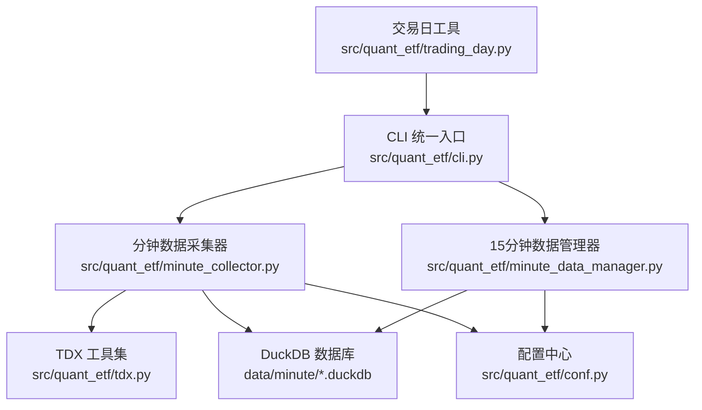
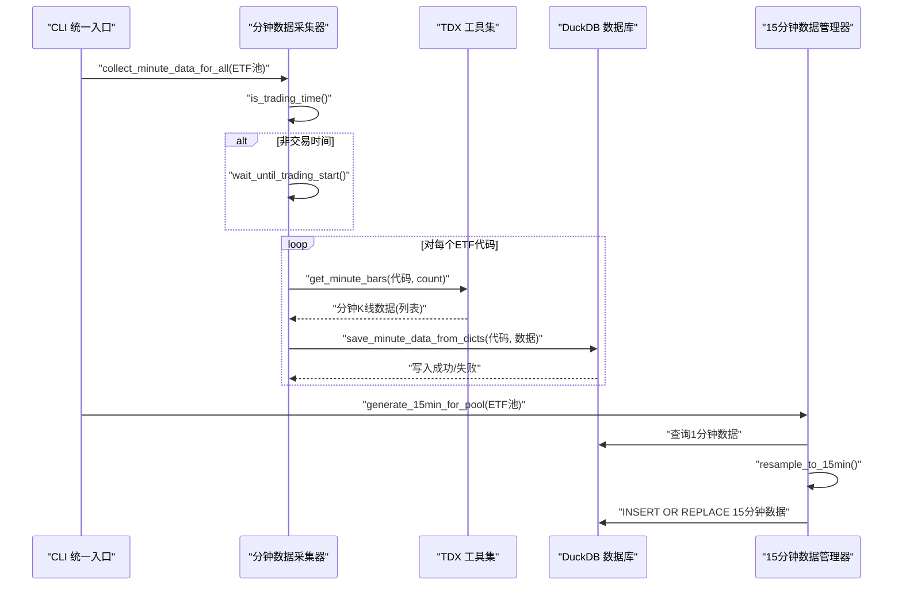
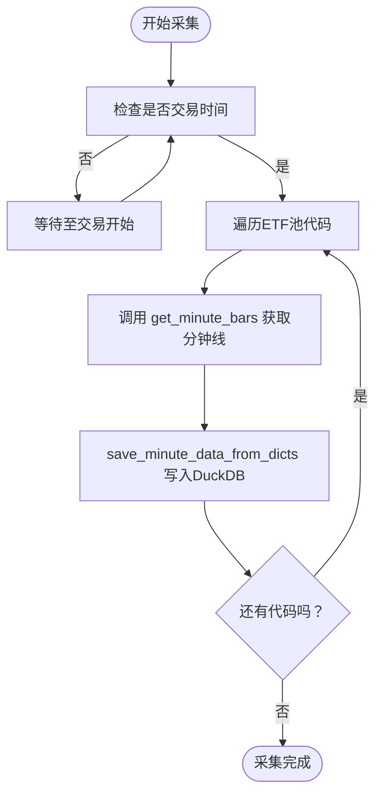
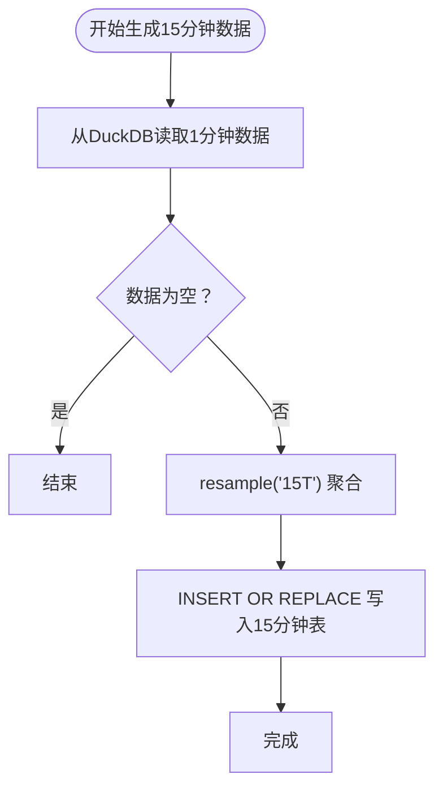
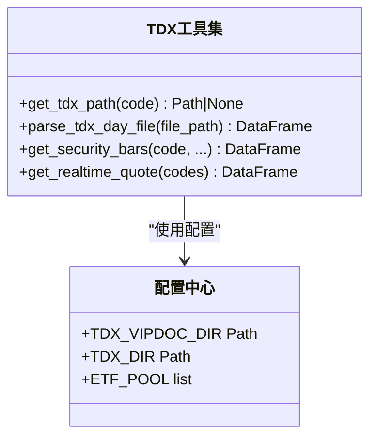
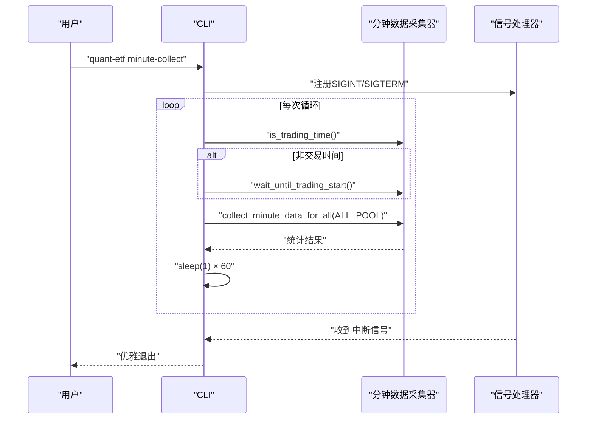
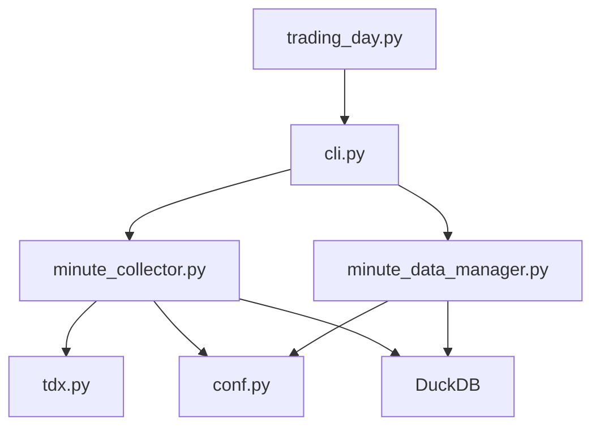

# 数据采集系统

<cite>
**本文档引用的文件**
- [src/quant_etf/minute_collector.py](file://src/quant_etf/minute_collector.py)
- [src/quant_etf/tdx.py](file://src/quant_etf/tdx.py)
- [src/quant_etf/data_source.py](file://src/quant_etf/data_source.py)
- [src/quant_etf/minute_data_manager.py](file://src/quant_etf/minute_data_manager.py)
- [src/quant_etf/init_15min_data.py](file://src/quant_etf/init_15min_data.py)
- [src/quant_etf/conf.py](file://src/quant_etf/conf.py)
- [src/quant_etf/trading_day.py](file://src/quant_etf/trading_day.py)
- [src/quant_etf/cli.py](file://src/quant_etf/cli.py)
- [src/fetch_10days_1min.py](file://src/fetch_10days_1min.py)
- [run_minute_collector.py](file://run_minute_collector.py)
- [README.md](file://README.md)
- [DEVELOPMENT.md](file://DEVELOPMENT.md)
</cite>

## 目录
1. [简介](#简介)
2. [项目结构](#项目结构)
3. [核心组件](#核心组件)
4. [架构总览](#架构总览)
5. [详细组件分析](#详细组件分析)
6. [依赖关系分析](#依赖关系分析)
7. [性能考虑](#性能考虑)
8. [故障排查指南](#故障排查指南)
9. [结论](#结论)
10. [附录](#附录)

## 简介
本文件为 Quant-ETF 数据采集系统的详细技术文档，聚焦分钟级 K 线数据采集的实现原理与工程实践，涵盖以下主题：
- TDX 数据源集成：本地 TDX 文件与在线 TDX 服务器的双通道加载策略
- 在线数据获取：基于 pytdx 的行情 API 调用、服务器自动切换与冷却机制
- 本地数据缓存：DuckDB 数据库存储与索引设计，支持高效查询与去重
- 时间窗口管理：交易时间判断、等待机制与批量采集策略
- 15 分钟数据转换：重采样算法与数据完整性保障
- 数据质量控制：去重、缺失数据补全与异常恢复
- 性能优化：并发采集、内存管理与磁盘 I/O 优化
- 扩展接口：数据采集器扩展与自定义数据源集成指南

## 项目结构
系统采用模块化设计，围绕 CLI 统一入口组织功能，数据采集链路主要涉及以下模块：
- CLI 统一入口：负责命令解析与任务调度
- 分钟数据采集器：负责在线获取分钟级 K 线并持久化
- 15 分钟数据管理器：负责从 1 分钟数据重采样生成 15 分钟数据
- TDX 工具集：提供 TDX 文件路径解析与在线数据获取能力
- 配置中心：集中管理数据目录、ETF 池与 TDX 路径等配置
- 交易日工具：辅助获取交易日列表与日期范围过滤

**图示来源**
- [src/quant_etf/cli.py:86-142](file://src/quant_etf/cli.py#L86-L142)
- [src/quant_etf/minute_collector.py:41-102](file://src/quant_etf/minute_collector.py#L41-L102)
- [src/quant_etf/minute_data_manager.py:110-188](file://src/quant_etf/minute_data_manager.py#L110-L188)
- [src/quant_etf/tdx.py:235-338](file://src/quant_etf/tdx.py#L235-L338)
- [src/quant_etf/conf.py:1-137](file://src/quant_etf/conf.py#L1-L137)
- [src/quant_etf/trading_day.py:33-88](file://src/quant_etf/trading_day.py#L33-L88)

**章节来源**
- [README.md:1-590](file://README.md#L1-L590)
- [DEVELOPMENT.md:47-96](file://DEVELOPMENT.md#L47-L96)

## 核心组件
本节对数据采集系统的关键组件进行深入分析，重点说明其职责、数据结构与处理流程。

- 分钟数据采集器（TDX 在线获取 + DuckDB 持久化）
  - TDX 服务器选择与冷却：维护失败服务器冷却时间，避免短时间重复尝试
  - 1 分钟 K 线获取：调用 pytdx API 获取指定数量的分钟线，清洗字段并按时间排序
  - DuckDB 存储：创建表结构与索引，支持 INSERT OR REPLACE 去重写入
  - 批量采集：对 ETF 池逐个采集并统计成功/失败数量
- 15 分钟数据管理器（重采样与增量更新）
  - 重采样算法：基于 pandas resample("15T") 的聚合策略（开盘取首个、最高取最大、最低取最小、收盘取最后一个、成交量/成交额求和）
  - 增量更新：根据最新 1 分钟数据时间点，仅重采样最近一天的数据以减少计算量
  - 查询接口：提供 SQL 查询与按代码/时间范围的便捷查询
- TDX 工具集（本地文件解析 + 在线数据获取）
  - 本地文件解析：根据代码推断市场，定位 .day 文件并解析为标准 OHLCV DataFrame
  - 在线数据获取：封装 pytdx API，支持自定义服务器列表与缓存工作服务器
- 配置中心（数据目录与 ETF 池）
  - 数据目录：统一管理 data/minute 等数据存储路径
  - ETF 池：维护 ETF 代码集合，支持不同规模的任务执行
- 交易日工具（日期范围过滤）
  - 读取 TDX 日线文件，返回有效交易日列表，支持按范围过滤

**章节来源**
- [src/quant_etf/minute_collector.py:41-102](file://src/quant_etf/minute_collector.py#L41-L102)
- [src/quant_etf/minute_collector.py:245-395](file://src/quant_etf/minute_collector.py#L245-L395)
- [src/quant_etf/minute_data_manager.py:72-107](file://src/quant_etf/minute_data_manager.py#L72-L107)
- [src/quant_etf/minute_data_manager.py:110-188](file://src/quant_etf/minute_data_manager.py#L110-L188)
- [src/quant_etf/tdx.py:341-375](file://src/quant_etf/tdx.py#L341-L375)
- [src/quant_etf/tdx.py:235-338](file://src/quant_etf/tdx.py#L235-L338)
- [src/quant_etf/conf.py:1-137](file://src/quant_etf/conf.py#L1-L137)
- [src/quant_etf/trading_day.py:33-88](file://src/quant_etf/trading_day.py#L33-L88)

## 架构总览
数据采集系统遵循“在线获取 → 本地缓存 → 重采样生成”的数据流，结合交易时间窗口与增量更新策略，确保数据新鲜度与性能。

**图示来源**
- [src/quant_etf/cli.py:86-142](file://src/quant_etf/cli.py#L86-L142)
- [src/quant_etf/minute_collector.py:458-488](file://src/quant_etf/minute_collector.py#L458-L488)
- [src/quant_etf/minute_collector.py:355-395](file://src/quant_etf/minute_collector.py#L355-L395)
- [src/quant_etf/minute_data_manager.py:110-188](file://src/quant_etf/minute_data_manager.py#L110-L188)

## 详细组件分析

### 分钟数据采集器（TDX 在线获取 + DuckDB 持久化）
- TDX 服务器选择与冷却
  - 维护失败服务器字典与冷却时间（默认 120 秒），冷却期内跳过该服务器
  - 依次尝试自定义服务器列表与官方 hq_hosts，成功后清除此服务器的失败记录
- 1 分钟 K 线获取
  - 通过 pytdx 的 TdxHq_API 获取分钟线，字段清洗与时间转换，按时间排序
  - 返回结构化的字典列表，供后续写入 DuckDB
- DuckDB 存储
  - 初始化表结构：包含 code、time、OHLCV、年月日时分等派生字段
  - 建立 code+time 复合索引，提升查询与去重性能
  - 支持 INSERT OR REPLACE，天然实现去重
- 批量采集与统计
  - 对 ETF 池逐个采集，统计成功/失败数量，便于监控与异常恢复

**图示来源**
- [src/quant_etf/minute_collector.py:158-232](file://src/quant_etf/minute_collector.py#L158-L232)
- [src/quant_etf/minute_collector.py:41-102](file://src/quant_etf/minute_collector.py#L41-L102)
- [src/quant_etf/minute_collector.py:245-395](file://src/quant_etf/minute_collector.py#L245-L395)
- [src/quant_etf/minute_collector.py:458-488](file://src/quant_etf/minute_collector.py#L458-L488)

**章节来源**
- [src/quant_etf/minute_collector.py:27-102](file://src/quant_etf/minute_collector.py#L27-L102)
- [src/quant_etf/minute_collector.py:245-395](file://src/quant_etf/minute_collector.py#L245-L395)
- [src/quant_etf/minute_collector.py:458-488](file://src/quant_etf/minute_collector.py#L458-L488)

### 15 分钟数据管理器（重采样与增量更新）
- 重采样算法
  - 使用 pandas resample("15T", label="right", closed="right") 进行 15 分钟聚合
  - 聚合规则：开盘取首个、最高取最大、最低取最小、收盘取最后一个、成交量/成交额求和
  - 生成 year/month/day/hour/minute 派生字段，便于查询与展示
- 增量更新策略
  - 读取 1 分钟数据表的最新时间点，仅重采样最近一天的数据，降低计算开销
  - 支持按代码与起始日期生成，满足回测与补跑需求
- 查询与统计
  - 提供 SQL 查询接口与便捷的按代码/时间范围查询函数
  - 统计生成数量，便于监控与异常恢复

**图示来源**
- [src/quant_etf/minute_data_manager.py:72-107](file://src/quant_etf/minute_data_manager.py#L72-L107)
- [src/quant_etf/minute_data_manager.py:110-188](file://src/quant_etf/minute_data_manager.py#L110-L188)

**章节来源**
- [src/quant_etf/minute_data_manager.py:72-107](file://src/quant_etf/minute_data_manager.py#L72-L107)
- [src/quant_etf/minute_data_manager.py:110-188](file://src/quant_etf/minute_data_manager.py#L110-L188)

### TDX 工具集（本地文件解析 + 在线数据获取）
- 本地文件解析
  - 根据代码前缀推断市场（上海/深圳），定位 .day 文件路径
  - 使用 pytdx.reader 解析为 DataFrame，标准化列名与索引，计算涨跌幅
- 在线数据获取
  - 支持自定义服务器列表与官方 hq_hosts，优先尝试缓存的工作服务器
  - 连接成功后调用 get_security_bars(category=8 表示 1 分钟线)，返回标准化 DataFrame
  - 失败时清除缓存并继续尝试其他服务器

**图示来源**
- [src/quant_etf/tdx.py:209-232](file://src/quant_etf/tdx.py#L209-L232)
- [src/quant_etf/tdx.py:341-375](file://src/quant_etf/tdx.py#L341-L375)
- [src/quant_etf/tdx.py:235-338](file://src/quant_etf/tdx.py#L235-L338)
- [src/quant_etf/conf.py:100-116](file://src/quant_etf/conf.py#L100-L116)

**章节来源**
- [src/quant_etf/tdx.py:209-232](file://src/quant_etf/tdx.py#L209-L232)
- [src/quant_etf/tdx.py:341-375](file://src/quant_etf/tdx.py#L341-L375)
- [src/quant_etf/tdx.py:235-338](file://src/quant_etf/tdx.py#L235-L338)

### CLI 统一入口与运行流程
- CLI 命令
  - minute-collect：持续运行，在交易时间内每分钟采集 ALL_POOL 的 1 分钟数据
  - 支持 Ctrl+C 优雅退出，信号处理确保资源释放
- 运行流程
  - 启动日志记录到 logs/minute_collector_{date}.log
  - 循环中先判断交易时间，再批量采集，最后短暂休眠避免高频请求

**图示来源**
- [src/quant_etf/cli.py:86-142](file://src/quant_etf/cli.py#L86-L142)
- [src/quant_etf/minute_collector.py:158-232](file://src/quant_etf/minute_collector.py#L158-L232)
- [src/quant_etf/minute_collector.py:458-488](file://src/quant_etf/minute_collector.py#L458-L488)

**章节来源**
- [src/quant_etf/cli.py:86-142](file://src/quant_etf/cli.py#L86-L142)

### 初始化与批量补跑
- 初始化脚本
  - 从 TDX 在线获取历史分钟线（默认 2000 条），保存到 DuckDB
  - 生成 15 分钟数据，支持指定回溯天数与跳过 1 分钟数据获取
- 批量补跑
  - 基于交易日工具获取指定日期范围内的交易日，逐日执行任务并生成汇总报告

**章节来源**
- [src/quant_etf/init_15min_data.py:58-107](file://src/quant_etf/init_15min_data.py#L58-L107)
- [src/quant_etf/trading_day.py:62-88](file://src/quant_etf/trading_day.py#L62-L88)

## 依赖关系分析
- 模块耦合
  - minute_collector 依赖 tdx（服务器选择与在线获取）、conf（数据目录与 ETF 池）、DuckDB（持久化）
  - minute_data_manager 依赖 minute_collector 的数据库连接与查询接口
  - cli 作为统一入口，协调各模块执行
- 外部依赖
  - pytdx：TDX 在线数据获取
  - pandas：重采样与数据处理
  - duckdb：高性能嵌入式数据库
  - loguru：结构化日志

**图示来源**
- [src/quant_etf/cli.py:86-142](file://src/quant_etf/cli.py#L86-L142)
- [src/quant_etf/minute_collector.py:19-21](file://src/quant_etf/minute_collector.py#L19-L21)
- [src/quant_etf/minute_data_manager.py:16-17](file://src/quant_etf/minute_data_manager.py#L16-L17)
- [src/quant_etf/conf.py:1-137](file://src/quant_etf/conf.py#L1-L137)

**章节来源**
- [src/quant_etf/minute_collector.py:19-21](file://src/quant_etf/minute_collector.py#L19-L21)
- [src/quant_etf/minute_data_manager.py:16-17](file://src/quant_etf/minute_data_manager.py#L16-L17)

## 性能考虑
- 并发采集
  - 当前实现为顺序遍历 ETF 池，未使用多线程/多进程。若需提升吞吐，可在不违反 TDX 服务器限流的前提下引入并发采集（注意服务器冷却与重试策略）
- 内存管理
  - 重采样使用 pandas resample，建议在大数据量场景下分批处理或限制查询时间范围，避免一次性加载过多数据
- 磁盘 I/O 优化
  - DuckDB 使用 INSERT OR REPLACE 去重，建议定期维护索引与统计信息；批量写入时尽量合并事务以减少 I/O
- 服务器选择与冷却
  - 通过失败服务器冷却与缓存工作服务器，减少无效连接与超时开销，提高成功率与稳定性

[本节为通用性能指导，不直接分析具体文件，故无“章节来源”]

## 故障排查指南
- 在线数据获取失败
  - 检查网络连通性与 TDX 服务器可用性；查看失败服务器冷却日志，确认冷却时间是否生效
  - 参考：[src/quant_etf/minute_collector.py:23-24](file://src/quant_etf/minute_collector.py#L23-L24)、[src/quant_etf/minute_collector.py:89-99](file://src/quant_etf/minute_collector.py#L89-L99)
- 数据库写入异常
  - 检查 DuckDB 表结构与索引是否创建成功；确认时间字段转换与类型匹配
  - 参考：[src/quant_etf/minute_collector.py:253-274](file://src/quant_etf/minute_collector.py#L253-L274)、[src/quant_etf/minute_data_manager.py:36-57](file://src/quant_etf/minute_data_manager.py#L36-L57)
- 15 分钟数据为空
  - 确认 1 分钟数据是否成功写入；检查重采样时间范围与标签对齐（label="right", closed="right"）
  - 参考：[src/quant_etf/minute_data_manager.py:84-96](file://src/quant_etf/minute_data_manager.py#L84-L96)
- 交易时间判断错误
  - 核对 is_trading_time 与 wait_until_trading_start 的逻辑，确保节假日与周末处理正确
  - 参考：[src/quant_etf/minute_collector.py:158-208](file://src/quant_etf/minute_collector.py#L158-L208)

**章节来源**
- [src/quant_etf/minute_collector.py:23-24](file://src/quant_etf/minute_collector.py#L23-L24)
- [src/quant_etf/minute_collector.py:253-274](file://src/quant_etf/minute_collector.py#L253-L274)
- [src/quant_etf/minute_data_manager.py:84-96](file://src/quant_etf/minute_data_manager.py#L84-L96)
- [src/quant_etf/minute_collector.py:158-208](file://src/quant_etf/minute_collector.py#L158-L208)

## 结论
本数据采集系统通过 TDX 在线数据获取与本地 DuckDB 缓存相结合，实现了稳定高效的分钟级 K 线数据采集与管理。系统具备完善的交易时间窗口管理、服务器冷却与自动切换、15 分钟重采样与增量更新机制，以及清晰的异常恢复策略。未来可在保证稳定性的前提下，探索并发采集与更精细的内存/磁盘优化，进一步提升吞吐与响应速度。

[本节为总结性内容，不直接分析具体文件，故无“章节来源”]

## 附录

### 数据质量控制与去重策略
- 去重机制
  - DuckDB 使用 INSERT OR REPLACE，基于 code+time 主键去重，避免重复写入
- 数据完整性
  - 15 分钟重采样采用 right label 与 right closed，确保时间边界对齐
  - 增量更新仅重采样最近一天，兼顾完整性与性能
- 缺失数据补全
  - 1 分钟数据不足时，按实际返回条数写入；15 分钟数据按重采样结果生成，缺失时段以空值表示

**章节来源**
- [src/quant_etf/minute_collector.py:341-345](file://src/quant_etf/minute_collector.py#L341-L345)
- [src/quant_etf/minute_data_manager.py:84-96](file://src/quant_etf/minute_data_manager.py#L84-L96)
- [src/quant_etf/minute_data_manager.py:252-253](file://src/quant_etf/minute_data_manager.py#L252-L253)

### 扩展接口与自定义数据源集成指南
- 扩展数据源
  - 在 data_source.py 中新增加载方法，遵循“本地文件 → 缓存 → 在线获取”的三层策略
  - 参考：[src/quant_etf/data_source.py:189-285](file://src/quant_etf/data_source.py#L189-L285)
- 自定义采集器
  - 在 minute_collector.py 中扩展 get_minute_bars，增加服务器参数与错误处理
  - 参考：[src/quant_etf/minute_collector.py:41-102](file://src/quant_etf/minute_collector.py#L41-L102)
- CLI 命令扩展
  - 在 cli.py 中注册新命令与参数，参考现有 minute-collect 的实现
  - 参考：[src/quant_etf/cli.py:340-359](file://src/quant_etf/cli.py#L340-L359)

**章节来源**
- [src/quant_etf/data_source.py:189-285](file://src/quant_etf/data_source.py#L189-L285)
- [src/quant_etf/minute_collector.py:41-102](file://src/quant_etf/minute_collector.py#L41-L102)
- [src/quant_etf/cli.py:340-359](file://src/quant_etf/cli.py#L340-L359)