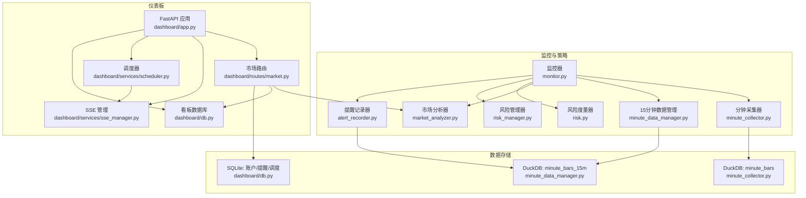
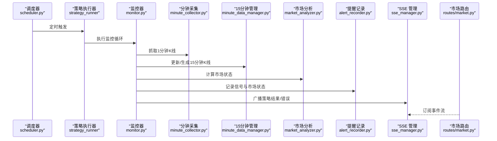
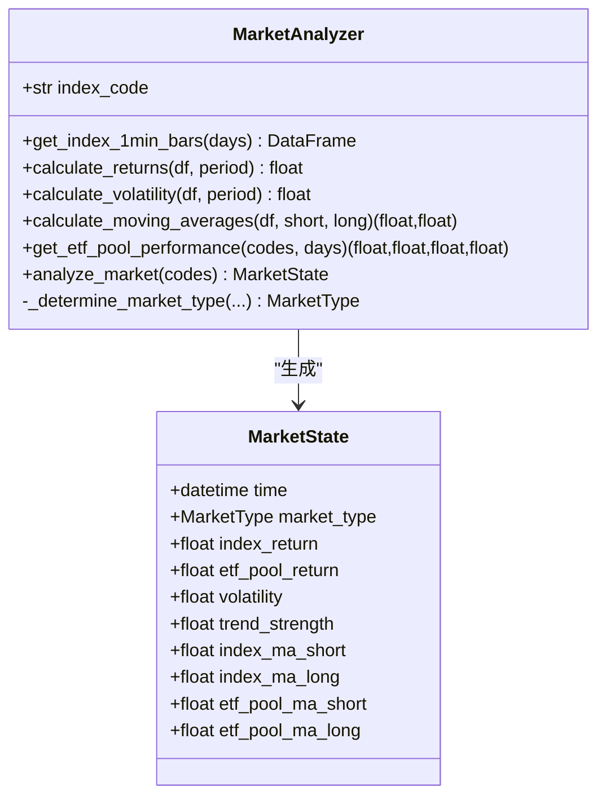
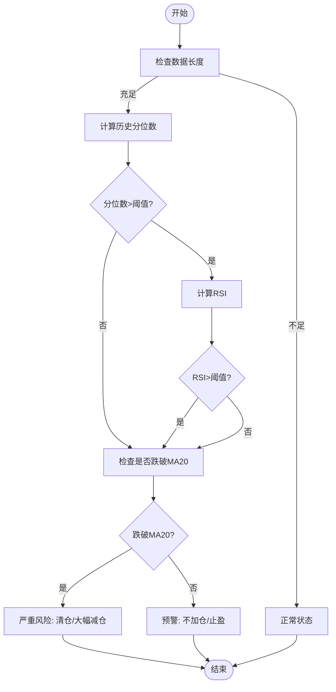
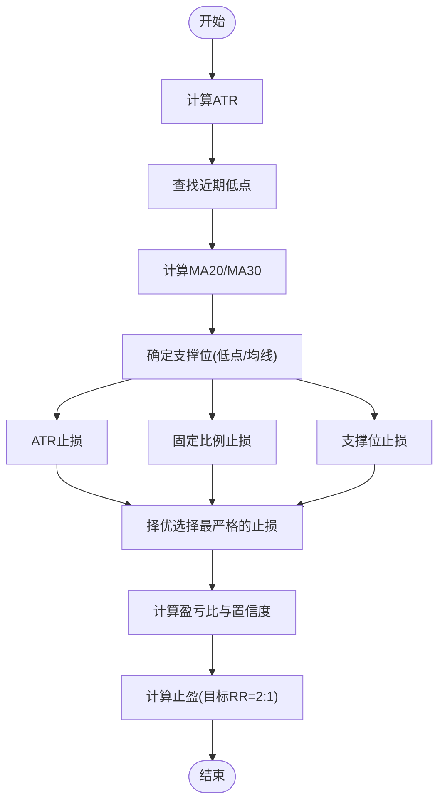
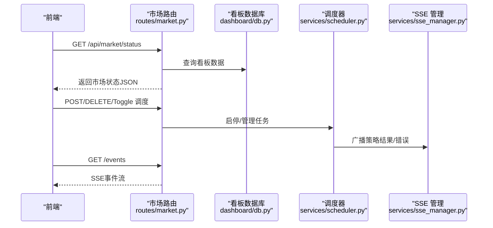
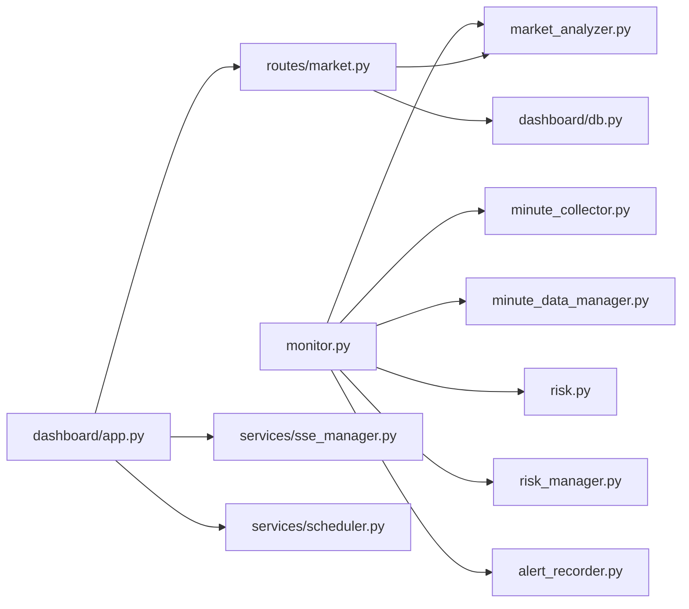

# 监控指标体系

<cite>
**本文引用的文件**
- [src/quant_etf/dashboard/app.py](file://src/quant_etf/dashboard/app.py)
- [src/quant_etf/dashboard/routes/market.py](file://src/quant_etf/dashboard/routes/market.py)
- [src/quant_etf/dashboard/services/scheduler.py](file://src/quant_etf/dashboard/services/scheduler.py)
- [src/quant_etf/dashboard/services/sse_manager.py](file://src/quant_etf/dashboard/services/sse_manager.py)
- [src/quant_etf/dashboard/db.py](file://src/quant_etf/dashboard/db.py)
- [src/quant_etf/monitor.py](file://src/quant_etf/monitor.py)
- [src/quant_etf/market_analyzer.py](file://src/quant_etf/market_analyzer.py)
- [src/quant_etf/risk.py](file://src/quant_etf/risk.py)
- [src/quant_etf/risk_manager.py](file://src/quant_etf/risk_manager.py)
- [src/quant_etf/minute_collector.py](file://src/quant_etf/minute_collector.py)
- [src/quant_etf/minute_data_manager.py](file://src/quant_etf/minute_data_manager.py)
- [src/quant_etf/alert_recorder.py](file://src/quant_etf/alert_recorder.py)
- [src/quant_etf/conf.py](file://src/quant_etf/conf.py)
</cite>

## 目录
1. [引言](#引言)
2. [项目结构](#项目结构)
3. [核心组件](#核心组件)
4. [架构总览](#架构总览)
5. [详细组件分析](#详细组件分析)
6. [依赖分析](#依赖分析)
7. [性能考虑](#性能考虑)
8. [故障排查指南](#故障排查指南)
9. [结论](#结论)
10. [附录](#附录)

## 引言
本文件面向量化ETF项目的监控指标体系，系统化阐述市场状态分析指标、风险指标体系、实时监控采集与更新机制、数据缓存策略、阈值与预警实现、可视化与报表能力，以及指标数据的存储结构、查询优化与性能监控方法。目标读者包括分析师与风控人员，帮助其理解指标定义、计算方法与使用方式，提升决策支持效率。

## 项目结构
项目采用“策略/监控/仪表板”三层组织：
- 策略与监控层：负责实时数据采集、15分钟K线生成、市场状态分析、信号生成与风险控制、提醒记录。
- 仪表板层：提供Web API、SSE事件推送、调度管理、SQLite看板数据存储。
- 数据层：DuckDB用于分钟/15分钟K线持久化；SQLite用于看板业务数据。



图表来源
- [src/quant_etf/monitor.py:1-242](file://src/quant_etf/monitor.py#L1-L242)
- [src/quant_etf/market_analyzer.py:1-263](file://src/quant_etf/market_analyzer.py#L1-L263)
- [src/quant_etf/risk.py:1-96](file://src/quant_etf/risk.py#L1-L96)
- [src/quant_etf/risk_manager.py:1-185](file://src/quant_etf/risk_manager.py#L1-L185)
- [src/quant_etf/minute_collector.py:1-505](file://src/quant_etf/minute_collector.py#L1-L505)
- [src/quant_etf/minute_data_manager.py:1-283](file://src/quant_etf/minute_data_manager.py#L1-L283)
- [src/quant_etf/alert_recorder.py:1-233](file://src/quant_etf/alert_recorder.py#L1-L233)
- [src/quant_etf/dashboard/app.py:1-107](file://src/quant_etf/dashboard/app.py#L1-L107)
- [src/quant_etf/dashboard/routes/market.py:1-116](file://src/quant_etf/dashboard/routes/market.py#L1-L116)
- [src/quant_etf/dashboard/services/scheduler.py:1-82](file://src/quant_etf/dashboard/services/scheduler.py#L1-L82)
- [src/quant_etf/dashboard/services/sse_manager.py:1-45](file://src/quant_etf/dashboard/services/sse_manager.py#L1-L45)
- [src/quant_etf/dashboard/db.py:1-133](file://src/quant_etf/dashboard/db.py#L1-L133)

章节来源
- [src/quant_etf/dashboard/app.py:1-107](file://src/quant_etf/dashboard/app.py#L1-L107)
- [src/quant_etf/dashboard/routes/market.py:1-116](file://src/quant_etf/dashboard/routes/market.py#L1-L116)
- [src/quant_etf/dashboard/services/scheduler.py:1-82](file://src/quant_etf/dashboard/services/scheduler.py#L1-L82)
- [src/quant_etf/dashboard/services/sse_manager.py:1-45](file://src/quant_etf/dashboard/services/sse_manager.py#L1-L45)
- [src/quant_etf/dashboard/db.py:1-133](file://src/quant_etf/dashboard/db.py#L1-L133)
- [src/quant_etf/monitor.py:1-242](file://src/quant_etf/monitor.py#L1-L242)
- [src/quant_etf/market_analyzer.py:1-263](file://src/quant_etf/market_analyzer.py#L1-L263)
- [src/quant_etf/risk.py:1-96](file://src/quant_etf/risk.py#L1-L96)
- [src/quant_etf/risk_manager.py:1-185](file://src/quant_etf/risk_manager.py#L1-L185)
- [src/quant_etf/minute_collector.py:1-505](file://src/quant_etf/minute_collector.py#L1-L505)
- [src/quant_etf/minute_data_manager.py:1-283](file://src/quant_etf/minute_data_manager.py#L1-L283)
- [src/quant_etf/alert_recorder.py:1-233](file://src/quant_etf/alert_recorder.py#L1-L233)
- [src/quant_etf/conf.py:1-137](file://src/quant_etf/conf.py#L1-L137)

## 核心组件
- 市场状态分析指标
  - 指数与ETF池收益：基于1分钟K线计算区间收益，区分指数与ETF池整体收益。
  - 波动率：基于1分钟收盘价的收益率序列计算标准差，并按交易分钟进行年化。
  - 市场趋势强度：取指数与ETF池收益的均值，作为趋势强度参考。
  - 均线多头/空头：短期与长期均线对比，辅助判断多头/空头市场。
  - 市场类型判定：综合波动率、收益、均线形态，输出牛市/熊市/震荡市/未知。
- 风险指标体系
  - 单标的高位风险：历史分位数与RSI超买双重确认。
  - 趋势破坏：跌破短期均线（如MA20）作为趋势破坏信号。
  - 组合风险敞口：通过ATR、支撑位、止盈/止损位与盈亏比评估每笔交易风险。
  - 技术止损：前低、均线、ATR等多维度择优选择止损位。
- 实时监控与数据缓存
  - 采集频率：1分钟K线按需抓取并入库；15分钟K线由1分钟重采样生成。
  - 更新机制：监控循环按间隔更新15分钟K线，生成信号并记录提醒。
  - 缓存策略：DuckDB内存映射+索引；SQLite WAL模式提升并发写入。
- 可视化与报表
  - SSE事件流：仪表板前端通过SSE接收策略执行结果与错误事件。
  - API接口：市场状态、概览卡片、调度管理等REST接口。
  - 历史提醒：按时间窗口查询提醒、按代码查询、统计摘要。

章节来源
- [src/quant_etf/market_analyzer.py:46-263](file://src/quant_etf/market_analyzer.py#L46-L263)
- [src/quant_etf/risk.py:18-96](file://src/quant_etf/risk.py#L18-L96)
- [src/quant_etf/risk_manager.py:26-185](file://src/quant_etf/risk_manager.py#L26-L185)
- [src/quant_etf/monitor.py:27-242](file://src/quant_etf/monitor.py#L27-L242)
- [src/quant_etf/dashboard/routes/market.py:18-52](file://src/quant_etf/dashboard/routes/market.py#L18-L52)
- [src/quant_etf/dashboard/services/sse_manager.py:10-45](file://src/quant_etf/dashboard/services/sse_manager.py#L10-L45)
- [src/quant_etf/alert_recorder.py:78-233](file://src/quant_etf/alert_recorder.py#L78-L233)

## 架构总览
下图展示从数据采集到仪表板展示的端到端流程，包括实时监控循环、指标计算、提醒记录与SSE推送。



图表来源
- [src/quant_etf/dashboard/services/scheduler.py:19-52](file://src/quant_etf/dashboard/services/scheduler.py#L19-L52)
- [src/quant_etf/monitor.py:144-201](file://src/quant_etf/monitor.py#L144-L201)
- [src/quant_etf/minute_collector.py:41-156](file://src/quant_etf/minute_collector.py#L41-L156)
- [src/quant_etf/minute_data_manager.py:229-254](file://src/quant_etf/minute_data_manager.py#L229-L254)
- [src/quant_etf/market_analyzer.py:159-213](file://src/quant_etf/market_analyzer.py#L159-L213)
- [src/quant_etf/alert_recorder.py:87-145](file://src/quant_etf/alert_recorder.py#L87-L145)
- [src/quant_etf/dashboard/services/sse_manager.py:34-41](file://src/quant_etf/dashboard/services/sse_manager.py#L34-L41)
- [src/quant_etf/dashboard/routes/market.py:18-33](file://src/quant_etf/dashboard/routes/market.py#L18-L33)

## 详细组件分析

### 市场状态分析器（MarketAnalyzer）
- 指标定义与计算
  - 收益率：取N分钟区间的收盘价变化率，用于衡量短期收益。
  - 波动率：对N分钟内收益率序列计算标准差并年化，反映短期波动程度。
  - 移动平均：计算短期与长期均线，用于趋势判断。
  - ETF池整体表现：对ETF池内标的分别计算收益与波动，再聚合得到ETF池收益、波动与均线。
  - 市场类型：综合波动率、收益均值与均线多头/空头形态，输出牛市/熊市/震荡市/未知。
- 关键阈值
  - 高波动阈值：用于识别熊市。
  - 收益阈值：用于区分牛市与震荡。
  - 趋势强度阈值：用于辅助判断震荡区间。
- 数据来源
  - 指数1分钟K线与ETF池1分钟K线，均来自DuckDB minute_bars表。



图表来源
- [src/quant_etf/market_analyzer.py:46-263](file://src/quant_etf/market_analyzer.py#L46-L263)

章节来源
- [src/quant_etf/market_analyzer.py:46-263](file://src/quant_etf/market_analyzer.py#L46-L263)

### 风险度量与风险管理
- 单标的高位风险
  - 历史分位数：以一年窗口计算当前价格的历史分位，超过阈值视为高位。
  - RSI超买：短期RSI超过阈值，提示超买风险。
  - 趋势破坏：跌破短期均线（如MA20）作为趋势破坏信号。
  - 综合判断：高位+趋势破坏触发严重风险，仅高位触发预警。
- 组合风险敞口与技术止损
  - ATR计算：衡量真实波幅，用于ATR止损。
  - 支撑位：近期低点、MA20/MA30等有效支撑位择优。
  - 止损位：ATR止损、固定比例止损与支撑位三者取“更严格”的方案。
  - 止盈位：基于盈亏比目标（示例为2:1），并与近期高点比较取较小值。
  - 风险等级：根据盈亏比给出高/中/低置信度。



图表来源
- [src/quant_etf/risk.py:39-96](file://src/quant_etf/risk.py#L39-L96)



图表来源
- [src/quant_etf/risk_manager.py:104-171](file://src/quant_etf/risk_manager.py#L104-L171)

章节来源
- [src/quant_etf/risk.py:18-96](file://src/quant_etf/risk.py#L18-L96)
- [src/quant_etf/risk_manager.py:26-185](file://src/quant_etf/risk_manager.py#L26-L185)

### 实时监控与数据缓存
- 采集与更新
  - 1分钟K线：按ETF池逐个抓取并保存至DuckDB minute_bars表。
  - 15分钟K线：从1分钟数据重采样生成，写入DuckDB minute_bars_15m表。
  - 监控循环：在交易时间内按间隔更新15分钟K线，分析市场状态，生成信号并记录提醒。
- 缓存与索引
  - DuckDB：建立code+time复合主键与索引，加速查询。
  - SQLite：WAL模式与外键约束，保障并发写入与数据一致性。
- 事件推送
  - SSE：仪表板前端通过/events订阅，接收策略执行结果与错误事件，实现准实时展示。

```mermaid
sequenceDiagram
participant Loop as "监控循环<br/>monitor.py"
participant M1 as "1分钟采集<br/>minute_collector.py"
participant M15 as "15分钟管理<br/>minute_data_manager.py"
participant DB1 as "DuckDB : minute_bars"
participant DB15 as "DuckDB : minute_bars_15m"
Loop->>M1 : 抓取各ETF 1分钟K线
M1->>DB1 : 写入分钟数据
Loop->>M15 : 更新/生成15分钟K线
M15->>DB15 : 写入15分钟数据
```

图表来源
- [src/quant_etf/monitor.py:50-80](file://src/quant_etf/monitor.py#L50-L80)
- [src/quant_etf/minute_collector.py:300-396](file://src/quant_etf/minute_collector.py#L300-L396)
- [src/quant_etf/minute_data_manager.py:110-168](file://src/quant_etf/minute_data_manager.py#L110-L168)

章节来源
- [src/quant_etf/monitor.py:27-242](file://src/quant_etf/monitor.py#L27-L242)
- [src/quant_etf/minute_collector.py:280-298](file://src/quant_etf/minute_collector.py#L280-L298)
- [src/quant_etf/minute_data_manager.py:63-70](file://src/quant_etf/minute_data_manager.py#L63-L70)
- [src/quant_etf/dashboard/services/sse_manager.py:14-32](file://src/quant_etf/dashboard/services/sse_manager.py#L14-L32)

### 仪表板与API
- 市场状态API：返回市场类型、收益、波动、趋势强度与均线多头/空头状态。
- 概览卡片：账户数、今日提醒数、调度数等。
- 调度管理：创建、删除、启停定时任务，记录最后运行时间并通过SSE广播结果。
- SSE事件：连接建立、心跳维持、事件广播。



图表来源
- [src/quant_etf/dashboard/routes/market.py:18-115](file://src/quant_etf/dashboard/routes/market.py#L18-L115)
- [src/quant_etf/dashboard/db.py:79-133](file://src/quant_etf/dashboard/db.py#L79-L133)
- [src/quant_etf/dashboard/services/scheduler.py:19-52](file://src/quant_etf/dashboard/services/scheduler.py#L19-L52)
- [src/quant_etf/dashboard/services/sse_manager.py:14-41](file://src/quant_etf/dashboard/services/sse_manager.py#L14-L41)

章节来源
- [src/quant_etf/dashboard/routes/market.py:18-115](file://src/quant_etf/dashboard/routes/market.py#L18-L115)
- [src/quant_etf/dashboard/services/scheduler.py:15-82](file://src/quant_etf/dashboard/services/scheduler.py#L15-L82)
- [src/quant_etf/dashboard/services/sse_manager.py:10-45](file://src/quant_etf/dashboard/services/sse_manager.py#L10-L45)
- [src/quant_etf/dashboard/db.py:79-133](file://src/quant_etf/dashboard/db.py#L79-L133)

### 指标阈值设定与预警机制
- 市场状态阈值
  - 高波动阈值：用于识别熊市。
  - 收益阈值：用于区分牛市与震荡。
  - 均线形态：短期均线上穿/下穿长期均线辅助判断。
- 单标的预警阈值
  - 历史分位数阈值：用于高位识别。
  - RSI超买阈值：用于超买识别。
  - 均线跌破：短期均线下穿作为趋势破坏信号。
- 风险控制阈值
  - ATR周期与风险比例：用于ATR止损与固定比例止损。
  - 盈亏比目标：示例为2:1，结合阻力位取较小值。

章节来源
- [src/quant_etf/market_analyzer.py:215-250](file://src/quant_etf/market_analyzer.py#L215-L250)
- [src/quant_etf/risk.py:21-26](file://src/quant_etf/risk.py#L21-L26)
- [src/quant_etf/risk_manager.py:29-36](file://src/quant_etf/risk_manager.py#L29-L36)

### 指标可视化与历史报表
- 可视化展示
  - SSE事件流：仪表板前端订阅/events，接收策略执行结果与错误事件，实现动态刷新。
  - 市场状态API：返回标准化JSON，便于前端渲染卡片与趋势图。
- 历史趋势与报表
  - 历史提醒查询：按时间窗口与代码查询提醒记录，支持统计摘要。
  - 调度执行记录：通过SSE广播与数据库记录，形成策略执行历史。

章节来源
- [src/quant_etf/dashboard/routes/market.py:18-52](file://src/quant_etf/dashboard/routes/market.py#L18-L52)
- [src/quant_etf/alert_recorder.py:147-233](file://src/quant_etf/alert_recorder.py#L147-L233)
- [src/quant_etf/dashboard/services/sse_manager.py:14-41](file://src/quant_etf/dashboard/services/sse_manager.py#L14-L41)

## 依赖分析
- 组件耦合
  - 监控器依赖分钟采集、15分钟管理、市场分析、风险度量与提醒记录。
  - 仪表板路由依赖市场分析与看板数据库。
  - SSE管理独立于业务逻辑，仅负责事件广播。
- 外部依赖
  - 通达信行情API：用于1分钟K线抓取。
  - DuckDB：用于分钟与15分钟K线的高性能存储与查询。
  - SQLite：用于看板业务数据（账户、提醒、调度）。



图表来源
- [src/quant_etf/monitor.py:13-24](file://src/quant_etf/monitor.py#L13-L24)
- [src/quant_etf/dashboard/routes/market.py:9-13](file://src/quant_etf/dashboard/routes/market.py#L9-L13)
- [src/quant_etf/dashboard/app.py:10-15](file://src/quant_etf/dashboard/app.py#L10-L15)

章节来源
- [src/quant_etf/monitor.py:13-24](file://src/quant_etf/monitor.py#L13-L24)
- [src/quant_etf/dashboard/routes/market.py:9-13](file://src/quant_etf/dashboard/routes/market.py#L9-L13)
- [src/quant_etf/dashboard/app.py:10-15](file://src/quant_etf/dashboard/app.py#L10-L15)

## 性能考虑
- 存储与索引
  - DuckDB：分钟与15分钟K线表均建立code+time复合主键与索引，降低查询成本。
  - SQLite：WAL模式提升写入吞吐，外键约束保障数据完整性。
- 查询优化
  - 使用LIMIT与时间范围过滤，避免全表扫描。
  - 15分钟K线由1分钟重采样生成，减少重复计算。
- 并发与稳定性
  - SSE心跳机制维持长连接，避免超时断开。
  - 调度器使用异步任务，支持启停与错误广播。
- 资源控制
  - 1分钟K线抓取失败时的冷却机制，避免频繁重试导致资源浪费。

章节来源
- [src/quant_etf/minute_collector.py:23-24](file://src/quant_etf/minute_collector.py#L23-L24)
- [src/quant_etf/minute_collector.py:253-274](file://src/quant_etf/minute_collector.py#L253-L274)
- [src/quant_etf/minute_data_manager.py:36-57](file://src/quant_etf/minute_data_manager.py#L36-L57)
- [src/quant_etf/dashboard/db.py:74-76](file://src/quant_etf/dashboard/db.py#L74-L76)
- [src/quant_etf/dashboard/services/sse_manager.py:20-28](file://src/quant_etf/dashboard/services/sse_manager.py#L20-L28)

## 故障排查指南
- 1分钟数据抓取失败
  - 现象：日志出现抓取失败与服务器冷却提示。
  - 排查：检查TDX服务器连通性与冷却时间；确认代码市场归属。
- 15分钟数据为空
  - 现象：监控循环提示无15分钟数据。
  - 排查：确认1分钟数据是否存在；检查重采样逻辑与索引。
- SSE连接异常
  - 现象：前端无法接收事件流。
  - 排查：确认/events端点访问；检查心跳与队列状态。
- 风险判断误报
  - 现象：高位未破均线却触发严重风险。
  - 排查：调整历史分位数阈值与RSI阈值；验证均线周期设置。
- 仪表板数据异常
  - 现象：概览卡片数值不正确。
  - 排查：检查看板数据库表结构与查询SQL；确认调度启停状态。

章节来源
- [src/quant_etf/minute_collector.py:90-102](file://src/quant_etf/minute_collector.py#L90-L102)
- [src/quant_etf/monitor.py:158-163](file://src/quant_etf/monitor.py#L158-L163)
- [src/quant_etf/dashboard/services/sse_manager.py:14-32](file://src/quant_etf/dashboard/services/sse_manager.py#L14-L32)
- [src/quant_etf/risk.py:56-75](file://src/quant_etf/risk.py#L56-L75)
- [src/quant_etf/dashboard/db.py:93-133](file://src/quant_etf/dashboard/db.py#L93-L133)

## 结论
本监控指标体系以分钟/15分钟K线为基础，构建了市场状态分析、单标的高位风险识别与组合风险控制三大维度。通过DuckDB与SQLite的分层存储、SSE事件推送与REST API，实现了准实时的可视化与历史报表能力。建议在实际部署中结合业务场景调优阈值与周期参数，并完善异常告警与审计日志，以进一步提升系统的稳定性与可运维性。

## 附录
- 关键配置项
  - ETF池：可在配置文件中维护ETF代码列表。
  - 策略权重与参数：可在配置文件中调整动量策略权重与参数。
- 常用查询参考
  - 最近N小时提醒：按时间窗口查询提醒表。
  - 指定代码提醒：按代码排序查询提醒表。
  - 统计摘要：按时间窗口统计提醒总数、唯一标的数、买卖信号分布等。

章节来源
- [src/quant_etf/conf.py:15-49](file://src/quant_etf/conf.py#L15-L49)
- [src/quant_etf/alert_recorder.py:147-233](file://src/quant_etf/alert_recorder.py#L147-L233)