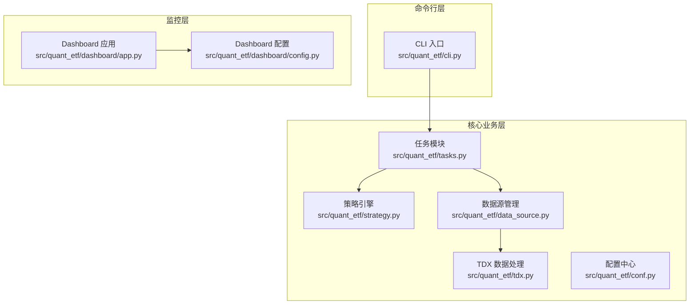
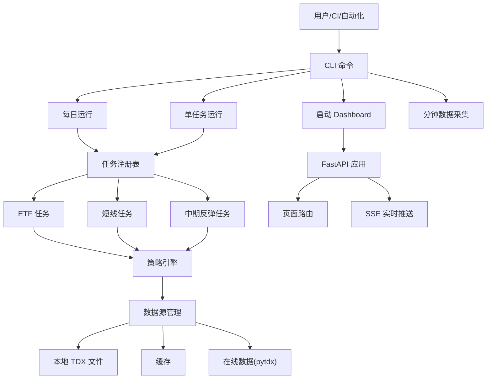
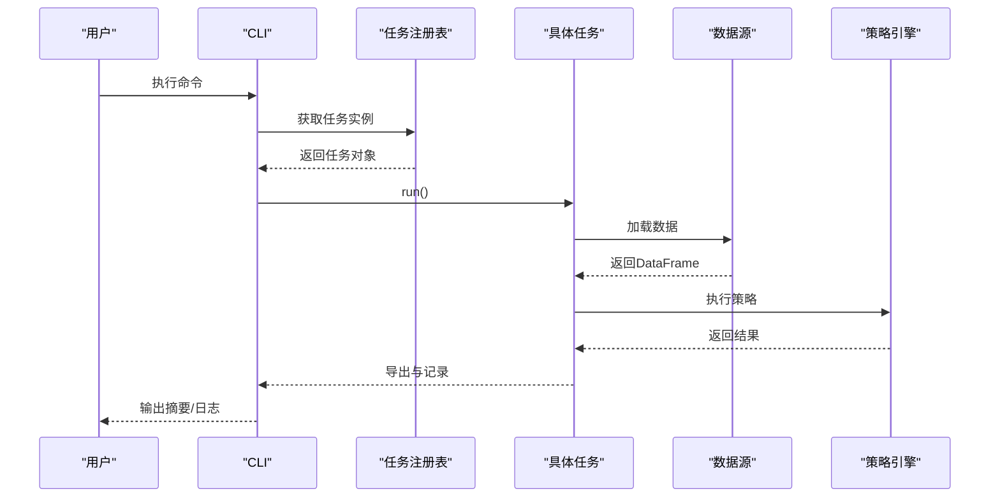
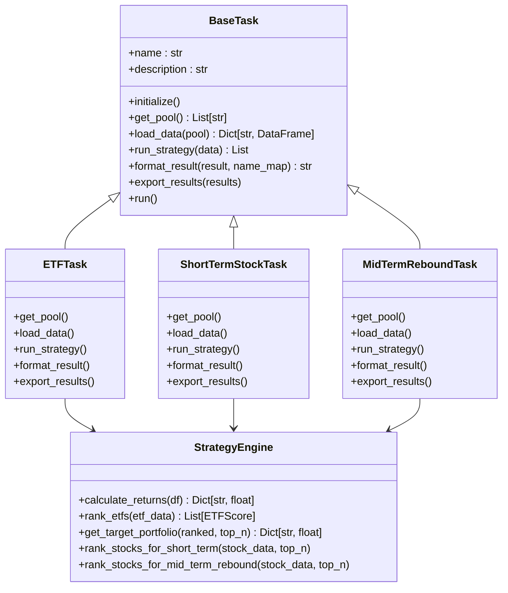
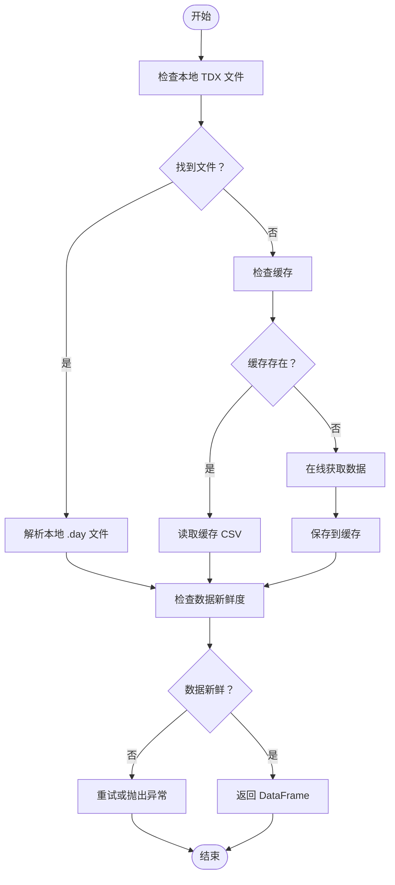
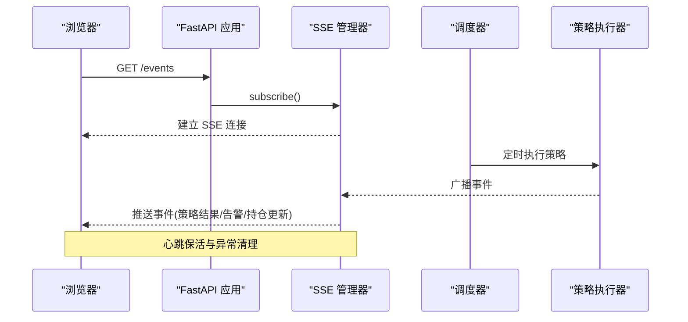
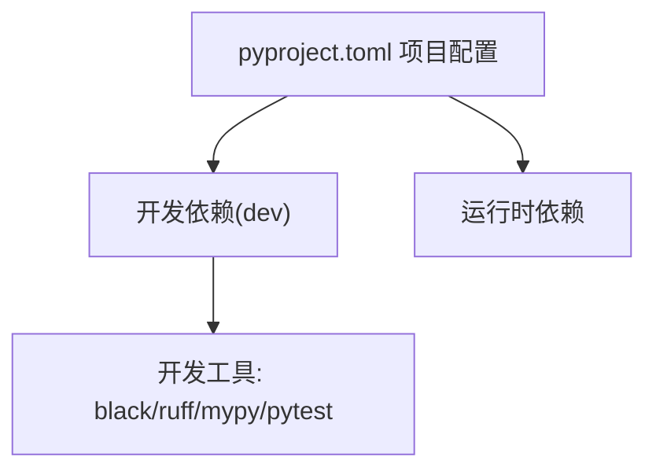

# 代码规范和约定

<cite>
**本文档引用的文件**
- [pyproject.toml](file://pyproject.toml)
- [DEVELOPMENT.md](file://DEVELOPMENT.md)
- [README.md](file://README.md)
- [src/quant_etf/__init__.py](file://src/quant_etf/__init__.py)
- [src/quant_etf/cli.py](file://src/quant_etf/cli.py)
- [src/quant_etf/conf.py](file://src/quant_etf/conf.py)
- [src/quant_etf/data_source.py](file://src/quant_etf/data_source.py)
- [src/quant_etf/tasks.py](file://src/quant_etf/tasks.py)
- [src/quant_etf/strategy.py](file://src/quant_etf/strategy.py)
- [src/quant_etf/tdx.py](file://src/quant_etf/tdx.py)
- [src/quant_etf/dashboard/app.py](file://src/quant_etf/dashboard/app.py)
- [src/quant_etf/dashboard/config.py](file://src/quant_etf/dashboard/config.py)
- [tests/test_tdx.py](file://tests/test_tdx.py)
</cite>

## 目录
1. [简介](#简介)
2. [项目结构](#项目结构)
3. [核心组件](#核心组件)
4. [架构总览](#架构总览)
5. [详细组件分析](#详细组件分析)
6. [依赖分析](#依赖分析)
7. [性能考虑](#性能考虑)
8. [故障排除指南](#故障排除指南)
9. [结论](#结论)
10. [附录](#附录)

## 简介
本文件为 Quant-ETF 项目制定全面的代码规范与约定标准，涵盖以下方面：
- Black 代码格式化使用方法与配置要点
- Ruff 静态检查规则与自动修复流程
- mypy 类型检查最佳实践与类型注解规范
- Python 代码风格指南（PEP 8 要求）
- 命名约定（变量、函数、类、模块）
- 注释与文档字符串标准格式
- 导入顺序与模块组织原则
- 代码审查检查清单与质量保证流程
- 代码示例路径（展示正确编码实践）

本规范以项目现有配置与实现为基础，结合开发指南与 README 的使用说明，形成可落地的质量标准。

## 项目结构
Quant-ETF 采用清晰的分层与功能模块化组织：
- 核心业务层：策略引擎、任务调度、数据源管理、风险控制
- 命令行接口层：统一 CLI 调度各功能
- Web 监控层：FastAPI + HTMX + SSE 的 Dashboard
- 测试层：单元测试与集成测试

**图示来源**
- [src/quant_etf/cli.py:1-403](file://src/quant_etf/cli.py#L1-L403)
- [src/quant_etf/tasks.py:1-467](file://src/quant_etf/tasks.py#L1-L467)
- [src/quant_etf/strategy.py:1-321](file://src/quant_etf/strategy.py#L1-L321)
- [src/quant_etf/data_source.py:1-381](file://src/quant_etf/data_source.py#L1-L381)
- [src/quant_etf/tdx.py:1-375](file://src/quant_etf/tdx.py#L1-L375)
- [src/quant_etf/dashboard/app.py:1-101](file://src/quant_etf/dashboard/app.py#L1-L101)
- [src/quant_etf/dashboard/config.py:1-25](file://src/quant_etf/dashboard/config.py#L1-L25)

**章节来源**
- [README.md:253-276](file://README.md#L253-L276)
- [pyproject.toml:1-53](file://pyproject.toml#L1-L53)

## 核心组件
- CLI 统一入口：负责命令解析与功能分发，支持每日运行、仪表盘、分钟数据采集、回补任务、健康检查等命令。
- 任务系统：定义抽象任务基类与具体任务（ETF、短线、中期反弹），统一执行流程与结果导出。
- 策略引擎：提供动量打分、短期/中期回测评分与目标组合生成。
- 数据源管理：实现本地 TDX 文件、缓存与在线数据三层加载策略。
- TDX 数据处理：封装文件解析与在线行情获取，支持服务器切换与缓存。
- Dashboard：基于 FastAPI + HTMX + SSE 的监控面板，提供策略、持仓、告警、市场等页面。

**章节来源**
- [src/quant_etf/cli.py:1-403](file://src/quant_etf/cli.py#L1-L403)
- [src/quant_etf/tasks.py:1-467](file://src/quant_etf/tasks.py#L1-L467)
- [src/quant_etf/strategy.py:1-321](file://src/quant_etf/strategy.py#L1-L321)
- [src/quant_etf/data_source.py:1-381](file://src/quant_etf/data_source.py#L1-L381)
- [src/quant_etf/tdx.py:1-375](file://src/quant_etf/tdx.py#L1-L375)
- [src/quant_etf/dashboard/app.py:1-101](file://src/quant_etf/dashboard/app.py#L1-L101)

## 架构总览
项目采用“CLI 统一入口 + 任务驱动 + 策略引擎 + 数据源 + Dashboard”的分层架构，配合测试与质量工具链保障稳定性。

**图示来源**
- [src/quant_etf/cli.py:324-382](file://src/quant_etf/cli.py#L324-L382)
- [src/quant_etf/tasks.py:428-467](file://src/quant_etf/tasks.py#L428-L467)
- [src/quant_etf/strategy.py:43-321](file://src/quant_etf/strategy.py#L43-L321)
- [src/quant_etf/data_source.py:189-285](file://src/quant_etf/data_source.py#L189-L285)
- [src/quant_etf/tdx.py:235-296](file://src/quant_etf/tdx.py#L235-L296)
- [src/quant_etf/dashboard/app.py:17-50](file://src/quant_etf/dashboard/app.py#L17-L50)

## 详细组件分析

### CLI 组件规范
- 命令设计：统一入口，命令语义清晰，参数约束明确。
- 日志：按日期创建日志目录与文件，便于追踪。
- 错误处理：异常捕获与错误码返回，便于 CI 与运维定位。

**图示来源**
- [src/quant_etf/cli.py:24-70](file://src/quant_etf/cli.py#L24-L70)
- [src/quant_etf/tasks.py:131-177](file://src/quant_etf/tasks.py#L131-L177)

**章节来源**
- [src/quant_etf/cli.py:1-403](file://src/quant_etf/cli.py#L1-L403)
- [src/quant_etf/tasks.py:1-467](file://src/quant_etf/tasks.py#L1-L467)

### 任务系统与策略引擎
- 抽象任务：统一初始化、数据加载、策略执行、结果格式化与导出。
- 策略引擎：动量因子加权、短期/中期评分、目标组合生成。
- 风险控制：根据风险级别调整目标权重或剔除标的。

**图示来源**
- [src/quant_etf/tasks.py:30-177](file://src/quant_etf/tasks.py#L30-L177)
- [src/quant_etf/strategy.py:43-321](file://src/quant_etf/strategy.py#L43-L321)

**章节来源**
- [src/quant_etf/tasks.py:1-467](file://src/quant_etf/tasks.py#L1-L467)
- [src/quant_etf/strategy.py:1-321](file://src/quant_etf/strategy.py#L1-L321)

### 数据源与 TDX 处理
- 三层加载策略：本地 TDX 文件 → 缓存 → 在线数据（pytdx）。
- 文件解析：统一 OHLCV 格式，计算涨跌幅，按日期排序。
- 在线获取：服务器列表与缓存，自动重试与心跳保活。

**图示来源**
- [src/quant_etf/data_source.py:189-236](file://src/quant_etf/data_source.py#L189-L236)
- [src/quant_etf/tdx.py:341-375](file://src/quant_etf/tdx.py#L341-L375)

**章节来源**
- [src/quant_etf/data_source.py:1-381](file://src/quant_etf/data_source.py#L1-L381)
- [src/quant_etf/tdx.py:1-375](file://src/quant_etf/tdx.py#L1-L375)

### Dashboard 监控系统
- 路由：页面路由与 API 路由分离，支持 HTMX 片段加载。
- SSE：事件流推送，心跳保活，异常清理。
- 配置：主机、端口、SSE 心跳、告警阈值等。

**图示来源**
- [src/quant_etf/dashboard/app.py:39-50](file://src/quant_etf/dashboard/app.py#L39-L50)
- [src/quant_etf/dashboard/config.py:16-25](file://src/quant_etf/dashboard/config.py#L16-L25)

**章节来源**
- [src/quant_etf/dashboard/app.py:1-101](file://src/quant_etf/dashboard/app.py#L1-L101)
- [src/quant_etf/dashboard/config.py:1-25](file://src/quant_etf/dashboard/config.py#L1-L25)

## 依赖分析
项目依赖分为运行时与开发时两类，开发时包含测试、格式化、静态检查、类型检查工具。

**图示来源**
- [pyproject.toml:43-52](file://pyproject.toml#L43-L52)

**章节来源**
- [pyproject.toml:1-53](file://pyproject.toml#L1-L53)

## 性能考虑
- 数据加载：优先本地文件与缓存，减少在线请求；缓存文件按日期与池规模组织，便于清理与迁移。
- 策略计算：使用向量化操作（pandas/numpy），避免逐行循环；权重归一化与截断可提升稳定性。
- 网络请求：服务器列表与缓存策略，自动重试与心跳保活，降低失败率。
- Dashboard：SSE 心跳保活，异常自动清理，避免内存泄漏。

[本节为通用指导，无需特定文件分析]

## 故障排除指南
- TDX 数据解析失败：检查本地文件路径与权限，确认 VIPDOC 目录结构。
- 在线数据获取失败：检查网络与 pytdx 安装，查看服务器切换日志。
- Dashboard 启动失败：检查端口占用与环境变量，查看启动日志。
- 测试失败：区分单元测试与集成测试，集成测试需真实数据或跳过标记。

**章节来源**
- [tests/test_tdx.py:74-175](file://tests/test_tdx.py#L74-L175)
- [src/quant_etf/tdx.py:108-137](file://src/quant_etf/tdx.py#L108-L137)
- [src/quant_etf/dashboard/app.py:53-66](file://src/quant_etf/dashboard/app.py#L53-L66)

## 结论
本规范以项目现有实现与配置为基础，明确了格式化、静态检查、类型检查、命名与注释等关键质量标准，并提供了可操作的流程与示例路径。建议团队在日常开发中严格遵循，持续改进。

[本节为总结，无需特定文件分析]

## 附录

### 代码规范与约定

#### Black 代码格式化
- 使用范围：所有 Python 源代码与测试文件。
- 常用命令：
  - 格式化：uv run black src/ tests/
  - 检查：uv run black --check src/ tests/
- 项目现状：开发指南中已提供完整命令与说明。

**章节来源**
- [DEVELOPMENT.md:126-136](file://DEVELOPMENT.md#L126-L136)

#### Ruff 静态检查
- 使用范围：src/ 与 tests/。
- 常用命令：
  - 运行检查：uv run ruff check src/ tests/
  - 自动修复：uv run ruff check --fix src/ tests/
- 项目现状：开发指南中已提供完整命令与说明。

**章节来源**
- [DEVELOPMENT.md:138-148](file://DEVELOPMENT.md#L138-L148)

#### mypy 类型检查
- 使用范围：src/。
- 常用命令：uv run mypy src/
- 项目现状：开发指南中已提供完整命令与说明。

**章节来源**
- [DEVELOPMENT.md:150-156](file://DEVELOPMENT.md#L150-L156)

#### Python 代码风格与 PEP 8
- 命名：模块与包使用小写下划线；类名使用 PascalCase；函数与变量使用小写下划线；常量使用大写下划线。
- 导入：标准库、第三方库、项目内模块分组，每组之间空一行；同一组内按字母排序。
- 缩进：统一使用 4 空格；行宽不超过 88（可放宽至 100）。
- 注释：单行注释与代码至少 2 空格；多行注释使用三引号文档字符串。
- 空行：函数与类之间空两行；方法之间空一行；逻辑块之间空一行。
- 异常：明确异常类型与消息；避免裸露 except；记录日志。

[本节为通用规范，无需特定文件分析]

#### 命名约定
- 模块：小写下划线，如 data_source.py、strategy.py。
- 类：PascalCase，如 BaseTask、StrategyEngine。
- 函数/方法：小写下划线，如 get_pool、load_data。
- 变量：小写下划线，如 target_date、top_n。
- 常量：大写下划线，如 TOP_N、MOMENTUM_WEIGHTS。
- 类型别名：使用 typing 中的类型别名，如 List[str]、Dict[str, Any]。

**章节来源**
- [src/quant_etf/tasks.py:30-467](file://src/quant_etf/tasks.py#L30-L467)
- [src/quant_etf/strategy.py:9-42](file://src/quant_etf/strategy.py#L9-L42)
- [src/quant_etf/conf.py:118-129](file://src/quant_etf/conf.py#L118-L129)

#### 注释与文档字符串
- 模块文档字符串：位于模块顶部，简述模块职责。
- 类文档字符串：描述类目的、行为与关键属性。
- 函数/方法文档字符串：说明输入、输出、异常与注意事项。
- 行内注释：解释复杂逻辑或边界条件，避免显而易见的注释。

**章节来源**
- [src/quant_etf/__init__.py:1-5](file://src/quant_etf/__init__.py#L1-L5)
- [src/quant_etf/data_source.py:15-28](file://src/quant_etf/data_source.py#L15-L28)
- [src/quant_etf/strategy.py:43-60](file://src/quant_etf/strategy.py#L43-L60)

#### 导入顺序与模块组织
- 标准库：import os, import sys 等。
- 第三方库：import pandas, import fastapi 等。
- 项目内模块：from quant_etf import ...。
- 同一组内按字母排序，不同组间空一行。
- 避免相对导入，使用绝对导入。

**章节来源**
- [src/quant_etf/cli.py:18-22](file://src/quant_etf/cli.py#L18-L22)
- [src/quant_etf/data_source.py:1-12](file://src/quant_etf/data_source.py#L1-L12)

#### 代码审查检查清单
- 代码风格：通过 Black 与 Ruff 检查。
- 类型安全：mypy 无报错。
- 单元测试：新增/修改功能配套测试，覆盖率达标。
- 集成测试：涉及外部数据或网络的场景，提供跳过策略或模拟。
- 日志与异常：关键路径有日志；异常被捕获并记录。
- 文档：公共接口有文档字符串；复杂逻辑有注释。
- 性能：避免重复 IO 与网络请求；缓存策略合理。

**章节来源**
- [DEVELOPMENT.md:124-183](file://DEVELOPMENT.md#L124-L183)
- [tests/test_tdx.py:1-175](file://tests/test_tdx.py#L1-L175)

#### 质量保证流程
- 开发阶段：本地格式化（Black）、静态检查（Ruff）、类型检查（mypy）、测试（pytest）。
- 提交阶段：遵循 Conventional Commits 规范，附带变更说明与测试结果。
- 合并与部署：CI 自动执行上述流程，通过后方可合并。

**章节来源**
- [DEVELOPMENT.md:185-231](file://DEVELOPMENT.md#L185-L231)
- [pyproject.toml:48-52](file://pyproject.toml#L48-L52)

#### 代码示例（示例路径）
- CLI 命令示例：[src/quant_etf/cli.py:24-70](file://src/quant_etf/cli.py#L24-L70)
- 任务执行流程：[src/quant_etf/tasks.py:131-177](file://src/quant_etf/tasks.py#L131-L177)
- 策略评分示例：[src/quant_etf/strategy.py:103-140](file://src/quant_etf/strategy.py#L103-L140)
- 数据加载与缓存：[src/quant_etf/data_source.py:189-236](file://src/quant_etf/data_source.py#L189-L236)
- TDX 文件解析：[src/quant_etf/tdx.py:341-375](file://src/quant_etf/tdx.py#L341-L375)
- Dashboard 启动与路由：[src/quant_etf/dashboard/app.py:17-50](file://src/quant_etf/dashboard/app.py#L17-L50)
- 测试用例示例：[tests/test_tdx.py:74-175](file://tests/test_tdx.py#L74-L175)

**章节来源**
- [src/quant_etf/cli.py:1-403](file://src/quant_etf/cli.py#L1-L403)
- [src/quant_etf/tasks.py:1-467](file://src/quant_etf/tasks.py#L1-L467)
- [src/quant_etf/strategy.py:1-321](file://src/quant_etf/strategy.py#L1-L321)
- [src/quant_etf/data_source.py:1-381](file://src/quant_etf/data_source.py#L1-L381)
- [src/quant_etf/tdx.py:1-375](file://src/quant_etf/tdx.py#L1-L375)
- [src/quant_etf/dashboard/app.py:1-101](file://src/quant_etf/dashboard/app.py#L1-L101)
- [tests/test_tdx.py:1-175](file://tests/test_tdx.py#L1-L175)