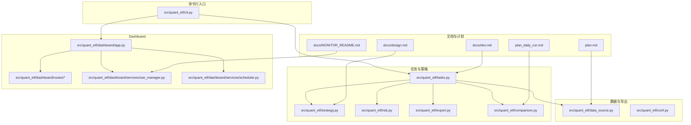
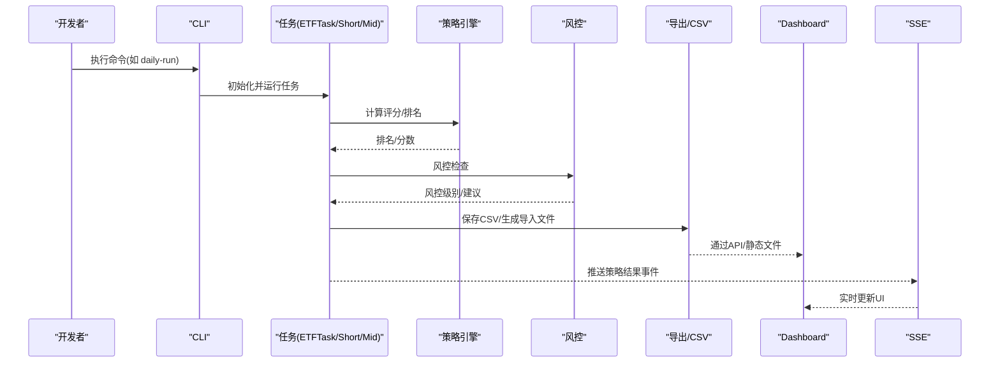
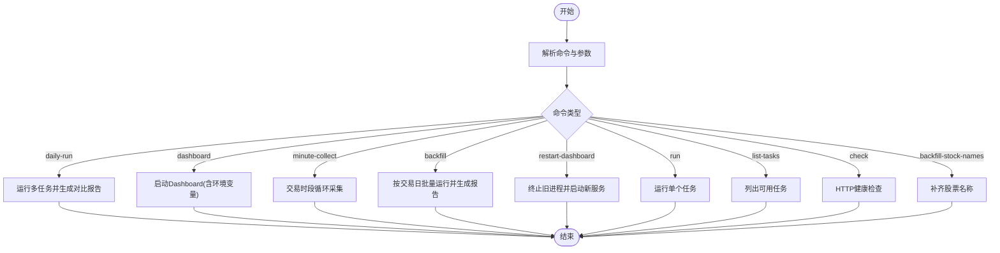
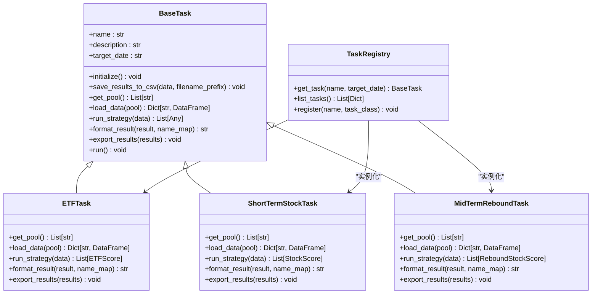
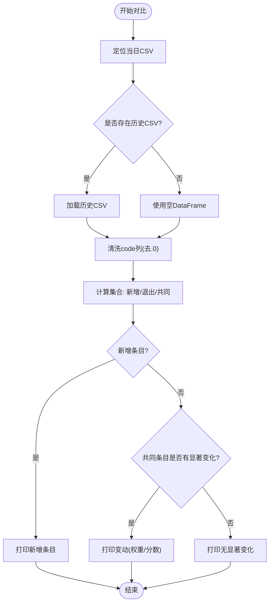
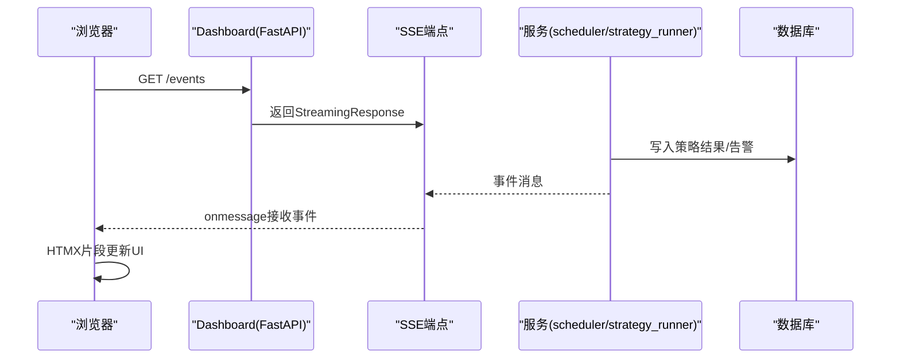
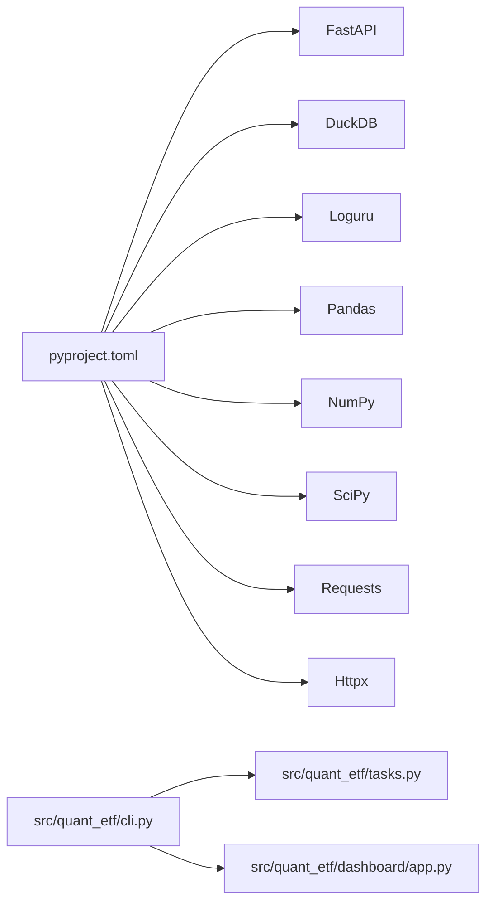

# 代码贡献流程

<cite>
**本文引用的文件**
- [README.md](file://README.md)
- [DEVELOPMENT.md](file://DEVELOPMENT.md)
- [pyproject.toml](file://pyproject.toml)
- [src/quant_etf/cli.py](file://src/quant_etf/cli.py)
- [src/quant_etf/tasks.py](file://src/quant_etf/tasks.py)
- [src/quant_etf/comparison.py](file://src/quant_etf/comparison.py)
- [src/quant_etf/dashboard/app.py](file://src/quant_etf/dashboard/app.py)
- [docs/design.md](file://docs/design.md)
- [docs/MONITOR_README.md](file://docs/MONITOR_README.md)
- [plan.md](file://plan.md)
- [plan_daily_run.md](file://plan_daily_run.md)
</cite>

## 目录
1. [简介](#简介)
2. [项目结构](#项目结构)
3. [核心组件](#核心组件)
4. [架构总览](#架构总览)
5. [详细组件分析](#详细组件分析)
6. [依赖分析](#依赖分析)
7. [性能考虑](#性能考虑)
8. [故障排除指南](#故障排除指南)
9. [结论](#结论)
10. [附录](#附录)

## 简介
本指南面向希望为 Quant-ETF 项目贡献代码的开发者，提供标准化的贡献流程，涵盖 Git 工作流、提交规范、Pull Request 审查、Issue 管理、版本发布与变更日志维护、贡献者协议与开源许可、以及社区协作规范。项目采用统一 CLI、模块化任务体系与 Dashboard 监控系统，支持动量策略驱动的 ETF 选股与短线监控。

## 项目结构
项目采用模块化分层结构，核心入口通过 CLI 统一分发，任务模块负责策略执行与结果导出，Dashboard 提供可视化监控与 SSE 实时推送，数据与结果以 CSV/DuckDB/SQLite 存储。

**图示来源**
- [src/quant_etf/cli.py:1-403](file://src/quant_etf/cli.py#L1-L403)
- [src/quant_etf/tasks.py:1-467](file://src/quant_etf/tasks.py#L1-L467)
- [src/quant_etf/comparison.py:1-129](file://src/quant_etf/comparison.py#L1-L129)
- [src/quant_etf/dashboard/app.py:1-107](file://src/quant_etf/dashboard/app.py#L1-L107)
- [docs/design.md:1-118](file://docs/design.md#L1-L118)
- [docs/MONITOR_README.md:1-220](file://docs/MONITOR_README.md#L1-L220)
- [plan.md:1-26](file://plan.md#L1-L26)
- [plan_daily_run.md:1-59](file://plan_daily_run.md#L1-L59)

**章节来源**
- [README.md:253-276](file://README.md#L253-L276)
- [src/quant_etf/cli.py:324-382](file://src/quant_etf/cli.py#L324-L382)
- [src/quant_etf/tasks.py:428-467](file://src/quant_etf/tasks.py#L428-L467)

## 核心组件
- CLI 统一入口：提供 daily-run、dashboard、minute-collect、backfill、restart-dashboard、run、list-tasks、check、backfill-stock-names 等命令，集中参数解析与命令分发。
- 任务体系：BaseTask 抽象基类定义标准流程，ETFTask/ShortTermStockTask/MidTermReboundTask 实现具体策略，TaskRegistry 管理任务注册与实例化。
- 比较模块：ResultComparator 对比当日与历史 CSV 结果，生成调仓建议报告。
- Dashboard：FastAPI + HTMX + SSE，提供策略结果、持仓、监控、告警等页面与实时事件推送。
- 文档与计划：设计文档、监控说明、开发计划与每日运行计划指导功能演进。

**章节来源**
- [src/quant_etf/cli.py:24-382](file://src/quant_etf/cli.py#L24-L382)
- [src/quant_etf/tasks.py:30-177](file://src/quant_etf/tasks.py#L30-L177)
- [src/quant_etf/comparison.py:8-129](file://src/quant_etf/comparison.py#L8-L129)
- [src/quant_etf/dashboard/app.py:17-102](file://src/quant_etf/dashboard/app.py#L17-L102)
- [docs/design.md:1-118](file://docs/design.md#L1-L118)
- [docs/MONITOR_README.md:1-220](file://docs/MONITOR_README.md#L1-L220)

## 架构总览
项目采用“CLI -> 任务 -> 策略/风控 -> 导出/CSV -> Dashboard/SSE”的主流程；数据源支持本地 TDX 文件与在线获取，结果持久化至 CSV/DuckDB/SQLite，Dashboard 通过 SSE 实时推送策略结果与告警。

**图示来源**
- [src/quant_etf/cli.py:24-70](file://src/quant_etf/cli.py#L24-L70)
- [src/quant_etf/tasks.py:131-177](file://src/quant_etf/tasks.py#L131-L177)
- [src/quant_etf/comparison.py:37-129](file://src/quant_etf/comparison.py#L37-L129)
- [src/quant_etf/dashboard/app.py:39-50](file://src/quant_etf/dashboard/app.py#L39-L50)

## 详细组件分析

### CLI 工作流与命令分发
- daily-run：支持指定日期或最近 N 天，逐日运行 etf/short/mid 任务，并生成对比报告。
- dashboard：支持端口/主机/热重载配置，启动 FastAPI 应用。
- minute-collect：交易时段内每分钟采集 ALL_POOL 标的的 1 分钟 K 线。
- backfill：批量补跑历史日期任务并生成报告。
- restart-dashboard：查找并终止旧进程，再启动新服务。
- run/list-tasks/check/backfill-stock-names：单任务运行、列出任务、健康检查、补齐股票名称。

**图示来源**
- [src/quant_etf/cli.py:24-382](file://src/quant_etf/cli.py#L24-L382)

**章节来源**
- [src/quant_etf/cli.py:24-382](file://src/quant_etf/cli.py#L24-L382)
- [README.md:70-230](file://README.md#L70-L230)

### 任务执行与导出流程
- BaseTask.run：初始化数据源/策略/风控，按目标日期过滤数据，执行策略，格式化输出，导出 CSV 与 TDX 导入文件。
- ETFTask：ETF 动量打分，风控等级影响目标权重，导出 CSV 与 TDX 公式/板块文件。
- Short/Mid：分别输出不同字段的 CSV 与 TDX 股票板块文件。
- TaskRegistry：任务注册与实例化，支持按名称获取任务。

**图示来源**
- [src/quant_etf/tasks.py:30-467](file://src/quant_etf/tasks.py#L30-L467)

**章节来源**
- [src/quant_etf/tasks.py:30-177](file://src/quant_etf/tasks.py#L30-L177)
- [src/quant_etf/tasks.py:179-295](file://src/quant_etf/tasks.py#L179-L295)
- [src/quant_etf/tasks.py:297-426](file://src/quant_etf/tasks.py#L297-L426)
- [src/quant_etf/tasks.py:428-467](file://src/quant_etf/tasks.py#L428-L467)

### 对比与报告生成
- ResultComparator：查找最近历史 CSV，对比新增、退出与变动项，生成格式化报告；支持 ETF 的权重变动与短/中期的分数变动。

**图示来源**
- [src/quant_etf/comparison.py:37-129](file://src/quant_etf/comparison.py#L37-L129)

**章节来源**
- [src/quant_etf/comparison.py:8-129](file://src/quant_etf/comparison.py#L8-L129)
- [plan_daily_run.md:20-59](file://plan_daily_run.md#L20-L59)

### Dashboard 与 SSE 实时推送
- FastAPI 应用挂载页面与 API 路由，SSE 端点提供事件流，启动/关闭事件中初始化数据库与调度器。
- SSE 事件类型：connected、strategy_result、strategy_error、alert、portfolio_update。

**图示来源**
- [src/quant_etf/dashboard/app.py:17-102](file://src/quant_etf/dashboard/app.py#L17-L102)

**章节来源**
- [src/quant_etf/dashboard/app.py:17-102](file://src/quant_etf/dashboard/app.py#L17-L102)
- [README.md:319-470](file://README.md#L319-L470)

## 依赖分析
- 项目使用 uv 作为包管理器，依赖声明集中在 pyproject.toml，包含 FastAPI、DuckDB、loguru、pandas、numpy、scipy、requests、httpx 等。
- CLI 通过脚本入口注册，统一命令分发；测试标记 integration 用于跳过需要真实服务器连接的测试。

**图示来源**
- [pyproject.toml:1-53](file://pyproject.toml#L1-L53)
- [src/quant_etf/cli.py:324-382](file://src/quant_etf/cli.py#L324-L382)

**章节来源**
- [pyproject.toml:1-53](file://pyproject.toml#L1-L53)
- [DEVELOPMENT.md:47-74](file://DEVELOPMENT.md#L47-L74)

## 性能考虑
- 数据加载与过滤：按目标日期对数据进行切片过滤，减少策略计算范围。
- CSV 导出：数值列保留三位小数，统一列顺序，便于对比与导入。
- SSE 心跳：30 秒心跳保活，避免长时间无事件导致连接中断。
- 依赖锁定：通过本地 wheel 安装 pytdx，避免镜像源不稳定带来的性能与一致性问题。

**章节来源**
- [src/quant_etf/tasks.py:148-154](file://src/quant_etf/tasks.py#L148-L154)
- [src/quant_etf/tasks.py:88-94](file://src/quant_etf/tasks.py#L88-L94)
- [README.md:438-470](file://README.md#L438-L470)
- [plan.md:1-26](file://plan.md#L1-L26)

## 故障排除指南
- 测试失败（Linux）：跳过集成测试或设置 TDX_DATA_PATH 指向真实数据目录。
- 在线数据获取失败：检查 pytdx 是否正确安装与网络连通性。
- Dashboard 健康检查：使用 CLI check 命令验证各页面路由状态码与响应长度。
- 依赖安装问题：使用本地 wheel 安装 pytdx，确保版本与来源一致。

**章节来源**
- [README.md:299-316](file://README.md#L299-L316)
- [src/quant_etf/cli.py:309-322](file://src/quant_etf/cli.py#L309-L322)
- [plan.md:14-21](file://plan.md#L14-L21)

## 结论
本指南提供了从 Git 工作流到代码审查、从 Issue 管理到版本发布的完整贡献流程。建议贡献者遵循 Conventional Commits、统一 CLI、模块化任务与 Dashboard 的设计原则，确保代码质量、测试覆盖率与文档完整性，推动项目稳健演进。

## 附录

### Git 工作流程与分支策略
- 创建功能分支：基于主分支创建 feature/xxx 分支，保持单一功能点。
- 提交规范：采用 Conventional Commits，明确 type/scope/subject，必要时在 body/footer 补充上下文与关联 Issue。
- 合并策略：通过 Pull Request 合并，优先使用 squash merge 保持提交历史整洁。

**章节来源**
- [DEVELOPMENT.md:158-197](file://DEVELOPMENT.md#L158-L197)

### Conventional Commits 提交规范
- 格式：<type>(<scope>): <subject>
- Type 类型：
  - feat：新功能
  - fix：Bug 修复
  - docs：文档更新
  - style：代码风格（不影响功能）
  - refactor：重构
  - test：测试相关
  - chore：构建/工具相关
- 示例：feat(data-source): 添加在线数据获取支持

**章节来源**
- [DEVELOPMENT.md:198-231](file://DEVELOPMENT.md#L198-L231)

### Pull Request 创建与审查流程
- 创建 PR：在功能分支完成后创建 PR，填写标题与描述，关联相关 Issue。
- 审查标准：
  - 代码质量：遵循 Black/Ruff/mypy 规范，逻辑清晰、注释充分。
  - 测试覆盖率：新增/修改功能需配套单元测试，尽量覆盖边界条件。
  - 文档完整性：更新 README/设计文档/计划文档，保持内外一致。
  - 兼容性：避免破坏现有 CLI 与 API，必要时提供迁移说明。
- 审查清单：
  - 是否满足 Conventional Commits
  - 是否通过格式化与 Lint
  - 是否通过测试（含集成测试）
  - 是否更新相关文档
  - 是否影响 Dashboard 或 CLI 行为

**章节来源**
- [DEVELOPMENT.md:124-157](file://DEVELOPMENT.md#L124-L157)
- [DEVELOPMENT.md:96-123](file://DEVELOPMENT.md#L96-L123)

### Issue 管理与 Bug 报告模板
- Issue 类型：功能请求、Bug 报告、文档改进、性能优化、安全问题。
- Bug 报告模板建议包含：
  - 复现步骤
  - 预期行为与实际行为
  - 环境信息（Python 版本、操作系统、依赖版本）
  - 日志与截图（如适用）
- 计划与追踪：使用 plan_*.md 与 issue 关联，确保迭代可追踪。

**章节来源**
- [plan.md:1-26](file://plan.md#L1-L26)
- [plan_daily_run.md:1-59](file://plan_daily_run.md#L1-L59)

### 版本发布与变更日志维护
- 版本号：遵循语义化版本（主.次.修订），在 pyproject.toml 中维护。
- 发布流程：
  - 合并 PR 至主分支
  - 更新变更日志（CHANGELOG 或 README 中的变更记录）
  - 打标签并发布
- 变更日志要点：新增功能、修复缺陷、破坏性变更、依赖升级、性能改进。

**章节来源**
- [pyproject.toml:1-53](file://pyproject.toml#L1-L53)

### 贡献者协议与开源许可
- 许可证：MIT License，允许自由使用、复制、修改与分发，需保留版权与许可声明。
- 贡献者协议：建议在首次提交时签署 CLA（如项目启用），确保版权归属清晰。

**章节来源**
- [README.md:587-590](file://README.md#L587-L590)

### 社区交流渠道与协作规范
- 交流渠道：建议使用项目内 Issue/PR 讨论，重要决策在文档中沉淀。
- 协作规范：尊重他人、保持开放、聚焦问题本身、及时响应审查意见。

**章节来源**
- [README.md:587-590](file://README.md#L587-L590)

### 如何为项目做出贡献
- 功能开发：在 src/quant_etf/ 下新增模块，遵循 CLI 与任务体系，补充测试与文档。
- Bug 修复：定位问题、编写最小复现、修复并增加测试，更新相关文档。
- 文档改进：完善 README、设计文档、监控说明与计划文档，确保与代码一致。

**章节来源**
- [docs/design.md:1-118](file://docs/design.md#L1-L118)
- [docs/MONITOR_README.md:1-220](file://docs/MONITOR_README.md#L1-L220)
- [DEVELOPMENT.md:232-278](file://DEVELOPMENT.md#L232-L278)