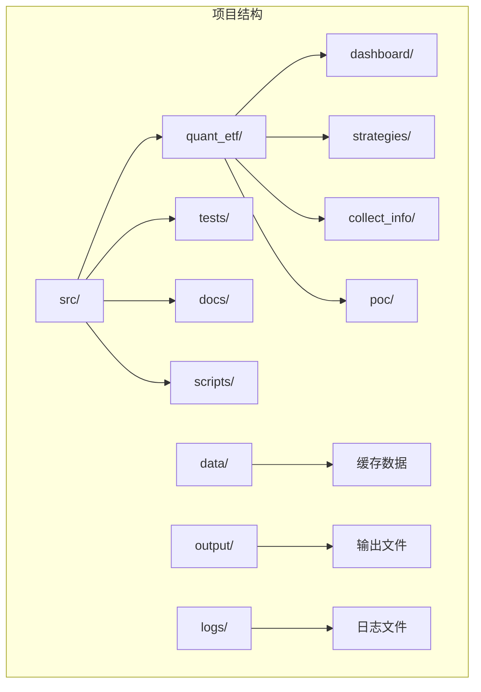
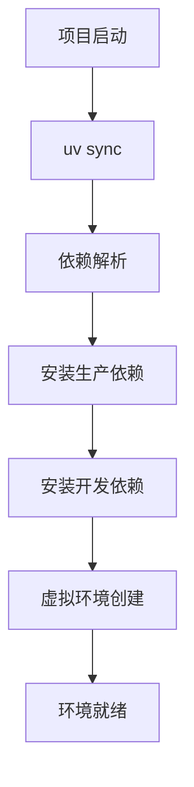
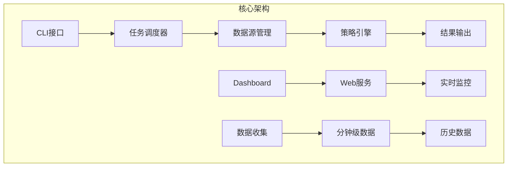
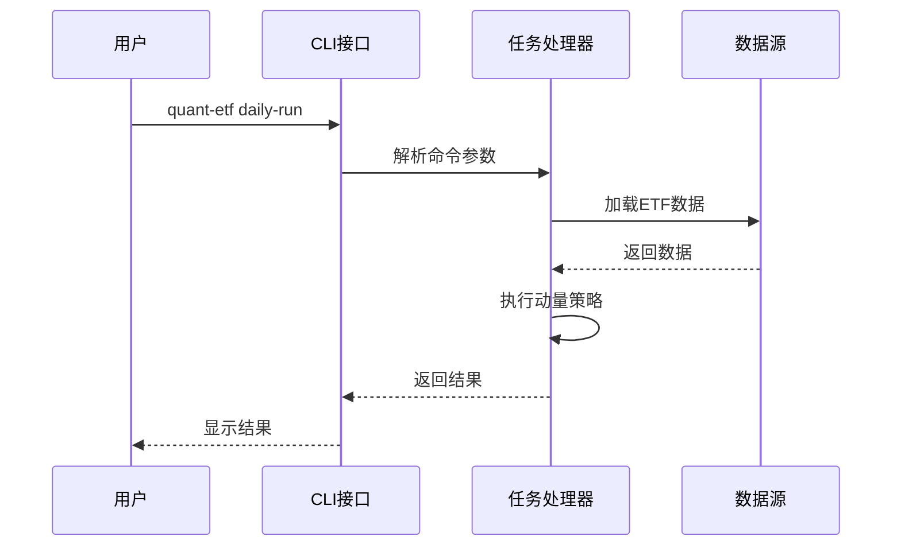
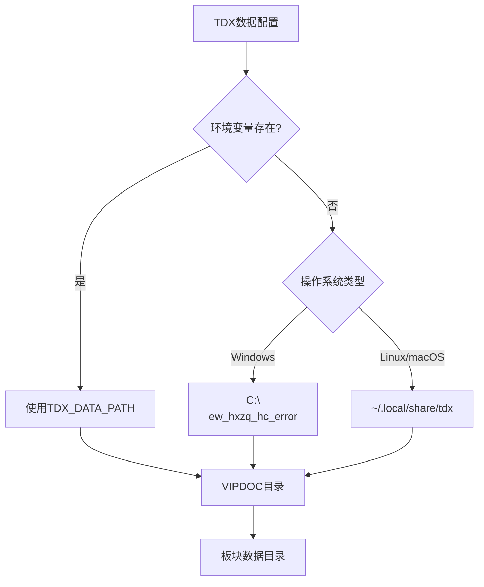
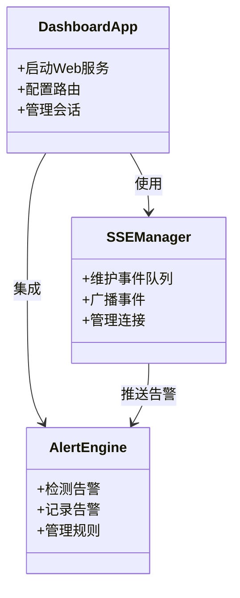

# 开发环境搭建

<cite>
**本文档引用的文件**
- [pyproject.toml](file://pyproject.toml)
- [DEVELOPMENT.md](file://DEVELOPMENT.md)
- [README.md](file://README.md)
- [uv.lock](file://uv.lock)
- [src/quant_etf/cli.py](file://src/quant_etf/cli.py)
- [src/quant_etf/conf.py](file://src/quant_etf/conf.py)
- [docs/RUN_STEPS.md](file://docs/RUN_STEPS.md)
</cite>

## 目录
1. [简介](#简介)
2. [项目结构](#项目结构)
3. [核心组件](#核心组件)
4. [架构概览](#架构概览)
5. [详细组件分析](#详细组件分析)
6. [依赖分析](#依赖分析)
7. [性能考虑](#性能考虑)
8. [故障排除指南](#故障排除指南)
9. [结论](#结论)

## 简介

Quant-ETF项目是一个基于动量策略的ETF选股工具，集成了通达信(TDX)数据源，提供了完整的量化交易解决方案。该项目采用现代化的Python开发技术栈，包括FastAPI、DuckDB、Jinja2等核心技术。

## 项目结构

项目采用清晰的分层架构设计：

```
quant-etf/
├── src/                           # 源代码目录
│   ├── quant_etf/                 # 主要业务逻辑
│   │   ├── dashboard/            # Dashboard监控系统
│   │   ├── strategies/           # 策略模块
│   │   ├── collect_info/         # 数据收集模块
│   │   └── poc/                  # 概念验证模块
├── tests/                         # 测试文件
├── docs/                          # 文档资源
├── scripts/                       # 工具脚本
├── data/                          # 数据缓存目录
├── output/                        # 输出文件目录
├── logs/                          # 日志目录
├── pyproject.toml                 # 项目配置文件
└── uv.lock                       # 依赖锁定文件
```



**图表来源**
- [pyproject.toml:1-53](file://pyproject.toml#L1-L53)
- [src/quant_etf/cli.py:1-403](file://src/quant_etf/cli.py#L1-L403)

**章节来源**
- [pyproject.toml:1-53](file://pyproject.toml#L1-L53)
- [DEVELOPMENT.md:47-74](file://DEVELOPMENT.md#L47-L74)

## 核心组件

### Python版本要求

项目对Python版本有严格的要求：
- **生产环境**: Python 3.12+ (项目配置)
- **开发环境**: Python 3.11+ (开发文档要求)

### 依赖管理

项目采用uv作为主要的包管理器，提供了快速、可靠的依赖管理能力：



**图表来源**
- [pyproject.toml:6](file://pyproject.toml#L6)
- [DEVELOPMENT.md:28-35](file://DEVELOPMENT.md#L28-L35)

**章节来源**
- [pyproject.toml:6](file://pyproject.toml#L6)
- [DEVELOPMENT.md:17-18](file://DEVELOPMENT.md#L17-L18)

## 架构概览

项目采用模块化的架构设计，主要包含以下几个核心模块：



**图表来源**
- [src/quant_etf/cli.py:324-382](file://src/quant_etf/cli.py#L324-L382)
- [src/quant_etf/conf.py:15-49](file://src/quant_etf/conf.py#L15-L49)

## 详细组件分析

### CLI命令系统

项目提供了统一的命令行接口，支持多种操作模式：



**图表来源**
- [src/quant_etf/cli.py:24-70](file://src/quant_etf/cli.py#L24-L70)
- [src/quant_etf/cli.py:372-382](file://src/quant_etf/cli.py#L372-L382)

### 数据配置系统

项目支持灵活的数据源配置，包括本地TDX文件、缓存和在线数据：



**图表来源**
- [src/quant_etf/conf.py:100-116](file://src/quant_etf/conf.py#L100-L116)

**章节来源**
- [src/quant_etf/cli.py:324-382](file://src/quant_etf/cli.py#L324-L382)
- [src/quant_etf/conf.py:100-116](file://src/quant_etf/conf.py#L100-L116)

### Dashboard监控系统

项目内置了完整的监控系统，基于FastAPI和SSE实现实时数据推送：



**图表来源**
- [src/quant_etf/cli.py:72-83](file://src/quant_etf/cli.py#L72-L83)
- [src/quant_etf/conf.py:120-128](file://src/quant_etf/conf.py#L120-L128)

**章节来源**
- [src/quant_etf/cli.py:72-83](file://src/quant_etf/cli.py#L72-L83)
- [src/quant_etf/conf.py:120-128](file://src/quant_etf/conf.py#L120-L128)

## 依赖分析

### 生产依赖

项目的核心生产依赖包括：

| 依赖包 | 版本要求 | 用途 |
|--------|----------|------|
| loguru | >=0.7.3 | 日志记录 |
| numpy | >=2.4.0 | 数值计算 |
| pandas | >=2.3.3 | 数据处理 |
| fastapi | >=0.110.0 | Web框架 |
| duckdb | >=1.5.0 | 数据库 |
| jinja2 | >=3.1.0 | 模板引擎 |

### 开发依赖

开发环境需要额外的工具依赖：

| 工具 | 版本要求 | 用途 |
|------|----------|------|
| pytest | >=9.0.2 | 测试框架 |
| black | - | 代码格式化 |
| ruff | - | 代码检查 |
| mypy | - | 类型检查 |

**章节来源**
- [pyproject.toml:7-22](file://pyproject.toml#L7-L22)
- [pyproject.toml:43-46](file://pyproject.toml#L43-L46)

## 性能考虑

### 依赖优化

项目采用了多种性能优化策略：

1. **并行处理**: 使用uv进行并行依赖安装
2. **缓存机制**: 内置数据缓存减少重复下载
3. **增量更新**: 支持增量数据更新而非全量更新
4. **内存管理**: 合理的数据结构设计避免内存泄漏

### 数据处理优化

- 使用NumPy和Pandas进行高效数值计算
- DuckDB提供高性能的SQL查询能力
- SSE实现实时数据推送，减少轮询开销

## 故障排除指南

### 常见问题及解决方案

#### Python版本不兼容

**问题**: Python版本低于3.12
**解决方案**: 升级到Python 3.12+

#### 依赖安装失败

**问题**: uv安装依赖时出现错误
**解决方案**: 
1. 清理缓存: `uv cache clean`
2. 更新索引: `uv pip index update`
3. 重新安装: `uv sync --reinstall`

#### 数据源配置错误

**问题**: TDX数据路径配置不正确
**解决方案**:
```bash
# 设置环境变量
export TDX_DATA_PATH=/path/to/your/tdx

# 或修改配置文件
TDX_DIR = Path("/correct/path/to/tdx")
```

#### Dashboard启动失败

**问题**: Dashboard无法启动或端口占用
**解决方案**:
```bash
# 检查端口占用
netstat -an | grep :8522

# 重启Dashboard
uv run quant-etf restart-dashboard
```

**章节来源**
- [DEVELOPMENT.md:246-270](file://DEVELOPMENT.md#L246-L270)
- [README.md:300-316](file://README.md#L300-L316)

## 结论

Quant-ETF项目提供了完整的量化交易开发环境，具有以下特点：

1. **现代化的技术栈**: 基于Python 3.12+和uv包管理器
2. **模块化架构**: 清晰的分层设计便于维护和扩展
3. **完整的工具链**: 集成了测试、格式化、检查等开发工具
4. **灵活的配置**: 支持多种数据源和部署方式
5. **实时监控**: 内置Dashboard提供实时数据分析能力

通过遵循本文档的指导，开发者可以快速搭建起完整的开发环境，开始参与Quant-ETF项目的开发工作。