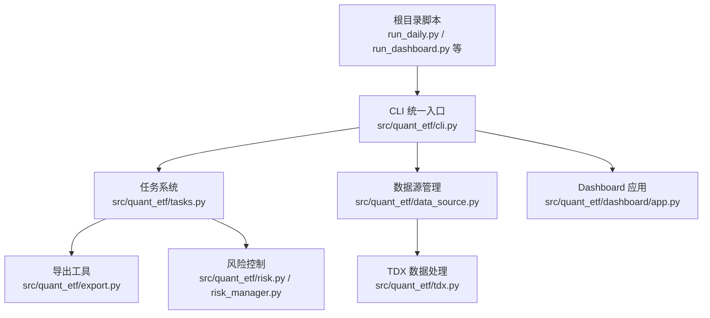
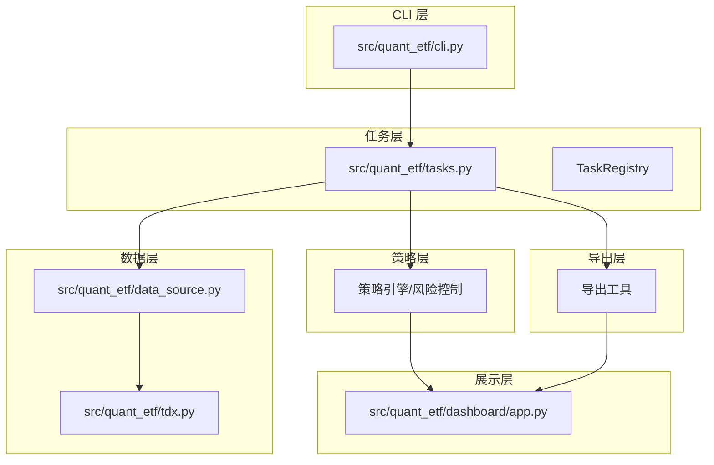
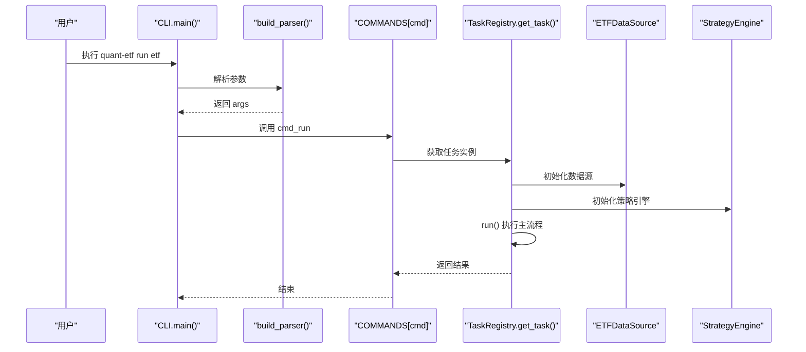
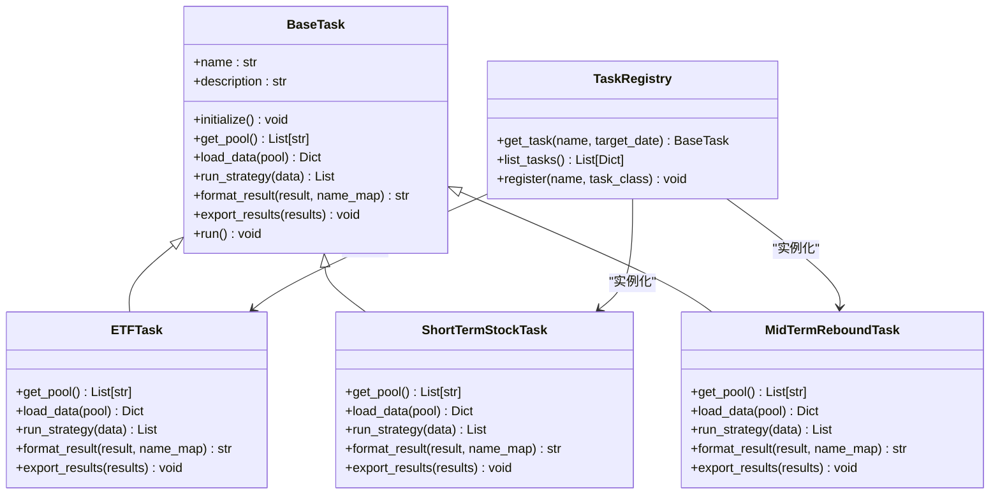
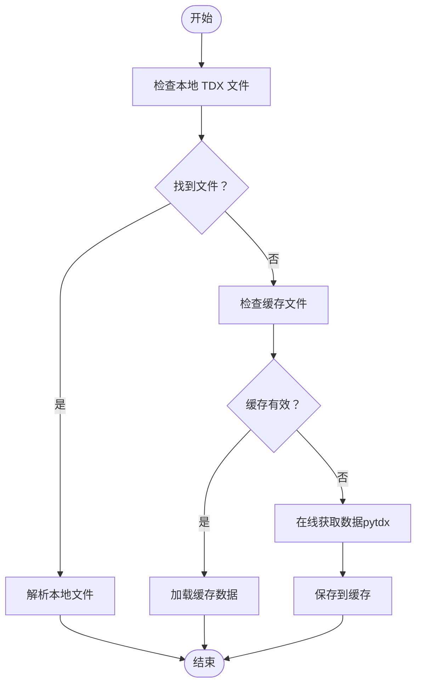
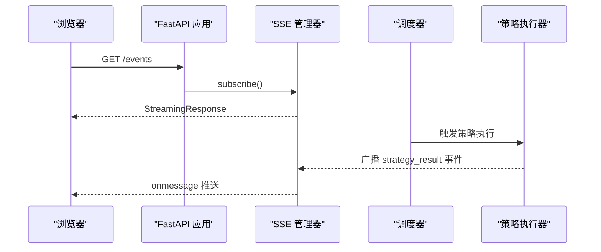
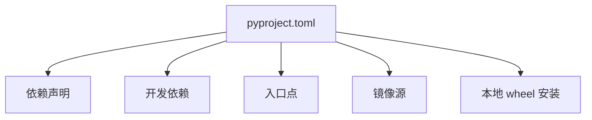

# 开发者指南

<cite>
**本文档引用的文件**
- [README.md](file://README.md)
- [DEVELOPMENT.md](file://DEVELOPMENT.md)
- [pyproject.toml](file://pyproject.toml)
- [src/quant_etf/cli.py](file://src/quant_etf/cli.py)
- [src/quant_etf/tasks.py](file://src/quant_etf/tasks.py)
- [src/quant_etf/data_source.py](file://src/quant_etf/data_source.py)
- [src/quant_etf/tdx.py](file://src/quant_etf/tdx.py)
- [src/quant_etf/conf.py](file://src/quant_etf/conf.py)
- [src/quant_etf/dashboard/app.py](file://src/quant_etf/dashboard/app.py)
- [tests/e2e/conftest.py](file://tests/e2e/conftest.py)
- [src/main.py](file://src/main.py)
- [docs/design.md](file://docs/design.md)
- [docs/analysis.md](file://docs/analysis.md)
- [docs/dev.md](file://docs/dev.md)
- [plan.md](file://plan.md)
</cite>

## 目录
1. [简介](#简介)
2. [开发环境搭建](#开发环境搭建)
3. [项目结构](#项目结构)
4. [核心组件](#核心组件)
5. [架构总览](#架构总览)
6. [详细组件分析](#详细组件分析)
7. [依赖关系分析](#依赖关系分析)
8. [测试策略](#测试策略)
9. [代码规范与命名约定](#代码规范与命名约定)
10. [贡献流程](#贡献流程)
11. [调试与性能分析](#调试与性能分析)
12. [最佳实践与常见陷阱](#最佳实践与常见陷阱)
13. [故障排除指南](#故障排除指南)
14. [结语](#结语)

## 简介
Quant-ETF 是一个基于动量策略的 ETF/股票选股工具，集成了通达信(TDX)数据源，支持本地 TDX 文件与在线数据回退，提供统一 CLI、Dashboard 监控系统、分钟级 K 线采集与导出能力。项目采用模块化分层架构，核心模块包括任务调度、数据源管理、策略引擎、风险控制、导出工具以及 Dashboard Web 应用。

## 开发环境搭建
- 前置要求
  - Python 3.12+（注意：pyproject.toml 中要求 Python >=3.12）
  - uv 包管理器（推荐）
  - Git
- 安装步骤
  - 克隆仓库并进入项目目录
  - 使用 uv 同步依赖：uv sync
  - 激活虚拟环境（可选）
- 开发工具安装
  - 推荐安装 pytest、pytest-cov、black、ruff、mypy 以满足格式化、静态检查与覆盖率要求
- 环境变量
  - TDX_DATA_PATH：通达信数据目录（Windows 默认路径为 C:\new_hxzq_hc_error，Linux 默认为 ~/.local/share/tdx）
  - DASHBOARD_HOST/DASHBOARD_PORT：Dashboard 监听地址与端口（默认 127.0.0.1:8522）

**章节来源**
- [README.md:14-31](file://README.md#L14-L31)
- [DEVELOPMENT.md:15-35](file://DEVELOPMENT.md#L15-L35)
- [pyproject.toml:6](file://pyproject.toml#L6)
- [src/quant_etf/conf.py:104-113](file://src/quant_etf/conf.py#L104-L113)

## 项目结构
项目采用按功能模块划分的层次化组织方式：
- src/quant_etf/：核心包，包含 CLI、任务系统、数据源、策略、风险、导出、Dashboard 等
- tests/：单元与端到端测试
- data/：数据缓存目录
- output/：输出文件目录
- docs/：设计与分析文档
- 根目录脚本：向后兼容的旧入口脚本，现已统一到 CLI

**图示来源**
- [README.md:197-230](file://README.md#L197-L230)
- [src/quant_etf/cli.py:324-382](file://src/quant_etf/cli.py#L324-L382)
- [src/quant_etf/tasks.py:1-450](file://src/quant_etf/tasks.py#L1-L450)
- [src/quant_etf/data_source.py:1-381](file://src/quant_etf/data_source.py#L1-L381)
- [src/quant_etf/tdx.py:1-375](file://src/quant_etf/tdx.py#L1-L375)
- [src/quant_etf/dashboard/app.py:1-87](file://src/quant_etf/dashboard/app.py#L1-L87)

**章节来源**
- [README.md:253-276](file://README.md#L253-L276)
- [docs/analysis.md:26-59](file://docs/analysis.md#L26-L59)

## 核心组件
- CLI 统一入口：提供 daily-run、dashboard、minute-collect、backfill、restart-dashboard、run、list-tasks、check、backfill-stock-names 等子命令
- 任务系统：BaseTask 抽象基类与 ETFTask、ShortTermStockTask、MidTermReboundTask 三个具体任务，TaskRegistry 注册表管理
- 数据源管理：ETFDataSource 提供本地 TDX 文件、缓存与在线数据三层加载策略
- TDX 数据处理：解析 .day 文件、批量获取实时/历史行情、服务器自动切换与缓存
- Dashboard 应用：FastAPI + uvicorn + Jinja2，支持 SSE 实时推送、告警引擎、调度器、组合同步
- 配置管理：全局配置集中于 conf.py，包含股票池、权重、TDX 目录、自定义板块名等

**章节来源**
- [src/quant_etf/cli.py:1-403](file://src/quant_etf/cli.py#L1-L403)
- [src/quant_etf/tasks.py:30-450](file://src/quant_etf/tasks.py#L30-L450)
- [src/quant_etf/data_source.py:15-381](file://src/quant_etf/data_source.py#L15-L381)
- [src/quant_etf/tdx.py:1-375](file://src/quant_etf/tdx.py#L1-L375)
- [src/quant_etf/dashboard/app.py:1-87](file://src/quant_etf/dashboard/app.py#L1-L87)
- [src/quant_etf/conf.py:1-137](file://src/quant_etf/conf.py#L1-L137)

## 架构总览
系统采用模块化分层架构，核心流程包括数据加载、策略打分、风险控制、结果导出与 Dashboard 展示。CLI 作为统一入口，任务系统协调数据源与策略执行，Dashboard 提供可视化监控与实时事件推送。

**图示来源**
- [src/quant_etf/cli.py:324-382](file://src/quant_etf/cli.py#L324-L382)
- [src/quant_etf/tasks.py:411-450](file://src/quant_etf/tasks.py#L411-L450)
- [src/quant_etf/data_source.py:198-236](file://src/quant_etf/data_source.py#L198-L236)
- [src/quant_etf/tdx.py:235-296](file://src/quant_etf/tdx.py#L235-L296)
- [src/quant_etf/dashboard/app.py:17-58](file://src/quant_etf/dashboard/app.py#L17-L58)

## 详细组件分析

### CLI 组件分析
CLI 通过子命令分发执行各类任务，支持日频运行、单任务运行、任务列表、Dashboard 启停、健康检查与股票名称补齐等功能。命令解析器与处理器映射清晰，便于扩展新命令。

**图示来源**
- [src/quant_etf/cli.py:385-398](file://src/quant_etf/cli.py#L385-L398)
- [src/quant_etf/tasks.py:114-159](file://src/quant_etf/tasks.py#L114-L159)

**章节来源**
- [src/quant_etf/cli.py:24-382](file://src/quant_etf/cli.py#L24-L382)
- [src/quant_etf/tasks.py:30-160](file://src/quant_etf/tasks.py#L30-L160)

### 任务系统组件分析
任务系统定义了 BaseTask 抽象基类与三个具体任务，统一了数据加载、策略执行、结果格式化与导出流程。TaskRegistry 提供任务注册与实例化能力。

**图示来源**
- [src/quant_etf/tasks.py:30-450](file://src/quant_etf/tasks.py#L30-L450)

**章节来源**
- [src/quant_etf/tasks.py:30-450](file://src/quant_etf/tasks.py#L30-L450)

### 数据源管理组件分析
ETFDataSource 提供三层数据加载策略：本地 TDX 文件 → 缓存 → 在线数据（pytdx）。支持名称映射缓存、数据新鲜度检查与批量补齐缺失的股票名称。

**图示来源**
- [src/quant_etf/data_source.py:189-236](file://src/quant_etf/data_source.py#L189-L236)
- [src/quant_etf/tdx.py:235-296](file://src/quant_etf/tdx.py#L235-L296)

**章节来源**
- [src/quant_etf/data_source.py:15-381](file://src/quant_etf/data_source.py#L15-L381)
- [src/quant_etf/tdx.py:1-375](file://src/quant_etf/tdx.py#L1-L375)

### Dashboard 组件分析
Dashboard 基于 FastAPI + HTMX + SQLite/DuckDB + SSE，提供策略结果、持仓、市场概览等页面。SSE 管理器维护事件队列，支持心跳与自动清理。

**图示来源**
- [src/quant_etf/dashboard/app.py:39-50](file://src/quant_etf/dashboard/app.py#L39-L50)

**章节来源**
- [src/quant_etf/dashboard/app.py:1-87](file://src/quant_etf/dashboard/app.py#L1-L87)

## 依赖关系分析
- 项目依赖
  - loguru、numpy、pandas、pytdx、scipy、requests、psutil、duckdb、fastapi、uvicorn、jinja2、httpx 等
- 开发依赖
  - pytest（在 dependency-groups.dev 中定义）
- 入口点
  - quant-etf → quant_etf.cli:main
  - quant-dashboard → quant_etf.dashboard.app:main
- 索引镜像
  - 阿里云与清华镜像源配置
- 本地 pytdx 安装
  - 通过本地 wheel 文件安装，避免镜像源问题

**图示来源**
- [pyproject.toml:1-53](file://pyproject.toml#L1-L53)
- [plan.md:1-26](file://plan.md#L1-L26)

**章节来源**
- [pyproject.toml:1-53](file://pyproject.toml#L1-L53)
- [plan.md:1-26](file://plan.md#L1-L26)

## 测试策略
- 运行测试
  - 全部测试：uv run pytest
  - 指定测试文件：uv run pytest tests/test_tdx.py -v
  - 跳过集成测试：uv run pytest -m "not integration"
- 测试覆盖率
  - 使用 pytest --cov=quant_etf --cov-report=html 生成 HTML 报告
- 端到端测试
  - tests/e2e/conftest.py 提供生成模拟价格序列、TDX .day 文件与名称映射的夹具，便于构建真实场景测试

**章节来源**
- [README.md:240-251](file://README.md#L240-L251)
- [DEVELOPMENT.md:96-123](file://DEVELOPMENT.md#L96-L123)
- [tests/e2e/conftest.py:1-326](file://tests/e2e/conftest.py#L1-L326)

## 代码规范与命名约定
- 格式化
  - 使用 Black 进行代码格式化与检查
- Linting
  - 使用 Ruff 执行静态检查与自动修复
- 类型检查
  - 使用 mypy 进行类型检查
- 命名约定
  - 模块与类名遵循 Python 风格，函数与变量使用小写下划线命名
  - 配置项使用全大写常量命名（如 MOMENTUM_WEIGHTS、TOP_N）

**章节来源**
- [DEVELOPMENT.md:124-157](file://DEVELOPMENT.md#L124-L157)
- [src/quant_etf/conf.py:120-128](file://src/quant_etf/conf.py#L120-L128)

## 贡献流程
- 创建功能分支
  - git checkout -b feature/your-feature-name
- 进行开发
  - 编写代码、添加/更新测试、确保测试通过
- 代码检查
  - 格式化：uv run black src/ tests/
  - Lint：uv run ruff check --fix src/ tests/
  - 测试：uv run pytest -v
- 提交规范
  - 使用 Conventional Commits 格式：feat/fix/docs/refactor/test/chore
- 推送并创建 PR
  - git push origin feature/your-feature-name

**章节来源**
- [DEVELOPMENT.md:158-197](file://DEVELOPMENT.md#L158-L197)
- [DEVELOPMENT.md:198-231](file://DEVELOPMENT.md#L198-L231)

## 调试与性能分析
- 调试技巧
  - 使用 loguru 记录详细日志，定位数据加载与策略执行问题
  - 在 CLI 中设置日志级别与输出格式，便于排查
- 性能分析
  - 使用 pandas/numpy/scipy 进行向量化计算，减少循环开销
  - 对高频数据操作（如 pct_chg 计算）进行批处理
- 问题诊断
  - TDX 数据解析：检查 parse_tdx_day_file 返回的 DataFrame
  - 在线数据获取：确认服务器切换与缓存策略
  - Dashboard：通过 /check 健康检查端点验证页面可用性

**章节来源**
- [src/quant_etf/cli.py:257-294](file://src/quant_etf/cli.py#L257-L294)
- [src/quant_etf/tdx.py:341-375](file://src/quant_etf/tdx.py#L341-L375)
- [README.md:176-184](file://README.md#L176-L184)

## 最佳实践与常见陷阱
- 最佳实践
  - 优先使用本地 TDX 文件，其次缓存，最后在线数据回退
  - 在策略执行前后进行风险检查，必要时降低目标权重
  - 使用统一 CLI 管理任务，避免根目录脚本重复导入问题
- 常见陷阱
  - Windows 默认 TDX_DIR 指向错误路径（C:\new_hxzq_hc_error），需修正
  - 集成测试依赖真实 TDX 数据，需跳过或提供 mock 数据
  - Dashboard 端口占用导致启动失败，使用 restart-dashboard 一键重启

**章节来源**
- [docs/analysis.md:104-109](file://docs/analysis.md#L104-L109)
- [src/quant_etf/conf.py:107-110](file://src/quant_etf/conf.py#L107-L110)
- [README.md:299-308](file://README.md#L299-L308)

## 故障排除指南
- Linux 下测试失败
  - 跳过集成测试：uv run pytest -m "not integration"
- 在线数据获取失败
  - 检查 pytdx 安装状态：uv run pip show pytdx
- Dashboard 启动失败
  - 使用 quant-etf check 检查端口与页面可用性
  - 使用 quant-etf restart-dashboard 一键重启

**章节来源**
- [README.md:301-316](file://README.md#L301-L316)
- [README.md:176-184](file://README.md#L176-L184)
- [README.md:168-175](file://README.md#L168-L175)

## 结语
本指南提供了 Quant-ETF 项目的完整开发指引，涵盖环境搭建、项目结构、核心组件、测试策略、代码规范、贡献流程、调试与性能分析、最佳实践与故障排除等方面。建议新加入的开发者先从 CLI 与任务系统入手，逐步熟悉数据源与 Dashboard 的工作机制，再深入策略与风险控制模块。