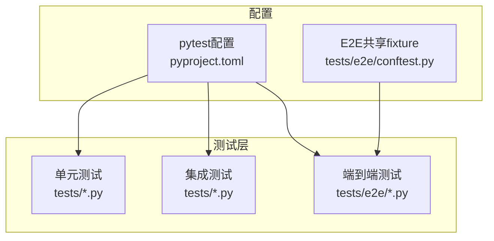
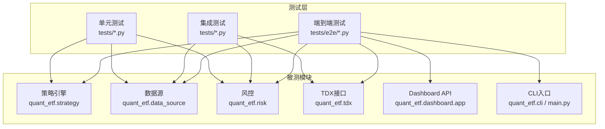
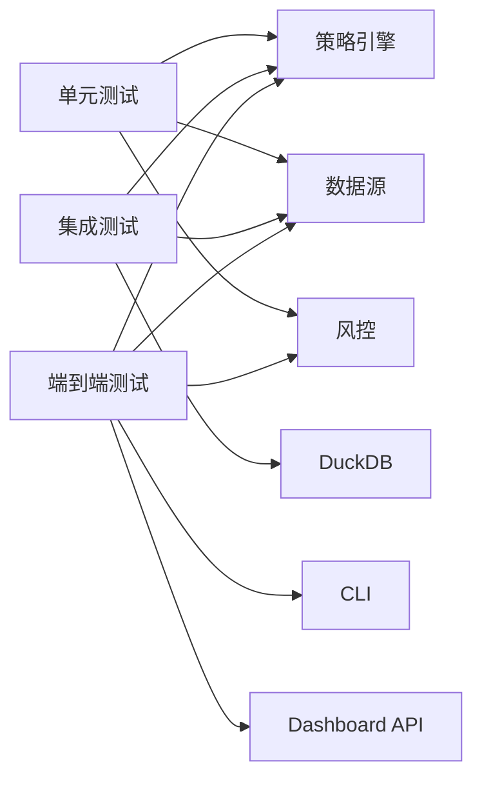

# 测试策略和实践

<cite>
**本文引用的文件**
- [pyproject.toml](file://pyproject.toml)
- [tests/e2e/conftest.py](file://tests/e2e/conftest.py)
- [tests/test_strategy.py](file://tests/test_strategy.py)
- [tests/test_data_source.py](file://tests/test_data_source.py)
- [tests/e2e/test_cli_and_risk_e2e.py](file://tests/e2e/test_cli_and_risk_e2e.py)
- [tests/e2e/test_dashboard_api_e2e.py](file://tests/e2e/test_dashboard_api_e2e.py)
- [tests/e2e/test_strategy_e2e.py](file://tests/e2e/test_strategy_e2e.py)
- [tests/test_tdx.py](file://tests/test_tdx.py)
- [tests/test_risk.py](file://tests/test_risk.py)
- [tests/test_stock_strategy.py](file://tests/test_stock_strategy.py)
- [tests/test_comparison.py](file://tests/test_comparison.py)
- [tests/test_duckdb_conflict.py](file://tests/test_duckdb_conflict.py)
- [tests/test_native.py](file://tests/test_native.py)
- [test_strategy.py](file://test_strategy.py)
</cite>

## 目录
1. [简介](#简介)
2. [项目结构](#项目结构)
3. [核心组件](#核心组件)
4. [架构总览](#架构总览)
5. [详细组件分析](#详细组件分析)
6. [依赖关系分析](#依赖关系分析)
7. [性能考量](#性能考量)
8. [故障排查指南](#故障排查指南)
9. [结论](#结论)
10. [附录](#附录)

## 简介
本文件面向Quant-ETF项目，系统化构建测试策略与实践指南，覆盖pytest框架使用、单元测试、集成测试与端到端测试的设计与实施、测试数据准备与断言策略、测试隔离、覆盖率要求与测量、Mock与测试替身设计、测试标记与跳过机制、调试技巧以及CI中的测试执行流程。目标是帮助开发者在保证质量的同时提升测试效率与可维护性。

## 项目结构
项目采用“源码(src) + 测试(tests)”分层组织，测试目录按“单元/集成/端到端”分层：
- 单元测试：位于tests目录下，针对具体模块或函数进行最小粒度验证
- 集成测试：位于tests目录下，验证模块间协作与外部依赖（如TDX数据、数据库）
- 端到端测试：位于tests/e2e，覆盖完整业务流程与API路由

pytest配置通过pyproject.toml集中管理，包含markers与pythonpath等关键选项；E2E共享fixtures集中在tests/e2e/conftest.py，便于复用与隔离。

图表来源
- [pyproject.toml:48-52](file://pyproject.toml#L48-L52)
- [tests/e2e/conftest.py:1-326](file://tests/e2e/conftest.py#L1-L326)

章节来源
- [pyproject.toml:48-52](file://pyproject.toml#L48-L52)
- [tests/e2e/conftest.py:1-326](file://tests/e2e/conftest.py#L1-L326)

## 核心组件
- pytest配置与标记
  - markers定义integration标记，用于标识需要真实网络/外部资源的集成测试，并可在CI中统一跳过或选择性执行
  - pythonpath指向src，确保测试可直接导入项目模块
- E2E共享fixtures
  - 提供生成OHLCV序列、写入TDX二进制文件、构建mock元数据、临时项目目录等能力，支撑端到端场景下的数据与环境隔离
- 测试用例分层
  - 单元：验证策略引擎、数据源、风控、对比器等核心模块的独立行为
  - 集成：验证TDX数据解析、数据库写入、外部依赖交互
  - 端到端：验证CLI参数解析、Dashboard API路由、策略评分全流程

章节来源
- [pyproject.toml:48-52](file://pyproject.toml#L48-L52)
- [tests/e2e/conftest.py:19-121](file://tests/e2e/conftest.py#L19-L121)
- [tests/e2e/conftest.py:302-326](file://tests/e2e/conftest.py#L302-L326)

## 架构总览
下图展示测试体系与被测模块的关系，突出E2E层对策略引擎、数据源、风控、CLI与API的端到端验证。

图表来源
- [tests/e2e/test_strategy_e2e.py:1-229](file://tests/e2e/test_strategy_e2e.py#L1-L229)
- [tests/e2e/test_cli_and_risk_e2e.py:1-212](file://tests/e2e/test_cli_and_risk_e2e.py#L1-L212)
- [tests/e2e/test_dashboard_api_e2e.py:1-164](file://tests/e2e/test_dashboard_api_e2e.py#L1-L164)
- [tests/test_tdx.py:1-175](file://tests/test_tdx.py#L1-L175)
- [tests/test_data_source.py:1-67](file://tests/test_data_source.py#L1-L67)
- [tests/test_risk.py:1-106](file://tests/test_risk.py#L1-L106)

## 详细组件分析

### 单元测试设计与实践
- 设计原则
  - 使用小而精的输入，聚焦单一行为；通过构造DataFrame与固定随机种子确保可重复性
  - 断言关注结果的合理性与边界条件，避免过度断言细节
  - 使用pytest内置fixture（如tmp_path）实现测试隔离
- 示例要点
  - 策略引擎：验证收益计算、排名与组合权重影响
  - 数据源：缓存读取、新鲜度判断、异常路径
  - 风控：RSI范围、不同情景下的风险等级与建议动作
  - 对比器：保留股票代码前导零的显示一致性
- 最佳实践
  - 测试数据准备：优先使用构造函数或辅助函数生成最小可验证数据集
  - 断言策略：先断言存在性与类型，再断言范围与顺序
  - 测试隔离：每个测试独立初始化状态，避免跨用例耦合

章节来源
- [tests/test_strategy.py:1-98](file://tests/test_strategy.py#L1-L98)
- [tests/test_data_source.py:1-67](file://tests/test_data_source.py#L1-L67)
- [tests/test_risk.py:1-106](file://tests/test_risk.py#L1-L106)
- [tests/test_stock_strategy.py:1-42](file://tests/test_stock_strategy.py#L1-L42)
- [tests/test_comparison.py:1-43](file://tests/test_comparison.py#L1-L43)

### 集成测试设计与实践
- 设计原则
  - 验证模块与外部系统（TDX、数据库）的真实交互
  - 使用skip机制处理缺失外部资源的情况，保证在不同环境稳定运行
- 示例要点
  - TDX解析：文件存在性、结构完整性、排序与价格范围校验
  - DuckDB：ON CONFLICT DO UPDATE语法与批量写入验证
- 最佳实践
  - 通过环境变量或默认路径探测外部资源，不存在时优雅跳过
  - 对于数据库写入，先清理状态，再断言最终一致性

章节来源
- [tests/test_tdx.py:74-175](file://tests/test_tdx.py#L74-L175)
- [tests/test_duckdb_conflict.py:13-365](file://tests/test_duckdb_conflict.py#L13-L365)

### 端到端测试设计与实践
- 设计原则
  - 覆盖完整业务链路：CLI参数解析、任务调度、策略评分、Dashboard API路由
  - 使用Mock与共享fixtures构建真实感数据，同时保持可重复性
- 示例要点
  - CLI与风险：参数解析、默认任务、未知任务错误处理、每日脚本日期校验与任务委派
  - Dashboard API：根路径、策略接口、市场状态、告警接口与错误处理
  - 策略引擎：ETF动量、短期/中期回撤策略、权重与排名变化、边缘情况
- 最佳实践
  - 使用共享fixture生成多ETF池与不同动量画像，覆盖强/弱/下跌/反弹场景
  - 对API测试使用TestClient并覆盖典型与异常路径

章节来源
- [tests/e2e/test_cli_and_risk_e2e.py:1-212](file://tests/e2e/test_cli_and_risk_e2e.py#L1-L212)
- [tests/e2e/test_dashboard_api_e2e.py:1-164](file://tests/e2e/test_dashboard_api_e2e.py#L1-L164)
- [tests/e2e/test_strategy_e2e.py:1-229](file://tests/e2e/test_strategy_e2e.py#L1-L229)
- [tests/e2e/conftest.py:19-121](file://tests/e2e/conftest.py#L19-L121)
- [tests/e2e/conftest.py:302-326](file://tests/e2e/conftest.py#L302-L326)

### Mock对象与测试替身设计
- Mock策略
  - 使用unittest.mock.patch与MagicMock替换外部依赖（如TaskRegistry、异常处理器）
  - 使用FastAPI TestClient构建轻量级服务端测试，避免启动真实服务
- 替身与数据生成
  - 通过generate_price_series与generate_momentum_etf_data生成逼真的OHLCV序列
  - 通过write_tdx_day_file生成TDX .day二进制文件，模拟真实数据源
- 最佳实践
  - 明确Mock边界，仅对必要依赖进行替换
  - 保持替身行为与真实系统一致，便于回归验证

章节来源
- [tests/e2e/test_cli_and_risk_e2e.py:127-150](file://tests/e2e/test_cli_and_risk_e2e.py#L127-L150)
- [tests/e2e/test_dashboard_api_e2e.py:12-58](file://tests/e2e/test_dashboard_api_e2e.py#L12-L58)
- [tests/e2e/conftest.py:19-121](file://tests/e2e/conftest.py#L19-L121)
- [tests/e2e/conftest.py:123-155](file://tests/e2e/conftest.py#L123-L155)

### 测试分类标记与跳过机制
- 标记使用
  - 在pyproject.toml中定义integration标记，用于标注需要真实服务器连接的测试
- 跳过策略
  - 在测试中根据外部资源存在性调用pytest.skip，避免在无依赖环境下失败
- CI执行
  - 可通过命令行选择性运行或跳过integration标记的测试，以适配不同环境

章节来源
- [pyproject.toml:50-52](file://pyproject.toml#L50-L52)
- [tests/test_tdx.py:74-89](file://tests/test_tdx.py#L74-L89)

### 测试调试技巧与常见问题
- 调试技巧
  - 使用pytest --tb=short或--tb=long快速定位异常堆栈
  - 结合print与日志输出，定位数据结构与中间结果
  - 对API测试使用raise_server_exceptions=False捕获异常响应
- 常见问题
  - 外部资源缺失：通过skip避免阻塞；确保环境变量与默认路径正确
  - 数据新鲜度与缓存：明确force_update与check_freshness参数行为
  - DuckDB语法兼容：确认版本支持ON CONFLICT DO UPDATE

章节来源
- [tests/e2e/test_dashboard_api_e2e.py:144-164](file://tests/e2e/test_dashboard_api_e2e.py#L144-L164)
- [tests/test_data_source.py:27-37](file://tests/test_data_source.py#L27-L37)
- [tests/test_duckdb_conflict.py:13-365](file://tests/test_duckdb_conflict.py#L13-L365)

### 测试覆盖率要求与测量
- 覆盖率工具
  - 推荐使用pytest-cov作为覆盖率收集工具，结合命令行参数生成HTML报告
- 报告生成
  - 使用--cov=src --cov-report=html --cov-report=term-missing生成HTML与终端报告
- 阈值建议
  - 语句/分支/函数/行覆盖率建议不低于80%，关键路径不低于90%
  - 定义CI阈值，失败即阻断，确保质量门槛

[本节为通用指导，无需特定文件引用]

### 持续集成中的测试执行流程
- 建议流程
  - 安装依赖与虚拟环境
  - 运行单元测试与集成测试（可选择性跳过integration）
  - 运行端到端测试（确保Mock与临时目录可用）
  - 生成覆盖率报告并上传至CI平台
- 标记控制
  - 使用--ignore-glob或-x跳过integration测试，或使用-m "not integration"仅运行非集成测试

[本节为通用指导，无需特定文件引用]

## 依赖关系分析
- 测试与被测模块的耦合
  - 单元测试与被测模块低耦合，通过直接导入实现
  - 集成与端到端测试对TDX、数据库、FastAPI等外部依赖有高耦合
- 外部依赖与集成点
  - TDX数据解析与文件格式
  - DuckDB数据库写入与查询
  - FastAPI应用与路由
- 循环依赖规避
  - 通过共享fixture与Mock避免测试间的循环依赖

图表来源
- [tests/test_strategy.py:1-98](file://tests/test_strategy.py#L1-L98)
- [tests/test_data_source.py:1-67](file://tests/test_data_source.py#L1-L67)
- [tests/test_risk.py:1-106](file://tests/test_risk.py#L1-L106)
- [tests/test_duckdb_conflict.py:13-365](file://tests/test_duckdb_conflict.py#L13-L365)
- [tests/e2e/test_cli_and_risk_e2e.py:1-212](file://tests/e2e/test_cli_and_risk_e2e.py#L1-L212)
- [tests/e2e/test_dashboard_api_e2e.py:1-164](file://tests/e2e/test_dashboard_api_e2e.py#L1-L164)

## 性能考量
- 测试数据规模
  - 使用最小有效数据集验证算法正确性，避免冗长的历史数据导致测试缓慢
- 并行执行
  - 在无共享状态前提下，利用pytest并发执行提升整体吞吐
- 外部依赖
  - 对TDX与数据库的测试尽量使用Mock或本地最小化数据，减少I/O等待

[本节为通用指导，无需特定文件引用]

## 故障排查指南
- 常见问题与解决
  - TDX数据目录不存在：设置TDX_DATA_PATH或使用默认路径；否则跳过集成测试
  - DuckDB语法报错：确认DuckDB版本与ON CONFLICT语法支持
  - API测试500错误：检查异常处理器与TestClient配置
- 调试建议
  - 使用pytest --pdb进入交互式调试
  - 对API与CLI测试增加日志输出，定位请求与响应

章节来源
- [tests/test_tdx.py:74-89](file://tests/test_tdx.py#L74-L89)
- [tests/test_duckdb_conflict.py:13-365](file://tests/test_duckdb_conflict.py#L13-L365)
- [tests/e2e/test_dashboard_api_e2e.py:144-164](file://tests/e2e/test_dashboard_api_e2e.py#L144-L164)

## 结论
本测试策略以pytest为核心，结合单元、集成与端到端三层测试，配合Mock与共享fixtures，既保证了测试的可重复性与稳定性，又覆盖了真实业务场景。通过markers与跳过机制适配不同环境，借助覆盖率与CI流程保障质量门槛。建议在后续迭代中逐步完善覆盖率阈值与报告归档，持续优化测试执行效率与可维护性。

## 附录
- 快速参考
  - pytest配置：markers、pythonpath
  - E2E数据生成：generate_price_series、generate_momentum_etf_data、write_tdx_day_file
  - 集成测试：TDX解析、DuckDB写入
  - 端到端：CLI参数解析、Dashboard API路由、策略评分流程

章节来源
- [pyproject.toml:48-52](file://pyproject.toml#L48-L52)
- [tests/e2e/conftest.py:19-121](file://tests/e2e/conftest.py#L19-L121)
- [tests/e2e/conftest.py:123-155](file://tests/e2e/conftest.py#L123-L155)
- [tests/test_tdx.py:74-175](file://tests/test_tdx.py#L74-L175)
- [tests/test_duckdb_conflict.py:13-365](file://tests/test_duckdb_conflict.py#L13-L365)
- [tests/e2e/test_cli_and_risk_e2e.py:1-212](file://tests/e2e/test_cli_and_risk_e2e.py#L1-L212)
- [tests/e2e/test_dashboard_api_e2e.py:1-164](file://tests/e2e/test_dashboard_api_e2e.py#L1-L164)
- [tests/e2e/test_strategy_e2e.py:1-229](file://tests/e2e/test_strategy_e2e.py#L1-L229)