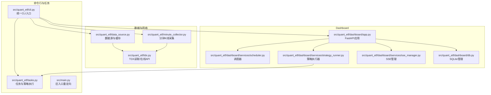
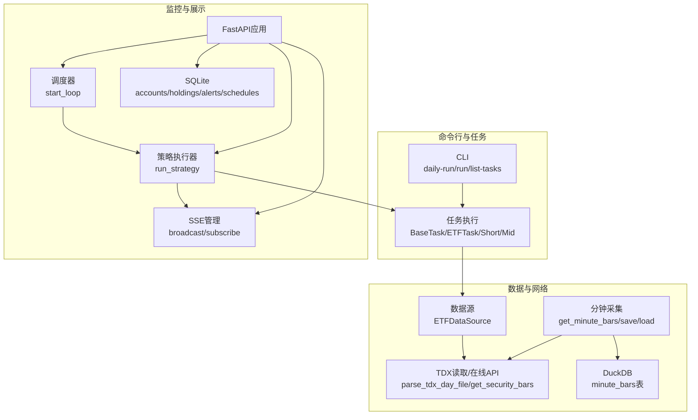
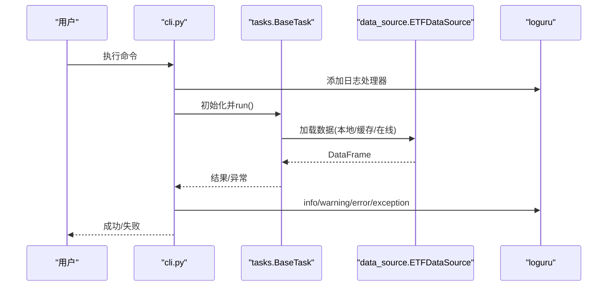
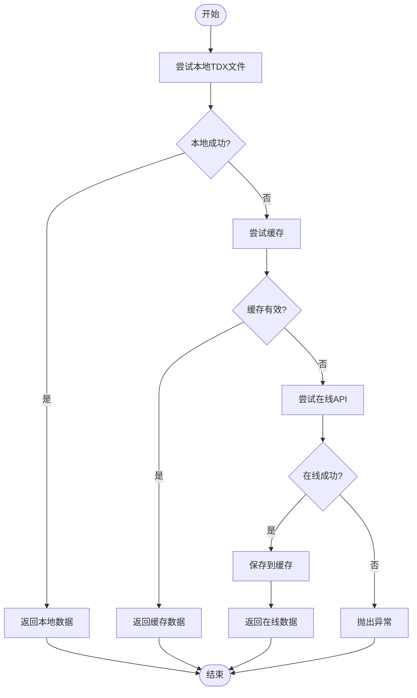
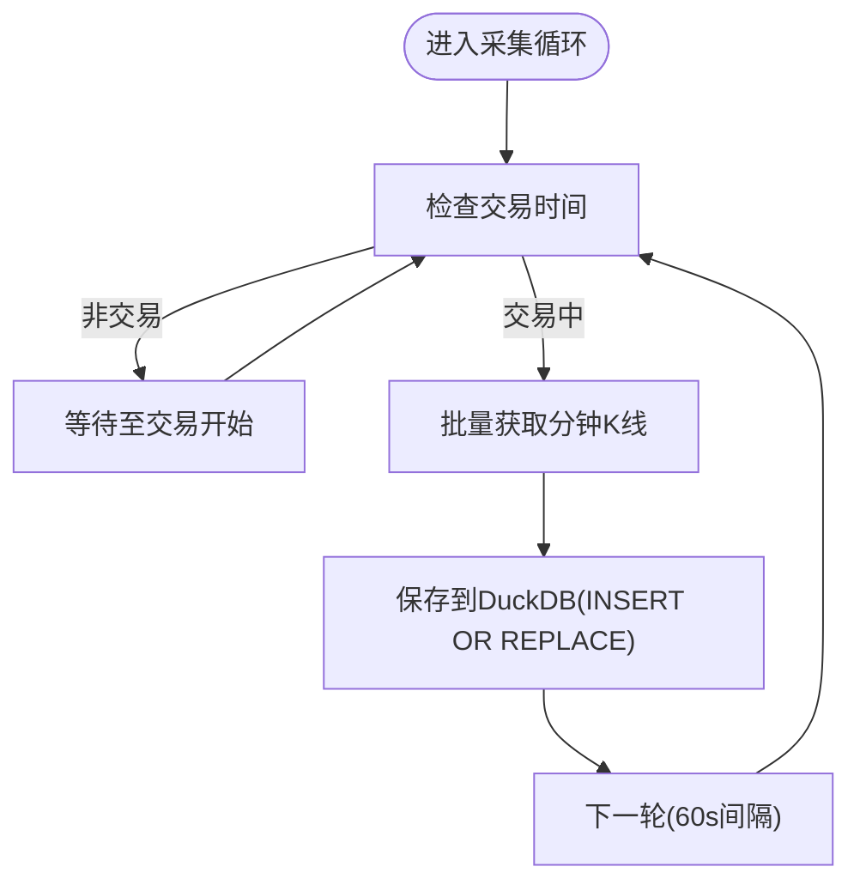
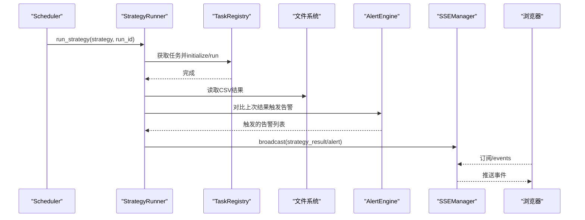
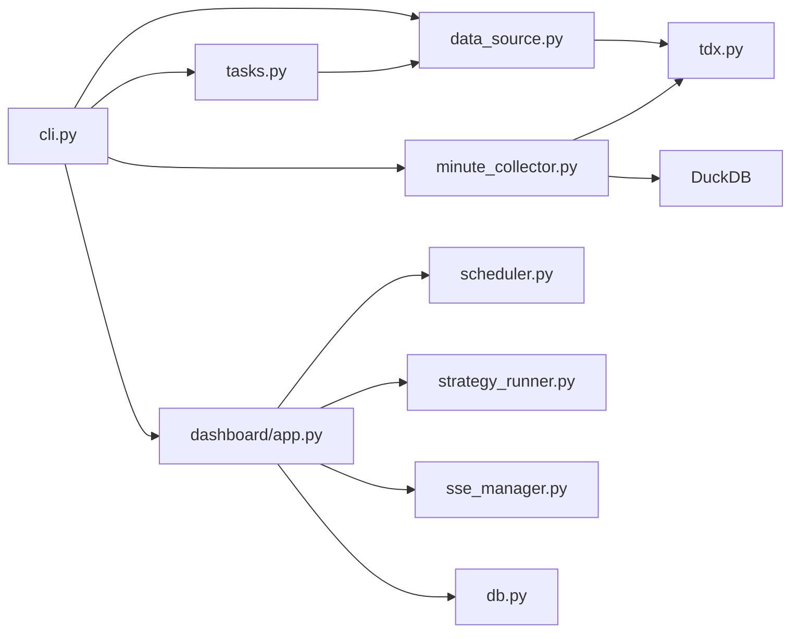
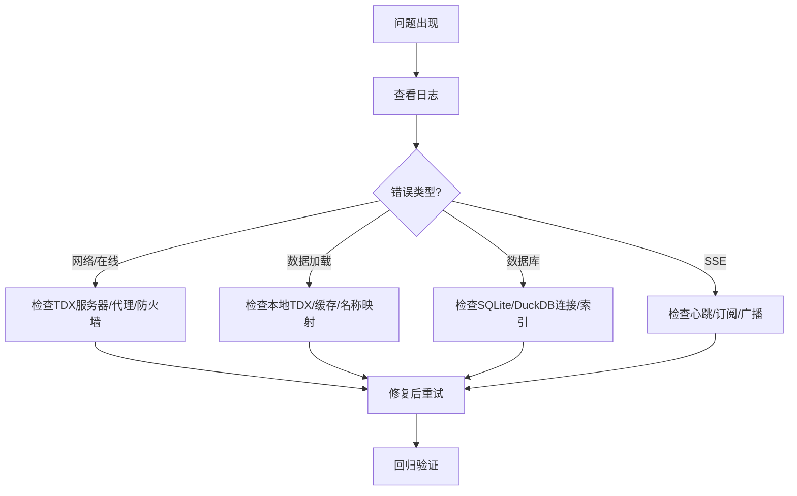

# 调试和性能分析

<cite>
**本文引用的文件**
- [README.md](file://README.md)
- [src/main.py](file://src/main.py)
- [src/quant_etf/cli.py](file://src/quant_etf/cli.py)
- [src/quant_etf/tasks.py](file://src/quant_etf/tasks.py)
- [src/quant_etf/data_source.py](file://src/quant_etf/data_source.py)
- [src/quant_etf/tdx.py](file://src/quant_etf/tdx.py)
- [src/quant_etf/minute_collector.py](file://src/quant_etf/minute_collector.py)
- [src/quant_etf/dashboard/app.py](file://src/quant_etf/dashboard/app.py)
- [src/quant_etf/dashboard/services/scheduler.py](file://src/quant_etf/dashboard/services/scheduler.py)
- [src/quant_etf/dashboard/services/strategy_runner.py](file://src/quant_etf/dashboard/services/strategy_runner.py)
- [src/quant_etf/dashboard/services/sse_manager.py](file://src/quant_etf/dashboard/services/sse_manager.py)
- [src/quant_etf/dashboard/db.py](file://src/quant_etf/dashboard/db.py)
</cite>

## 目录
1. [简介](#简介)
2. [项目结构](#项目结构)
3. [核心组件](#核心组件)
4. [架构总览](#架构总览)
5. [详细组件分析](#详细组件分析)
6. [依赖分析](#依赖分析)
7. [性能考虑](#性能考虑)
8. [故障排查指南](#故障排查指南)
9. [结论](#结论)
10. [附录](#附录)

## 简介
本指南面向Quant-ETF项目的调试与性能分析，结合项目现有日志体系、异步调度与SSE推送、数据库与缓存策略，提供系统化的调试方法与性能优化建议。内容涵盖：
- Python调试工具使用（pdb、IDE调试器、日志调试）
- 性能瓶颈识别与分析（I/O、网络、CPU、内存）
- 内存使用监控与优化（大数据处理）
- CPU性能分析（cProfile、line_profiler）
- 网络请求与API调用监控
- 数据库查询优化与缓存策略
- 异常处理与错误追踪最佳实践
- 生产环境问题诊断与排障流程
- 使用性能分析工具定位与解决问题

## 项目结构
项目采用模块化设计，CLI统一入口负责任务分发；数据层通过TDX本地/在线数据源与缓存；Dashboard基于FastAPI + SSE提供实时监控；分钟级数据使用DuckDB存储。

**图示来源**
- [src/quant_etf/cli.py:1-403](file://src/quant_etf/cli.py#L1-L403)
- [src/quant_etf/tasks.py:1-467](file://src/quant_etf/tasks.py#L1-L467)
- [src/quant_etf/data_source.py:1-381](file://src/quant_etf/data_source.py#L1-L381)
- [src/quant_etf/tdx.py:1-375](file://src/quant_etf/tdx.py#L1-L375)
- [src/quant_etf/minute_collector.py:1-505](file://src/quant_etf/minute_collector.py#L1-L505)
- [src/quant_etf/dashboard/app.py:1-92](file://src/quant_etf/dashboard/app.py#L1-L92)
- [src/quant_etf/dashboard/services/scheduler.py:1-82](file://src/quant_etf/dashboard/services/scheduler.py#L1-L82)
- [src/quant_etf/dashboard/services/strategy_runner.py:1-164](file://src/quant_etf/dashboard/services/strategy_runner.py#L1-L164)
- [src/quant_etf/dashboard/services/sse_manager.py:1-45](file://src/quant_etf/dashboard/services/sse_manager.py#L1-L45)
- [src/quant_etf/dashboard/db.py:1-133](file://src/quant_etf/dashboard/db.py#L1-L133)

**章节来源**
- [README.md:253-276](file://README.md#L253-L276)
- [src/quant_etf/cli.py:1-403](file://src/quant_etf/cli.py#L1-L403)

## 核心组件
- CLI与命令分发：统一入口，支持daily-run、run、list-tasks、dashboard、minute-collect、backfill、restart-dashboard、check、backfill-stock-names等命令，内置日志与异常处理。
- 任务与策略：BaseTask抽象基类定义标准流程（initialize→load_data→run_strategy→export_results），具体任务（ETF/短/中）实现策略打分与导出。
- 数据源与缓存：ETFDataSource按本地TDX文件→缓存→在线顺序加载，支持名称映射缓存与新鲜度检查；TDX模块封装pytdx读取与在线API。
- 分钟级采集：分钟K线采集器，使用DuckDB存储，带服务器冷却与失败重试。
- Dashboard：FastAPI + SSE，调度器定时执行策略，策略执行器异步执行并广播SSE事件，SQLite存储业务数据。

**章节来源**
- [src/quant_etf/cli.py:24-398](file://src/quant_etf/cli.py#L24-L398)
- [src/quant_etf/tasks.py:30-177](file://src/quant_etf/tasks.py#L30-L177)
- [src/quant_etf/data_source.py:15-381](file://src/quant_etf/data_source.py#L15-L381)
- [src/quant_etf/tdx.py:1-375](file://src/quant_etf/tdx.py#L1-L375)
- [src/quant_etf/minute_collector.py:1-505](file://src/quant_etf/minute_collector.py#L1-L505)
- [src/quant_etf/dashboard/app.py:1-92](file://src/quant_etf/dashboard/app.py#L1-L92)

## 架构总览
系统分为三层：命令行与任务层、数据与网络层、监控与展示层。数据流从TDX（本地/在线）→缓存→策略计算→导出；分钟K线→DuckDB；策略执行→SSE→浏览器。

**图示来源**
- [src/quant_etf/cli.py:24-398](file://src/quant_etf/cli.py#L24-L398)
- [src/quant_etf/tasks.py:179-426](file://src/quant_etf/tasks.py#L179-L426)
- [src/quant_etf/data_source.py:189-285](file://src/quant_etf/data_source.py#L189-L285)
- [src/quant_etf/tdx.py:235-338](file://src/quant_etf/tdx.py#L235-L338)
- [src/quant_etf/minute_collector.py:458-488](file://src/quant_etf/minute_collector.py#L458-L488)
- [src/quant_etf/dashboard/app.py:17-66](file://src/quant_etf/dashboard/app.py#L17-L66)
- [src/quant_etf/dashboard/services/scheduler.py:19-52](file://src/quant_etf/dashboard/services/scheduler.py#L19-L52)
- [src/quant_etf/dashboard/services/strategy_runner.py:25-125](file://src/quant_etf/dashboard/services/strategy_runner.py#L25-L125)
- [src/quant_etf/dashboard/services/sse_manager.py:14-41](file://src/quant_etf/dashboard/services/sse_manager.py#L14-L41)
- [src/quant_etf/dashboard/db.py:11-66](file://src/quant_etf/dashboard/db.py#L11-L66)

## 详细组件分析

### CLI与日志调试
- 统一日志：各命令使用loguru添加文件与控制台日志，便于定位问题。
- 异常处理：命令函数捕获异常并记录，必要时退出码非0。
- 调试建议：
  - 使用pdb：在关键函数入口添加断点，逐步执行，观察DataFrame形状、缓存命中、网络请求响应。
  - IDE调试：在PyCharm/VSCode中设置断点，配合日志输出快速定位。
  - 日志级别：生产建议INFO/DEBUG分离，关键路径增加DEBUG。

**图示来源**
- [src/quant_etf/cli.py:24-398](file://src/quant_etf/cli.py#L24-L398)
- [src/quant_etf/tasks.py:131-177](file://src/quant_etf/tasks.py#L131-L177)
- [src/quant_etf/data_source.py:189-285](file://src/quant_etf/data_source.py#L189-L285)

**章节来源**
- [src/quant_etf/cli.py:24-398](file://src/quant_etf/cli.py#L24-L398)
- [src/quant_etf/tasks.py:131-177](file://src/quant_etf/tasks.py#L131-L177)

### 数据源与缓存（TDX本地/在线/缓存）
- 优先级：本地TDX文件→缓存→在线API，失败回退。
- 缓存策略：名称映射缓存、ETF/股票缓存文件；check_is_fresh按交易日与时段判断新鲜度。
- 性能关注点：
  - 网络请求抖动与失败重试，建议增加指数退避与服务器冷却。
  - 大量代码循环加载时，合并请求或批处理。

**图示来源**
- [src/quant_etf/data_source.py:189-285](file://src/quant_etf/data_source.py#L189-L285)
- [src/quant_etf/tdx.py:235-338](file://src/quant_etf/tdx.py#L235-L338)

**章节来源**
- [src/quant_etf/data_source.py:189-285](file://src/quant_etf/data_source.py#L189-L285)
- [src/quant_etf/tdx.py:235-338](file://src/quant_etf/tdx.py#L235-L338)

### 分钟级K线采集（DuckDB）
- 服务器冷却：失败服务器进入冷却，避免频繁重试。
- 数据库：DuckDB表含主键(code,time)，索引提升查询效率。
- 性能关注点：批量插入、时间字段规范化、避免重复写入。

**图示来源**
- [src/quant_etf/minute_collector.py:158-232](file://src/quant_etf/minute_collector.py#L158-L232)
- [src/quant_etf/minute_collector.py:458-488](file://src/quant_etf/minute_collector.py#L458-L488)
- [src/quant_etf/minute_collector.py:253-277](file://src/quant_etf/minute_collector.py#L253-L277)

**章节来源**
- [src/quant_etf/minute_collector.py:1-505](file://src/quant_etf/minute_collector.py#L1-L505)

### Dashboard与SSE（异步调度与事件推送）
- 调度器：基于asyncio循环，定时执行策略，更新最后运行时间并广播SSE事件。
- 策略执行器：线程池执行任务，完成后读取CSV结果，触发告警引擎并广播SSE。
- SSE管理：维护队列集合，心跳保活，异常清理。

**图示来源**
- [src/quant_etf/dashboard/services/scheduler.py:19-52](file://src/quant_etf/dashboard/services/scheduler.py#L19-L52)
- [src/quant_etf/dashboard/services/strategy_runner.py:25-125](file://src/quant_etf/dashboard/services/strategy_runner.py#L25-L125)
- [src/quant_etf/dashboard/services/sse_manager.py:14-41](file://src/quant_etf/dashboard/services/sse_manager.py#L14-L41)
- [src/quant_etf/dashboard/app.py:39-50](file://src/quant_etf/dashboard/app.py#L39-L50)

**章节来源**
- [src/quant_etf/dashboard/services/scheduler.py:1-82](file://src/quant_etf/dashboard/services/scheduler.py#L1-L82)
- [src/quant_etf/dashboard/services/strategy_runner.py:1-164](file://src/quant_etf/dashboard/services/strategy_runner.py#L1-L164)
- [src/quant_etf/dashboard/services/sse_manager.py:1-45](file://src/quant_etf/dashboard/services/sse_manager.py#L1-L45)
- [src/quant_etf/dashboard/app.py:1-92](file://src/quant_etf/dashboard/app.py#L1-L92)

## 依赖分析
- 模块耦合：
  - CLI依赖任务注册表与各服务模块。
  - 任务依赖数据源与策略引擎。
  - Dashboard依赖调度器、策略执行器、SSE管理与SQLite。
  - 数据采集依赖TDX在线API与DuckDB。
- 外部依赖：
  - pytdx（TDX读取/在线API）
  - duckdb（分钟K线存储）
  - fastapi/uvicorn（Dashboard）
  - loguru（日志）

**图示来源**
- [src/quant_etf/cli.py:1-403](file://src/quant_etf/cli.py#L1-L403)
- [src/quant_etf/tasks.py:1-467](file://src/quant_etf/tasks.py#L1-L467)
- [src/quant_etf/data_source.py:1-381](file://src/quant_etf/data_source.py#L1-L381)
- [src/quant_etf/tdx.py:1-375](file://src/quant_etf/tdx.py#L1-L375)
- [src/quant_etf/minute_collector.py:1-505](file://src/quant_etf/minute_collector.py#L1-L505)
- [src/quant_etf/dashboard/app.py:1-92](file://src/quant_etf/dashboard/app.py#L1-L92)
- [src/quant_etf/dashboard/services/scheduler.py:1-82](file://src/quant_etf/dashboard/services/scheduler.py#L1-L82)
- [src/quant_etf/dashboard/services/strategy_runner.py:1-164](file://src/quant_etf/dashboard/services/strategy_runner.py#L1-L164)
- [src/quant_etf/dashboard/services/sse_manager.py:1-45](file://src/quant_etf/dashboard/services/sse_manager.py#L1-L45)
- [src/quant_etf/dashboard/db.py:1-133](file://src/quant_etf/dashboard/db.py#L1-L133)

**章节来源**
- [src/quant_etf/cli.py:1-403](file://src/quant_etf/cli.py#L1-L403)
- [src/quant_etf/tasks.py:1-467](file://src/quant_etf/tasks.py#L1-L467)
- [src/quant_etf/data_source.py:1-381](file://src/quant_etf/data_source.py#L1-L381)
- [src/quant_etf/tdx.py:1-375](file://src/quant_etf/tdx.py#L1-L375)
- [src/quant_etf/minute_collector.py:1-505](file://src/quant_etf/minute_collector.py#L1-L505)
- [src/quant_etf/dashboard/app.py:1-92](file://src/quant_etf/dashboard/app.py#L1-L92)
- [src/quant_etf/dashboard/services/scheduler.py:1-82](file://src/quant_etf/dashboard/services/scheduler.py#L1-L82)
- [src/quant_etf/dashboard/services/strategy_runner.py:1-164](file://src/quant_etf/dashboard/services/strategy_runner.py#L1-L164)
- [src/quant_etf/dashboard/services/sse_manager.py:1-45](file://src/quant_etf/dashboard/services/sse_manager.py#L1-L45)
- [src/quant_etf/dashboard/db.py:1-133](file://src/quant_etf/dashboard/db.py#L1-L133)

## 性能考虑
- I/O与缓存
  - 本地TDX文件读取与CSV缓存：优先命中缓存，减少在线请求。
  - 新鲜度检查：按交易日与时段判断，避免重复下载。
- 网络与API
  - 在线API失败重试与服务器冷却，降低抖动影响。
  - 批量获取与合并请求，减少连接开销。
- CPU与算法
  - pandas操作集中在DataFrame层面，注意向量化与列选择。
  - 策略计算可拆分阶段，记录中间耗时。
- 内存管理
  - 大数据处理时分块读取、及时释放中间对象。
  - 使用DuckDB列式存储与索引，减少内存占用。
- 数据库
  - SQLite WAL模式与外键开启，保证一致性与并发安全。
  - DuckDB分钟表主键与索引，查询时尽量带上code/time过滤条件。

**章节来源**
- [src/quant_etf/data_source.py:151-188](file://src/quant_etf/data_source.py#L151-L188)
- [src/quant_etf/minute_collector.py:253-277](file://src/quant_etf/minute_collector.py#L253-L277)
- [src/quant_etf/dashboard/db.py:69-91](file://src/quant_etf/dashboard/db.py#L69-L91)

## 故障排查指南
- CLI命令与日志
  - 使用--help查看命令帮助；关注日志文件（logs目录）中的错误堆栈。
  - 常见问题：网络异常导致在线数据获取失败；TDX路径配置不正确。
- Dashboard健康检查
  - 使用check命令对各页面路由进行健康检查；确认端口与主机配置。
- 数据加载失败
  - 检查本地TDX文件是否存在；确认缓存文件是否损坏；尝试禁用在线回退或更换服务器。
- 分钟采集异常
  - 交易时间判断、服务器冷却、DuckDB连接与索引。
- SSE连接问题
  - 心跳保活与客户端断开清理；确认事件端点与浏览器EventSource使用。

**图示来源**
- [src/quant_etf/cli.py:309-322](file://src/quant_etf/cli.py#L309-L322)
- [src/quant_etf/data_source.py:189-285](file://src/quant_etf/data_source.py#L189-L285)
- [src/quant_etf/minute_collector.py:23-102](file://src/quant_etf/minute_collector.py#L23-L102)
- [src/quant_etf/dashboard/services/sse_manager.py:14-41](file://src/quant_etf/dashboard/services/sse_manager.py#L14-L41)

**章节来源**
- [src/quant_etf/cli.py:309-322](file://src/quant_etf/cli.py#L309-L322)
- [src/quant_etf/data_source.py:189-285](file://src/quant_etf/data_source.py#L189-L285)
- [src/quant_etf/minute_collector.py:23-102](file://src/quant_etf/minute_collector.py#L23-L102)
- [src/quant_etf/dashboard/services/sse_manager.py:14-41](file://src/quant_etf/dashboard/services/sse_manager.py#L14-L41)

## 结论
本项目已具备完善的日志体系与模块化结构，能够支撑量化场景下的调试与性能分析。建议在现有基础上：
- 引入cProfile/line_profiler对热点函数进行剖析；
- 使用内存分析工具（如tracemalloc）监控峰值与泄漏；
- 对高频网络请求与数据库查询进行基准测试；
- 在Dashboard中增加性能指标可视化与告警。

## 附录

### Python调试工具使用要点
- pdb
  - 在关键函数入口添加断点，逐步执行，观察DataFrame形状、缓存命中、网络请求响应。
  - 常用命令：n（下一行）、s（进入函数）、c（继续）、l（列出代码）、pp（打印表达式）。
- IDE调试器（PyCharm/VSCode）
  - 设置断点，配合日志输出快速定位；利用变量监视与调用栈查看。
- 日志调试
  - 使用loguru的logger.add添加文件与控制台日志，按需调整级别与格式。
  - 在性能敏感路径增加耗时记录，便于后续分析。

**章节来源**
- [src/quant_etf/cli.py:258-294](file://src/quant_etf/cli.py#L258-L294)
- [src/quant_etf/tasks.py:131-177](file://src/quant_etf/tasks.py#L131-L177)

### CPU性能分析（cProfile/line_profiler）
- cProfile
  - 使用python -m cProfile -o profile.prof -s cumulative <script>运行策略或数据加载。
  - 使用pstats或snakeviz可视化热点函数。
- line_profiler
  - 在关键函数上添加@profile装饰器，运行kernprof -l -v <script>查看逐行耗时。
  - 重点关注pandas操作、循环展开与I/O密集路径。

[本节为通用指导，不直接分析具体文件]

### 网络请求与API调用监控
- TDX在线API
  - 记录请求耗时、失败次数与服务器切换；实现指数退避与冷却。
  - 对批量请求进行限速与去重。
- Dashboard API
  - 使用HTTP客户端记录响应时间与状态码；对慢接口增加超时与重试。

**章节来源**
- [src/quant_etf/tdx.py:235-338](file://src/quant_etf/tdx.py#L235-L338)
- [src/quant_etf/minute_collector.py:41-102](file://src/quant_etf/minute_collector.py#L41-L102)

### 数据库查询优化与缓存策略
- SQLite（Dashboard）
  - WAL模式与外键开启；对常用查询字段建立索引；避免SELECT *。
- DuckDB（分钟K线）
  - 主键(code,time)与索引idx_code_time；查询时带上code/time过滤条件。
- 缓存
  - 名称映射缓存与原子写入；ETF/股票缓存文件迁移与校验。

**章节来源**
- [src/quant_etf/dashboard/db.py:69-91](file://src/quant_etf/dashboard/db.py#L69-L91)
- [src/quant_etf/minute_collector.py:253-277](file://src/quant_etf/minute_collector.py#L253-L277)
- [src/quant_etf/data_source.py:107-123](file://src/quant_etf/data_source.py#L107-L123)

### 异常处理与错误追踪最佳实践
- 统一异常捕获与日志记录，区分info/warning/error/exception级别。
- CLI命令在异常时返回非0退出码，便于自动化脚本判断。
- Dashboard全局异常处理器返回JSON响应，避免500页面。

**章节来源**
- [src/quant_etf/cli.py:288-293](file://src/quant_etf/cli.py#L288-L293)
- [src/quant_etf/dashboard/app.py:68-72](file://src/quant_etf/dashboard/app.py#L68-L72)

### 生产环境问题诊断与故障排查流程
- 快速自检
  - CLI健康检查：uv run quant-etf check --port 8522
  - Dashboard重启：uv run quant-etf restart-dashboard
- 日志定位
  - 查看logs目录中的按日切割日志文件，定位异常堆栈。
- 网络与数据
  - 检查TDX服务器连通性与缓存状态；确认交易时间窗口。
- 数据库
  - SQLite/DuckDB连接状态与索引有效性；定期备份与空间监控。

**章节来源**
- [README.md:176-187](file://README.md#L176-L187)
- [src/quant_etf/cli.py:189-255](file://src/quant_etf/cli.py#L189-L255)
- [src/quant_etf/dashboard/app.py:53-66](file://src/quant_etf/dashboard/app.py#L53-L66)