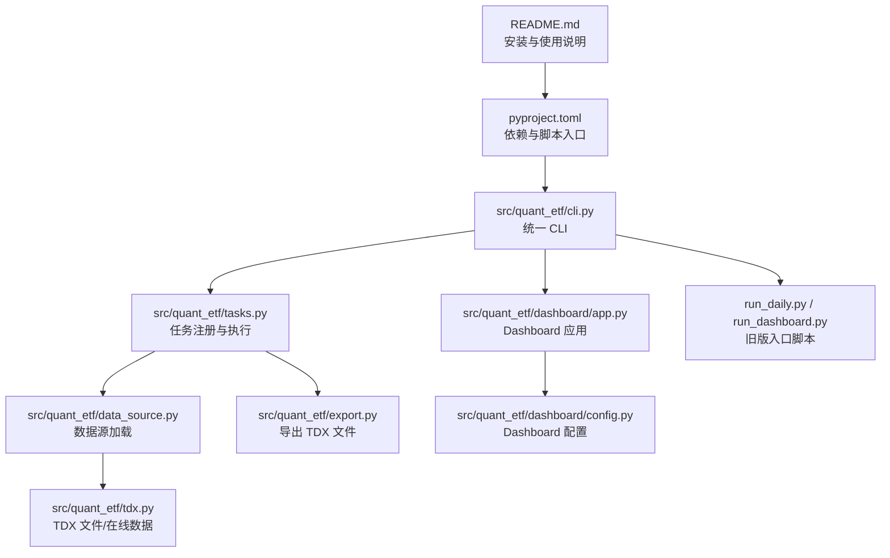
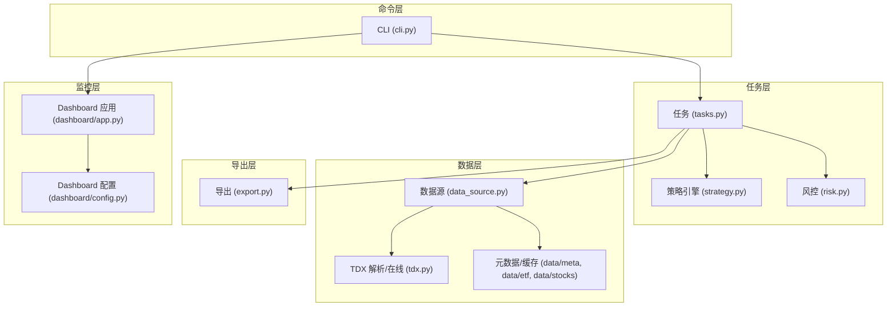
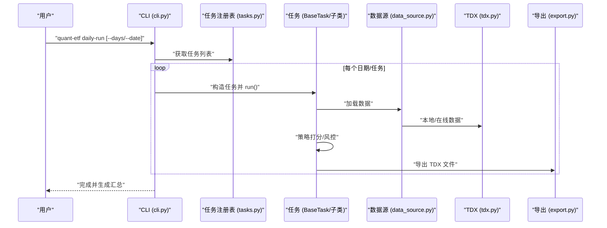
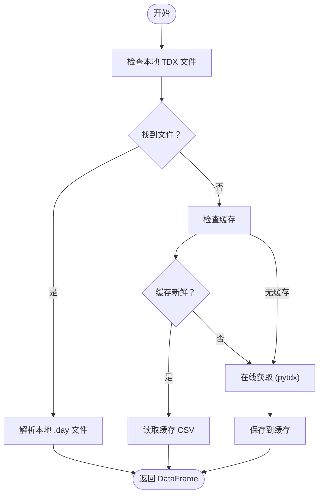
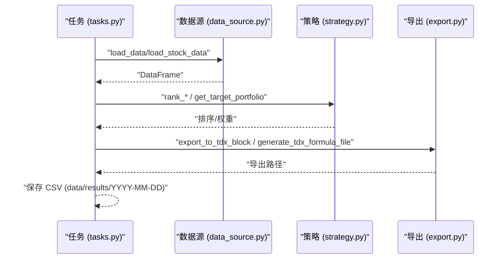
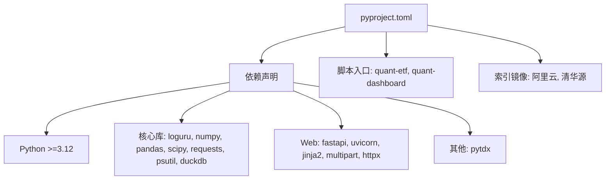

# 快速开始

<cite>
**本文引用的文件**
- [README.md](file://README.md)
- [DEVELOPMENT.md](file://DEVELOPMENT.md)
- [pyproject.toml](file://pyproject.toml)
- [src/quant_etf/conf.py](file://src/quant_etf/conf.py)
- [src/quant_etf/data_source.py](file://src/quant_etf/data_source.py)
- [src/quant_etf/tax.py](file://src/quant_etf/tdx.py)
- [src/quant_etf/cli.py](file://src/quant_etf/cli.py)
- [src/quant_etf/tasks.py](file://src/quant_etf/tasks.py)
- [src/quant_etf/export.py](file://src/quant_etf/export.py)
- [src/quant_etf/dashboard/app.py](file://src/quant_etf/dashboard/app.py)
- [src/quant_etf/dashboard/config.py](file://src/quant_etf/dashboard/config.py)
- [run_daily.py](file://run_daily.py)
- [run_dashboard.py](file://run_dashboard.py)
</cite>

## 目录
1. [简介](#简介)
2. [项目结构](#项目结构)
3. [核心组件](#核心组件)
4. [架构总览](#架构总览)
5. [详细组件分析](#详细组件分析)
6. [依赖分析](#依赖分析)
7. [性能考虑](#性能考虑)
8. [故障排除指南](#故障排除指南)
9. [结论](#结论)
10. [附录](#附录)

## 简介
Quant-ETF 是一个基于动量策略的 ETF 选股工具，支持通达信（TDX）数据源，提供本地 TDX 文件与在线数据获取两种模式。项目通过统一 CLI 提供每日选股、策略执行、分钟级数据采集、Dashboard 监控等功能，帮助用户在 30 分钟内完成首次任务运行。

## 项目结构
- 顶层入口与脚本
  - README.md：项目说明、安装与使用指南
  - pyproject.toml：项目元数据、依赖与脚本入口
  - run_daily.py、run_dashboard.py：旧版入口脚本（仍兼容）
- 核心库
  - src/quant_etf/cli.py：统一 CLI 命令分发
  - src/quant_etf/conf.py：全局配置（数据目录、权重、TDX 路径等）
  - src/quant_etf/data_source.py：数据源加载（本地 TDX → 缓存 → 在线）
  - src/quant_etf/tdx.py：TDX 文件解析与在线行情获取
  - src/quant_etf/tasks.py：任务注册与执行（ETF/短/中策略）
  - src/quant_etf/export.py：导出 TDX 可导入板块与公式文件
  - src/quant_etf/dashboard/*：Dashboard（FastAPI + SSE + SQLite/DuckDB）
- 输出与数据
  - data/：缓存与结果目录
  - output/：导出文件（TDX 导入板块、公式）



**图示来源**
- [README.md:12-31](file://README.md#L12-L31)
- [pyproject.toml:28-30](file://pyproject.toml#L28-L30)
- [src/quant_etf/cli.py:1-18](file://src/quant_etf/cli.py#L1-L18)
- [src/quant_etf/tasks.py:411-450](file://src/quant_etf/tasks.py#L411-L450)
- [src/quant_etf/data_source.py:15-381](file://src/quant_etf/data_source.py#L15-L381)
- [src/quant_etf/tdx.py:209-375](file://src/quant_etf/tdx.py#L209-L375)
- [src/quant_etf/export.py:1-118](file://src/quant_etf/export.py#L1-L118)
- [src/quant_etf/dashboard/app.py:1-87](file://src/quant_etf/dashboard/app.py#L1-L87)
- [src/quant_etf/dashboard/config.py:1-25](file://src/quant_etf/dashboard/config.py#L1-L25)
- [run_daily.py:1-20](file://run_daily.py#L1-L20)
- [run_dashboard.py:1-20](file://run_dashboard.py#L1-L20)

**章节来源**
- [README.md:253-276](file://README.md#L253-L276)
- [pyproject.toml:1-53](file://pyproject.toml#L1-L53)

## 核心组件
- CLI 统一入口：提供 daily-run、dashboard、minute-collect、backfill、restart-dashboard、run、list-tasks、check、backfill-stock-names 等命令
- 数据源加载：本地 TDX 文件 → 缓存 → 在线（pytdx）三层策略
- 任务系统：ETF 动量、短线、中期反弹三类任务，统一调度与导出
- Dashboard：FastAPI + SSE + SQLite/DuckDB，提供策略、持仓、监控、告警等页面
- 导出能力：生成 TDX 导入板块与自定义公式文件

**章节来源**
- [src/quant_etf/cli.py:324-382](file://src/quant_etf/cli.py#L324-L382)
- [src/quant_etf/data_source.py:189-285](file://src/quant_etf/data_source.py#L189-L285)
- [src/quant_etf/tasks.py:30-160](file://src/quant_etf/tasks.py#L30-L160)
- [src/quant_etf/dashboard/app.py:17-87](file://src/quant_etf/dashboard/app.py#L17-L87)
- [src/quant_etf/export.py:5-118](file://src/quant_etf/export.py#L5-L118)

## 架构总览


**图示来源**
- [src/quant_etf/cli.py:24-84](file://src/quant_etf/cli.py#L24-L84)
- [src/quant_etf/tasks.py:162-278](file://src/quant_etf/tasks.py#L162-L278)
- [src/quant_etf/data_source.py:15-381](file://src/quant_etf/data_source.py#L15-L381)
- [src/quant_etf/tdx.py:209-375](file://src/quant_etf/tdx.py#L209-L375)
- [src/quant_etf/export.py:1-118](file://src/quant_etf/export.py#L1-L118)
- [src/quant_etf/dashboard/app.py:17-87](file://src/quant_etf/dashboard/app.py#L17-L87)
- [src/quant_etf/dashboard/config.py:1-25](file://src/quant_etf/dashboard/config.py#L1-L25)

## 详细组件分析

### CLI 与命令流程
- daily-run：按日期序列运行 ETF/短/中三类任务，并生成汇总报告
- dashboard：启动 FastAPI 服务，默认监听 127.0.0.1:8522，支持 host/port/no-reload
- minute-collect：交易时段每分钟采集 ALL_POOL 的 1 分钟 K 线
- backfill：按交易日区间批量补跑历史任务
- restart-dashboard：查找并终止旧进程后重启
- run/list-tasks/check/backfill-stock-names：单任务执行、任务列表、健康检查、补齐股票名称



**图示来源**
- [src/quant_etf/cli.py:24-70](file://src/quant_etf/cli.py#L24-L70)
- [src/quant_etf/tasks.py:114-160](file://src/quant_etf/tasks.py#L114-L160)
- [src/quant_etf/data_source.py:189-285](file://src/quant_etf/data_source.py#L189-L285)
- [src/quant_etf/tdx.py:235-339](file://src/quant_etf/tdx.py#L235-L339)
- [src/quant_etf/export.py:5-118](file://src/quant_etf/export.py#L5-L118)

**章节来源**
- [src/quant_etf/cli.py:24-382](file://src/quant_etf/cli.py#L24-L382)
- [README.md:70-196](file://README.md#L70-L196)

### 数据源加载与 TDX 集成
- 三层加载策略：本地 TDX 文件 → 缓存 → 在线（pytdx）
- 自动服务器切换与心跳保活，提升在线数据稳定性
- 支持环境变量 TDX_DATA_PATH 指定 TDX 数据目录



**图示来源**
- [src/quant_etf/data_source.py:189-285](file://src/quant_etf/data_source.py#L189-L285)
- [src/quant_etf/tdx.py:235-339](file://src/quant_etf/tdx.py#L235-L339)

**章节来源**
- [src/quant_etf/data_source.py:15-381](file://src/quant_etf/data_source.py#L15-L381)
- [src/quant_etf/tdx.py:1-375](file://src/quant_etf/tdx.py#L1-L375)
- [README.md:35-68](file://README.md#L35-L68)

### Dashboard 监控系统
- 基于 FastAPI + HTMX + SQLite/DuckDB + SSE
- 默认端口 8522，支持 host/port/no-reload
- SSE 实时推送策略结果、告警、持仓更新等事件
- 数据存储：dashboard.db（SQLite）、minute_data.duckdb、results.duckdb、alerts.duckdb

```mermaid
graph TB
Browser["浏览器 (HTMX)"] < --> |HTTP| API["FastAPI 应用 (app.py)"]
API --> Pages["页面路由 (pages/*)"]
API --> Portfolio["/api/portfolio/*"]
API --> Strategy["/api/strategy/*"]
API --> Alerts["/api/alerts/*"]
API --> Market["/api/market/*"]
API --> SSE["/events (SSE)"]
SSE --> Clients["浏览器 EventSource"]
API --> DB["SQLite/DuckDB (dashboard/config.py)"]
```

**图示来源**
- [src/quant_etf/dashboard/app.py:17-87](file://src/quant_etf/dashboard/app.py#L17-L87)
- [src/quant_etf/dashboard/config.py:1-25](file://src/quant_etf/dashboard/config.py#L1-L25)
- [README.md:319-589](file://README.md#L319-L589)

**章节来源**
- [src/quant_etf/dashboard/app.py:1-87](file://src/quant_etf/dashboard/app.py#L1-L87)
- [src/quant_etf/dashboard/config.py:1-25](file://src/quant_etf/dashboard/config.py#L1-L25)
- [README.md:319-589](file://README.md#L319-L589)

### 任务与导出流程
- 任务执行：加载数据 → 策略打分 → 风控校验 → 导出 CSV 与 TDX 文件
- 导出：TDX 导入板块文件、自定义公式文件；可自动写入 TDX 自定义板块



**图示来源**
- [src/quant_etf/tasks.py:162-278](file://src/quant_etf/tasks.py#L162-L278)
- [src/quant_etf/data_source.py:189-285](file://src/quant_etf/data_source.py#L189-L285)
- [src/quant_etf/export.py:5-118](file://src/quant_etf/export.py#L5-L118)

**章节来源**
- [src/quant_etf/tasks.py:162-450](file://src/quant_etf/tasks.py#L162-L450)
- [src/quant_etf/export.py:1-118](file://src/quant_etf/export.py#L1-L118)

## 依赖分析
- Python 版本：项目要求 Python 3.12+（注意与 README 中 3.11+ 的差异）
- 关键依赖：loguru、numpy、pandas、pytdx、scipy、requests、psutil、duckdb、fastapi、uvicorn、jinja2、httpx
- 脚本入口：quant-etf、quant-dashboard
- 索引镜像：阿里云、清华源



**图示来源**
- [pyproject.toml:1-53](file://pyproject.toml#L1-L53)

**章节来源**
- [pyproject.toml:1-53](file://pyproject.toml#L1-L53)
- [README.md:14-31](file://README.md#L14-L31)

## 性能考虑
- 数据加载优先本地 TDX 文件，其次缓存，最后在线获取，减少网络开销
- 在线数据获取支持服务器缓存与自动切换，提高成功率
- Dashboard 使用 SSE 降低前端复杂度，实时推送事件
- 建议在稳定网络环境下运行 daily-run，避免频繁在线请求

[本节为通用建议，无需特定文件引用]

## 故障排除指南
- Linux 下测试失败：可通过环境变量 TDX_DATA_PATH 指定 TDX 数据目录，或跳过集成测试
- 在线数据获取失败：检查网络与 pytdx 安装状态
- Dashboard 无法访问：确认端口占用与 host 绑定；使用 restart-dashboard 一键重启
- TDX 导入失败：确认导出文件路径与通达信自定义板块目录配置

**章节来源**
- [README.md:299-317](file://README.md#L299-L317)
- [README.md:355-380](file://README.md#L355-L380)

## 结论
通过统一 CLI 与清晰的数据流设计，Quant-ETF 能够在 30 分钟内完成从安装、配置、数据准备到首次任务运行与 Dashboard 监控的全流程。建议新用户优先使用 uv 安装，按需配置 TDX 数据目录，随后运行 daily-run 与 dashboard 验证链路。

[本节为总结性内容，无需特定文件引用]

## 附录

### 快速开始步骤（30 分钟）
- 环境准备
  - 安装 Python 3.12+ 与 uv（推荐）
  - 克隆仓库并进入目录
- 安装依赖
  - 使用 uv 同步依赖或使用 pip 安装
- 配置 TDX 数据源
  - Windows/Linux 环境变量或配置文件设置 TDX 数据目录
- 首次运行
  - 运行每日选股任务（daily-run）
  - 查看导出文件与输出目录
- 启动 Dashboard
  - 启动监控面板，访问默认端口
- 常见问题
  - 参考 README 的常见问题与故障排除章节

**章节来源**
- [README.md:12-31](file://README.md#L12-L31)
- [README.md:35-68](file://README.md#L35-L68)
- [README.md:70-196](file://README.md#L70-L196)
- [README.md:299-317](file://README.md#L299-L317)