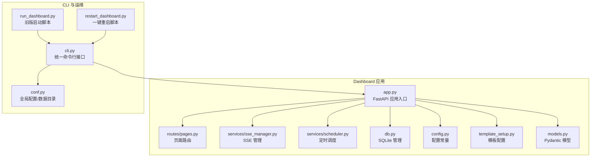
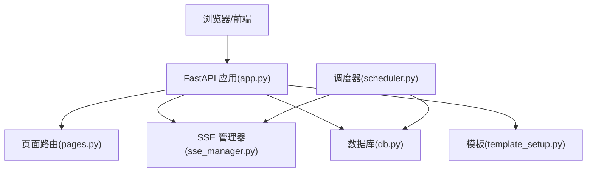
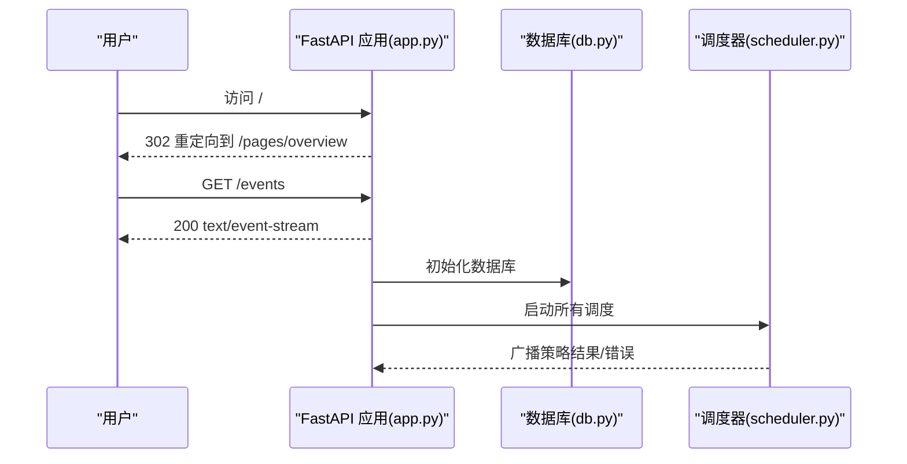
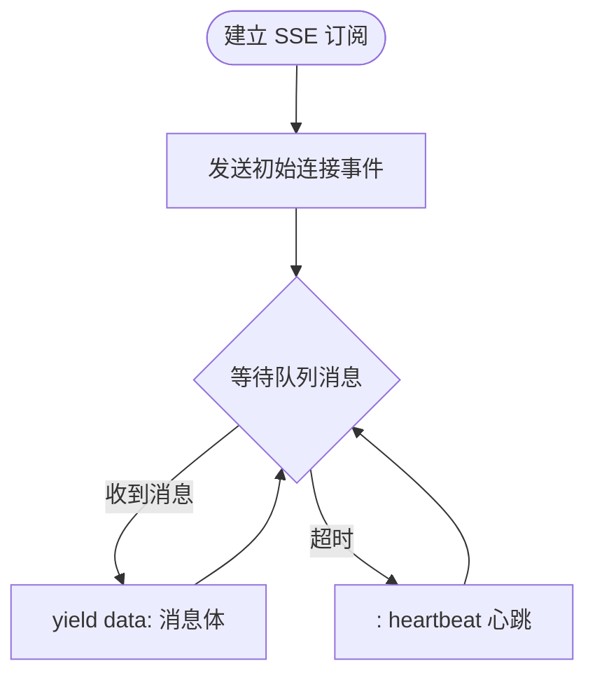
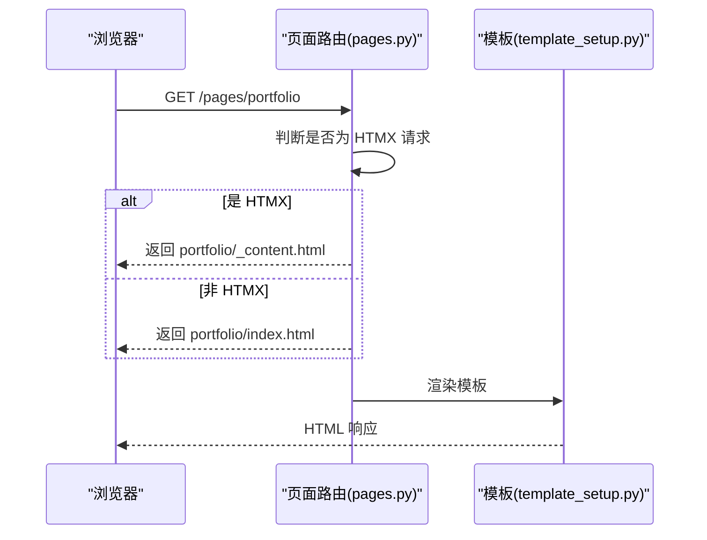
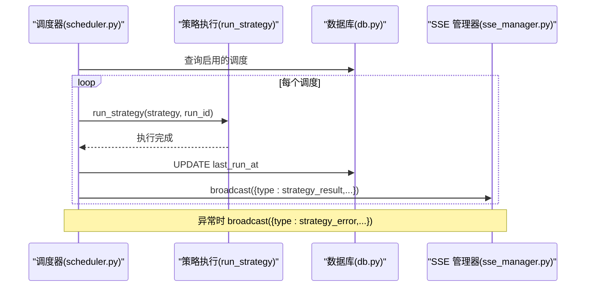
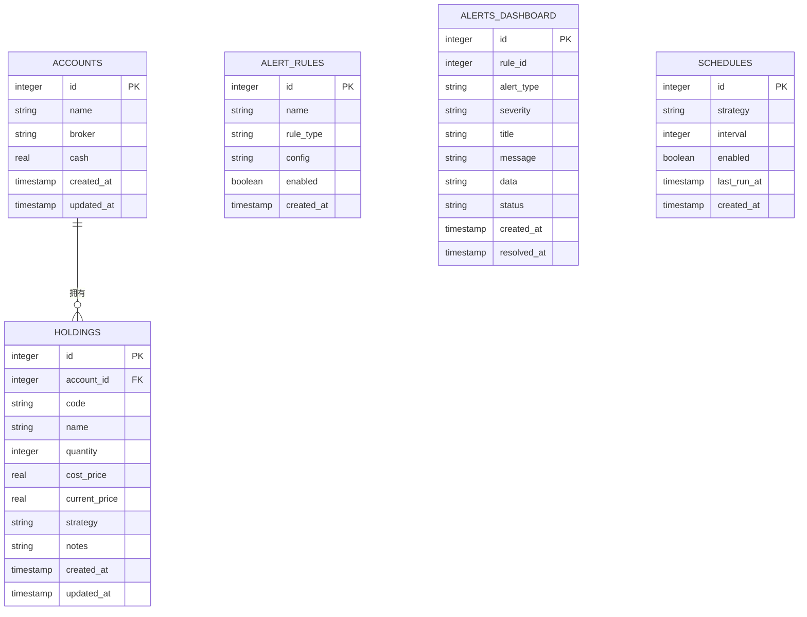
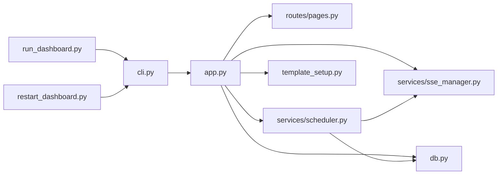

# Dashboard监控问题

<cite>
**本文引用的文件**
- [src/quant_etf/dashboard/app.py](file://src/quant_etf/dashboard/app.py)
- [src/quant_etf/dashboard/services/sse_manager.py](file://src/quant_etf/dashboard/services/sse_manager.py)
- [src/quant_etf/dashboard/db.py](file://src/quant_etf/dashboard/db.py)
- [src/quant_etf/dashboard/config.py](file://src/quant_etf/dashboard/config.py)
- [src/quant_etf/dashboard/routes/pages.py](file://src/quant_etf/dashboard/routes/pages.py)
- [src/quant_etf/dashboard/services/scheduler.py](file://src/quant_etf/dashboard/services/scheduler.py)
- [src/quant_etf/dashboard/models.py](file://src/quant_etf/dashboard/models.py)
- [src/quant_etf/dashboard/template_setup.py](file://src/quant_etf/dashboard/template_setup.py)
- [src/quant_etf/cli.py](file://src/quant_etf/cli.py)
- [run_dashboard.py](file://run_dashboard.py)
- [restart_dashboard.py](file://restart_dashboard.py)
- [src/quant_etf/conf.py](file://src/quant_etf/conf.py)
</cite>

## 目录
1. [简介](#简介)
2. [项目结构](#项目结构)
3. [核心组件](#核心组件)
4. [架构总览](#架构总览)
5. [详细组件分析](#详细组件分析)
6. [依赖分析](#依赖分析)
7. [性能考虑](#性能考虑)
8. [故障排除指南](#故障排除指南)
9. [结论](#结论)
10. [附录](#附录)

## 简介
本指南聚焦Quant-ETF项目Dashboard监控系统的故障排除与运维实践，覆盖Web服务启动失败、端口占用、SSE连接断开、页面加载错误、数据库连接异常等问题。同时提供健康检查方法、SSE事件流调试技巧、前端HTMX交互诊断、数据库性能优化建议，以及Dashboard重启、日志分析与性能监控的操作指南。

## 项目结构
Dashboard位于quant_etf模块的dashboard包内，采用FastAPI作为Web框架，Jinja2模板渲染页面，SQLite存储看板业务数据，SSE用于实时事件推送，定时任务通过调度器驱动策略执行并广播结果。

图表来源
- [src/quant_etf/dashboard/app.py:1-92](file://src/quant_etf/dashboard/app.py#L1-L92)
- [src/quant_etf/dashboard/routes/pages.py:1-75](file://src/quant_etf/dashboard/routes/pages.py#L1-L75)
- [src/quant_etf/dashboard/services/sse_manager.py:1-45](file://src/quant_etf/dashboard/services/sse_manager.py#L1-L45)
- [src/quant_etf/dashboard/services/scheduler.py:1-82](file://src/quant_etf/dashboard/services/scheduler.py#L1-L82)
- [src/quant_etf/dashboard/db.py:1-133](file://src/quant_etf/dashboard/db.py#L1-L133)
- [src/quant_etf/dashboard/config.py:1-25](file://src/quant_etf/dashboard/config.py#L1-L25)
- [src/quant_etf/dashboard/template_setup.py:1-10](file://src/quant_etf/dashboard/template_setup.py#L1-L10)
- [src/quant_etf/dashboard/models.py:1-54](file://src/quant_etf/dashboard/models.py#L1-L54)
- [src/quant_etf/cli.py:1-403](file://src/quant_etf/cli.py#L1-L403)
- [run_dashboard.py:1-20](file://run_dashboard.py#L1-L20)
- [restart_dashboard.py:1-20](file://restart_dashboard.py#L1-L20)
- [src/quant_etf/conf.py:1-137](file://src/quant_etf/conf.py#L1-L137)

章节来源
- [src/quant_etf/dashboard/app.py:1-92](file://src/quant_etf/dashboard/app.py#L1-L92)
- [src/quant_etf/cli.py:1-403](file://src/quant_etf/cli.py#L1-L403)

## 核心组件
- Web应用入口与路由挂载：负责启动、关闭生命周期、SSE事件流端点、根路径重定向与favicon处理。
- SSE管理器：维护客户端队列，实现订阅、心跳保活与广播。
- 定时调度器：读取数据库中的调度配置，周期性触发策略执行并通过SSE广播结果。
- 数据库层：SQLite表结构与连接管理（WAL模式、外键开启）。
- 页面路由与HTMX：根据请求头判断是否为HTMX请求，返回完整页面或内容片段。
- 配置与模板：端口、心跳间隔、模板目录等。
- CLI与运维：统一命令行入口，支持健康检查、一键重启、端口/主机/热重载参数控制。

章节来源
- [src/quant_etf/dashboard/app.py:1-92](file://src/quant_etf/dashboard/app.py#L1-L92)
- [src/quant_etf/dashboard/services/sse_manager.py:1-45](file://src/quant_etf/dashboard/services/sse_manager.py#L1-L45)
- [src/quant_etf/dashboard/services/scheduler.py:1-82](file://src/quant_etf/dashboard/services/scheduler.py#L1-L82)
- [src/quant_etf/dashboard/db.py:1-133](file://src/quant_etf/dashboard/db.py#L1-L133)
- [src/quant_etf/dashboard/routes/pages.py:1-75](file://src/quant_etf/dashboard/routes/pages.py#L1-L75)
- [src/quant_etf/dashboard/config.py:1-25](file://src/quant_etf/dashboard/config.py#L1-L25)
- [src/quant_etf/dashboard/template_setup.py:1-10](file://src/quant_etf/dashboard/template_setup.py#L1-L10)
- [src/quant_etf/dashboard/models.py:1-54](file://src/quant_etf/dashboard/models.py#L1-L54)
- [src/quant_etf/cli.py:1-403](file://src/quant_etf/cli.py#L1-L403)

## 架构总览
Dashboard采用“应用层-服务层-数据层-模板层”分层设计，SSE贯穿服务层与前端，定时任务驱动策略执行并回传结果；CLI提供统一运维入口。

图表来源
- [src/quant_etf/dashboard/app.py:1-92](file://src/quant_etf/dashboard/app.py#L1-L92)
- [src/quant_etf/dashboard/routes/pages.py:1-75](file://src/quant_etf/dashboard/routes/pages.py#L1-L75)
- [src/quant_etf/dashboard/services/sse_manager.py:1-45](file://src/quant_etf/dashboard/services/sse_manager.py#L1-L45)
- [src/quant_etf/dashboard/services/scheduler.py:1-82](file://src/quant_etf/dashboard/services/scheduler.py#L1-L82)
- [src/quant_etf/dashboard/db.py:1-133](file://src/quant_etf/dashboard/db.py#L1-L133)
- [src/quant_etf/dashboard/template_setup.py:1-10](file://src/quant_etf/dashboard/template_setup.py#L1-L10)

## 详细组件分析

### Web应用与生命周期
- 启动阶段：初始化数据库、启动调度器；关闭阶段：停止所有调度任务。
- 异常处理：捕获未处理异常并返回JSON错误响应。
- SSE端点：设置缓存控制、连接保持与反向代理缓冲标志。
- 根路径与favicon：根路径重定向到总览页，favicon返回空内容避免404。

图表来源
- [src/quant_etf/dashboard/app.py:27-65](file://src/quant_etf/dashboard/app.py#L27-L65)
- [src/quant_etf/dashboard/db.py:79-91](file://src/quant_etf/dashboard/db.py#L79-L91)
- [src/quant_etf/dashboard/services/scheduler.py:54-63](file://src/quant_etf/dashboard/services/scheduler.py#L54-L63)

章节来源
- [src/quant_etf/dashboard/app.py:1-92](file://src/quant_etf/dashboard/app.py#L1-L92)
- [src/quant_etf/dashboard/db.py:1-133](file://src/quant_etf/dashboard/db.py#L1-L133)
- [src/quant_etf/dashboard/services/scheduler.py:1-82](file://src/quant_etf/dashboard/services/scheduler.py#L1-L82)

### SSE事件流与心跳保活
- 订阅流程：每个新连接创建队列并发送初始连接事件，随后循环等待队列消息；超时则发送心跳。
- 广播机制：遍历当前所有队列投递事件，异常时移除失效队列。
- 心跳间隔：由配置常量控制，确保长连接不被中间代理或浏览器断开。

图表来源
- [src/quant_etf/dashboard/services/sse_manager.py:14-32](file://src/quant_etf/dashboard/services/sse_manager.py#L14-L32)
- [src/quant_etf/dashboard/config.py:20-21](file://src/quant_etf/dashboard/config.py#L20-L21)

章节来源
- [src/quant_etf/dashboard/services/sse_manager.py:1-45](file://src/quant_etf/dashboard/services/sse_manager.py#L1-L45)
- [src/quant_etf/dashboard/config.py:1-25](file://src/quant_etf/dashboard/config.py#L1-L25)

### 页面路由与HTMX交互
- 路由规则：/pages/* 对应不同页面模板，支持HTMX请求仅返回内容片段。
- 统计数据：总览页统计账户数、当日告警数、启用调度数。
- 内容片段：HTMX请求头存在时返回对应片段模板，避免重复嵌套base.html。

图表来源
- [src/quant_etf/dashboard/routes/pages.py:40-74](file://src/quant_etf/dashboard/routes/pages.py#L40-L74)
- [src/quant_etf/dashboard/template_setup.py:1-10](file://src/quant_etf/dashboard/template_setup.py#L1-L10)

章节来源
- [src/quant_etf/dashboard/routes/pages.py:1-75](file://src/quant_etf/dashboard/routes/pages.py#L1-L75)
- [src/quant_etf/dashboard/template_setup.py:1-10](file://src/quant_etf/dashboard/template_setup.py#L1-L10)

### 定时调度与策略执行
- 启动逻辑：读取启用的调度记录，为每条记录创建异步任务，按间隔循环执行策略。
- 结果广播：每次执行后更新last_run_at，并通过SSE广播结果或错误事件。
- 错误处理：捕获异常并广播错误事件，便于前端与监控感知。

图表来源
- [src/quant_etf/dashboard/services/scheduler.py:19-52](file://src/quant_etf/dashboard/services/scheduler.py#L19-L52)
- [src/quant_etf/dashboard/services/sse_manager.py:34-41](file://src/quant_etf/dashboard/services/sse_manager.py#L34-L41)
- [src/quant_etf/dashboard/db.py:114-122](file://src/quant_etf/dashboard/db.py#L114-L122)

章节来源
- [src/quant_etf/dashboard/services/scheduler.py:1-82](file://src/quant_etf/dashboard/services/scheduler.py#L1-L82)

### 数据库模型与连接管理
- 表结构：账户、持仓、告警规则、告警记录、调度配置。
- 连接特性：WAL模式提升并发读写，外键约束保证数据一致性。
- 访问接口：提供查询、单行查询、写入、批量写入等通用方法。

图表来源
- [src/quant_etf/dashboard/db.py:11-66](file://src/quant_etf/dashboard/db.py#L11-L66)

章节来源
- [src/quant_etf/dashboard/db.py:1-133](file://src/quant_etf/dashboard/db.py#L1-L133)

### 配置与模板
- 配置项：数据库路径、DuckDB数据路径、主机/端口、SSE心跳间隔、阈值等。
- 模板目录：Jinja2模板目录，避免循环导入。

章节来源
- [src/quant_etf/dashboard/config.py:1-25](file://src/quant_etf/dashboard/config.py#L1-L25)
- [src/quant_etf/dashboard/template_setup.py:1-10](file://src/quant_etf/dashboard/template_setup.py#L1-L10)

## 依赖分析
- 组件耦合：应用层对路由、SSE、调度、数据库、模板均有直接依赖；调度器依赖策略执行与SSE；页面路由依赖模板与数据库查询。
- 外部依赖：FastAPI、loguru、sqlite3、Jinja2、uvicorn（通过CLI运行）。
- 运维依赖：CLI提供健康检查与一键重启，重启脚本内部调用CLI。

图表来源
- [src/quant_etf/dashboard/app.py:1-92](file://src/quant_etf/dashboard/app.py#L1-L92)
- [src/quant_etf/dashboard/routes/pages.py:1-75](file://src/quant_etf/dashboard/routes/pages.py#L1-L75)
- [src/quant_etf/dashboard/services/sse_manager.py:1-45](file://src/quant_etf/dashboard/services/sse_manager.py#L1-L45)
- [src/quant_etf/dashboard/services/scheduler.py:1-82](file://src/quant_etf/dashboard/services/scheduler.py#L1-L82)
- [src/quant_etf/dashboard/db.py:1-133](file://src/quant_etf/dashboard/db.py#L1-L133)
- [src/quant_etf/dashboard/template_setup.py:1-10](file://src/quant_etf/dashboard/template_setup.py#L1-L10)
- [src/quant_etf/cli.py:1-403](file://src/quant_etf/cli.py#L1-L403)
- [run_dashboard.py:1-20](file://run_dashboard.py#L1-L20)
- [restart_dashboard.py:1-20](file://restart_dashboard.py#L1-L20)

章节来源
- [src/quant_etf/cli.py:1-403](file://src/quant_etf/cli.py#L1-L403)

## 性能考虑
- 数据库：WAL模式提升并发读写吞吐；外键开启保障一致性但会增加写入开销；建议在高频写场景下评估事务批量提交与索引策略。
- SSE：心跳保活降低连接中断概率；广播时需注意队列数量增长导致的内存与CPU压力。
- 调度：异步任务避免阻塞；建议合理设置最小间隔与任务粒度，避免过度竞争。
- 模板渲染：静态资源与模板缓存策略可减少I/O；HTMX片段化可降低重复渲染成本。

## 故障排除指南

### Web服务启动失败
- 现象：启动报错、无法绑定端口、优雅关闭卡住。
- 排查步骤：
  - 检查端口占用：使用系统netstat或ps命令确认端口是否被占用。
  - 环境变量：确认主机与端口环境变量是否正确，或通过CLI参数覆盖。
  - 热重载：开发时可禁用热重载以减少启动复杂度。
  - 优雅关闭：应用已设置较短的优雅关闭超时，避免SSE长连接阻塞退出。
- 参考实现位置：
  - [src/quant_etf/dashboard/app.py:74-87](file://src/quant_etf/dashboard/app.py#L74-L87)
  - [src/quant_etf/cli.py:72-83](file://src/quant_etf/cli.py#L72-L83)

章节来源
- [src/quant_etf/dashboard/app.py:74-87](file://src/quant_etf/dashboard/app.py#L74-L87)
- [src/quant_etf/cli.py:72-83](file://src/quant_etf/cli.py#L72-L83)

### 端口占用问题
- 现象：启动时报端口已被占用。
- 解决方案：
  - 使用CLI一键重启：自动查找并终止占用端口的进程，再启动新服务。
  - 或手动释放：定位PID后终止进程，等待端口释放后再启动。
- 参考实现位置：
  - [src/quant_etf/cli.py:189-254](file://src/quant_etf/cli.py#L189-L254)

章节来源
- [src/quant_etf/cli.py:189-254](file://src/quant_etf/cli.py#L189-L254)

### SSE连接断开
- 现象：页面SSE连接中断、长时间无事件。
- 排查步骤：
  - 检查SSE心跳：心跳间隔由配置常量控制，确保网络与代理不拦截心跳帧。
  - 查看订阅端点：确认SSE端点返回正确的媒体类型与头部。
  - 观察广播：调度器执行后应通过SSE广播事件；若无事件，检查调度器是否正常运行。
- 参考实现位置：
  - [src/quant_etf/dashboard/app.py:39-50](file://src/quant_etf/dashboard/app.py#L39-L50)
  - [src/quant_etf/dashboard/services/sse_manager.py:14-32](file://src/quant_etf/dashboard/services/sse_manager.py#L14-L32)
  - [src/quant_etf/dashboard/services/scheduler.py:34-50](file://src/quant_etf/dashboard/services/scheduler.py#L34-L50)
  - [src/quant_etf/dashboard/config.py:20-21](file://src/quant_etf/dashboard/config.py#L20-L21)

章节来源
- [src/quant_etf/dashboard/app.py:39-50](file://src/quant_etf/dashboard/app.py#L39-L50)
- [src/quant_etf/dashboard/services/sse_manager.py:14-32](file://src/quant_etf/dashboard/services/sse_manager.py#L14-L32)
- [src/quant_etf/dashboard/services/scheduler.py:34-50](file://src/quant_etf/dashboard/services/scheduler.py#L34-L50)
- [src/quant_etf/dashboard/config.py:20-21](file://src/quant_etf/dashboard/config.py#L20-L21)

### 页面加载错误
- 现象：页面空白、片段加载失败、HTMX交互异常。
- 排查步骤：
  - 确认HTMX请求头：非HTMX请求返回完整页面，HTMX请求返回内容片段。
  - 检查模板路径：确认模板目录配置正确，模板文件存在。
  - 数据查询：总览页统计依赖数据库查询，检查查询语句与表结构。
- 参考实现位置：
  - [src/quant_etf/dashboard/routes/pages.py:20-74](file://src/quant_etf/dashboard/routes/pages.py#L20-L74)
  - [src/quant_etf/dashboard/template_setup.py:1-10](file://src/quant_etf/dashboard/template_setup.py#L1-L10)
  - [src/quant_etf/dashboard/db.py:93-111](file://src/quant_etf/dashboard/db.py#L93-L111)

章节来源
- [src/quant_etf/dashboard/routes/pages.py:20-74](file://src/quant_etf/dashboard/routes/pages.py#L20-L74)
- [src/quant_etf/dashboard/template_setup.py:1-10](file://src/quant_etf/dashboard/template_setup.py#L1-L10)
- [src/quant_etf/dashboard/db.py:93-111](file://src/quant_etf/dashboard/db.py#L93-L111)

### 数据库连接异常
- 现象：初始化失败、查询/写入异常、锁等待。
- 排查步骤：
  - 检查数据库路径：确保数据目录存在且可写。
  - WAL与外键：确认WAL模式与外键已启用，必要时检查权限。
  - 连接生命周期：所有数据库操作均在本地作用域内打开/关闭连接，避免连接泄漏。
- 参考实现位置：
  - [src/quant_etf/dashboard/db.py:69-91](file://src/quant_etf/dashboard/db.py#L69-L91)

章节来源
- [src/quant_etf/dashboard/db.py:69-91](file://src/quant_etf/dashboard/db.py#L69-L91)

### 服务健康检查
- 方法：CLI提供健康检查命令，对多个页面进行GET请求并输出状态码与响应长度。
- 使用示例：通过--port指定端口，快速验证页面可达性。
- 参考实现位置：
  - [src/quant_etf/cli.py:309-322](file://src/quant_etf/cli.py#L309-L322)

章节来源
- [src/quant_etf/cli.py:309-322](file://src/quant_etf/cli.py#L309-L322)

### SSE事件流调试技巧
- 在浏览器开发者工具Network面板观察SSE连接，确认事件帧格式与心跳。
- 在应用侧查看日志，关注调度器广播事件与SSE管理器队列变化。
- 临时缩短心跳间隔以加速问题复现（谨慎使用）。

章节来源
- [src/quant_etf/dashboard/services/sse_manager.py:14-32](file://src/quant_etf/dashboard/services/sse_manager.py#L14-L32)
- [src/quant_etf/dashboard/services/scheduler.py:34-50](file://src/quant_etf/dashboard/services/scheduler.py#L34-L50)

### 前端HTMX交互问题诊断
- 确认请求头：HTMX请求需携带特定请求头，后端据此返回片段或完整页面。
- 检查目标容器：确认HTMX目标容器与模板片段匹配。
- 分段测试：先单独请求片段模板，确认渲染无误后再集成到页面。

章节来源
- [src/quant_etf/dashboard/routes/pages.py:20-22](file://src/quant_etf/dashboard/routes/pages.py#L20-L22)

### 数据库性能优化
- 事务批处理：批量写入使用批量执行接口，减少往返开销。
- 索引策略：根据查询模式为常用字段建立索引（如账户关联、时间戳）。
- WAL与并发：WAL模式提升并发读写，但需定期检查磁盘空间与checkpoint策略。

章节来源
- [src/quant_etf/dashboard/db.py:125-132](file://src/quant_etf/dashboard/db.py#L125-L132)

### Dashboard重启与运维
- 一键重启：CLI命令自动查找并终止占用端口的进程，再启动新服务。
- 传统脚本：run_dashboard.py与restart_dashboard.py仍可使用，但推荐统一走CLI。
- 日志：CLI与各模块均使用loguru输出日志，结合系统日志定位问题。

章节来源
- [src/quant_etf/cli.py:189-254](file://src/quant_etf/cli.py#L189-L254)
- [run_dashboard.py:1-20](file://run_dashboard.py#L1-L20)
- [restart_dashboard.py:1-20](file://restart_dashboard.py#L1-L20)

## 结论
Dashboard监控系统围绕FastAPI、SSE、SQLite与定时调度构建，具备清晰的分层与职责划分。针对常见问题，可通过CLI健康检查、SSE心跳与广播观测、HTMX请求头识别、数据库连接与WAL特性排查，以及一键重启与日志分析快速定位并解决问题。建议在生产环境中合理设置调度间隔、优化数据库索引与事务批处理，并通过SSE心跳与日志监控保障系统稳定性。

## 附录
- 常用命令参考：
  - 启动Dashboard：通过CLI指定端口与主机，或使用旧版脚本。
  - 健康检查：对多个页面进行GET请求验证。
  - 一键重启：自动终止占用端口进程并启动新服务。
- 关键配置参考：
  - 主机与端口、SSE心跳间隔、数据库路径等。

章节来源
- [src/quant_etf/cli.py:335-356](file://src/quant_etf/cli.py#L335-L356)
- [src/quant_etf/dashboard/config.py:17-21](file://src/quant_etf/dashboard/config.py#L17-L21)
- [run_dashboard.py:1-20](file://run_dashboard.py#L1-L20)
- [restart_dashboard.py:1-20](file://restart_dashboard.py#L1-L20)