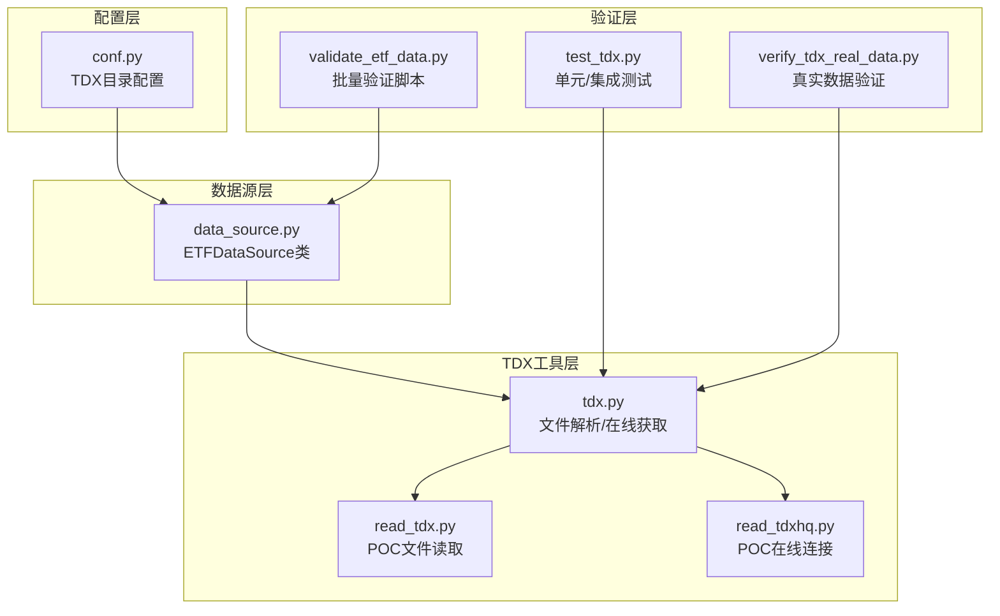
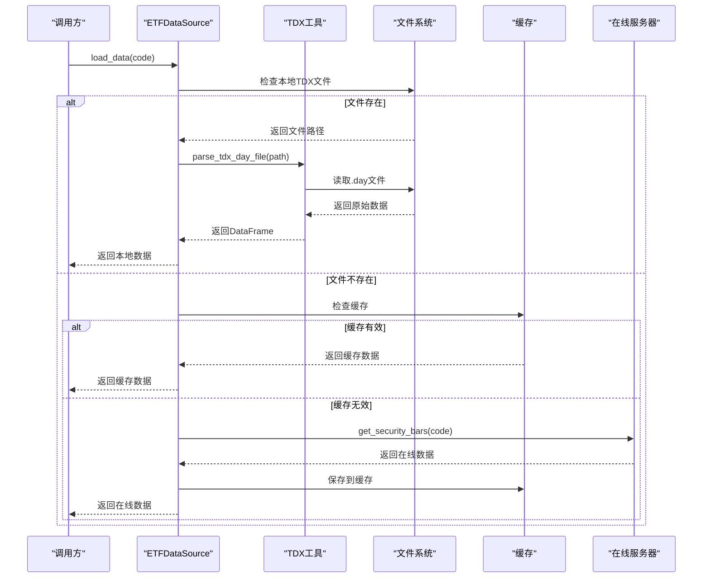
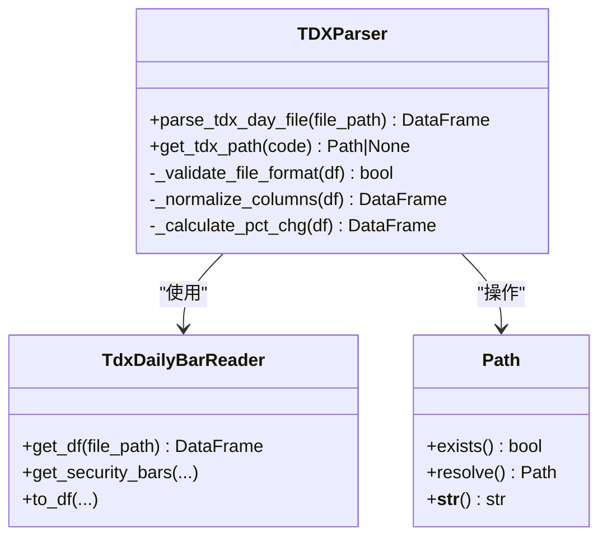
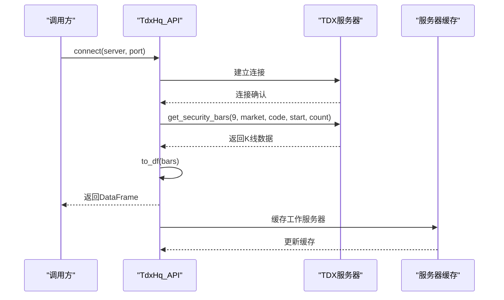
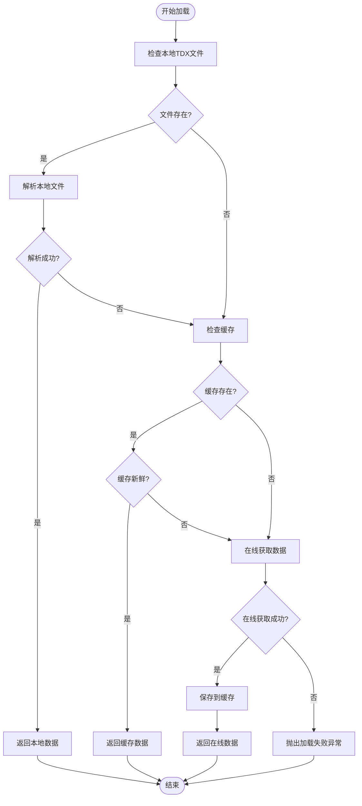
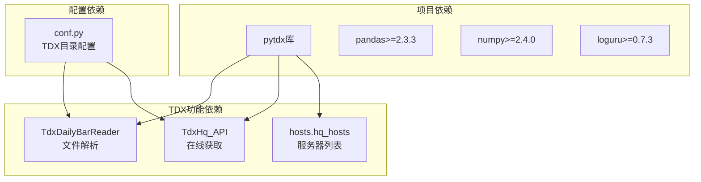

# TDX数据源问题

<cite>
**本文档引用的文件**
- [src/quant_etf/tdx.py](file://src/quant_etf/tdx.py)
- [src/quant_etf/data_source.py](file://src/quant_etf/data_source.py)
- [src/quant_etf/conf.py](file://src/quant_etf/conf.py)
- [src/poc/read_tdx.py](file://src/poc/read_tdx.py)
- [src/poc/read_tdxhq.py](file://src/poc/read_tdxhq.py)
- [tests/test_tdx.py](file://tests/test_tdx.py)
- [tests/verify_tdx_real_data.py](file://tests/verify_tdx_real_data.py)
- [scripts/validate_etf_data.py](file://scripts/validate_etf_data.py)
- [pyproject.toml](file://pyproject.toml)
</cite>

## 目录
1. [简介](#简介)
2. [项目结构](#项目结构)
3. [核心组件](#核心组件)
4. [架构概览](#架构概览)
5. [详细组件分析](#详细组件分析)
6. [依赖分析](#依赖分析)
7. [性能考虑](#性能考虑)
8. [故障排除指南](#故障排除指南)
9. [结论](#结论)
10. [附录](#附录)

## 简介
本指南专注于Quant-ETF项目中的TDX数据源故障排除。文档覆盖本地TDX数据文件读取失败、在线数据获取超时、pytdx库版本兼容性问题、数据格式不匹配等常见错误，并提供TDX目录路径配置验证方法、数据文件完整性检查、网络连接测试、代理服务器配置等解决方案。同时包含不同操作系统下TDX数据目录的正确配置路径和权限设置指导。

## 项目结构
Quant-ETF项目围绕TDX数据源构建了完整的数据获取与处理链路，主要涉及以下模块：
- 配置模块：负责TDX数据目录路径解析与默认值设置
- 数据源模块：实现本地文件优先的加载策略，支持缓存与在线回退
- TDX工具模块：封装pytdx库的文件解析与在线行情获取
- POC演示模块：提供简单的TDX文件读取与在线连接示例
- 测试模块：验证TDX路径解析、文件解析、真实数据读取等
- 验证脚本：批量验证ETF数据加载与质量



**图表来源**
- [src/quant_etf/conf.py:100-117](file://src/quant_etf/conf.py#L100-L117)
- [src/quant_etf/data_source.py:189-236](file://src/quant_etf/data_source.py#L189-L236)
- [src/quant_etf/tdx.py:209-375](file://src/quant_etf/tdx.py#L209-L375)
- [src/poc/read_tdx.py:10-15](file://src/poc/read_tdx.py#L10-L15)
- [src/poc/read_tdxhq.py:46-116](file://src/poc/read_tdxhq.py#L46-L116)
- [tests/test_tdx.py:11-175](file://tests/test_tdx.py#L11-L175)
- [tests/verify_tdx_real_data.py:13-64](file://tests/verify_tdx_real_data.py#L13-L64)
- [scripts/validate_etf_data.py:22-113](file://scripts/validate_etf_data.py#L22-L113)

**章节来源**
- [src/quant_etf/conf.py:100-117](file://src/quant_etf/conf.py#L100-L117)
- [src/quant_etf/data_source.py:189-236](file://src/quant_etf/data_source.py#L189-L236)
- [src/quant_etf/tdx.py:209-375](file://src/quant_etf/tdx.py#L209-L375)

## 核心组件
本节深入分析TDX数据源的关键组件及其职责：

### 配置组件（conf.py）
- TDX目录解析：支持环境变量TDX_DATA_PATH覆盖，默认路径根据操作系统选择
- Windows默认路径：C:\new_hxzq_hc_error（注意：实际部署时应指向真实TDX安装目录）
- Linux/macOS默认路径：~/.local/share/tdx
- VIPDOC目录：TDX_DIR/vipdoc，包含lday子目录和.sh/.sz文件

### 数据源组件（data_source.py）
- 加载策略：本地TDX文件 → 缓存 → 在线获取
- 新鲜度检查：基于交易日历的智能判断
- 错误处理：逐级降级，最终抛出明确异常
- 缓存管理：CSV格式缓存，支持迁移与原子写入

### TDX工具组件（tdx.py）
- 文件解析：parse_tdx_day_file使用pytdx.reader.TdxDailyBarReader
- 在线获取：get_security_bars通过pytdx.hq.TdxHq_API连接服务器
- 服务器发现：内置多个HQ主机，支持缓存工作服务器
- 数据标准化：统一列名、索引、涨跌幅计算

**章节来源**
- [src/quant_etf/conf.py:100-117](file://src/quant_etf/conf.py#L100-L117)
- [src/quant_etf/data_source.py:189-236](file://src/quant_etf/data_source.py#L189-L236)
- [src/quant_etf/tdx.py:341-375](file://src/quant_etf/tdx.py#L341-L375)

## 架构概览
TDX数据源采用"本地优先、在线回退"的架构设计，确保在各种网络环境下都能稳定获取数据。



**图表来源**
- [src/quant_etf/data_source.py:189-236](file://src/quant_etf/data_source.py#L189-L236)
- [src/quant_etf/tdx.py:235-339](file://src/quant_etf/tdx.py#L235-L339)

## 详细组件分析

### TDX文件解析组件分析
TDX文件解析组件负责将通达信的日线数据文件转换为统一的DataFrame格式。



**图表来源**
- [src/quant_etf/tdx.py:341-375](file://src/quant_etf/tdx.py#L341-L375)
- [src/quant_etf/tdx.py:209-233](file://src/quant_etf/tdx.py#L209-L233)

### 在线数据获取组件分析
在线数据获取组件通过pytdx库连接TDX行情服务器，支持多服务器自动切换。



**图表来源**
- [src/quant_etf/tdx.py:37-92](file://src/quant_etf/tdx.py#L37-L92)
- [src/quant_etf/tdx.py:235-339](file://src/quant_etf/tdx.py#L235-L339)

### 数据源加载流程分析
数据源组件实现了完整的数据加载策略，包含错误处理和降级机制。



**图表来源**
- [src/quant_etf/data_source.py:189-236](file://src/quant_etf/data_source.py#L189-L236)
- [src/quant_etf/data_source.py:238-285](file://src/quant_etf/data_source.py#L238-L285)

**章节来源**
- [src/quant_etf/tdx.py:341-375](file://src/quant_etf/tdx.py#L341-L375)
- [src/quant_etf/tdx.py:235-339](file://src/quant_etf/tdx.py#L235-L339)
- [src/quant_etf/data_source.py:189-285](file://src/quant_etf/data_source.py#L189-L285)

## 依赖分析
项目对pytdx库的依赖关系及版本要求如下：



**图表来源**
- [pyproject.toml:7-22](file://pyproject.toml#L7-L22)
- [src/quant_etf/tdx.py:4-8](file://src/quant_etf/tdx.py#L4-L8)
- [src/quant_etf/conf.py:100-117](file://src/quant_etf/conf.py#L100-L117)

**章节来源**
- [pyproject.toml:7-22](file://pyproject.toml#L7-L22)
- [src/quant_etf/tdx.py:4-8](file://src/quant_etf/tdx.py#L4-L8)

## 性能考虑
- 服务器缓存：成功连接的服务器会被缓存，减少后续连接时间
- 数据标准化：统一的列名和索引结构，便于后续处理
- 错误降级：多级回退机制，避免单点故障影响整体性能
- 缓存策略：本地缓存减少重复网络请求

## 故障排除指南

### 1. 本地TDX数据文件读取失败

#### 1.1 目录路径配置验证
**问题症状**：找不到TDX数据文件，返回空DataFrame
**排查步骤**：
1. 检查TDX_DATA_PATH环境变量是否正确设置
2. 验证VIPDOC目录结构是否完整
3. 确认.sh/.sz文件命名规范

**验证方法**：
```bash
# Windows环境
set TDX_DATA_PATH=C:\new_hxzq_hc
dir %TDX_DATA_PATH%\vipdoc\sh\lday
dir %TDX_DATA_PATH%\vipdoc\sz\lday

# Linux/macOS环境  
export TDX_DATA_PATH=~/.local/share/tdx
ls $TDX_DATA_PATH/vipdoc/sh/lday/
ls $TDX_DATA_PATH/vipdoc/sz/lday/
```

**修复建议**：
- 确保TDX_DATA_PATH指向正确的通达信安装目录
- 检查vipdoc目录权限，确保读取权限
- 验证.sh/.sz文件存在且未被损坏

#### 1.2 数据文件完整性检查
**问题症状**：文件存在但解析为空
**排查步骤**：
1. 使用POC脚本验证文件可读性
2. 检查文件编码和格式
3. 验证数据完整性

**检查脚本**：
```python
# 使用read_tdx.py进行基础验证
from pytdx.reader import TdxDailyBarReader
reader = TdxDailyBarReader()
df = reader.get_df("C:\\new_hxzq_hc\\vipdoc\\sh\\lday\\sh510310.day")
print(f"数据形状: {df.shape}")
print(df.tail())
```

#### 1.3 数据格式不匹配
**问题症状**：解析后的DataFrame列名不一致
**解决方案**：
- 组件会自动重命名列名（datetime→date, vol→volume）
- 确保返回的DataFrame包含必需列：open, high, low, close, amount, volume
- 验证索引为日期类型且已排序

**章节来源**
- [src/quant_etf/conf.py:100-117](file://src/quant_etf/conf.py#L100-L117)
- [src/poc/read_tdx.py:10-15](file://src/poc/read_tdx.py#L10-L15)
- [src/quant_etf/tdx.py:341-375](file://src/quant_etf/tdx.py#L341-L375)

### 2. 在线数据获取超时

#### 2.1 网络连接测试
**问题症状**：get_security_bars返回空DataFrame或连接失败
**排查步骤**：
1. 使用POC脚本测试直接连接
2. 检查防火墙和代理设置
3. 验证服务器可达性

**连接测试脚本**：
```python
# 使用read_tdxhq.py进行连接测试
from pytdx.hq import TdxHq_API
api = TdxHq_API()
if api.connect('60.191.117.167', 7709):
    print("连接成功")
    # 测试获取数据
    data = api.get_security_quotes(1, '600519')
    print(data)
    api.disconnect()
else:
    print("连接失败")
```

#### 2.2 服务器选择策略
**问题症状**：特定服务器连接不稳定
**解决方案**：
- 组件支持多服务器自动切换
- 成功连接的服务器会被缓存
- 可以手动指定服务器IP和端口

**服务器配置**：
```python
# 自定义服务器列表
CUSTOM_HQ_HOSTS = [
    ("扩展行情(测试文件)", "112.74.214.43", 7727),
    ("上海电信主站Z1", "180.153.18.170", 7709),
    ("杭州电信主站J1", "60.191.117.167", 7709),
    # ... 更多服务器
]
```

#### 2.3 超时和重试配置
**问题症状**：网络波动导致请求中断
**解决方案**：
- 调整auto_retry参数启用自动重连
- 启用heartbeat参数维持连接活跃
- 实现指数退避重试机制

**章节来源**
- [src/poc/read_tdxhq.py:46-116](file://src/poc/read_tdxhq.py#L46-L116)
- [src/quant_etf/tdx.py:37-92](file://src/quant_etf/tdx.py#L37-L92)

### 3. pytdx库版本兼容性问题

#### 3.1 版本依赖管理
**问题症状**：导入错误或功能不可用
**解决方案**：
- 项目使用pytdx作为依赖项
- 支持离线安装whl包
- 建议使用兼容的pytdx版本

**版本配置**：
```toml
dependencies = [
    "pytdx",
    # ... 其他依赖
]

[tool.uv.sources]
pytdx = { path = "docs/pytdx-1.72-py3-none-any.whl" }
```

#### 3.2 兼容性测试
**问题症状**：特定功能在某些版本中失效
**验证方法**：
- 运行集成测试验证功能完整性
- 检查日志输出确认错误类型
- 使用验证脚本批量测试ETF数据

**验证脚本**：
```python
# 使用verify_tdx_real_data.py进行批量验证
python tests/verify_tdx_real_data.py
```

**章节来源**
- [pyproject.toml:7-22](file://pyproject.toml#L7-L22)
- [tests/verify_tdx_real_data.py:13-64](file://tests/verify_tdx_real_data.py#L13-L64)

### 4. 操作系统特定问题

#### 4.1 Windows系统配置
**默认路径问题**：
- 当前默认路径指向C:\new_hxzq_hc_error
- 部署时需修改为实际TDX安装目录

**权限设置**：
- 确保Python进程对TDX目录有读取权限
- 防病毒软件不要锁定TDX数据文件
- 避免同时运行多个TDX客户端

#### 4.2 Linux/macOS系统配置
**默认路径**：
- ~/.local/share/tdx
- 确保用户对目录有读取权限

**权限配置**：
```bash
# 设置目录权限
chmod -R 755 ~/.local/share/tdx
chown -R $USER:$USER ~/.local/share/tdx

# 检查目录结构
ls -la ~/.local/share/tdx/vipdoc/
```

#### 4.3 跨平台兼容性
**问题症状**：路径分隔符不兼容
**解决方案**：
- 使用pathlib.Path处理路径
- 统一使用正斜杠路径
- 避免硬编码路径分隔符

**章节来源**
- [src/quant_etf/conf.py:107-110](file://src/quant_etf/conf.py#L107-L110)
- [src/quant_etf/tdx.py:209-233](file://src/quant_etf/tdx.py#L209-L233)

### 5. 数据质量验证

#### 5.1 批量数据验证
**问题症状**：数据质量不一致
**验证方法**：
- 使用验证脚本检查ETF池中所有基金
- 验证数据完整性、日期排序、价格合理性

**验证流程**：
```python
# 使用validate_etf_data.py进行批量验证
python scripts/validate_etf_data.py
```

#### 5.2 数据完整性检查
**检查要点**：
- 必需列：open, high, low, close, volume, amount
- 索引：date类型且已排序
- 价格范围：符合ETF合理价格区间
- 数据行数：包含足够的历史数据

**章节来源**
- [scripts/validate_etf_data.py:22-113](file://scripts/validate_etf_data.py#L22-L113)
- [tests/test_tdx.py:74-175](file://tests/test_tdx.py#L74-L175)

## 结论
TDX数据源问题的解决需要从配置、网络、文件系统、库版本等多个维度综合考虑。通过本指南提供的验证方法和故障排除步骤，可以有效定位和解决大部分TDX数据源相关问题。建议在部署前完成完整的环境验证，包括目录配置、网络连通性和数据完整性检查。

## 附录

### 常见错误代码对照表
- **文件未找到**：检查TDX_DATA_PATH和VIPDOC目录结构
- **解析失败**：验证文件完整性，检查pytdx版本兼容性
- **连接超时**：测试网络连通性，调整服务器配置
- **权限不足**：检查目录读取权限，避免防病毒软件拦截

### 快速诊断清单
- [ ] 确认TDX_DATA_PATH环境变量设置正确
- [ ] 验证VIPDOC目录存在且可读
- [ ] 检查.sh/.sz文件完整性
- [ ] 测试网络连接到TDX服务器
- [ ] 验证pytdx库版本兼容性
- [ ] 运行数据质量验证脚本
- [ ] 检查日志输出获取详细错误信息

### 支持信息
- **日志级别**：使用INFO级别查看正常流程，ERROR级别查看错误详情
- **调试模式**：启用详细日志输出获取完整的调用栈信息
- **社区支持**：pytdx库官方文档和社区论坛