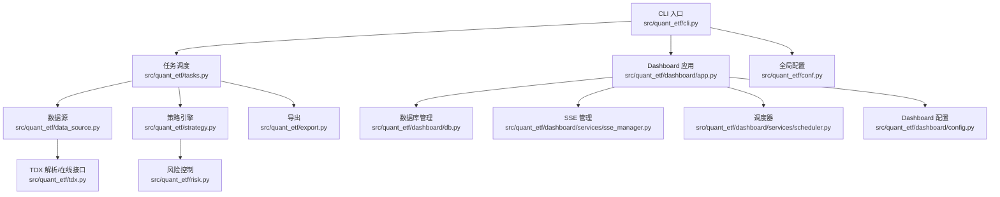
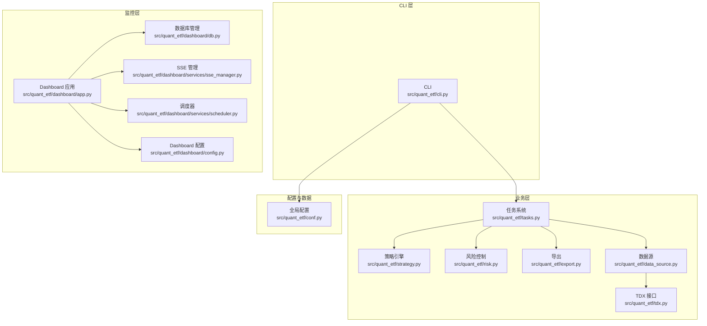
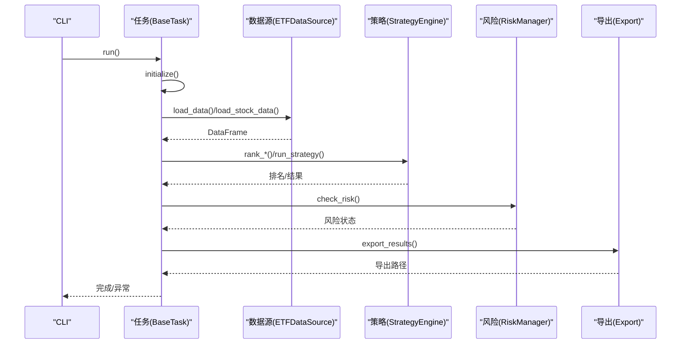
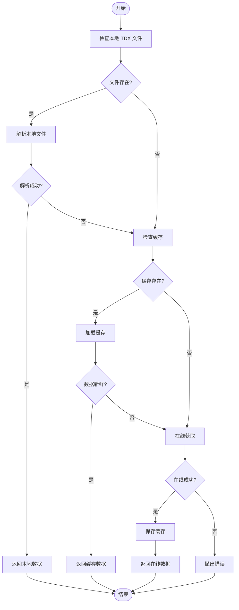
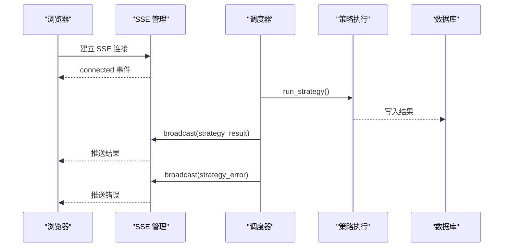
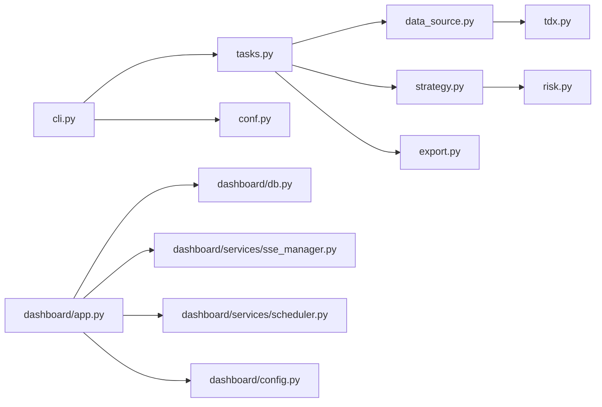

# 常见错误信息解析

<cite>
**本文档引用的文件**
- [README.md](file://README.md)
- [DEVELOPMENT.md](file://DEVELOPMENT.md)
- [src/quant_etf/cli.py](file://src/quant_etf/cli.py)
- [src/quant_etf/tasks.py](file://src/quant_etf/tasks.py)
- [src/quant_etf/data_source.py](file://src/quant_etf/data_source.py)
- [src/quant_etf/tdx.py](file://src/quant_etf/tdx.py)
- [src/quant_etf/conf.py](file://src/quant_etf/conf.py)
- [src/quant_etf/export.py](file://src/quant_etf/export.py)
- [src/quant_etf/risk.py](file://src/quant_etf/risk.py)
- [src/quant_etf/dashboard/app.py](file://src/quant_etf/dashboard/app.py)
- [src/quant_etf/dashboard/db.py](file://src/quant_etf/dashboard/db.py)
- [src/quant_etf/dashboard/config.py](file://src/quant_etf/dashboard/config.py)
- [src/quant_etf/dashboard/services/sse_manager.py](file://src/quant_etf/dashboard/services/sse_manager.py)
- [src/quant_etf/dashboard/services/scheduler.py](file://src/quant_etf/dashboard/services/scheduler.py)
</cite>

## 目录
1. [简介](#简介)
2. [项目结构](#项目结构)
3. [核心组件](#核心组件)
4. [架构总览](#架构总览)
5. [详细组件分析](#详细组件分析)
6. [依赖关系分析](#依赖关系分析)
7. [性能考虑](#性能考虑)
8. [故障排查指南](#故障排查指南)
9. [结论](#结论)
10. [附录](#附录)

## 简介
本文件针对 Quant-ETF 项目在实际运行中可能出现的常见错误进行系统化梳理与解析，涵盖语法错误、运行时异常、配置错误、依赖缺失、网络与数据源问题、数据库与文件权限问题、以及 Dashboard 相关的异常等。文档提供每类错误的可能成因、影响范围、解决步骤与预防措施，并给出错误代码对照表、日志分析技巧与调试工具使用方法，帮助开发者与运维人员快速定位与解决问题。

## 项目结构
Quant-ETF 采用模块化设计，CLI 统一入口负责命令分发，核心业务模块包括数据源、策略引擎、风险控制、导出与 Dashboard 监控系统。整体结构清晰，便于按模块定位错误来源。

**图表来源**
- [src/quant_etf/cli.py:385-403](file://src/quant_etf/cli.py#L385-L403)
- [src/quant_etf/tasks.py:1-467](file://src/quant_etf/tasks.py#L1-L467)
- [src/quant_etf/data_source.py:1-381](file://src/quant_etf/data_source.py#L1-L381)
- [src/quant_etf/tdx.py:1-375](file://src/quant_etf/tdx.py#L1-L375)
- [src/quant_etf/dashboard/app.py:1-92](file://src/quant_etf/dashboard/app.py#L1-L92)
- [src/quant_etf/dashboard/db.py:1-133](file://src/quant_etf/dashboard/db.py#L1-L133)
- [src/quant_etf/dashboard/services/sse_manager.py:1-45](file://src/quant_etf/dashboard/services/sse_manager.py#L1-L45)
- [src/quant_etf/dashboard/services/scheduler.py:1-82](file://src/quant_etf/dashboard/services/scheduler.py#L1-L82)
- [src/quant_etf/dashboard/config.py:1-25](file://src/quant_etf/dashboard/config.py#L1-L25)
- [src/quant_etf/conf.py:1-137](file://src/quant_etf/conf.py#L1-L137)

**章节来源**
- [README.md:253-276](file://README.md#L253-L276)
- [src/quant_etf/cli.py:324-398](file://src/quant_etf/cli.py#L324-L398)

## 核心组件
- CLI 统一入口：负责参数解析、命令分发与日志初始化，是大多数错误的起点与终点。
- 任务系统：封装 ETF/短线索引/中期反弹等任务的完整流程，包含数据加载、策略打分、结果导出与 CSV 保存。
- 数据源：实现本地 TDX 文件、缓存与在线数据三层加载策略，提供名称映射与缓存迁移。
- TDX 接口：封装 pytdx 的日线与实时行情获取，包含服务器切换与心跳保活。
- 风险控制：基于历史分位数、RSI、均线穿越等指标进行风险评估。
- 导出模块：生成 TDX 导入文件与自定义公式文件。
- Dashboard：FastAPI + SQLite/DuckDB + SSE，提供策略结果、持仓、告警等页面与实时推送。

**章节来源**
- [src/quant_etf/tasks.py:30-177](file://src/quant_etf/tasks.py#L30-L177)
- [src/quant_etf/data_source.py:15-381](file://src/quant_etf/data_source.py#L15-L381)
- [src/quant_etf/tdx.py:235-338](file://src/quant_etf/tdx.py#L235-L338)
- [src/quant_etf/risk.py:18-96](file://src/quant_etf/risk.py#L18-L96)
- [src/quant_etf/export.py:1-118](file://src/quant_etf/export.py#L1-L118)
- [src/quant_etf/dashboard/app.py:1-92](file://src/quant_etf/dashboard/app.py#L1-L92)

## 架构总览

**图表来源**
- [src/quant_etf/cli.py:385-403](file://src/quant_etf/cli.py#L385-L403)
- [src/quant_etf/tasks.py:1-467](file://src/quant_etf/tasks.py#L1-L467)
- [src/quant_etf/data_source.py:1-381](file://src/quant_etf/data_source.py#L1-L381)
- [src/quant_etf/tdx.py:1-375](file://src/quant_etf/tdx.py#L1-L375)
- [src/quant_etf/dashboard/app.py:1-92](file://src/quant_etf/dashboard/app.py#L1-L92)
- [src/quant_etf/dashboard/db.py:1-133](file://src/quant_etf/dashboard/db.py#L1-L133)
- [src/quant_etf/dashboard/services/sse_manager.py:1-45](file://src/quant_etf/dashboard/services/sse_manager.py#L1-L45)
- [src/quant_etf/dashboard/services/scheduler.py:1-82](file://src/quant_etf/dashboard/services/scheduler.py#L1-L82)
- [src/quant_etf/dashboard/config.py:1-25](file://src/quant_etf/dashboard/config.py#L1-L25)
- [src/quant_etf/conf.py:1-137](file://src/quant_etf/conf.py#L1-L137)

## 详细组件分析

### CLI 错误与异常处理
- 语法错误
  - 症状：命令行参数解析失败、子命令不存在、参数类型不匹配。
  - 成因：参数格式错误、拼写错误、缺少必需参数。
  - 影响：CLI 直接退出，不会进入业务流程。
  - 解决：核对命令与参数，参考帮助输出；使用 `--help` 查看参数说明。
  - 预防：在 CI 中加入参数校验脚本；对关键参数增加默认值与约束。
- 运行时异常
  - 症状：任务执行失败、日志中出现异常堆栈。
  - 成因：任务未找到、任务运行抛出异常、日志写入失败。
  - 影响：任务中断，系统退出码非零。
  - 解决：查看日志文件，定位异常堆栈；修复任务实现或数据源问题。
  - 预防：在任务 run() 中捕获异常并记录上下文；为关键路径增加健壮性检查。
- 日志与输出
  - 症状：日志缺失、输出目录不存在。
  - 成因：工作目录权限不足、输出路径不存在。
  - 影响：导出文件失败、无法复现问题。
  - 解决：确保输出目录存在且可写；使用相对路径或绝对路径。
  - 预防：在入口处创建必要目录；统一日志落盘策略。

**章节来源**
- [src/quant_etf/cli.py:24-70](file://src/quant_etf/cli.py#L24-L70)
- [src/quant_etf/cli.py:257-294](file://src/quant_etf/cli.py#L257-L294)
- [src/quant_etf/cli.py:309-322](file://src/quant_etf/cli.py#L309-L322)
- [src/quant_etf/cli.py:385-403](file://src/quant_etf/cli.py#L385-L403)

### 任务系统错误
- 任务未找到
  - 症状：日志提示任务不存在。
  - 成因：任务名称拼写错误或未注册。
  - 影响：任务被跳过。
  - 解决：确认任务名称与注册表一致；检查 TaskRegistry。
  - 预防：提供任务清单命令；在注册表中增加校验。
- 数据加载失败
  - 症状：无数据加载、空数据导致后续流程失败。
  - 成因：本地 TDX 文件缺失、缓存损坏、在线接口失败。
  - 影响：策略无法运行，导出为空。
  - 解决：检查 TDX 目录与文件；清理缓存；确认网络与服务器可用。
  - 预防：在数据源中增加重试与降级策略。
- 结果导出失败
  - 症状：CSV 保存失败、导出文件缺失。
  - 成因：输出目录不存在、权限不足、编码问题。
  - 影响：无法复盘结果。
  - 解决：创建输出目录；检查权限；统一编码。
  - 预防：在导出前检查目录与权限。

**图表来源**
- [src/quant_etf/tasks.py:131-177](file://src/quant_etf/tasks.py#L131-L177)
- [src/quant_etf/data_source.py:189-236](file://src/quant_etf/data_source.py#L189-L236)
- [src/quant_etf/strategy.py:103-140](file://src/quant_etf/strategy.py#L103-L140)
- [src/quant_etf/risk.py:39-95](file://src/quant_etf/risk.py#L39-L95)
- [src/quant_etf/export.py:1-118](file://src/quant_etf/export.py#L1-L118)

**章节来源**
- [src/quant_etf/tasks.py:428-467](file://src/quant_etf/tasks.py#L428-L467)
- [src/quant_etf/data_source.py:189-236](file://src/quant_etf/data_source.py#L189-L236)
- [src/quant_etf/export.py:15-32](file://src/quant_etf/export.py#L15-L32)

### 数据源与 TDX 错误
- TDX 文件不存在
  - 症状：日志提示文件未找到。
  - 成因：TDX 目录配置错误、文件命名不规范。
  - 影响：无法加载本地数据。
  - 解决：核对 TDX 目录与文件路径；修正配置。
  - 预防：提供文件检查工具；在启动时做预检。
- TDX 文件为空或解析失败
  - 症状：解析返回空 DataFrame。
  - 成因：文件损坏、格式不符。
  - 影响：数据加载失败。
  - 解决：替换或修复文件；检查解析逻辑。
  - 预防：增加文件完整性校验。
- 在线数据获取失败
  - 症状：多次尝试服务器失败、返回空数据。
  - 成因：网络不稳定、服务器限流、心跳失败。
  - 影响：无法获取最新数据。
  - 解决：更换服务器、增加重试与心跳；检查防火墙。
  - 预防：维护服务器白名单；实现自动切换。

**图表来源**
- [src/quant_etf/data_source.py:189-236](file://src/quant_etf/data_source.py#L189-L236)
- [src/quant_etf/tdx.py:341-375](file://src/quant_etf/tdx.py#L341-L375)
- [src/quant_etf/tdx.py:235-338](file://src/quant_etf/tdx.py#L235-L338)

**章节来源**
- [src/quant_etf/data_source.py:189-236](file://src/quant_etf/data_source.py#L189-L236)
- [src/quant_etf/tdx.py:341-375](file://src/quant_etf/tdx.py#L341-L375)

### Dashboard 异常与 SSE 错误
- 启动异常
  - 症状：应用启动失败、端口占用。
  - 成因：端口冲突、配置错误、依赖缺失。
  - 影响：Dashboard 不可用。
  - 解决：更换端口；检查环境变量；安装依赖。
  - 预防：在启动前做端口与依赖检查。
- SSE 连接异常
  - 症状：客户端无法接收事件、连接中断。
  - 成因：心跳超时、队列异常、客户端断开。
  - 影响：页面无法实时更新。
  - 解决：检查心跳配置；查看队列状态；重连客户端。
  - 预防：增加连接状态监控。
- 调度异常
  - 症状：定时任务失败、事件未广播。
  - 成因：任务异常、数据库写入失败。
  - 影响：策略结果未推送到前端。
  - 解决：查看调度日志；修复策略执行；检查数据库。
  - 预防：为调度增加异常处理与重试。

**图表来源**
- [src/quant_etf/dashboard/services/sse_manager.py:14-41](file://src/quant_etf/dashboard/services/sse_manager.py#L14-L41)
- [src/quant_etf/dashboard/services/scheduler.py:19-52](file://src/quant_etf/dashboard/services/scheduler.py#L19-L52)
- [src/quant_etf/dashboard/app.py:39-50](file://src/quant_etf/dashboard/app.py#L39-L50)

**章节来源**
- [src/quant_etf/dashboard/app.py:53-66](file://src/quant_etf/dashboard/app.py#L53-L66)
- [src/quant_etf/dashboard/services/sse_manager.py:14-41](file://src/quant_etf/dashboard/services/sse_manager.py#L14-L41)
- [src/quant_etf/dashboard/services/scheduler.py:43-52](file://src/quant_etf/dashboard/services/scheduler.py#L43-L52)

### 配置与依赖错误
- 环境变量缺失
  - 症状：TDX 目录未找到、Dashboard 端口错误。
  - 成因：未设置或设置错误。
  - 影响：数据源与 Dashboard 初始化失败。
  - 解决：设置正确的环境变量；在启动脚本中注入。
  - 预防：提供默认值与校验。
- 依赖缺失
  - 症状：导入失败、运行时报错。
  - 成因：未安装 pytdx、loguru、pandas 等。
  - 影响：功能不可用。
  - 解决：使用 uv 安装依赖；检查版本兼容性。
  - 预防：在 pyproject.toml 中声明依赖；CI 自动安装。
- 配置项错误
  - 症状：权重不和 1、池大小不匹配。
  - 成因：手动修改配置不当。
  - 影响：策略结果异常。
  - 解决：恢复默认配置；重新计算权重。
  - 预防：提供配置校验工具。

**章节来源**
- [src/quant_etf/conf.py:100-137](file://src/quant_etf/conf.py#L100-L137)
- [src/quant_etf/dashboard/config.py:17-24](file://src/quant_etf/dashboard/config.py#L17-L24)

## 依赖关系分析

**图表来源**
- [src/quant_etf/cli.py:385-403](file://src/quant_etf/cli.py#L385-L403)
- [src/quant_etf/tasks.py:1-467](file://src/quant_etf/tasks.py#L1-L467)
- [src/quant_etf/data_source.py:1-381](file://src/quant_etf/data_source.py#L1-L381)
- [src/quant_etf/tdx.py:1-375](file://src/quant_etf/tdx.py#L1-L375)
- [src/quant_etf/dashboard/app.py:1-92](file://src/quant_etf/dashboard/app.py#L1-L92)
- [src/quant_etf/dashboard/db.py:1-133](file://src/quant_etf/dashboard/db.py#L1-L133)
- [src/quant_etf/dashboard/services/sse_manager.py:1-45](file://src/quant_etf/dashboard/services/sse_manager.py#L1-L45)
- [src/quant_etf/dashboard/services/scheduler.py:1-82](file://src/quant_etf/dashboard/services/scheduler.py#L1-L82)
- [src/quant_etf/dashboard/config.py:1-25](file://src/quant_etf/dashboard/config.py#L1-L25)
- [src/quant_etf/conf.py:1-137](file://src/quant_etf/conf.py#L1-L137)

**章节来源**
- [src/quant_etf/cli.py:385-403](file://src/quant_etf/cli.py#L385-L403)
- [src/quant_etf/tasks.py:1-467](file://src/quant_etf/tasks.py#L1-L467)

## 性能考虑
- 数据加载性能
  - 优先使用本地 TDX 文件，其次缓存，最后在线接口；合理设置缓存有效期。
  - 在线接口建议启用心跳与自动重连，减少失败重试成本。
- 策略执行性能
  - 对大池数据进行分批处理；避免重复计算；使用向量化操作。
- Dashboard 性能
  - SSE 心跳间隔适中，避免频繁心跳；批量广播事件；限制并发连接数。
- 导出性能
  - CSV 写入使用缓冲与批量写入；避免重复导出。

## 故障排查指南
- 日志分析技巧
  - CLI 日志：关注任务初始化、数据加载、导出阶段的日志；使用 DEBUG 级别定位细节。
  - Dashboard 日志：关注 SSE 连接、调度执行、数据库写入；异常处理器会记录未处理异常。
  - 数据源日志：关注 TDX 文件解析、在线接口返回、缓存读写。
- 调试工具与方法
  - 使用 uv run 运行命令，确保环境一致。
  - 在 CLI 中增加 --date 指定日期，便于复现历史问题。
  - 使用健康检查命令验证 Dashboard 页面可用性。
  - 在 Dashboard 中启用 no-reload 便于稳定调试。
- 常见问题定位步骤
  - 任务失败：查看任务 run() 日志；确认数据源可用；检查导出路径。
  - Dashboard 不可用：检查端口占用；查看启动日志；确认数据库初始化。
  - SSE 不推送：检查心跳配置；查看订阅队列状态；确认调度广播。
  - TDX 无法解析：检查文件路径与权限；确认文件格式；尝试在线接口。

**章节来源**
- [src/quant_etf/cli.py:257-294](file://src/quant_etf/cli.py#L257-L294)
- [src/quant_etf/dashboard/app.py:68-72](file://src/quant_etf/dashboard/app.py#L68-L72)
- [src/quant_etf/dashboard/services/sse_manager.py:14-41](file://src/quant_etf/dashboard/services/sse_manager.py#L14-L41)
- [src/quant_etf/dashboard/services/scheduler.py:43-52](file://src/quant_etf/dashboard/services/scheduler.py#L43-L52)

## 结论
通过系统化的错误分类与定位方法，结合日志分析与调试工具，可以高效地解决 Quant-ETF 项目中的常见问题。建议在开发与运维流程中固化检查清单与自动化脚本，提升系统的稳定性与可维护性。

## 附录

### 错误代码对照表
- CLI 参数错误
  - 未知任务：未知任务名称导致退出。
  - 参数缺失：缺少必需参数。
- 任务执行错误
  - 任务未找到：TaskRegistry 中无对应任务。
  - 数据为空：数据源返回空 DataFrame。
  - 导出失败：输出目录不存在或权限不足。
- 数据源错误
  - TDX 文件不存在：路径错误或文件缺失。
  - TDX 文件为空：文件损坏或格式不符。
  - 在线接口失败：服务器不可用或网络异常。
- Dashboard 错误
  - 启动失败：端口占用或配置错误。
  - SSE 连接异常：心跳超时或队列异常。
  - 调度异常：策略执行失败或数据库写入失败。

**章节来源**
- [src/quant_etf/cli.py:279-293](file://src/quant_etf/cli.py#L279-L293)
- [src/quant_etf/tasks.py:144-146](file://src/quant_etf/tasks.py#L144-L146)
- [src/quant_etf/data_source.py:236-236](file://src/quant_etf/data_source.py#L236-L236)
- [src/quant_etf/dashboard/app.py:53-66](file://src/quant_etf/dashboard/app.py#L53-L66)
- [src/quant_etf/dashboard/services/sse_manager.py:25-27](file://src/quant_etf/dashboard/services/sse_manager.py#L25-L27)
- [src/quant_etf/dashboard/services/scheduler.py:43-52](file://src/quant_etf/dashboard/services/scheduler.py#L43-L52)