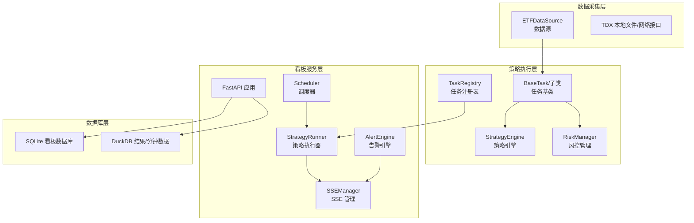
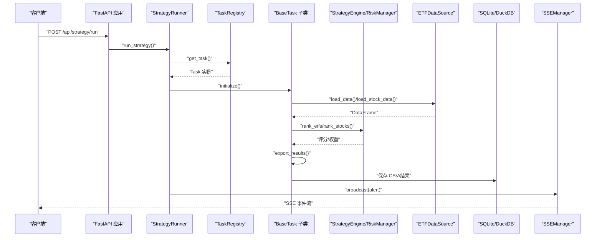
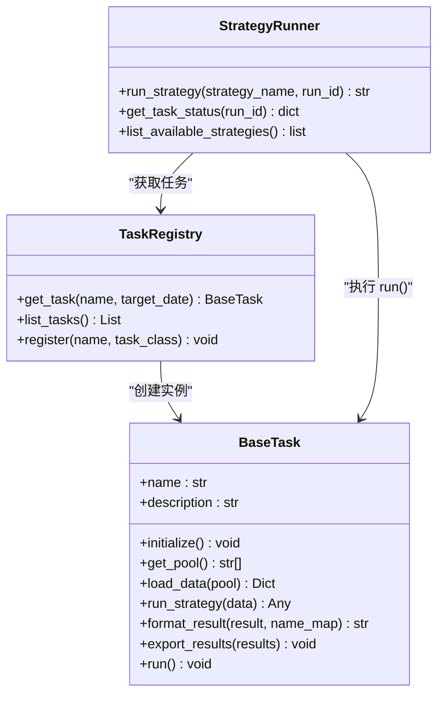
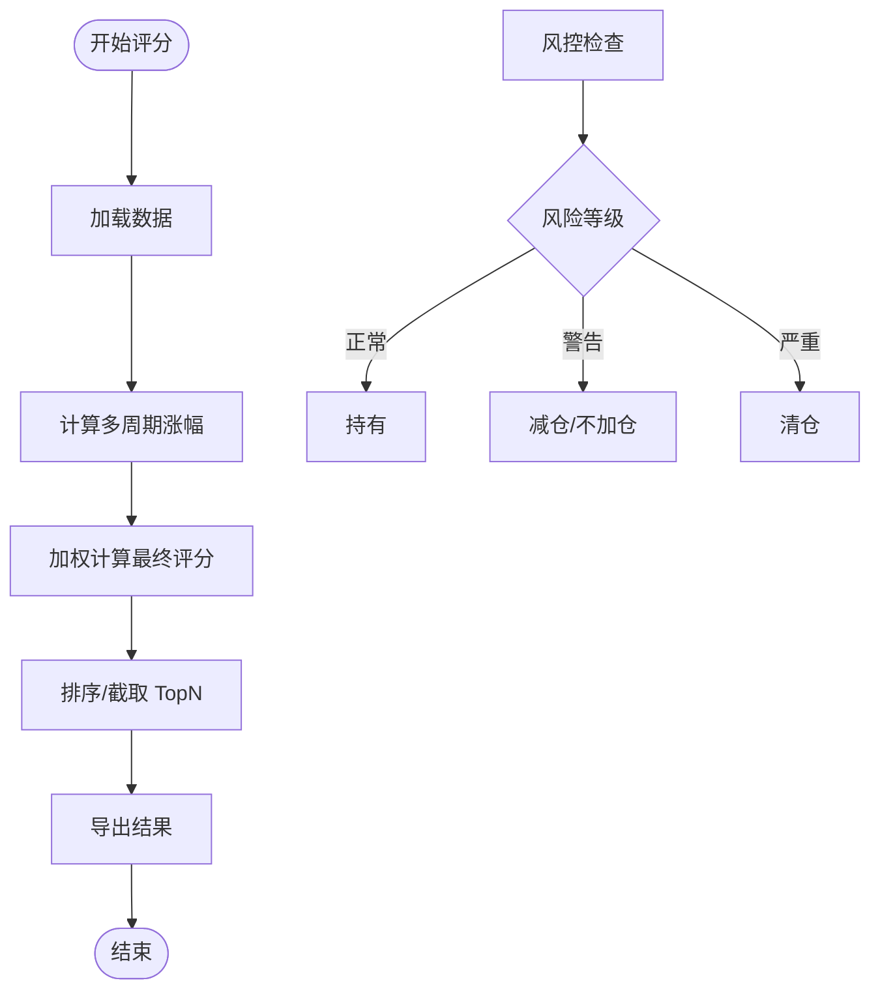
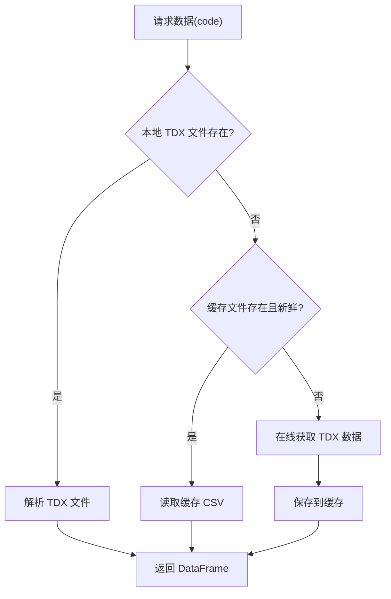
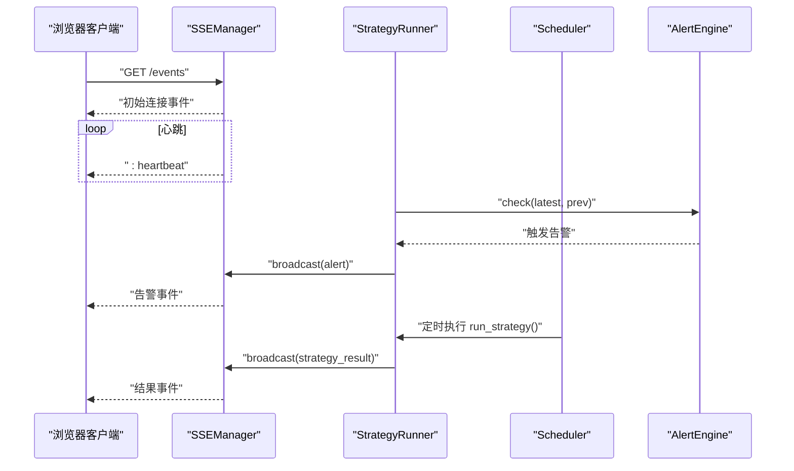
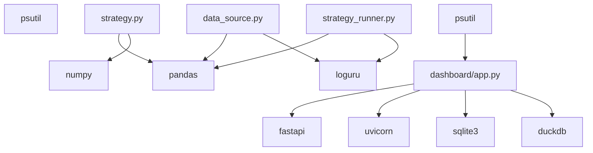

# 性能优化问题

<cite>
**本文档引用的文件**
- [src/quant_etf/dashboard/services/sse_manager.py](file://src/quant_etf/dashboard/services/sse_manager.py)
- [src/quant_etf/dashboard/services/strategy_runner.py](file://src/quant_etf/dashboard/services/strategy_runner.py)
- [src/quant_etf/dashboard/services/scheduler.py](file://src/quant_etf/dashboard/services/scheduler.py)
- [src/quant_etf/dashboard/db.py](file://src/quant_etf/dashboard/db.py)
- [src/quant_etf/tasks.py](file://src/quant_etf/tasks.py)
- [src/quant_etf/strategy.py](file://src/quant_etf/strategy.py)
- [src/quant_etf/data_source.py](file://src/quant_etf/data_source.py)
- [src/quant_etf/risk.py](file://src/quant_etf/risk.py)
- [src/quant_etf/dashboard/app.py](file://src/quant_etf/dashboard/app.py)
- [src/quant_etf/dashboard/config.py](file://src/quant_etf/dashboard/config.py)
- [src/quant_etf/dashboard/services/alert_engine.py](file://src/quant_etf/dashboard/services/alert_engine.py)
- [src/quant_etf/conf.py](file://src/quant_etf/conf.py)
- [uv.lock](file://uv.lock)
</cite>

## 目录
1. [简介](#简介)
2. [项目结构](#项目结构)
3. [核心组件](#核心组件)
4. [架构概览](#架构概览)
5. [详细组件分析](#详细组件分析)
6. [依赖分析](#依赖分析)
7. [性能考虑](#性能考虑)
8. [故障排除指南](#故障排除指南)
9. [结论](#结论)
10. [附录](#附录)

## 简介
本文件针对 Quant-ETF 项目中的性能问题进行全面诊断与优化指导，重点覆盖以下方面：
- 策略执行缓慢：包括数据加载、计算密集型策略、I/O 瓶颈
- 内存占用过高：DataFrame 处理、缓存策略、对象生命周期
- 数据库查询性能瓶颈：SQLite/WAL 模式、事务与索引、并发访问
- SSE 实时推送延迟：心跳机制、队列容量、广播开销
- 并发处理配置调优：线程池大小、事件循环、协程调度
- 缓存策略优化：本地缓存、名称映射缓存、数据新鲜度检查
- 大数据量处理最佳实践：批处理、向量化计算、内存映射
- 性能基准测试方法：指标定义、工具选择、回归检测

## 项目结构
Quant-ETF 采用分层架构，主要分为数据采集层、策略执行层、看板服务层与数据库层。策略执行通过任务注册表统一调度，SSE 实时推送用于前端监控与告警通知，数据库负责看板业务数据持久化。

**图表来源**
- [src/quant_etf/data_source.py:15-381](file://src/quant_etf/data_source.py#L15-L381)
- [src/quant_etf/tasks.py:30-467](file://src/quant_etf/tasks.py#L30-L467)
- [src/quant_etf/strategy.py:43-321](file://src/quant_etf/strategy.py#L43-L321)
- [src/quant_etf/risk.py:18-96](file://src/quant_etf/risk.py#L18-L96)
- [src/quant_etf/dashboard/services/strategy_runner.py:25-164](file://src/quant_etf/dashboard/services/strategy_runner.py#L25-L164)
- [src/quant_etf/dashboard/services/scheduler.py:19-82](file://src/quant_etf/dashboard/services/scheduler.py#L19-L82)
- [src/quant_etf/dashboard/services/sse_manager.py:14-45](file://src/quant_etf/dashboard/services/sse_manager.py#L14-L45)
- [src/quant_etf/dashboard/services/alert_engine.py:20-120](file://src/quant_etf/dashboard/services/alert_engine.py#L20-L120)
- [src/quant_etf/dashboard/db.py:69-133](file://src/quant_etf/dashboard/db.py#L69-L133)
- [src/quant_etf/dashboard/app.py:17-107](file://src/quant_etf/dashboard/app.py#L17-L107)

**章节来源**
- [src/quant_etf/dashboard/app.py:17-107](file://src/quant_etf/dashboard/app.py#L17-L107)
- [src/quant_etf/dashboard/db.py:69-133](file://src/quant_etf/dashboard/db.py#L69-L133)

## 核心组件
- 任务注册表与任务基类：统一策略执行流程，支持 CSV 导出、结果格式化与跨任务复用。
- 策略引擎：基于动量因子的 ETF/股票评分与排序，支持短期/中期回弹策略。
- 风控管理：基于历史分位数、RSI、均线穿越的风险评估。
- 数据源：优先本地 TDX 文件，其次缓存，最后在线获取；提供名称映射缓存与数据新鲜度检查。
- 看板服务：FastAPI 应用，SSE 实时推送，调度器定时执行策略，告警引擎对比前后结果触发告警。

**章节来源**
- [src/quant_etf/tasks.py:30-467](file://src/quant_etf/tasks.py#L30-L467)
- [src/quant_etf/strategy.py:43-321](file://src/quant_etf/strategy.py#L43-L321)
- [src/quant_etf/risk.py:18-96](file://src/quant_etf/risk.py#L18-L96)
- [src/quant_etf/data_source.py:15-381](file://src/quant_etf/data_source.py#L15-L381)
- [src/quant_etf/dashboard/services/strategy_runner.py:25-164](file://src/quant_etf/dashboard/services/strategy_runner.py#L25-L164)
- [src/quant_etf/dashboard/services/scheduler.py:19-82](file://src/quant_etf/dashboard/services/scheduler.py#L19-L82)
- [src/quant_etf/dashboard/services/sse_manager.py:14-45](file://src/quant_etf/dashboard/services/sse_manager.py#L14-L45)
- [src/quant_etf/dashboard/services/alert_engine.py:20-120](file://src/quant_etf/dashboard/services/alert_engine.py#L20-L120)

## 架构概览
下图展示策略执行到 SSE 广播的关键路径，以及数据库交互与缓存策略：

**图表来源**
- [src/quant_etf/dashboard/services/strategy_runner.py:25-125](file://src/quant_etf/dashboard/services/strategy_runner.py#L25-L125)
- [src/quant_etf/tasks.py:131-177](file://src/quant_etf/tasks.py#L131-L177)
- [src/quant_etf/strategy.py:103-162](file://src/quant_etf/strategy.py#L103-L162)
- [src/quant_etf/data_source.py:189-285](file://src/quant_etf/data_source.py#L189-L285)
- [src/quant_etf/dashboard/services/sse_manager.py:34-41](file://src/quant_etf/dashboard/services/sse_manager.py#L34-L41)
- [src/quant_etf/dashboard/db.py:114-133](file://src/quant_etf/dashboard/db.py#L114-L133)

## 详细组件分析

### 策略执行器与任务注册表
- 线程池配置：默认最大工作线程数为 2，适用于 CPU 密集型策略与 Pandas 向量化计算。
- 任务状态管理：使用内存字典存储运行状态、进度与结果，便于前端轮询与 SSE 广播。
- CSV 导出与结果读取：策略完成后读取 CSV 并进行过滤，避免空记录进入告警比较。
- 告警集成：对比上一次结果，触发告警并通过 SSE 广播。

**图表来源**
- [src/quant_etf/tasks.py:428-467](file://src/quant_etf/tasks.py#L428-L467)
- [src/quant_etf/tasks.py:30-177](file://src/quant_etf/tasks.py#L30-L177)
- [src/quant_etf/dashboard/services/strategy_runner.py:25-164](file://src/quant_etf/dashboard/services/strategy_runner.py#L25-L164)

**章节来源**
- [src/quant_etf/dashboard/services/strategy_runner.py:25-125](file://src/quant_etf/dashboard/services/strategy_runner.py#L25-L125)
- [src/quant_etf/tasks.py:131-177](file://src/quant_etf/tasks.py#L131-L177)

### 策略引擎与风控管理
- 策略引擎：计算多周期涨幅并加权评分，支持 ETF 与股票短期/中期回弹策略。
- 风控管理：基于历史分位数、RSI、均线穿越判断风险等级，给出建议动作。
- 性能要点：使用 Pandas rolling 计算均线与 RSI，注意窗口大小与数据长度。

**图表来源**
- [src/quant_etf/strategy.py:103-162](file://src/quant_etf/strategy.py#L103-L162)
- [src/quant_etf/risk.py:39-95](file://src/quant_etf/risk.py#L39-L95)

**章节来源**
- [src/quant_etf/strategy.py:103-321](file://src/quant_etf/strategy.py#L103-L321)
- [src/quant_etf/risk.py:18-96](file://src/quant_etf/risk.py#L18-L96)

### 数据源与缓存策略
- 优先级：本地 TDX 文件 → 缓存 → 在线获取，减少重复下载与解析。
- 名称映射缓存：原子写入，避免中间写坏导致的缓存失效。
- 数据新鲜度检查：考虑周末/周一特殊场景，避免过期数据参与评分。
- 性能要点：缓存文件迁移、CSV 解析与索引设置、批量写入。

**图表来源**
- [src/quant_etf/data_source.py:189-285](file://src/quant_etf/data_source.py#L189-L285)

**章节来源**
- [src/quant_etf/data_source.py:189-381](file://src/quant_etf/data_source.py#L189-L381)

### SSE 实时推送与调度
- SSE 管理：维护订阅队列集合，心跳保持连接，异常断开自动清理。
- 调度器：基于 asyncio.create_task 的轻量调度，定时执行策略并广播结果。
- 告警引擎：对比前后结果触发告警，保存至数据库并通过 SSE 广播。

**图表来源**
- [src/quant_etf/dashboard/services/sse_manager.py:14-41](file://src/quant_etf/dashboard/services/sse_manager.py#L14-L41)
- [src/quant_etf/dashboard/services/strategy_runner.py:72-122](file://src/quant_etf/dashboard/services/strategy_runner.py#L72-L122)
- [src/quant_etf/dashboard/services/scheduler.py:19-52](file://src/quant_etf/dashboard/services/scheduler.py#L19-L52)
- [src/quant_etf/dashboard/services/alert_engine.py:82-96](file://src/quant_etf/dashboard/services/alert_engine.py#L82-L96)

**章节来源**
- [src/quant_etf/dashboard/services/sse_manager.py:14-45](file://src/quant_etf/dashboard/services/sse_manager.py#L14-L45)
- [src/quant_etf/dashboard/services/scheduler.py:19-82](file://src/quant_etf/dashboard/services/scheduler.py#L19-L82)
- [src/quant_etf/dashboard/services/alert_engine.py:20-120](file://src/quant_etf/dashboard/services/alert_engine.py#L20-L120)

## 依赖分析
- 外部依赖：pandas、numpy、loguru、fastapi、uvicorn、sqlite3、duckdb（通过测试文件可见）。
- 监控依赖：psutil（uv.lock 显示版本 7.2.2），可用于进程级 CPU/内存监控。
- 数据库：SQLite 使用 WAL 模式与外键约束，DuckDB 用于结果与分钟数据。

**图表来源**
- [src/quant_etf/dashboard/app.py:17-107](file://src/quant_etf/dashboard/app.py#L17-L107)
- [src/quant_etf/strategy.py:1-321](file://src/quant_etf/strategy.py#L1-L321)
- [src/quant_etf/data_source.py:1-381](file://src/quant_etf/data_source.py#L1-L381)
- [src/quant_etf/dashboard/services/strategy_runner.py:1-164](file://src/quant_etf/dashboard/services/strategy_runner.py#L1-L164)
- [uv.lock:589-597](file://uv.lock#L589-L597)

**章节来源**
- [uv.lock:589-597](file://uv.lock#L589-L597)
- [src/quant_etf/dashboard/db.py:69-133](file://src/quant_etf/dashboard/db.py#L69-L133)

## 性能考虑

### 策略执行缓慢诊断与优化
- 数据加载瓶颈
  - 本地 TDX 文件解析与 CSV 读取：优先使用本地文件，避免重复网络请求；确保缓存文件索引正确（index_col="date", parse_dates=True）。
  - 名称映射缓存：原子写入避免损坏，定期校验缓存完整性。
- 计算密集型优化
  - 向量化计算：Pandas rolling 窗口计算可并行化，但受 GIL 影响；可考虑 numba 或 cython 加速。
  - 分块处理：对大池（ETF/股票）分批加载与评分，降低峰值内存。
  - 多线程限制：线程池 max_workers=2，CPU 密集型策略建议减少并发或拆分更细的任务。
- I/O 与导出
  - CSV 导出：批量写入，避免逐条写入；结果读取时过滤无效行，减少后续处理成本。

**章节来源**
- [src/quant_etf/data_source.py:189-285](file://src/quant_etf/data_source.py#L189-L285)
- [src/quant_etf/tasks.py:56-95](file://src/quant_etf/tasks.py#L56-L95)
- [src/quant_etf/strategy.py:164-225](file://src/quant_etf/strategy.py#L164-L225)

### 内存占用过高诊断与优化
- DataFrame 内存使用
  - 类型优化：将数值列统一为 float64/float32，字符串列使用 category 类型（如 code/name）。
  - 空值处理：及时 dropna 或填充，避免 NaN 导致的额外内存开销。
- 缓存与对象生命周期
  - 名称映射缓存：避免重复构建字典；使用弱引用或定期清理。
  - 任务状态字典：定期清理已完成任务，防止内存泄漏。
- 监控手段
  - 使用 psutil 获取进程内存与 CPU 占用，定位峰值时段与热点函数。

**章节来源**
- [src/quant_etf/data_source.py:107-123](file://src/quant_etf/data_source.py#L107-L123)
- [src/quant_etf/dashboard/services/strategy_runner.py:21-22](file://src/quant_etf/dashboard/services/strategy_runner.py#L21-L22)

### 数据库查询性能瓶颈诊断与优化
- SQLite 配置
  - WAL 模式：开启 journal_mode=WAL 提升并发读写性能。
  - 外键约束：PRAGMA foreign_keys=ON，保证一致性但增加写入开销。
- 查询与事务
  - 使用 execute_many 批量写入，减少往返次数。
  - 合理使用索引：对高频查询字段（如 schedules.strategy、accounts.id）建立索引。
- DuckDB 集成
  - 结果与分钟数据使用 DuckDB，支持更高效的 OLAP 场景；注意批量导入与 ON CONFLICT 语法。

**章节来源**
- [src/quant_etf/dashboard/db.py:69-133](file://src/quant_etf/dashboard/db.py#L69-L133)
- [src/quant_etf/dashboard/config.py:6-11](file://src/quant_etf/dashboard/config.py#L6-L11)

### SSE 实时推送延迟诊断与优化
- 心跳机制：30 秒心跳，避免代理超时；订阅端需正确处理冒号行。
- 广播开销：队列满或异常会导致丢弃；建议限制同时订阅客户端数量或使用负载均衡。
- 事件类型：区分策略结果与告警事件，避免无关事件阻塞。

**章节来源**
- [src/quant_etf/dashboard/services/sse_manager.py:14-41](file://src/quant_etf/dashboard/services/sse_manager.py#L14-L41)
- [src/quant_etf/dashboard/config.py:20-21](file://src/quant_etf/dashboard/config.py#L20-L21)

### 并发处理配置调优
- 线程池：max_workers=2，适用于多数策略；若策略包含 I/O 或外部 API 调用，可考虑增加至 4-8。
- 事件循环：SSE 广播通过 asyncio.run_coroutine_threadsafe 切换到主线程事件循环，避免上下文切换开销。
- 调度器：使用 asyncio.create_task 轻量调度，避免阻塞主事件循环。

**章节来源**
- [src/quant_etf/dashboard/services/strategy_runner.py:21-38](file://src/quant_etf/dashboard/services/strategy_runner.py#L21-L38)
- [src/quant_etf/dashboard/services/scheduler.py:19-52](file://src/quant_etf/dashboard/services/scheduler.py#L19-L52)

### 缓存策略优化
- 本地缓存：TDX 文件优先，缓存 CSV，原子写入 name_map。
- 数据新鲜度：根据交易日与盘后时间动态判断，避免陈旧数据评分。
- 批量补齐：缺失代码名称批量查询与写入，减少多次 IO。

**章节来源**
- [src/quant_etf/data_source.py:189-285](file://src/quant_etf/data_source.py#L189-L285)
- [src/quant_etf/data_source.py:303-371](file://src/quant_etf/data_source.py#L303-L371)

### 大数据量处理最佳实践
- 批处理：分批加载与评分，控制内存峰值。
- 向量化：优先使用 Pandas/Numpy 向量化操作，避免显式循环。
- 内存映射：对超大 CSV 使用 chunksize 读取，逐步处理。
- DuckDB 批量导入：利用批量 INSERT 与 ON CONFLICT 语法提升写入效率。

**章节来源**
- [src/quant_etf/data_source.py:224-232](file://src/quant_etf/data_source.py#L224-L232)
- [tests/test_duckdb_conflict.py:13-201](file://tests/test_duckdb_conflict.py#L13-L201)

### 性能基准测试方法
- 指标定义：策略执行时间、内存峰值、CSV 导出耗时、SSE 广播延迟、数据库写入 QPS。
- 工具选择：cProfile/line_profiler 定位热点函数；memory_profiler 监控内存；locust 压测 SSE 与 API。
- 回归检测：建立基准测试脚本，定期运行并对比指标变化。

## 故障排除指南
- 策略执行失败
  - 检查数据源加载：确认 TDX 文件存在、缓存有效、网络可达。
  - 查看任务状态字典：run_strategy 捕获异常并广播错误事件。
- SSE 推送异常
  - 心跳丢失：检查代理配置与超时设置；确认客户端正确处理冒号行。
  - 队列异常：订阅端断开后自动清理，避免内存泄漏。
- 数据库写入失败
  - PRAGMA 设置：确认 WAL 模式与外键约束生效。
  - 批量写入：使用 execute_many，避免逐条提交。
- 告警未触发
  - 对比逻辑：检查上一次结果加载与阈值配置。
  - 数据库保存：确认 alerts_dashboard 表结构与插入语句。

**章节来源**
- [src/quant_etf/dashboard/services/strategy_runner.py:102-122](file://src/quant_etf/dashboard/services/strategy_runner.py#L102-L122)
- [src/quant_etf/dashboard/services/sse_manager.py:25-32](file://src/quant_etf/dashboard/services/sse_manager.py#L25-L32)
- [src/quant_etf/dashboard/db.py:114-133](file://src/quant_etf/dashboard/db.py#L114-L133)
- [src/quant_etf/dashboard/services/alert_engine.py:82-115](file://src/quant_etf/dashboard/services/alert_engine.py#L82-L115)

## 结论
通过对策略执行、数据源缓存、数据库与 SSE 推送的系统性分析，可针对性地优化性能瓶颈。建议优先从数据加载与缓存策略入手，配合线程池与事件循环调优，并引入基准测试与监控工具，持续迭代性能表现。

## 附录
- 策略权重与池配置：可在配置文件中调整权重与池规模，观察对性能与收益的影响。
- 策略权重与池配置：可在配置文件中调整权重与池规模，观察对性能与收益的影响。

**章节来源**
- [src/quant_etf/conf.py:120-137](file://src/quant_etf/conf.py#L120-L137)