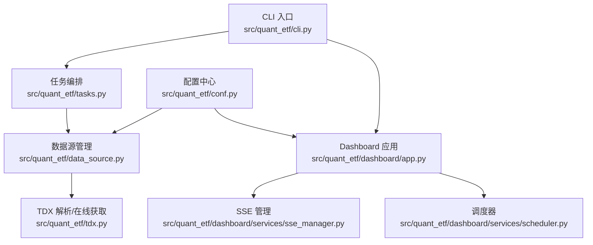
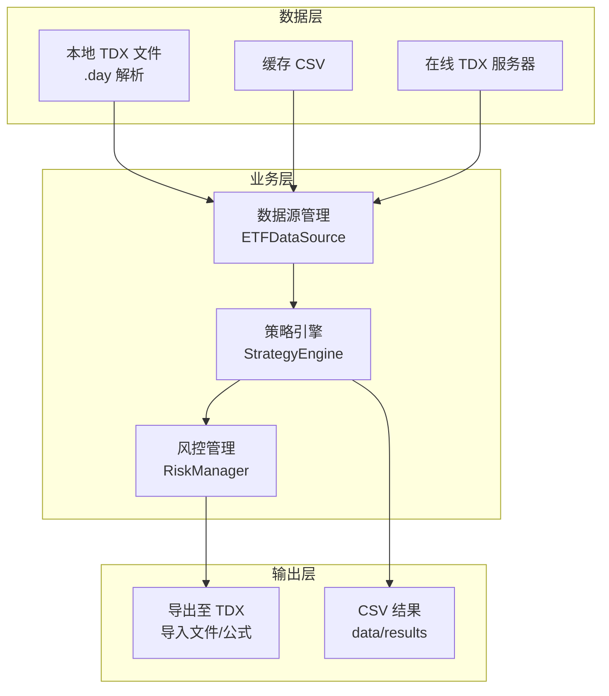
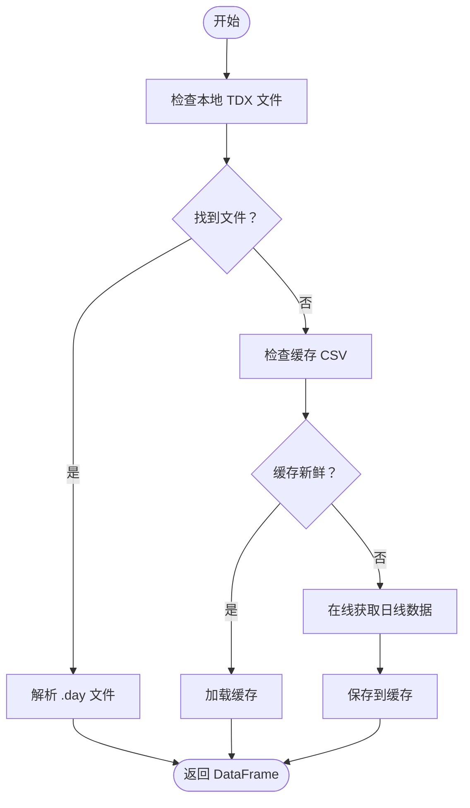
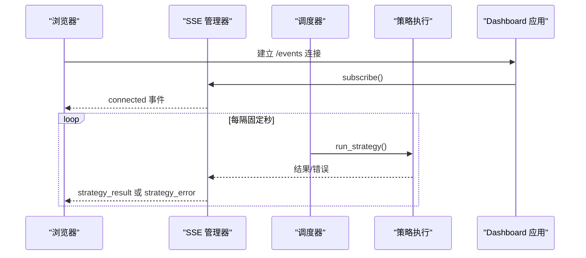
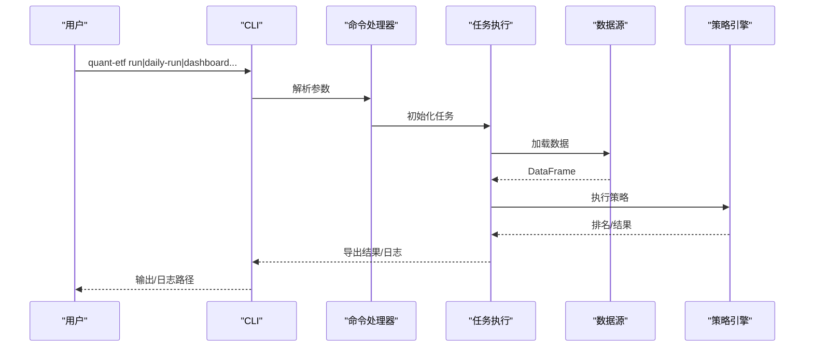

# 故障排除和常见问题

<cite>
**本文引用的文件**
- [README.md](file://README.md)
- [DEVELOPMENT.md](file://DEVELOPMENT.md)
- [pyproject.toml](file://pyproject.toml)
- [src/quant_etf/conf.py](file://src/quant_etf/conf.py)
- [src/quant_etf/data_source.py](file://src/quant_etf/data_source.py)
- [src/quant_etf/tdx.py](file://src/quant_etf/tdx.py)
- [src/quant_etf/cli.py](file://src/quant_etf/cli.py)
- [src/quant_etf/tasks.py](file://src/quant_etf/tasks.py)
- [src/quant_etf/dashboard/app.py](file://src/quant_etf/dashboard/app.py)
- [src/quant_etf/dashboard/config.py](file://src/quant_etf/dashboard/config.py)
- [src/quant_etf/dashboard/services/sse_manager.py](file://src/quant_etf/dashboard/services/sse_manager.py)
- [src/quant_etf/dashboard/services/scheduler.py](file://src/quant_etf/dashboard/services/scheduler.py)
- [tests/test_tdx.py](file://tests/test_tdx.py)
- [tests/test_data_source.py](file://tests/test_data_source.py)
</cite>

## 目录
1. [简介](#简介)
2. [项目结构](#项目结构)
3. [核心组件](#核心组件)
4. [架构总览](#架构总览)
5. [详细组件分析](#详细组件分析)
6. [依赖分析](#依赖分析)
7. [性能考虑](#性能考虑)
8. [故障排除指南](#故障排除指南)
9. [结论](#结论)
10. [附录](#附录)

## 简介
本文件为 Quant-ETF 项目的故障排除与常见问题解答文档，聚焦安装、配置、使用过程中的典型问题与解决方案，重点覆盖 TDX 数据源相关错误、网络连接与权限问题、依赖冲突、性能问题排查与优化、日志分析与错误信息解读，以及不同操作系统下的注意事项。同时提供 Dashboard 监控系统的健康检查与运维流程，帮助用户与技术支持团队快速定位并解决问题。

## 项目结构
Quant-ETF 采用模块化设计，围绕 CLI 统一入口组织各功能模块；数据源层支持本地 TDX 文件、缓存与在线获取；Dashboard 基于 FastAPI + SSE 实现实时推送；测试覆盖 TDX 解析与数据源加载等关键路径。

**图示来源**
- [src/quant_etf/cli.py:1-403](file://src/quant_etf/cli.py#L1-L403)
- [src/quant_etf/tasks.py:1-450](file://src/quant_etf/tasks.py#L1-L450)
- [src/quant_etf/data_source.py:1-381](file://src/quant_etf/data_source.py#L1-L381)
- [src/quant_etf/tdx.py:1-375](file://src/quant_etf/tdx.py#L1-L375)
- [src/quant_etf/dashboard/app.py:1-87](file://src/quant_etf/dashboard/app.py#L1-L87)
- [src/quant_etf/dashboard/services/sse_manager.py:1-45](file://src/quant_etf/dashboard/services/sse_manager.py#L1-L45)
- [src/quant_etf/dashboard/services/scheduler.py:1-82](file://src/quant_etf/dashboard/services/scheduler.py#L1-L82)
- [src/quant_etf/conf.py:1-137](file://src/quant_etf/conf.py#L1-L137)

**章节来源**
- [README.md:253-276](file://README.md#L253-L276)
- [DEVELOPMENT.md:47-74](file://DEVELOPMENT.md#L47-L74)

## 核心组件
- CLI 统一入口：负责命令解析、参数校验与子命令分发，支持每日任务、Dashboard 启停、分钟级采集、补跑历史、健康检查、补齐股票名称等。
- 任务系统：定义 ETF/短线/中线任务的抽象与实现，统一执行流程、数据加载、策略打分、结果导出。
- 数据源层：三层加载策略（本地 TDX 文件 → 缓存 → 在线获取），并提供名称映射缓存与新鲜度检查。
- TDX 层：封装本地 .day 文件解析与在线行情获取，支持服务器缓存与自动切换。
- Dashboard：FastAPI + SSE，提供策略结果、告警、市场状态等页面与实时事件推送。
- 配置中心：集中管理 TDX 目录、池子、权重、端口等全局配置。

**章节来源**
- [src/quant_etf/cli.py:1-403](file://src/quant_etf/cli.py#L1-L403)
- [src/quant_etf/tasks.py:1-450](file://src/quant_etf/tasks.py#L1-L450)
- [src/quant_etf/data_source.py:1-381](file://src/quant_etf/data_source.py#L1-L381)
- [src/quant_etf/tdx.py:1-375](file://src/quant_etf/tdx.py#L1-L375)
- [src/quant_etf/dashboard/app.py:1-87](file://src/quant_etf/dashboard/app.py#L1-L87)
- [src/quant_etf/conf.py:1-137](file://src/quant_etf/conf.py#L1-L137)

## 架构总览

**图示来源**
- [src/quant_etf/data_source.py:189-285](file://src/quant_etf/data_source.py#L189-L285)
- [src/quant_etf/tasks.py:114-160](file://src/quant_etf/tasks.py#L114-L160)

## 详细组件分析

### TDX 数据源组件
- 本地文件解析：通过 pytdx Reader 读取 .day 文件，标准化为 OHLCV 时间序列，计算涨跌幅。
- 在线获取：自动选择可用服务器，支持缓存最近成功服务器以提升稳定性。
- 名称映射与缓存：从 data/meta/stock_code_name.json 加载名称映射，支持缓存与补齐。
- 新鲜度检查：根据工作日与时段判断数据是否新鲜，避免过期数据影响策略。

**图示来源**
- [src/quant_etf/data_source.py:189-285](file://src/quant_etf/data_source.py#L189-L285)
- [src/quant_etf/tdx.py:341-375](file://src/quant_etf/tdx.py#L341-L375)

**章节来源**
- [src/quant_etf/tdx.py:1-375](file://src/quant_etf/tdx.py#L1-L375)
- [src/quant_etf/data_source.py:1-381](file://src/quant_etf/data_source.py#L1-L381)
- [tests/test_tdx.py:1-175](file://tests/test_tdx.py#L1-L175)
- [tests/test_data_source.py:1-67](file://tests/test_data_source.py#L1-L67)

### Dashboard 监控系统
- SSE 实时推送：每个客户端连接维护独立队列，心跳保活，异常自动清理。
- 调度器：基于 asyncio 的轻量调度，定时触发策略执行并广播结果/错误事件。
- 异常处理：全局异常捕获，返回 JSON 错误响应，避免服务崩溃。

**图示来源**
- [src/quant_etf/dashboard/app.py:39-50](file://src/quant_etf/dashboard/app.py#L39-L50)
- [src/quant_etf/dashboard/services/sse_manager.py:14-32](file://src/quant_etf/dashboard/services/sse_manager.py#L14-L32)
- [src/quant_etf/dashboard/services/scheduler.py:19-52](file://src/quant_etf/dashboard/services/scheduler.py#L19-L52)

**章节来源**
- [src/quant_etf/dashboard/app.py:1-87](file://src/quant_etf/dashboard/app.py#L1-L87)
- [src/quant_etf/dashboard/services/sse_manager.py:1-45](file://src/quant_etf/dashboard/services/sse_manager.py#L1-L45)
- [src/quant_etf/dashboard/services/scheduler.py:1-82](file://src/quant_etf/dashboard/services/scheduler.py#L1-L82)

### CLI 与任务执行
- 命令分发：统一 CLI 解析参数并调用相应处理器，支持每日任务、单任务、Dashboard、分钟采集、补跑历史、健康检查、补齐名称等。
- 日志：按命令输出日志文件，便于问题定位。

**图示来源**
- [src/quant_etf/cli.py:24-294](file://src/quant_etf/cli.py#L24-L294)
- [src/quant_etf/tasks.py:114-160](file://src/quant_etf/tasks.py#L114-L160)

**章节来源**
- [src/quant_etf/cli.py:1-403](file://src/quant_etf/cli.py#L1-L403)
- [src/quant_etf/tasks.py:1-450](file://src/quant_etf/tasks.py#L1-L450)

## 依赖分析
- Python 版本：项目要求 Python 3.12+（pyproject.toml）；README 指明 3.11+（安装说明），实际运行建议使用 3.12+。
- 关键依赖：loguru、pandas、numpy、pytdx、duckdb、fastapi、uvicorn、jinja2、httpx 等。
- 索引源：配置了阿里云与清华镜像源，加速安装。
- 依赖冲突：若出现版本冲突，优先确保 pandas/numpy/scipy 与 pytdx 兼容；如需离线安装 pytdx，可通过本地 whl 指定安装。

**章节来源**
- [pyproject.toml:1-53](file://pyproject.toml#L1-L53)
- [README.md:14-31](file://README.md#L14-L31)

## 性能考虑
- 数据加载路径优化：优先本地文件 → 缓存 → 在线获取，减少网络请求；启用服务器缓存可显著降低延迟。
- SSE 心跳：默认 30 秒心跳保活，避免代理/防火墙误判超时。
- 调度频率：合理设置调度间隔，避免过于频繁导致资源争用。
- 日志轮转：CLI 输出按日轮转，避免磁盘占用过大。

**章节来源**
- [src/quant_etf/data_source.py:189-285](file://src/quant_etf/data_source.py#L189-L285)
- [src/quant_etf/dashboard/services/sse_manager.py:20-27](file://src/quant_etf/dashboard/services/sse_manager.py#L20-L27)
- [src/quant_etf/cli.py:30-70](file://src/quant_etf/cli.py#L30-L70)

## 故障排除指南

### 一、安装与环境问题
- Python 版本不符
  - 现象：安装或运行时报错，提示 Python 版本过低。
  - 排查：确认 Python 版本满足要求（pyproject.toml 指明 3.12+，README 说明 3.11+）。
  - 处理：升级 Python 至 3.12+，重新安装依赖。
  - 参考：[pyproject.toml:6](file://pyproject.toml#L6)、[README.md:16](file://README.md#L16)

- 依赖安装失败/冲突
  - 现象：pip/uv 安装报错，或运行时报模块导入错误。
  - 排查：检查 pandas、numpy、scipy、pytdx 版本兼容性；确认镜像源可用。
  - 处理：使用项目配置的镜像源安装；必要时先安装 pytdx 再安装其他依赖；如需离线，使用 pyproject.toml 中的 whl 指定安装。
  - 参考：[pyproject.toml:32-42](file://pyproject.toml#L32-L42)

- 权限不足
  - 现象：无法写入 data/、output/、logs/ 目录。
  - 排查：确认运行用户对项目目录具有读写权限。
  - 处理：修正目录权限或以管理员身份运行。
  - 参考：[src/quant_etf/conf.py:7-13](file://src/quant_etf/conf.py#L7-L13)

### 二、TDX 数据源相关问题
- 本地 TDX 目录未配置或路径错误
  - 现象：找不到 .day 文件，数据加载失败。
  - 排查：检查 TDX_DATA_PATH 环境变量或 conf.py 中 TDX_DIR 设置；确认 vipdoc 目录结构完整。
  - 处理：Linux 设置环境变量或修改 conf.py；Windows 默认路径为演示值，需替换为实际路径。
  - 参考：[README.md:35-68](file://README.md#L35-L68)、[src/quant_etf/conf.py:100-116](file://src/quant_etf/conf.py#L100-L116)

- 本地文件解析失败
  - 现象：解析 .day 文件返回空 DataFrame 或报错。
  - 排查：确认文件存在且可读；检查文件编码与格式；查看日志中 warning/error。
  - 处理：使用测试用例验证解析逻辑；确保 TDX 文件完整；必要时从在线源获取。
  - 参考：[tests/test_tdx.py:52-117](file://tests/test_tdx.py#L52-L117)、[src/quant_etf/tdx.py:341-375](file://src/quant_etf/tdx.py#L341-L375)

- 在线数据获取失败
  - 现象：无法从 TDX 服务器获取日线数据。
  - 排查：网络连通性、服务器可用性、自动切换是否生效；查看缓存的服务器是否仍有效。
  - 处理：更换服务器或手动指定；检查心跳/自动重试参数；确认 pytdx 正常安装。
  - 参考：[src/quant_etf/tdx.py:235-339](file://src/quant_etf/tdx.py#L235-L339)

- 名称映射缺失或损坏
  - 现象：导出 TDX 文件时缺少名称，或页面显示“Unknown”。
  - 排查：data/meta/stock_code_name.json 是否存在；字段是否完整。
  - 处理：使用 CLI 命令补齐缺失名称；检查缓存文件是否被破坏。
  - 参考：[src/quant_etf/data_source.py:303-371](file://src/quant_etf/data_source.py#L303-L371)

- 数据新鲜度不足
  - 现象：策略结果使用过期数据，表现异常。
  - 排查：check_is_fresh 判定逻辑是否认为数据过期。
  - 处理：等待盘后更新或手动触发在线获取；确认工作日与时间窗口。
  - 参考：[src/quant_etf/data_source.py:151-188](file://src/quant_etf/data_source.py#L151-L188)

### 三、网络连接与权限问题
- 网络不可达
  - 现象：在线获取 TDX 数据失败。
  - 排查：ping/trace 路径；代理/防火墙拦截；DNS 解析。
  - 处理：更换网络环境；配置代理；尝试不同服务器；必要时使用内网直连。
  - 参考：[src/quant_etf/tdx.py:108-136](file://src/quant_etf/tdx.py#L108-L136)

- Dashboard 端口占用
  - 现象：启动失败或端口被占用。
  - 排查：netstat 查看端口占用；确认 DASHBOARD_PORT 环境变量。
  - 处理：释放端口或修改端口；使用 CLI 一键重启。
  - 参考：[src/quant_etf/cli.py:189-255](file://src/quant_etf/cli.py#L189-L255)、[src/quant_etf/dashboard/config.py:17-18](file://src/quant_etf/dashboard/config.py#L17-L18)

### 四、Dashboard 健康检查与运维
- 页面无法访问
  - 现象：浏览器打开 Dashboard 报错或空白。
  - 排查：使用 CLI 健康检查；确认端口与主机绑定；查看日志。
  - 处理：检查防火墙；确认 DASHBOARD_HOST/DASHBOARD_PORT；重启服务。
  - 参考：[README.md:176-188](file://README.md#L176-L188)、[src/quant_etf/cli.py:309-322](file://src/quant_etf/cli.py#L309-L322)

- SSE 不推送
  - 现象：页面无实时更新。
  - 排查：SSE 心跳是否正常；客户端 EventSource 是否连接；异常是否被捕获。
  - 处理：检查心跳保活；查看服务端日志；确认调度器正常运行。
  - 参考：[src/quant_etf/dashboard/services/sse_manager.py:14-32](file://src/quant_etf/dashboard/services/sse_manager.py#L14-L32)、[src/quant_etf/dashboard/services/scheduler.py:19-52](file://src/quant_etf/dashboard/services/scheduler.py#L19-L52)

- 异常处理
  - 现象：接口报 500。
  - 排查：全局异常处理器是否捕获；日志中异常堆栈。
  - 处理：修复上游错误；补充异常分支；增加日志级别。
  - 参考：[src/quant_etf/dashboard/app.py:68-72](file://src/quant_etf/dashboard/app.py#L68-L72)

### 五、操作系统特殊注意事项
- Linux
  - TDX 数据目录默认路径：~/.local/share/tdx；可通过环境变量 TDX_DATA_PATH 覆盖。
  - 权限：确保用户对 TDX 目录与项目目录有读写权限。
  - 参考：[README.md:49-58](file://README.md#L49-L58)、[src/quant_etf/conf.py:109-110](file://src/quant_etf/conf.py#L109-L110)

- Windows
  - TDX 数据目录默认路径为演示值，需替换为实际安装路径。
  - 参考：[README.md:43-47](file://README.md#L43-L47)、[src/quant_etf/conf.py:107-108](file://src/quant_etf/conf.py#L107-L108)

### 六、日志分析与错误信息解读
- CLI 日志
  - 位置：logs/ 目录，按日期轮转；包含 daily-run、backfill、minute-collect 等。
  - 建议：关注“Failed to load/parse/get”、“No bars returned”、“Warning”等关键字。
  - 参考：[src/quant_etf/cli.py:30-70](file://src/quant_etf/cli.py#L30-L70)

- Dashboard 日志
  - 位置：控制台与日志文件；异常统一捕获并返回 JSON。
  - 建议：结合 SSE 事件与调度日志定位问题。
  - 参考：[src/quant_etf/dashboard/app.py:53-65](file://src/quant_etf/dashboard/app.py#L53-L65)、[src/quant_etf/dashboard/app.py:68-72](file://src/quant_etf/dashboard/app.py#L68-L72)

- TDX 解析日志
  - 建议：关注文件存在性、空 DataFrame、列缺失、索引排序等。
  - 参考：[tests/test_tdx.py:52-175](file://tests/test_tdx.py#L52-L175)

### 七、常见问题与解决方案速查
- 问：Linux 下测试失败？
  - 答：可跳过集成测试或设置 TDX_DATA_PATH 指向真实数据目录。
  - 参考：[README.md:301-307](file://README.md#L301-L307)

- 问：在线数据获取失败？
  - 答：检查网络与 pytdx 安装；尝试更换服务器或手动指定。
  - 参考：[README.md:309-316](file://README.md#L309-L316)、[src/quant_etf/tdx.py:235-339](file://src/quant_etf/tdx.py#L235-L339)

- 问：Dashboard 页面 404？
  - 答：确认端口与主机绑定；使用健康检查命令验证路由。
  - 参考：[README.md:176-188](file://README.md#L176-L188)、[src/quant_etf/cli.py:309-322](file://src/quant_etf/cli.py#L309-L322)

- 问：导出 TDX 文件名称缺失？
  - 答：使用补齐命令补齐 stock_code_name.json。
  - 参考：[src/quant_etf/cli.py:362-370](file://src/quant_etf/cli.py#L362-L370)、[src/quant_etf/data_source.py:303-371](file://src/quant_etf/data_source.py#L303-L371)

## 结论
通过本故障排除文档，用户可在安装、配置、使用全流程中快速定位并解决常见问题。建议优先检查 TDX 数据源路径与权限、网络连通性与依赖版本，再结合日志与健康检查工具进行深入排查。Dashboard 的 SSE 与调度机制提供了良好的可观测性，有助于快速恢复服务。

## 附录

### A. 常用命令与端口
- CLI 命令
  - daily-run、run、list-tasks、dashboard、minute-collect、backfill、restart-dashboard、check、backfill-stock-names
- Dashboard 默认端口与主机
  - 端口：8522；主机：127.0.0.1；可通过环境变量覆盖
- 参考
  - [README.md:70-196](file://README.md#L70-L196)、[src/quant_etf/dashboard/config.py:17-18](file://src/quant_etf/dashboard/config.py#L17-L18)

### B. 数据与输出目录
- data/：数据缓存、DuckDB、SQLite、元数据
- output/：TDX 导入与公式文件
- logs/：运行日志
- 参考
  - [README.md:231-239](file://README.md#L231-L239)、[src/quant_etf/conf.py:7-13](file://src/quant_etf/conf.py#L7-L13)