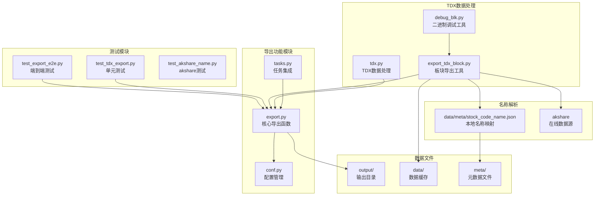
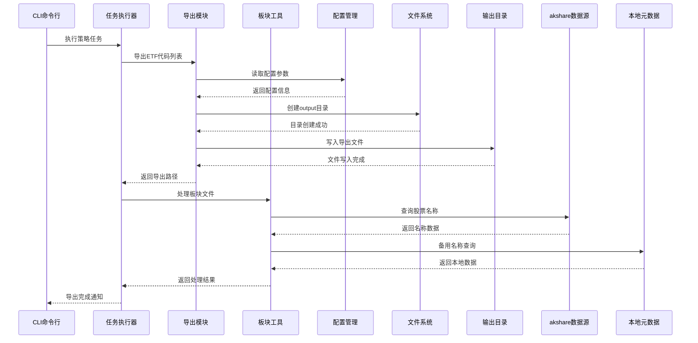
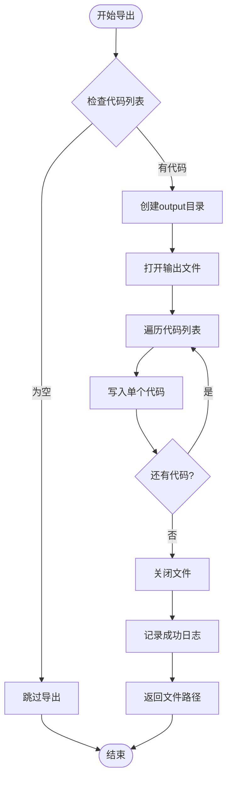
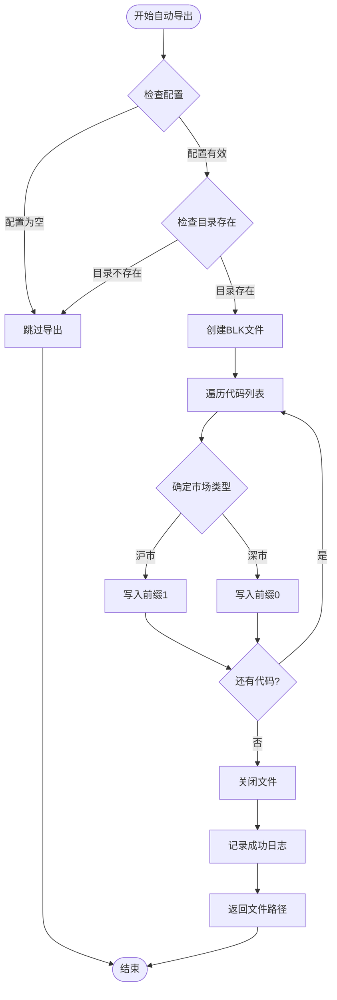
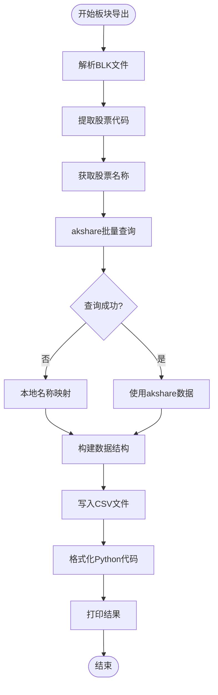
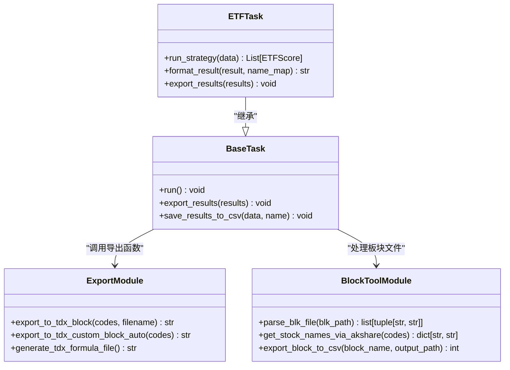
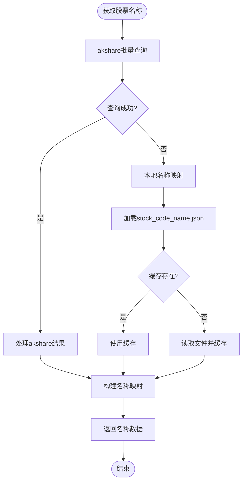
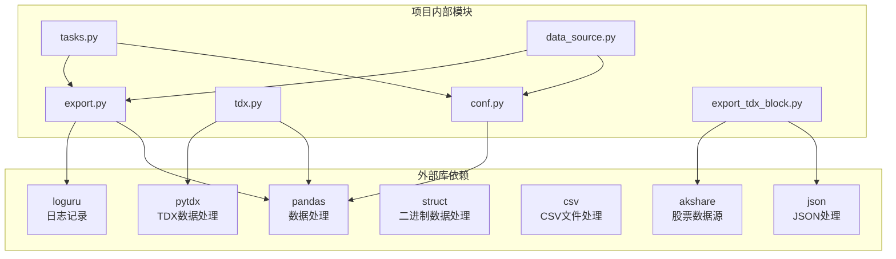
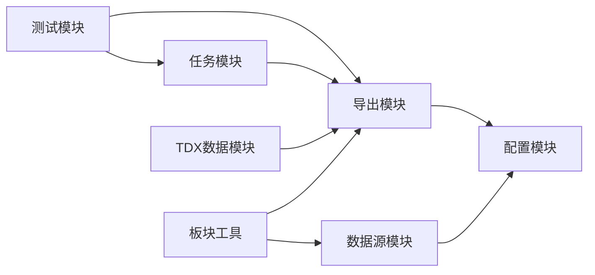

# TDX块导出功能

<cite>
**本文档引用的文件**
- [src/quant_etf/export.py](file://src/quant_etf/export.py)
- [src/quant_etf/tdx.py](file://src/quant_etf/tdx.py)
- [export_tdx_block.py](file://export_tdx_block.py)
- [src/quant_etf/conf.py](file://src/quant_etf/conf.py)
- [src/quant_etf/tasks.py](file://src/quant_etf/tasks.py)
- [tests/test_tdx_export.py](file://tests/test_tdx_export.py)
- [tests/e2e/test_export_e2e.py](file://tests/e2e/test_export_e2e.py)
- [README.md](file://README.md)
- [data/meta/stock_code_name.json](file://data/meta/stock_code_name.json)
- [debug_blk.py](file://debug_blk.py)
- [tdx_redu_temp.csv](file://tdx_redu_temp.csv)
- [test_akshare_name.py](file://test_akshare_name.py)
- [src/quant_etf/data_source.py](file://src/quant_etf/data_source.py)
</cite>

## 更新摘要
**变更内容**
- 新增export_tdx_block.py模块，提供通达信板块导出功能
- 集成akshare数据源，增强股票名称解析能力
- 支持二进制和文本格式解析
- 添加本地名称映射作为备用方案
- 新增调试工具和测试文件

## 目录
1. [简介](#简介)
2. [项目结构](#项目结构)
3. [核心组件](#核心组件)
4. [架构概览](#架构概览)
5. [详细组件分析](#详细组件分析)
6. [依赖关系分析](#依赖关系分析)
7. [性能考虑](#性能考虑)
8. [故障排除指南](#故障排除指南)
9. [结论](#结论)

## 简介

TDX块导出功能是量化ETF项目中的一个重要组成部分，负责将筛选出的ETF和股票代码导出为通达信（TDX）可识别的板块文件格式。该功能支持两种主要的导出方式：

1. **文本格式导出**：生成简单的文本文件，每行一个股票代码，供通达信自定义板块导入
2. **BLK格式导出**：生成通达信标准的BLK文件格式，包含市场前缀标识

**新增功能**：项目现已集成export_tdx_block.py模块，提供通达信板块文件的解析和导出功能，支持二进制和文本格式解析，并集成了akshare数据源进行实时股票名称查询。

这些导出功能与项目的CLI命令行接口集成，可以在日常运行、策略执行和Dashboard监控中自动触发。

## 项目结构

项目采用模块化的架构设计，TDX块导出功能分布在多个文件中：



**图表来源**
- [src/quant_etf/export.py:1-118](file://src/quant_etf/export.py#L1-L118)
- [src/quant_etf/tasks.py:280-300](file://src/quant_etf/tasks.py#L280-L300)
- [src/quant_etf/conf.py:112-116](file://src/quant_etf/conf.py#L112-L116)
- [export_tdx_block.py:1-267](file://export_tdx_block.py#L1-L267)

**章节来源**
- [src/quant_etf/export.py:1-118](file://src/quant_etf/export.py#L1-L118)
- [src/quant_etf/tasks.py:280-300](file://src/quant_etf/tasks.py#L280-L300)
- [src/quant_etf/conf.py:112-116](file://src/quant_etf/conf.py#L112-L116)
- [export_tdx_block.py:1-267](file://export_tdx_block.py#L1-L267)

## 核心组件

### 导出函数模块

项目提供了三个核心的导出函数：

1. **export_to_tdx_block**：生成简单的文本格式文件
2. **export_to_tdx_custom_block_auto**：自动生成BLK格式文件
3. **generate_tdx_formula_file**：生成通达信公式文件

### 板块导出工具模块

**新增**：export_tdx_block.py模块提供完整的通达信板块文件处理能力：

1. **parse_blk_file**：解析通达信BLK文件，支持文本格式
2. **get_stock_names_via_akshare**：使用akshare批量获取股票名称
3. **get_stock_name_from_meta**：从本地stock_code_name.json获取股票名称
4. **export_block_to_csv**：导出板块到CSV文件
5. **format_stock_pool_python**：格式化为Python列表格式

### 配置管理

通过配置文件管理TDX相关的路径和参数：

- `TDX_BLOCK_DIR`：通达信自定义板块目录
- `TDX_CUSTOM_BLOCK_NAME`：自定义板块名称
- `TDX_DIR`：通达信数据根目录

**章节来源**
- [src/quant_etf/export.py:5-118](file://src/quant_etf/export.py#L5-L118)
- [src/quant_etf/conf.py:112-116](file://src/quant_etf/conf.py#L112-L116)
- [export_tdx_block.py:37-214](file://export_tdx_block.py#L37-L214)

## 架构概览

TDX块导出功能在整个项目架构中的位置：



**图表来源**
- [src/quant_etf/tasks.py:288-299](file://src/quant_etf/tasks.py#L288-L299)
- [src/quant_etf/export.py:5-74](file://src/quant_etf/export.py#L5-L74)
- [export_tdx_block.py:81-137](file://export_tdx_block.py#L81-L137)

## 详细组件分析

### 导出函数实现

#### 文本格式导出函数

`export_to_tdx_block`函数负责生成简单的文本格式文件：



**图表来源**
- [src/quant_etf/export.py:5-32](file://src/quant_etf/export.py#L5-L32)

#### BLK格式自动导出函数

`export_to_tdx_custom_block_auto`函数生成通达信标准BLK文件：



**图表来源**
- [src/quant_etf/export.py:36-74](file://src/quant_etf/export.py#L36-L74)

#### 板块导出工具实现

**新增**：export_tdx_block.py模块的核心实现：



**图表来源**
- [export_tdx_block.py:140-214](file://export_tdx_block.py#L140-L214)

#### 配置参数说明

| 参数 | 类型 | 默认值 | 描述 |
|------|------|--------|------|
| `TDX_BLOCK_DIR` | Path | `TDX_DIR / "T0002" / "blocknew"` | 通达信自定义板块目录 |
| `TDX_CUSTOM_BLOCK_NAME` | str | `"高分etf"` | 自定义板块名称 |
| `MOMENTUM_WEIGHTS` | dict | `{"r60": 0.1, "r20": 0.2, "r10": 0.3, "r5": 0.4}` | 动量权重配置 |
| `TDX_ROOT` | Path | `Path(r"C:\new_hxzq_hc")` | 通达信安装根目录 |
| `BLOCK_DIR` | Path | `TDX_ROOT / "T0002" / "blocknew"` | 板块文件目录 |

**章节来源**
- [src/quant_etf/export.py:36-118](file://src/quant_etf/export.py#L36-L118)
- [src/quant_etf/conf.py:112-125](file://src/quant_etf/conf.py#L112-L125)
- [export_tdx_block.py:16-18](file://export_tdx_block.py#L16-L18)

### 任务集成机制

TDX块导出功能与项目任务系统深度集成：



**图表来源**
- [src/quant_etf/tasks.py:288-299](file://src/quant_etf/tasks.py#L288-L299)
- [src/quant_etf/export.py:5-118](file://src/quant_etf/export.py#L5-L118)
- [export_tdx_block.py:37-214](file://export_tdx_block.py#L37-L214)

**章节来源**
- [src/quant_etf/tasks.py:280-300](file://src/quant_etf/tasks.py#L280-L300)

### 股票名称解析机制

**新增**：多层次的股票名称解析系统：



**图表来源**
- [export_tdx_block.py:81-137](file://export_tdx_block.py#L81-L137)

**章节来源**
- [export_tdx_block.py:81-137](file://export_tdx_block.py#L81-L137)
- [data/meta/stock_code_name.json:1-200](file://data/meta/stock_code_name.json#L1-L200)

## 依赖关系分析

### 外部依赖

项目对外部库的依赖关系：



**图表来源**
- [src/quant_etf/export.py:1-3](file://src/quant_etf/export.py#L1-L3)
- [src/quant_etf/tdx.py:1-7](file://src/quant_etf/tdx.py#L1-L7)
- [export_tdx_block.py:12-14](file://export_tdx_block.py#L12-L14)

### 内部模块依赖



**图表来源**
- [tests/test_tdx_export.py:1-53](file://tests/test_tdx_export.py#L1-L53)
- [tests/e2e/test_export_e2e.py:1-184](file://tests/e2e/test_export_e2e.py#L1-L184)

**章节来源**
- [tests/test_tdx_export.py:1-53](file://tests/test_tdx_export.py#L1-L53)
- [tests/e2e/test_export_e2e.py:1-184](file://tests/e2e/test_export_e2e.py#L1-L184)

## 性能考虑

### 导出性能优化

1. **批量处理**：导出函数支持批量处理多个股票代码，减少文件I/O操作
2. **内存管理**：使用生成器模式处理大量数据，避免内存溢出
3. **错误处理**：完善的异常处理机制，确保导出过程的稳定性
4. **缓存机制**：本地名称映射使用缓存避免重复读取

### 数据源选择策略

| 数据源 | 适用场景 | 性能特点 | 准确性 | 备注 |
|--------|----------|----------|--------|------|
| akshare在线查询 | 实时数据、批量查询 | 高性能、实时准确 | 最高 | 需要网络连接 |
| 本地stock_code_name.json | 离线查询、备用方案 | 高性能、稳定 | 中等 | 需要定期更新 |
| SimpleStockAPI | 项目内置API | 中等性能 | 中等 | 内部数据源 |

### 文件格式选择

| 导出格式 | 适用场景 | 性能特点 | 兼容性 |
|----------|----------|----------|--------|
| 文本格式 | 简单导入、快速处理 | 高性能、低开销 | 最佳兼容性 |
| BLK格式 | 通达信标准、自动识别 | 中等性能、标准格式 | 通达信最佳支持 |
| CSV格式 | 数据分析、二次处理 | 低性能、易分析 | 通用性强 |

**章节来源**
- [export_tdx_block.py:118-137](file://export_tdx_block.py#L118-L137)
- [data/meta/stock_code_name.json:1-200](file://data/meta/stock_code_name.json#L1-L200)

## 故障排除指南

### 常见问题及解决方案

#### 导出文件无法创建

**问题描述**：导出函数返回None或抛出异常

**可能原因**：
1. 输出目录权限不足
2. 磁盘空间不足
3. 文件路径包含非法字符

**解决方案**：
```python
# 检查输出目录
if not os.path.exists("output"):
    os.makedirs("output")

# 检查磁盘空间
import shutil
total, used, free = shutil.disk_usage(".")
if free < 1024 * 1024:  # 少于1MB
    raise Exception("磁盘空间不足")
```

#### TDX目录配置错误

**问题描述**：自动导出功能无法工作

**可能原因**：
1. `TDX_BLOCK_DIR`配置不正确
2. 通达信安装路径错误
3. 目录权限问题

**解决方案**：
```python
# 验证TDX配置
if not TDX_BLOCK_DIR or not os.path.exists(TDX_BLOCK_DIR):
    logger.warning("TDX配置无效，跳过自动导出")
    return None
```

#### 股票代码格式错误

**问题描述**：导出的代码格式不符合通达信要求

**可能原因**：
1. 代码长度不符合要求
2. 市场前缀错误
3. 代码格式不规范

**解决方案**：
```python
# 验证股票代码格式
def validate_code(code):
    if not code.isdigit():
        return False
    if len(code) != 6:
        return False
    return True

# 正确的市场前缀分配
def get_market_prefix(code):
    if code.startswith(("5", "6")):
        return "1"  # 沪市
    else:
        return "0"  # 深市
```

#### akshare数据源问题

**问题描述**：akshare查询失败或数据不完整

**可能原因**：
1. 网络连接问题
2. akshare版本不兼容
3. API接口变更

**解决方案**：
```python
# akshare查询失败时的回退机制
def get_stock_names_via_akshare(codes):
    try:
        import akshare as ak
        # 查询逻辑
    except Exception as e:
        print(f"使用 akshare 获取股票名称失败：{e}")
        print("回退到本地名称映射...")
        return {}  # 回退到本地映射
```

#### 本地名称映射问题

**问题描述**：stock_code_name.json文件缺失或格式错误

**可能原因**：
1. 文件不存在
2. JSON格式错误
3. 缺少必要的字段

**解决方案**：
```python
# 检查本地名称映射文件
def get_stock_name_from_meta(stock_code, cache={}):
    if not cache:
        meta_file = Path(__file__).parent / "data" / "meta" / "stock_code_name.json"
        if not meta_file.exists():
            return ""
        # 读取和解析逻辑
```

**章节来源**
- [tests/test_tdx_export.py:40-53](file://tests/test_tdx_export.py#L40-L53)
- [tests/e2e/test_export_e2e.py:81-99](file://tests/e2e/test_export_e2e.py#L81-L99)
- [export_tdx_block.py:112-115](file://export_tdx_block.py#L112-L115)

## 结论

TDX块导出功能作为量化ETF项目的重要组成部分，提供了灵活且高效的股票代码导出能力。通过支持多种导出格式和智能的配置管理，该功能能够满足不同用户的需求。

**主要优势**

1. **多格式支持**：同时支持文本格式和BLK格式导出
2. **自动化程度高**：与任务系统深度集成，自动触发导出
3. **配置灵活**：通过配置文件管理TDX相关参数
4. **错误处理完善**：提供全面的异常处理和日志记录
5. **多层次数据源**：支持akshare在线查询和本地映射双重机制
6. **增强的名称解析**：提供实时和离线的股票名称解析能力

**新增特性**

1. **板块文件解析**：支持通达信BLK文件的解析和导出
2. **akshare集成**：实时获取股票名称，提高数据准确性
3. **调试工具**：提供二进制文件分析和测试工具
4. **性能优化**：缓存机制和批量处理提升处理效率

**发展建议**

1. **性能优化**：对于大量数据导出，可以考虑分批处理机制
2. **格式扩展**：支持更多第三方平台的数据格式
3. **并发处理**：优化多线程导出性能
4. **监控增强**：增加导出过程的实时监控和状态反馈
5. **数据同步**：定期同步akshare数据到本地映射文件

该功能为用户提供了便捷的TDX数据导入通道，是整个量化ETF系统与通达信平台对接的关键桥梁。新增的akshare集成和板块文件处理能力进一步增强了系统的实用性和数据准确性。