# TDX数据集成

<cite>
**本文档引用的文件**
- [src/quant_etf/tdx.py](file://src/quant_etf/tdx.py)
- [src/quant_etf/conf.py](file://src/quant_etf/conf.py)
- [src/quant_etf/data_source.py](file://src/quant_etf/data_source.py)
- [src/quant_etf/minute_collector.py](file://src/quant_etf/minute_collector.py)
- [src/quant_etf/minute_data_manager.py](file://src/quant_etf/minute_data_manager.py)
- [src/quant_etf/cli.py](file://src/quant_etf/cli.py)
- [src/quant_etf/init_15min_data.py](file://src/quant_etf/init_15min_data.py)
- [src/collect_info/accurate_stock_database.py](file://src/collect_info/accurate_stock_database.py)
- [src/poc/read_tdx.py](file://src/poc/read_tdx.py)
- [src/poc/read_tdxhq.py](file://src/poc/read_tdxhq.py)
- [tests/test_tdx.py](file://tests/test_tdx.py)
- [tests/verify_tdx_real_data.py](file://tests/verify_tdx_real_data.py)
- [tests/test_collect_10days.py](file://tests/test_collect_10days.py)
- [tests/test_collect_all_pool.py](file://tests/test_collect_all_pool.py)
- [scripts/validate_etf_data.py](file://scripts/validate_etf_data.py)
- [export_159516_qfq.py](file://export_159516_qfq.py)
- [debug_159516_qfq.py](file://debug_159516_qfq.py)
- [debug_xdxr_date.py](file://debug_xdxr_date.py)
- [run_minute_collector.py](file://run_minute_collector.py)
</cite>

## 目录
1. [简介](#简介)
2. [项目结构](#项目结构)
3. [核心组件](#核心组件)
4. [架构概览](#架构概览)
5. [详细组件分析](#详细组件分析)
6. [依赖关系分析](#依赖关系分析)
7. [性能考量](#性能考量)
8. [故障排查指南](#故障排查指南)
9. [结论](#结论)
10. [附录](#附录)

## 简介
本技术文档面向Quant-ETF项目的TDX数据集成系统，深入解析通达信日线数据文件的解析机制、路径查找策略、数据质量验证与异常处理流程。重点覆盖以下内容：
- get_tdx_path函数的路径查找逻辑与文件定位策略
- parse_tdx_day_file函数的数据解析算法与DataFrame转换过程
- **新增** get_xdxr_info函数的除权除息信息获取与智能缓存机制
- **新增** adjust_price_qfq函数的前复权价格调整算法
- **重大更新** 分钟数据收集器的本地通达信服务器自动发现机制和智能批处理功能
- **重大更新** DuckDB数据库存储架构与15分钟K线数据管理
- **重大更新** 统一CLI命令行接口与自动化数据采集流程
- TDX数据质量验证与异常处理机制（完整性检查、重复数据处理、缺失值填充策略）
- 与accurate_stock_database的协作关系与数据库同步机制
- TDX数据配置与故障排查实用指南

## 项目结构
TDX数据集成涉及以下关键模块：
- 配置模块：负责通达信数据目录、VIPDOC路径等全局配置
- TDX数据访问模块：提供本地文件解析、在线行情获取、除权除息信息获取与前复权处理能力
- **重大更新** 分钟数据采集模块：提供本地通达信服务器自动发现、智能批处理与DuckDB存储
- **重大更新** 15分钟数据管理模块：从1分钟数据生成15分钟K线，支持增量更新
- **重大更新** CLI统一接口：提供分钟数据采集、补采、Dashboard管理等命令
- 数据源聚合模块：统一管理本地TDX文件、缓存与在线数据的加载与优先级，集成前复权处理
- 数据库与工具模块：提供ETF名称映射与辅助工具
- 测试与验证脚本：确保数据质量与系统稳定性

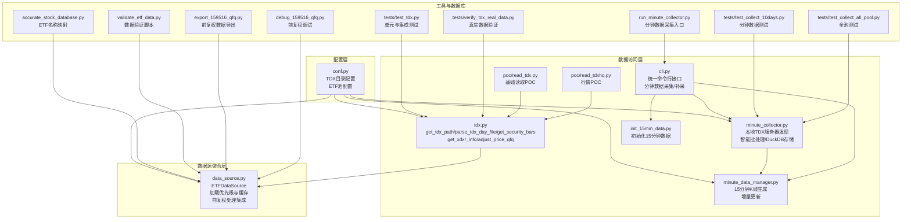

**图表来源**
- [src/quant_etf/conf.py:100-150](file://src/quant_etf/conf.py#L100-L150)
- [src/quant_etf/tdx.py:209-232](file://src/quant_etf/tdx.py#L209-L232)
- [src/quant_etf/tdx.py:378-454](file://src/quant_etf/tdx.py#L378-L454)
- [src/quant_etf/tdx.py:457-545](file://src/quant_etf/tdx.py#L457-L545)
- [src/quant_etf/minute_collector.py:29-163](file://src/quant_etf/minute_collector.py#L29-L163)
- [src/quant_etf/minute_data_manager.py:20-283](file://src/quant_etf/minute_data_manager.py#L20-L283)
- [src/quant_etf/cli.py:87-143](file://src/quant_etf/cli.py#L87-L143)
- [src/quant_etf/init_15min_data.py:58-107](file://src/quant_etf/init_15min_data.py#L58-L107)
- [src/quant_etf/data_source.py:189-266](file://src/quant_etf/data_source.py#L189-L266)
- [src/collect_info/accurate_stock_database.py:22-121](file://src/collect_info/accurate_stock_database.py#L22-L121)

**章节来源**
- [src/quant_etf/conf.py:100-150](file://src/quant_etf/conf.py#L100-L150)
- [src/quant_etf/tdx.py:209-232](file://src/quant_etf/tdx.py#L209-L232)
- [src/quant_etf/tdx.py:378-454](file://src/quant_etf/tdx.py#L378-L454)
- [src/quant_etf/tdx.py:457-545](file://src/quant_etf/tdx.py#L457-L545)
- [src/quant_etf/minute_collector.py:29-163](file://src/quant_etf/minute_collector.py#L29-L163)
- [src/quant_etf/minute_data_manager.py:20-283](file://src/quant_etf/minute_data_manager.py#L20-L283)
- [src/quant_etf/cli.py:87-143](file://src/quant_etf/cli.py#L87-L143)
- [src/quant_etf/init_15min_data.py:58-107](file://src/quant_etf/init_15min_data.py#L58-L107)
- [src/quant_etf/data_source.py:189-266](file://src/quant_etf/data_source.py#L189-L266)
- [src/collect_info/accurate_stock_database.py:22-121](file://src/collect_info/accurate_stock_database.py#L22-L121)

## 核心组件
本节聚焦TDX数据集成的关键组件及其职责：
- 配置模块（conf.py）：定义TDX数据根目录、VIPDOC路径、ETF池等全局配置
- TDX数据访问模块（tdx.py）：提供本地文件解析、在线行情获取、路径查找、服务器缓存、**新增**除权除息信息获取与**新增**前复权价格调整算法
- **重大更新** 分钟数据采集模块（minute_collector.py）：提供本地通达信服务器自动发现机制、智能批处理功能、DuckDB数据库存储、服务器失败冷却机制
- **重大更新** 15分钟数据管理模块（minute_data_manager.py）：从1分钟数据生成15分钟K线、支持增量更新、提供查询接口
- **重大更新** CLI统一接口（cli.py）：提供分钟数据采集、补采、Dashboard管理等命令行操作
- 数据源聚合模块（data_source.py）：统一加载策略（本地TDX > 缓存 > 在线）、数据新鲜度检查、回填名称映射、**新增**前复权处理集成
- 工具与数据库（accurate_stock_database.py）：提供ETF名称映射，便于后续展示与同步
- 测试与验证（tests与scripts）：保障数据质量与系统稳定性

**章节来源**
- [src/quant_etf/conf.py:100-150](file://src/quant_etf/conf.py#L100-L150)
- [src/quant_etf/tdx.py:209-232](file://src/quant_etf/tdx.py#L209-L232)
- [src/quant_etf/tdx.py:378-454](file://src/quant_etf/tdx.py#L378-L454)
- [src/quant_etf/tdx.py:457-545](file://src/quant_etf/tdx.py#L457-L545)
- [src/quant_etf/minute_collector.py:29-163](file://src/quant_etf/minute_collector.py#L29-L163)
- [src/quant_etf/minute_data_manager.py:20-283](file://src/quant_etf/minute_data_manager.py#L20-L283)
- [src/quant_etf/cli.py:87-143](file://src/quant_etf/cli.py#L87-L143)
- [src/quant_etf/data_source.py:189-266](file://src/quant_etf/data_source.py#L189-L266)
- [src/collect_info/accurate_stock_database.py:22-121](file://src/collect_info/accurate_stock_database.py#L22-L121)

## 架构概览
TDX数据集成采用"本地优先、在线回退"的加载策略，结合缓存与数据新鲜度检查，确保在离线环境下仍能稳定运行。**重大更新**的分钟数据收集器通过本地通达信服务器自动发现机制和智能批处理功能，解决了pytdx库的限制问题，并引入了DuckDB数据库存储架构。**新增**的前复权处理机制通过智能缓存和失败服务器跟踪，提供准确的数据连续性。

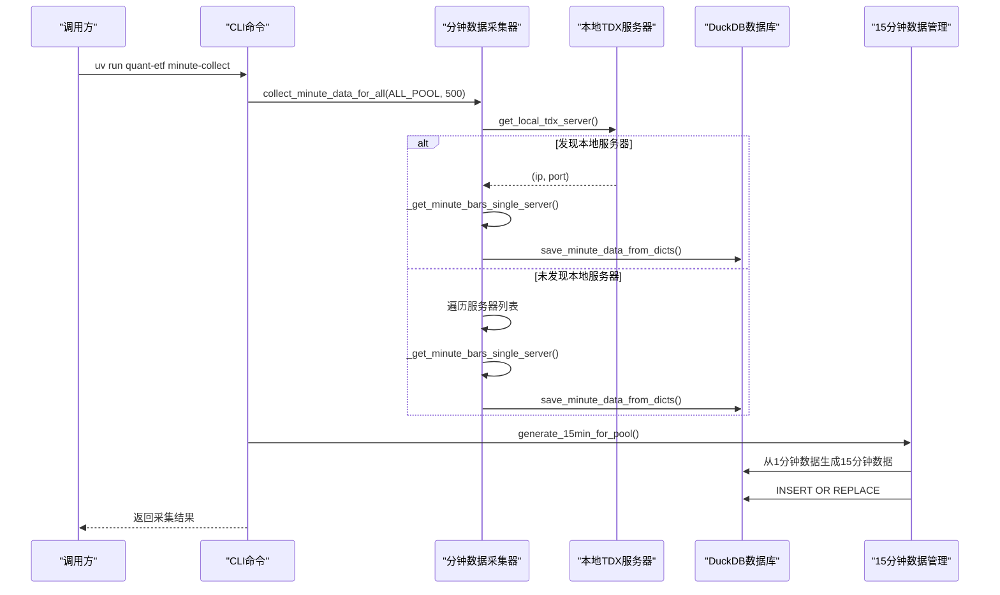

**图表来源**
- [src/quant_etf/cli.py:87-143](file://src/quant_etf/cli.py#L87-L143)
- [src/quant_etf/minute_collector.py:85-163](file://src/quant_etf/minute_collector.py#L85-L163)
- [src/quant_etf/minute_collector.py:166-226](file://src/quant_etf/minute_collector.py#L166-L226)
- [src/quant_etf/minute_collector.py:436-477](file://src/quant_etf/minute_collector.py#L436-L477)
- [src/quant_etf/minute_data_manager.py:171-189](file://src/quant_etf/minute_data_manager.py#L171-L189)

## 详细组件分析

### get_tdx_path 路径查找逻辑与文件定位策略
- 市场判定：根据代码前缀判断市场（沪市以5、6开头，深市以0、1、3开头；其他情况默认深市）
- 路径构造：基于TDX_VIPDOC_DIR构造标准路径，形如vipdoc/sh(lday/sh510050.day)或vipdoc/sz(lday/sz000001.day)
- 定位策略：
  - 若能确定市场，优先检查该市场下的文件是否存在
  - 若无法确定市场，遍历sh与sz两个市场，返回首个存在的文件
  - 未找到返回None

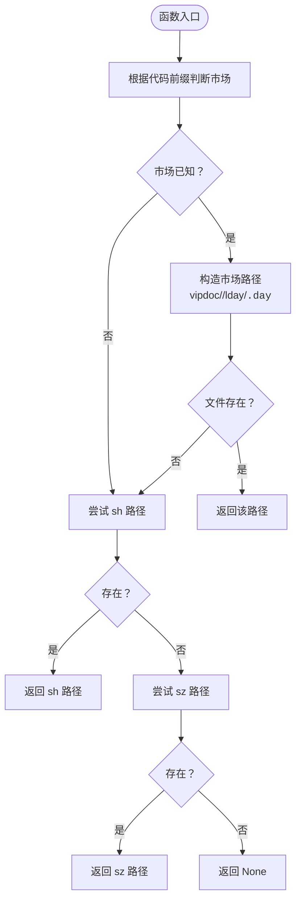

**图表来源**
- [src/quant_etf/tdx.py:211-234](file://src/quant_etf/tdx.py#L211-L234)
- [src/quant_etf/conf.py:100-116](file://src/quant_etf/conf.py#L100-L116)

**章节来源**
- [src/quant_etf/tdx.py:211-234](file://src/quant_etf/tdx.py#L211-L234)
- [src/quant_etf/conf.py:100-116](file://src/quant_etf/conf.py#L100-L116)

### parse_tdx_day_file 数据解析算法与DataFrame转换
- 输入：.day文件路径（Path或字符串）
- 处理流程：
  - 文件存在性检查：不存在返回空DataFrame
  - 使用TdxDailyBarReader读取原始数据
  - 结构转换：重置索引、重命名列、转换日期、设置索引、排序
  - 特殊处理：计算涨跌幅（pct_chg），缺失值填充为0
- 输出：标准化的DataFrame，包含date、open、high、low、close、amount、volume、pct_chg

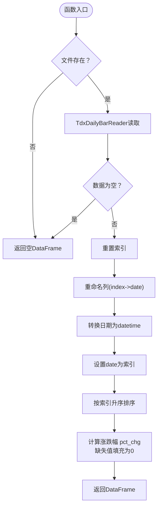

**图表来源**
- [src/quant_etf/tdx.py:343-377](file://src/quant_etf/tdx.py#L343-L377)

**章节来源**
- [src/quant_etf/tdx.py:343-377](file://src/quant_etf/tdx.py#L343-L377)

### get_security_bars 在线数据获取与服务器选择策略
- 市场判定：通过code_to_market(code)确定市场
- 服务器选择优先级：
  - 若未指定服务器，优先尝试缓存的工作服务器（_cached_server）
  - 若缓存失败，清除缓存并尝试自定义服务器列表（CUSTOM_HQ_HOSTS）与默认服务器列表（hosts.hq_hosts）
  - 成功后缓存该服务器
- 数据获取：使用TdxHq_API.get_security_bars(category=9表示日线)，转换为DataFrame并标准化字段
- 异常处理：连接失败、无数据返回、异常均返回空DataFrame

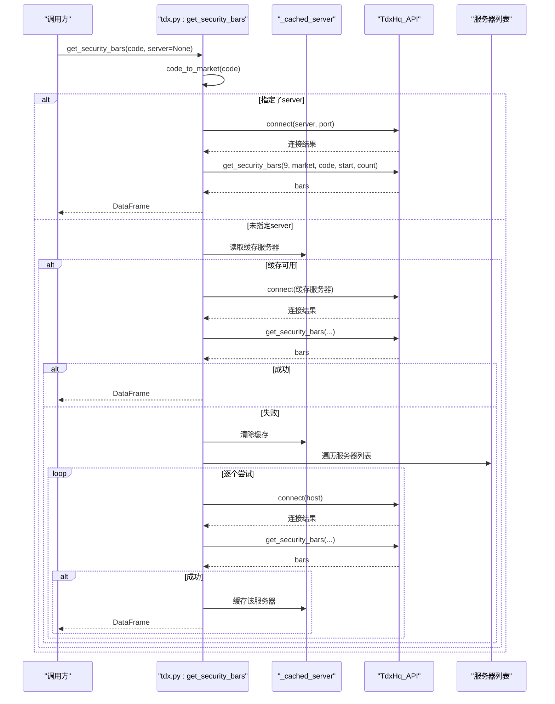

**图表来源**
- [src/quant_etf/tdx.py:237-341](file://src/quant_etf/tdx.py#L237-L341)
- [src/quant_etf/tdx.py:25-34](file://src/quant_etf/tdx.py#L25-L34)

**章节来源**
- [src/quant_etf/tdx.py:237-341](file://src/quant_etf/tdx.py#L237-L341)
- [src/quant_etf/tdx.py:25-34](file://src/quant_etf/tdx.py#L25-L34)

### **新增** get_xdxr_info 除权除息信息获取与智能缓存机制
- 功能：获取股票的除权除息信息，支持智能缓存和失败服务器跟踪
- 缓存策略：
  - 使用全局_xdxr_cache字典进行内存缓存
  - 自动检测并跳过已失败的服务器
  - 优先使用缓存的工作服务器
- 服务器选择：
  - 先尝试缓存的服务器（排除失败服务器）
  - 依次尝试CUSTOM_HQ_HOSTS和默认服务器列表
  - 连接超时设置为2秒，避免长时间等待
- 异常处理：记录失败服务器到_failed_servers集合，下次自动跳过

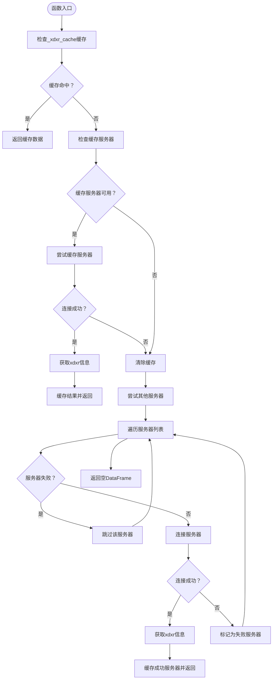

**图表来源**
- [src/quant_etf/tdx.py:378-454](file://src/quant_etf/tdx.py#L378-L454)

**章节来源**
- [src/quant_etf/tdx.py:378-454](file://src/quant_etf/tdx.py#L378-L454)

### **新增** adjust_price_qfq 前复权价格调整算法
- 功能：对价格数据进行精确的前复权处理，修正了历史计算公式
- 核心算法改进：
  - **修正公式**：从错误的'close_on_xdxr / close_on_xdxr_day'到正确的'close_on_xdxr_day / close_on_previous_trading_day'
  - 保持最新价格不变，调整历史价格以保证数据连续性
- 处理流程：
  - 确保日期索引规范化（去除时间部分）
  - 处理xdxr数据的日期格式（year/month/day或date/datetime列）
  - 按时间倒序处理除权事件（从最新到最旧）
  - 对每个除权日之前的历史数据应用复权因子
  - 重新计算涨跌幅（基于复权后的价格）

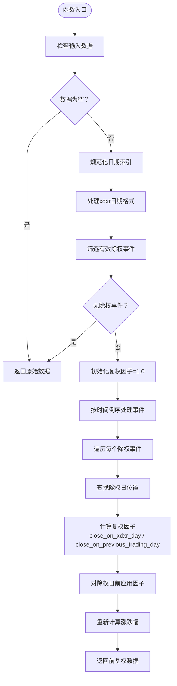

**图表来源**
- [src/quant_etf/tdx.py:457-545](file://src/quant_etf/tdx.py#L457-L545)

**章节来源**
- [src/quant_etf/tdx.py:457-545](file://src/quant_etf/tdx.py#L457-L545)

### **重大更新** 本地通达信服务器自动发现机制
- 功能：通过本地运行的通达信进程自动发现行情服务器地址
- 实现原理：
  - 使用psutil查找tdxw.exe进程PID
  - 通过netstat命令查找与7709端口的ESTABLISHED连接
  - 解析远程IP和端口信息
- 失败冷却机制：
  - 记录失败服务器的时间戳
  - 服务器冷却时间为120秒
  - 在冷却时间内跳过该服务器
- 优势：解决pytdx库的限制问题，直接使用本地通达信客户端的服务器连接

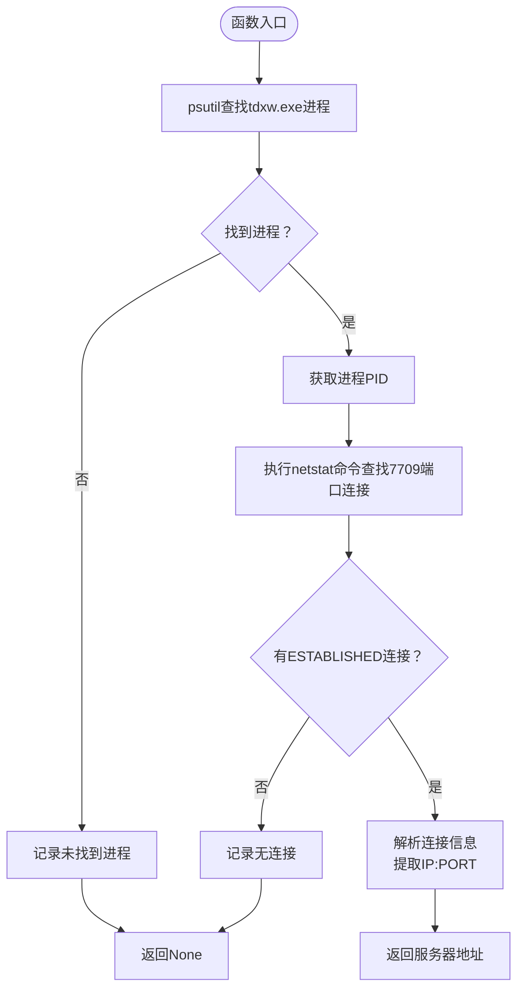

**图表来源**
- [src/quant_etf/minute_collector.py:29-68](file://src/quant_etf/minute_collector.py#L29-L68)

**章节来源**
- [src/quant_etf/minute_collector.py:29-68](file://src/quant_etf/minute_collector.py#L29-L68)

### **重大更新** 智能批处理功能与DuckDB存储架构
- 批处理策略：
  - pytdx单次最多返回约800条，实际使用500条批次
  - 自动分批获取，直到达到目标数量或无更多数据
  - 支持断点续传，处理网络异常
- DuckDB数据库设计：
  - 创建minute_bars表，包含完整分钟级数据
  - 主键(code, time)确保数据唯一性
  - 创建索引提升查询性能
  - 支持INSERT OR REPLACE更新机制
- 存储字段：code、time、open、high、low、close、volume、amount、year、month、day、hour、minute

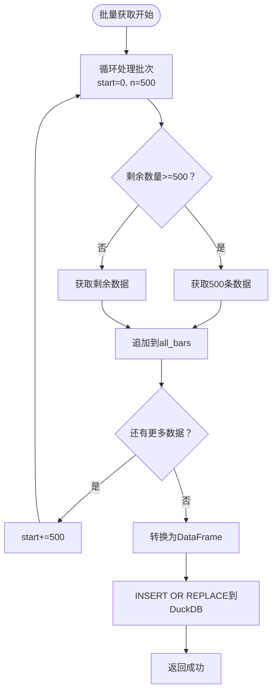

**图表来源**
- [src/quant_etf/minute_collector.py:184-196](file://src/quant_etf/minute_collector.py#L184-L196)
- [src/quant_etf/minute_collector.py:436-477](file://src/quant_etf/minute_collector.py#L436-L477)

**章节来源**
- [src/quant_etf/minute_collector.py:184-196](file://src/quant_etf/minute_collector.py#L184-L196)
- [src/quant_etf/minute_collector.py:436-477](file://src/quant_etf/minute_collector.py#L436-L477)

### **重大更新** 15分钟K线数据管理与生成
- 重采样策略：使用pandas的resample("15T")将1分钟数据重采样为15分钟
- 聚合函数：
  - open: first(首分钟开盘价)
  - high: max(15分钟最高价)
  - low: min(15分钟最低价)
  - close: last(第15分钟收盘价)
  - volume: sum(15分钟成交量)
  - amount: sum(15分钟成交额)
- 增量更新：支持从最新数据点继续生成，避免重复计算
- 数据库：独立的DuckDB数据库存储15分钟数据

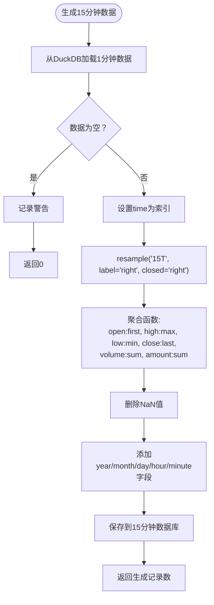

**图表来源**
- [src/quant_etf/minute_data_manager.py:72-107](file://src/quant_etf/minute_data_manager.py#L72-L107)
- [src/quant_etf/minute_data_manager.py:110-168](file://src/quant_etf/minute_data_manager.py#L110-L168)

**章节来源**
- [src/quant_etf/minute_data_manager.py:72-107](file://src/quant_etf/minute_data_manager.py#L72-L107)
- [src/quant_etf/minute_data_manager.py:110-168](file://src/quant_etf/minute_data_manager.py#L110-L168)

### **重大更新** 统一CLI命令行接口
- 命令分类：
  - minute-collect：启动分钟级K线数据采集器
  - minute-backfill：补采历史分钟级K线数据
  - dashboard：启动Dashboard监控系统
  - daily-run：运行每日选股任务
- 交互式信号处理：支持Ctrl+C优雅关闭
- 日志管理：自动创建按日期分割的日志文件
- 自动化流程：集成交易时间判断与等待机制

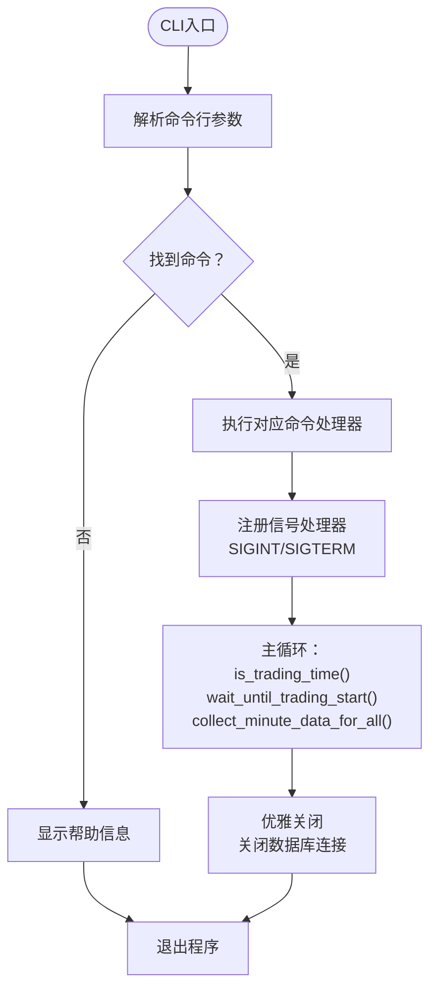

**图表来源**
- [src/quant_etf/cli.py:87-143](file://src/quant_etf/cli.py#L87-L143)
- [src/quant_etf/cli.py:531-545](file://src/quant_etf/cli.py#L531-L545)

**章节来源**
- [src/quant_etf/cli.py:87-143](file://src/quant_etf/cli.py#L87-L143)
- [src/quant_etf/cli.py:531-545](file://src/quant_etf/cli.py#L531-L545)

### ETFDataSource 数据加载与缓存策略
- 加载优先级：本地TDX文件 > 本地CSV缓存 > 在线TDX服务器
- 数据新鲜度检查：根据交易日与时点判断数据是否足够新鲜（支持周末与周一特殊规则）
- 回填名称映射：从data/meta/stock_code_name.json加载ETF名称映射，若缺失则通过外部接口补齐
- **新增** 前复权处理集成：当adjust_qfq=True时，自动获取除权除息信息并应用前复权算法

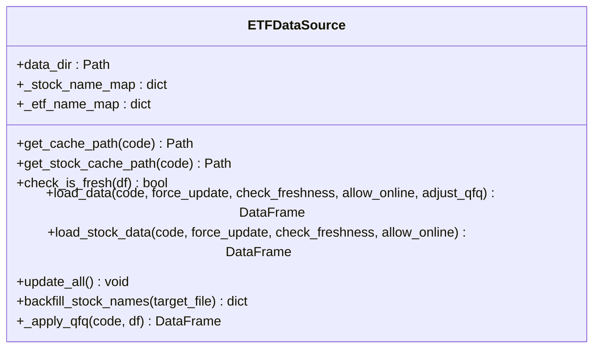

**图表来源**
- [src/quant_etf/data_source.py:15-387](file://src/quant_etf/data_source.py#L15-L387)

**章节来源**
- [src/quant_etf/data_source.py:15-387](file://src/quant_etf/data_source.py#L15-L387)

### 与accurate_stock_database的协作关系与数据库同步机制
- 名称映射来源：ETF名称映射优先从data/meta/stock_code_name.json加载；若不存在则通过accurate_stock_database提供的get_stock_database()构建
- 同步机制：ETFDataSource.backfill_stock_names方法可批量补齐缺失的ETF名称，写入data/meta/stock_code_name.json，实现与accurate_stock_database的协同

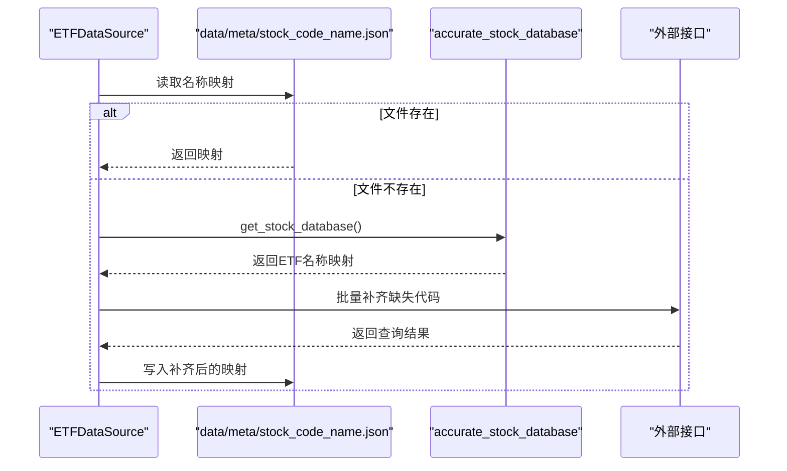

**图表来源**
- [src/quant_etf/data_source.py:303-371](file://src/quant_etf/data_source.py#L303-L371)
- [src/collect_info/accurate_stock_database.py:22-121](file://src/collect_info/accurate_stock_database.py#L22-L121)

**章节来源**
- [src/quant_etf/data_source.py:303-371](file://src/quant_etf/data_source.py#L303-L371)
- [src/collect_info/accurate_stock_database.py:22-121](file://src/collect_info/accurate_stock_database.py#L22-L121)

## 依赖关系分析
- 模块耦合：
  - data_source.py依赖tdx.py进行本地文件解析、在线数据获取、**新增**除权除息信息获取与**新增**前复权处理
  - minute_collector.py依赖psutil、subprocess进行本地服务器发现，依赖duckdb进行数据存储
  - minute_data_manager.py依赖minute_collector的数据库连接进行15分钟数据生成
  - cli.py统一调度各个模块的命令行操作
  - tdx.py依赖conf.py中的TDX_VIPDOC_DIR进行路径定位
  - data_source.py依赖accurate_stock_database.py进行名称映射
- 外部依赖：
  - pytdx：用于解析TDX二进制文件、在线行情获取与**新增**除权除息信息获取
  - pandas：用于DataFrame处理与数据转换
  - loguru：用于日志记录
  - psutil：用于进程管理和本地服务器发现
  - duckdb：用于高性能数据库存储

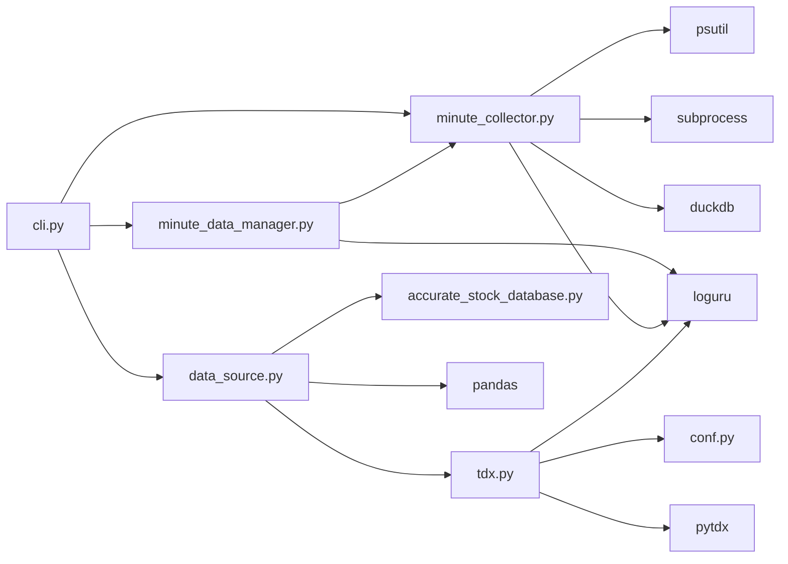

**图表来源**
- [src/quant_etf/data_source.py:7-8](file://src/quant_etf/data_source.py#L7-L8)
- [src/quant_etf/minute_collector.py:15-23](file://src/quant_etf/minute_collector.py#L15-L23)
- [src/quant_etf/minute_data_manager.py:16](file://src/quant_etf/minute_data_manager.py#L16)
- [src/quant_etf/cli.py:18-22](file://src/quant_etf/cli.py#L18-L22)
- [src/quant_etf/tdx.py:1-9](file://src/quant_etf/tdx.py#L1-L9)
- [src/quant_etf/conf.py:100-116](file://src/quant_etf/conf.py#L100-L116)
- [src/collect_info/accurate_stock_database.py:22-121](file://src/collect_info/accurate_stock_database.py#L22-L121)

**章节来源**
- [src/quant_etf/data_source.py:7-8](file://src/quant_etf/data_source.py#L7-L8)
- [src/quant_etf/minute_collector.py:15-23](file://src/quant_etf/minute_collector.py#L15-L23)
- [src/quant_etf/minute_data_manager.py:16](file://src/quant_etf/minute_data_manager.py#L16)
- [src/quant_etf/cli.py:18-22](file://src/quant_etf/cli.py#L18-L22)
- [src/quant_etf/tdx.py:1-9](file://src/quant_etf/tdx.py#L1-L9)
- [src/quant_etf/conf.py:100-116](file://src/quant_etf/conf.py#L100-L116)
- [src/collect_info/accurate_stock_database.py:22-121](file://src/collect_info/accurate_stock_database.py#L22-L121)

## 性能考量
- 本地文件解析：使用TdxDailyBarReader直接读取二进制文件，避免额外转换开销
- 在线数据获取：通过服务器缓存减少重复连接成本；最大尝试次数限制避免长时间阻塞
- **新增** 智能缓存机制：get_xdxr_info使用_xdxr_cache字典缓存除权除息信息，避免重复网络请求
- **新增** 失败服务器跟踪：_failed_servers集合记录不可用服务器，提高服务器选择效率
- **重大更新** 本地服务器发现：直接使用本地通达信客户端的服务器连接，避免pytdx库限制
- **重大更新** DuckDB数据库：提供高性能的列式存储，支持快速查询和更新
- **重大更新** 批处理优化：500条批次获取，减少网络往返次数
- **重大更新** 失败冷却机制：120秒冷却时间避免频繁重试失败服务器
- 数据新鲜度检查：仅在必要时触发在线获取，降低网络请求频率
- 缓存策略：本地CSV缓存支持快速恢复，减少重复解析与网络请求
- **新增** 前复权处理优化：adjust_price_qfq算法按时间倒序处理，避免重复计算

## 故障排查指南
- TDX数据目录配置
  - 确认TDX_VIPDOC_DIR路径正确，可通过环境变量TDX_DATA_PATH覆盖默认路径
  - Windows默认路径为C:\new_hxzq_hc，Linux/macOS默认路径为~/.local/share/tdx
- 文件路径问题
  - 使用get_tdx_path(code)确认文件是否存在；若返回None，检查代码前缀与市场判断
  - 确认文件名为<market><code>.day，例如sh510050.day或sz000001.day
- 数据解析异常
  - parse_tdx_day_file返回空DataFrame：检查文件是否损坏或为空
  - 日期排序异常：确认解析后索引为date且已排序
- 在线数据获取失败
  - 检查网络连通性与服务器可用性
  - 观察日志中服务器切换与缓存行为
- **新增** 本地服务器发现失败
  - 确认通达信客户端正在运行且连接到服务器
  - 检查防火墙设置，确保7709端口可访问
  - 使用psutil和netstat命令手动验证进程和连接
- **新增** DuckDB数据库问题
  - 检查数据库文件权限和磁盘空间
  - 确认DuckDB版本兼容性
  - 使用query_minute_data执行简单SQL测试连接
- **新增** 分钟数据采集异常
  - 检查ALL_POOL配置是否正确
  - 验证collect_minute_data_for_all函数的返回结果
  - 使用测试脚本tests/test_collect_all_pool.py验证全池采集
- **新增** 15分钟数据生成问题
  - 确认1分钟数据已正确存储到DuckDB
  - 检查generate_15min_for_pool函数的执行日志
  - 验证pandas resample函数的聚合结果
- **新增** CLI命令行问题
  - 使用uv run quant-etf --help查看可用命令
  - 检查日志文件minute_collector_*.log获取详细错误信息
  - 验证Ctrl+C信号处理是否正常工作
- **新增** 除权除息信息获取问题
  - get_xdxr_info返回空DataFrame：检查服务器连接状态，确认代码有效性
  - 观察_failed_servers集合中的失败服务器记录
  - 使用debug_xdxr_date.py脚本调试xdxr日期匹配问题
- **新增** 前复权处理异常
  - adjust_price_qfq返回原始数据：检查xdxr_df格式和有效性
  - 使用debug_159516_qfq.py脚本调试前复权计算过程
  - 验证复权因子计算：确保使用正确的'close_on_xdxr_day / close_on_previous_trading_day'公式
- 数据质量验证
  - 使用tests/test_tdx.py与tests/verify_tdx_real_data.py进行单元与集成测试
  - 使用scripts/validate_etf_data.py批量验证ETF数据并输出预览
  - **新增** 使用tests/test_collect_10days.py验证分钟数据采集功能
  - **新增** 使用tests/test_collect_all_pool.py验证全池数据采集
  - **新增** 使用export_159516_qfq.py导出前复权数据进行人工校对

**章节来源**
- [src/quant_etf/conf.py:100-116](file://src/quant_etf/conf.py#L100-L116)
- [src/quant_etf/tdx.py:211-234](file://src/quant_etf/tdx.py#L211-L234)
- [src/quant_etf/tdx.py:343-377](file://src/quant_etf/tdx.py#L343-L377)
- [src/quant_etf/tdx.py:378-454](file://src/quant_etf/tdx.py#L378-L454)
- [src/quant_etf/tdx.py:457-545](file://src/quant_etf/tdx.py#L457-L545)
- [src/quant_etf/minute_collector.py:29-68](file://src/quant_etf/minute_collector.py#L29-L68)
- [src/quant_etf/minute_collector.py:184-196](file://src/quant_etf/minute_collector.py#L184-L196)
- [src/quant_etf/minute_data_manager.py:72-107](file://src/quant_etf/minute_data_manager.py#L72-L107)
- [src/quant_etf/cli.py:87-143](file://src/quant_etf/cli.py#L87-L143)
- [tests/test_tdx.py:74-175](file://tests/test_tdx.py#L74-L175)
- [tests/verify_tdx_real_data.py:13-64](file://tests/verify_tdx_real_data.py#L13-L64)
- [tests/test_collect_10days.py:1-151](file://tests/test_collect_10days.py#L1-L151)
- [tests/test_collect_all_pool.py:1-22](file://tests/test_collect_all_pool.py#L1-L22)
- [scripts/validate_etf_data.py:22-117](file://scripts/validate_etf_data.py#L22-L117)
- [export_159516_qfq.py:1-78](file://export_159516_qfq.py#L1-L78)
- [debug_159516_qfq.py:1-75](file://debug_159516_qfq.py#L1-L75)
- [debug_xdxr_date.py:1-43](file://debug_xdxr_date.py#L1-L43)

## 结论
TDX数据集成系统通过清晰的路径查找、稳健的文件解析与在线回退策略，实现了对通达信日线数据的可靠接入。**重大更新**包括新增的除权除息信息获取与智能缓存机制、精确的前复权价格调整算法、本地通达信服务器自动发现机制、智能批处理功能、DuckDB数据库存储架构以及统一CLI命令行接口。这些改进显著提升了系统的稳定性、性能和易用性，解决了pytdx库的限制问题，提供了更高效的数据采集和管理能力。配合数据新鲜度检查与缓存机制，系统在离线与在线环境下均能稳定运行。与accurate_stock_database的协作进一步完善了ETF名称映射与数据同步能力。建议在生产环境中结合测试脚本与验证工具，持续监控数据质量与系统健康度。

## 附录
- 相关POC与测试文件
  - 基础读取POC：[src/poc/read_tdx.py](file://src/poc/read_tdx.py)
  - 行情POC：[src/poc/read_tdxhq.py](file://src/poc/read_tdxhq.py)
  - 单元与集成测试：[tests/test_tdx.py](file://tests/test_tdx.py)
  - 真实数据验证：[tests/verify_tdx_real_data.py](file://tests/verify_tdx_real_data.py)
  - **新增** 分钟数据采集测试：[tests/test_collect_10days.py](file://tests/test_collect_10days.py)
  - **新增** 全池测试：[tests/test_collect_all_pool.py](file://tests/test_collect_all_pool.py)
  - 数据验证脚本：[scripts/validate_etf_data.py](file://scripts/validate_etf_data.py)
  - **新增** 前复权数据导出：[export_159516_qfq.py](file://export_159516_qfq.py)
  - **新增** 前复权调试脚本：[debug_159516_qfq.py](file://debug_159516_qfq.py)
  - **新增** xdxr日期调试脚本：[debug_xdxr_date.py](file://debug_xdxr_date.py)
  - **新增** 分钟数据采集入口：[run_minute_collector.py](file://run_minute_collector.py)