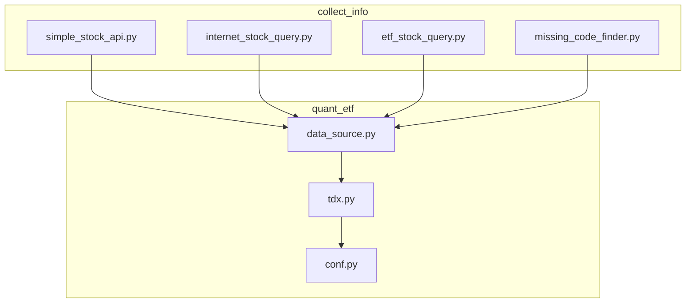
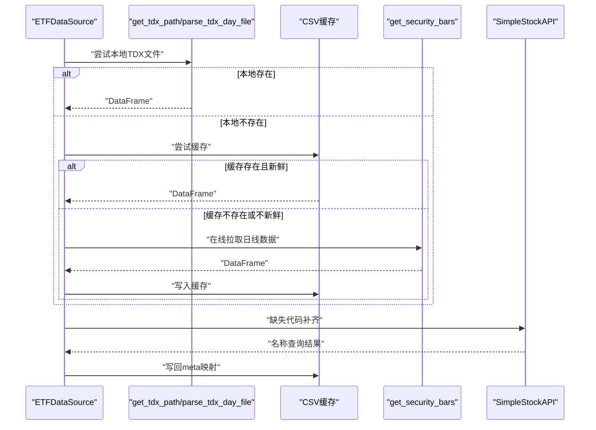
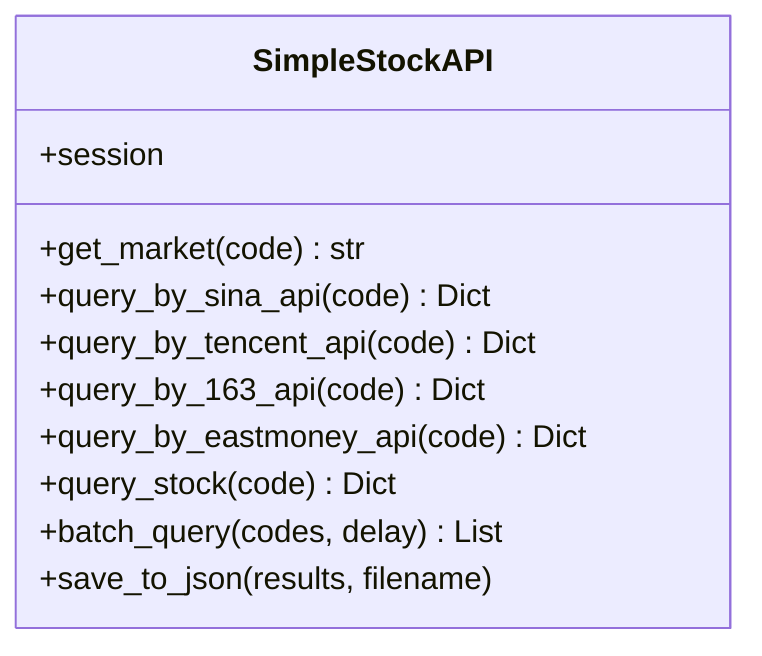
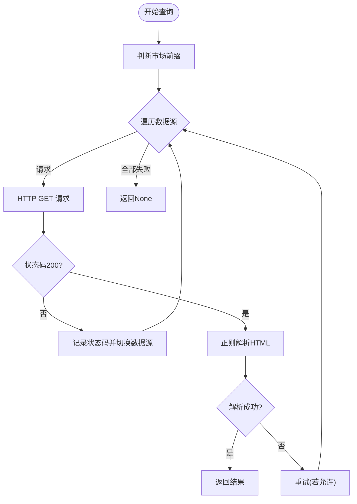
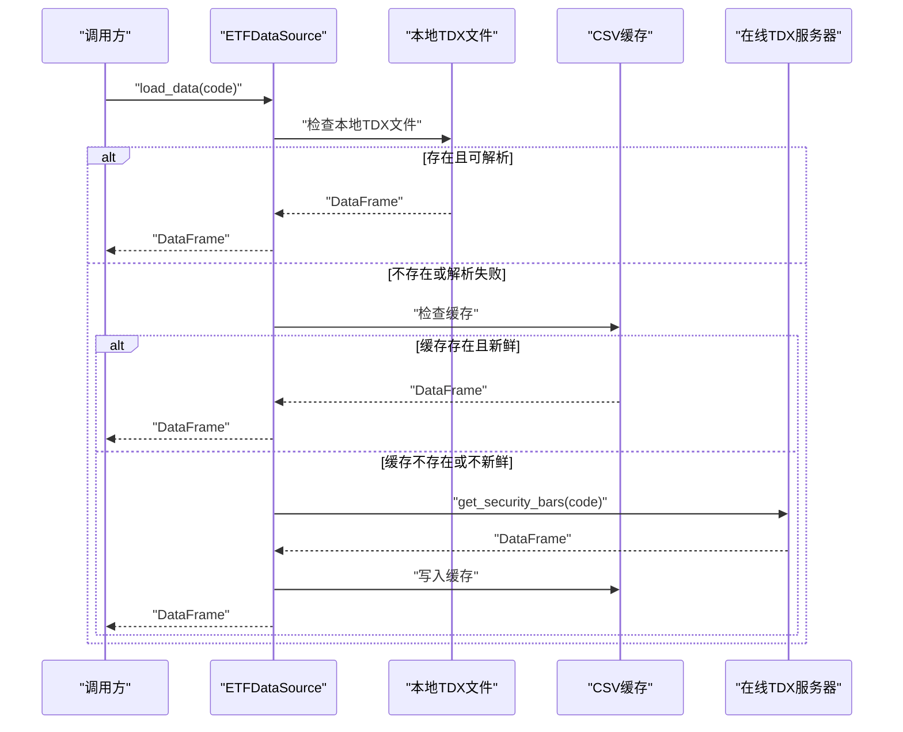
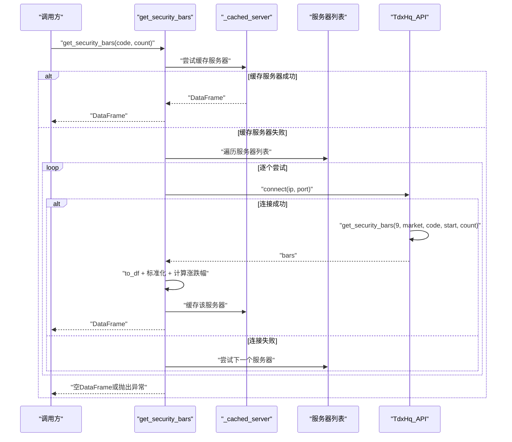
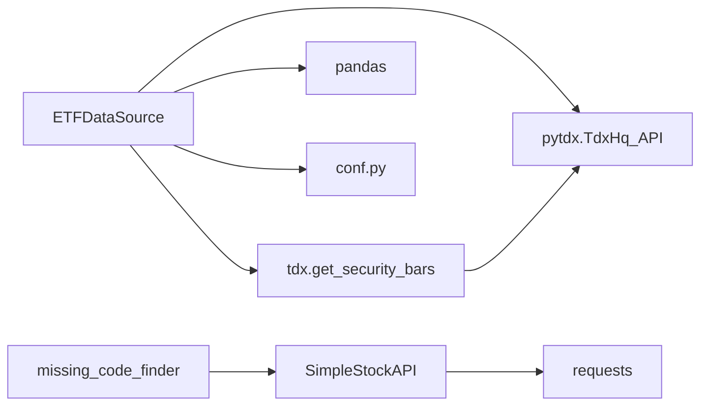

# 在线数据获取

<cite>
**本文引用的文件**
- [simple_stock_api.py](file://src/collect_info/simple_stock_api.py)
- [internet_stock_query.py](file://src/collect_info/internet_stock_query.py)
- [etf_stock_query.py](file://src/collect_info/etf_stock_query.py)
- [data_source.py](file://src/quant_etf/data_source.py)
- [tdx.py](file://src/quant_etf/tdx.py)
- [conf.py](file://src/quant_etf/conf.py)
- [missing_code_finder.py](file://src/collect_info/missing_code_finder.py)
</cite>

## 更新摘要
**变更内容**
- 删除了 `accurate_stock_database.py` 文件的相关内容，因为该文件已被移除
- 更新了数据源整合和简化的说明
- 调整了架构图和依赖关系分析，移除了不再存在的组件
- 更新了故障排查指南，反映了数据源整合后的实际情况

## 目录
1. [简介](#简介)
2. [项目结构](#项目结构)
3. [核心组件](#核心组件)
4. [架构总览](#架构总览)
5. [详细组件分析](#详细组件分析)
6. [依赖关系分析](#依赖关系分析)
7. [性能考量](#性能考量)
8. [故障排查指南](#故障排查指南)
9. [结论](#结论)
10. [附录](#附录)

## 简介
本文件面向Quant-ETF项目的在线数据获取体系，重点围绕以下目标展开：
- 全面解释SimpleStockAPI类的实现原理与接口设计，包括批量查询、延迟控制与错误重试机制
- 详解internet_stock_query模块的数据抓取策略与网络请求处理
- 解释get_security_bars函数的在线数据拉取流程，涵盖API调用、响应解析与数据标准化
- 提供网络异常处理、超时控制与并发限制的实现细节
- 说明数据缓存策略与离线降级方案
- 对比TDX数据与在线数据的差异，给出数据一致性保障机制
- 为开发者提供在线数据源扩展与自定义API集成的实践指导

## 项目结构
在线数据获取相关的核心文件分布如下：
- 在线股票名称查询与ETF专用查询：collect_info目录下的simple_stock_api.py、internet_stock_query.py、etf_stock_query.py
- 在线TDX数据拉取与缓存策略：quant_etf目录下的data_source.py、tdx.py、conf.py
- 缺失代码补齐工具：collect_info/missing_code_finder.py

**更新** 移除了已删除的 `accurate_stock_database.py` 文件引用

图表来源
- [simple_stock_api.py:14-315](file://src/collect_info/simple_stock_api.py#L14-L315)
- [internet_stock_query.py:24-536](file://src/collect_info/internet_stock_query.py#L24-L536)
- [etf_stock_query.py:15-381](file://src/collect_info/etf_stock_query.py#L15-L381)
- [data_source.py:15-543](file://src/quant_etf/data_source.py#L15-L543)
- [tdx.py:1-546](file://src/quant_etf/tdx.py#L1-L546)
- [conf.py:1-137](file://src/quant_etf/conf.py#L1-L137)

章节来源
- [simple_stock_api.py:1-315](file://src/collect_info/simple_stock_api.py#L1-L315)
- [internet_stock_query.py:1-536](file://src/collect_info/internet_stock_query.py#L1-L536)
- [etf_stock_query.py:1-381](file://src/collect_info/etf_stock_query.py#L1-L381)
- [data_source.py:1-543](file://src/quant_etf/data_source.py#L1-L543)
- [tdx.py:1-546](file://src/quant_etf/tdx.py#L1-L546)
- [conf.py:1-137](file://src/quant_etf/conf.py#L1-L137)

## 核心组件
- SimpleStockAPI：提供多源API的股票名称查询能力，支持批量查询与延迟控制，内置基础重试与容错
- StockQuery：基于网页爬虫的股票名称查询器，支持多数据源、正则解析与重试机制
- ETFQuery：ETF专用查询器，优先API查询，失败后回退网页解析
- ETFDataSource：统一数据源管理器，负责TDX本地文件、缓存与在线数据的优先级加载与一致性校验
- get_security_bars：在线TDX日线数据拉取核心函数，支持多服务器探测、连接复用与数据标准化

**更新** 数据源整合后，移除了 `accurate_stock_database` 组件的引用

章节来源
- [simple_stock_api.py:14-315](file://src/collect_info/simple_stock_api.py#L14-L315)
- [internet_stock_query.py:24-536](file://src/collect_info/internet_stock_query.py#L24-L536)
- [etf_stock_query.py:15-381](file://src/collect_info/etf_stock_query.py#L15-L381)
- [data_source.py:15-543](file://src/quant_etf/data_source.py#L15-L543)
- [tdx.py:237-340](file://src/quant_etf/tdx.py#L237-L340)

## 架构总览
在线数据获取的整体流程如下：
- 名称数据：优先从本地meta映射文件加载；若缺失，通过SimpleStockAPI批量补齐；最终写回meta文件
- 日线数据：优先从本地TDX day文件加载；若缺失，从缓存加载；若仍缺失，通过get_security_bars在线拉取并落盘缓存

**更新** 移除了 `accurate_stock_database` 的参与，简化了数据源整合流程

图表来源
- [data_source.py:189-246](file://src/quant_etf/data_source.py#L189-L246)
- [tdx.py:211-234](file://src/quant_etf/tdx.py#L211-L234)
- [tdx.py:343-376](file://src/quant_etf/tdx.py#L343-L376)
- [simple_stock_api.py:167-197](file://src/collect_info/simple_stock_api.py#L167-L197)

## 详细组件分析

### SimpleStockAPI 类分析
- 设计要点
  - 多源API聚合：依次尝试新浪财经、腾讯财经、网易、东方财富等API，提升成功率
  - 市场识别：根据代码前缀判断市场（上海/深圳），构造对应URL
  - 响应解析：针对不同API返回格式进行解析，抽取名称与市场字段
  - 批量查询：支持延迟控制与失败兜底，返回统一结构的结果列表
  - 容错与日志：捕获异常并打印错误信息，便于定位问题

- 关键方法与行为
  - get_market：根据代码前缀返回市场标识
  - query_by_sina_api/query_by_tencent_api/query_by_163_api/query_by_eastmoney_api：分别对接不同API，解析响应并返回标准化字典
  - query_stock：按顺序尝试各API，遇到首个成功即返回；每次尝试间加入短延迟，避免触发风控
  - batch_query：遍历代码列表，逐个查询并汇总结果；支持自定义查询间隔
  - save_to_json：将结果序列化保存至JSON文件

- 并发与限速
  - 单实例内使用requests.Session维持连接，减少握手开销
  - 查询间隔通过time.sleep控制，避免请求过快被封禁
  - 单线程批处理，无显式并发限制

- 错误处理
  - 每个API调用包裹异常捕获，失败时记录错误并继续下一个API
  - 批量查询中对失败项补充错误标记，便于后续重试或人工核对

图表来源
- [simple_stock_api.py:14-315](file://src/collect_info/simple_stock_api.py#L14-L315)

章节来源
- [simple_stock_api.py:14-315](file://src/collect_info/simple_stock_api.py#L14-L315)

### internet_stock_query 模块分析
- 设计要点
  - 多数据源策略：支持东方财富、新浪财经、腾讯财经、网易、雪球等站点
  - 正则解析：针对不同站点HTML结构采用正则匹配提取名称，增强鲁棒性
  - 重试机制：每个数据源最多尝试指定次数，失败后短暂休眠再切换下一个数据源
  - 日志系统：使用标准logging模块记录调试与错误信息，便于运维与排障

- 关键方法与行为
  - get_market_prefix：根据代码前缀判断市场前缀（sh/sz）
  - _parse_*：各站点解析器，优先从title提取，其次尝试多种标签与JSON字段
  - query_stock_name：按顺序尝试各数据源，解析成功即返回；失败记录并继续
  - batch_query：批量查询，支持自定义查询间隔；对失败项补充错误字段
  - save_results/print_results：结果持久化与可视化输出

- 网络与超时
  - requests.get设置timeout参数，避免长时间阻塞
  - 允许重定向，提高访问成功率
  - 每次重试前短暂sleep，降低请求频率

- 错误处理
  - 捕获RequestException与解析异常，记录错误并继续尝试
  - 对无法解析的站点返回None，不影响整体流程

图表来源
- [internet_stock_query.py:273-336](file://src/collect_info/internet_stock_query.py#L273-L336)

章节来源
- [internet_stock_query.py:24-536](file://src/collect_info/internet_stock_query.py#L24-L536)

### ETFQuery 类分析
- 设计要点
  - ETF专用：针对ETF代码特征（如51/58/159/56开头）优化市场判断与解析
  - 双通道策略：优先API查询（新浪/腾讯），失败后再回退网页解析
  - 结果标准化：统一返回包含code/name/market/source/type/url等字段

- 关键方法与行为
  - is_etf_code：判断是否为ETF代码
  - get_etf_market：根据ETF代码前缀判断市场
  - _parse_*：ETF专用解析器，适配ETF页面结构
  - query_etf_by_api：尝试新浪/腾讯API获取名称
  - query_etf：API失败时回退网页解析；失败项补充错误标记
  - batch_query_etfs：批量查询，带延迟与统计输出

章节来源
- [etf_stock_query.py:15-381](file://src/collect_info/etf_stock_query.py#L15-L381)

### ETFDataSource 类分析
- 设计要点
  - 三段式加载策略：本地TDX文件 → 缓存 → 在线TDX服务器
  - 缓存一致性：check_is_fresh根据交易日与时点判断数据新鲜度
  - 原子写入：缓存文件采用临时文件写入后替换，避免半写损坏
  - 名称映射：支持ETF与股票名称映射的加载与补齐

- 关键方法与行为
  - get_etf_name_map/get_stock_name_map：从data/meta/stock_code_name.json加载名称映射
  - _load_cached_name_map/_save_cached_name_map：缓存名称映射，带时间戳与原子写入
  - get_cache_path/get_stock_cache_path：生成CSV缓存路径，支持旧路径迁移
  - check_is_fresh：基于交易日与时点的"新鲜度"判定
  - load_data/load_stock_data：按优先级加载数据，失败时抛出异常
  - backfill_stock_names：基于SimpleStockAPI补齐缺失代码名称并写回meta

**更新** 数据源整合后，移除了对 `accurate_stock_database` 的依赖

图表来源
- [data_source.py:189-246](file://src/quant_etf/data_source.py#L189-L246)

章节来源
- [data_source.py:15-543](file://src/quant_etf/data_source.py#L15-L543)

### get_security_bars 函数分析
- 设计要点
  - 多服务器探测：优先尝试缓存的工作服务器，失败后遍历自定义与默认服务器列表
  - 连接复用：pytdx.TdxHq_API连接后复用，减少握手成本
  - 数据标准化：统一列名与索引，计算涨跌幅，确保与本地解析一致
  - 异常隔离：单服务器失败不中断整体流程，自动切换下一服务器

- 关键流程
  - code_to_market：根据代码判断市场（0=深圳，1=上海）
  - _try_connect_and_fetch：建立连接、获取bars、转换为DataFrame、标准化列名
  - get_security_bars：缓存服务器优先，随后遍历服务器列表，成功后缓存该服务器
  - parse_tdx_day_file：解析本地TDX day文件，与在线数据格式保持一致

图表来源
- [tdx.py:237-298](file://src/quant_etf/tdx.py#L237-L298)
- [tdx.py:343-376](file://src/quant_etf/tdx.py#L343-L376)

章节来源
- [tdx.py:237-298](file://src/quant_etf/tdx.py#L237-L298)
- [tdx.py:343-376](file://src/quant_etf/tdx.py#L343-L376)

## 依赖关系分析
- SimpleStockAPI依赖requests库进行HTTP请求，内部使用Session复用连接
- ETFDataSource依赖pytdx进行在线TDX数据拉取，并依赖pandas进行数据处理
- 数据源配置来自conf.py中的ETF_POOL、STOCK_POOL、MID_TERM_STOCK_POOL与TDX路径
- 名称映射与补齐工具通过missing_code_finder与simple_stock_api协作

**更新** 移除了对 `accurate_stock_database` 的依赖关系

图表来源
- [simple_stock_api.py:8-24](file://src/collect_info/simple_stock_api.py#L8-L24)
- [data_source.py:1-10](file://src/quant_etf/data_source.py#L1-L10)
- [tdx.py:1-9](file://src/quant_etf/tdx.py#L1-L9)
- [conf.py:1-137](file://src/quant_etf/conf.py#L1-L137)
- [missing_code_finder.py:17-17](file://src/collect_info/missing_code_finder.py#L17-L17)

章节来源
- [simple_stock_api.py:8-24](file://src/collect_info/simple_stock_api.py#L8-L24)
- [data_source.py:1-10](file://src/quant_etf/data_source.py#L1-L10)
- [tdx.py:1-9](file://src/quant_etf/tdx.py#L1-L9)
- [conf.py:1-137](file://src/quant_etf/conf.py#L1-L137)
- [missing_code_finder.py:17-17](file://src/collect_info/missing_code_finder.py#L17-L17)

## 性能考量
- 请求节流
  - SimpleStockAPI与internet_stock_query在每次API/站点尝试后加入短暂sleep，避免触发风控
  - ETFQuery在API失败回退网页解析时也采用sleep，降低请求压力
- 连接复用
  - SimpleStockAPI使用requests.Session，减少TCP握手与TLS开销
  - ETFDataSource与get_security_bars使用pytdx的API对象复用连接
- 缓存策略
  - ETFDataSource对名称映射与日线数据进行缓存，显著降低重复请求
  - 原子写入避免缓存损坏导致的IO异常
- 新鲜度判定
  - check_is_fresh结合交易日与时点，避免在非交易时段频繁拉取

## 故障排查指南
- 网络异常
  - 检查timeout设置与重试次数，适当增大以应对网络波动
  - 观察日志输出，定位失败的站点或API
- 服务器不可达
  - get_security_bars会自动切换服务器；若全部失败，检查TDX服务器列表与防火墙
- 数据不新鲜
  - 使用check_is_fresh确认数据是否满足业务需求；必要时关闭新鲜度检查或手动更新
- 缓存损坏
  - 删除缓存文件后重试；确认原子写入流程未被中断
- 名称映射缺失
  - 使用backfill_stock_names通过SimpleStockAPI补齐缺失代码名称

**更新** 移除了与 `accurate_stock_database` 相关的故障排查内容

章节来源
- [data_source.py:151-187](file://src/quant_etf/data_source.py#L151-L187)
- [data_source.py:303-371](file://src/quant_etf/data_source.py#L303-L371)
- [tdx.py:259-296](file://src/quant_etf/tdx.py#L259-L296)

## 结论
本系统通过"本地TDX文件 → 缓存 → 在线TDX服务器"的三层优先级策略，结合多数据源名称查询与严格的缓存与新鲜度控制，实现了稳定可靠的在线数据获取能力。SimpleStockAPI与internet_stock_query提供了灵活的名称补全手段，而get_security_bars则保证了日线数据的高效与一致。数据源整合后，系统结构更加简洁，维护成本更低。开发者可在现有框架基础上扩展新的数据源或API，遵循统一的接口规范与缓存策略即可无缝集成。

**更新** 数据源整合简化了系统架构，提高了维护效率

## 附录

### 在线数据源扩展与自定义API集成指南
- 扩展步骤
  - 在ETFDataSource中新增数据源加载逻辑，或在SimpleStockAPI中添加新的query_by_*方法
  - 确保返回结构与现有字段一致（code/name/market/source/type/url等）
  - 为新API实现超时与重试控制，必要时增加sleep间隔
  - 将新数据源纳入批量查询流程，并在失败时补充错误标记
  - 更新缓存策略：若新数据源稳定性高，可考虑优先缓存或缩短缓存周期
- 集成注意事项
  - 保持与现有解析器一致的异常处理风格
  - 遵循交易日与时点的新鲜度判定规则
  - 对关键路径的日志输出进行规范化，便于运维监控

**更新** 移除了与 `accurate_stock_database` 相关的扩展指导