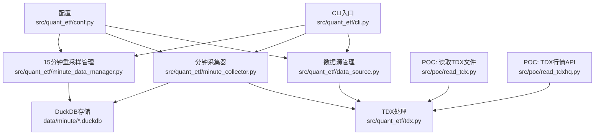
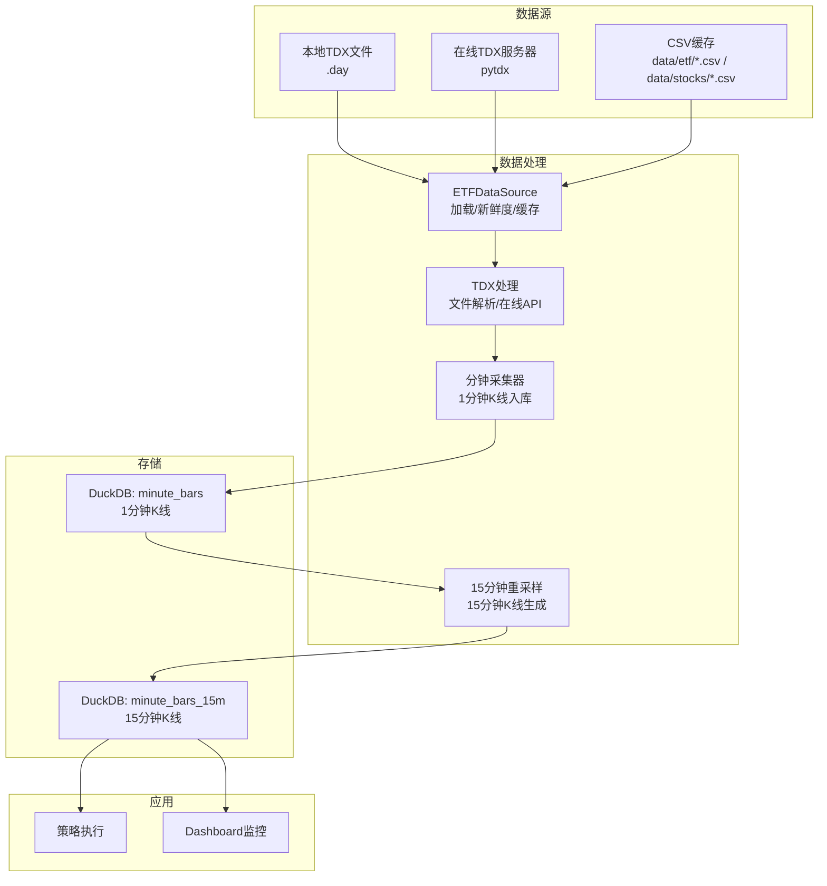
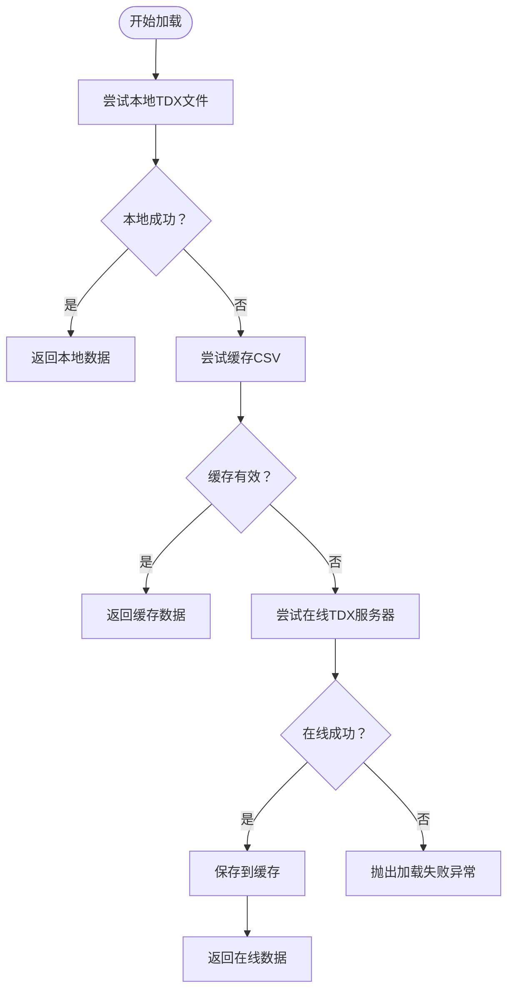
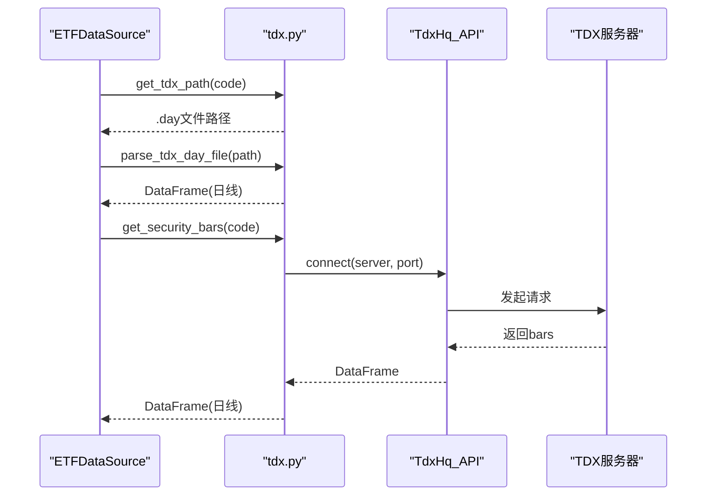
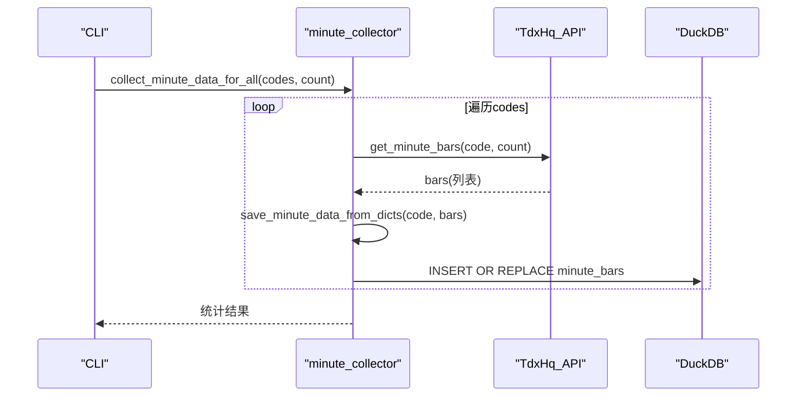
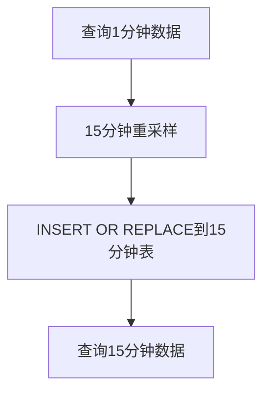
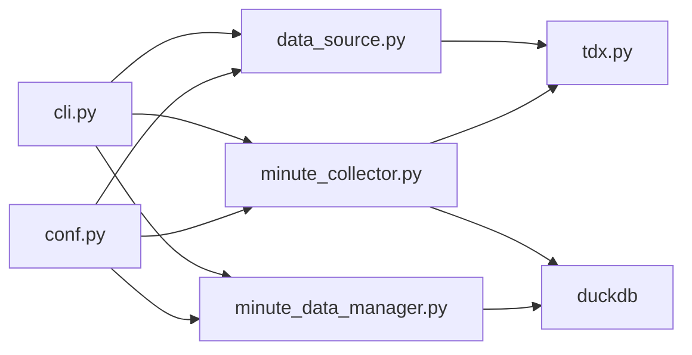

# 数据处理系统

<cite>
**本文引用的文件**
- [README.md](file://README.md)
- [pyproject.toml](file://pyproject.toml)
- [src/quant_etf/cli.py](file://src/quant_etf/cli.py)
- [src/quant_etf/conf.py](file://src/quant_etf/conf.py)
- [src/quant_etf/data_source.py](file://src/quant_etf/data_source.py)
- [src/quant_etf/tdx.py](file://src/quant_etf/tdx.py)
- [src/quant_etf/minute_collector.py](file://src/quant_etf/minute_collector.py)
- [src/quant_etf/minute_data_manager.py](file://src/quant_etf/minute_data_manager.py)
- [src/quant_etf/init_15min_data.py](file://src/quant_etf/init_15min_data.py)
- [src/poc/read_tdx.py](file://src/poc/read_tdx.py)
- [src/poc/read_tdxhq.py](file://src/poc/read_tdxhq.py)
</cite>

## 目录
1. [简介](#简介)
2. [项目结构](#项目结构)
3. [核心组件](#核心组件)
4. [架构总览](#架构总览)
5. [详细组件分析](#详细组件分析)
6. [依赖分析](#依赖分析)
7. [性能考量](#性能考量)
8. [故障排查指南](#故障排查指南)
9. [结论](#结论)
10. [附录](#附录)

## 简介
本文件面向Quant-ETF的数据处理系统，聚焦于数据源管理、TDX数据集成、在线数据获取、数据缓存策略、分钟级K线采集与重采样、数据预处理与清洗、数据一致性与异常处理，以及为数据分析师提供的查询与分析最佳实践。系统采用统一CLI入口，支持本地TDX文件、在线TDX服务器与缓存的多级数据来源，结合DuckDB进行分钟级与15分钟K线的高效存储与查询，并通过Dashboard提供可视化监控与SSE实时推送。

## 项目结构
系统围绕“数据源管理”“TDX处理”“分钟级采集”“15分钟重采样”“配置与CLI”展开，核心模块如下：
- 数据源管理：负责本地TDX文件、缓存与在线TDX服务器的统一加载与新鲜度校验
- TDX处理：封装TDX文件解析与在线行情API调用，提供日线与分钟线获取
- 分钟级采集：在交易时段内持续采集ALL_POOL标的的1分钟K线，写入DuckDB
- 15分钟重采样：基于1分钟数据生成15分钟K线，支持增量更新
- 配置与CLI：集中管理数据目录、股票池、TDX路径与命令行入口
- POC：演示TDX文件读取与TDX行情API使用

**图示来源**
- [src/quant_etf/cli.py](file://src/quant_etf/cli.py)
- [src/quant_etf/data_source.py](file://src/quant_etf/data_source.py)
- [src/quant_etf/tdx.py](file://src/quant_etf/tdx.py)
- [src/quant_etf/minute_collector.py](file://src/quant_etf/minute_collector.py)
- [src/quant_etf/minute_data_manager.py](file://src/quant_etf/minute_data_manager.py)
- [src/quant_etf/conf.py](file://src/quant_etf/conf.py)
- [src/poc/read_tdx.py](file://src/poc/read_tdx.py)
- [src/poc/read_tdxhq.py](file://src/poc/read_tdxhq.py)

**章节来源**
- [README.md](file://README.md)
- [src/quant_etf/cli.py](file://src/quant_etf/cli.py)
- [src/quant_etf/conf.py](file://src/quant_etf/conf.py)

## 核心组件
- 数据源管理（ETFDataSource）
  - 本地TDX文件优先：通过TDX路径定位与解析
  - 缓存优先：CSV缓存文件，带时间戳与原子写入
  - 在线回退：pytdx在线获取日线数据
  - 名称映射：ETF/股票名称缓存与补齐
  - 新鲜度校验：根据工作日与时段判断数据是否新鲜
- TDX处理（tdx.py）
  - TDX文件解析：使用pytdx Reader读取.vipdoc/lday/*.day
  - 在线行情API：自动选择可用服务器，支持心跳与重试
  - 市场识别：根据代码前缀判断市场（上海/深圳）
- 分钟级采集（minute_collector.py）
  - 交易时间判断与等待：支持早盘与午盘
  - 服务器冷却：失败服务器冷却，避免频繁重试
  - DuckDB存储：1分钟K线表结构与索引，INSERT OR REPLACE
- 15分钟重采样（minute_data_manager.py）
  - 重采样：1分钟resample到15分钟，聚合OHLCV
  - 增量更新：基于最新15分钟时间点进行局部重算
  - 查询接口：SQL查询与DataFrame返回
- 配置（conf.py）
  - 数据目录、日志目录、股票池（ETF/股票/中线）、TDX路径
  - MOMENTUM权重与TOP_N等策略参数
- CLI（cli.py）
  - 统一命令入口：daily-run、dashboard、minute-collect、backfill、run、list-tasks、check、backfill-stock-names
  - 与各模块解耦，通过任务注册与调度实现功能编排

**章节来源**
- [src/quant_etf/data_source.py](file://src/quant_etf/data_source.py)
- [src/quant_etf/tdx.py](file://src/quant_etf/tdx.py)
- [src/quant_etf/minute_collector.py](file://src/quant_etf/minute_collector.py)
- [src/quant_etf/minute_data_manager.py](file://src/quant_etf/minute_data_manager.py)
- [src/quant_etf/conf.py](file://src/quant_etf/conf.py)
- [src/quant_etf/cli.py](file://src/quant_etf/cli.py)

## 架构总览
系统数据流从TDX（本地文件/在线）进入，经分钟采集器写入DuckDB，再由15分钟重采样生成15分钟K线，供策略与Dashboard使用；同时提供名称映射与缓存补齐能力。

**图示来源**
- [src/quant_etf/data_source.py](file://src/quant_etf/data_source.py)
- [src/quant_etf/tdx.py](file://src/quant_etf/tdx.py)
- [src/quant_etf/minute_collector.py](file://src/quant_etf/minute_collector.py)
- [src/quant_etf/minute_data_manager.py](file://src/quant_etf/minute_data_manager.py)
- [README.md](file://README.md)

## 详细组件分析

### 数据源管理（ETFDataSource）
- 加载策略
  - 本地TDX文件优先：get_tdx_path定位.vipdoc/lday/*.day，parse_tdx_day_file解析
  - 缓存优先：CSV缓存文件，check_is_fresh判断新鲜度
  - 在线回退：get_security_bars获取日线，保存至缓存
- 名称映射
  - data/meta/stock_code_name.json加载与缓存，支持补齐缺失名称
- 异常与回退
  - 任一阶段失败均记录错误并继续下一来源
- 接口要点
  - load_data/load_stock_data：统一入口，支持allow_online开关
  - backfill_stock_names：批量补齐缺失名称并去重

**图示来源**
- [src/quant_etf/data_source.py](file://src/quant_etf/data_source.py)

**章节来源**
- [src/quant_etf/data_source.py](file://src/quant_etf/data_source.py)

### TDX处理（tdx.py）
- 文件解析
  - TdxDailyBarReader读取.vipdoc/lday/*.day，转换为标准列并计算涨跌幅
- 在线API
  - TdxHq_API自动选择服务器，category=9获取日线，category=8获取1分钟线
  - 自定义服务器列表与默认服务器回退
- 市场识别
  - 依据代码前缀判断市场（上海/深圳）

**图示来源**
- [src/quant_etf/tdx.py](file://src/quant_etf/tdx.py)
- [src/quant_etf/data_source.py](file://src/quant_etf/data_source.py)

**章节来源**
- [src/quant_etf/tdx.py](file://src/quant_etf/tdx.py)

### 分钟级采集器（minute_collector.py）
- 交易时间判定
  - 9:30-11:30、13:00-15:00为交易时段
- 服务器冷却
  - 失败服务器进入冷却窗口，避免频繁重试
- 数据入库
  - INSERT OR REPLACE写入DuckDB表minute_bars，包含年月日时分字段便于查询
- 查询与批量采集
  - 提供SQL查询与批量采集接口，支持ALL_POOL

**图示来源**
- [src/quant_etf/minute_collector.py](file://src/quant_etf/minute_collector.py)
- [src/quant_etf/cli.py](file://src/quant_etf/cli.py)

**章节来源**
- [src/quant_etf/minute_collector.py](file://src/quant_etf/minute_collector.py)

### 15分钟重采样（minute_data_manager.py）
- 重采样策略
  - 1分钟数据按15分钟窗口聚合：开高收用首/最大/最小/末，成交量与成交额求和
- 增量更新
  - 基于最新15分钟时间点，仅重采样最近一天范围内的1分钟数据
- 查询接口
  - 支持SQL查询与按代码/时间范围查询

**图示来源**
- [src/quant_etf/minute_data_manager.py](file://src/quant_etf/minute_data_manager.py)

**章节来源**
- [src/quant_etf/minute_data_manager.py](file://src/quant_etf/minute_data_manager.py)

### 配置与CLI
- 配置
  - DATA_DIR、LOG_DIR、ETF_POOL、ALL_POOL、TDX_DIR/TDX_VIPDOC_DIR、MOMENTUM_WEIGHTS、TOP_N等
- CLI
  - daily-run、dashboard、minute-collect、backfill、run、list-tasks、check、backfill-stock-names
  - 与各模块解耦，通过任务注册与调度实现功能编排

**章节来源**
- [src/quant_etf/conf.py](file://src/quant_etf/conf.py)
- [src/quant_etf/cli.py](file://src/quant_etf/cli.py)

### POC演示
- 读取TDX文件：使用TdxDailyBarReader读取.vipdoc/lday/*.day
- TDX行情API：连接服务器获取实时报价与K线

**章节来源**
- [src/poc/read_tdx.py](file://src/poc/read_tdx.py)
- [src/poc/read_tdxhq.py](file://src/poc/read_tdxhq.py)

## 依赖分析
- 外部依赖
  - pytdx：TDX文件解析与在线行情API
  - duckdb：分钟与15分钟K线存储
  - fastapi/uvicorn：Dashboard服务
  - pandas/numpy/scipy：数据处理与统计
  - loguru：日志
- 内部模块耦合
  - data_source依赖tdx进行文件解析与在线获取
  - minute_collector依赖tdx进行在线分钟线获取，并写入duckdb
  - minute_data_manager依赖minute_collector的1分钟数据与duckdb
  - CLI作为统一入口，调度各模块

**图示来源**
- [src/quant_etf/data_source.py](file://src/quant_etf/data_source.py)
- [src/quant_etf/tdx.py](file://src/quant_etf/tdx.py)
- [src/quant_etf/minute_collector.py](file://src/quant_etf/minute_collector.py)
- [src/quant_etf/minute_data_manager.py](file://src/quant_etf/minute_data_manager.py)
- [src/quant_etf/cli.py](file://src/quant_etf/cli.py)
- [src/quant_etf/conf.py](file://src/quant_etf/conf.py)

**章节来源**
- [pyproject.toml](file://pyproject.toml)
- [src/quant_etf/data_source.py](file://src/quant_etf/data_source.py)
- [src/quant_etf/tdx.py](file://src/quant_etf/tdx.py)
- [src/quant_etf/minute_collector.py](file://src/quant_etf/minute_collector.py)
- [src/quant_etf/minute_data_manager.py](file://src/quant_etf/minute_data_manager.py)
- [src/quant_etf/cli.py](file://src/quant_etf/cli.py)
- [src/quant_etf/conf.py](file://src/quant_etf/conf.py)

## 性能考量
- 服务器选择与冷却
  - 自动尝试多个服务器，失败进入冷却窗口，减少无效重试
- DuckDB索引与查询
  - minute_bars与minute_bars_15m均建立code+time复合索引，提升时间序列查询性能
- 重采样优化
  - 增量重采样仅处理最近一天，避免全量重算
- 批量写入
  - INSERT OR REPLACE批量写入，减少事务开销

[本节为通用性能建议，不直接分析具体文件]

## 故障排查指南
- TDX数据加载失败
  - 检查本地.vipdoc/lday/*.day是否存在与可读
  - 确认TDX_DIR/TDX_VIPDOC_DIR配置正确
  - 在线获取失败时检查网络与pytdx安装
- 分钟采集异常
  - 交易时间外会等待，确认is_trading_time与wait_until_trading_start逻辑
  - 服务器冷却窗口导致失败，稍后再试
- 15分钟重采样为空
  - 确认1分钟数据已入库，且存在对应标的
  - 检查增量更新逻辑是否覆盖到最新时间点
- Dashboard健康检查
  - 使用CLI命令检查各页面路由返回状态

**章节来源**
- [src/quant_etf/data_source.py](file://src/quant_etf/data_source.py)
- [src/quant_etf/tdx.py](file://src/quant_etf/tdx.py)
- [src/quant_etf/minute_collector.py](file://src/quant_etf/minute_collector.py)
- [src/quant_etf/minute_data_manager.py](file://src/quant_etf/minute_data_manager.py)
- [src/quant_etf/cli.py](file://src/quant_etf/cli.py)

## 结论
本系统通过“本地TDX文件优先、缓存兜底、在线回退”的多级数据源策略，结合DuckDB的高性能存储与15分钟重采样，实现了ETF与股票数据的稳定采集与高效分析。CLI统一入口与模块化设计便于扩展与维护。建议在生产环境中配合监控与告警，确保数据新鲜度与系统稳定性。

[本节为总结性内容，不直接分析具体文件]

## 附录

### 数据源扩展接口规范与新数据源集成指南
- 接口规范
  - 统一加载接口：load_data(code, force_update=False, check_freshness=True, allow_online=True) -> DataFrame
  - 名称映射接口：get_etf_name_map()/get_stock_name_map() -> dict[str, str]
  - 缓存路径接口：get_cache_path(code)/get_stock_cache_path(code) -> Path
  - 新鲜度校验：check_is_fresh(df) -> bool
- 集成步骤
  - 实现新的数据源类，遵循上述接口
  - 在ETFDataSource中增加新数据源优先级判断
  - 若需缓存，提供缓存文件路径与写入逻辑
  - 在CLI中注册新命令或复用现有命令进行测试
- 注意事项
  - 保持列名与数据类型一致（date/index、open/high/low/close/volume/amount/pct_chg）
  - 实现异常处理与日志记录
  - 提供单元测试与集成测试

**章节来源**
- [src/quant_etf/data_source.py](file://src/quant_etf/data_source.py)

### 数据预处理、清洗与验证方法
- 预处理
  - 标准化列名与索引（datetime/date -> date，volume/amount）
  - 计算涨跌幅pct_chg
- 清洗
  - 缺失值填充：pct_chg使用0填充
  - 重复与异常值：按时间排序，去重
- 验证
  - 新鲜度校验：check_is_fresh(df)
  - 列完整性：确保open/high/low/close/volume/amount存在
  - 时间连续性：1分钟数据按时间顺序，15分钟按15分钟窗口聚合

**章节来源**
- [src/quant_etf/tdx.py](file://src/quant_etf/tdx.py)
- [src/quant_etf/data_source.py](file://src/quant_etf/data_source.py)

### 数据一致性保证与异常处理机制
- 一致性
  - INSERT OR REPLACE确保同一时间点的覆盖
  - 增量重采样基于最新时间点，避免重复计算
- 异常处理
  - 每个步骤均捕获异常并记录日志，继续下一来源或下一标的
  - 服务器冷却窗口避免雪崩式重试
  - CLI中对键盘中断与异常进行优雅退出

**章节来源**
- [src/quant_etf/minute_collector.py](file://src/quant_etf/minute_collector.py)
- [src/quant_etf/minute_data_manager.py](file://src/quant_etf/minute_data_manager.py)
- [src/quant_etf/cli.py](file://src/quant_etf/cli.py)

### 数据分析师查询与分析最佳实践
- 查询建议
  - 使用SQL直接查询DuckDB表，利用code+time索引
  - 15分钟数据优先用于短期策略分析
  - 通过时间范围限制与LIMIT控制结果规模
- 分析建议
  - 结合pct_chg与成交量进行异常检测
  - 使用rolling窗口计算动量指标
  - 对比不同池（ETF/股票/中线）的收益分布

**章节来源**
- [src/quant_etf/minute_data_manager.py](file://src/quant_etf/minute_data_manager.py)
- [src/quant_etf/minute_collector.py](file://src/quant_etf/minute_collector.py)
- [README.md](file://README.md)