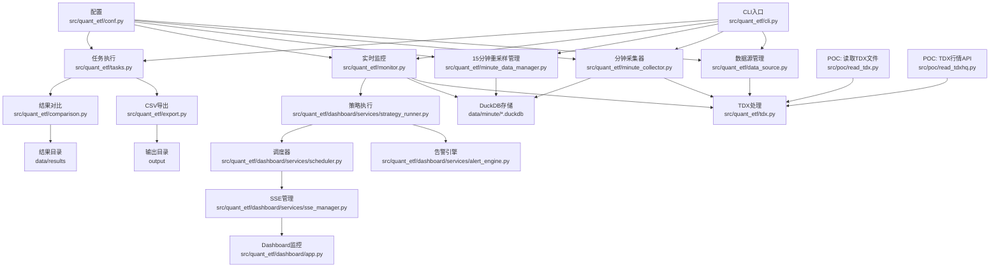
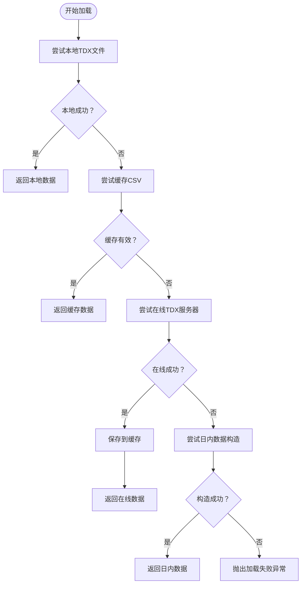
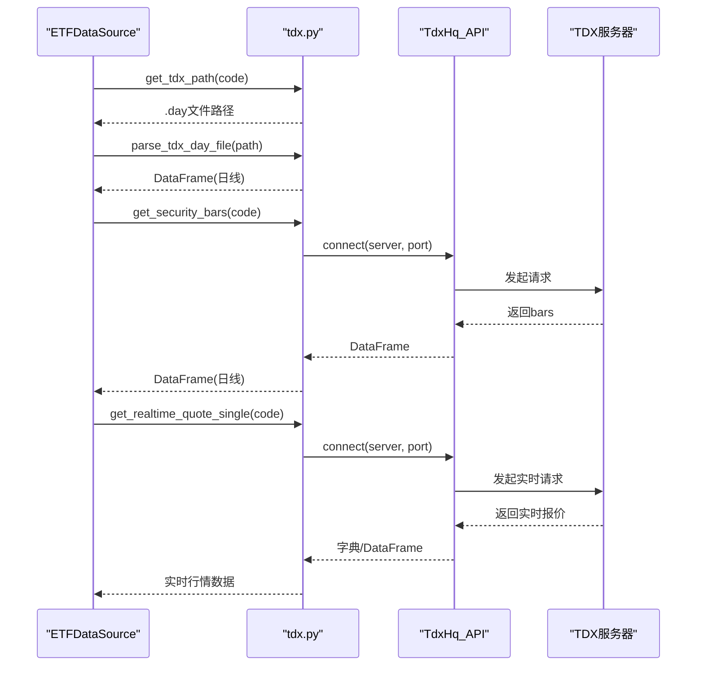
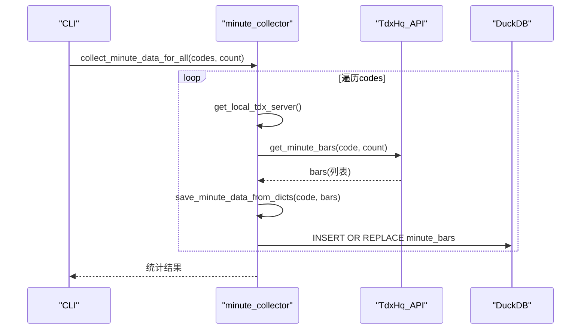
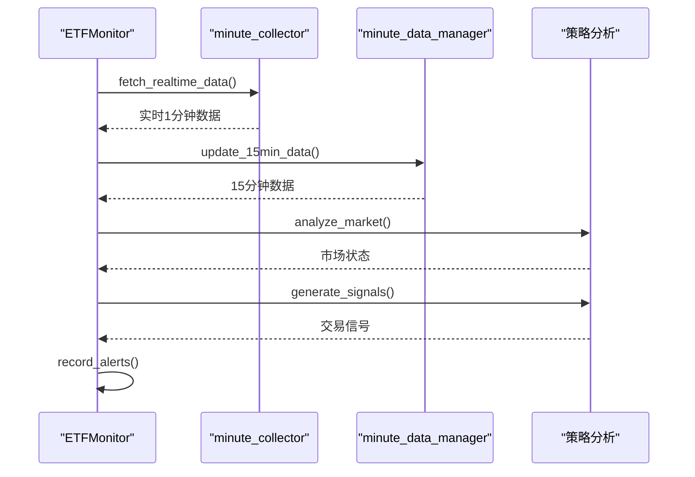
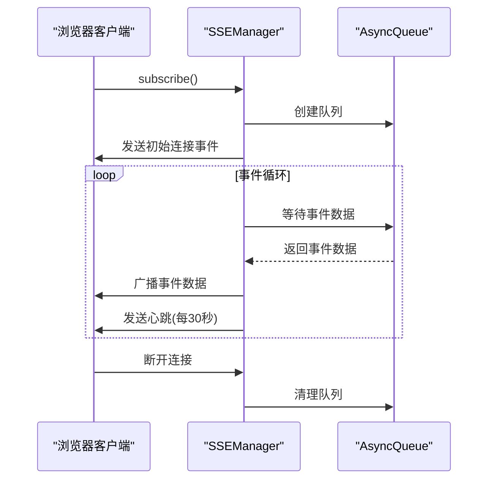
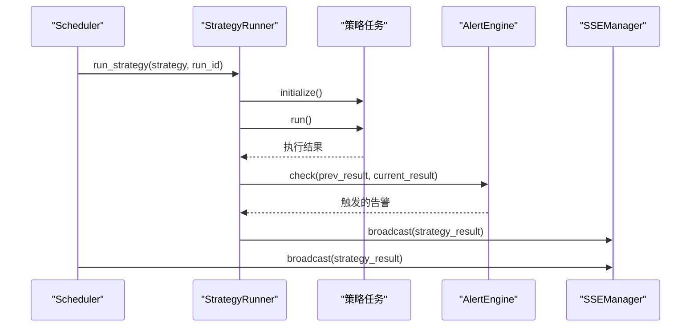
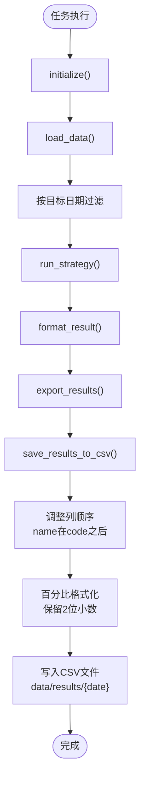
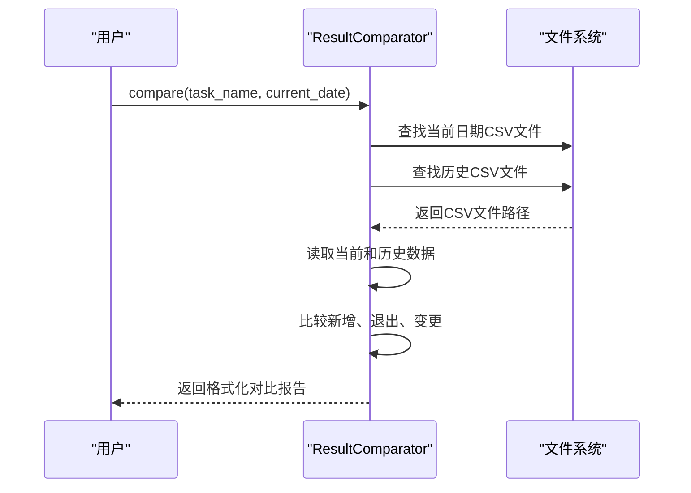
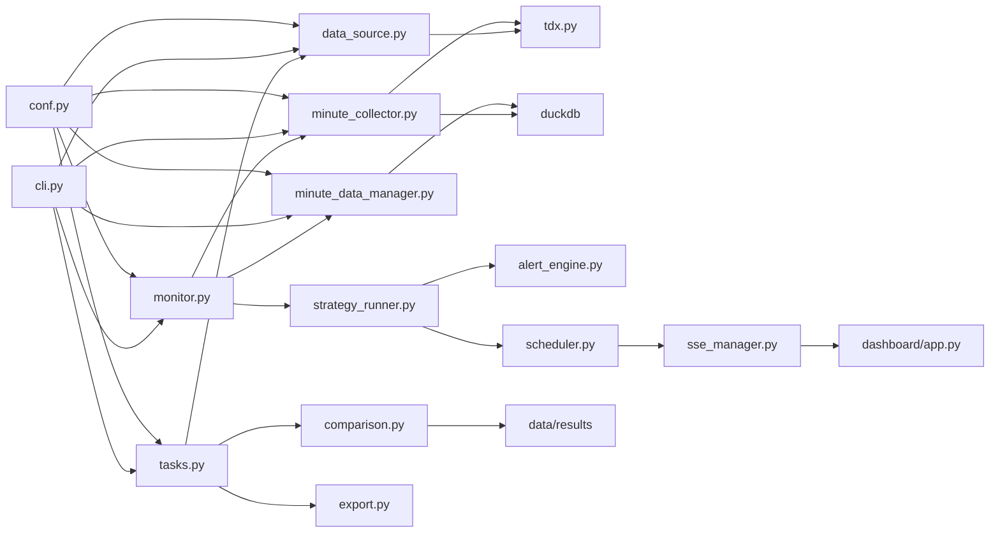

# 数据处理系统

<cite>
**本文引用的文件**
- [README.md](file://README.md)
- [pyproject.toml](file://pyproject.toml)
- [src/quant_etf/cli.py](file://src/quant_etf/cli.py)
- [src/quant_etf/conf.py](file://src/quant_etf/conf.py)
- [src/quant_etf/data_source.py](file://src/quant_etf/data_source.py)
- [src/quant_etf/tdx.py](file://src/quant_etf/tdx.py)
- [src/quant_etf/minute_collector.py](file://src/quant_etf/minute_collector.py)
- [src/quant_etf/minute_data_manager.py](file://src/quant_etf/minute_data_manager.py)
- [src/quant_etf/init_15min_data.py](file://src/quant_etf/init_15min_data.py)
- [src/poc/read_tdx.py](file://src/poc/read_tdx.py)
- [src/poc/read_tdxhq.py](file://src/poc/read_tdxhq.py)
- [src/quant_etf/tasks.py](file://src/quant_etf/tasks.py)
- [src/quant_etf/export.py](file://src/quant_etf/export.py)
- [src/quant_etf/comparison.py](file://src/quant_etf/comparison.py)
- [src/quant_etf/monitor.py](file://src/quant_etf/monitor.py)
- [src/quant_etf/dashboard/services/sse_manager.py](file://src/quant_etf/dashboard/services/sse_manager.py)
- [src/quant_etf/dashboard/services/scheduler.py](file://src/quant_etf/dashboard/services/scheduler.py)
- [src/quant_etf/dashboard/services/strategy_runner.py](file://src/quant_etf/dashboard/services/strategy_runner.py)
- [src/quant_etf/dashboard/services/alert_engine.py](file://src/quant_etf/dashboard/services/alert_engine.py)
- [src/quant_etf/dashboard/app.py](file://src/quant_etf/dashboard/app.py)
- [tests/test_tdx_realtime.py](file://tests/test_tdx_realtime.py)
</cite>

## 更新摘要
**变更内容**
- 新增日内数据获取功能，支持使用实时行情构造当日K线
- 集成实时行情API，提供批量和单只股票实时报价获取
- 实现完整的SSE实时推送机制，支持策略执行状态、告警和仪表板事件
- 增强监控系统，支持实时分钟数据采集和15分钟K线更新
- 完善策略执行器与告警引擎的集成，通过SSE实现实时事件广播

## 目录
1. [简介](#简介)
2. [项目结构](#项目结构)
3. [核心组件](#核心组件)
4. [架构总览](#架构总览)
5. [详细组件分析](#详细组件分析)
6. [依赖分析](#依赖分析)
7. [性能考量](#性能考量)
8. [故障排查指南](#故障排查指南)
9. [结论](#结论)
10. [附录](#附录)

## 简介
本文件面向Quant-ETF的数据处理系统，聚焦于数据源管理、TDX数据集成、在线数据获取、数据缓存策略、分钟级K线采集与重采样、数据预处理与清洗、数据一致性与异常处理，以及为数据分析师提供的查询与分析最佳实践。系统采用统一CLI入口，支持本地TDX文件、在线TDX服务器与缓存的多级数据来源，结合DuckDB进行分钟级与15分钟K线的高效存储与查询，并通过Dashboard提供可视化监控与SSE实时推送。

**更新** 系统现已增强CSV导出功能，自动调整列顺序并将name列置于code列之后，统一百分比格式化标准，提供更规范的数据输出格式。新增日内数据获取功能，支持使用实时行情数据构造当日K线，集成SSE实时推送机制，实现策略执行状态、告警和仪表板事件的实时通知。

## 项目结构
系统围绕"数据源管理""TDX处理""分钟级采集""15分钟重采样""配置与CLI""任务执行""实时监控""SSE推送"展开，核心模块如下：
- 数据源管理：负责本地TDX文件、缓存与在线TDX服务器的统一加载与新鲜度校验，支持日内数据构造
- TDX处理：封装TDX文件解析与在线行情API调用，提供日线与分钟线获取，支持实时行情
- 分钟级采集：在交易时段内持续采集ALL_POOL标的的1分钟K线，写入DuckDB
- 15分钟重采样：基于1分钟数据生成15分钟K线，支持增量更新
- 配置与CLI：集中管理数据目录、股票池、TDX路径与命令行入口
- 任务执行：统一的任务基类，支持CSV导出、列顺序调整和百分比格式化
- 实时监控：ETF监控器，支持实时数据获取和策略信号生成
- SSE推送：Server-Sent Events实现实时事件推送，支持策略执行状态、告警和仪表板事件
- POC：演示TDX文件读取与TDX行情API使用



**图示来源**
- [src/quant_etf/cli.py](file://src/quant_etf/cli.py)
- [src/quant_etf/data_source.py](file://src/quant_etf/data_source.py)
- [src/quant_etf/tdx.py](file://src/quant_etf/tdx.py)
- [src/quant_etf/minute_collector.py](file://src/quant_etf/minute_collector.py)
- [src/quant_etf/minute_data_manager.py](file://src/quant_etf/minute_data_manager.py)
- [src/quant_etf/monitor.py](file://src/quant_etf/monitor.py)
- [src/quant_etf/tasks.py](file://src/quant_etf/tasks.py)
- [src/quant_etf/comparison.py](file://src/quant_etf/comparison.py)
- [src/quant_etf/conf.py](file://src/quant_etf/conf.py)
- [src/poc/read_tdx.py](file://src/poc/read_tdx.py)
- [src/poc/read_tdxhq.py](file://src/poc/read_tdxhq.py)
- [src/quant_etf/dashboard/services/sse_manager.py](file://src/quant_etf/dashboard/services/sse_manager.py)
- [src/quant_etf/dashboard/services/scheduler.py](file://src/quant_etf/dashboard/services/scheduler.py)
- [src/quant_etf/dashboard/services/strategy_runner.py](file://src/quant_etf/dashboard/services/strategy_runner.py)
- [src/quant_etf/dashboard/services/alert_engine.py](file://src/quant_etf/dashboard/services/alert_engine.py)
- [src/quant_etf/dashboard/app.py](file://src/quant_etf/dashboard/app.py)

**章节来源**
- [README.md](file://README.md)
- [src/quant_etf/cli.py](file://src/quant_etf/cli.py)
- [src/quant_etf/conf.py](file://src/quant_etf/conf.py)

## 核心组件
- 数据源管理（ETFDataSource）
  - 本地TDX文件优先：通过TDX路径定位与解析
  - 缓存优先：CSV缓存文件，带时间戳与原子写入
  - 在线回退：pytdx在线获取日线数据
  - 名称映射：ETF/股票名称缓存与补齐
  - 新鲜度校验：根据工作日与时段判断数据是否新鲜
  - **新增** 日内数据构造：使用实时行情数据构造当日K线
- TDX处理（tdx.py）
  - TDX文件解析：使用pytdx Reader读取.vipdoc/lday/*.day
  - 在线行情API：自动选择可用服务器，支持心跳与重试
  - **新增** 实时行情获取：批量和单只股票实时报价获取
  - 市场识别：根据代码前缀判断市场（上海/深圳）
- 分钟级采集（minute_collector.py）
  - 交易时间判断与等待：支持早盘与午盘
  - 服务器冷却：失败服务器冷却，避免频繁重试
  - **新增** 本地TDX进程发现：自动发现本地运行的通达信进程
  - DuckDB存储：1分钟K线表结构与索引，INSERT OR REPLACE
- 15分钟重采样（minute_data_manager.py）
  - 重采样：1分钟resample到15分钟，聚合OHLCV
  - 增量更新：基于最新15分钟时间点进行局部重算
  - 查询接口：SQL查询与DataFrame返回
- 实时监控（monitor.py）
  - **新增** 实时数据获取：定期获取ETF池实时1分钟数据
  - **新增** 15分钟数据更新：更新ETF池15分钟K线数据
  - 策略信号生成：基于实时数据生成交易信号
  - 告警记录：记录重要交易信号和市场状态
- 任务执行（tasks.py）
  - 任务基类：统一的任务框架，支持初始化、数据加载、策略运行、结果导出
  - CSV导出增强：自动调整列顺序，name列置于code之后，统一百分比格式化
  - 结果对比：支持历史结果对比，生成变更报告
- SSE推送（sse_manager.py）
  - **新增** Server-Sent Events：异步队列管理，支持多客户端连接
  - **新增** 事件广播：向所有订阅者广播实时事件
  - **新增** 心跳保活：30秒心跳保持连接
- 策略执行与调度（strategy_runner.py, scheduler.py）
  - **新增** 异步策略执行：后台线程执行策略，支持进度跟踪
  - **新增** 定时调度：基于配置的定时任务调度
  - **新增** 告警集成：策略执行结果与历史对比触发告警
- 配置（conf.py）
  - 数据目录、日志目录、股票池（ETF/股票/中线）、TDX路径
  - MOMENTUM权重与TOP_N等策略参数
- CLI（cli.py）
  - 统一命令入口：daily-run、dashboard、minute-collect、backfill、run、list-tasks、check、backfill-stock-names
  - 与各模块解耦，通过任务注册与调度实现功能编排

**章节来源**
- [src/quant_etf/data_source.py](file://src/quant_etf/data_source.py)
- [src/quant_etf/tdx.py](file://src/quant_etf/tdx.py)
- [src/quant_etf/minute_collector.py](file://src/quant_etf/minute_collector.py)
- [src/quant_etf/minute_data_manager.py](file://src/quant_etf/minute_data_manager.py)
- [src/quant_etf/monitor.py](file://src/quant_etf/monitor.py)
- [src/quant_etf/tasks.py](file://src/quant_etf/tasks.py)
- [src/quant_etf/dashboard/services/sse_manager.py](file://src/quant_etf/dashboard/services/sse_manager.py)
- [src/quant_etf/dashboard/services/scheduler.py](file://src/quant_etf/dashboard/services/scheduler.py)
- [src/quant_etf/dashboard/services/strategy_runner.py](file://src/quant_etf/dashboard/services/strategy_runner.py)
- [src/quant_etf/conf.py](file://src/quant_etf/conf.py)
- [src/quant_etf/cli.py](file://src/quant_etf/cli.py)

## 架构总览
系统数据流从TDX（本地文件/在线）进入，经分钟采集器写入DuckDB，再由15分钟重采样生成15分钟K线，供策略与Dashboard使用；同时提供名称映射与缓存补齐能力。新增的实时监控系统支持日内数据获取和策略执行，SSE推送机制实现实时事件通知。任务执行模块统一管理各种选股任务，增强的CSV导出功能确保结果输出的一致性和规范性。

```mermaid
graph TB
subgraph "数据源"
L["本地TDX文件<br/>.day"]
O["在线TDX服务器<br/>pytdx"]
C["CSV缓存<br/>data/etf/*.csv / data/stocks/*.csv"]
R["实时行情API<br/>批量/单只报价"]
end
subgraph "数据处理"
DS["ETFDataSource<br/>加载/新鲜度/缓存/日内构造"]
TDX["TDX处理<br/>文件解析/在线API/实时行情"]
MC["分钟采集器<br/>1分钟K线入库"]
MDM["15分钟重采样<br/>15分钟K线生成"]
MON["实时监控<br/>日内数据获取/信号生成"]
TASKS["任务执行<br/>BaseTask + 增强CSV导出"]
COMPARE["结果对比<br/>历史对比分析"]
END
subgraph "存储"
D1["DuckDB: minute_bars<br/>1分钟K线"]
D2["DuckDB: minute_bars_15m<br/>15分钟K线"]
RESULTS["CSV: data/results<br/>标准化输出"]
END
subgraph "应用"
STR["策略执行"]
ALERT["告警引擎"]
SCHED["调度器"]
SSE["SSE推送"]
DASH["Dashboard监控"]
EXPORT["TDX导出<br/>板块/公式文件"]
END
L --> DS
O --> DS
C --> DS
R --> DS
DS --> TDX
TDX --> MC
MC --> D1
D1 --> MDM
MDM --> D2
D2 --> MON
MON --> STR
STR --> ALERT
ALERT --> SCHED
SCHED --> SSE
SSE --> DASH
TASKS --> RESULTS
TASKS --> COMPARE
COMPARE --> EXPORT
EXPORT --> OUT["TDX导入文件"]
```

**图示来源**
- [src/quant_etf/data_source.py](file://src/quant_etf/data_source.py)
- [src/quant_etf/tdx.py](file://src/quant_etf/tdx.py)
- [src/quant_etf/minute_collector.py](file://src/quant_etf/minute_collector.py)
- [src/quant_etf/minute_data_manager.py](file://src/quant_etf/minute_data_manager.py)
- [src/quant_etf/monitor.py](file://src/quant_etf/monitor.py)
- [src/quant_etf/tasks.py](file://src/quant_etf/tasks.py)
- [src/quant_etf/comparison.py](file://src/quant_etf/comparison.py)
- [src/quant_etf/dashboard/services/sse_manager.py](file://src/quant_etf/dashboard/services/sse_manager.py)
- [src/quant_etf/dashboard/services/scheduler.py](file://src/quant_etf/dashboard/services/scheduler.py)
- [src/quant_etf/dashboard/services/strategy_runner.py](file://src/quant_etf/dashboard/services/strategy_runner.py)
- [src/quant_etf/dashboard/services/alert_engine.py](file://src/quant_etf/dashboard/services/alert_engine.py)
- [src/quant_etf/dashboard/app.py](file://src/quant_etf/dashboard/app.py)
- [README.md](file://README.md)

## 详细组件分析

### 数据源管理（ETFDataSource）
- 加载策略
  - 本地TDX文件优先：get_tdx_path定位.vipdoc/lday/*.day，parse_tdx_day_file解析
  - 缓存优先：CSV缓存文件，check_is_fresh判断新鲜度
  - 在线回退：get_security_bars获取日线，保存至缓存
- **新增** 日内数据构造
  - build_intraday_bar：使用实时行情数据构造当日K线，包含开盘、最高、最低、收盘价和成交量
  - 基于历史日线数据计算涨跌幅，确保与历史数据的一致性
  - 支持ETF和股票的日内数据构造
- 名称映射
  - data/meta/stock_code_name.json加载与缓存，支持补齐缺失名称
- 异常与回退
  - 任一阶段失败均记录错误并继续下一来源
- 接口要点
  - load_data/load_stock_data：统一入口，支持allow_online开关
  - backfill_stock_names：批量补齐缺失名称并去重



**图示来源**
- [src/quant_etf/data_source.py](file://src/quant_etf/data_source.py)

**章节来源**
- [src/quant_etf/data_source.py](file://src/quant_etf/data_source.py)

### TDX处理（tdx.py）
- 文件解析
  - TdxDailyBarReader读取.vipdoc/lday/*.day，转换为标准列并计算涨跌幅
- 在线API
  - TdxHq_API自动选择服务器，category=9获取日线，category=8获取1分钟线
  - 自定义服务器列表与默认服务器回退
- **新增** 实时行情获取
  - get_realtime_quote：批量获取多只股票实时行情，支持自动重连和心跳保活
  - get_realtime_quote_single：获取单只股票实时行情，返回字典格式
  - 支持自定义服务器和端口，自动重试机制
- 市场识别
  - 依据代码前缀判断市场（上海/深圳）



**图示来源**
- [src/quant_etf/tdx.py](file://src/quant_etf/tdx.py)
- [src/quant_etf/data_source.py](file://src/quant_etf/data_source.py)

**章节来源**
- [src/quant_etf/tdx.py](file://src/quant_etf/tdx.py)

### 分钟级采集器（minute_collector.py）
- 交易时间判定
  - 9:30-11:30、13:00-15:00为交易时段
- 服务器冷却
  - 失败服务器进入冷却窗口，避免频繁重试
- **新增** 本地TDX进程发现
  - get_local_tdx_server：自动发现本地运行的通达信进程
  - 通过netstat查找连接到7709端口的ESTABLISHED连接
  - 优先使用本地TDX服务器，提升数据获取速度
- 数据入库
  - INSERT OR REPLACE写入DuckDB表minute_bars，包含年月日时分字段便于查询
- 查询与批量采集
  - 提供SQL查询与批量采集接口，支持ALL_POOL



**图示来源**
- [src/quant_etf/minute_collector.py](file://src/quant_etf/minute_collector.py)
- [src/quant_etf/cli.py](file://src/quant_etf/cli.py)

**章节来源**
- [src/quant_etf/minute_collector.py](file://src/quant_etf/minute_collector.py)

### 实时监控（monitor.py）
**新增** ETF实时监控系统，支持日内数据获取和策略信号生成。

- 监控循环
  - run_cycle：完整监控周期，包含数据获取、分析、信号生成和告警记录
  - 支持交易时间判断，非交易时间自动跳过
- **新增** 实时数据获取
  - fetch_realtime_data：获取ETF池实时1分钟数据并保存
  - 使用get_minute_bars获取最新数据，count=10确保获取到最新K线
- **新增** 15分钟数据更新
  - update_15min_data：更新ETF池15分钟K线数据
  - 基于最新1分钟数据生成15分钟K线，支持增量更新
- 市场分析与信号生成
  - analyze_market：分析市场状态和ETF池表现
  - generate_signals：基于15分钟数据生成交易信号
  - record_alerts：记录重要交易信号和市场状态



**图示来源**
- [src/quant_etf/monitor.py](file://src/quant_etf/monitor.py)

**章节来源**
- [src/quant_etf/monitor.py](file://src/quant_etf/monitor.py)

### SSE实时推送（sse_manager.py）
**新增** Server-Sent Events实现，支持多客户端连接和事件广播。

- 连接管理
  - SSEManager：维护asyncio.Queue集合，每个客户端连接对应独立队列
  - subscribe：客户端订阅事件流，发送初始连接事件
  - 支持心跳保活，每30秒发送注释行保持连接
- 事件广播
  - broadcast：向所有订阅者广播事件数据
  - 自动断线清理，CancelledError时移除队列
- 心跳机制
  - TimeoutError时发送": heartbeat"注释行
  - 防止连接超时断开，保持长连接稳定



**图示来源**
- [src/quant_etf/dashboard/services/sse_manager.py](file://src/quant_etf/dashboard/services/sse_manager.py)

**章节来源**
- [src/quant_etf/dashboard/services/sse_manager.py](file://src/quant_etf/dashboard/services/sse_manager.py)

### 策略执行与调度（strategy_runner.py, scheduler.py）
**新增** 异步策略执行器和定时调度器，支持SSE实时事件推送。

- 策略执行
  - run_strategy：异步执行策略，支持进度跟踪和状态管理
  - 后台线程执行，避免阻塞主事件循环
  - 支持INTRADAY模式，区分盘中和盘后执行
- **新增** 告警引擎集成
  - 对比当前策略结果与历史结果，触发告警
  - 通过SSE广播告警事件到所有订阅者
- **新增** 定时调度
  - scheduler：基于配置的定时任务调度
  - start_loop：启动定时循环，定期执行策略
  - SSE广播策略执行结果和错误事件
- 任务状态管理
  - _running_tasks：管理正在执行的任务状态
  - get_task_status：查询任务执行状态
  - list_available_strategies：列出可用策略



**图示来源**
- [src/quant_etf/dashboard/services/scheduler.py](file://src/quant_etf/dashboard/services/scheduler.py)
- [src/quant_etf/dashboard/services/strategy_runner.py](file://src/quant_etf/dashboard/services/strategy_runner.py)
- [src/quant_etf/dashboard/services/alert_engine.py](file://src/quant_etf/dashboard/services/alert_engine.py)
- [src/quant_etf/dashboard/services/sse_manager.py](file://src/quant_etf/dashboard/services/sse_manager.py)

**章节来源**
- [src/quant_etf/dashboard/services/scheduler.py](file://src/quant_etf/dashboard/services/scheduler.py)
- [src/quant_etf/dashboard/services/strategy_runner.py](file://src/quant_etf/dashboard/services/strategy_runner.py)
- [src/quant_etf/dashboard/services/alert_engine.py](file://src/quant_etf/dashboard/services/alert_engine.py)

### 任务执行与CSV导出增强（tasks.py）
**更新** BaseTask类现已增强CSV导出功能，提供更规范的数据输出格式。

- 任务基类（BaseTask）
  - 统一任务框架：initialize、run、get_pool、load_data、run_strategy、format_result、export_results
  - 数据加载：支持按目标日期切片过滤，确保历史数据一致性
  - 名称映射：根据任务类型自动获取ETF或股票名称映射
- CSV导出增强（save_results_to_csv）
  - 自动列顺序调整：name列始终位于code列之后，确保输出格式一致性
  - 百分比格式统一：所有涨幅和权重字段统一转换为保留2位小数的百分比字符串格式
  - 目录结构：结果保存在data/results/{date}/{task_name}.csv
  - 字段处理：自动添加date列，rename score为target_weight（ETF任务）
- 具体任务实现
  - ETFTask：ETF组合任务，导出目标权重和涨幅数据
  - ShortTermStockTask：短线股票任务，导出分数和成交量比率
  - MidTermReboundTask：中期反弹任务，导出回调和趋势指标



**图示来源**
- [src/quant_etf/tasks.py](file://src/quant_etf/tasks.py)

**章节来源**
- [src/quant_etf/tasks.py](file://src/quant_etf/tasks.py)

### 结果对比分析（comparison.py）
**新增** ResultComparator类提供历史结果对比功能，支持CSV文件的自动化对比分析。

- 文件查找：自动查找指定日期之前的最近结果文件
- 数据读取：支持CSV文件读取，确保code字段为字符串格式
- 对比逻辑：识别新增、退出和变更的条目
- 报告生成：格式化输出对比报告，包含百分比变化和数值差异
- 历史追踪：支持多日历史对比，帮助分析策略效果



**图示来源**
- [src/quant_etf/comparison.py](file://src/quant_etf/comparison.py)

**章节来源**
- [src/quant_etf/comparison.py](file://src/quant_etf/comparison.py)

### 配置与CLI
- 配置
  - DATA_DIR、LOG_DIR、ETF_POOL、ALL_POOL、TDX_DIR/TDX_VIPDOC_DIR、MOMENTUM_WEIGHTS、TOP_N等
- CLI
  - daily-run、dashboard、minute-collect、backfill、run、list-tasks、check、backfill-stock-names
  - 与各模块解耦，通过任务注册与调度实现功能编排

**章节来源**
- [src/quant_etf/conf.py](file://src/quant_etf/conf.py)
- [src/quant_etf/cli.py](file://src/quant_etf/cli.py)

### POC演示
- 读取TDX文件：使用TdxDailyBarReader读取.vipdoc/lday/*.day
- TDX行情API：连接服务器获取实时报价与K线

**章节来源**
- [src/poc/read_tdx.py](file://src/poc/read_tdx.py)
- [src/poc/read_tdxhq.py](file://src/poc/read_tdxhq.py)

## 依赖分析
- 外部依赖
  - pytdx：TDX文件解析与在线行情API
  - duckdb：分钟与15分钟K线存储
  - fastapi/uvicorn：Dashboard服务
  - pandas/numpy/scipy：数据处理与统计
  - loguru：日志
  - **新增** asyncio：SSE实时推送支持
  - **新增** psutil：本地TDX进程发现
- 内部模块耦合
  - data_source依赖tdx进行文件解析与在线获取，**新增**支持日内数据构造
  - minute_collector依赖tdx进行在线分钟线获取，并写入duckdb，**新增**支持本地TDX进程发现
  - minute_data_manager依赖minute_collector的1-minute数据与duckdb
  - monitor依赖minute_collector和minute_data_manager进行实时数据获取，**新增**集成策略执行
  - tasks依赖data_source进行数据加载和名称映射
  - comparison依赖tasks的CSV输出格式进行历史对比
  - **新增** strategy_runner依赖TaskRegistry执行策略，**新增**集成alert_engine和sse_manager
  - **新增** scheduler依赖strategy_runner进行定时调度，**新增**集成sse_manager
  - **新增** sse_manager提供SSE事件推送服务
  - CLI作为统一入口，调度各模块



**图示来源**
- [src/quant_etf/data_source.py](file://src/quant_etf/data_source.py)
- [src/quant_etf/tdx.py](file://src/quant_etf/tdx.py)
- [src/quant_etf/minute_collector.py](file://src/quant_etf/minute_collector.py)
- [src/quant_etf/minute_data_manager.py](file://src/quant_etf/minute_data_manager.py)
- [src/quant_etf/monitor.py](file://src/quant_etf/monitor.py)
- [src/quant_etf/tasks.py](file://src/quant_etf/tasks.py)
- [src/quant_etf/comparison.py](file://src/quant_etf/comparison.py)
- [src/quant_etf/cli.py](file://src/quant_etf/cli.py)
- [src/quant_etf/conf.py](file://src/quant_etf/conf.py)
- [src/quant_etf/dashboard/services/sse_manager.py](file://src/quant_etf/dashboard/services/sse_manager.py)
- [src/quant_etf/dashboard/services/scheduler.py](file://src/quant_etf/dashboard/services/scheduler.py)
- [src/quant_etf/dashboard/services/strategy_runner.py](file://src/quant_etf/dashboard/services/strategy_runner.py)
- [src/quant_etf/dashboard/services/alert_engine.py](file://src/quant_etf/dashboard/services/alert_engine.py)
- [src/quant_etf/dashboard/app.py](file://src/quant_etf/dashboard/app.py)

**章节来源**
- [pyproject.toml](file://pyproject.toml)
- [src/quant_etf/data_source.py](file://src/quant_etf/data_source.py)
- [src/quant_etf/tdx.py](file://src/quant_etf/tdx.py)
- [src/quant_etf/minute_collector.py](file://src/quant_etf/minute_collector.py)
- [src/quant_etf/minute_data_manager.py](file://src/quant_etf/minute_data_manager.py)
- [src/quant_etf/monitor.py](file://src/quant_etf/monitor.py)
- [src/quant_etf/tasks.py](file://src/quant_etf/tasks.py)
- [src/quant_etf/comparison.py](file://src/quant_etf/comparison.py)
- [src/quant_etf/cli.py](file://src/quant_etf/cli.py)
- [src/quant_etf/conf.py](file://src/quant_etf/conf.py)

## 性能考量
- 服务器选择与冷却
  - 自动尝试多个服务器，失败进入冷却窗口，减少无效重试
  - **新增** 本地TDX进程发现：优先使用本地服务器，提升数据获取速度
- DuckDB索引与查询
  - minute_bars与minute_bars_15m均建立code+time复合索引，提升时间序列查询性能
- 重采样优化
  - 增量重采样仅处理最近一天，避免全量重算
- 批量写入
  - INSERT OR REPLACE批量写入，减少事务开销
- CSV导出优化
  - 增量导出：仅处理有结果的任务，避免空数据写入
  - 统一格式：减少数据处理开销，提高后续分析效率
- **新增** SSE推送优化
  - asyncio.Queue管理：高效的异步队列管理
  - 心跳保活：30秒心跳保持连接，避免超时断开
  - 自动断线清理：CancelledError时自动移除失效队列
- **新增** 实时监控优化
  - 交易时间判断：避免非交易时间的无效数据获取
  - 增量更新：仅更新有变化的数据，减少计算开销

## 故障排查指南
- TDX数据加载失败
  - 检查本地.vipdoc/lday/*.day是否存在与可读
  - 确认TDX_DIR/TDX_VIPDOC_DIR配置正确
  - 在线获取失败时检查网络与pytdx安装
- **新增** 实时行情获取失败
  - 检查TDX服务器连接状态，确认7709端口可访问
  - 验证get_realtime_quote_single函数返回数据格式
  - 检查服务器冷却机制，避免频繁重试
- 分钟采集异常
  - 交易时间外会等待，确认is_trading_time与wait_until_trading_start逻辑
  - 服务器冷却窗口导致失败，稍后再试
  - **新增** 本地TDX进程发现失败时，检查通达信进程运行状态
- 15分钟重采样为空
  - 确认1分钟数据已入库，且存在对应标的
  - 检查增量更新逻辑是否覆盖到最新时间点
- **新增** 实时监控异常
  - 检查ETF池配置，确认所有代码都能正常获取数据
  - 验证策略执行器状态，确认任务正常运行
  - 检查告警引擎配置，确认告警规则正确设置
- **新增** SSE推送问题
  - 检查SSEManager实例状态，确认队列正常工作
  - 验证浏览器EventSource连接，确认SSE端点可访问
  - 检查心跳机制，确认30秒心跳正常发送
- CSV导出问题
  - 检查data/results目录权限和磁盘空间
  - 确认任务结果非空，避免写入空CSV文件
  - 验证列顺序调整逻辑，确保name列正确放置
- Dashboard健康检查
  - 使用CLI命令检查各页面路由返回状态
  - **新增** 检查SSE事件流连接状态，确认实时推送正常

**章节来源**
- [src/quant_etf/data_source.py](file://src/quant_etf/data_source.py)
- [src/quant_etf/tdx.py](file://src/quant_etf/tdx.py)
- [src/quant_etf/minute_collector.py](file://src/quant_etf/minute_collector.py)
- [src/quant_etf/minute_data_manager.py](file://src/quant_etf/minute_data_manager.py)
- [src/quant_etf/monitor.py](file://src/quant_etf/monitor.py)
- [src/quant_etf/tasks.py](file://src/quant_etf/tasks.py)
- [src/quant_etf/cli.py](file://src/quant_etf/cli.py)
- [src/quant_etf/comparison.py](file://src/quant_etf/comparison.py)
- [src/quant_etf/dashboard/services/sse_manager.py](file://src/quant_etf/dashboard/services/sse_manager.py)
- [src/quant_etf/dashboard/services/scheduler.py](file://src/quant_etf/dashboard/services/scheduler.py)
- [src/quant_etf/dashboard/services/strategy_runner.py](file://src/quant_etf/dashboard/services/strategy_runner.py)

## 结论
本系统通过"本地TDX文件优先、缓存兜底、在线回退"的多级数据源策略，结合DuckDB的高性能存储与15分钟重采样，实现了ETF与股票数据的稳定采集与高效分析。新增的增强CSV导出功能确保了结果输出的一致性和规范性，统一的百分比格式化标准提高了数据分析的准确性。

**新增功能亮点**：
- **日内数据获取**：使用实时行情数据构造当日K线，支持ETF和股票的盘中数据处理
- **实时行情集成**：完整的实时报价获取API，支持批量和单只股票数据
- **SSE实时推送**：基于Server-Sent Events的实时事件推送，支持策略执行状态、告警和仪表板事件
- **实时监控系统**：ETF监控器支持实时数据获取、15分钟K线更新和策略信号生成
- **异步策略执行**：后台线程执行策略，支持进度跟踪和状态管理

系统采用模块化设计，CLI统一入口便于扩展与维护。建议在生产环境中配合监控与告警，确保数据新鲜度与系统稳定性，充分利用新增的实时功能提升数据处理效率和用户体验。

## 附录

### 数据源扩展接口规范与新数据源集成指南
- 接口规范
  - 统一加载接口：load_data(code, force_update=False, check_freshness=True, allow_online=True) -> DataFrame
  - 名称映射接口：get_etf_name_map()/get_stock_name_map() -> dict[str, str]
  - 缓存路径接口：get_cache_path(code)/get_stock_cache_path(code) -> Path
  - 新鲜度校验：check_is_fresh(df) -> bool
  - **新增** 日内数据接口：build_intraday_bar(code, df_history) -> DataFrame | None
- 集成步骤
  - 实现新的数据源类，遵循上述接口
  - 在ETFDataSource中增加新数据源优先级判断
  - 若需缓存，提供缓存文件路径与写入逻辑
  - **新增** 集成实时行情API，支持实时数据获取
  - 在CLI中注册新命令或复用现有命令进行测试
- 注意事项
  - 保持列名与数据类型一致（date/index、open/high/low/close/volume/amount/pct_chg）
  - 实现异常处理与日志记录
  - 提供单元测试与集成测试
  - **新增** 验证SSE推送机制，确保实时事件正常广播

**章节来源**
- [src/quant_etf/data_source.py](file://src/quant_etf/data_source.py)

### 数据预处理、清洗与验证方法
- 预处理
  - 标准化列名与索引（datetime/date -> date，volume/amount）
  - 计算涨跌幅pct_chg
  - **新增** 日内数据验证：检查实时报价的有效性，确保数据完整性
- 清洗
  - 缺失值填充：pct_chg使用0填充
  - 重复与异常值：按时间排序，去重
  - **新增** 实时数据清洗：过滤无效报价，处理异常价格数据
- 验证
  - 新鲜度校验：check_is_fresh(df)
  - 列完整性：确保open/high/low/close/volume/amount存在
  - 时间连续性：1分钟数据按时间顺序，15分钟按15分钟窗口聚合
  - **新增** 实时数据验证：验证实时报价与历史数据的一致性

**章节来源**
- [src/quant_etf/tdx.py](file://src/quant_etf/tdx.py)
- [src/quant_etf/data_source.py](file://src/quant_etf/data_source.py)

### 数据一致性保证与异常处理机制
- 一致性
  - INSERT OR REPLACE确保同一时间点的覆盖
  - 增量重采样基于最新时间点，避免重复计算
  - CSV导出统一格式，确保跨日期数据一致性
  - **新增** 日内数据一致性：实时报价与历史数据的涨跌幅计算保持一致
- 异常处理
  - 每个步骤均捕获异常并记录日志，继续下一来源或下一标的
  - 服务器冷却窗口避免雪崩式重试
  - CLI中对键盘中断与异常进行优雅退出
  - ResultComparator提供CSV文件读取异常处理
  - **新增** SSE推送异常处理：自动断线清理，重新连接机制
  - **新增** 实时监控异常处理：策略执行失败时的告警和恢复机制

**章节来源**
- [src/quant_etf/minute_collector.py](file://src/quant_etf/minute_collector.py)
- [src/quant_etf/minute_data_manager.py](file://src/quant_etf/minute_data_manager.py)
- [src/quant_etf/tasks.py](file://src/quant_etf/tasks.py)
- [src/quant_etf/cli.py](file://src/quant_etf/cli.py)
- [src/quant_etf/comparison.py](file://src/quant_etf/comparison.py)
- [src/quant_etf/dashboard/services/sse_manager.py](file://src/quant_etf/dashboard/services/sse_manager.py)
- [src/quant_etf/dashboard/services/strategy_runner.py](file://src/quant_etf/dashboard/services/strategy_runner.py)

### 数据分析师查询与分析最佳实践
- 查询建议
  - 使用SQL直接查询DuckDB表，利用code+time索引
  - 15分钟数据优先用于短期策略分析
  - 通过时间范围限制与LIMIT控制结果规模
  - **新增** 实时数据查询：结合1分钟和15分钟数据进行实时分析
- 分析建议
  - 结合pct_chg与成交量进行异常检测
  - 使用rolling窗口计算动量指标
  - 对比不同池（ETF/股票/中线）的收益分布
  - **新增** 实时监控分析：基于实时数据生成的信号进行快速反应
- CSV导出使用建议
  - 利用统一的列顺序和百分比格式，简化数据导入
  - 使用ResultComparator进行历史对比分析
  - 重点关注ETF目标权重和股票分数的变化趋势
  - **新增** 实时数据导出：支持日内数据的CSV格式化输出
- **新增** SSE实时监控最佳实践
  - 使用EventSource监听SSE事件流，实现实时数据展示
  - 配置适当的重连机制，处理网络波动
  - 监控SSE连接状态，及时发现和处理连接异常

**章节来源**
- [src/quant_etf/minute_data_manager.py](file://src/quant_etf/minute_data_manager.py)
- [src/quant_etf/minute_collector.py](file://src/quant_etf/minute_collector.py)
- [src/quant_etf/tasks.py](file://src/quant_etf/tasks.py)
- [src/quant_etf/comparison.py](file://src/quant_etf/comparison.py)
- [src/quant_etf/dashboard/services/sse_manager.py](file://src/quant_etf/dashboard/services/sse_manager.py)
- [README.md](file://README.md)