# 数据源管理机制

<cite>
**本文档引用的文件**
- [data_source.py](file://src/quant_etf/data_source.py)
- [tdx.py](file://src/quant_etf/tdx.py)
- [conf.py](file://src/quant_etf/conf.py)
- [simple_stock_api.py](file://src/collect_info/simple_stock_api.py)
- [missing_code_finder.py](file://src/collect_info/missing_code_finder.py)
- [export_tdx_block.py](file://export_tdx_block.py)
- [test_akshare_name.py](file://test_akshare_name.py)
- [pyproject.toml](file://pyproject.toml)
- [uv.lock](file://uv.lock)
- [test_data_source.py](file://tests/test_data_source.py)
- [test_data_source_e2e.py](file://tests/e2e/test_data_source_e2e.py)
- [test_name_refresh.py](file://tests/test_name_refresh.py)
- [debug_159516_qfq.py](file://debug_159516_qfq.py)
- [debug_xdxr_date.py](file://debug_xdxr_date.py)
</cite>

## 更新摘要
**变更内容**
- 新增ETF前复权处理功能，支持adjust_qfq参数和_apply_qfq内部方法
- 新增refresh_stock_names方法实现全面的股票名称验证和纠正系统
- 增强市场分类机制，统一使用_market_for_code方法进行市场判定
- **新增** akshare集成功能，提供实时股票名称获取能力
- 更新数据加载流程以支持前复权处理
- 新增前复权调试和验证工具
- **新增** 增强股票名称管理能力，改进市场检测逻辑，优化SimpleStockAPI类的性能和可靠性
- **新增** get_stock_names_via_akshare()函数实现akshare集成，提供批量股票名称获取和错误处理回退机制

## 目录
1. [简介](#简介)
2. [项目结构](#项目结构)
3. [核心组件](#核心组件)
4. [架构概览](#架构概览)
5. [详细组件分析](#详细组件分析)
6. [前复权处理机制](#前复权处理机制)
7. [名称验证和纠正系统](#名称验证和纠正系统)
8. [akshare集成功能](#akshare集成功能)
9. [依赖关系分析](#依赖关系分析)
10. [性能考虑](#性能考虑)
11. [故障排除指南](#故障排除指南)
12. [结论](#结论)
13. [扩展指南](#扩展指南)

## 简介

Quant-ETF项目的数据源管理机制是一个高度模块化的系统，专门设计用于ETF和股票数据的获取、缓存、管理和质量保证。该系统实现了智能的数据源优先级策略，确保在不同环境下都能获得可靠的数据供应。

**更新** 系统现已集成ETF前复权处理功能，通过统一的_apply_qfq方法实现标准化的前复权逻辑。同时新增了refresh_stock_names方法，提供全面的股票名称验证和纠正系统，确保数据质量和一致性。**新增** 增强的akshare集成功能，通过get_stock_names_via_akshare()函数提供实时股票名称获取能力，包含完整的错误处理和回退机制。**新增** 增强的市场检测逻辑通过_market_for_code方法统一了市场分类，确保代码和市场的正确对应。

系统的核心设计理念是"多数据源优先级策略"，通过本地TDX文件 > 缓存 > 在线获取的层次结构，为用户提供最稳定和高效的数据访问体验。这种设计不仅提高了系统的可靠性，还显著降低了对外部网络的依赖。

## 项目结构

项目采用分层架构设计，主要包含以下关键模块：

```mermaid
graph TB
subgraph "数据源管理层"
DS[ETFDataSource<br/>主数据源控制器]
NM[name_map管理器<br/>名称映射缓存]
CM[缓存管理器<br/>CSV文件缓存]
QFQ[前复权处理器<br/>adjust_qfq功能]
MM[市场管理器<br/>_market_for_code]
NAME_VER[名称验证<br/>refresh_stock_names]
AKSHARE[akshare集成<br/>get_stock_names_via_akshare]
END
subgraph "数据获取层"
TDX[TDX解析器<br/>本地文件读取]
API[在线API<br/>远程数据获取]
META[元数据管理<br/>stock_code_name.json]
END
subgraph "配置层"
CONF[配置管理<br/>路径和池定义]
CACHE[缓存策略<br/>原子写入]
MISSING[缺失代码查找<br/>missing_code_finder]
END
DS --> TDX
DS --> API
DS --> NM
DS --> CM
DS --> QFQ
DS --> MM
DS --> NAME_VER
DS --> AKSHARE
NM --> META
CM --> CACHE
TDX --> CONF
API --> CONF
QFQ --> TDX
NAME_VER --> API
NAME_VER --> MISSING
MM --> CONF
AKSHARE --> META
```

**图表来源**
- [data_source.py:15-543](file://src/quant_etf/data_source.py#L15-L543)
- [tdx.py:1-546](file://src/quant_etf/tdx.py#L1-L546)
- [conf.py:1-137](file://src/quant_etf/conf.py#L1-L137)
- [export_tdx_block.py:81-116](file://export_tdx_block.py#L81-L116)

**章节来源**
- [data_source.py:1-543](file://src/quant_etf/data_source.py#L1-L543)
- [conf.py:1-137](file://src/quant_etf/conf.py#L1-L137)

## 核心组件

### ETFDataSource类

ETFDataSource是整个数据源管理系统的核心控制器，负责协调各种数据源的访问和管理。该类实现了完整的数据获取生命周期管理，包括数据加载、缓存管理、新鲜度检查和数据质量保证。

#### 主要职责
- **多数据源协调**：统一管理本地TDX文件、缓存和在线数据源
- **数据新鲜度控制**：智能判断数据是否需要更新
- **缓存策略管理**：实现高效的本地缓存机制
- **前复权处理**：提供标准化的ETF前复权功能
- **名称验证系统**：实现全面的股票名称验证和纠正
- **市场检测管理**：统一的市场分类和检测逻辑
- **错误处理**：提供完善的异常处理和降级策略
- **akshare集成**：提供实时股票名称获取能力

#### 关键特性
- 支持ETF和股票两种数据类型
- 实现原子化的缓存写入操作
- 提供灵活的配置选项，包括前复权开关
- 具备完整的日志记录功能
- 支持名称验证和数据质量保证
- **新增** 统一的市场检测逻辑，确保代码和市场的正确对应
- **新增** akshare集成功能，提供实时股票名称获取和错误处理回退机制

**章节来源**
- [data_source.py:15-543](file://src/quant_etf/data_source.py#L15-L543)

## 架构概览

系统采用分层架构设计，通过明确的职责分离实现了高度的模块化和可维护性：

```mermaid
graph TD
subgraph "用户接口层"
UI[外部调用者]
END
subgraph "业务逻辑层"
DS[ETFDataSource]
TM[名称映射管理]
FM[新鲜度检查]
QFQ[前复权处理]
NV[名称验证]
MM[市场管理]
AKSHARE[akshare集成]
END
subgraph "数据访问层"
TDX[本地TDX文件]
CACHE[CSV缓存]
ONLINE[在线API]
AKSHARE_API[akshare实时API]
END
subgraph "基础设施层"
CONF[配置管理]
LOG[日志系统]
ERR[错误处理]
XDNR[除权除息信息]
MISSING[缺失代码管理]
META[元数据管理]
END
UI --> DS
DS --> TM
DS --> FM
DS --> QFQ
DS --> NV
DS --> MM
DS --> AKSHARE
DS --> TDX
DS --> CACHE
DS --> ONLINE
DS --> LOG
DS --> ERR
DS --> META
AKSHARE --> AKSHARE_API
AKSHARE_API --> META
TDX --> CONF
CACHE --> CONF
ONLINE --> CONF
QFQ --> XDNR
NV --> TM
NV --> MISSING
MM --> CONF
```

**图表来源**
- [data_source.py:15-543](file://src/quant_etf/data_source.py#L15-L543)
- [tdx.py:235-546](file://src/quant_etf/tdx.py#L235-L546)
- [export_tdx_block.py:81-116](file://export_tdx_block.py#L81-L116)

## 详细组件分析

### 数据加载流程

ETFDataSource实现了完整的数据加载流程，遵循严格的优先级策略：

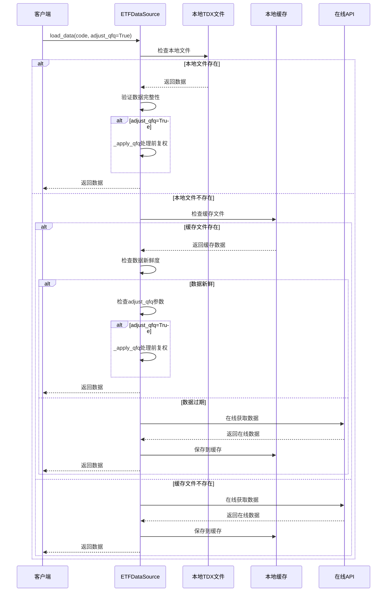

**图表来源**
- [data_source.py:189-246](file://src/quant_etf/data_source.py#L189-L246)

#### 数据加载优先级策略

1. **本地TDX文件优先**：首先检查本地通达信数据文件
2. **缓存文件次之**：如果本地文件不存在，检查CSV缓存
3. **在线API最后**：作为最终的后备方案

**更新** 新增前复权处理逻辑，当adjust_qfq参数为True时，在每个数据源加载完成后都会执行前复权处理。

**章节来源**
- [data_source.py:189-246](file://src/quant_etf/data_source.py#L189-L246)

### 缓存机制

系统实现了多层次的缓存策略，确保数据访问的高效性和可靠性：

#### 缓存文件结构

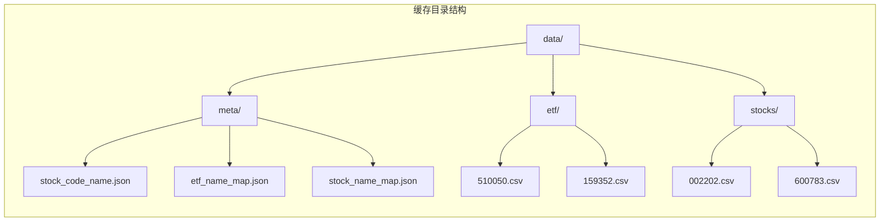

**图表来源**
- [data_source.py:124-149](file://src/quant_etf/data_source.py#L124-L149)

#### 原子写入策略

系统采用了原子化的缓存写入机制，防止部分写入导致的数据损坏：

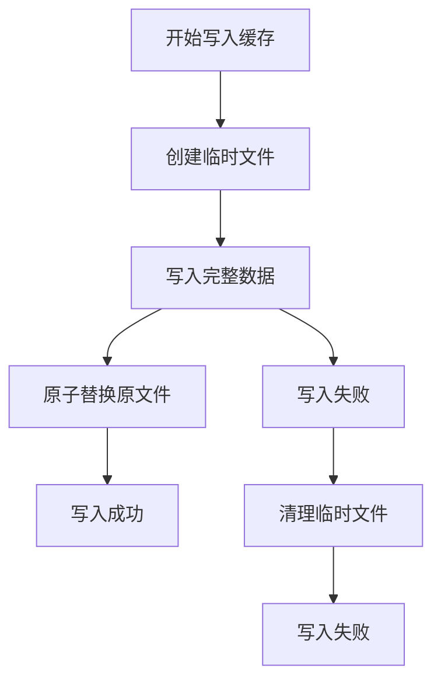

**图表来源**
- [data_source.py:107-123](file://src/quant_etf/data_source.py#L107-L123)

**章节来源**
- [data_source.py:107-149](file://src/quant_etf/data_source.py#L107-L149)

### 数据新鲜度检查

系统实现了智能的数据新鲜度检查机制，能够根据不同的交易日类型和时间段判断数据的有效性：

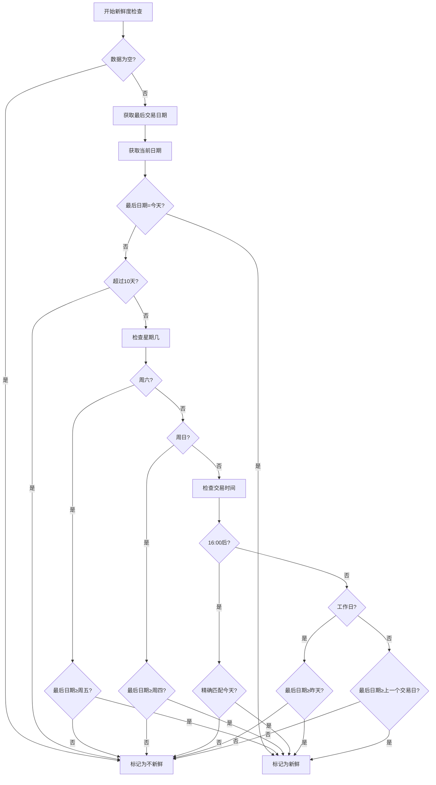

**图表来源**
- [data_source.py:151-188](file://src/quant_etf/data_source.py#L151-L188)

**章节来源**
- [data_source.py:151-188](file://src/quant_etf/data_source.py#L151-L188)

### 名称映射缓存系统

系统实现了完整的名称映射缓存机制，支持ETF和股票代码到名称的双向映射：

#### 缓存架构

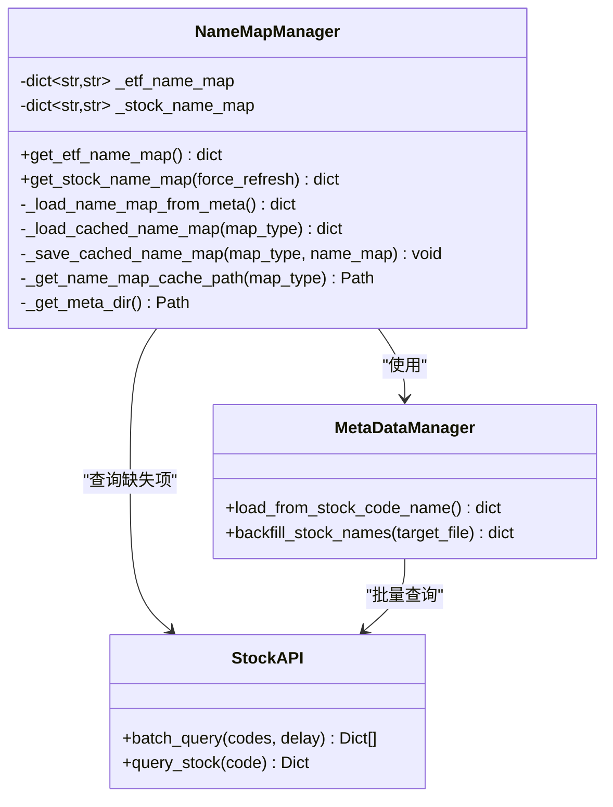

**图表来源**
- [data_source.py:38-123](file://src/quant_etf/data_source.py#L38-L123)
- [simple_stock_api.py:14-314](file://src/collect_info/simple_stock_api.py#L14-L314)

#### 持久化策略

名称映射缓存采用了JSON格式进行持久化存储，支持以下特性：

- **原子写入**：使用临时文件和原子替换机制
- **时间戳记录**：记录数据的最后更新时间
- **数据验证**：确保缓存数据的完整性和有效性
- **降级处理**：缓存失效时自动回退到元数据文件

**章节来源**
- [data_source.py:38-123](file://src/quant_etf/data_source.py#L38-L123)

### 故障转移机制

系统实现了完整的故障转移机制，确保在各种异常情况下都能提供可靠的数据服务：

#### 故障转移流程

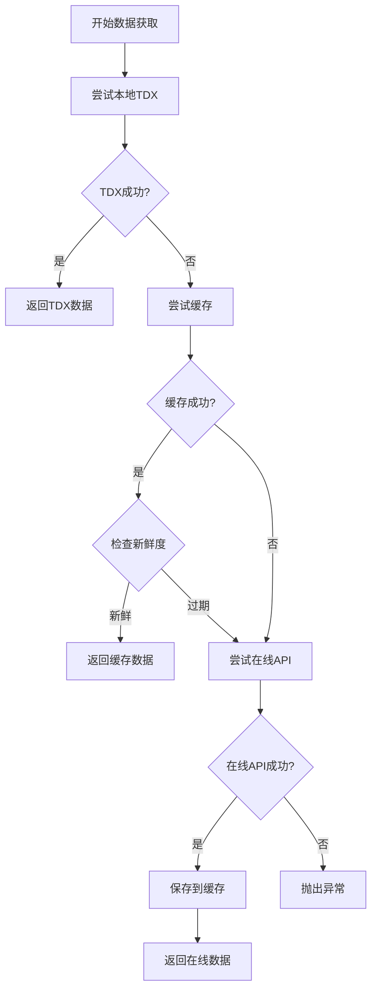

**图表来源**
- [data_source.py:189-246](file://src/quant_etf/data_source.py#L189-L246)

**章节来源**
- [data_source.py:189-246](file://src/quant_etf/data_source.py#L189-L246)

## 前复权处理机制

**新增** 系统集成了ETF前复权处理功能，通过统一的_apply_qfq方法实现标准化的前复权逻辑。

### 前复权处理流程

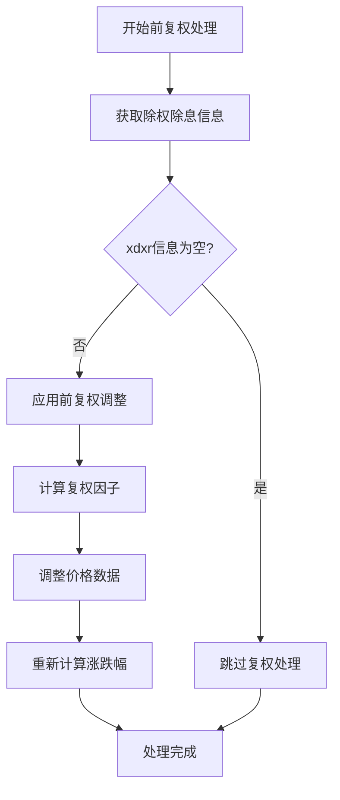

**图表来源**
- [data_source.py:248-266](file://src/quant_etf/data_source.py#L248-L266)
- [tdx.py:457-546](file://src/quant_etf/tdx.py#L457-L546)

### 前复权算法实现

系统使用标准的前复权算法，确保历史价格的连续性和准确性：

1. **除权信息获取**：从TDX服务器获取股票的除权除息信息
2. **复权因子计算**：基于除权日前后收盘价计算复权因子
3. **价格调整**：对除权日之前的历史价格应用复权因子
4. **涨跌幅重算**：基于复权后的价格重新计算涨跌幅

**章节来源**
- [data_source.py:248-266](file://src/quant_etf/data_source.py#L248-L266)
- [tdx.py:457-546](file://src/quant_etf/tdx.py#L457-L546)

## 名称验证和纠正系统

**新增** 系统实现了全面的股票名称验证和纠正系统，通过refresh_stock_names方法提供权威的数据质量保证。

### 名称验证流程

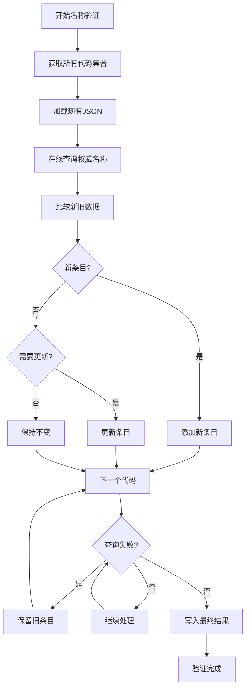

**图表来源**
- [data_source.py:346-463](file://src/quant_etf/data_source.py#L346-L463)

### 市场分类统一机制

**新增** 系统实现了统一的市场分类机制，确保代码和市场的正确对应：

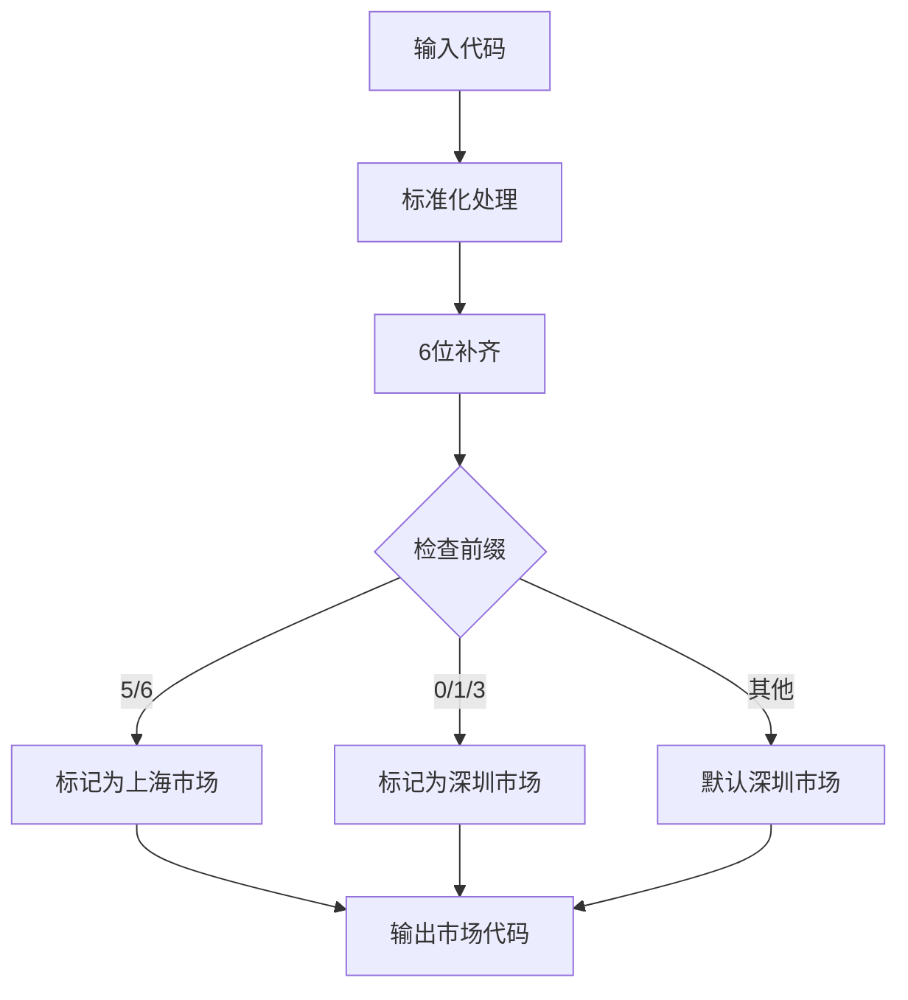

**图表来源**
- [data_source.py:334-344](file://src/quant_etf/data_source.py#L334-L344)

### 名称验证特性

1. **权威数据源对比**：使用多个在线API（新浪、腾讯、网易、东财）进行交叉验证
2. **自动纠错机制**：自动识别并纠正错误的名称和市场分类
3. **失败保护策略**：在线查询失败时保留旧数据，避免数据丢失
4. **原子写入保证**：使用临时文件和原子替换确保数据完整性
5. **详细报告生成**：提供完整的变更报告，包括新增、更新、未变更和失败的条目
6. **市场检测统一**：通过_market_for_code方法统一市场分类，确保5/6开头的代码统一标记为上海市场

**章节来源**
- [data_source.py:346-463](file://src/quant_etf/data_source.py#L346-L463)

### Market检测逻辑优化

**新增** 增强的市场检测逻辑确保了代码和市场的正确对应：

- **统一判定规则**：5/6开头的代码统一标记为上海市场（sh）
- **0/1/3开头的代码标记为深圳市场（sz）
- **错误市场修正**：即使API返回错误的市场信息，也会被本地逻辑覆盖
- **边界情况处理**：支持1位到6位代码的标准化处理

**章节来源**
- [data_source.py:334-344](file://src/quant_etf/data_source.py#L334-L344)

## akshare集成功能

**新增** 系统集成了akshare第三方库，提供实时股票名称获取能力，包含完整的错误处理和回退机制。

### akshare集成架构

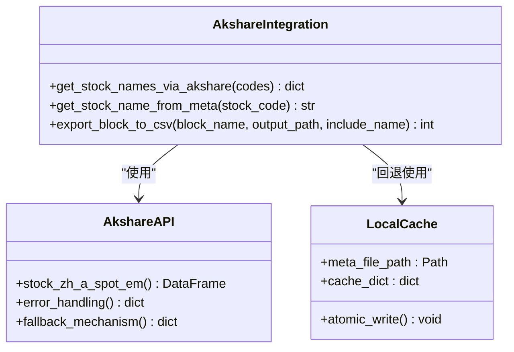

**图表来源**
- [export_tdx_block.py:81-116](file://export_tdx_block.py#L81-L116)
- [export_tdx_block.py:118-137](file://export_tdx_block.py#L118-L137)

### get_stock_names_via_akshare函数实现

该函数提供了akshare集成的核心功能：

#### 功能特性
1. **批量查询**：支持一次性查询多个股票代码的名称
2. **实时数据**：从akshare获取最新的A股实时行情数据
3. **错误处理**：捕获异常并提供友好的错误信息
4. **回退机制**：查询失败时自动回退到本地名称映射
5. **部分缺失处理**：即使部分股票查询失败，仍返回成功的结果

#### 实现流程

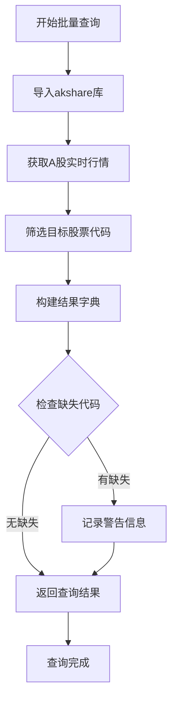

**图表来源**
- [export_tdx_block.py:81-116](file://export_tdx_block.py#L81-L116)

#### 错误处理和回退机制

1. **异常捕获**：使用try-except捕获akshare查询过程中的所有异常
2. **友好提示**：向用户显示具体的错误信息和处理建议
3. **自动回退**：查询失败时自动使用本地stock_code_name.json文件
4. **部分成功**：即使部分股票查询失败，仍返回成功的查询结果

**章节来源**
- [export_tdx_block.py:81-116](file://export_tdx_block.py#L81-L116)

### 依赖配置和安装

系统通过pyproject.toml配置了akshare依赖：

#### 依赖配置
- **包名**：akshare
- **版本要求**：>=1.18.63
- **安装方式**：通过pip安装
- **镜像源**：支持清华和阿里云镜像源

#### 安装步骤
1. 确保Python版本满足要求（>=3.12）
2. 安装项目依赖：`pip install -e .`
3. 验证akshare安装：`python -c "import akshare; print('akshare installed successfully')"`

**章节来源**
- [pyproject.toml:22](file://pyproject.toml#L22)
- [uv.lock:15-16](file://uv.lock#L15-L16)

### 测试和验证

系统提供了专门的测试文件验证akshare功能：

#### 测试功能
1. **基本功能测试**：验证akshare库的正确导入和使用
2. **批量查询测试**：测试多个股票代码的批量查询能力
3. **缺失代码处理**：验证部分股票查询失败时的行为
4. **错误处理测试**：模拟网络异常等错误场景

**章节来源**
- [test_akshare_name.py:1-36](file://test_akshare_name.py#L1-L36)

## 依赖关系分析

系统采用了松耦合的设计模式，通过明确的接口定义实现了各组件间的解耦：

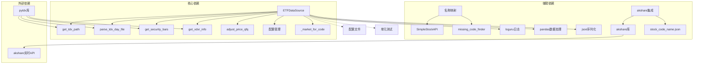

**图表来源**
- [data_source.py:1-8](file://src/quant_etf/data_source.py#L1-L8)
- [tdx.py:1-8](file://src/quant_etf/tdx.py#L1-L8)
- [export_tdx_block.py:92](file://export_tdx_block.py#L92)

**章节来源**
- [data_source.py:1-8](file://src/quant_etf/data_source.py#L1-L8)
- [tdx.py:1-8](file://src/quant_etf/tdx.py#L1-L8)

## 性能考虑

系统在设计时充分考虑了性能优化，采用了多种策略来提升数据访问效率：

### 缓存优化策略

1. **原子写入**：防止部分写入导致的数据损坏
2. **智能迁移**：自动将旧格式缓存文件迁移到新目录结构
3. **内存缓存**：短期内存缓存减少重复读取
4. **批量操作**：支持批量数据获取和处理

### 网络优化策略

1. **服务器缓存**：缓存工作服务器地址，减少连接建立开销
2. **多服务器备份**：提供备用服务器列表，提高成功率
3. **连接复用**：合理管理API连接生命周期
4. **超时控制**：设置合理的超时参数

### 数据处理优化

1. **列选择**：只保留必要的数据列，减少内存占用
2. **索引优化**：使用日期索引提高查询效率
3. **增量更新**：支持增量数据更新，避免全量重载
4. **压缩存储**：使用CSV格式存储，节省磁盘空间

### 前复权处理优化

1. **缓存xdxr信息**：避免重复查询除权除息信息
2. **批量处理**：支持批量代码的前复权处理
3. **智能跳过**：当没有除权信息时自动跳过处理

### **新增** akshare集成性能优化

1. **批量查询**：使用akshare的批量查询功能，减少API调用次数
2. **错误快速处理**：异常发生时快速回退到本地查询
3. **部分成功处理**：即使部分查询失败，仍返回成功的结果
4. **缓存利用**：充分利用现有的stock_code_name.json文件

### **新增** SimpleStockAPI性能优化

1. **会话复用**：使用requests.Session()复用连接
2. **请求头优化**：设置合适的User-Agent和Accept头
3. **超时控制**：合理的超时参数避免长时间阻塞
4. **API优先级**：腾讯API优先，新浪API次之，东方财富和网易API作为备选

## 故障排除指南

### 常见问题及解决方案

#### 数据加载失败

**问题症状**：`RuntimeError: Failed to load ETF data for {code}. No TDX data found for {code}`

**可能原因**：
1. 本地TDX文件不存在
2. 缓存文件损坏
3. 在线API访问失败
4. 配置路径错误

**解决步骤**：
1. 检查TDX数据目录配置
2. 验证缓存文件完整性
3. 测试网络连接
4. 查看详细日志信息

#### 数据新鲜度检查失败

**问题症状**：数据被标记为过期，即使看起来是最新的

**可能原因**：
1. 交易时间判断逻辑
2. 周末和节假日处理
3. 时区和日期转换问题

**解决方法**：
1. 检查系统时间和时区设置
2. 验证交易日历配置
3. 调整检查逻辑参数

#### 缓存写入失败

**问题症状**：缓存文件无法写入或写入后损坏

**解决步骤**：
1. 检查磁盘空间和权限
2. 验证文件锁定状态
3. 清理临时文件
4. 重启应用进程

#### 前复权处理异常

**问题症状**：前复权数据不准确或处理失败

**可能原因**：
1. 除权除息信息获取失败
2. 复权因子计算错误
3. 价格数据格式不匹配

**解决方法**：
1. 检查TDX服务器连接状态
2. 验证xdxr数据格式
3. 使用调试工具验证计算过程

#### **新增** 名称验证失败

**问题症状**：refresh_stock_names方法执行失败或结果不正确

**可能原因**：
1. 在线API访问失败
2. JSON文件格式错误
3. 代码标准化处理异常
4. **新增** 市场检测逻辑冲突

**解决方法**：
1. 检查网络连接和API可用性
2. 验证JSON文件格式
3. 使用dry_run模式进行调试
4. **新增** 检查_market_for_code方法的市场分类逻辑

#### **新增** 市场检测错误

**问题症状**：股票代码的市场分类不正确

**可能原因**：
1. **新增** _market_for_code方法逻辑错误
2. **新增** 代码标准化处理异常
3. **新增** API返回的市场信息与本地逻辑冲突

**解决方法**：
1. **新增** 检查代码前缀判断逻辑
2. **新增** 验证代码标准化处理
3. **新增** 确认市场检测逻辑的优先级

#### **新增** akshare集成问题

**问题症状**：get_stock_names_via_akshare函数执行失败或返回空结果

**可能原因**：
1. **新增** akshare库安装失败或版本不兼容
2. **新增** 网络连接异常导致akshare查询失败
3. **新增** stock_code_name.json文件格式错误
4. **新增** 代码标准化处理异常

**解决方法**：
1. **新增** 检查akshare库的安装状态和版本
2. **新增** 验证网络连接和akshare API的可用性
3. **新增** 检查stock_code_name.json文件的格式和内容
4. **新增** 使用测试脚本验证akshare功能

#### **新增** akshare查询部分失败

**问题症状**：某些股票代码查询失败，但其他代码正常

**可能原因**：
1. **新增** akshare API对特定股票代码的支持有限
2. **新增** 网络波动导致部分请求超时
3. **新增** 股票代码格式不符合akshare的要求

**解决方法**：
1. **新增** 检查失败股票代码的格式和有效性
2. **新增** 验证akshare API对这些代码的支持情况
3. **新增** 检查网络连接的稳定性
4. **新增** 使用回退机制验证本地stock_code_name.json文件

**章节来源**
- [data_source.py:246](file://src/quant_etf/data_source.py#L246)
- [data_source.py:246](file://src/quant_etf/data_source.py#L246)
- [export_tdx_block.py:112-115](file://export_tdx_block.py#L112-L115)

## 结论

Quant-ETF的数据源管理机制通过精心设计的多层架构，实现了高效、可靠和可扩展的数据访问系统。该系统的核心优势包括：

1. **多数据源优先级策略**：通过本地TDX文件 > 缓存 > 在线获取的层次结构，确保数据访问的稳定性和速度
2. **智能缓存管理**：实现了原子化的缓存写入和智能的新鲜度检查机制
3. **完善的错误处理**：提供了完整的故障转移和降级策略
4. **模块化设计**：通过清晰的职责分离和接口定义，实现了高度的可维护性
5. **数据质量保证**：新增的前复权处理和名称验证系统大幅提升了数据质量和系统可靠性
6. **增强的市场检测逻辑**：通过统一的_market_for_code方法确保代码和市场的正确对应
7. ****新增** akshare集成功能**：提供实时股票名称获取能力，包含完整的错误处理和回退机制

**更新** 新增的ETF前复权处理功能确保了历史价格数据的连续性和准确性，而refresh_stock_names方法提供的全面名称验证系统则保证了代码和名称数据的权威性和一致性。**新增** 增强的akshare集成功能进一步提升了系统的数据获取能力和可靠性，通过批量查询和错误回退机制确保了在各种网络环境下的稳定表现。**新增** 增强的市场检测逻辑进一步提升了系统的数据质量保证能力，确保5/6开头的代码统一标记为上海市场，0/1/3开头的代码标记为深圳市场。

这些功能的集成使得系统能够为量化投资ETF策略提供更加高质量和可靠的数据基础，特别是在市场检测、数据质量保证和实时数据获取方面提供了显著的改进。

## 扩展指南

### 新数据源集成规范

为了支持新的数据源，建议遵循以下接口规范：

#### 基础接口要求

```python
class NewDataSourceInterface:
    def fetch_data(self, code: str, **kwargs) -> pd.DataFrame:
        """
        获取指定代码的数据
        
        Args:
            code: 证券代码
            **kwargs: 额外参数
            
        Returns:
            DataFrame格式的数据
        """
        pass
    
    def check_availability(self) -> bool:
        """
        检查数据源可用性
        
        Returns:
            True表示可用，False表示不可用
        """
        pass
    
    def get_metadata(self) -> dict:
        """
        获取数据源元数据信息
        
        Returns:
            包含数据源信息的字典
        """
        pass
```

#### 集成步骤

1. **实现接口**：创建符合上述接口规范的数据源类
2. **配置注册**：在配置文件中注册新的数据源
3. **测试验证**：编写单元测试和集成测试
4. **性能评估**：评估新数据源的性能表现
5. **文档更新**：更新相关技术文档

#### 最佳实践

1. **错误处理**：实现完善的异常处理和重试机制
2. **日志记录**：提供详细的日志记录和监控信息
3. **配置管理**：支持灵活的配置选项和参数调整
4. **性能优化**：考虑缓存策略和连接池管理
5. **安全考虑**：实现适当的认证和授权机制

### 前复权处理扩展

对于需要扩展前复权处理功能的开发者，可以参考以下规范：

#### 前复权算法接口

```python
class QFQProcessorInterface:
    def process_qfq(self, df: pd.DataFrame, xdxr_df: pd.DataFrame) -> pd.DataFrame:
        """
        执行前复权处理
        
        Args:
            df: 原始日线数据
            xdxr_df: 除权除息信息
            
        Returns:
            前复权后的数据
        """
        pass
    
    def calculate_factor(self, before_price: float, after_price: float) -> float:
        """
        计算复权因子
        
        Args:
            before_price: 除权日前价格
            after_price: 除权日价格
            
        Returns:
            复权因子
        """
        pass
```

#### 扩展开发建议

1. **算法兼容性**：确保新算法与现有数据格式兼容
2. **性能优化**：考虑大数据量处理的性能影响
3. **错误处理**：实现健壮的异常处理机制
4. **测试覆盖**：提供完整的单元测试和集成测试
5. **文档完善**：详细记录算法原理和使用方法

### **新增** akshare集成扩展

对于需要扩展akshare集成功能的开发者，可以参考以下规范：

#### akshare集成接口

```python
class AkshareIntegrationInterface:
    def get_stock_names_via_akshare(self, codes: list[str]) -> dict[str, str]:
        """
        使用akshare获取股票名称
        
        Args:
            codes: 股票代码列表
            
        Returns:
            {code: name} 字典
        """
        pass
    
    def handle_error(self, exception: Exception) -> dict[str, str]:
        """
        处理akshare查询异常
        
        Args:
            exception: 异常对象
            
        Returns:
            回退结果字典
        """
        pass
    
    def fallback_to_local(self, codes: list[str]) -> dict[str, str]:
        """
        回退到本地名称映射
        
        Args:
            codes: 股票代码列表
            
        Returns:
            本地名称映射字典
        """
        pass
```

#### 扩展开发建议

1. **错误处理**：实现健壮的异常处理和回退机制
2. **性能优化**：考虑批量查询的性能影响
3. **网络优化**：实现超时控制和重试机制
4. **测试覆盖**：提供完整的单元测试和集成测试
5. **文档完善**：详细记录集成方法和使用注意事项

### **新增** 市场检测逻辑扩展

对于需要扩展市场检测功能的开发者，可以参考以下规范：

#### 市场检测接口

```python
class MarketDetectorInterface:
    def detect_market(self, code: str) -> str:
        """
        检测股票市场
        
        Args:
            code: 股票代码
            
        Returns:
            市场代码（'sh'或'sz'）
        """
        pass
    
    def validate_market(self, code: str, market: str) -> bool:
        """
        验证市场分类的正确性
        
        Args:
            code: 股票代码
            market: 市场代码
            
        Returns:
            True表示正确，False表示错误
        """
        pass
```

#### 扩展开发建议

1. **规则兼容性**：确保新规则与现有5/6开头为上海市场的规则兼容
2. **边界情况处理**：考虑特殊代码格式和边界情况
3. **性能优化**：优化市场检测的性能和响应时间
4. **测试覆盖**：提供全面的测试用例，包括边界情况
5. **文档完善**：详细记录市场检测规则和使用方法

通过遵循这些规范和最佳实践，可以确保新功能能够无缝集成到现有的数据源管理框架中，为用户提供一致的使用体验。