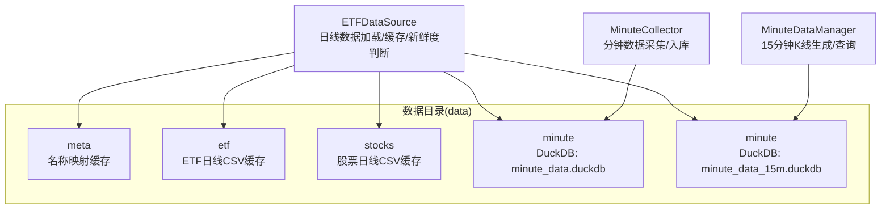
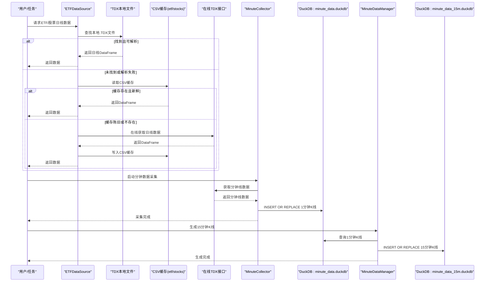
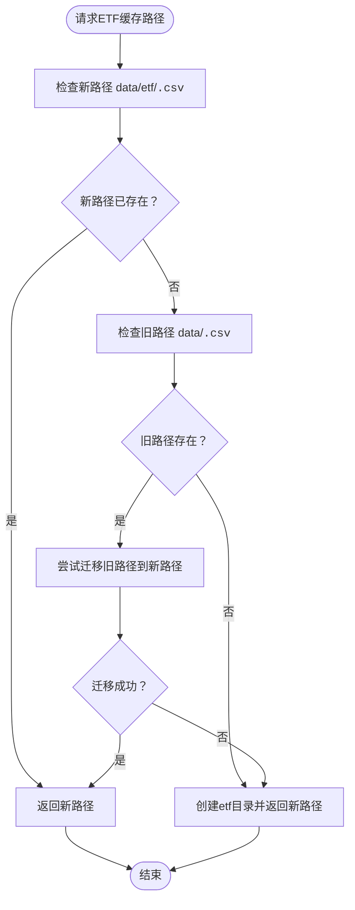
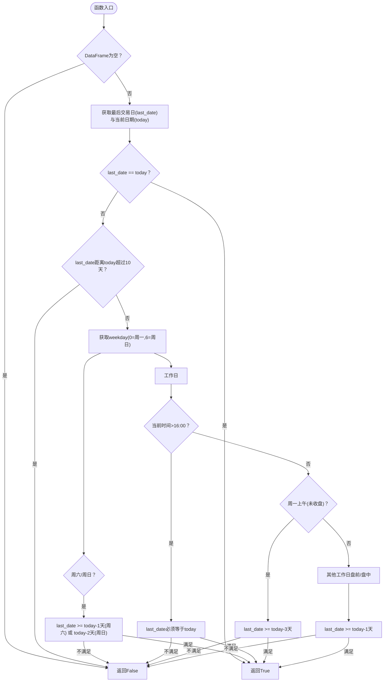
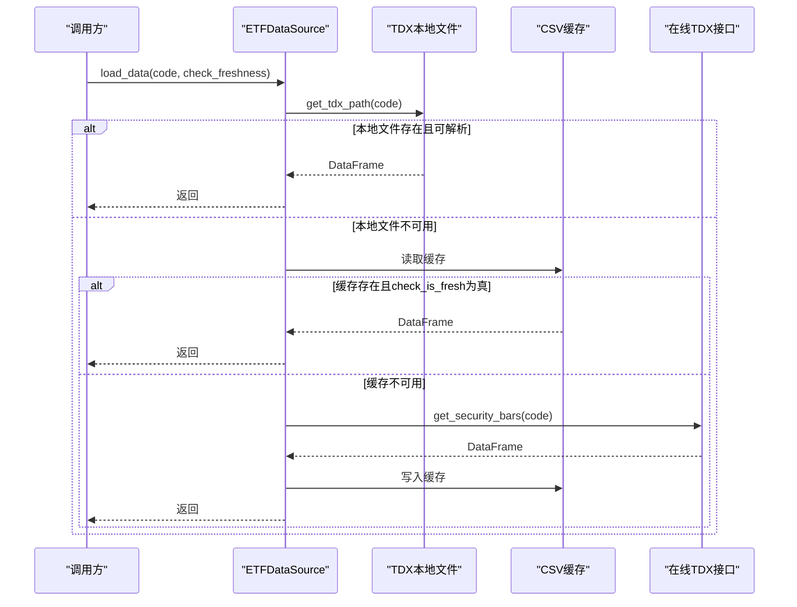
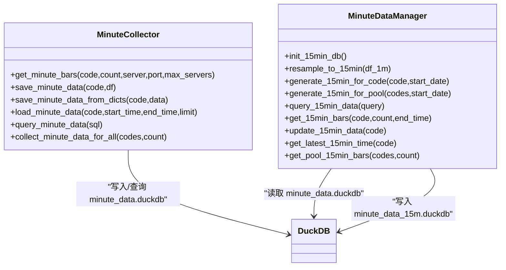
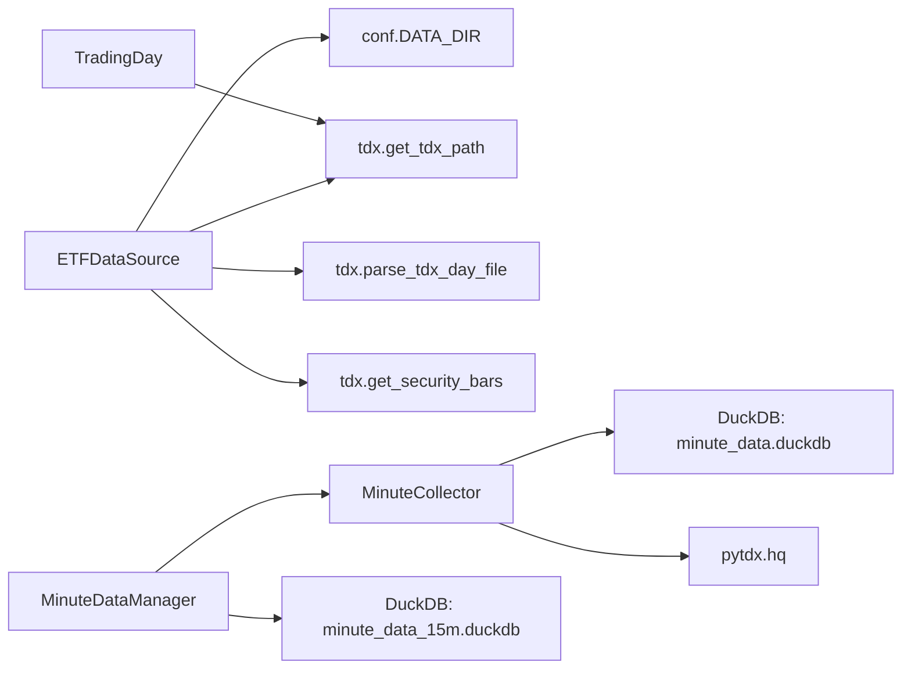

# 数据缓存策略

<cite>
**本文引用的文件**
- [src/quant_etf/data_source.py](file://src/quant_etf/data_source.py)
- [src/quant_etf/minute_data_manager.py](file://src/quant_etf/minute_data_manager.py)
- [src/quant_etf/minute_collector.py](file://src/quant_etf/minute_collector.py)
- [src/quant_etf/trading_day.py](file://src/quant_etf/trading_day.py)
- [src/quant_etf/conf.py](file://src/quant_etf/conf.py)
- [src/quant_etf/init_15min_data.py](file://src/quant_etf/init_15min_data.py)
- [src/quant_etf/tdx.py](file://src/quant_etf/tdx.py)
- [src/quant_etf/cli.py](file://src/quant_etf/cli.py)
</cite>

## 目录
1. [引言](#引言)
2. [项目结构](#项目结构)
3. [核心组件](#核心组件)
4. [架构总览](#架构总览)
5. [详细组件分析](#详细组件分析)
6. [依赖分析](#依赖分析)
7. [性能考量](#性能考量)
8. [故障排查指南](#故障排查指南)
9. [结论](#结论)
10. [附录](#附录)

## 引言
本文件围绕 Quant-ETF 的数据缓存策略进行系统化技术说明，重点覆盖以下方面：
- 本地缓存的存储架构与文件组织：ETF 缓存与股票缓存目录分离设计
- 缓存文件命名规范、路径管理与迁移机制
- 新鲜度判断算法 check_is_fresh 的实现细节与工作日历考虑
- 缓存失效策略、手动刷新机制与批量更新流程
- 性能优化、内存管理与磁盘空间控制最佳实践
- 缓存一致性保证与并发访问控制
- 配置调整与性能调优的实用指南

## 项目结构
Quant-ETF 的数据缓存策略涉及多类数据与存储介质：
- 日线数据缓存：CSV 文件，按 ETF 与股票类型分别存放于独立目录
- 分钟级数据缓存：DuckDB 关系型数据库，分别维护 1 分钟与 15 分钟 K 线表
- 名称映射缓存：meta 目录下的 JSON 文件，缓存 ETF/股票名称映射
- 通达信本地数据：通过 TDX 路径解析读取 .day 文件作为优先数据源

图表来源
- [src/quant_etf/data_source.py:151-188](file://src/quant_etf/data_source.py#L151-L188)
- [src/quant_etf/minute_collector.py:235-287](file://src/quant_etf/minute_collector.py#L235-L287)
- [src/quant_etf/minute_data_manager.py:20-60](file://src/quant_etf/minute_data_manager.py#L20-L60)

章节来源
- [src/quant_etf/conf.py:7-13](file://src/quant_etf/conf.py#L7-L13)
- [src/quant_etf/data_source.py:124-149](file://src/quant_etf/data_source.py#L124-L149)
- [src/quant_etf/minute_collector.py:235-287](file://src/quant_etf/minute_collector.py#L235-L287)
- [src/quant_etf/minute_data_manager.py:20-60](file://src/quant_etf/minute_data_manager.py#L20-L60)

## 核心组件
- ETFDataSource：负责日线数据的加载、缓存与新鲜度判断，支持从 TDX 本地文件、缓存 CSV、在线接口三层来源加载，并提供名称映射缓存与补齐功能
- MinuteCollector：负责分钟级数据采集与入库，使用 DuckDB 存储 1 分钟 K 线
- MinuteDataManager：负责基于 1 分钟数据重采样生成 15 分钟 K 线，使用 DuckDB 存储
- TradingDay：提供 TDX 本地文件路径解析与交易日列表获取能力
- TDX：封装 TDX 客户端连接、服务器选择与日线数据获取
- CLI：提供缓存相关命令入口，如批量补齐名称映射等

章节来源
- [src/quant_etf/data_source.py:15-381](file://src/quant_etf/data_source.py#L15-L381)
- [src/quant_etf/minute_collector.py:1-505](file://src/quant_etf/minute_collector.py#L1-L505)
- [src/quant_etf/minute_data_manager.py:1-283](file://src/quant_etf/minute_data_manager.py#L1-L283)
- [src/quant_etf/trading_day.py:1-98](file://src/quant_etf/trading_day.py#L1-L98)
- [src/quant_etf/tdx.py:1-375](file://src/quant_etf/tdx.py#L1-L375)
- [src/quant_etf/cli.py:362-370](file://src/quant_etf/cli.py#L362-L370)

## 架构总览
下图展示缓存策略在数据流中的位置与交互：

图表来源
- [src/quant_etf/data_source.py:189-236](file://src/quant_etf/data_source.py#L189-L236)
- [src/quant_etf/minute_collector.py:41-102](file://src/quant_etf/minute_collector.py#L41-L102)
- [src/quant_etf/minute_data_manager.py:110-168](file://src/quant_etf/minute_data_manager.py#L110-L168)

## 详细组件分析

### 日线数据缓存与路径管理
- 目录分离设计
  - ETF 日线缓存：data/etf/<code>.csv
  - 股票日线缓存：data/stocks/<code>.csv
  - 名称映射缓存：data/meta/<map_type>_name_map.json
- 路径获取与迁移
  - ETF：优先检查新路径 data/etf/<code>.csv；若旧路径 data/<code>.csv 存在且新路径不存在，则尝试迁移
  - 股票：始终写入 data/stocks/<code>.csv
- 原子写入
  - 名称映射缓存采用临时文件 + replace 的方式，避免部分写入导致的损坏

图表来源
- [src/quant_etf/data_source.py:124-141](file://src/quant_etf/data_source.py#L124-L141)

章节来源
- [src/quant_etf/data_source.py:124-149](file://src/quant_etf/data_source.py#L124-L149)
- [src/quant_etf/data_source.py:107-123](file://src/quant_etf/data_source.py#L107-L123)

### 新鲜度判断算法 check_is_fresh
check_is_fresh 的设计充分考虑了中国 A 股市场的交易时间窗口与周末特性，确保在不同场景下对“新鲜”有合理判定。

图表来源
- [src/quant_etf/data_source.py:151-188](file://src/quant_etf/data_source.py#L151-L188)

章节来源
- [src/quant_etf/data_source.py:151-188](file://src/quant_etf/data_source.py#L151-L188)

### 缓存加载与回退策略
ETFDataSource 的日线数据加载遵循“本地 TDX 文件 → 缓存 → 在线接口”的优先级顺序，并结合 check_is_fresh 判定缓存是否可用。

图表来源
- [src/quant_etf/data_source.py:189-236](file://src/quant_etf/data_source.py#L189-L236)

章节来源
- [src/quant_etf/data_source.py:189-236](file://src/quant_etf/data_source.py#L189-L236)

### 名称映射缓存与补齐
- 名称映射缓存：data/meta/<map_type>_name_map.json，包含 updated_at 时间戳与 data 字典
- 加载策略：优先从 data/meta/stock_code_name.json 合并加载，若存在则缓存到内存；若不存在则回退到空映射
- 补齐策略：通过批量查询缺失代码并写回目标 JSON 文件，支持去重与排序

章节来源
- [src/quant_etf/data_source.py:30-106](file://src/quant_etf/data_source.py#L30-L106)
- [src/quant_etf/data_source.py:303-371](file://src/quant_etf/data_source.py#L303-L371)

### 分钟级数据缓存与15分钟K线生成
- 1 分钟数据：DuckDB 表 minute_bars，主键 (code, time)，索引 idx_code_time
- 15 分钟数据：DuckDB 表 minute_bars_15m，主键 (code, time)，索引 idx_code_time
- 生成流程：从 1 分钟表按 15 分钟窗口重采样，填充年月日时分字段，INSERT OR REPLACE 写入 15 分钟表
- 批量生成：支持按 ETF 池批量生成，按起始日期增量生成

图表来源
- [src/quant_etf/minute_collector.py:235-456](file://src/quant_etf/minute_collector.py#L235-L456)
- [src/quant_etf/minute_data_manager.py:20-283](file://src/quant_etf/minute_data_manager.py#L20-L283)

章节来源
- [src/quant_etf/minute_collector.py:235-456](file://src/quant_etf/minute_collector.py#L235-L456)
- [src/quant_etf/minute_data_manager.py:20-283](file://src/quant_etf/minute_data_manager.py#L20-L283)

### 交易日与 TDX 本地文件解析
- get_tdx_path：根据代码判断市场(sh/sz)，拼装 TDX .day 文件路径并校验存在性
- get_available_trading_dates：使用 TdxDailyBarReader 读取最近交易日列表
- get_trading_dates_between：在给定日期范围内筛选有效交易日

章节来源
- [src/quant_etf/trading_day.py:9-88](file://src/quant_etf/trading_day.py#L9-L88)
- [src/quant_etf/tdx.py:209-232](file://src/quant_etf/tdx.py#L209-L232)

### 手动刷新与批量更新流程
- 手动刷新：通过 CLI 命令触发，例如补齐名称映射
- 批量更新：初始化脚本支持批量生成 1 分钟与 15 分钟数据，按 ETF 池循环处理

章节来源
- [src/quant_etf/cli.py:362-370](file://src/quant_etf/cli.py#L362-L370)
- [src/quant_etf/init_15min_data.py:58-107](file://src/quant_etf/init_15min_data.py#L58-L107)

## 依赖分析
- ETFDataSource 依赖
  - conf.DATA_DIR：根数据目录
  - tdx.get_tdx_path / parse_tdx_day_file：本地 TDX 文件解析
  - tdx.get_security_bars：在线日线数据获取
- MinuteCollector 依赖
  - DuckDB：1 分钟数据持久化
  - pytdx.hq：在线分钟线数据获取
- MinuteDataManager 依赖
  - MinuteCollector：读取 1 分钟数据
  - DuckDB：写入/查询 15 分钟数据
- TradingDay/tdx：TDX 本地文件路径解析与日线数据获取

图表来源
- [src/quant_etf/data_source.py:7-8](file://src/quant_etf/data_source.py#L7-L8)
- [src/quant_etf/minute_collector.py:15-21](file://src/quant_etf/minute_collector.py#L15-L21)
- [src/quant_etf/minute_data_manager.py:14-17](file://src/quant_etf/minute_data_manager.py#L14-L17)
- [src/quant_etf/trading_day.py:5-6](file://src/quant_etf/trading_day.py#L5-L6)

章节来源
- [src/quant_etf/data_source.py:7-8](file://src/quant_etf/data_source.py#L7-L8)
- [src/quant_etf/minute_collector.py:15-21](file://src/quant_etf/minute_collector.py#L15-L21)
- [src/quant_etf/minute_data_manager.py:14-17](file://src/quant_etf/minute_data_manager.py#L14-L17)
- [src/quant_etf/trading_day.py:5-6](file://src/quant_etf/trading_day.py#L5-L6)

## 性能考量
- I/O 与序列化
  - CSV 缓存：读写简单，适合日线数据；建议在批量写入时合并多次写入以减少磁盘抖动
  - DuckDB：支持高效查询与索引，建议在高频查询场景使用 15 分钟数据表
- 内存管理
  - DataFrame 操作建议配合分块读取与延迟计算，避免一次性加载过多数据
  - 使用 query 接口限制返回行数，防止内存峰值过高
- 并发与一致性
  - DuckDB 支持 WAL 模式，具备较好的并发写入能力；但同一进程内应避免重复连接
  - 原子写入策略（临时文件 + replace）适用于 CSV 缓存，降低损坏风险
- 磁盘空间控制
  - 1 分钟数据量大，建议定期清理或归档历史数据
  - 15 分钟数据可按需生成，避免全量重建
- 网络稳定性
  - TDX 服务器失败冷却机制（SERVER_COOLDOWN）可减少频繁重试带来的网络压力

[本节为通用性能指导，不直接分析具体文件]

## 故障排查指南
- 缓存读取失败
  - 检查 CSV 文件是否存在与可读；确认路径迁移是否成功
  - 若 check_is_fresh 返回 False，可能是数据陈旧，建议重新在线获取
- 在线接口异常
  - 观察服务器冷却日志，等待冷却时间后重试
  - 切换备用服务器或使用缓存的工作服务器
- DuckDB 写入失败
  - 检查表结构与索引是否存在
  - 确认 INSERT OR REPLACE 语句参数与列顺序一致
- 交易日解析问题
  - 确认 TDX 数据目录配置正确，文件路径拼装是否符合 sh/sz 市场规则

章节来源
- [src/quant_etf/data_source.py:213-236](file://src/quant_etf/data_source.py#L213-L236)
- [src/quant_etf/minute_collector.py:41-102](file://src/quant_etf/minute_collector.py#L41-L102)
- [src/quant_etf/minute_data_manager.py:110-168](file://src/quant_etf/minute_data_manager.py#L110-L168)
- [src/quant_etf/trading_day.py:33-59](file://src/quant_etf/trading_day.py#L33-L59)

## 结论
Quant-ETF 的缓存策略通过“本地 TDX 文件优先 + 缓存兜底 + 在线接口回退”的三层架构，结合 check_is_fresh 的智能新鲜度判断，实现了在不同市场时段与节假日场景下的稳定数据供给。分钟级数据采用 DuckDB 存储并提供高效的重采样与查询能力。整体设计兼顾了性能、可靠性与可维护性，适合在生产环境中持续演进与优化。

[本节为总结性内容，不直接分析具体文件]

## 附录

### 缓存配置与调优要点
- 数据目录与池配置
  - DATA_DIR：根数据目录，建议挂载到高性能磁盘
  - ETF_POOL/ALL_POOL：根据实际需求裁剪池规模，减少不必要的 IO
- 新鲜度阈值
  - 当前阈值为 10 天，可根据策略波动性调整
- 服务器冷却
  - SERVER_COOLDOWN：默认 120 秒，可根据网络状况调整
- 15 分钟数据生成
  - 建议按需增量生成，避免全量重建
- 日志与监控
  - 启用日志轮转与保留策略，便于问题定位

章节来源
- [src/quant_etf/conf.py:7-13](file://src/quant_etf/conf.py#L7-L13)
- [src/quant_etf/conf.py:100-116](file://src/quant_etf/conf.py#L100-L116)
- [src/quant_etf/minute_collector.py:23-25](file://src/quant_etf/minute_collector.py#L23-L25)
- [src/quant_etf/init_15min_data.py:58-107](file://src/quant_etf/init_15min_data.py#L58-L107)