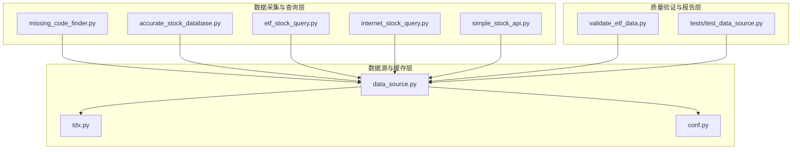
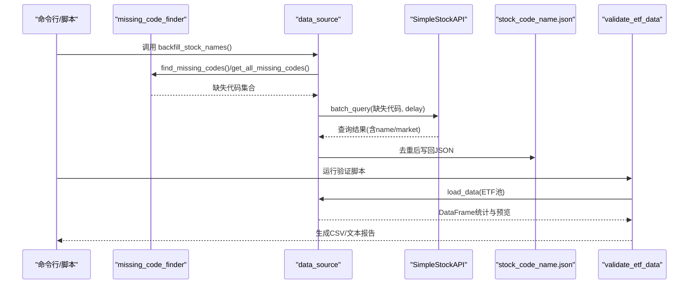
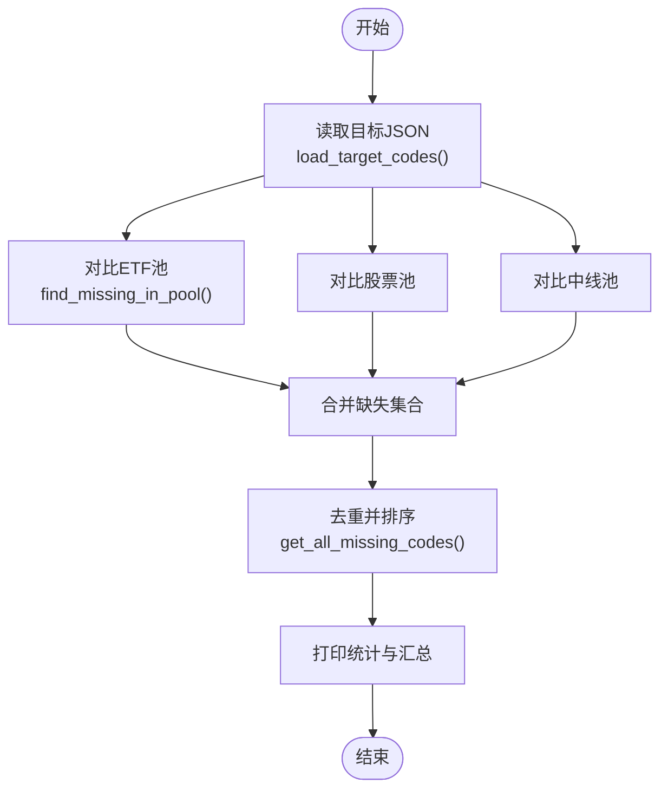
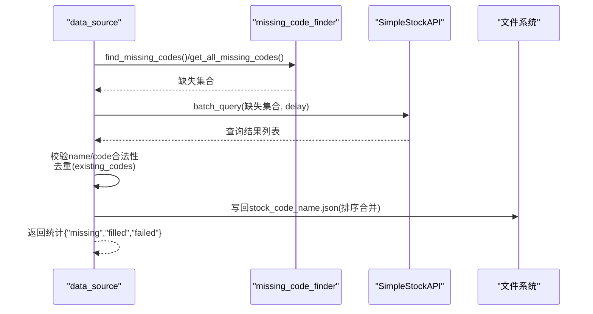
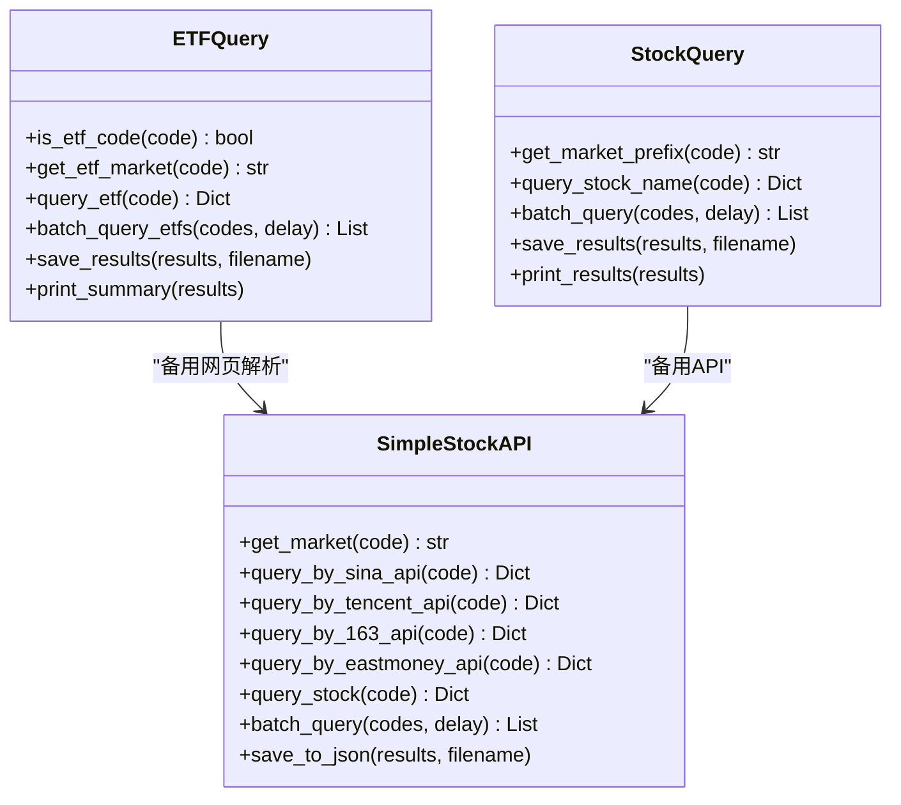
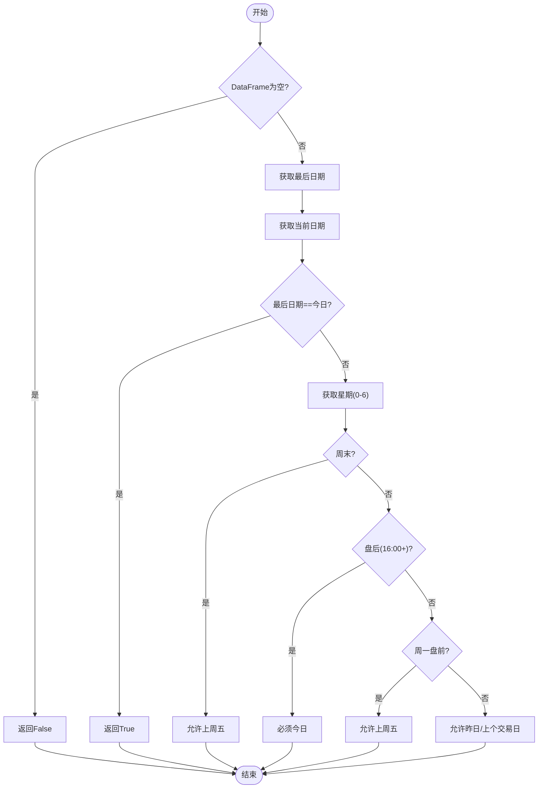
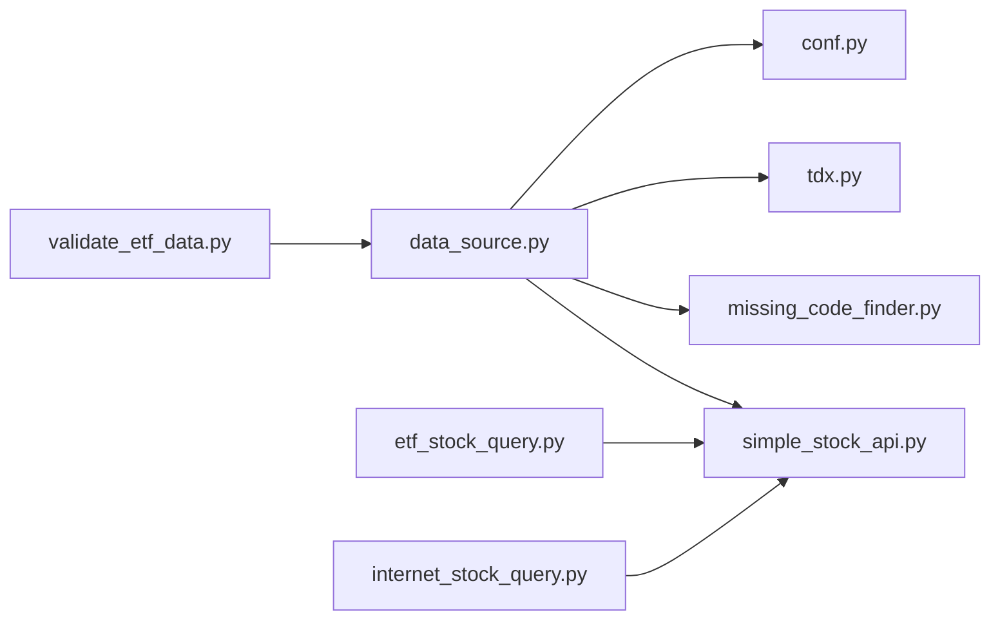

# 数据质量控制

<cite>
**本文引用的文件**
- [missing_code_finder.py](file://src/collect_info/missing_code_finder.py)
- [accurate_stock_database.py](file://src/collect_info/accurate_stock_database.py)
- [etf_stock_query.py](file://src/collect_info/etf_stock_query.py)
- [internet_stock_query.py](file://src/collect_info/internet_stock_query.py)
- [simple_stock_api.py](file://src/collect_info/simple_stock_api.py)
- [validate_etf_data.py](file://scripts/validate_etf_data.py)
- [data_source.py](file://src/quant_etf/data_source.py)
- [conf.py](file://src/quant_etf/conf.py)
- [tdx.py](file://src/quant_etf/tdx.py)
- [test_data_source.py](file://tests/test_data_source.py)
</cite>

## 目录
1. [简介](#简介)
2. [项目结构](#项目结构)
3. [核心组件](#核心组件)
4. [架构概览](#架构概览)
5. [详细组件分析](#详细组件分析)
6. [依赖关系分析](#依赖关系分析)
7. [性能考量](#性能考量)
8. [故障排查指南](#故障排查指南)
9. [结论](#结论)
10. [附录](#附录)

## 简介
本文件面向Quant-ETF项目的“数据质量控制系统”，系统性阐述以下能力：
- 数据完整性检查机制：缺失代码检测、重复数据识别、异常值处理
- missing_code_finder模块的智能代码发现算法与补全策略
- backfill_stock_names函数的批量数据补齐流程：API查询、数据验证、冲突解决
- 数据标准化处理、格式转换与编码统一
- 数据质量评估指标、统计分析与报告生成机制
- 数据验证规则、错误分类与修复建议
- 数据质量监控与问题诊断的实用工具与方法

## 项目结构
围绕数据质量控制的关键模块分布如下：
- 数据采集与查询层
  - missing_code_finder：缺失代码发现与去重
  - accurate_stock_database：权威ETF数据库
  - etf_stock_query：ETF专用查询器
  - internet_stock_query：通用A股股票查询器
  - simple_stock_api：简单股票API查询器
- 数据源与缓存层
  - data_source：ETF/股票数据加载、缓存、新鲜度检查、批量补齐
  - tdx：通达信数据读取与在线获取
  - conf：ETF池、股票池、TDX路径等配置
- 质量验证与报告层
  - validate_etf_data：ETF数据验证与报告生成
  - tests：单元测试覆盖数据加载与新鲜度判定

图表来源
- [missing_code_finder.py:1-124](file://src/collect_info/missing_code_finder.py#L1-L124)
- [accurate_stock_database.py:1-284](file://src/collect_info/accurate_stock_database.py#L1-L284)
- [etf_stock_query.py:1-381](file://src/collect_info/etf_stock_query.py#L1-L381)
- [internet_stock_query.py:1-536](file://src/collect_info/internet_stock_query.py#L1-L536)
- [simple_stock_api.py:1-314](file://src/collect_info/simple_stock_api.py#L1-L314)
- [data_source.py:1-381](file://src/quant_etf/data_source.py#L1-L381)
- [tdx.py:1-375](file://src/quant_etf/tdx.py#L1-L375)
- [conf.py:1-137](file://src/quant_etf/conf.py#L1-L137)
- [validate_etf_data.py:1-117](file://scripts/validate_etf_data.py#L1-L117)
- [test_data_source.py:1-67](file://tests/test_data_source.py#L1-L67)

章节来源
- [conf.py:15-99](file://src/quant_etf/conf.py#L15-L99)
- [data_source.py:15-381](file://src/quant_etf/data_source.py#L15-L381)

## 核心组件
- 缺失代码发现与补全
  - missing_code_finder：标准化代码、对比ETF/股票池与目标JSON，输出缺失集合；提供去重汇总与命令行入口
  - data_source.backfill_stock_names：调用missing_code_finder定位缺失，通过SimpleStockAPI批量补齐，去重写回目标JSON
- 数据查询与验证
  - etf_stock_query/internet_stock_query/simple_stock_api：多源API与网页解析，提供批量查询与结果保存
  - validate_etf_data：加载ETF池数据，输出关键统计与报告文件
- 数据新鲜度与一致性
  - data_source.check_is_fresh：根据当前时间与最后交易日判断数据新鲜度
  - data_source.load_data/load_stock_data：本地TDX文件优先、缓存次之、在线回退，统一返回DataFrame
- 配置与权威库
  - conf：ETF/股票池、TDX路径等全局配置
  - accurate_stock_database：权威ETF名称库，辅助市场判断与统计

章节来源
- [missing_code_finder.py:65-124](file://src/collect_info/missing_code_finder.py#L65-L124)
- [data_source.py:303-371](file://src/quant_etf/data_source.py#L303-L371)
- [validate_etf_data.py:22-117](file://scripts/validate_etf_data.py#L22-L117)
- [data_source.py:151-188](file://src/quant_etf/data_source.py#L151-L188)
- [data_source.py:189-285](file://src/quant_etf/data_source.py#L189-L285)
- [conf.py:15-99](file://src/quant_etf/conf.py#L15-L99)
- [accurate_stock_database.py:22-152](file://src/collect_info/accurate_stock_database.py#L22-L152)

## 架构概览
数据质量控制的端到端流程如下：
- 发现阶段：missing_code_finder对比池与目标JSON，识别缺失代码
- 补齐阶段：data_source调用SimpleStockAPI批量查询，去重后写回目标JSON
- 验证阶段：validate_etf_data加载ETF数据，输出统计与预览文件
- 新鲜度保障：data_source.check_is_fresh确保使用最新数据

图表来源
- [data_source.py:303-371](file://src/quant_etf/data_source.py#L303-L371)
- [missing_code_finder.py:65-124](file://src/collect_info/missing_code_finder.py#L65-L124)
- [simple_stock_api.py:198-234](file://src/collect_info/simple_stock_api.py#L198-L234)
- [validate_etf_data.py:22-117](file://scripts/validate_etf_data.py#L22-L117)

## 详细组件分析

### 缺失代码发现与补全（missing_code_finder）
- 标准化策略
  - normalize_code：去除多余字符、右对齐截断、零填充至6位，保证比较一致性
- 目标文件解析
  - load_target_codes：读取目标JSON，提取已有code集合（列表格式），异常或非列表时返回空集
- 缺失比对
  - find_missing_in_pool：对单个池做标准化后与已有集合求差集，返回排序后的缺失列表
  - find_missing_codes：分别对ETF/股票/中线池执行比对，返回字典
  - get_all_missing_codes：合并所有缺失并去重排序
- 命令行入口
  - main：解析参数、打印缺失统计、输出去重汇总

图表来源
- [missing_code_finder.py:32-91](file://src/collect_info/missing_code_finder.py#L32-L91)

章节来源
- [missing_code_finder.py:20-91](file://src/collect_info/missing_code_finder.py#L20-L91)
- [missing_code_finder.py:93-124](file://src/collect_info/missing_code_finder.py#L93-L124)

### 批量数据补齐（backfill_stock_names）
- 流程步骤
  - 读取目标文件，调用missing_code_finder获取缺失集合
  - 若无缺失，直接返回统计
  - 使用SimpleStockAPI批量查询缺失代码，逐条校验name与code合法性，并与现有集合去重
  - 合并新旧条目，排序后写回目标文件
- 冲突解决
  - normalize_code统一键值
  - existing_codes集合避免重复写入
  - failed_codes收集无结果的代码，便于后续重试或人工核查

图表来源
- [data_source.py:303-371](file://src/quant_etf/data_source.py#L303-L371)
- [simple_stock_api.py:198-234](file://src/collect_info/simple_stock_api.py#L198-L234)

章节来源
- [data_source.py:303-371](file://src/quant_etf/data_source.py#L303-L371)

### 数据查询与验证
- ETF专用查询（etf_stock_query）
  - ETF识别与市场判断
  - 多源API与网页解析（天天基金、新浪、腾讯），优先API，失败再网页
  - 批量查询与结果保存，含成功率统计
- 通用A股查询（internet_stock_query）
  - 多源解析（东方财富、新浪财经、腾讯、网易、雪球）
  - 重试与延迟控制，日志记录
- 简单股票API（simple_stock_api）
  - 新浪/腾讯/网易/东方财富API封装，批量查询与结果保存
- 数据验证（validate_etf_data）
  - 遍历ETF池加载数据，统计行数、起止日期、最新收盘价
  - 生成成功/失败CSV与数据预览文本，输出到data/validation

图表来源
- [etf_stock_query.py:15-381](file://src/collect_info/etf_stock_query.py#L15-L381)
- [internet_stock_query.py:24-536](file://src/collect_info/internet_stock_query.py#L24-L536)
- [simple_stock_api.py:14-314](file://src/collect_info/simple_stock_api.py#L14-L314)

章节来源
- [etf_stock_query.py:15-381](file://src/collect_info/etf_stock_query.py#L15-L381)
- [internet_stock_query.py:24-536](file://src/collect_info/internet_stock_query.py#L24-L536)
- [simple_stock_api.py:14-314](file://src/collect_info/simple_stock_api.py#L14-L314)
- [validate_etf_data.py:22-117](file://scripts/validate_etf_data.py#L22-L117)

### 数据新鲜度与一致性（data_source）
- 新鲜度判定（check_is_fresh）
  - 今日即新鲜
  - 周末：允许上周五
  - 周一盘前：允许上周五
  - 工作日盘后：必须今日
  - 工作日盘前/盘中：至少昨日或上个交易日
- 数据加载优先级
  - 本地TDX文件 → 缓存 → 在线获取
  - 缓存文件命名迁移与原子写入
- ETF/股票数据加载
  - load_data/load_stock_data：统一返回DataFrame，异常时抛出RuntimeError

图表来源
- [data_source.py:151-188](file://src/quant_etf/data_source.py#L151-L188)

章节来源
- [data_source.py:151-188](file://src/quant_etf/data_source.py#L151-L188)
- [data_source.py:189-285](file://src/quant_etf/data_source.py#L189-L285)

### 权威数据库与配置（accurate_stock_database、conf）
- accurate_stock_database
  - 提供ETF名称映射与市场判断逻辑
  - 批量查询与统计功能
- conf
  - ETF/股票池、TDX路径、权重配置等全局常量

章节来源
- [accurate_stock_database.py:22-152](file://src/collect_info/accurate_stock_database.py#L22-L152)
- [conf.py:15-99](file://src/quant_etf/conf.py#L15-L99)

## 依赖关系分析
- 组件耦合
  - data_source依赖missing_code_finder与simple_stock_api进行补齐
  - data_source依赖tdx进行本地/在线数据获取
  - validate_etf_data依赖data_source进行数据加载与统计
- 外部依赖
  - requests、pandas、loguru、pytdx等
- 循环依赖
  - 未见循环导入；模块间通过函数调用解耦

图表来源
- [data_source.py:1-20](file://src/quant_etf/data_source.py#L1-L20)
- [validate_etf_data.py:19-21](file://scripts/validate_etf_data.py#L19-L21)
- [etf_stock_query.py:1-15](file://src/collect_info/etf_stock_query.py#L1-L15)
- [internet_stock_query.py:1-16](file://src/collect_info/internet_stock_query.py#L1-L16)
- [simple_stock_api.py:1-14](file://src/collect_info/simple_stock_api.py#L1-L14)

章节来源
- [data_source.py:1-20](file://src/quant_etf/data_source.py#L1-L20)
- [validate_etf_data.py:19-21](file://scripts/validate_etf_data.py#L19-L21)

## 性能考量
- 批量查询延迟
  - missing_code_finder/backfill_stock_names：通过delay参数控制请求频率，避免触发反爬
  - etf_stock_query/internet_stock_query/simple_stock_api：内置延迟与重试，降低失败率
- 缓存与回退
  - data_source优先读取本地TDX文件与缓存，减少在线请求
  - 在线失败自动回退至缓存或抛出异常，避免长时间阻塞
- 数据新鲜度
  - check_is_fresh避免使用过期数据，减少无效计算

[本节为通用性能讨论，无需具体文件分析]

## 故障排查指南
- 常见错误类型与定位
  - “未找到TDX数据”：确认TDX_DIR路径与文件存在
  - “数据为空”：检查缓存文件是否损坏或过期
  - “查询失败”：查看API/网页解析日志，确认网络与目标站点可用性
- 修复建议
  - 本地TDX文件缺失：使用在线获取并缓存
  - 缓存损坏：删除缓存文件后重试
  - API不可用：切换备用数据源或延时重试
  - 缺失代码：运行backfill_stock_names补齐
- 验证与报告
  - 使用validate_etf_data生成CSV与预览文本，快速定位异常ETF
  - 单元测试覆盖数据加载与新鲜度判定，便于回归验证

章节来源
- [tests/test_data_source.py:27-67](file://tests/test_data_source.py#L27-L67)
- [validate_etf_data.py:22-117](file://scripts/validate_etf_data.py#L22-L117)
- [data_source.py:189-285](file://src/quant_etf/data_source.py#L189-L285)

## 结论
本系统通过“发现—补齐—验证—新鲜度保障”的闭环，实现了ETF与股票数据的质量控制：
- 缺失代码发现与批量补齐确保名称映射完整
- 多源API与网页解析提升数据可用性
- 统一的数据加载与缓存策略保障稳定性
- 验证脚本与报告机制便于问题定位与审计

[本节为总结性内容，无需具体文件分析]

## 附录
- 关键流程图与类图已在前述章节中给出，读者可据此对照源码理解实现细节
- 建议在CI/CD中集成validate_etf_data与单元测试，确保每日数据质量

[本节为补充说明，无需具体文件分析]