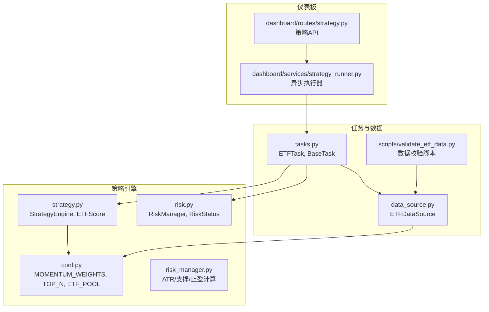
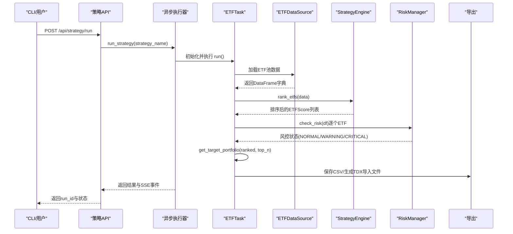
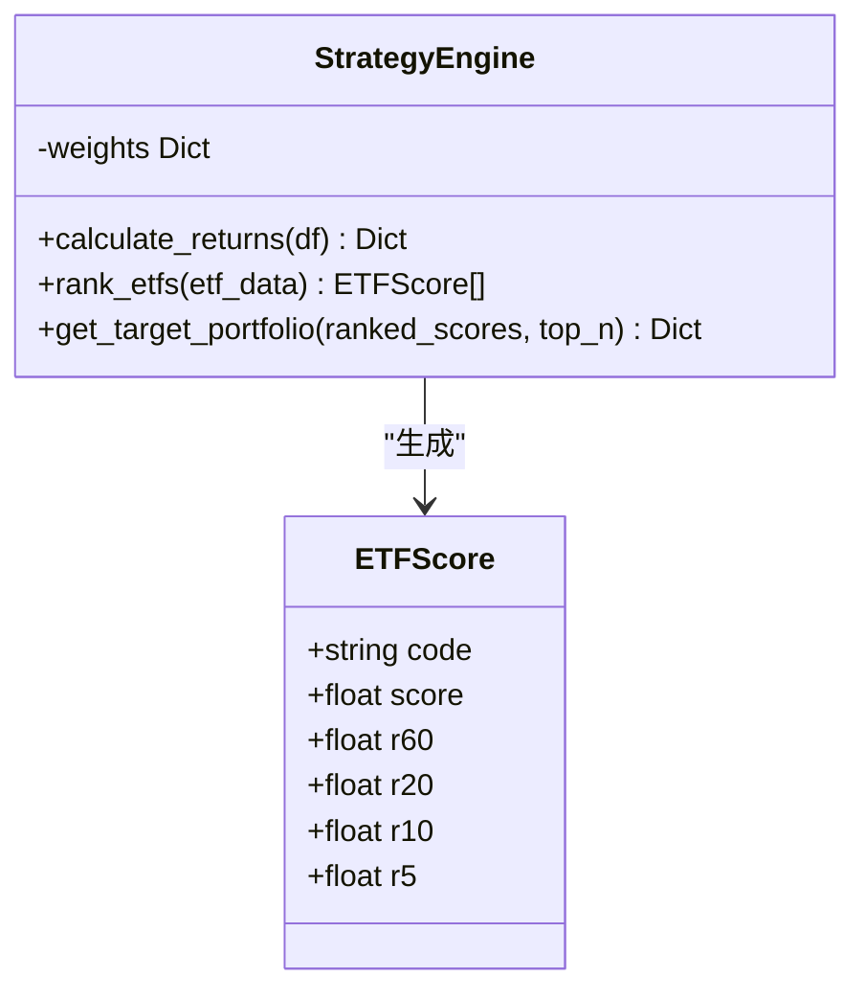
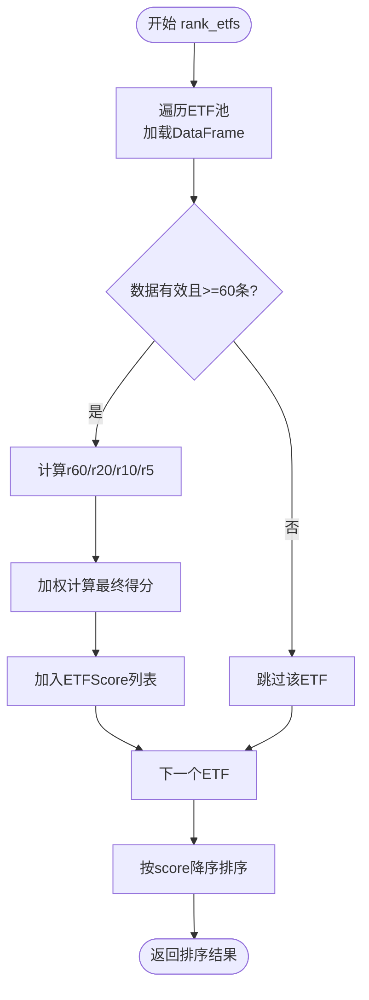
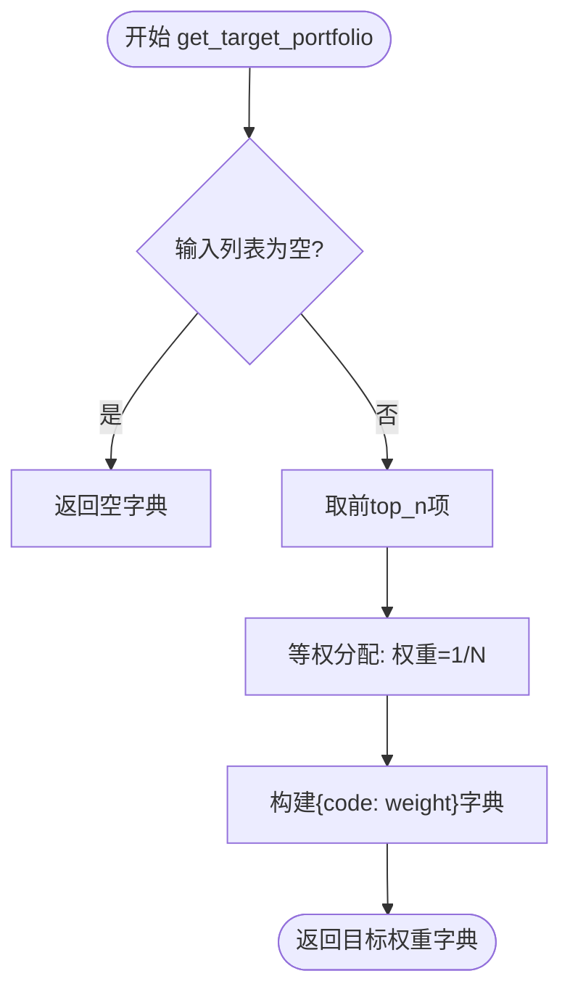
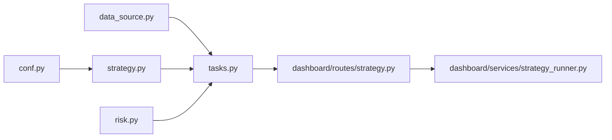

# ETF组合策略

<cite>
**本文引用的文件**
- [src/quant_etf/strategy.py](file://src/quant_etf/strategy.py)
- [src/quant_etf/conf.py](file://src/quant_etf/conf.py)
- [src/quant_etf/tasks.py](file://src/quant_etf/tasks.py)
- [src/quant_etf/data_source.py](file://src/quant_etf/data_source.py)
- [src/quant_etf/risk.py](file://src/quant_etf/risk.py)
- [src/quant_etf/risk_manager.py](file://src/quant_etf/risk_manager.py)
- [src/quant_etf/dashboard/services/strategy_runner.py](file://src/quant_etf/dashboard/services/strategy_runner.py)
- [src/quant_etf/dashboard/routes/strategy.py](file://src/quant_etf/dashboard/routes/strategy.py)
- [scripts/validate_etf_data.py](file://scripts/validate_etf_data.py)
- [tests/test_strategy.py](file://tests/test_strategy.py)
- [tests/e2e/test_strategy_e2e.py](file://tests/e2e/test_strategy_e2e.py)
- [README.md](file://README.md)
</cite>

## 目录
1. [简介](#简介)
2. [项目结构](#项目结构)
3. [核心组件](#核心组件)
4. [架构总览](#架构总览)
5. [详细组件分析](#详细组件分析)
6. [依赖分析](#依赖分析)
7. [性能考虑](#性能考虑)
8. [故障排查指南](#故障排查指南)
9. [结论](#结论)
10. [附录](#附录)

## 简介
本文件面向ETF组合策略的实现与落地，围绕动量评分系统、ETF池构建、目标持仓生成、风险控制与参数调优等方面，提供从代码级到工程实践的完整文档。重点覆盖以下内容：
- ETFScore数据结构设计与各周期收益率的计算方法
- rank_etfs方法的执行流程（数据验证、权重应用、排序逻辑）
- get_target_portfolio方法的目标持仓生成机制（等权分配、top_n参数）
- ETF池构建最佳实践与数据质量要求
- 策略参数调优指南与性能评估方法
- 风险控制机制与资产配置建议

## 项目结构
项目采用模块化组织，策略引擎位于quant_etf子包，任务编排与仪表板服务分离，便于独立运行与监控。

**图示来源**
- [src/quant_etf/strategy.py](file://src/quant_etf/strategy.py)
- [src/quant_etf/conf.py](file://src/quant_etf/conf.py)
- [src/quant_etf/tasks.py](file://src/quant_etf/tasks.py)
- [src/quant_etf/data_source.py](file://src/quant_etf/data_source.py)
- [src/quant_etf/risk.py](file://src/quant_etf/risk.py)
- [src/quant_etf/risk_manager.py](file://src/quant_etf/risk_manager.py)
- [src/quant_etf/dashboard/routes/strategy.py](file://src/quant_etf/dashboard/routes/strategy.py)
- [src/quant_etf/dashboard/services/strategy_runner.py](file://src/quant_etf/dashboard/services/strategy_runner.py)
- [scripts/validate_etf_data.py](file://scripts/validate_etf_data.py)

**章节来源**
- [README.md](file://README.md)
- [src/quant_etf/strategy.py](file://src/quant_etf/strategy.py)
- [src/quant_etf/conf.py](file://src/quant_etf/conf.py)
- [src/quant_etf/tasks.py](file://src/quant_etf/tasks.py)
- [src/quant_etf/data_source.py](file://src/quant_etf/data_source.py)
- [src/quant_etf/risk.py](file://src/quant_etf/risk.py)
- [src/quant_etf/risk_manager.py](file://src/quant_etf/risk_manager.py)
- [src/quant_etf/dashboard/routes/strategy.py](file://src/quant_etf/dashboard/routes/strategy.py)
- [src/quant_etf/dashboard/services/strategy_runner.py](file://src/quant_etf/dashboard/services/strategy_runner.py)
- [scripts/validate_etf_data.py](file://scripts/validate_etf_data.py)

## 核心组件
- 策略引擎（StrategyEngine）：负责动量因子计算、评分与排序、目标持仓生成。
- 配置中心（conf.py）：权重、ETF池、TOP_N等策略参数集中管理。
- 任务编排（tasks.py）：ETFTask封装策略执行全流程，集成数据加载、风控过滤与结果导出。
- 数据源（data_source.py）：本地TDX文件/缓存/在线回退的数据加载与新鲜度检查。
- 风控模块（risk.py）：基于历史分位数、RSI与均线的风控判断。
- 仪表板（dashboard）：策略API与异步执行器，支持SSE实时推送与结果可视化。

**章节来源**
- [src/quant_etf/strategy.py](file://src/quant_etf/strategy.py)
- [src/quant_etf/conf.py](file://src/quant_etf/conf.py)
- [src/quant_etf/tasks.py](file://src/quant_etf/tasks.py)
- [src/quant_etf/data_source.py](file://src/quant_etf/data_source.py)
- [src/quant_etf/risk.py](file://src/quant_etf/risk.py)
- [src/quant_etf/dashboard/services/strategy_runner.py](file://src/quant_etf/dashboard/services/strategy_runner.py)
- [src/quant_etf/dashboard/routes/strategy.py](file://src/quant_etf/dashboard/routes/strategy.py)

## 架构总览
ETF组合策略的执行链路从任务入口开始，加载ETF池数据，计算动量评分，应用风控过滤，生成目标持仓并导出结果，最终通过仪表板API与SSE进行可视化与告警。

**图示来源**
- [src/quant_etf/dashboard/routes/strategy.py](file://src/quant_etf/dashboard/routes/strategy.py)
- [src/quant_etf/dashboard/services/strategy_runner.py](file://src/quant_etf/dashboard/services/strategy_runner.py)
- [src/quant_etf/tasks.py](file://src/quant_etf/tasks.py)
- [src/quant_etf/data_source.py](file://src/quant_etf/data_source.py)
- [src/quant_etf/strategy.py](file://src/quant_etf/strategy.py)
- [src/quant_etf/risk.py](file://src/quant_etf/risk.py)

## 详细组件分析

### ETFScore数据结构与动量评分系统
- ETFScore包含ETF代码、综合得分以及各周期收益率r60、r20、r10、r5，便于后续导出与展示。
- 动量评分系统基于多周期收益率加权，权重来自配置中心，默认为r60:r20:r10:r5=0.1:0.2:0.3:0.4。
- 计算流程要点：
  - 数据验证：要求至少60条日线记录，否则跳过该ETF。
  - 收益率计算：取当前收盘价与60/20/10/5日前收盘价的百分比变化。
  - 加权评分：按权重对各周期收益加总得到最终得分。
  - 排序：按得分降序排列。

**图示来源**
- [src/quant_etf/strategy.py](file://src/quant_etf/strategy.py)

**章节来源**
- [src/quant_etf/strategy.py](file://src/quant_etf/strategy.py)
- [src/quant_etf/conf.py](file://src/quant_etf/conf.py)

### rank_etfs方法执行流程
- 输入：ETF池代码到DataFrame的映射（日线数据）。
- 数据验证：
  - 空数据或长度不足60条记录时跳过。
  - 异常索引访问时返回空字典。
- 收益率计算：分别计算r60、r20、r10、r5。
- 加权评分：按配置权重对各周期收益加权求和。
- 排序：按最终得分降序排列，形成ETFScore列表。

**图示来源**
- [src/quant_etf/strategy.py](file://src/quant_etf/strategy.py)

**章节来源**
- [src/quant_etf/strategy.py](file://src/quant_etf/strategy.py)
- [tests/test_strategy.py](file://tests/test_strategy.py)
- [tests/e2e/test_strategy_e2e.py](file://tests/e2e/test_strategy_e2e.py)

### get_target_portfolio目标持仓生成机制
- 输入：rank_etfs返回的ETFScore列表、top_n参数（默认来自配置）。
- 选择Top-N：取前top_n支ETF。
- 等权分配：将1.0平均分配给入选ETF，每支权重=1/top_n。
- 输出：ETF代码到目标权重的映射字典。

**图示来源**
- [src/quant_etf/strategy.py](file://src/quant_etf/strategy.py)
- [src/quant_etf/tasks.py](file://src/quant_etf/tasks.py)
- [src/quant_etf/conf.py](file://src/quant_etf/conf.py)

**章节来源**
- [src/quant_etf/strategy.py](file://src/quant_etf/strategy.py)
- [src/quant_etf/tasks.py](file://src/quant_etf/tasks.py)
- [src/quant_etf/conf.py](file://src/quant_etf/conf.py)

### ETF池构建最佳实践与数据质量要求
- ETF池来源：
  - 配置文件中的ETF_POOL作为默认池，也可在任务中动态替换。
  - 数据源优先从本地TDX文件加载，其次读取缓存，最后在线获取。
- 数据质量要求：
  - 至少60条连续日线记录（策略引擎要求）。
  - 数据新鲜度：根据工作日与盘后时间判断，避免使用过期数据。
  - 缺失或异常数据需通过校验脚本与缓存机制处理。
- 名称映射：
  - 通过data/meta/stock_code_name.json维护ETF/股票名称映射，便于导出与展示。

**章节来源**
- [src/quant_etf/conf.py](file://src/quant_etf/conf.py)
- [src/quant_etf/data_source.py](file://src/quant_etf/data_source.py)
- [scripts/validate_etf_data.py](file://scripts/validate_etf_data.py)

### 风险控制机制与资产配置建议
- 风控模块（risk.py）：
  - 基于历史分位数（>85%）与RSI（>80）识别高位风险。
  - 通过跌破MA20判断趋势破坏。
  - 综合触发CRITICAL时建议清仓或大幅减仓，WARNING时建议不加仓或止盈。
- 风险管理器（risk_manager.py）：
  - 基于ATR、近期低点、均线等技术位计算止损与止盈。
  - 提供风险等级与盈亏比评估，辅助信号更新。
- 资产配置建议：
  - 在风控级别为WARNING时，可将目标权重乘以0.5进行半仓操作。
  - 在CRITICAL时，将目标权重置为0，避免进一步损失。
  - 结合仪表板SSE事件与告警引擎，实现自动化风控联动。

**章节来源**
- [src/quant_etf/risk.py](file://src/quant_etf/risk.py)
- [src/quant_etf/risk_manager.py](file://src/quant_etf/risk_manager.py)
- [src/quant_etf/tasks.py](file://src/quant_etf/tasks.py)

## 依赖分析
- 模块耦合：
  - StrategyEngine依赖配置中心权重，与数据源解耦，便于单元测试与参数替换。
  - ETFTask串联数据源、策略引擎与风控模块，承担策略执行主流程。
  - 仪表板通过API路由与异步执行器对接，实现策略运行与结果可视化。
- 外部依赖：
  - 通达信数据（本地文件/在线）与缓存机制保证数据可用性。
  - loguru日志记录策略执行过程，便于追踪与审计。

**图示来源**
- [src/quant_etf/conf.py](file://src/quant_etf/conf.py)
- [src/quant_etf/strategy.py](file://src/quant_etf/strategy.py)
- [src/quant_etf/data_source.py](file://src/quant_etf/data_source.py)
- [src/quant_etf/tasks.py](file://src/quant_etf/tasks.py)
- [src/quant_etf/risk.py](file://src/quant_etf/risk.py)
- [src/quant_etf/dashboard/routes/strategy.py](file://src/quant_etf/dashboard/routes/strategy.py)
- [src/quant_etf/dashboard/services/strategy_runner.py](file://src/quant_etf/dashboard/services/strategy_runner.py)

**章节来源**
- [src/quant_etf/strategy.py](file://src/quant_etf/strategy.py)
- [src/quant_etf/tasks.py](file://src/quant_etf/tasks.py)
- [src/quant_etf/data_source.py](file://src/quant_etf/data_source.py)
- [src/quant_etf/dashboard/services/strategy_runner.py](file://src/quant_etf/dashboard/services/strategy_runner.py)
- [src/quant_etf/dashboard/routes/strategy.py](file://src/quant_etf/dashboard/routes/strategy.py)

## 性能考虑
- 计算复杂度：
  - 单ETF收益率计算为O(1)，对N支ETF的评分与排序为O(N) + O(N log N)。
  - 风控检查对每支ETF执行滚动窗口计算，整体为O(N·D)，D为窗口大小。
- I/O优化：
  - 优先使用本地TDX文件与缓存，减少在线请求次数。
  - 批量加载ETF池数据，避免重复I/O。
- 并发与异步：
  - 仪表板异步执行器使用线程池并发执行多个策略任务，提升吞吐。
- 内存与稳定性：
  - 对空数据与索引越界进行显式保护，避免异常中断。
  - 使用权重归一化与日志警告，确保权重配置错误时仍可稳定运行。

[本节为通用指导，无需特定文件引用]

## 故障排查指南
- 数据加载失败：
  - 检查TDX数据目录配置与环境变量，确认本地文件存在。
  - 使用数据校验脚本输出关键信息，定位空数据或异常行数。
- 策略无结果：
  - 确认ETF池数据长度≥60条，否则会被策略引擎跳过。
  - 检查权重配置是否归一化，日志中会提示权重和非1.0的情况。
- 风控误判：
  - 调整高位阈值（历史分位数）与RSI阈值，或放宽均线穿越条件。
  - 结合ATR与技术位支撑，避免单一指标导致的误判。
- 仪表板无结果：
  - 检查策略API路由与异步执行器状态，确认CSV结果已生成。
  - 通过SSE事件确认策略执行完成与告警触发情况。

**章节来源**
- [src/quant_etf/data_source.py](file://src/quant_etf/data_source.py)
- [scripts/validate_etf_data.py](file://scripts/validate_etf_data.py)
- [src/quant_etf/strategy.py](file://src/quant_etf/strategy.py)
- [src/quant_etf/risk.py](file://src/quant_etf/risk.py)
- [src/quant_etf/dashboard/routes/strategy.py](file://src/quant_etf/dashboard/routes/strategy.py)
- [src/quant_etf/dashboard/services/strategy_runner.py](file://src/quant_etf/dashboard/services/strategy_runner.py)

## 结论
ETF组合策略以简洁的多周期动量评分为核心，结合风控过滤与等权分配，形成可配置、可监控、可扩展的自动化体系。通过仪表板与SSE实现策略执行的可视化与告警联动，配合数据校验与参数调优，可在不同市场环境下稳定运行并持续优化。

[本节为总结性内容，无需特定文件引用]

## 附录

### 策略参数调优指南
- 动量权重（MOMENTUM_WEIGHTS）：
  - 长期趋势跟踪：提高r60权重，降低r5权重。
  - 短期轮动：提高r5与r10权重，降低r60权重。
- 持仓数量（TOP_N）：
  - 市场波动大时减少N，降低集中度风险。
  - 市场趋势明确时增加N，扩大复利空间。
- 风控阈值：
  - 提高历史分位数阈值或RSI阈值，增强风控敏感度。
  - 调整均线周期与ATR窗口，适配不同ETF特性。

**章节来源**
- [src/quant_etf/conf.py](file://src/quant_etf/conf.py)
- [src/quant_etf/risk.py](file://src/quant_etf/risk.py)
- [src/quant_etf/risk_manager.py](file://src/quant_etf/risk_manager.py)

### 性能评估方法
- 回测框架（建议）：
  - 基于历史日线数据，按策略参数组合进行多组回测。
  - 关键指标：年化收益、最大回撤、夏普比率、胜率、收益回撤比。
- 实盘监控：
  - 仪表板展示策略执行进度与结果，结合SSE事件进行实时告警。
  - 定期对比目标权重与实际持仓，评估跟踪误差与换手成本。

[本节为通用指导，无需特定文件引用]