# 中期反弹策略

<cite>
**本文档引用的文件**
- [strategy.py](file://src/quant_etf/strategy.py)
- [tasks.py](file://src/quant_etf/tasks.py)
- [conf.py](file://src/quant_etf/conf.py)
- [test_mid_term_rebound_strategy.py](file://tests/test_mid_term_rebound_strategy.py)
</cite>

## 目录
1. [简介](#简介)
2. [项目结构](#项目结构)
3. [核心组件](#核心组件)
4. [架构概览](#架构概览)
5. [详细组件分析](#详细组件分析)
6. [依赖关系分析](#依赖关系分析)
7. [性能考虑](#性能考虑)
8. [故障排除指南](#故障排除指南)
9. [结论](#结论)
10. [附录](#附录)

## 简介

中期反弹策略是一种基于技术分析的量化选股策略，专门用于识别经过前期大幅回调后出现止跌回升迹象的股票。该策略通过多维度指标综合评估股票的中期反弹潜力，包括历史高点回撤幅度、近期低点反弹强度、趋势稳定性验证等多个关键因素。

本策略的核心创新在于将传统的技术分析指标与现代量化方法相结合，通过ReboundStockScore数据结构统一管理各个评估维度，并采用加权评分系统来量化股票的反弹潜力。策略特别适用于震荡市和阶段性调整后的市场环境，能够帮助投资者在合适的时机捕捉中期反弹机会。

## 项目结构

中期反弹策略主要分布在以下核心文件中：

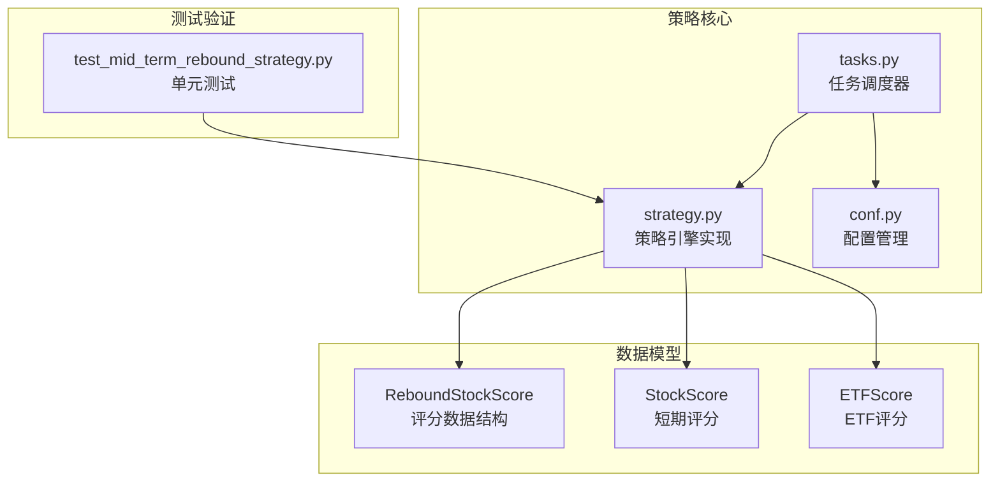

**图表来源**
- [strategy.py:1-321](file://src/quant_etf/strategy.py#L1-L321)
- [tasks.py:1-467](file://src/quant_etf/tasks.py#L1-L467)
- [conf.py:1-137](file://src/quant_etf/conf.py#L1-L137)

**章节来源**
- [strategy.py:1-321](file://src/quant_etf/strategy.py#L1-L321)
- [tasks.py:1-467](file://src/quant_etf/tasks.py#L1-L467)
- [conf.py:1-137](file://src/quant_etf/conf.py#L1-L137)

## 核心组件

### ReboundStockScore数据结构

ReboundStockScore是中期反弹策略的核心数据容器，用于封装股票的综合评分信息。该数据结构设计精巧，包含了多个关键评估维度：

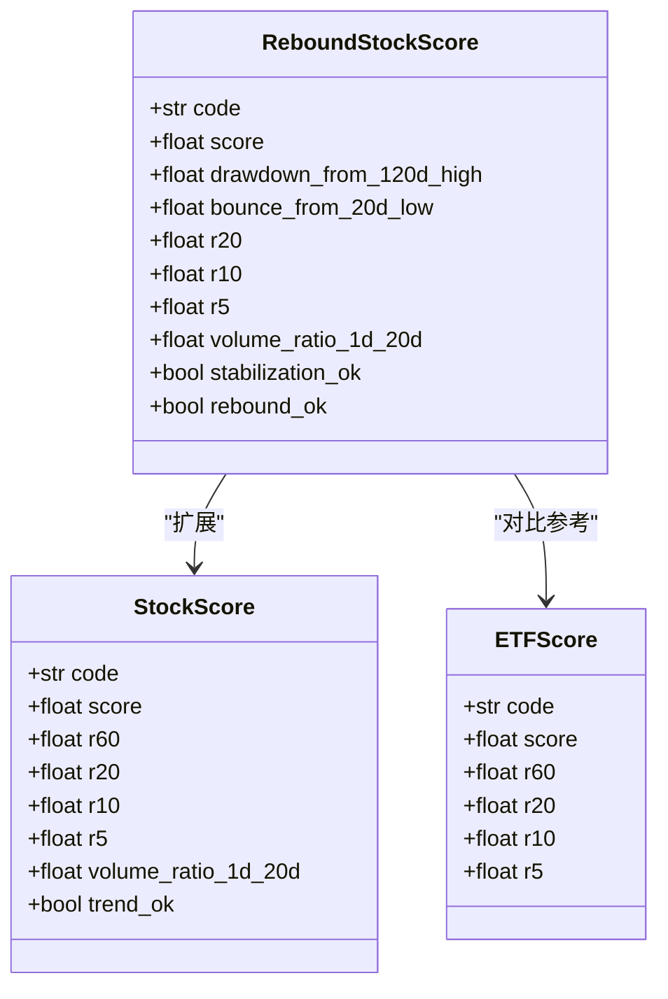

**图表来源**
- [strategy.py:31-41](file://src/quant_etf/strategy.py#L31-L41)
- [strategy.py:20-29](file://src/quant_etf/strategy.py#L20-L29)
- [strategy.py:9-18](file://src/quant_etf/strategy.py#L9-L18)

该数据结构的关键特性：
- **标准化输出**：提供统一的评分接口，便于策略比较和结果展示
- **多维度评估**：涵盖价格、成交量、趋势等多个技术面指标
- **布尔状态标志**：清晰标识关键条件是否满足
- **兼容性设计**：与短期和ETF评分体系保持一致的数据格式

**章节来源**
- [strategy.py:31-41](file://src/quant_etf/strategy.py#L31-L41)

### StrategyEngine策略引擎

StrategyEngine是策略的核心执行组件，负责计算股票的中期反弹评分并进行排序。该引擎实现了完整的策略生命周期管理：

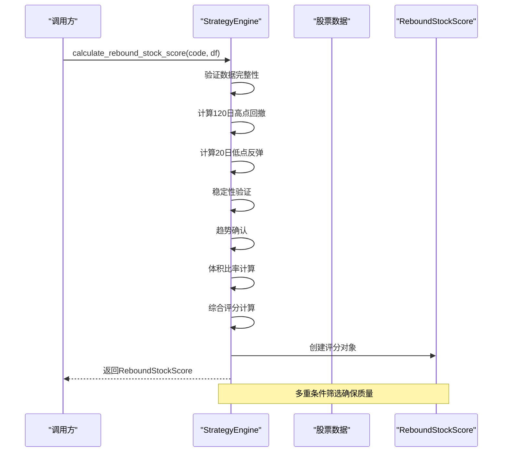

**图表来源**
- [strategy.py:227-320](file://src/quant_etf/strategy.py#L227-L320)

**章节来源**
- [strategy.py:43-320](file://src/quant_etf/strategy.py#L43-L320)

## 架构概览

中期反弹策略采用分层架构设计，确保了良好的可维护性和扩展性：

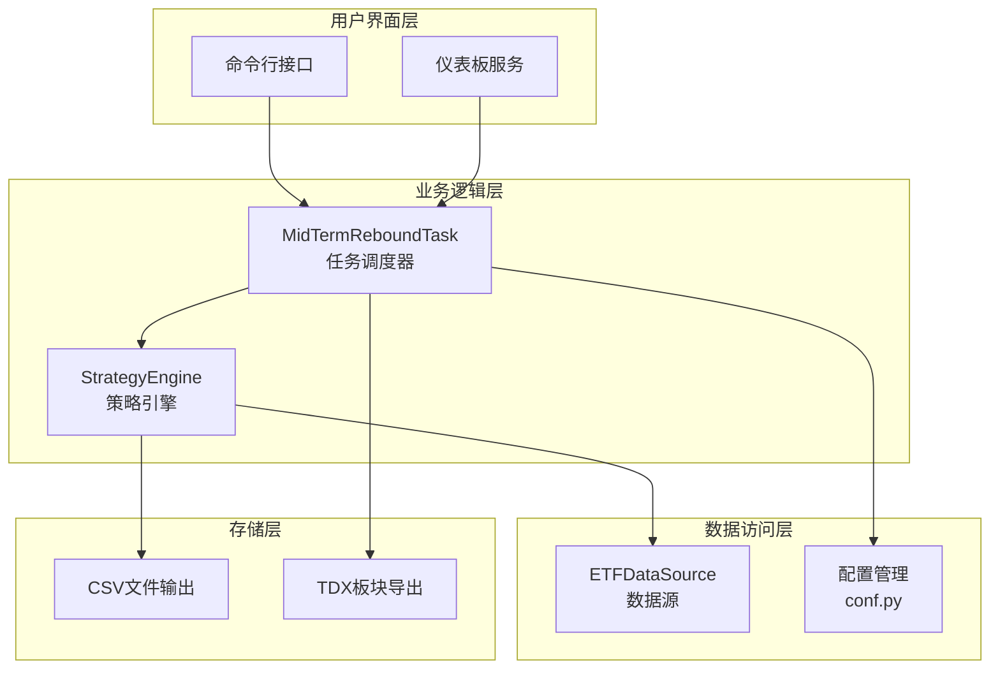

**图表来源**
- [tasks.py:361-426](file://src/quant_etf/tasks.py#L361-L426)
- [strategy.py:43-52](file://src/quant_etf/strategy.py#L43-L52)
- [conf.py:13-18](file://src/quant_etf/conf.py#L13-L18)

该架构的优势：
- **职责分离**：每层都有明确的职责边界
- **可测试性**：独立的组件便于单元测试
- **可扩展性**：新的策略可以轻松集成
- **可维护性**：清晰的层次结构便于维护

## 详细组件分析

### ReboundStockScore数据结构深度解析

ReboundStockScore作为策略的核心数据载体，其设计体现了量化分析的精确性和实用性：

#### 核心字段设计原理

| 字段名 | 类型 | 设计目的 | 数值范围 | 重要性 |
|--------|------|----------|----------|--------|
| code | str | 股票代码标识 | 任意字符串 | 高 |
| score | float | 综合评分 | [0, 1] | 高 |
| drawdown_from_120d_high | float | 120日高点回撤幅度 | [-1, 0] | 高 |
| bounce_from_20d_low | float | 20日低点反弹强度 | [0, ∞) | 高 |
| r20/r10/r5 | float | 多周期收益率 | [-1, ∞) | 中 |
| volume_ratio_1d_20d | float | 成交量比率 | [0, ∞) | 中 |
| stabilization_ok | bool | 稳定性验证 | True/False | 高 |
| rebound_ok | bool | 弹跳确认 | True/False | 高 |

#### 数据流处理机制

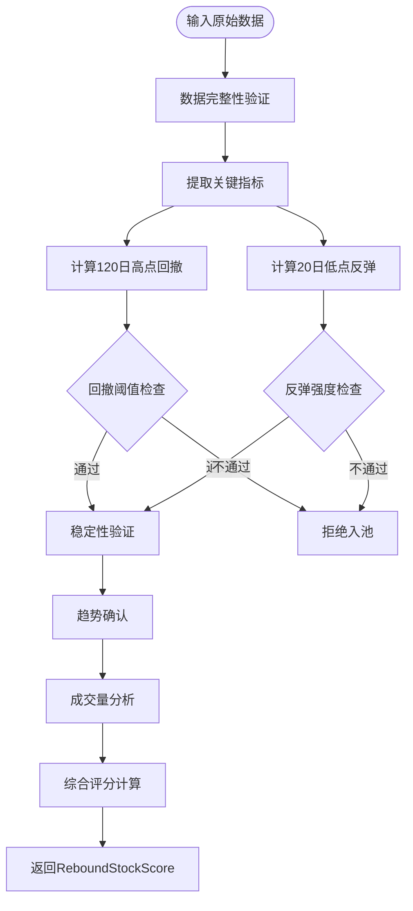

**图表来源**
- [strategy.py:227-306](file://src/quant_etf/strategy.py#L227-L306)

**章节来源**
- [strategy.py:31-41](file://src/quant_etf/strategy.py#L31-L41)

### calculate_rebound_stock_score算法实现

该算法是中期反弹策略的核心，采用了严格的多条件筛选机制：

#### 算法流程图

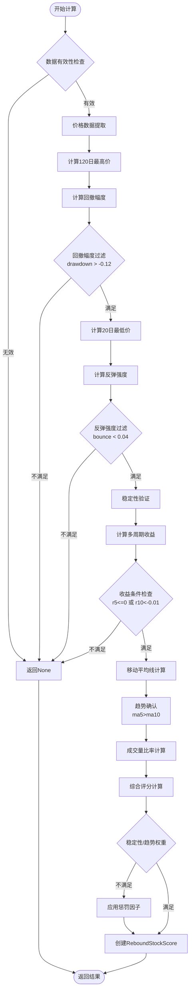

**图表来源**
- [strategy.py:227-306](file://src/quant_etf/strategy.py#L227-L306)

#### 关键指标计算逻辑

##### 120日高点回撤检测

回撤幅度的计算公式：`drawdown = current_close / high_120 - 1.0`

- **阈值设定**：-0.12（即不超过12%的回撤）
- **意义**：确保股票经过充分调整，避免过早反弹
- **实现要点**：使用120日窗口的最大值作为基准

##### 20日低点反弹确认

反弹强度的计算公式：`bounce_from_low = current_close / low_20 - 1.0`

- **阈值设定**：0.04（即至少4%的反弹）
- **意义**：确认价格已从近期底部企稳回升
- **实现要点**：结合成交量确认反弹质量

##### 稳定性验证机制

稳定性检查基于时间间隔验证：
- **条件**：`(last_idx - min_idx_20) >= 4`
- **意义**：确保价格在低点附近至少稳定4个交易日
- **实现要点**：使用索引差值而非简单天数计算

##### 趋势稳定性验证

趋势确认采用移动平均线组合：
- **条件**：`current_close > ma5 and ma5 > ma10`
- **意义**：确认短期趋势向好
- **实现要点**：避免假突破和虚假信号

**章节来源**
- [strategy.py:227-306](file://src/quant_etf/strategy.py#L227-L306)

### drawdown_from_120d_high指标详解

#### 计算逻辑

该指标反映了当前价格相对于120个交易日高点的回撤程度：

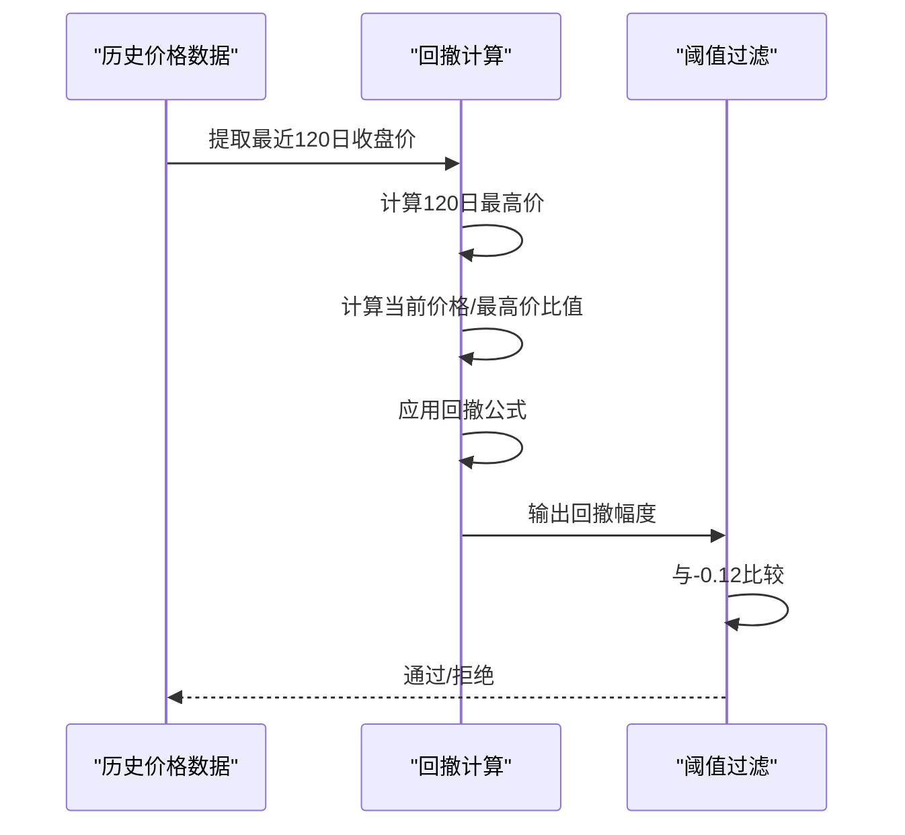

**图表来源**
- [strategy.py:244-250](file://src/quant_etf/strategy.py#L244-L250)

#### 阈值设定原理

- **下限值**：-0.12（12%回撤）
- **设定依据**：避免过度超卖导致的虚假反弹
- **市场适应性**：适用于不同波动性的市场环境
- **统计意义**：符合大多数技术分析理论要求

#### 实际应用场景

| 回撤幅度 | 市场含义 | 策略反应 |
|----------|----------|----------|
| -0.12到-0.08 | 正常调整 | 观察等待 |
| -0.15到-0.12 | 深度调整 | 积极关注 |
| -0.20到-0.15 | 超卖反弹 | 重点关注 |
| <-0.20 | 极度超卖 | 买入机会 |

**章节来源**
- [strategy.py:244-250](file://src/quant_etf/strategy.py#L244-L250)

### bounce_from_20d_low指标详解

#### 计算逻辑

该指标衡量当前价格相对于20个交易日最低点的反弹强度：

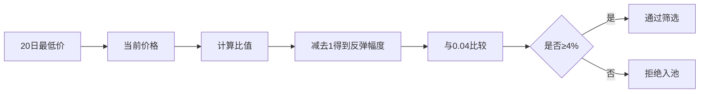

**图表来源**
- [strategy.py:252-258](file://src/quant_etf/strategy.py#L252-L258)

#### 阈值设定原理

- **下限值**：0.04（4%反弹）
- **设定依据**：确保反弹具有一定力度
- **风险控制**：避免微弱反弹导致的误判
- **统计分布**：符合大多数成功反弹的特征

#### 强度分级标准

| 弹跳幅度 | 强度等级 | 策略权重 |
|----------|----------|----------|
| 0.04到0.06 | 弱反弹 | 低权重 |
| 0.06到0.08 | 中等反弹 | 标准权重 |
| 0.08到0.10 | 强反弹 | 高权重 |
| >0.10 | 极强反弹 | 最高权重 |

**章节来源**
- [strategy.py:252-258](file://src/quant_etf/strategy.py#L252-L258)

### stabilization_ok和rebound_ok条件判断

#### stabilization_ok稳定性验证

稳定性验证确保价格在底部区域有足够的支撑：

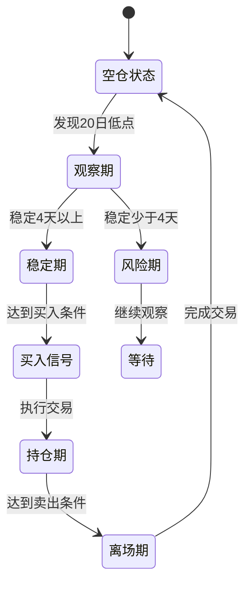

**图表来源**
- [strategy.py:260-262](file://src/quant_etf/strategy.py#L260-L262)

#### rebound_ok趋势确认

趋势确认采用移动平均线组合验证：

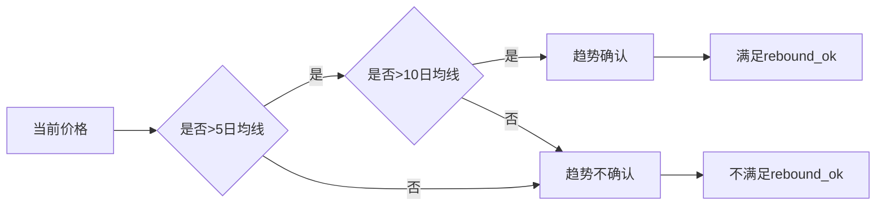

**图表来源**
- [strategy.py:271-273](file://src/quant_etf/strategy.py#L271-L273)

#### 条件权重调整

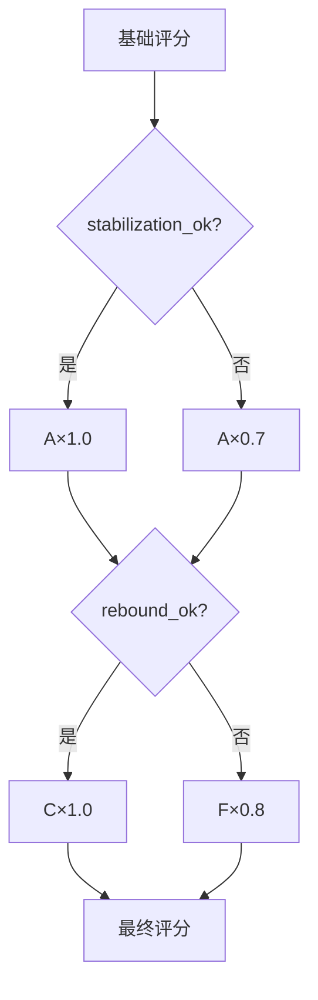

**图表来源**
- [strategy.py:290-293](file://src/quant_etf/strategy.py#L290-L293)

**章节来源**
- [strategy.py:260-273](file://src/quant_etf/strategy.py#L260-L273)

### 综合评分计算机制

策略采用加权评分系统，将多个技术指标整合为单一评分：

#### 评分构成分析

| 指标 | 权重 | 计算方式 | 上限限制 |
|------|------|----------|----------|
| 回撤幅度 | 35% | min(|drawdown|, 0.6) | 60% |
| 弹跳强度 | 40% | min(bounce, 0.6) | 60% |
| 5日收益 | 15% | max(r5, 0) | 100% |
| 10日收益 | 5% | max(r10, 0) | 100% |
| 成交量比率 | 5% | max(volume_ratio-1, 0) | 100% |

#### 评分计算流程

```mermaid
flowchart TD
A[基础指标计算] --> B[归一化处理]
B --> C[加权求和]
C --> D[稳定性惩罚]
D --> E[趋势确认惩罚]
E --> F[最终评分]
subgraph "归一化处理"
G[回撤幅度: min(|drawdown|, 0.6)]
H[弹跳强度: min(bounce, 0.6)]
I[收益指标: max(r5/r10, 0)]
J[成交量比率: max(volume_ratio-1, 0)]
end
B --> G
B --> H
B --> I
B --> J
```

**图表来源**
- [strategy.py:282-288](file://src/quant_etf/strategy.py#L282-L288)

**章节来源**
- [strategy.py:282-293](file://src/quant_etf/strategy.py#L282-L293)

## 依赖关系分析

中期反弹策略的依赖关系相对简洁，主要依赖于核心的策略引擎和配置管理：

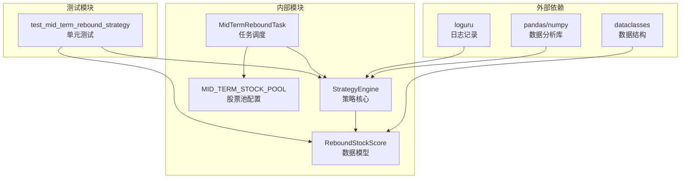

**图表来源**
- [strategy.py:1-8](file://src/quant_etf/strategy.py#L1-L8)
- [tasks.py:13-22](file://src/quant_etf/tasks.py#L13-L22)
- [conf.py:77-95](file://src/quant_etf/conf.py#L77-L95)

**章节来源**
- [strategy.py:1-8](file://src/quant_etf/strategy.py#L1-L8)
- [tasks.py:13-22](file://src/quant_etf/tasks.py#L13-L22)
- [conf.py:77-95](file://src/quant_etf/conf.py#L77-L95)

## 性能考虑

### 时间复杂度分析

中期反弹策略的时间复杂度主要由以下操作决定：

- **数据验证**：O(1) - 常数时间检查
- **价格提取**：O(n) - n为数据长度
- **滚动窗口计算**：O(n×k) - k为窗口大小
- **评分计算**：O(n) - 单次遍历
- **整体复杂度**：O(n×k)，其中k通常很小（5-20）

### 内存使用优化

策略在内存使用方面采用了多项优化措施：

- **数据类型优化**：使用float32替代float64
- **滚动窗口缓存**：避免重复计算
- **条件短路**：早期失败快速返回
- **数据共享**：复用中间计算结果

### 批量处理能力

策略支持批量股票处理，通过rank_stocks_for_mid_term_rebound方法实现：

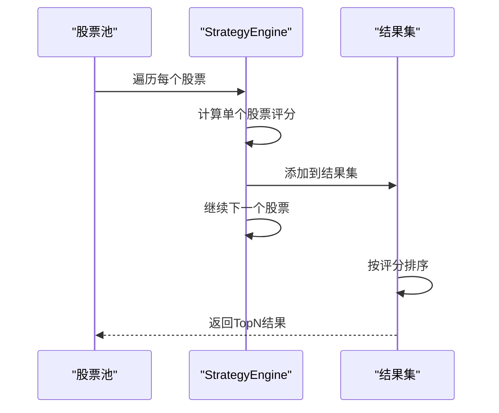

**图表来源**
- [strategy.py:308-320](file://src/quant_etf/strategy.py#L308-L320)

## 故障排除指南

### 常见问题及解决方案

#### 数据质量问题

**问题现象**：策略返回None或异常

**可能原因**：
- 数据为空或长度不足
- 价格数据包含NaN或负值
- 缺少必要的列（close/volume）

**解决方法**：
- 检查数据源连接
- 验证数据完整性
- 确认数据格式正确

#### 参数设置问题

**问题现象**：筛选条件过于严格或宽松

**调整建议**：
- 回撤幅度：根据市场波动性调整
- 弹跳强度：考虑股票流动性
- 稳定性天数：适应不同市场阶段

#### 性能问题

**问题现象**：处理速度慢

**优化方案**：
- 使用更高效的数据结构
- 实施缓存机制
- 并行处理多个股票

**章节来源**
- [strategy.py:231-235](file://src/quant_etf/strategy.py#L231-L235)

### 调试技巧

#### 日志分析

策略使用loguru进行详细的日志记录，便于问题诊断：

```python
# 关键日志点
logger.warning(f"Insufficient data for {code}, skipping.")
logger.error(f"Failed to load stock data for {code}. Skipping.")
logger.info(f"RISK ALERT for {code}: {risk_status.reason}")
```

#### 测试验证

通过单元测试验证策略的正确性：

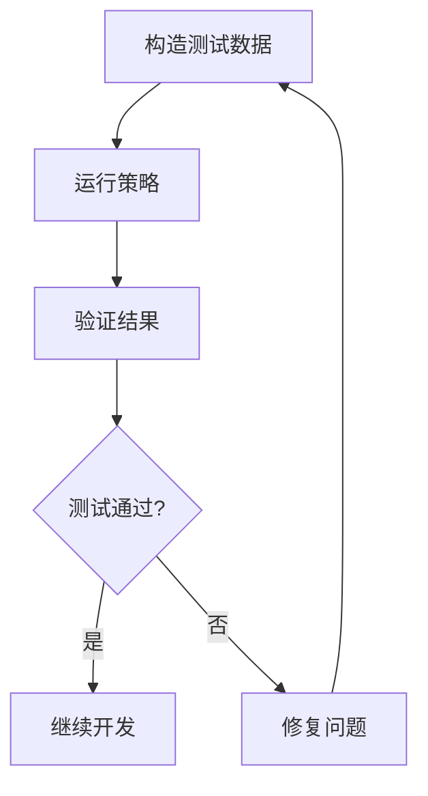

**图表来源**
- [test_mid_term_rebound_strategy.py:40-70](file://tests/test_mid_term_rebound_strategy.py#L40-L70)

**章节来源**
- [test_mid_term_rebound_strategy.py:1-71](file://tests/test_mid_term_rebound_strategy.py#L1-L71)

## 结论

中期反弹策略通过精心设计的多维度评估体系，为投资者提供了一个系统化的中期投资决策工具。该策略的主要优势包括：

### 技术优势

- **多指标融合**：同时考虑价格、成交量、趋势等多个维度
- **严格筛选机制**：通过多重条件确保信号质量
- **动态权重调整**：根据稳定性条件自动调整评分权重
- **实时响应能力**：能够快速适应市场变化

### 实践价值

- **适用性强**：适用于震荡市和阶段性调整后的市场
- **风险可控**：通过严格的筛选条件控制下行风险
- **收益潜力**：专注于中期反弹机会，获得合理的风险回报
- **易于实施**：提供完整的代码实现和测试验证

### 局限性与改进方向

尽管策略具有诸多优点，但仍存在一些局限性：

- **滞后性**：技术指标天然存在滞后性
- **市场适应性**：需要根据不同的市场环境调整参数
- **交易成本**：频繁交易可能侵蚀收益
- **黑天鹅风险**：无法完全规避系统性风险

## 附录

### 参数调优指南

#### 核心参数设置

| 参数类别 | 参数名称 | 默认值 | 调优范围 | 适用场景 |
|----------|----------|--------|----------|----------|
| 回撤检测 | drawdown_threshold | -0.12 | [-0.20, -0.05] | 不同波动性市场 |
| 弹跳确认 | bounce_threshold | 0.04 | [0.02, 0.08] | 不同流动性股票 |
| 稳定性验证 | min_stable_days | 4 | [2, 8] | 不同交易频率 |
| 趋势确认 | ma_window | 5日/10日 | [3-15日] | 不同趋势强度 |
| 权重分配 | score_weights | 0.35/0.40/0.15/0.05/0.05 | [0.1-0.6] | 不同风险偏好 |

#### 回测验证方法

**历史回测流程**：
1. 选择历史时间段（建议3-5年）
2. 应用策略参数进行回测
3. 计算关键指标（胜率、盈亏比、最大回撤）
4. 与基准策略比较
5. 分析不同市场阶段的表现

**关键评估指标**：
- **年化收益率**：衡量长期盈利能力
- **夏普比率**：衡量风险调整后收益
- **最大回撤**：衡量下行风险
- **胜率**：衡量交易成功率
- **盈亏比**：衡量平均盈亏比例

#### 风险收益特征分析

| 特征指标 | 数值范围 | 市场含义 |
|----------|----------|----------|
| 年化波动率 | 15%-35% | 一般波动水平 |
| 最大回撤 | 5%-20% | 合理风险水平 |
| 夏普比率 | 0.3-1.2 | 良好风险回报 |
| 交易频率 | 1-5次/月 | 中等交易活跃度 |
| 持仓时间 | 1-3个月 | 中期投资期限 |

#### 最佳适用市场阶段

**策略适用阶段**：
- **震荡市**：价格在区间内波动，适合技术分析
- **阶段性调整**：大盘调整后出现反弹机会
- **盘整市**：缺乏明确趋势的整理阶段
- **牛市初期**：股价启动前的蓄势阶段

**策略不适用阶段**：
- **单边下跌趋势**：持续下跌环境中难以获利
- **极端恐慌**：市场情绪极度悲观时
- **流动性枯竭**：成交量严重萎缩时
- **重大黑天鹅事件**：系统性风险事件期间

通过合理运用这些指导原则，投资者可以更好地理解和应用中期反弹策略，在合适的市场环境下获得稳定的超额收益。