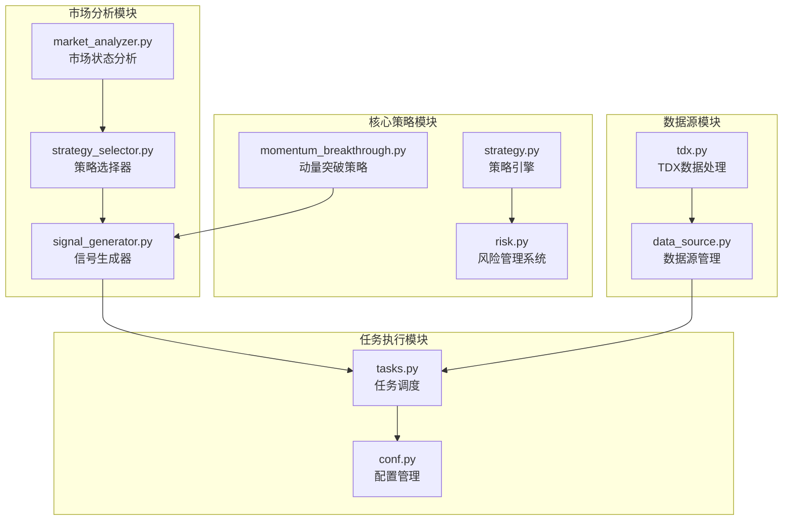
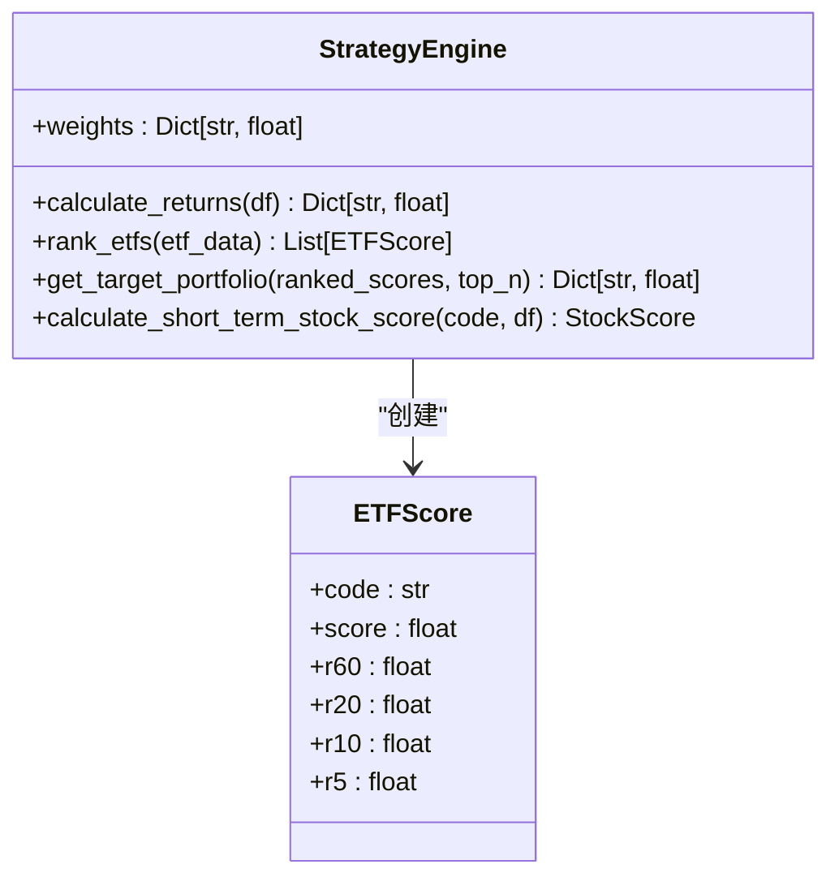
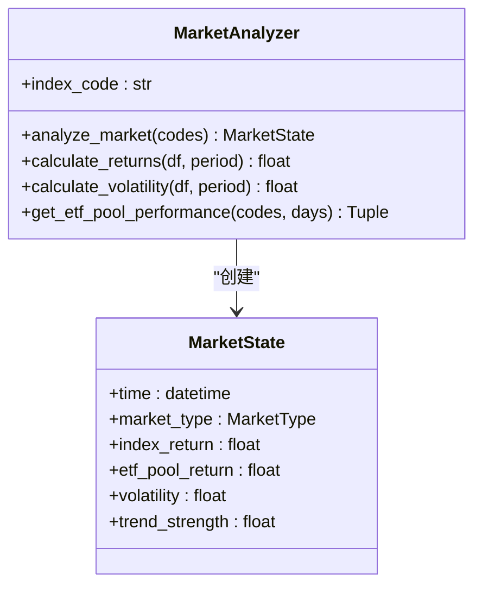
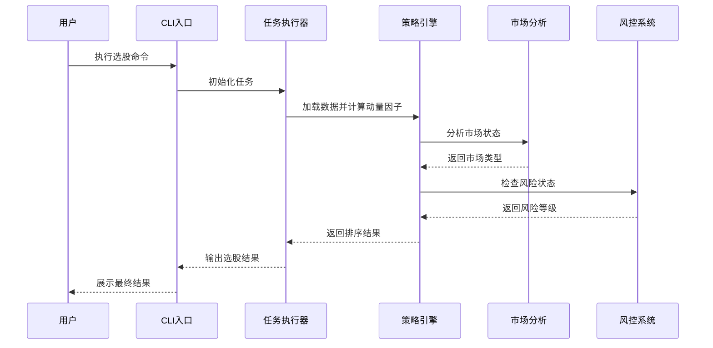
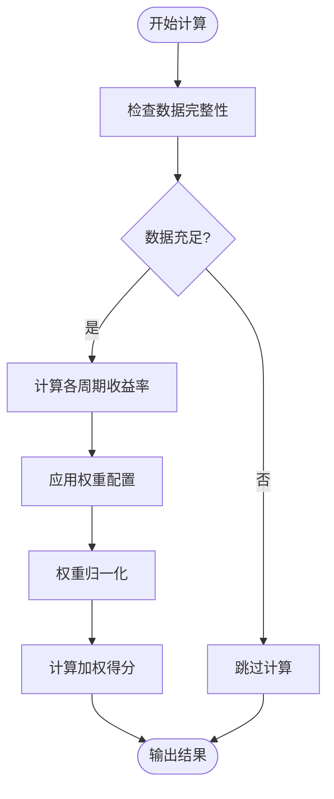
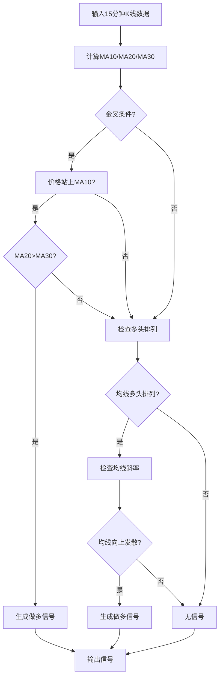
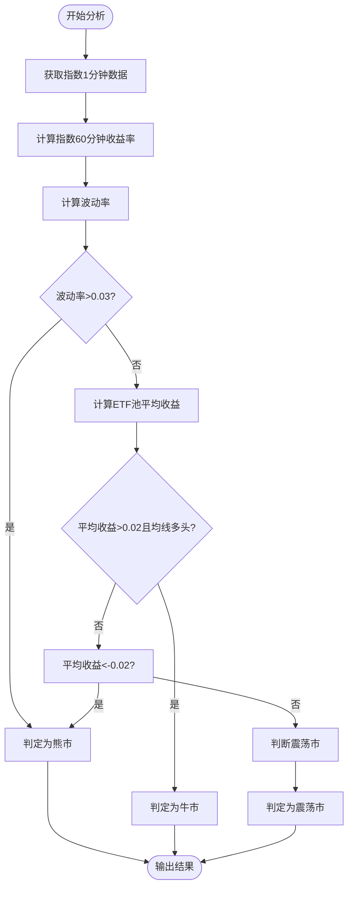
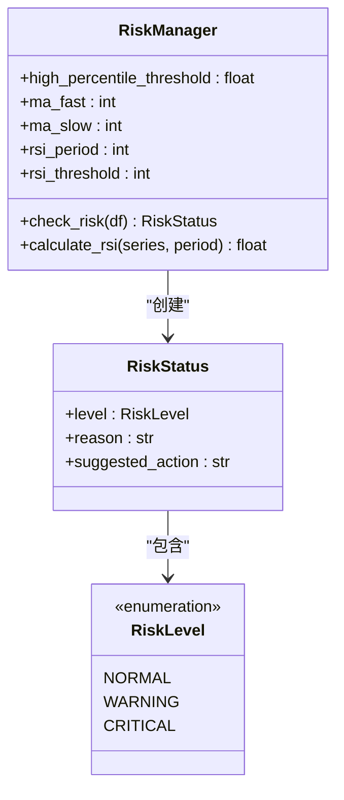
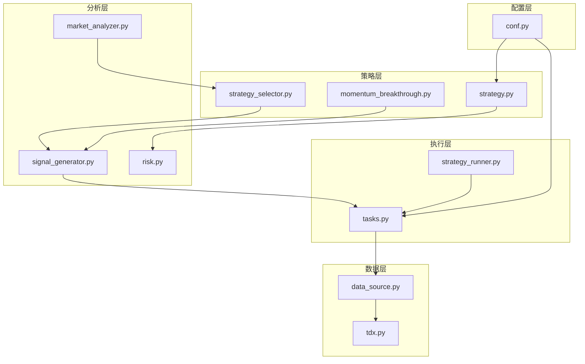

# 动量策略原理

<cite>
**本文档引用的文件**
- [momentum_breakthrough.py](file://src/quant_etf/strategies/momentum_breakthrough.py)
- [strategy.py](file://src/quant_etf/strategy.py)
- [conf.py](file://src/quant_etf/conf.py)
- [tasks.py](file://src/quant_etf/tasks.py)
- [market_analyzer.py](file://src/quant_etf/market_analyzer.py)
- [signal_generator.py](file://src/quant_etf/signal_generator.py)
- [strategy_selector.py](file://src/quant_etf/strategy_selector.py)
- [risk.py](file://src/quant_etf/risk.py)
- [README.md](file://README.md)
- [design.md](file://docs/design.md)
- [analysis.md](file://docs/analysis.md)
</cite>

## 目录
1. [简介](#简介)
2. [项目结构](#项目结构)
3. [核心组件](#核心组件)
4. [架构概览](#架构概览)
5. [详细组件分析](#详细组件分析)
6. [依赖关系分析](#依赖关系分析)
7. [性能考虑](#性能考虑)
8. [故障排除指南](#故障排除指南)
9. [结论](#结论)

## 简介

本项目是一个基于动量策略的ETF量化选股工具，专注于实现多周期动量因子的有效组合和风险管理。动量策略的核心思想是"赢家持续上涨，输家继续下跌"，通过量化分析历史价格走势来预测未来短期价格表现。

项目实现了完整的动量因子体系，包括60日、20日、10日、5日收益率的计算和加权组合，结合市场状态分析和风险控制系统，为ETF投资提供科学的决策支持。

## 项目结构

项目采用模块化分层架构，主要包含以下核心模块：



**图表来源**
- [strategy.py:1-321](file://src/quant_etf/strategy.py#L1-L321)
- [momentum_breakthrough.py:1-187](file://src/quant_etf/strategies/momentum_breakthrough.py#L1-L187)
- [market_analyzer.py:1-263](file://src/quant_etf/market_analyzer.py#L1-L263)

**章节来源**
- [README.md:253-276](file://README.md#L253-L276)
- [analysis.md:24-59](file://docs/analysis.md#L24-L59)

## 核心组件

### 动量因子计算引擎

策略引擎是整个系统的核心，负责计算多周期动量因子并进行加权组合：



**图表来源**
- [strategy.py:43-140](file://src/quant_etf/strategy.py#L43-L140)
- [strategy.py:9-18](file://src/quant_etf/strategy.py#L9-L18)

### 市场状态分析系统

市场分析器根据沪深300指数和ETF池的整体表现判断当前市场状态：



**图表来源**
- [market_analyzer.py:46-213](file://src/quant_etf/market_analyzer.py#L46-L213)
- [market_analyzer.py:30-44](file://src/quant_etf/market_analyzer.py#L30-L44)

**章节来源**
- [strategy.py:43-140](file://src/quant_etf/strategy.py#L43-L140)
- [market_analyzer.py:46-213](file://src/quant_etf/market_analyzer.py#L46-L213)

## 架构概览

系统采用分层架构设计，实现了从数据获取到策略执行的完整流程：



**图表来源**
- [tasks.py:114-159](file://src/quant_etf/tasks.py#L114-L159)
- [strategy.py:103-140](file://src/quant_etf/strategy.py#L103-L140)
- [market_analyzer.py:159-213](file://src/quant_etf/market_analyzer.py#L159-L213)

## 详细组件分析

### 动量因子计算与权重配置

#### 时间序列分析中的动量效应

项目实现了经典的多周期动量因子组合，基于以下理论基础：

1. **60日动量因子 (r60)**: 反映中期趋势，适合识别稳定的长期上涨趋势
2. **20日动量因子 (r20)**: 反映中期趋势变化，捕捉趋势转折点
3. **10日动量因子 (r10)**: 反映短期趋势，捕捉快速价格变化
4. **5日动量因子 (r5)**: 反映超短期动量，捕捉市场情绪变化

#### 权重配置的数学原理

默认权重配置为：r60: 0.1, r20: 0.2, r10: 0.3, r5: 0.4

这种配置体现了以下数学原理：



**图表来源**
- [strategy.py:61-94](file://src/quant_etf/strategy.py#L61-L94)
- [strategy.py:122-127](file://src/quant_etf/strategy.py#L122-L127)

#### 归一化处理机制

权重系统实现了自动归一化处理，确保权重总和为1：

```python
# 权重归一化处理
total = sum(self.weights.values())
if abs(total - 1.0) > 1e-6:
    logger.warning(f"Weights do not sum to 1.0: {total}, re-normalizing...")
    for k in self.weights:
        self.weights[k] /= total
```

**章节来源**
- [strategy.py:44-60](file://src/quant_etf/strategy.py#L44-L60)
- [conf.py:118-125](file://src/quant_etf/conf.py#L118-L125)

### 动量突破策略实现

#### 均线系统与信号生成

动量突破策略使用10/20/30均线系统，通过均线交叉和价格突破产生交易信号：



**图表来源**
- [momentum_breakthrough.py:71-162](file://src/quant_etf/strategies/momentum_breakthrough.py#L71-L162)

#### 信号评分机制

策略实现了多层次的信号评分系统：

| 信号类型 | 评分计算 | 触发条件 |
|---------|---------|---------|
| 金叉突破 | 0.8 + 0.2*(MA10-MA20)/MA20 | MA10上穿MA20且价格站上MA10且MA20>MA30 |
| 多头排列 | 0.7 + 0.2*(MA10-MA20)/MA20 | 均线多头排列且向上发散 |
| 斜率增强 | +0.1（若MA10斜率为正） | 均线向上发散 |

**章节来源**
- [momentum_breakthrough.py:108-160](file://src/quant_etf/strategies/momentum_breakthrough.py#L108-L160)

### 市场状态分析与策略适配

#### 市场类型判断逻辑

系统根据多个指标综合判断市场状态：



**图表来源**
- [market_analyzer.py:159-213](file://src/quant_etf/market_analyzer.py#L159-L213)
- [market_analyzer.py:215-249](file://src/quant_etf/market_analyzer.py#L215-L249)

#### 策略适配机制

不同市场状态下推荐不同的策略组合：

| 市场状态 | 推荐策略 | 理由 |
|---------|---------|------|
| 牛市 | 成交量策略 | 牛市中成交量变化更能反映市场情绪 |
| 熊市 | 动量突破策略 | 熊市中趋势突破信号更可靠 |
| 震荡市 | 根据波动率选择 | 低波动时偏向成交量策略，高波动时偏向动量策略 |

**章节来源**
- [strategy_selector.py:64-79](file://src/quant_etf/strategy_selector.py#L64-L79)

### 风险管理系统

#### 风控指标体系

系统实现了多层次的风险监控机制：



**图表来源**
- [risk.py:18-96](file://src/quant_etf/risk.py#L18-L96)
- [risk.py:7-17](file://src/quant_etf/risk.py#L7-L17)

#### 风控触发逻辑

系统采用"高位+趋势破坏"的双重确认机制：

1. **高位判断**：当前价格处于历史分位数85%以上或RSI>80
2. **趋势破坏**：价格跌破20日均线
3. **综合判断**：两个条件同时满足触发严重风险

**章节来源**
- [risk.py:39-95](file://src/quant_etf/risk.py#L39-L95)

## 依赖关系分析

### 核心依赖关系图



**图表来源**
- [conf.py:118-125](file://src/quant_etf/conf.py#L118-L125)
- [tasks.py:13-27](file://src/quant_etf/tasks.py#L13-L27)
- [strategy_selector.py:15-25](file://src/quant_etf/strategy_selector.py#L15-L25)

### 数据流依赖

系统实现了清晰的数据流向：

1. **配置依赖**: 所有模块依赖配置文件中的权重设置
2. **策略依赖**: 策略引擎依赖风险管理系统进行风控检查
3. **分析依赖**: 市场分析器为策略选择器提供市场状态
4. **执行依赖**: 任务执行器协调各个模块的运行

**章节来源**
- [tasks.py:13-27](file://src/quant_etf/tasks.py#L13-L27)
- [strategy_selector.py:15-25](file://src/quant_etf/strategy_selector.py#L15-L25)

## 性能考虑

### 计算复杂度分析

1. **动量因子计算**: O(n) 时间复杂度，其中n为数据长度
2. **均线计算**: O(n) 时间复杂度，使用滚动窗口函数
3. **排序算法**: O(m log m) 时间复杂度，其中m为ETF数量
4. **风险检查**: O(n) 时间复杂度，包含RSI计算

### 内存优化策略

1. **数据分批处理**: 使用滚动窗口避免重复计算
2. **内存复用**: DataFrame操作使用copy()减少内存占用
3. **延迟计算**: 仅在需要时计算复杂的RSI指标

### 并行处理能力

系统支持多线程并行执行，特别是在以下场景：

- 多ETF并行分析
- 多周期数据并行计算
- 异步任务执行

## 故障排除指南

### 常见问题诊断

#### 数据加载问题

**症状**: 策略执行时报错"Insufficient data"
**解决方案**: 
1. 检查数据源连接状态
2. 验证数据完整性
3. 确认时间范围设置

#### 权重配置问题

**症状**: 权重不为1导致结果异常
**解决方案**:
1. 检查MOMENTUM_WEIGHTS配置
2. 确认权重归一化逻辑
3. 验证权重总和

#### 市场状态判断异常

**症状**: 市场类型判断错误
**解决方案**:
1. 检查沪深300指数数据
2. 验证波动率计算逻辑
3. 确认均线计算准确性

**章节来源**
- [strategy.py:113-115](file://src/quant_etf/strategy.py#L113-L115)
- [market_analyzer.py:167-180](file://src/quant_etf/market_analyzer.py#L167-L180)

## 结论

本项目成功实现了基于多周期动量因子的ETF量化选股系统，具有以下特点：

1. **理论基础扎实**: 基于行为金融学和时间序列分析的动量效应理论
2. **实现完整**: 包含因子计算、权重配置、风险控制、市场分析等完整环节
3. **可配置性强**: 支持权重调整和参数优化
4. **实用价值高**: 提供了可直接应用的投资决策支持

系统的动量因子配置体现了现代量化投资的先进理念，通过多周期组合有效平衡了趋势跟踪和市场择时的需求。配合完善的风控系统和市场状态分析，为ETF投资提供了科学、可靠的决策依据。