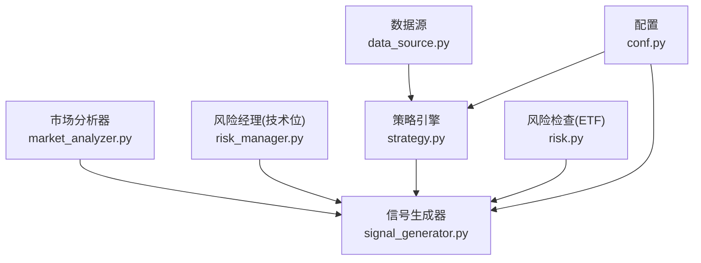
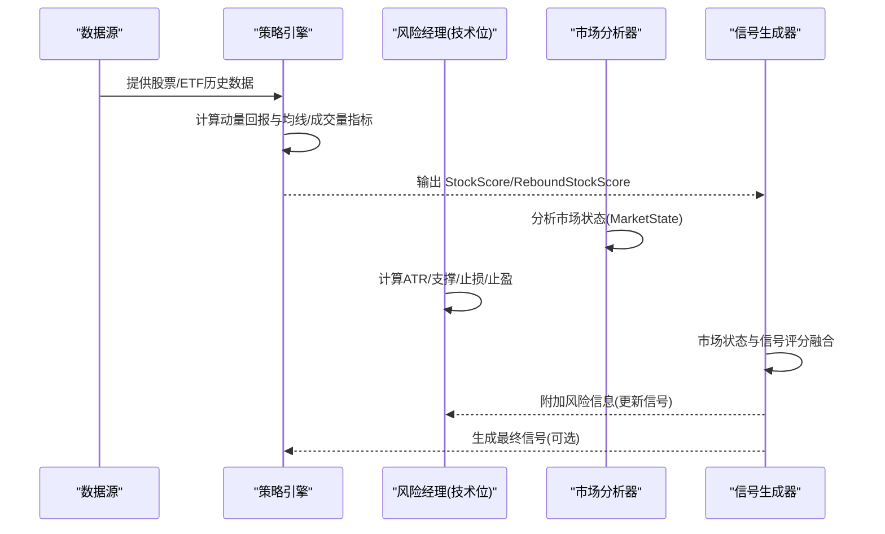
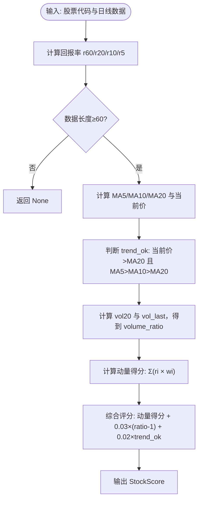
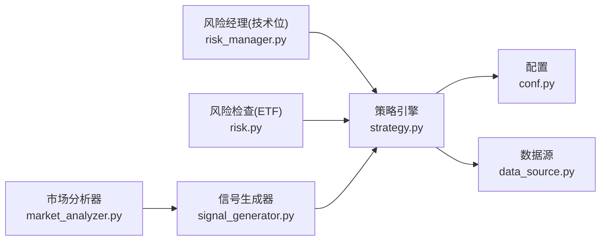

# 短线股票策略

<cite>
**本文引用的文件**
- [strategy.py](file://src/quant_etf/strategy.py)
- [risk_manager.py](file://src/quant_etf/risk_manager.py)
- [risk.py](file://src/quant_etf/risk.py)
- [market_analyzer.py](file://src/quant_etf/market_analyzer.py)
- [conf.py](file://src/quant_etf/conf.py)
- [data_source.py](file://src/quant_etf/data_source.py)
- [signal_generator.py](file://src/quant_etf/signal_generator.py)
- [momentum_breakthrough.py](file://src/quant_etf/strategies/momentum_breakthrough.py)
- [volume_price.py](file://src/quant_etf/strategies/volume_price.py)
</cite>

## 目录
1. [简介](#简介)
2. [项目结构](#项目结构)
3. [核心组件](#核心组件)
4. [架构总览](#架构总览)
5. [详细组件分析](#详细组件分析)
6. [依赖分析](#依赖分析)
7. [性能考量](#性能考量)
8. [故障排查指南](#故障排查指南)
9. [结论](#结论)
10. [附录](#附录)

## 简介
本文件面向短线股票策略的算法设计与实现，重点围绕以下目标展开：
- 深入解释 StockScore 数据结构的设计及其字段含义
- 详细分析 calculate_short_term_stock_score 方法的实现，包括均线系统、成交量过滤与动量因子的综合评分机制
- 解释短期趋势判断的逻辑，包括 MA5/MA10/MA20 的黄金交叉与死亡交叉信号
- 提供成交量异常检测的算法思路与 volume_ratio_1d_20d 指标的计算方法
- 总结策略的风险控制措施与止损机制
- 分析策略在不同市场环境下的表现特征与适应性

## 项目结构
该量化ETF项目采用模块化组织，策略相关的核心代码集中在 quant_etf/strategy.py，并通过市场分析、风险管理和信号生成器等模块协同工作，形成从数据准备到信号输出的完整流水线。

图表来源
- [data_source.py:15-381](file://src/quant_etf/data_source.py#L15-L381)
- [strategy.py:43-321](file://src/quant_etf/strategy.py#L43-L321)
- [market_analyzer.py:46-263](file://src/quant_etf/market_analyzer.py#L46-L263)
- [signal_generator.py:17-157](file://src/quant_etf/signal_generator.py#L17-L157)
- [risk_manager.py:26-185](file://src/quant_etf/risk_manager.py#L26-L185)
- [risk.py:18-96](file://src/quant_etf/risk.py#L18-L96)
- [conf.py:118-137](file://src/quant_etf/conf.py#L118-L137)

章节来源
- [strategy.py:1-321](file://src/quant_etf/strategy.py#L1-L321)
- [conf.py:1-137](file://src/quant_etf/conf.py#L1-L137)

## 核心组件
- 策略引擎 StrategyEngine：负责计算动量回报、均线与成交量指标，并生成 StockScore 与 ReboundStockScore
- 风险管理器 RiskManager：提供技术位止损、ATR止损、止盈与风险等级评估
- 市场分析器 MarketAnalyzer：基于指数与ETF池的整体表现判断市场类型（牛市/熊市/震荡市）
- 信号生成器 SignalGenerator：整合策略与市场状态，生成最终交易信号
- 数据源 ETFDataSource：提供ETF/股票历史数据的加载与缓存

章节来源
- [strategy.py:43-321](file://src/quant_etf/strategy.py#L43-L321)
- [risk_manager.py:26-185](file://src/quant_etf/risk_manager.py#L26-L185)
- [market_analyzer.py:46-263](file://src/quant_etf/market_analyzer.py#L46-L263)
- [signal_generator.py:17-157](file://src/quant_etf/signal_generator.py#L17-L157)
- [data_source.py:15-381](file://src/quant_etf/data_source.py#L15-L381)

## 架构总览
下图展示了短线策略在系统中的位置与交互关系，以及与风险管理、市场分析和信号生成的衔接。

图表来源
- [strategy.py:164-226](file://src/quant_etf/strategy.py#L164-L226)
- [risk_manager.py:104-184](file://src/quant_etf/risk_manager.py#L104-L184)
- [market_analyzer.py:159-213](file://src/quant_etf/market_analyzer.py#L159-L213)
- [signal_generator.py:28-72](file://src/quant_etf/signal_generator.py#L28-L72)

## 详细组件分析

### StockScore 数据结构设计
StockScore 是短线策略的核心输出数据结构，用于封装单只股票的综合评分与辅助判断条件。其字段设计如下：
- code：股票代码
- score：综合评分（动量+成交量+趋势项的加权合成）
- r60/r20/r10/r5：不同周期的回报率（用于动量因子）
- volume_ratio_1d_20d：当日成交量与20日均量的比值
- trend_ok：短期趋势是否满足多头排列（当前价>MA20 且 MA5>MA10>MA20）

设计要点
- 将回报率作为动量因子，便于跨周期比较与加权
- 成交量比值用于衡量放量与缩量，作为趋势确认与过滤的依据
- trend_ok 作为硬约束，剔除空头或弱趋势股票

章节来源
- [strategy.py:20-29](file://src/quant_etf/strategy.py#L20-L29)

### calculate_short_term_stock_score 实现详解
该方法是短线策略的评分中枢，包含以下步骤：
1) 计算多周期回报率（r60/r20/r10/r5）
2) 计算 MA5/MA10/MA20 并判定短期趋势（trend_ok）
3) 计算成交量比率 volume_ratio_1d_20d
4) 计算动量得分（按权重加权）
5) 综合评分：动量得分 + 成交量修正项 + 趋势修正项

关键公式与逻辑
- 趋势判断：当前收盘价大于 MA20，且 MA5 > MA10 > MA20
- 成交量比率：当日成交量 / 20日均量；当均量为非正值时，按1.0处理
- 动量得分：r60×w60 + r20×w20 + r10×w10 + r5×w5（权重来自配置）
- 综合评分：动量得分 + 0.03×(volume_ratio-1) + 0.02×(1或0)

图表来源
- [strategy.py:164-211](file://src/quant_etf/strategy.py#L164-L211)

章节来源
- [strategy.py:164-211](file://src/quant_etf/strategy.py#L164-L211)
- [conf.py:120-125](file://src/quant_etf/conf.py#L120-L125)

### 短期趋势判断：MA5/MA10/MA20 的黄金交叉与死亡交叉
策略中对短期趋势的判断采用三均线系统：
- 黄金交叉：MA5 上穿 MA10，且 MA10 上穿 MA20，同时当前价站稳在 MA20 之上
- 死亡交叉：当前价跌破 MA20 或 MA5 ≤ MA10 或 MA10 ≤ MA20

在 calculate_short_term_stock_score 中，trend_ok 即为上述条件的布尔表达式。该条件作为“趋势修正项”加入综合评分，强化多头趋势下的加分效果。

章节来源
- [strategy.py:178-183](file://src/quant_etf/strategy.py#L178-L183)

### 成交量异常检测与 volume_ratio_1d_20d 指标
成交量异常检测思路
- 使用当日成交量与20日均量的比值（volume_ratio_1d_20d）作为异常检测指标
- 正常区间：接近1.0；显著放量：ratio > 1.5；显著缩量：ratio < 0.5
- 结合趋势判断：仅在 trend_ok 为真时，放量才显著加分；缩量则抑制评分

volume_ratio_1d_20d 的计算方法
- vol20 = volume.rolling(window=20).mean().iloc[-1]
- vol_last = volume.iloc[-1]
- 若 vol20 为 NaN 或非正值，按 1.0 处理
- 否则 ratio = vol_last / vol20

章节来源
- [strategy.py:185-190](file://src/quant_etf/strategy.py#L185-L190)

### 动量因子与综合评分机制
动量因子
- r60/r20/r10/r5：分别代表60日、20日、10日、5日的回报率
- 权重来自配置（MOMENTUM_WEIGHTS），默认为 r5 > r10 > r20 > r60

综合评分
- 动量得分：Σ(ri × wi)
- 成交量修正：+0.03×(ratio-1)
- 趋势修正：+0.02×(1 if trend_ok else 0)
- 最终 score = 动量得分 + 成交量修正 + 趋势修正

章节来源
- [strategy.py:192-199](file://src/quant_etf/strategy.py#L192-L199)
- [conf.py:120-125](file://src/quant_etf/conf.py#L120-L125)

### 风险控制与止损机制
技术位止损（RiskManager）
- ATR 计算：基于真实波幅（TR）滚动均值得到
- 支撑位选择：近期低点、MA20、MA30 三者取有效且最小者
- 止损位：max(支撑位, entry_price - 2×ATR, entry_price × (1 - 固定比例))
- 止盈位：基于盈亏比 2:1，结合近期高点与止盈位取较小值
- 风险等级：根据盈亏比划分高/中/低

ETF 风险检查（RiskManager）
- 高位风险区：历史分位数 > 阈值 或 RSI 超买
- 趋势破坏：当前价跌破 MA20
- 综合判断：高位+跌破 MA20 触发严重风险，建议清仓；仅高位建议减仓

章节来源
- [risk_manager.py:38-171](file://src/quant_etf/risk_manager.py#L38-L171)
- [risk.py:39-95](file://src/quant_etf/risk.py#L39-L95)

### 市场环境适应性分析
市场分析器 MarketAnalyzer
- 指数与ETF池 1分钟K线：计算收益、波动率、短期/长期均线
- 市场类型判定：基于波动率、收益与均线排列综合判断
- 市场类型：牛市/熊市/震荡市/未知

策略适配
- 动量突破策略（均线系统）与量价配合策略更适合牛市与震荡市
- 短线策略在震荡市中更易捕捉短期脉冲，在单边行情中需注意趋势过滤

章节来源
- [market_analyzer.py:159-250](file://src/quant_etf/market_analyzer.py#L159-L250)
- [momentum_breakthrough.py:182-186](file://src/quant_etf/strategies/momentum_breakthrough.py#L182-L186)
- [volume_price.py:181-186](file://src/quant_etf/strategies/volume_price.py#L181-L186)

## 依赖分析
策略引擎与风险管理、市场分析之间的耦合关系如下：

图表来源
- [strategy.py:43-321](file://src/quant_etf/strategy.py#L43-L321)
- [risk_manager.py:26-185](file://src/quant_etf/risk_manager.py#L26-L185)
- [risk.py:18-96](file://src/quant_etf/risk.py#L18-L96)
- [market_analyzer.py:46-263](file://src/quant_etf/market_analyzer.py#L46-L263)
- [signal_generator.py:17-157](file://src/quant_etf/signal_generator.py#L17-L157)
- [data_source.py:15-381](file://src/quant_etf/data_source.py#L15-L381)
- [conf.py:118-137](file://src/quant_etf/conf.py#L118-L137)

章节来源
- [strategy.py:43-321](file://src/quant_etf/strategy.py#L43-L321)
- [risk_manager.py:26-185](file://src/quant_etf/risk_manager.py#L26-L185)
- [risk.py:18-96](file://src/quant_etf/risk.py#L18-L96)
- [market_analyzer.py:46-263](file://src/quant_etf/market_analyzer.py#L46-L263)
- [signal_generator.py:17-157](file://src/quant_etf/signal_generator.py#L17-L157)
- [data_source.py:15-381](file://src/quant_etf/data_source.py#L15-L381)
- [conf.py:118-137](file://src/quant_etf/conf.py#L118-L137)

## 性能考量
- 计算复杂度
  - 周期回报率：O(N)（N为数据长度）
  - 移动平均：O(N×窗口大小)，窗口越大越耗时
  - 成交量比率：O(N)
  - 综合评分：O(N)
- 优化建议
  - 对于长周期数据，优先使用 rolling 的 vectorized 计算
  - 在批量评分时，尽量复用中间结果（如已计算的 MA）
  - 控制窗口大小与数据长度，避免过长窗口导致内存与时间开销过大
- 数据新鲜度
  - 使用数据源的 check_is_fresh 与缓存策略，减少重复下载与解析

[本节为通用性能讨论，不直接分析具体文件]

## 故障排查指南
- 数据不足
  - 当数据长度小于60或20日均量不可用时，calculate_short_term_stock_score 返回 None
  - 建议检查数据源加载与缓存是否正常
- 趋势过滤过于严格
  - 若 trend_ok 一直为 False，可适当放宽 MA 条件或降低趋势权重
- 成交量异常
  - 当 vol20 为非正值时，ratio 按1.0处理；若出现极端 ratio，建议增加异常值处理
- 风控误判
  - ATR 计算依赖 TR，若价格跳空，需关注 TR 的计算是否合理
  - 支撑位选择应结合实际走势，必要时引入更高周期均线

章节来源
- [strategy.py:164-211](file://src/quant_etf/strategy.py#L164-L211)
- [risk_manager.py:38-126](file://src/quant_etf/risk_manager.py#L38-L126)
- [data_source.py:151-188](file://src/quant_etf/data_source.py#L151-L188)

## 结论
短线股票策略通过“动量回报 + 成交量比率 + 趋势过滤”的组合，形成稳健的短期择时框架。StockScore 将多维信号整合为单一评分，便于快速筛选与排序。配合技术位止损与市场状态分析，可在不同市场环境下动态调整策略适用性。建议在实盘中结合回测与风控参数调优，持续监控策略在不同市场阶段的表现。

[本节为总结性内容，不直接分析具体文件]

## 附录
- 关键实现路径
  - [calculate_short_term_stock_score:164-211](file://src/quant_etf/strategy.py#L164-L211)
  - [StockScore 定义:20-29](file://src/quant_etf/strategy.py#L20-L29)
  - [MOMENTUM_WEIGHTS 权重:120-125](file://src/quant_etf/conf.py#L120-L125)
  - [技术位止损 RiskManager:104-184](file://src/quant_etf/risk_manager.py#L104-L184)
  - [ETF 风险检查 RiskManager:39-95](file://src/quant_etf/risk.py#L39-L95)
  - [市场状态分析 MarketAnalyzer:159-250](file://src/quant_etf/market_analyzer.py#L159-L250)

[本节为索引性内容，不直接分析具体文件]