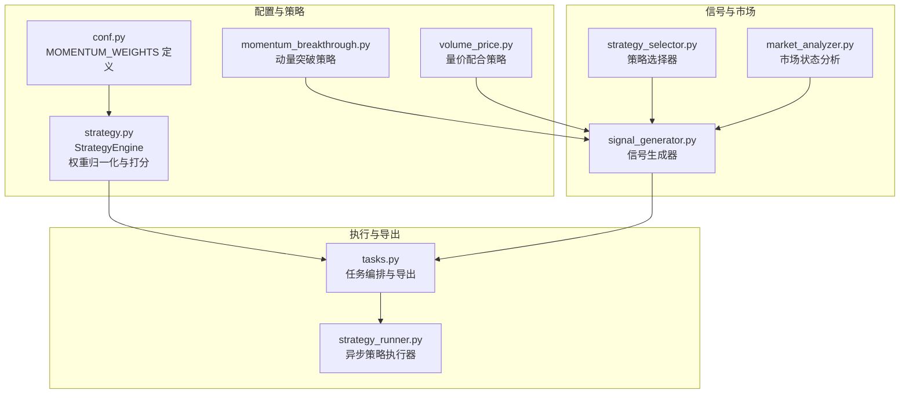
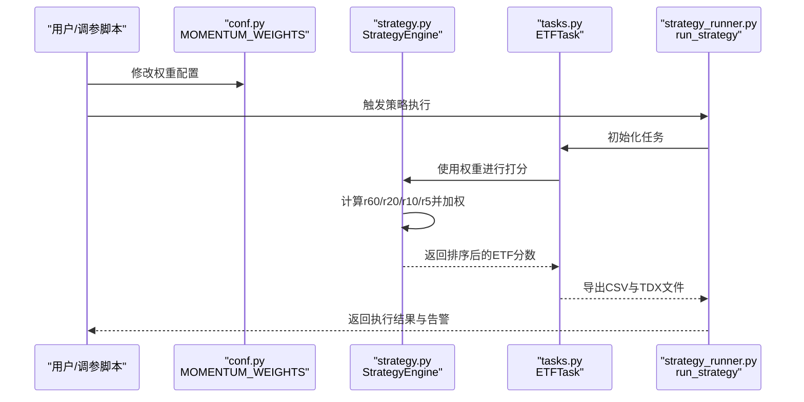
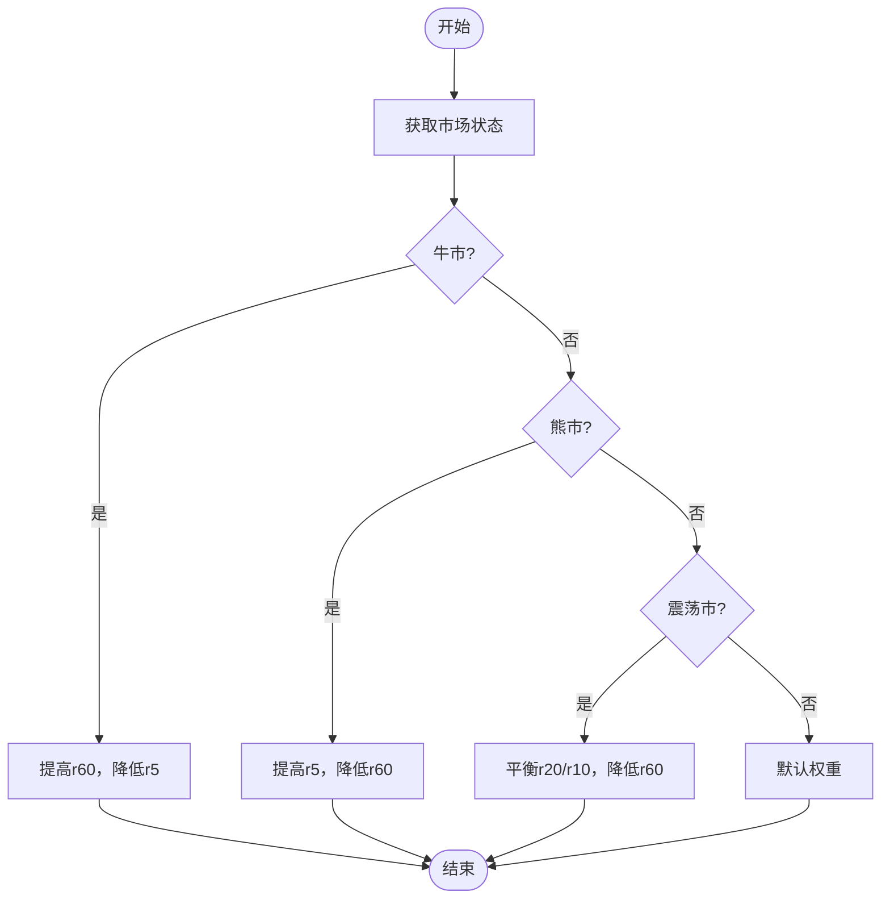
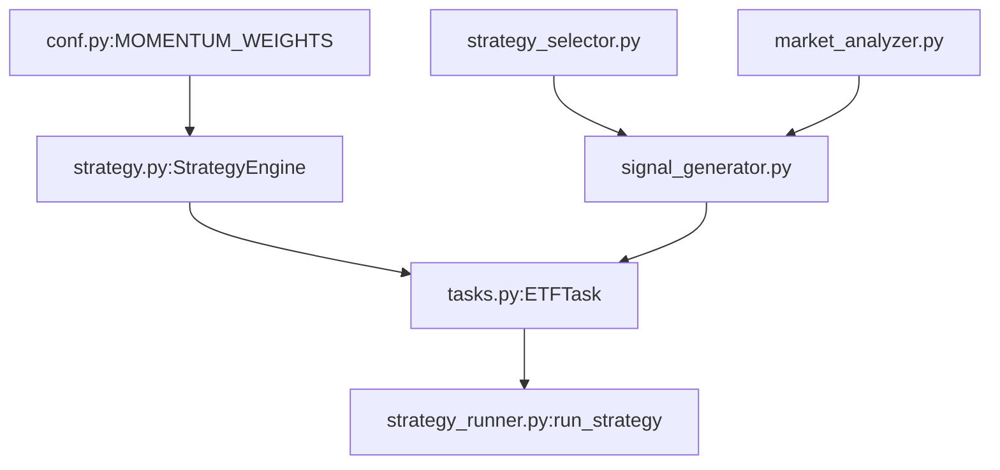

# 策略参数调优

<cite>
**本文档引用的文件**
- [conf.py](file://src/quant_etf/conf.py)
- [strategy.py](file://src/quant_etf/strategy.py)
- [momentum_breakthrough.py](file://src/quant_etf/strategies/momentum_breakthrough.py)
- [volume_price.py](file://src/quant_etf/strategies/volume_price.py)
- [signal_generator.py](file://src/quant_etf/signal_generator.py)
- [strategy_selector.py](file://src/quant_etf/strategy_selector.py)
- [market_analyzer.py](file://src/quant_etf/market_analyzer.py)
- [tasks.py](file://src/quant_etf/tasks.py)
- [strategy_runner.py](file://src/quant_etf/dashboard/services/strategy_runner.py)
- [test_strategy.py](file://tests/test_strategy.py)
- [README.md](file://README.md)
</cite>

## 目录
1. [引言](#引言)
2. [项目结构](#项目结构)
3. [核心组件](#核心组件)
4. [架构总览](#架构总览)
5. [详细组件分析](#详细组件分析)
6. [依赖分析](#依赖分析)
7. [性能考虑](#性能考虑)
8. [故障排除指南](#故障排除指南)
9. [结论](#结论)
10. [附录](#附录)

## 引言
本指南围绕策略参数调优展开，重点解释并优化MOMENTUM_WEIGHTS配置，涵盖权重分配对策略表现的影响、参数敏感性分析方法（网格搜索与随机搜索）、不同市场环境下的参数调整策略（牛市、熊市、震荡市）、回测框架使用与性能评估指标、参数稳定性检验与过拟合检测，以及成本效益与实施建议。文档同时梳理项目中与参数调优相关的核心模块与数据流，帮助读者快速定位调参入口并安全地进行实验。

## 项目结构
该项目采用功能模块化组织，策略参数主要集中在配置文件与策略引擎中；信号生成与市场分析模块负责根据市场状态动态选择策略并生成交易信号；任务模块负责数据加载、策略执行与结果导出；仪表盘服务提供异步执行与结果展示能力。

**图表来源**
- [conf.py:118-136](file://src/quant_etf/conf.py#L118-L136)
- [strategy.py:43-60](file://src/quant_etf/strategy.py#L43-L60)
- [momentum_breakthrough.py:46-60](file://src/quant_etf/strategies/momentum_breakthrough.py#L46-L60)
- [volume_price.py:16-35](file://src/quant_etf/strategies/volume_price.py#L16-L35)
- [signal_generator.py:17-27](file://src/quant_etf/signal_generator.py#L17-L27)
- [strategy_selector.py:15-26](file://src/quant_etf/strategy_selector.py#L15-L26)
- [market_analyzer.py:46-56](file://src/quant_etf/market_analyzer.py#L46-L56)
- [tasks.py:30-55](file://src/quant_etf/tasks.py#L30-L55)
- [strategy_runner.py:25-28](file://src/quant_etf/dashboard/services/strategy_runner.py#L25-L28)

**章节来源**
- [conf.py:118-136](file://src/quant_etf/conf.py#L118-L136)
- [strategy.py:43-60](file://src/quant_etf/strategy.py#L43-L60)
- [signal_generator.py:17-27](file://src/quant_etf/signal_generator.py#L17-L27)
- [tasks.py:30-55](file://src/quant_etf/tasks.py#L30-L55)

## 核心组件
- MOMENTUM_WEIGHTS：定义动量因子权重（r60、r20、r10、r5），决定不同时间尺度收益对最终打分的贡献度。
- StrategyEngine：负责计算各周期收益、加权打分、排序与目标组合生成，并对权重进行归一化处理。
- 动量突破策略与量价配合策略：提供信号生成与市场适用性判断，作为信号生成器的输入。
- 市场分析与策略选择：根据市场状态自动选择适合的策略集合。
- 任务与执行：统一加载数据、执行策略、导出结果，并支持异步执行与告警联动。

**章节来源**
- [conf.py:118-136](file://src/quant_etf/conf.py#L118-L136)
- [strategy.py:43-60](file://src/quant_etf/strategy.py#L43-L60)
- [momentum_breakthrough.py:46-60](file://src/quant_etf/strategies/momentum_breakthrough.py#L46-L60)
- [volume_price.py:16-35](file://src/quant_etf/strategies/volume_price.py#L16-L35)
- [signal_generator.py:17-27](file://src/quant_etf/signal_generator.py#L17-L27)
- [strategy_selector.py:15-26](file://src/quant_etf/strategy_selector.py#L15-L26)
- [market_analyzer.py:46-56](file://src/quant_etf/market_analyzer.py#L46-L56)
- [tasks.py:30-55](file://src/quant_etf/tasks.py#L30-L55)
- [strategy_runner.py:25-28](file://src/quant_etf/dashboard/services/strategy_runner.py#L25-L28)

## 架构总览
下图展示了从配置到执行再到导出的完整调优链路，强调MOMENTUM_WEIGHTS如何贯穿收益计算、打分与最终结果。

**图表来源**
- [conf.py:118-136](file://src/quant_etf/conf.py#L118-L136)
- [strategy.py:103-140](file://src/quant_etf/strategy.py#L103-L140)
- [tasks.py:179-206](file://src/quant_etf/tasks.py#L179-L206)
- [strategy_runner.py:25-71](file://src/quant_etf/dashboard/services/strategy_runner.py#L25-L71)

## 详细组件分析

### MOMENTUM_WEIGHTS 参数含义与调优原则
- 权重含义：r60、r20、r10、r5分别代表60日、20日、10日、5日收益对最终动量得分的贡献权重。默认配置偏向短期动量（r5权重最高），适合热点轮动快、趋势持续性较差的震荡市或牛市初期。
- 归一化机制：StrategyEngine在初始化时会检查权重之和是否为1，若不为1则进行重归一化，避免因人为误配导致打分失衡。
- 调优原则：
  - 短期偏好增强：提高r5权重，降低r60权重，提升对近期动量的敏感度，适合震荡市或快速轮动的牛市初期。
  - 中长期偏好增强：提高r60权重，降低r5权重，强调长期趋势稳定性，适合趋势明确的单边牛市。
  - 平衡策略：r20与r10适度提高，兼顾中期与短期动量，适合波动适中的震荡市。
  - 归一化优先：任何修改后务必保证权重和为1，确保打分可比性与一致性。

**章节来源**
- [conf.py:118-136](file://src/quant_etf/conf.py#L118-L136)
- [strategy.py:43-60](file://src/quant_etf/strategy.py#L43-L60)
- [strategy.py:103-140](file://src/quant_etf/strategy.py#L103-L140)

### 权重对策略表现的影响分析
- 影响路径：权重直接影响各周期收益在最终打分中的占比，进而改变ETF池排序与目标组合权重分配。
- 敏感性特征：
  - r5权重上升：短期动量更突出，策略对突发消息与短期波动更敏感，可能提升交易频率但增加噪音。
  - r60权重上升：长期趋势更受重视，策略更稳健，但可能错过短期轮动机会。
  - r20/r10权重变化：平衡短期与中期动量，有助于在震荡市中稳定收益。
- 实践建议：通过回测对比不同权重组合在历史样本上的累计收益、最大回撤、夏普比率等指标，选择符合目标风险收益偏好的权重集。

**章节来源**
- [strategy.py:103-140](file://src/quant_etf/strategy.py#L103-L140)

### 参数敏感性分析：网格搜索与随机搜索
- 网格搜索（Grid Search）：
  - 思路：在预设范围内对r60、r20、r10、r5进行离散采样，遍历所有组合，记录回测指标（如年化收益、最大回撤、胜率、夏普比率）。
  - 实施要点：确保权重和为1；对每个组合独立运行StrategyEngine并记录结果；使用多进程/线程加速；注意数据切片与样本外验证。
- 随机搜索（Random Search）：
  - 思路：在约束条件下随机采样权重组合，通常以更少的计算量获得接近最优的效果。
  - 实施要点：设定权重边界（如非负、和为1）；多次重复采样；记录最佳组合及其指标。
- 工具与接口：
  - 回测框架：可在现有任务与导出流程基础上扩展，将回测指标写入CSV，便于后续统计分析。
  - 结果导出：利用任务模块的导出接口，保存不同权重组合下的结果文件，便于对比。

**章节来源**
- [tasks.py:56-95](file://src/quant_etf/tasks.py#L56-L95)
- [strategy.py:103-140](file://src/quant_etf/strategy.py#L103-L140)

### 不同市场环境下的参数调整策略
- 牛市（BULL）：
  - 策略倾向：优先选择强调长期趋势的权重配置（提高r60权重，降低r5权重），减少频繁交易，抓住单边上涨趋势。
  - 依据：市场分析模块在牛市中趋势较强，短期噪音较多，应降低短期权重以避免噪声干扰。
- 熊市（BEAR）：
  - 策略倾向：强调短期动量与风险控制，提高r5权重，缩短持有周期，严格止损。
  - 依据：波动率较高，趋势易反转，短期动量更可靠。
- 震荡市（RANGE）：
  - 策略倾向：平衡短期与中期权重，避免过度偏向长期或短期，提高r20与r10权重，降低r60权重，提升对震荡区间内轮动的敏感度。
  - 依据：震荡市中趋势不明显，短期轮动更频繁，需兼顾短期动量与中期趋势。

**图表来源**
- [market_analyzer.py:215-250](file://src/quant_etf/market_analyzer.py#L215-L250)
- [strategy_selector.py:64-79](file://src/quant_etf/strategy_selector.py#L64-L79)
- [conf.py:118-136](file://src/quant_etf/conf.py#L118-L136)

**章节来源**
- [market_analyzer.py:215-250](file://src/quant_etf/market_analyzer.py#L215-L250)
- [strategy_selector.py:64-79](file://src/quant_etf/strategy_selector.py#L64-L79)
- [conf.py:118-136](file://src/quant_etf/conf.py#L118-L136)

### 策略回测框架使用与性能评估指标
- 回测框架使用：
  - 数据准备：通过任务模块加载ETF池数据，按目标日期进行切片过滤，确保样本内/样本外分离。
  - 执行流程：初始化StrategyEngine，运行rank_etfs得到排序结果，导出CSV与TDX文件。
  - 指标计算：在回测模块中扩展，计算年化收益、最大回撤、夏普比率、胜率、卡玛比率等。
- 性能评估指标：
  - 年化收益：衡量策略长期盈利能力。
  - 最大回撤：衡量策略最大潜在损失。
  - 夏普比率：单位风险的超额收益。
  - 胜率：盈利交易次数占比。
  - 卡玛比率：年化收益与最大回撤的比值。
- 结果导出：利用任务模块的CSV导出接口，保存每次回测的指标与参数组合，便于后续统计分析。

**章节来源**
- [tasks.py:131-177](file://src/quant_etf/tasks.py#L131-L177)
- [strategy.py:103-140](file://src/quant_etf/strategy.py#L103-L140)

### 参数稳定性检验与过拟合检测
- 稳定性检验：
  - 时间窗口稳定性：在不同历史阶段（如2022、2023、2024）分别验证权重组合的表现，观察指标波动范围。
  - 样本外验证：将数据按时间切分为训练集与测试集，确保参数在训练集上优化后在测试集上仍有效。
  - 市场状态稳定性：在牛市、熊市、震荡市分别验证权重组合的稳健性，避免单一市场状态下的过拟合。
- 过拟合检测：
  - 交叉验证：对权重组合进行滚动窗口验证，观察指标随时间的变化趋势。
  - 正则化思路：在权重空间引入稀疏性约束（如L1正则），限制权重幅度过大，降低对特定周期的过度拟合。
  - 指标漂移监控：通过仪表盘服务的告警机制，监控权重变更后策略指标的异常波动。

**章节来源**
- [strategy_runner.py:72-101](file://src/quant_etf/dashboard/services/strategy_runner.py#L72-L101)
- [test_strategy.py:19-44](file://tests/test_strategy.py#L19-L44)

### 参数调优的成本效益与实施建议
- 成本考量：
  - 计算成本：网格搜索计算量较大，建议优先使用随机搜索或贝叶斯优化；对关键权重组合进行网格搜索。
  - 数据成本：确保数据质量与完整性，避免因缺失数据导致的偏差。
  - 维护成本：建立参数版本管理与回测报告体系，便于追踪与复现。
- 实施建议：
  - 渐进式调优：先在震荡市/熊市验证稳健性，再在牛市验证收益能力。
  - 多目标优化：在追求收益的同时兼顾风险（如最大回撤、夏普比率）。
  - 自动化执行：通过异步策略执行器与任务编排，实现参数实验的批量化与可视化。
  - 文档化：记录每次实验的参数、指标与结论，形成知识沉淀。

**章节来源**
- [strategy_runner.py:25-71](file://src/quant_etf/dashboard/services/strategy_runner.py#L25-L71)
- [tasks.py:131-177](file://src/quant_etf/tasks.py#L131-L177)

## 依赖分析
- 配置依赖：MOMENTUM_WEIGHTS由conf.py集中管理，StrategyEngine在初始化时读取并归一化。
- 策略依赖：信号生成器依赖策略选择器与市场分析模块，根据市场状态选择合适策略集合。
- 执行依赖：任务模块负责数据加载、策略执行与结果导出，异步执行器提供后台执行与告警联动。

**图表来源**
- [conf.py:118-136](file://src/quant_etf/conf.py#L118-L136)
- [strategy.py:43-60](file://src/quant_etf/strategy.py#L43-L60)
- [tasks.py:179-206](file://src/quant_etf/tasks.py#L179-L206)
- [strategy_runner.py:25-71](file://src/quant_etf/dashboard/services/strategy_runner.py#L25-L71)
- [strategy_selector.py:15-26](file://src/quant_etf/strategy_selector.py#L15-L26)
- [signal_generator.py:17-27](file://src/quant_etf/signal_generator.py#L17-L27)
- [market_analyzer.py:46-56](file://src/quant_etf/market_analyzer.py#L46-L56)

**章节来源**
- [conf.py:118-136](file://src/quant_etf/conf.py#L118-L136)
- [strategy.py:43-60](file://src/quant_etf/strategy.py#L43-L60)
- [tasks.py:179-206](file://src/quant_etf/tasks.py#L179-L206)
- [strategy_runner.py:25-71](file://src/quant_etf/dashboard/services/strategy_runner.py#L25-L71)
- [strategy_selector.py:15-26](file://src/quant_etf/strategy_selector.py#L15-L26)
- [signal_generator.py:17-27](file://src/quant_etf/signal_generator.py#L17-L27)
- [market_analyzer.py:46-56](file://src/quant_etf/market_analyzer.py#L46-L56)

## 性能考虑
- 计算效率：在StrategyEngine中对权重进行归一化处理，避免重复计算；在任务模块中批量加载数据并导出结果，减少I/O开销。
- 内存占用：在回测过程中对中间结果进行及时清理，避免长时间持有大量DataFrame。
- 并行化：利用异步执行器与线程池执行多个策略任务，提升吞吐量。

## 故障排除指南
- 权重和不为1：当权重和偏离1时，StrategyEngine会进行重归一化并发出警告，需检查配置文件与调参脚本。
- 数据不足：当ETF数据长度小于60时，无法计算收益，rank_etfs会跳过该ETF并记录警告。
- 市场状态异常：若市场分析模块无法获取指数数据，将返回未知市场状态，需检查数据库连接与数据源。
- 异步执行错误：若策略执行失败，异步执行器会广播错误事件并通过SSE通知前端。

**章节来源**
- [strategy.py:54-60](file://src/quant_etf/strategy.py#L54-L60)
- [strategy.py:112-116](file://src/quant_etf/strategy.py#L112-L116)
- [market_analyzer.py:167-180](file://src/quant_etf/market_analyzer.py#L167-L180)
- [strategy_runner.py:102-122](file://src/quant_etf/dashboard/services/strategy_runner.py#L102-L122)

## 结论
通过对MOMENTUM_WEIGHTS的深入解析与实操指导，结合网格搜索、随机搜索与市场状态驱动的参数调整策略，可以在不同市场环境下实现稳健的参数优化。建议以回测框架为基础，建立参数稳定性检验与过拟合检测机制，并通过自动化执行与可视化手段提升调优效率与可维护性。

## 附录
- 配置说明与权重调整入口：参见配置文件与README中的说明。
- 测试用例参考：单元测试展示了收益计算与排序的基本行为，可作为参数调优的回归基准。

**章节来源**
- [README.md:278-318](file://README.md#L278-L318)
- [test_strategy.py:19-44](file://tests/test_strategy.py#L19-L44)