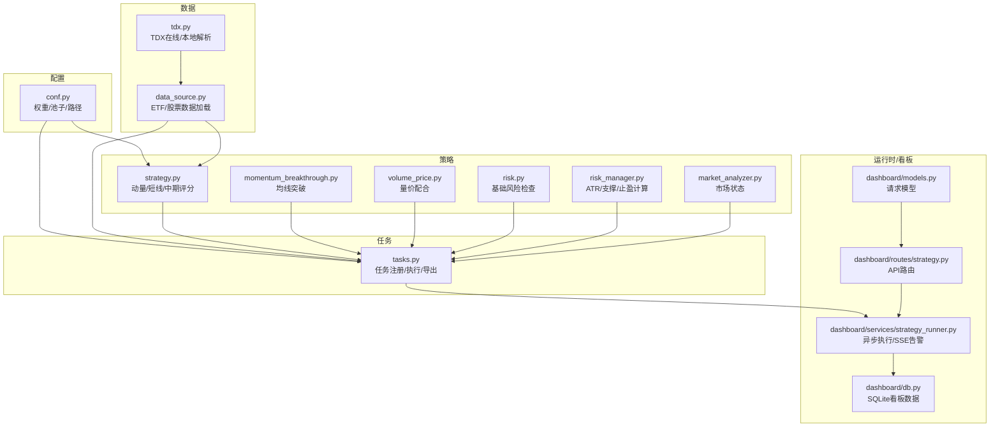
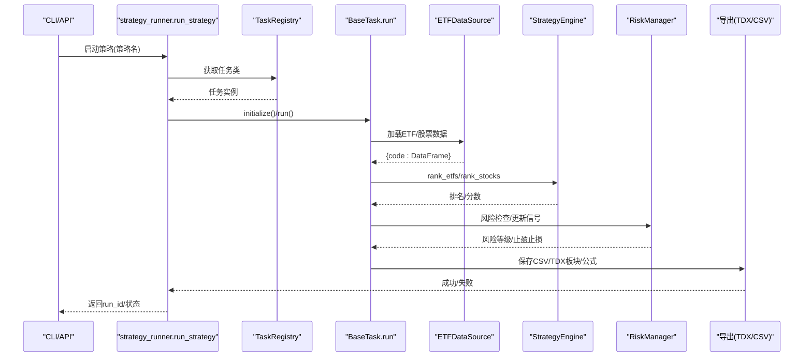
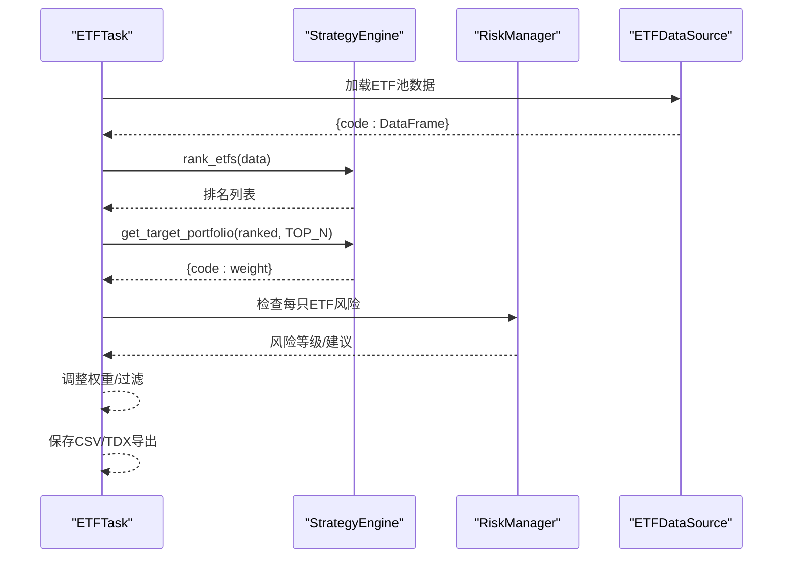
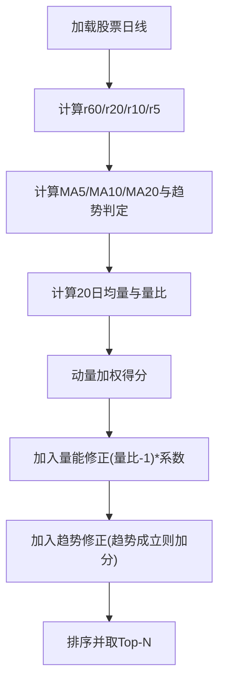
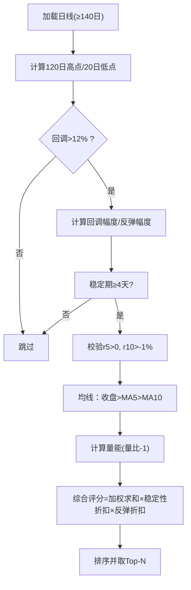
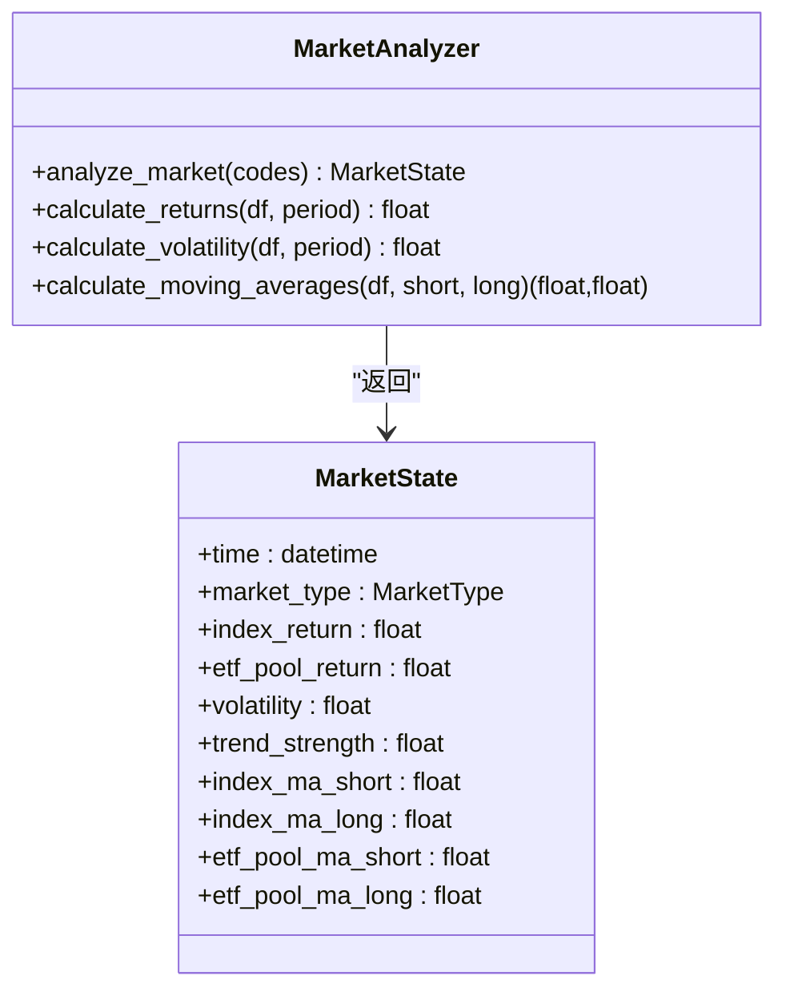
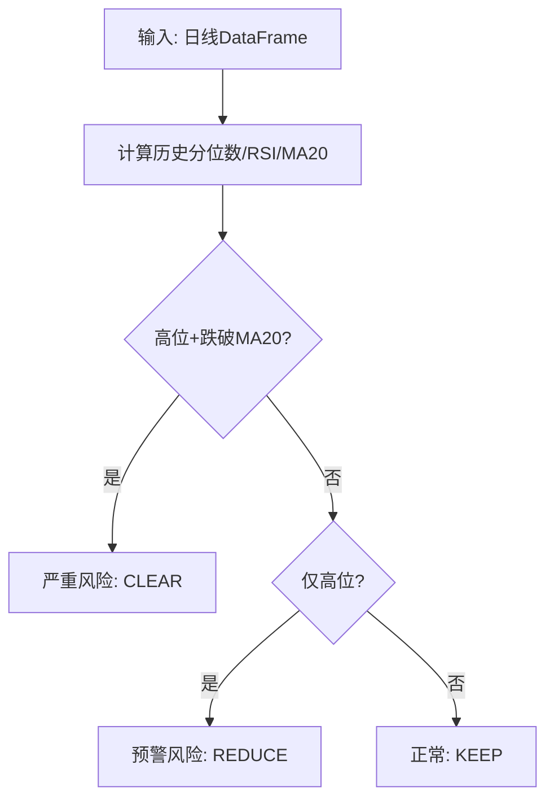
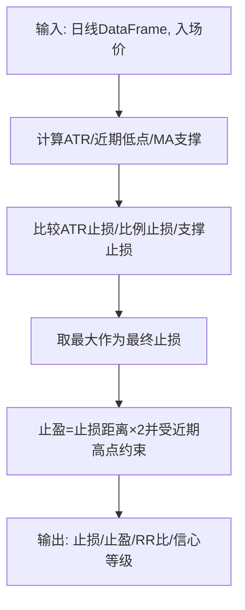
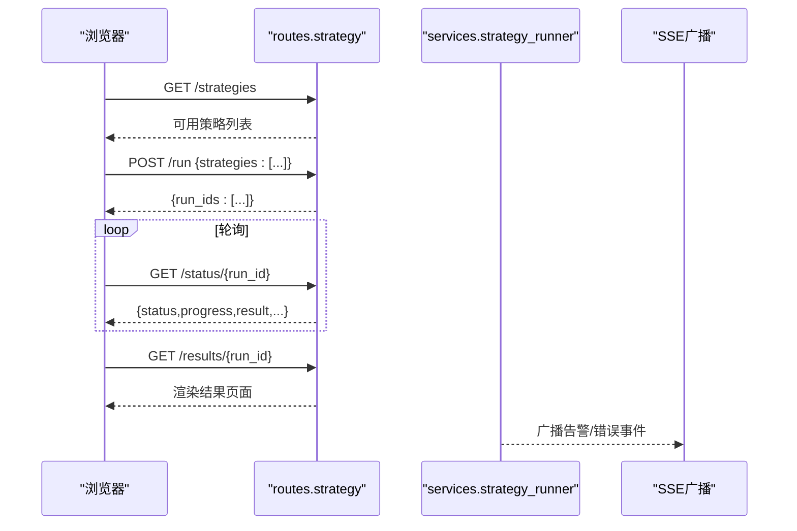
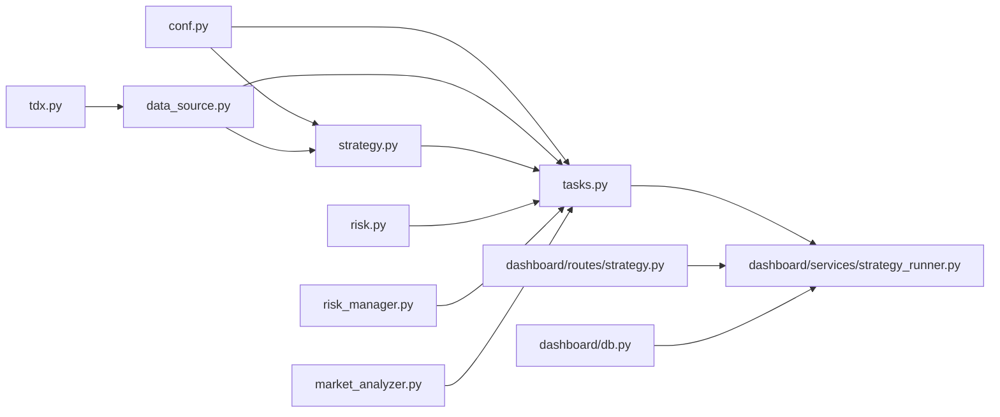

# 策略引擎

<cite>
**本文引用的文件**
- [src/quant_etf/strategy.py](file://src/quant_etf/strategy.py)
- [src/quant_etf/conf.py](file://src/quant_etf/conf.py)
- [src/quant_etf/tasks.py](file://src/quant_etf/tasks.py)
- [src/quant_etf/data_source.py](file://src/quant_etf/data_source.py)
- [src/quant_etf/risk.py](file://src/quant_etf/risk.py)
- [src/quant_etf/risk_manager.py](file://src/quant_etf/risk_manager.py)
- [src/quant_etf/market_analyzer.py](file://src/quant_etf/market_analyzer.py)
- [src/quant_etf/strategies/momentum_breakthrough.py](file://src/quant_etf/strategies/momentum_breakthrough.py)
- [src/quant_etf/strategies/volume_price.py](file://src/quant_etf/strategies/volume_price.py)
- [src/quant_etf/dashboard/services/strategy_runner.py](file://src/quant_etf/dashboard/services/strategy_runner.py)
- [src/quant_etf/dashboard/routes/strategy.py](file://src/quant_etf/dashboard/routes/strategy.py)
- [src/quant_etf/dashboard/models.py](file://src/quant_etf/dashboard/models.py)
- [src/quant_etf/dashboard/db.py](file://src/quant_etf/dashboard/db.py)
- [src/quant_etf/tdx.py](file://src/quant_etf/tdx.py)
</cite>

## 目录
1. [引言](#引言)
2. [项目结构](#项目结构)
3. [核心组件](#核心组件)
4. [架构总览](#架构总览)
5. [详细组件分析](#详细组件分析)
6. [依赖分析](#依赖分析)
7. [性能考虑](#性能考虑)
8. [故障排查指南](#故障排查指南)
9. [结论](#结论)
10. [附录](#附录)

## 引言
本文件面向Quant-ETF策略引擎，系统化阐述动量策略的理论基础与实现细节，覆盖ETF组合策略、短线股票策略与中期反弹策略三类核心算法，并给出参数配置、回测与历史数据验证流程、性能评估与风险管理机制，以及扩展开发的接口规范与最佳实践。

## 项目结构
策略引擎采用“配置-数据-策略-任务-运行时”的分层组织：
- 配置层：集中管理权重、池子、路径与默认参数
- 数据层：统一加载ETF/股票日线数据，支持本地TDX、缓存与在线回源
- 策略层：动量评分、均线突破、量价配合、中期反弹等策略
- 任务层：封装任务生命周期、结果导出与TDX板块/公式文件生成
- 运行时与看板：异步策略执行、SSE告警、仪表板路由与数据库

**图示来源**
- [src/quant_etf/conf.py:118-137](file://src/quant_etf/conf.py#L118-L137)
- [src/quant_etf/data_source.py:15-381](file://src/quant_etf/data_source.py#L15-L381)
- [src/quant_etf/tdx.py:209-375](file://src/quant_etf/tdx.py#L209-L375)
- [src/quant_etf/strategy.py:43-321](file://src/quant_etf/strategy.py#L43-L321)
- [src/quant_etf/strategies/momentum_breakthrough.py:46-187](file://src/quant_etf/strategies/momentum_breakthrough.py#L46-L187)
- [src/quant_etf/strategies/volume_price.py:16-186](file://src/quant_etf/strategies/volume_price.py#L16-L186)
- [src/quant_etf/risk.py:18-96](file://src/quant_etf/risk.py#L18-L96)
- [src/quant_etf/risk_manager.py:26-185](file://src/quant_etf/risk_manager.py#L26-L185)
- [src/quant_etf/market_analyzer.py:46-263](file://src/quant_etf/market_analyzer.py#L46-L263)
- [src/quant_etf/tasks.py:30-450](file://src/quant_etf/tasks.py#L30-L450)
- [src/quant_etf/dashboard/services/strategy_runner.py:25-164](file://src/quant_etf/dashboard/services/strategy_runner.py#L25-L164)
- [src/quant_etf/dashboard/routes/strategy.py:18-53](file://src/quant_etf/dashboard/routes/strategy.py#L18-L53)
- [src/quant_etf/dashboard/models.py:52-54](file://src/quant_etf/dashboard/models.py#L52-L54)
- [src/quant_etf/dashboard/db.py:69-133](file://src/quant_etf/dashboard/db.py#L69-L133)

**章节来源**
- [src/quant_etf/conf.py:118-137](file://src/quant_etf/conf.py#L118-L137)
- [src/quant_etf/data_source.py:15-381](file://src/quant_etf/data_source.py#L15-L381)
- [src/quant_etf/tasks.py:30-450](file://src/quant_etf/tasks.py#L30-L450)

## 核心组件
- 策略引擎（StrategyEngine）：负责动量因子计算、ETF/股票评分与排序、目标组合生成
- 任务系统（BaseTask/ETFTask/ShortTermStockTask/MidTermReboundTask）：封装数据加载、策略执行、结果导出与TDX集成
- 风控系统（RiskManager/RiskManager）：ATR止损、支撑位、止盈与风险等级判定
- 市场分析（MarketAnalyzer）：基于指数与ETF池的1分钟数据判断市场状态
- 看板与运行时（strategy_runner、routes、models、db）：异步执行、SSE告警、API路由与SQLite存储

**章节来源**
- [src/quant_etf/strategy.py:43-321](file://src/quant_etf/strategy.py#L43-L321)
- [src/quant_etf/tasks.py:30-450](file://src/quant_etf/tasks.py#L30-L450)
- [src/quant_etf/risk_manager.py:26-185](file://src/quant_etf/risk_manager.py#L26-L185)
- [src/quant_etf/market_analyzer.py:46-263](file://src/quant_etf/market_analyzer.py#L46-L263)
- [src/quant_etf/dashboard/services/strategy_runner.py:25-164](file://src/quant_etf/dashboard/services/strategy_runner.py#L25-L164)

## 架构总览
策略引擎以“配置驱动 + 数据驱动 + 策略评分 + 任务执行 + 结果导出”为主线，结合风控与市场分析，形成闭环。

**图示来源**
- [src/quant_etf/dashboard/services/strategy_runner.py:25-164](file://src/quant_etf/dashboard/services/strategy_runner.py#L25-L164)
- [src/quant_etf/tasks.py:114-160](file://src/quant_etf/tasks.py#L114-L160)
- [src/quant_etf/data_source.py:189-285](file://src/quant_etf/data_source.py#L189-L285)
- [src/quant_etf/strategy.py:103-321](file://src/quant_etf/strategy.py#L103-L321)
- [src/quant_etf/risk_manager.py:145-185](file://src/quant_etf/risk_manager.py#L145-L185)

## 详细组件分析

### 动量策略与加权计算
- 动量因子：60/20/10/5日涨跌幅，分别对应权重 w60/w20/w10/w5
- 计算步骤：
  1) 计算各周期涨跌幅 r60, r20, r10, r5
  2) 对权重进行归一化（若总和不为1则重新归一）
  3) 加权得分 = r60·w60 + r20·w20 + r10·w10 + r5·w5
  4) ETF池按得分降序排序，取前N生成目标等权组合
- 参数配置：
  - 权重：MOMENTUM_WEIGHTS（可在conf.py中调整）
  - 持仓数量：TOP_N（默认15）

**图示来源**
- [src/quant_etf/strategy.py:61-140](file://src/quant_etf/strategy.py#L61-L140)
- [src/quant_etf/conf.py:118-129](file://src/quant_etf/conf.py#L118-L129)

**章节来源**
- [src/quant_etf/strategy.py:43-140](file://src/quant_etf/strategy.py#L43-L140)
- [src/quant_etf/conf.py:118-129](file://src/quant_etf/conf.py#L118-L129)

### ETF组合策略（目标组合生成）
- 输入：ETF池（ETF_POOL）、日线数据
- 输出：目标权重字典 {ETF代码: 权重}
- 关键流程：
  1) rank_etfs：计算得分并排序
  2) get_target_portfolio：取前N，等权分配
  3) 与基础风险检查结合：对高危ETF降低仓位或清仓
- 结果导出：CSV、TDX板块文件、自动生成公式文件

**图示来源**
- [src/quant_etf/tasks.py:162-278](file://src/quant_etf/tasks.py#L162-L278)
- [src/quant_etf/strategy.py:103-162](file://src/quant_etf/strategy.py#L103-L162)
- [src/quant_etf/risk.py:39-96](file://src/quant_etf/risk.py#L39-L96)

**章节来源**
- [src/quant_etf/tasks.py:162-278](file://src/quant_etf/tasks.py#L162-L278)
- [src/quant_etf/strategy.py:103-162](file://src/quant_etf/strategy.py#L103-L162)
- [src/quant_etf/risk.py:39-96](file://src/quant_etf/risk.py#L39-L96)

### 短线股票策略（动量+趋势+放量）
- 评分要素：
  - 动量：r60/r20/r10/r5加权
  - 趋势：MA5/MA10/MA20多头排列
  - 放量：当日量比 = 当日成交量/20日均量
- 最终分数：动量分 + 量能修正项 + 趋势修正项
- 选股：从STOCK_POOL中按分数Top-N

**图示来源**
- [src/quant_etf/strategy.py:164-225](file://src/quant_etf/strategy.py#L164-L225)

**章节来源**
- [src/quant_etf/strategy.py:164-225](file://src/quant_etf/strategy.py#L164-L225)

### 中期反弹策略（回调止跌+量价配合）
- 信号条件：
  - 近120日高点回调幅度>12%
  - 近20日新低后出现反弹（反弹幅度≥4%）
  - 稳定期限：从20日低点至今至少4个交易日
  - 近期涨跌：r5>0, r10>-1%
  - 均线：收盘价站上MA5且MA5>MA10
- 综合评分：加权融合回调幅度、反弹幅度、r5/r10、量能（量比-1），并按稳定性与反弹有效性进行折扣
- 选股：从MID_TERM_STOCK_POOL中按分数Top-N

**图示来源**
- [src/quant_etf/strategy.py:227-321](file://src/quant_etf/strategy.py#L227-L321)

**章节来源**
- [src/quant_etf/strategy.py:227-321](file://src/quant_etf/strategy.py#L227-L321)

### 市场状态与策略适配
- MarketAnalyzer基于沪深300指数与ETF池1分钟数据，计算收益、波动率、均线，综合判断市场类型（牛市/熊市/震荡市/未知）
- 策略适配：均线突破与量价配合策略仅在牛市/震荡市适用；在震荡/熊市可减少或暂停

**图示来源**
- [src/quant_etf/market_analyzer.py:46-263](file://src/quant_etf/market_analyzer.py#L46-L263)

**章节来源**
- [src/quant_etf/market_analyzer.py:46-263](file://src/quant_etf/market_analyzer.py#L46-L263)

### 风险管理机制
- 基础风险（ETF）：高位分位数（>85%）或RSI超买（>80），并跌破MA20，触发“严重风险”，建议清仓；仅高位预警则建议减仓
- 技术位止损（通用）：ATR止损、支撑位止损、固定比例止损三者取最大（保证有效），止盈按2:1盈亏比并受近期高点限制

**图示来源**
- [src/quant_etf/risk.py:39-96](file://src/quant_etf/risk.py#L39-L96)

**图示来源**
- [src/quant_etf/risk_manager.py:104-171](file://src/quant_etf/risk_manager.py#L104-L171)

**章节来源**
- [src/quant_etf/risk.py:39-96](file://src/quant_etf/risk.py#L39-L96)
- [src/quant_etf/risk_manager.py:104-171](file://src/quant_etf/risk_manager.py#L104-L171)

### 看板与策略执行
- 异步执行：strategy_runner在后台线程执行任务，SSE广播进度与告警
- API路由：/strategies列出策略、/run启动策略、/status/{run_id}查询进度、/results/{run_id}渲染结果页
- 数据库：accounts/holdings/alert_rules/alerts_dashboard/schedules等表管理看板数据

**图示来源**
- [src/quant_etf/dashboard/routes/strategy.py:18-53](file://src/quant_etf/dashboard/routes/strategy.py#L18-L53)
- [src/quant_etf/dashboard/services/strategy_runner.py:25-164](file://src/quant_etf/dashboard/services/strategy_runner.py#L25-L164)
- [src/quant_etf/dashboard/db.py:69-133](file://src/quant_etf/dashboard/db.py#L69-L133)

**章节来源**
- [src/quant_etf/dashboard/routes/strategy.py:18-53](file://src/quant_etf/dashboard/routes/strategy.py#L18-L53)
- [src/quant_etf/dashboard/services/strategy_runner.py:25-164](file://src/quant_etf/dashboard/services/strategy_runner.py#L25-L164)
- [src/quant_etf/dashboard/db.py:69-133](file://src/quant_etf/dashboard/db.py#L69-L133)

### 策略参数配置与扩展
- 动量权重：MOMENTUM_WEIGHTS（r60/r20/r10/r5），可按市场阶段调整
- 持仓数量：TOP_N（默认15）
- 策略参数：均线周期、量能阈值、ATR周期、风险比例等在各自策略/风控模块中可配置
- 扩展接口：新增任务需继承BaseTask，实现get_pool/load_data/run_strategy/format_result/export_results，并在TaskRegistry注册

**章节来源**
- [src/quant_etf/conf.py:118-137](file://src/quant_etf/conf.py#L118-L137)
- [src/quant_etf/tasks.py:411-450](file://src/quant_etf/tasks.py#L411-L450)

## 依赖分析
- 组件耦合：
  - StrategyEngine依赖conf中的权重与池子
  - 任务系统依赖数据源与策略引擎
  - 风控模块独立于策略，但被任务系统调用
  - 看板服务依赖任务系统与数据库
- 外部依赖：
  - TDX在线/本地解析、pandas/numpy、loguru、duckdb（市场分析）
- 循环依赖：未见明显循环

**图示来源**
- [src/quant_etf/conf.py:118-137](file://src/quant_etf/conf.py#L118-L137)
- [src/quant_etf/strategy.py:43-321](file://src/quant_etf/strategy.py#L43-L321)
- [src/quant_etf/tasks.py:30-450](file://src/quant_etf/tasks.py#L30-L450)
- [src/quant_etf/data_source.py:15-381](file://src/quant_etf/data_source.py#L15-L381)
- [src/quant_etf/tdx.py:209-375](file://src/quant_etf/tdx.py#L209-L375)
- [src/quant_etf/risk.py:18-96](file://src/quant_etf/risk.py#L18-L96)
- [src/quant_etf/risk_manager.py:26-185](file://src/quant_etf/risk_manager.py#L26-L185)
- [src/quant_etf/market_analyzer.py:46-263](file://src/quant_etf/market_analyzer.py#L46-L263)
- [src/quant_etf/dashboard/services/strategy_runner.py:25-164](file://src/quant_etf/dashboard/services/strategy_runner.py#L25-L164)
- [src/quant_etf/dashboard/routes/strategy.py:18-53](file://src/quant_etf/dashboard/routes/strategy.py#L18-L53)
- [src/quant_etf/dashboard/db.py:69-133](file://src/quant_etf/dashboard/db.py#L69-L133)

**章节来源**
- [src/quant_etf/tasks.py:30-450](file://src/quant_etf/tasks.py#L30-L450)

## 性能考虑
- 数据加载：优先本地TDX文件，其次缓存，最后在线回源；按需切片过滤目标日期，减少内存占用
- 计算优化：滚动窗口（MA/ATR/RSI）尽量复用中间列；向量化计算（pandas/numpy）优于循环
- 并发执行：策略执行在独立线程池中进行，避免阻塞API响应
- I/O优化：CSV导出与TDX文件生成批量写入，减少磁盘抖动

[本节为通用建议，不直接分析具体文件]

## 故障排查指南
- 数据加载失败：检查TDX目录、网络连通性与缓存文件完整性
- 策略无结果：确认池子大小、数据长度（ETF≥60日、股票≥140日）、权重归一化
- 风控误报/漏报：调整高位分位数阈值、RSI周期与阈值、MA周期
- 看板异常：检查SQLite数据库初始化、SSE广播异常、路由参数

**章节来源**
- [src/quant_etf/data_source.py:189-285](file://src/quant_etf/data_source.py#L189-L285)
- [src/quant_etf/risk.py:39-96](file://src/quant_etf/risk.py#L39-L96)
- [src/quant_etf/dashboard/db.py:79-91](file://src/quant_etf/dashboard/db.py#L79-L91)
- [src/quant_etf/dashboard/services/strategy_runner.py:102-122](file://src/quant_etf/dashboard/services/strategy_runner.py#L102-L122)

## 结论
本策略引擎以清晰的分层设计实现了ETF组合、短线与中期反弹三大策略，结合风控与市场分析，形成可配置、可扩展、可观测的自动化体系。通过看板与异步执行，用户可高效地进行策略验证、监控与部署。

[本节为总结性内容，不直接分析具体文件]

## 附录

### 回测与历史数据验证流程
- 数据准备：使用ETFDataSource加载ETF/股票日线，确保数据新鲜度
- 回测框架：以BaseTask为目标，传入目标日期（target_date）对数据进行切片，模拟历史时序
- 指标采集：可扩展在任务中增加收益、最大回撤、夏普比率等指标统计
- 验证要点：不同市场状态下策略表现差异、参数敏感性测试、风控阈值有效性

**章节来源**
- [src/quant_etf/tasks.py:131-138](file://src/quant_etf/tasks.py#L131-L138)
- [src/quant_etf/data_source.py:151-188](file://src/quant_etf/data_source.py#L151-L188)

### 策略性能评估指标（建议）
- 绝对收益与年化收益
- 最大回撤与回撤周期
- 夏普比率与Calmar比率
- 胜率与盈亏比
- 月度/年度胜率分布
- 不同市场状态下的分层表现

[本节为通用建议，不直接分析具体文件]

### 接口规范与最佳实践
- 新增策略任务：继承BaseTask，实现必要方法，注册到TaskRegistry
- 参数化：将策略关键参数（均线、量能阈值、ATR周期、风险比例）集中配置
- 结果导出：统一CSV格式，补充TDX板块/公式文件生成
- 错误处理：在strategy_runner中捕获异常并广播SSE错误事件
- 文档与测试：为每个策略提供说明文档与单元/集成测试

**章节来源**
- [src/quant_etf/tasks.py:411-450](file://src/quant_etf/tasks.py#L411-L450)
- [src/quant_etf/dashboard/services/strategy_runner.py:102-122](file://src/quant_etf/dashboard/services/strategy_runner.py#L102-L122)