# 策略引擎

<cite>
**本文引用的文件**
- [src/quant_etf/strategy.py](file://src/quant_etf/strategy.py)
- [src/quant_etf/conf.py](file://src/quant_etf/conf.py)
- [src/quant_etf/tasks.py](file://src/quant_etf/tasks.py)
- [src/quant_etf/data_source.py](file://src/quant_etf/data_source.py)
- [src/quant_etf/risk.py](file://src/quant_etf/risk.py)
- [src/quant_etf/risk_manager.py](file://src/quant_etf/risk_manager.py)
- [src/quant_etf/market_analyzer.py](file://src/quant_etf/market_analyzer.py)
- [src/quant_etf/strategies/momentum_breakthrough.py](file://src/quant_etf/strategies/momentum_breakthrough.py)
- [src/quant_etf/strategies/volume_price.py](file://src/quant_etf/strategies/volume_price.py)
- [src/quant_etf/dashboard/services/strategy_runner.py](file://src/quant_etf/dashboard/services/strategy_runner.py)
- [src/quant_etf/dashboard/routes/strategy.py](file://src/quant_etf/dashboard/routes/strategy.py)
- [src/quant_etf/dashboard/routes/market.py](file://src/quant_etf/dashboard/routes/market.py)
- [src/quant_etf/dashboard/routes/portfolio.py](file://src/quant_etf/dashboard/routes/portfolio.py)
- [src/quant_etf/dashboard/models.py](file://src/quant_etf/dashboard/models.py)
- [src/quant_etf/dashboard/db.py](file://src/quant_etf/dashboard/db.py)
- [src/quant_etf/tdx.py](file://src/quant_etf/tdx.py)
- [src/quant_etf/trading_day.py](file://src/quant_etf/trading_day.py)
- [src/quant_etf/dashboard/services/sse_manager.py](file://src/quant_etf/dashboard/services/sse_manager.py)
- [src/quant_etf/dashboard/templates/strategy/_results.html](file://src/quant_etf/dashboard/templates/strategy/_results.html)
- [src/quant_etf/dashboard/templates/strategy/_sell_signals.html](file://src/quant_etf/dashboard/templates/strategy/_sell_signals.html)
- [src/quant_etf/dashboard/templates/strategy/_history_summary.html](file://src/quant_etf/dashboard/templates/strategy/_history_summary.html)
- [src/quant_etf/dashboard/templates/settings/index.html](file://src/quant_etf/dashboard/templates/settings/index.html)
- [src/quant_etf/dashboard/templates/base.html](file://src/quant_etf/dashboard/templates/base.html)
- [docs/superpowers/specs/2026-05-26-etf-sell-signal-design.md](file://docs/superpowers/specs/2026-05-26-etf-sell-signal-design.md)
</cite>

## 更新摘要
**所做更改**
- 新增ETF卖信号检测功能章节，详细介绍get_sell_signals()函数的实现和严格检测算法
- 更新策略执行流程图，增加卖出信号检测节点
- 新增卖出信号API端点和前端模板的详细说明
- 更新历史汇总功能，支持更全面的策略标的跟踪
- 新增卖出信号边界情况和处理机制说明
- 更新故障排查指南，增加卖出信号相关问题的诊断方法

## 目录
1. [引言](#引言)
2. [项目结构](#项目结构)
3. [核心组件](#核心组件)
4. [架构总览](#架构总览)
5. [详细组件分析](#详细组件分析)
6. [中文本地化支持](#中文本地化支持)
7. [日内交易模式](#日内交易模式)
8. [股票池扩展功能](#股票池扩展功能)
9. [卖出信号检测功能](#卖出信号检测功能)
10. [依赖分析](#依赖分析)
11. [性能考虑](#性能考虑)
12. [故障排查指南](#故障排查指南)
13. [结论](#结论)
14. [附录](#附录)

## 引言
本文件面向Quant-ETF策略引擎，系统化阐述动量策略的理论基础与实现细节，覆盖ETF组合策略、短线股票策略与中期反弹策略三类核心算法，并给出参数配置、回测与历史数据验证流程、性能评估与风险管理机制，以及扩展开发的接口规范与最佳实践。

**更新** 新增ETF卖信号检测功能，该功能基于严格的检测算法识别从策略结果中掉出的ETF并提供手动卖出信号，显著增强了策略执行的监控能力。

## 项目结构
策略引擎采用"配置-数据-策略-任务-运行时"的分层组织：
- 配置层：集中管理权重、池子、路径与默认参数
- 数据层：统一加载ETF/股票日线数据，支持本地TDX、缓存与在线回源，具备日内数据处理能力
- 策略层：动量评分、均线突破、量价配合、中期反弹等策略
- 任务层：封装任务生命周期、结果导出与TDX板块/公式文件生成
- 运行时与看板：异步策略执行、SSE告警、仪表板路由与数据库，支持中文界面本地化和卖出信号检测

```mermaid
graph TB
subgraph "配置"
CONF["conf.py<br/>权重/池子/路径"]
END
subgraph "数据"
DS["data_source.py<br/>ETF/股票数据加载<br/>日内数据处理"]
TDX["tdx.py<br/>TDX在线/本地解析"]
TD["trading_day.py<br/>交易时间判断"]
END
subgraph "策略"
STR["strategy.py<br/>动量/短线/中期评分"]
MB["momentum_breakthrough.py<br/>均线突破"]
VP["volume_price.py<br/>量价配合"]
MR["risk.py<br/>基础风险检查"]
RM["risk_manager.py<br/>ATR/支撑/止盈计算"]
MA["market_analyzer.py<br/>市场状态"]
END
subgraph "任务"
TASKS["tasks.py<br/>任务注册/执行/导出"]
END
subgraph "运行时/看板"
SR["dashboard/services/strategy_runner.py<br/>异步执行/SSE告警<br/>卖出信号检测"]
ROUTE["dashboard/routes/strategy.py<br/>API路由"]
MARKET_ROUTE["dashboard/routes/market.py<br/>中文策略映射"]
MODELS["dashboard/models.py<br/>请求模型"]
DB["dashboard/db.py<br/>SQLite看板数据"]
SSE["dashboard/services/sse_manager.py<br/>SSE事件管理"]
SELL_SIGNALS["卖出信号检测<br/>历史汇总分析"]
END
CONF --> STR
CONF --> TASKS
DS --> STR
DS --> TASKS
TDX --> DS
TD --> DS
STR --> TASKS
MB --> TASKS
VP --> TASKS
MR --> TASKS
RM --> TASKS
MA --> TASKS
TASKS --> SR
ROUTE --> SR
MARKET_ROUTE --> SR
MODELS --> ROUTE
SR --> DB
SR --> SSE
SR --> SELL_SIGNALS
SELL_SIGNALS --> ROUTE
```

**图示来源**
- [src/quant_etf/conf.py:118-137](file://src/quant_etf/conf.py#L118-L137)
- [src/quant_etf/data_source.py:15-381](file://src/quant_etf/data_source.py#L15-L381)
- [src/quant_etf/tdx.py:209-375](file://src/quant_etf/tdx.py#L209-L375)
- [src/quant_etf/trading_day.py:91-101](file://src/quant_etf/trading_day.py#L91-L101)
- [src/quant_etf/strategy.py:43-321](file://src/quant_etf/strategy.py#L43-L321)
- [src/quant_etf/strategies/momentum_breakthrough.py:46-187](file://src/quant_etf/strategies/momentum_breakthrough.py#L46-L187)
- [src/quant_etf/strategies/volume_price.py:16-186](file://src/quant_etf/strategies/volume_price.py#L16-L186)
- [src/quant_etf/risk.py:18-96](file://src/quant_etf/risk.py#L18-L96)
- [src/quant_etf/risk_manager.py:26-185](file://src/quant_etf/risk_manager.py#L26-L185)
- [src/quant_etf/market_analyzer.py:46-263](file://src/quant_etf/market_analyzer.py#L46-L263)
- [src/quant_etf/tasks.py:30-450](file://src/quant_etf/tasks.py#L30-L450)
- [src/quant_etf/dashboard/services/strategy_runner.py:25-323](file://src/quant_etf/dashboard/services/strategy_runner.py#L25-L323)
- [src/quant_etf/dashboard/routes/strategy.py:18-83](file://src/quant_etf/dashboard/routes/strategy.py#L18-L83)
- [src/quant_etf/dashboard/routes/market.py:15-20](file://src/quant_etf/dashboard/routes/market.py#L15-L20)
- [src/quant_etf/dashboard/services/sse_manager.py:10-45](file://src/quant_etf/dashboard/services/sse_manager.py#L10-L45)

**章节来源**
- [src/quant_etf/conf.py:118-137](file://src/quant_etf/conf.py#L118-L137)
- [src/quant_etf/data_source.py:15-381](file://src/quant_etf/data_source.py#L15-L381)
- [src/quant_etf/tasks.py:30-450](file://src/quant_etf/tasks.py#L30-L450)

## 核心组件
- 策略引擎（StrategyEngine）：负责动量因子计算、ETF/股票评分与排序、目标组合生成
- 任务系统（BaseTask/ETFTask/ShortTermStockTask/MidTermReboundTask）：封装数据加载、策略执行、结果导出与TDX集成
- 风控系统（RiskManager/RiskManager）：ATR止损、支撑位、止盈与风险等级判定
- 市场分析（MarketAnalyzer）：基于指数与ETF池的1分钟数据判断市场状态
- 看板与运行时（strategy_runner、routes、models、db）：异步执行、SSE告警、API路由与SQLite存储
- **新增** 卖出信号检测系统：基于历史汇总分析的严格检测算法，识别掉榜ETF并提供手动卖出信号
- **新增** 中文本地化支持：策略名称映射、字段中文显示、界面本地化
- **新增** 日内交易模式：A股交易时间判断、实时数据处理
- **新增** 股池扩展功能：ALL_POOL配置、多池合并策略

**章节来源**
- [src/quant_etf/strategy.py:43-321](file://src/quant_etf/strategy.py#L43-L321)
- [src/quant_etf/tasks.py:30-450](file://src/quant_etf/tasks.py#L30-L450)
- [src/quant_etf/risk_manager.py:26-185](file://src/quant_etf/risk_manager.py#L26-L185)
- [src/quant_etf/market_analyzer.py:46-263](file://src/quant_etf/market_analyzer.py#L46-L263)
- [src/quant_etf/dashboard/services/strategy_runner.py:25-323](file://src/quant_etf/dashboard/services/strategy_runner.py#L25-L323)

## 架构总览
策略引擎以"配置驱动 + 数据驱动 + 策略评分 + 任务执行 + 结果导出 + 卖出信号检测"为主线，结合风控与市场分析，形成闭环。**更新** 新增卖出信号检测流程，通过历史汇总分析识别掉榜标的。

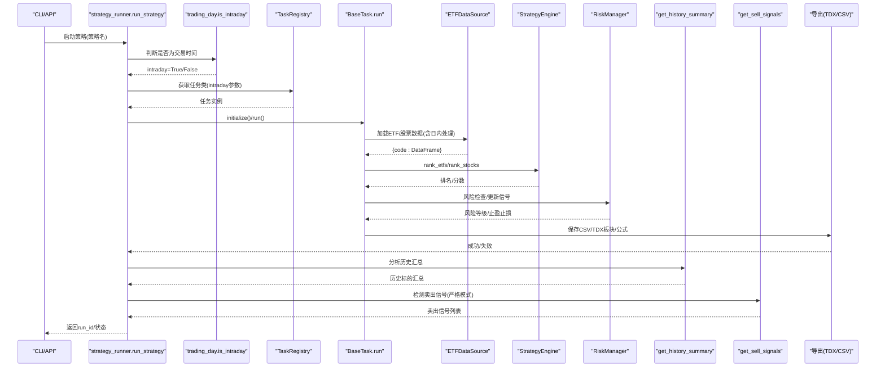

**图示来源**
- [src/quant_etf/dashboard/services/strategy_runner.py:25-323](file://src/quant_etf/dashboard/services/strategy_runner.py#L25-L323)
- [src/quant_etf/tasks.py:114-160](file://src/quant_etf/tasks.py#L114-L160)
- [src/quant_etf/data_source.py:189-285](file://src/quant_etf/data_source.py#L189-L285)
- [src/quant_etf/strategy.py:103-321](file://src/quant_etf/strategy.py#L103-L321)
- [src/quant_etf/risk_manager.py:145-185](file://src/quant_etf/risk_manager.py#L145-L185)
- [src/quant_etf/trading_day.py:91-101](file://src/quant_etf/trading_day.py#L91-L101)

## 详细组件分析

### 动量策略与加权计算
- 动量因子：60/20/10/5日涨跌幅，分别对应权重 w60/w20/w10/w5
- 计算步骤：
  1) 计算各周期涨跌幅 r60, r20, r10, r5
  2) 对权重进行归一化（若总和不为1则重新归一）
  3) 加权得分 = r60·w60 + r20·w20 + r10·w10 + r5·w5
  4) ETF池按得分降序排序，取前N生成目标等权组合
- 参数配置：
  - 权重：MOMENTUM_WEIGHTS（可在conf.py中调整）
  - 持仓数量：TOP_N（默认15）

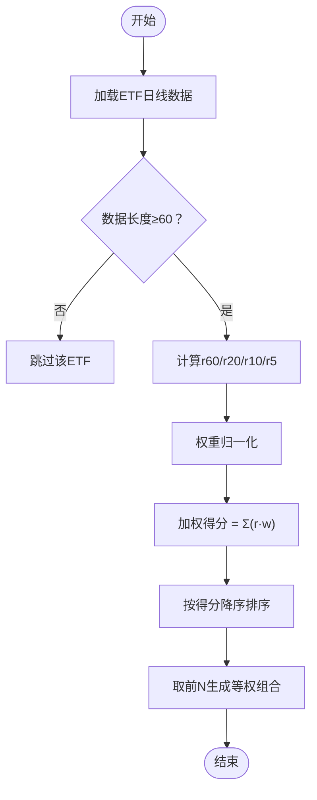

**图示来源**
- [src/quant_etf/strategy.py:61-140](file://src/quant_etf/strategy.py#L61-L140)
- [src/quant_etf/conf.py:118-129](file://src/quant_etf/conf.py#L118-L129)

**章节来源**
- [src/quant_etf/strategy.py:43-140](file://src/quant_etf/strategy.py#L43-L140)
- [src/quant_etf/conf.py:118-129](file://src/quant_etf/conf.py#L118-L129)

### ETF组合策略（目标组合生成）
- 输入：ETF池（ETF_POOL）、日线数据
- 输出：目标权重字典 {ETF代码: 权重}
- 关键流程：
  1) rank_etfs：计算得分并排序
  2) get_target_portfolio：取前N，等权分配
  3) 与基础风险检查结合：对高危ETF降低仓位或清仓
- 结果导出：CSV、TDX板块文件、自动生成公式文件

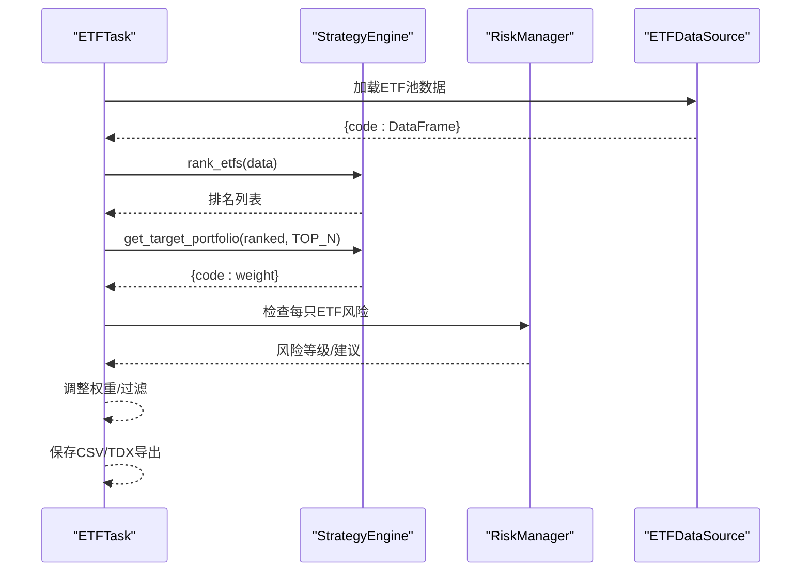

**图示来源**
- [src/quant_etf/tasks.py:162-278](file://src/quant_etf/tasks.py#L162-L278)
- [src/quant_etf/strategy.py:103-162](file://src/quant_etf/strategy.py#L103-L162)
- [src/quant_etf/risk.py:39-96](file://src/quant_etf/risk.py#L39-L96)

**章节来源**
- [src/quant_etf/tasks.py:162-278](file://src/quant_etf/tasks.py#L162-L278)
- [src/quant_etf/strategy.py:103-162](file://src/quant_etf/strategy.py#L103-L162)
- [src/quant_etf/risk.py:39-96](file://src/quant_etf/risk.py#L39-L96)

### 短线股票策略（动量+趋势+放量）
- 评分要素：
  - 动量：r60/r20/r10/r5加权
  - 趋势：MA5/MA10/MA20多头排列
  - 放量：当日量比 = 当日成交量/20日均量
- 最终分数：动量分 + 量能修正项 + 趋势修正项
- 选股：从STOCK_POOL中按分数Top-N

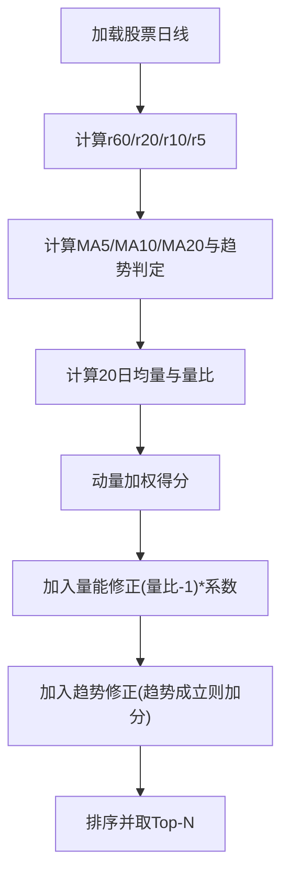

**图示来源**
- [src/quant_etf/strategy.py:164-225](file://src/quant_etf/strategy.py#L164-L225)

**章节来源**
- [src/quant_etf/strategy.py:164-225](file://src/quant_etf/strategy.py#L164-L225)

### 中期反弹策略（回调止跌+量价配合）
- 信号条件：
  - 近120日高点回调幅度>12%
  - 近20日新低后出现反弹（反弹幅度≥4%）
  - 稳定期限：从20日低点至今至少4个交易日
  - 近期涨跌：r5>0, r10>-1%
  - 均线：收盘价站上MA5且MA5>MA10
- 综合评分：加权融合回调幅度、反弹幅度、r5/r10、量能（量比-1），并按稳定性与反弹有效性进行折扣
- 选股：从MID_TERM_STOCK_POOL中按分数Top-N

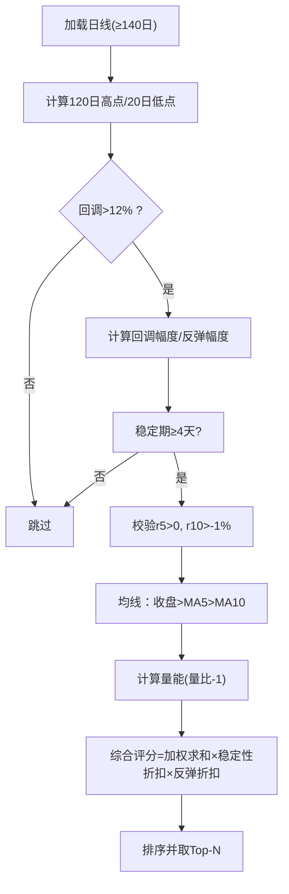

**图示来源**
- [src/quant_etf/strategy.py:227-321](file://src/quant_etf/strategy.py#L227-L321)

**章节来源**
- [src/quant_etf/strategy.py:227-321](file://src/quant_etf/strategy.py#L227-L321)

### 市场状态与策略适配
- MarketAnalyzer基于沪深300指数与ETF池1分钟数据，计算收益、波动率、均线，综合判断市场类型（牛市/熊市/震荡市/未知）
- 策略适配：均线突破与量价配合策略仅在牛市/震荡市适用；在震荡/熊市可减少或暂停

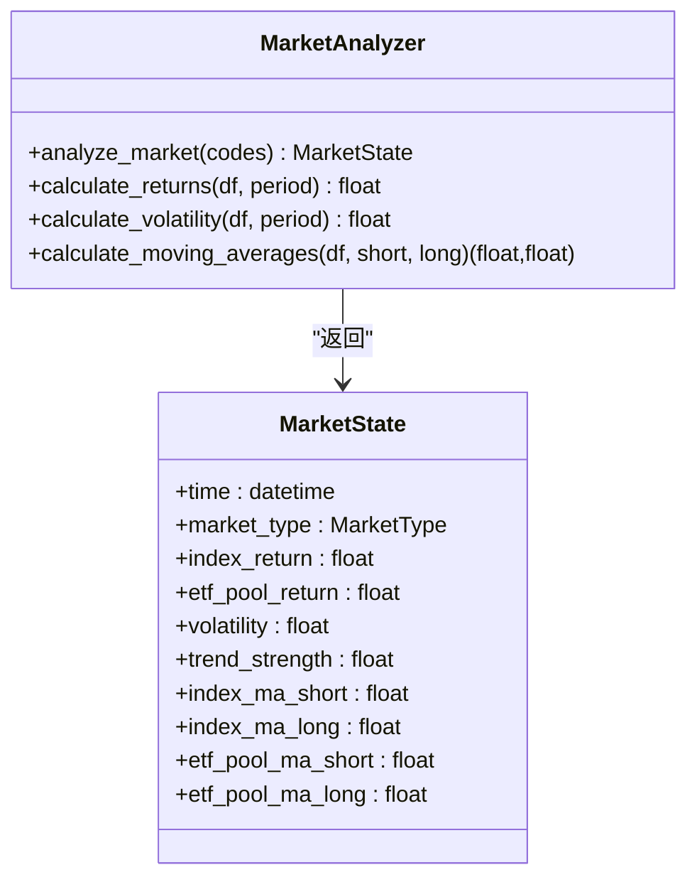

**图示来源**
- [src/quant_etf/market_analyzer.py:46-263](file://src/quant_etf/market_analyzer.py#L46-L263)

**章节来源**
- [src/quant_etf/market_analyzer.py:46-263](file://src/quant_etf/market_analyzer.py#L46-L263)

### 风险管理机制
- 基础风险（ETF）：高位分位数（>85%）或RSI超买（>80），并跌破MA20，触发"严重风险"，建议清仓；仅高位预警则建议减仓
- 技术位止损（通用）：ATR止损、支撑位止损、固定比例止损三者取最大（保证有效），止盈按2:1盈亏比并受近期高点限制

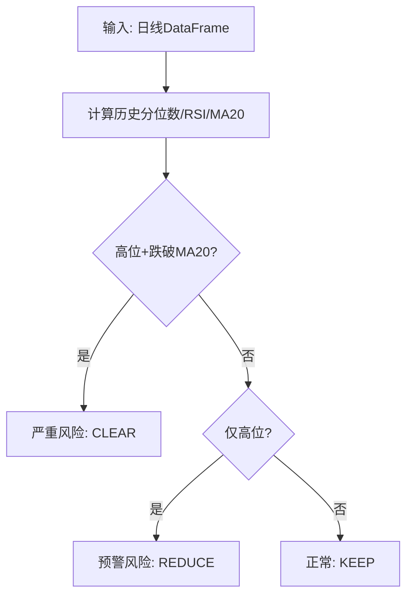

**图示来源**
- [src/quant_etf/risk.py:39-96](file://src/quant_etf/risk.py#L39-L96)

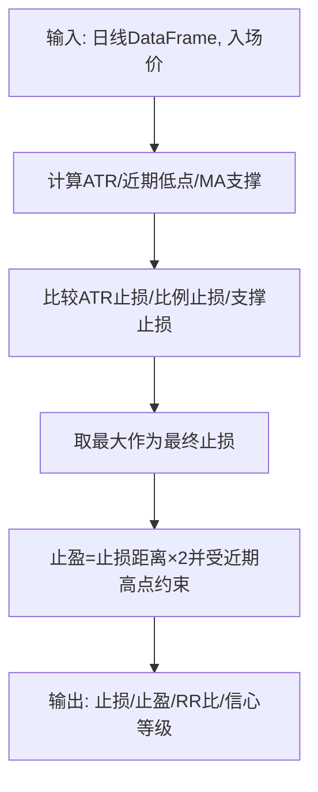

**图示来源**
- [src/quant_etf/risk_manager.py:104-171](file://src/quant_etf/risk_manager.py#L104-L171)

**章节来源**
- [src/quant_etf/risk.py:39-96](file://src/quant_etf/risk.py#L39-L96)
- [src/quant_etf/risk_manager.py:104-171](file://src/quant_etf/risk_manager.py#L104-L171)

### 看板与策略执行
- 异步执行：strategy_runner在后台线程执行任务，SSE广播进度与告警
- API路由：/strategies列出策略、/run启动策略、/status/{run_id}查询进度、/results/{run_id}渲染结果页
- 数据库：accounts/holdings/alert_rules/alerts_dashboard/schedules等表管理看板数据

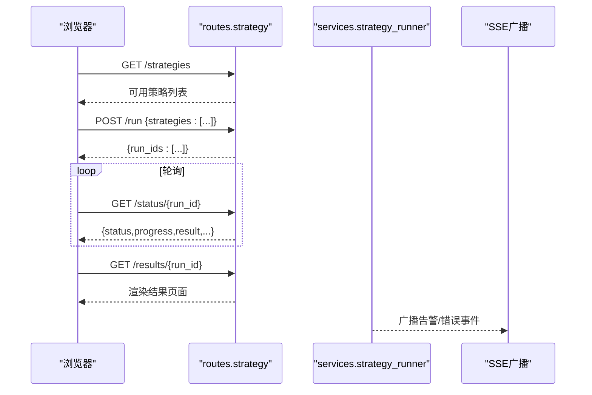

**图示来源**
- [src/quant_etf/dashboard/routes/strategy.py:18-83](file://src/quant_etf/dashboard/routes/strategy.py#L18-L83)
- [src/quant_etf/dashboard/services/strategy_runner.py:25-323](file://src/quant_etf/dashboard/services/strategy_runner.py#L25-L323)
- [src/quant_etf/dashboard/db.py:69-133](file://src/quant_etf/dashboard/db.py#L69-L133)

**章节来源**
- [src/quant_etf/dashboard/routes/strategy.py:18-83](file://src/quant_etf/dashboard/routes/strategy.py#L18-L83)
- [src/quant_etf/dashboard/services/strategy_runner.py:25-323](file://src/quant_etf/dashboard/services/strategy_runner.py#L25-L323)
- [src/quant_etf/dashboard/db.py:69-133](file://src/quant_etf/dashboard/db.py#L69-L133)

### 策略参数配置与扩展
- 动量权重：MOMENTUM_WEIGHTS（r60/r20/r10/r5），可按市场阶段调整
- 持仓数量：TOP_N（默认15）
- 策略参数：均线周期、量能阈值、ATR周期、风险比例等在各自策略/风控模块中可配置
- 扩展接口：新增任务需继承BaseTask，实现get_pool/load_data/run_strategy/format_result/export_results，并在TaskRegistry注册

**章节来源**
- [src/quant_etf/conf.py:118-137](file://src/quant_etf/conf.py#L118-L137)
- [src/quant_etf/tasks.py:411-450](file://src/quant_etf/tasks.py#L411-L450)

## 中文本地化支持

### 策略名称中文映射
系统提供策略英文名到中文显示名的映射机制，用于看板界面的友好展示：

```python
_STRATEGY_TITLE_MAP = {
    "etf": "ETF 组合",
    "short": "短线股票", 
    "mid": "中期反弹",
}
```

**章节来源**
- [src/quant_etf/dashboard/routes/market.py:15-20](file://src/quant_etf/dashboard/routes/market.py#L15-L20)

### 字段中文显示映射
**更新** 系统在策略执行结果展示中新增了15个字段的中文映射功能，显著提升了中文用户的界面体验：

```html

```

这些字段映射涵盖了策略结果表格中的所有基础字段和技术指标字段：

#### 基础字段
- **date**: 日期 - 显示策略执行的日期
- **code**: 代码 - 证券代码（ETF或股票代码）
- **name**: 名称 - 证券名称（ETF或股票名称）

#### 技术指标字段
- **score**: 得分 - 策略评分（ETF组合策略显示目标权重）
- **r60**: 60日涨幅 - 60日涨跌幅
- **r20**: 20日涨幅 - 20日涨跌幅  
- **r10**: 10日涨幅 - 10日涨跌幅
- **r5**: 5日涨幅 - 5日涨跌幅

#### ETF组合策略特有字段
- **target_weight**: 目标权重 - ETF目标持仓权重

#### 短线股票策略特有字段
- **volume_ratio_1d_20d**: 成交量比率(1d/20d) - 当日成交量与20日均量的比值
- **trend_ok**: 趋势达标 - MA5/MA10/MA20多头排列判断

#### 中期反弹策略特有字段
- **drawdown_from_120d_high**: 距120日高点回撤 - 回调幅度判断
- **bounce_from_20d_low**: 距20日低点反弹 - 反弹幅度判断
- **stabilization_ok**: 企稳达标 - 稳定期限判断
- **rebound_ok**: 反弹达标 - 反弹有效性判断

**章节来源**
- [src/quant_etf/dashboard/templates/strategy/_results.html:44-62](file://src/quant_etf/dashboard/templates/strategy/_results.html#L44-L62)

### 界面本地化设置
看板设置页面提供中文界面支持的相关配置选项，包括SSE心跳间隔和告警刷新间隔等参数设置。

**章节来源**
- [src/quant_etf/dashboard/templates/settings/index.html:1-23](file://src/quant_etf/dashboard/templates/settings/index.html#L1-L23)

### 数据格式化与本地化
**更新** 系统在CSV导出过程中自动将数值字段格式化为中文友好的百分比格式：

```python
# 涨幅和权重字段转换为百分比格式（保留2位小数的百分比字符串）
pct_cols = ["r60", "r20", "r10", "r5", "target_weight", "score", 
            "drawdown_from_120d_high", "bounce_from_20d_low"]
for col in pct_cols:
    if col in df.columns:
        df[col] = df[col].apply(lambda x: f"{x*100:.2f}%")
```

这种格式化确保了中文用户能够直观地理解数值含义，无需进行额外的换算。

**章节来源**
- [src/quant_etf/tasks.py:98-107](file://src/quant_etf/tasks.py#L98-L107)

## 日内交易模式

### A股交易时间判断
系统通过`is_intraday()`函数判断当前是否处于A股交易时间段：
- 交易时间：工作日 09:30-11:30 或 13:00-15:00
- 周末：非交易时间
- 节假日：需要根据实际交易日历判断

```python
def is_intraday() -> bool:
    now = datetime.now()
    if now.weekday() >= 5:  # 周末
        return False
    current = now.time()
    return (time(9, 30) <= current <= time(11, 30) or
            time(13, 0) <= current <= time(15, 0))
```

**章节来源**
- [src/quant_etf/trading_day.py:91-101](file://src/quant_etf/trading_day.py#L91-L101)

### 实时数据处理
在日内模式下，系统支持实时数据处理功能：

1. **实时行情获取**：通过`build_intraday_bar()`函数构造当日K线
2. **pct_chg计算**：基于历史收盘价计算当日涨跌幅
3. **数据新鲜度检查**：判断实时数据是否足够新鲜

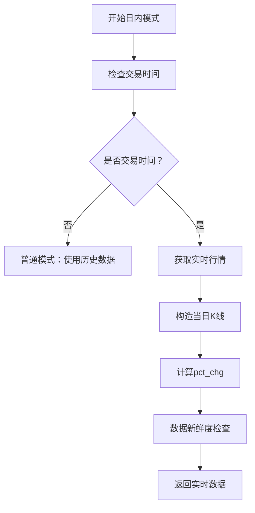

**图示来源**
- [src/quant_etf/data_source.py:19-69](file://src/quant_etf/data_source.py#L19-L69)

**章节来源**
- [src/quant_etf/data_source.py:19-69](file://src/quant_etf/data_source.py#L19-L69)

### 策略执行流程调整
策略执行器会根据交易时间自动选择合适的执行模式：

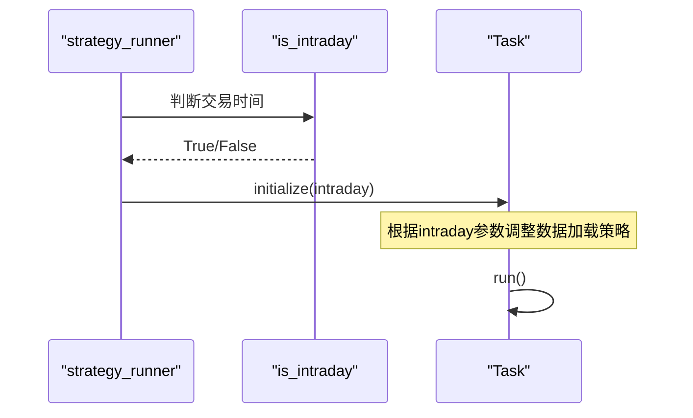

**图示来源**
- [src/quant_etf/dashboard/services/strategy_runner.py:43-46](file://src/quant_etf/dashboard/services/strategy_runner.py#L43-L46)

**章节来源**
- [src/quant_etf/dashboard/services/strategy_runner.py:43-46](file://src/quant_etf/dashboard/services/strategy_runner.py#L43-L46)

## 股票池扩展功能

### ALL_POOL配置机制
系统提供ALL_POOL配置，支持多池合并策略：

```python
ALL_POOL = list(dict.fromkeys([*ETF_POOL]))
# ALL_POOL = list(dict.fromkeys([*MID_TERM_STOCK_POOL, *STOCK_POOL, *ETF_POOL]))
```

**章节来源**
- [src/quant_etf/conf.py:110-111](file://src/quant_etf/conf.py#L110-L111)

### 股票池分类管理
系统维护多个专用股票池，支持灵活的策略选择：

1. **ETF池**：主要ETF产品集合
2. **股票池**：A股主板股票集合  
3. **中期反弹股票池**：专门用于中期反弹策略的股票集合

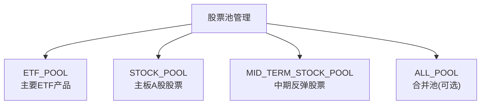

**图示来源**
- [src/quant_etf/conf.py:32-108](file://src/quant_etf/conf.py#L32-L108)

**章节来源**
- [src/quant_etf/conf.py:32-108](file://src/quant_etf/conf.py#L32-L108)

### 股票名称映射与校准
系统提供完整的股票名称映射功能，支持批量校准和更新：

1. **名称映射加载**：从data/meta/stock_code_name.json加载
2. **批量校准**：通过SimpleStockAPI在线查询权威名称
3. **市场判定**：统一使用_market_for_code函数判定市场

**章节来源**
- [src/quant_etf/data_source.py:418-535](file://src/quant_etf/data_source.py#L418-L535)

## 卖出信号检测功能

### 功能概述
ETF卖信号检测功能是策略引擎的重要增强，基于严格的检测算法识别从策略结果中掉出的ETF并提供手动卖出信号。该功能通过分析历史汇总数据，自动对比相邻两次策略运行结果，识别"今日掉榜"的ETF标的。

### 核心检测算法
**严格模式**：只在最新结果日掉榜的标的才触发卖出信号，确保信号的准确性：

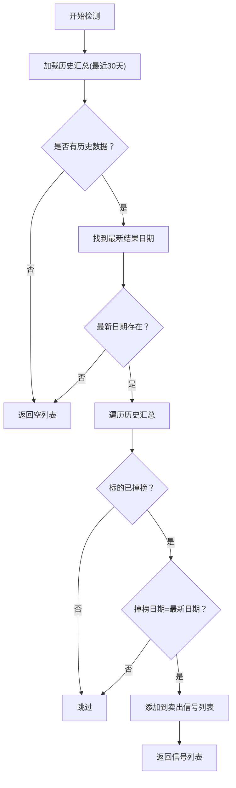

**图示来源**
- [src/quant_etf/dashboard/services/strategy_runner.py:178-204](file://src/quant_etf/dashboard/services/strategy_runner.py#L178-L204)

### get_sell_signals()函数实现
该函数位于策略运行器中，提供核心的卖出信号检测功能：

```python
def get_sell_signals(strategy_name: str = "etf") -> list[dict]:
    """检测今日掉榜的ETF，返回卖出信号列表
    
    严格模式：只在最新结果日掉榜的标的才触发卖出信号。
    """
    summary = get_history_summary(
        strategy_name=strategy_name, days=30, auto_backfill=False
    )
    if not summary:
        return []
    
    # 找到最新结果日期（当前仍在榜的标的的 last_on_date 最大值）
    latest_date = max((d["last_on_date"] for d in summary if d["is_active"]), default=None)
    if not latest_date:
        return []
    
    # 严格模式：off_date == latest_date 表示今天刚掉榜
    signals = []
    for item in summary:
        if not item["is_active"] and item["off_date"] == latest_date:
            signals.append({
                "code": item["code"],
                "name": item["name"],
                "last_on_date": item["last_on_date"],
                "on_days": item["on_days"],
            })
    return signals
```

**章节来源**
- [src/quant_etf/dashboard/services/strategy_runner.py:178-204](file://src/quant_etf/dashboard/services/strategy_runner.py#L178-L204)

### API端点与前端集成
系统提供了完整的API端点和前端模板支持：

#### API端点
```python
@router.get("/sell-signals", response_class=HTMLResponse)
async def get_sell_signals_fragment(
    request: Request,
    strategy: str = "etf",
):
    """渲染卖出信号区块"""
    signals = get_sell_signals(strategy_name=strategy)
    return templates.TemplateResponse(
        request, "strategy/_sell_signals.html",
        {"signals": signals}
    )
```

#### 前端模板
卖出信号模板提供红色警告样式，显示掉榜ETF的详细信息：

```html
{# 卖出信号区块：今日掉榜的ETF列表 #}

<div class="alert alert-danger mb-3">
    <h6 class="alert-heading mb-2">
        <i class="bi bi-exclamation-triangle-fill"></i> 今日卖出信号（{{ signals|length }} 只掉榜）
    </h6>
    <div class="table-responsive">
        <table class="table table-sm table-bordered mb-0" style="background: transparent;">
            <thead>
                <tr>
                    <th>代码</th>
                    <th>名称</th>
                    <th>最后在榜日期</th>
                    <th>连续在榜天数</th>
                </tr>
            </thead>
            <tbody>
                
                <tr>
                    <td><code>{{ s.code }}</code></td>
                    <td>{{ s.name }}</td>
                    <td>{{ s.last_on_date }}</td>
                    <td>{{ s.on_days }} 天</td>
                </tr>
                
            </tbody>
        </table>
    </div>
</div>

<div class="alert alert-success mb-3">
    <i class="bi bi-check-circle-fill"></i> 今日无卖出信号
</div>

```

#### 策略结果页集成
在策略执行完成后，系统会在历史汇总表格上方自动插入卖出信号区块：

```html

<div id="sell-signals-container"
     hx-get="/api/strategy/sell-signals?strategy=etf"
     hx-trigger="load"
     hx-indicator="#sell-spinner">
    <div id="sell-spinner" class="htmx-indicator text-center py-2">
        <span class="spinner-border spinner-border-sm"></span>
        <span class="small text-muted">检测卖出信号...</span>
    </div>
</div>

```

**章节来源**
- [src/quant_etf/dashboard/routes/strategy.py:57-67](file://src/quant_etf/dashboard/routes/strategy.py#L57-L67)
- [src/quant_etf/dashboard/templates/strategy/_sell_signals.html:1-35](file://src/quant_etf/dashboard/templates/strategy/_sell_signals.html#L1-L35)
- [src/quant_etf/dashboard/templates/strategy/_results.html:83-94](file://src/quant_etf/dashboard/templates/strategy/_results.html#L83-L94)

### 历史汇总功能增强
卖出信号检测功能复用并增强了现有的历史汇总分析能力：

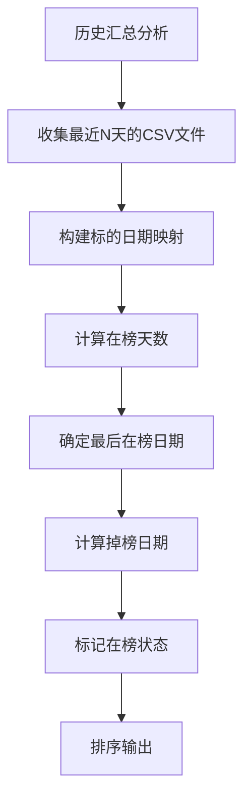

**图示来源**
- [src/quant_etf/dashboard/services/strategy_runner.py:217-322](file://src/quant_etf/dashboard/services/strategy_runner.py#L217-L322)

### 边界情况处理
系统针对各种边界情况提供了完善的处理机制：

| 场景 | 处理方式 | 说明 |
|------|---------|------|
| 首次运行（无历史数据） | 不生成信号，静默返回空列表 | 避免误报 |
| 非交易日（无当日结果） | 不生成信号，等待下一交易日 | 确保数据完整性 |
| 策略结果文件缺失 | 静默跳过，记录INFO日志 | 保持系统稳定性 |
| 非ETF策略（short/mid） | 同样支持，通过 `strategy` 参数指定 | 支持多策略检测 |

**章节来源**
- [src/quant_etf/dashboard/services/strategy_runner.py:178-204](file://src/quant_etf/dashboard/services/strategy_runner.py#L178-L204)

## 依赖分析
- 组件耦合：
  - StrategyEngine依赖conf中的权重与池子
  - 任务系统依赖数据源与策略引擎，**新增** 依赖trading_day模块进行日内模式判断
  - 风控模块独立于策略，但被任务系统调用
  - 看板服务依赖任务系统与数据库，**新增** 依赖market路由进行中文策略映射，**新增** 依赖历史汇总功能进行卖出信号检测
  - **新增** 卖出信号检测功能依赖历史汇总分析和缓存机制
- 外部依赖：
  - TDX在线/本地解析、pandas/numpy、loguru、duckdb（市场分析）
  - **新增** SSE事件管理、前端模板渲染、htmx异步加载
- 循环依赖：未见明显循环

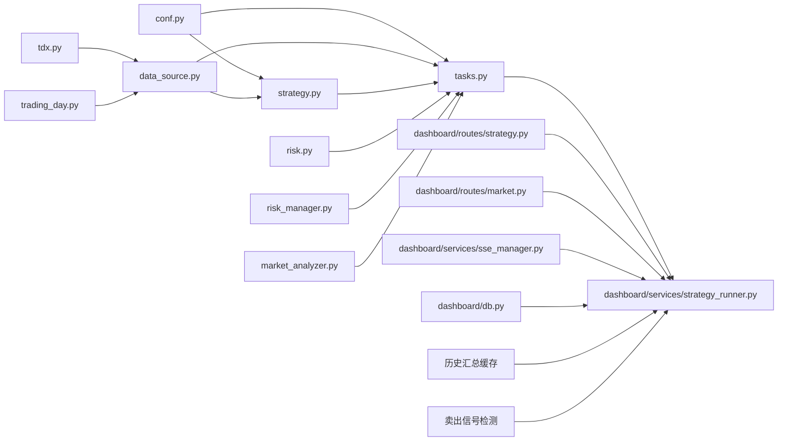

**图示来源**
- [src/quant_etf/conf.py:118-137](file://src/quant_etf/conf.py#L118-L137)
- [src/quant_etf/strategy.py:43-321](file://src/quant_etf/strategy.py#L43-L321)
- [src/quant_etf/tasks.py:30-450](file://src/quant_etf/tasks.py#L30-L450)
- [src/quant_etf/data_source.py:15-381](file://src/quant_etf/data_source.py#L15-L381)
- [src/quant_etf/tdx.py:209-375](file://src/quant_etf/tdx.py#L209-L375)
- [src/quant_etf/trading_day.py:91-101](file://src/quant_etf/trading_day.py#L91-L101)
- [src/quant_etf/risk.py:18-96](file://src/quant_etf/risk.py#L18-L96)
- [src/quant_etf/risk_manager.py:26-185](file://src/quant_etf/risk_manager.py#L26-L185)
- [src/quant_etf/market_analyzer.py:46-263](file://src/quant_etf/market_analyzer.py#L46-L263)
- [src/quant_etf/dashboard/services/strategy_runner.py:25-323](file://src/quant_etf/dashboard/services/strategy_runner.py#L25-L323)
- [src/quant_etf/dashboard/routes/strategy.py:18-83](file://src/quant_etf/dashboard/routes/strategy.py#L18-L83)
- [src/quant_etf/dashboard/routes/market.py:15-20](file://src/quant_etf/dashboard/routes/market.py#L15-L20)
- [src/quant_etf/dashboard/services/sse_manager.py:10-45](file://src/quant_etf/dashboard/services/sse_manager.py#L10-L45)
- [src/quant_etf/dashboard/db.py:69-133](file://src/quant_etf/dashboard/db.py#L69-L133)

**章节来源**
- [src/quant_etf/tasks.py:30-450](file://src/quant_etf/tasks.py#L30-L450)

## 性能考虑
- 数据加载：优先本地TDX文件，其次缓存，最后在线回源；按需切片过滤目标日期，减少内存占用
- 计算优化：滚动窗口（MA/ATR/RSI）尽量复用中间列；向量化计算（pandas/numpy）优于循环
- 并发执行：策略执行在独立线程池中进行，避免阻塞API响应
- I/O优化：CSV导出与TDX文件生成批量写入，减少磁盘抖动
- **新增** 日内模式优化：交易时间内的数据访问采用实时行情，非交易时间使用历史数据缓存
- **新增** 中文本地化优化：字段映射采用字典查找，避免重复的字符串处理操作
- **新增** 卖出信号检测优化：历史汇总数据缓存（5分钟TTL），避免重复计算
- **新增** 异步加载优化：使用htmx进行前端异步加载，提升用户体验

## 故障排查指南
- 数据加载失败：检查TDX目录、网络连通性与缓存文件完整性
- 策略无结果：确认池子大小、数据长度（ETF≥60日、股票≥140日）、权重归一化
- 风控误报/漏报：调整高位分位数阈值、RSI周期与阈值、MA周期
- 看板异常：检查SQLite数据库初始化、SSE广播异常、路由参数
- **新增** 中文显示异常：检查策略名称映射配置、模板文件编码、浏览器语言设置
- **新增** 日内模式异常：验证交易时间判断逻辑、实时数据获取权限、SSE事件广播
- **新增** 字段映射异常：检查col_map字典配置、字段名称匹配、模板渲染逻辑
- **新增** 卖出信号异常：检查历史汇总数据完整性、缓存失效、API端点访问权限
- **新增** 历史汇总错误：验证CSV文件格式、日期格式、标的代码格式一致性

**章节来源**
- [src/quant_etf/data_source.py:189-285](file://src/quant_etf/data_source.py#L189-L285)
- [src/quant_etf/risk.py:39-96](file://src/quant_etf/risk.py#L39-L96)
- [src/quant_etf/dashboard/db.py:79-91](file://src/quant_etf/dashboard/db.py#L79-L91)
- [src/quant_etf/dashboard/services/strategy_runner.py:102-122](file://src/quant_etf/dashboard/services/strategy_runner.py#L102-L122)
- [src/quant_etf/dashboard/routes/market.py:15-20](file://src/quant_etf/dashboard/routes/market.py#L15-L20)

## 结论
本策略引擎以清晰的分层设计实现了ETF组合、短线与中期反弹三大策略，结合风控与市场分析，形成可配置、可扩展、可观测的自动化体系。**更新** 新增的中文本地化支持、日内交易模式、股票池扩展功能和ETF卖信号检测功能进一步提升了系统的实用性与智能化水平。通过看板与异步执行，用户可高效地进行策略验证、监控与部署。**特别更新** 新增的15个字段中文映射功能和卖出信号检测功能显著改善了中文用户的界面体验和策略执行监控能力，使策略结果更加直观易懂且具备更强的风险控制能力。

## 附录

### 回测与历史数据验证流程
- 数据准备：使用ETFDataSource加载ETF/股票日线，确保数据新鲜度
- 回测框架：以BaseTask为目标，传入目标日期（target_date）对数据进行切片，模拟历史时序
- 指标采集：可扩展在任务中增加收益、最大回撤、夏普比率等指标统计
- 验证要点：不同市场状态下策略表现差异、参数敏感性测试、风控阈值有效性
- **新增** 卖出信号验证：通过历史汇总数据分析，验证卖出信号检测的准确性

**章节来源**
- [src/quant_etf/tasks.py:131-138](file://src/quant_etf/tasks.py#L131-L138)
- [src/quant_etf/data_source.py:151-188](file://src/quant_etf/data_source.py#L151-L188)

### 策略性能评估指标（建议）
- 绝对收益与年化收益
- 最大回撤与回撤周期
- 夏普比率与Calmar比率
- 胜率与盈亏比
- 月度/年度胜率分布
- 不同市场状态下的分层表现
- **新增** 卖出信号准确率与及时性评估

### 接口规范与最佳实践
- 新增策略任务：继承BaseTask，实现必要方法，注册到TaskRegistry
- 参数化：将策略关键参数（均线、量能阈值、ATR周期、风险比例）集中配置
- 结果导出：统一CSV格式，补充TDX板块/公式文件生成
- 错误处理：在strategy_runner中捕获异常并广播SSE错误事件
- 文档与测试：为每个策略提供说明文档与单元/集成测试
- **新增** 中文本地化：遵循字段映射规范，确保界面显示一致性
- **新增** 日内模式：在策略实现中考虑交易时间差异，合理处理实时数据
- **新增** 股池管理：利用ALL_POOL配置实现灵活的股票池组合策略
- **新增** 字段本地化：在模板中使用col_map字典进行字段名称映射，确保中文显示正确
- **新增** 卖出信号检测：遵循严格模式原则，确保信号准确性，避免误报
- **新增** 历史汇总缓存：合理设置缓存策略，平衡数据新鲜度与性能

**章节来源**
- [src/quant_etf/tasks.py:411-450](file://src/quant_etf/tasks.py#L411-L450)
- [src/quant_etf/dashboard/services/strategy_runner.py:102-122](file://src/quant_etf/dashboard/services/strategy_runner.py#L102-L122)
- [src/quant_etf/conf.py:110-111](file://src/quant_etf/conf.py#L110-L111)