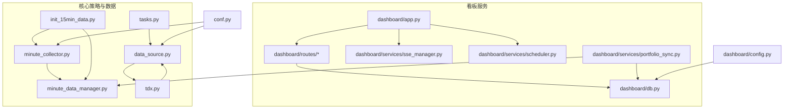
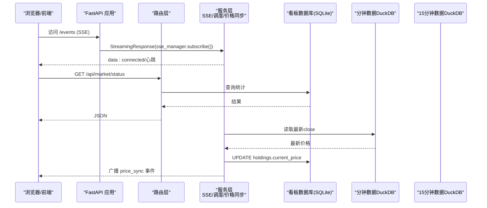
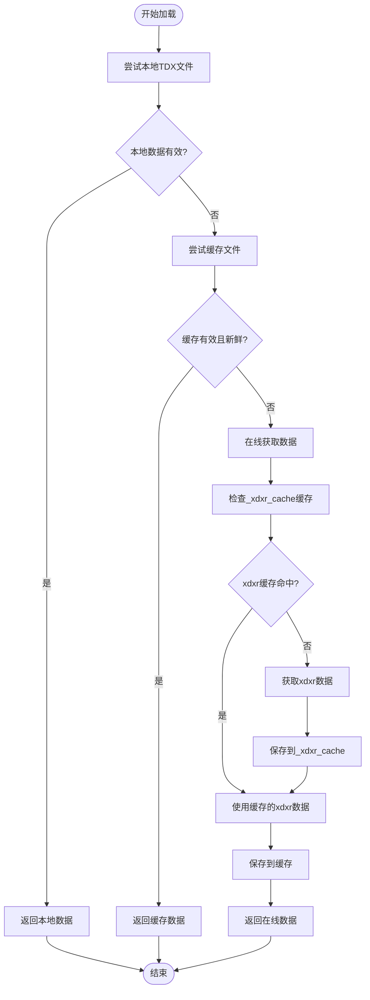
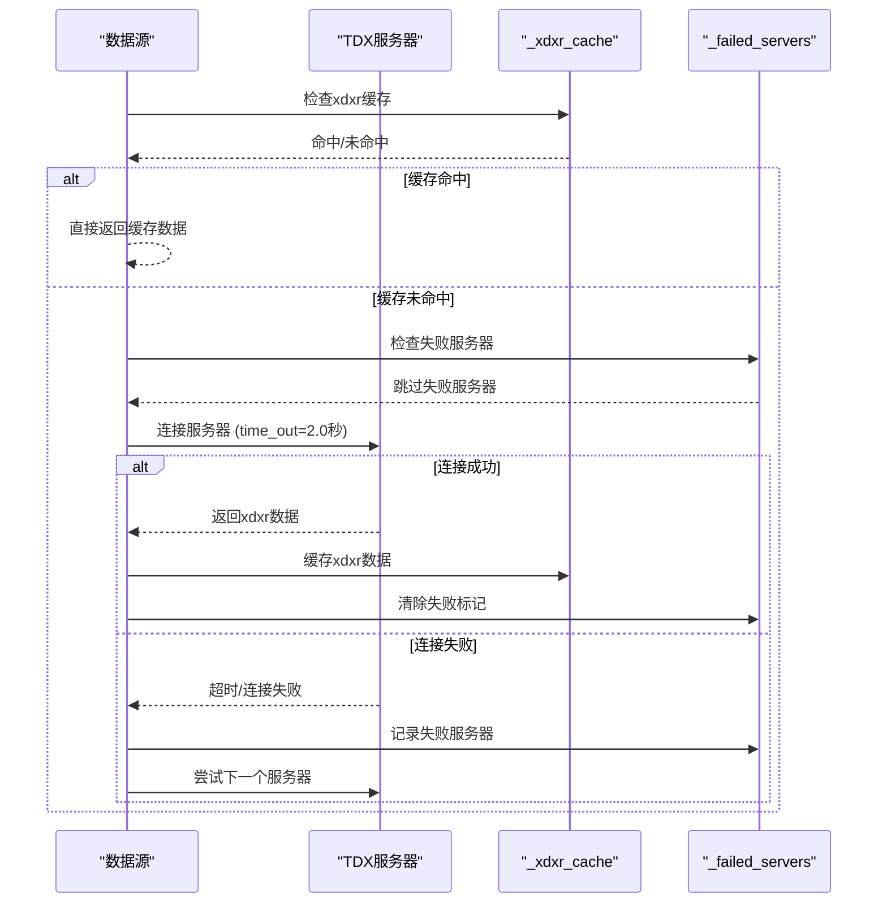
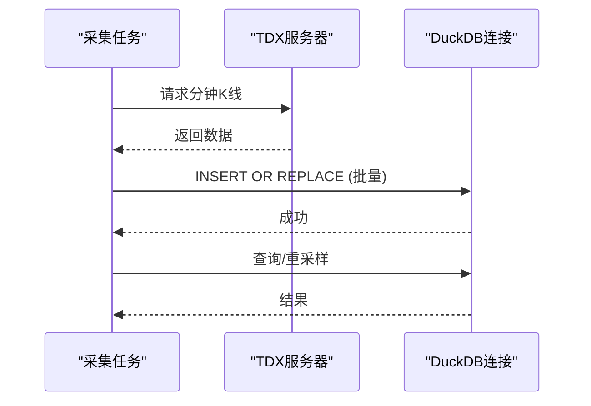
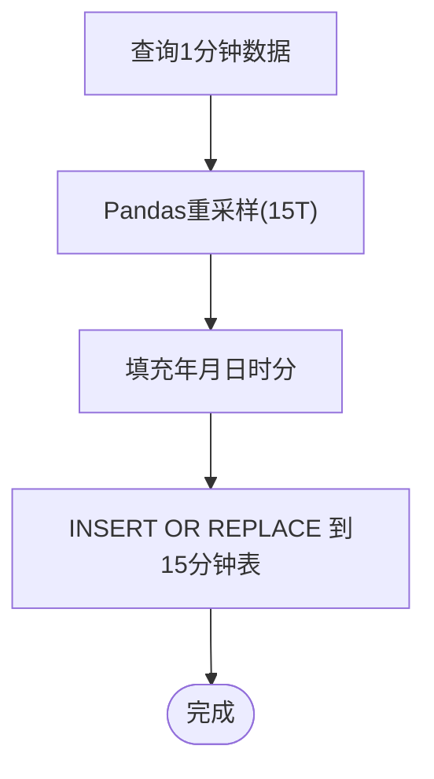
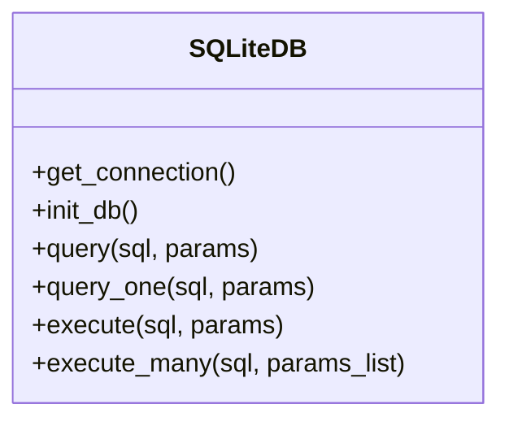
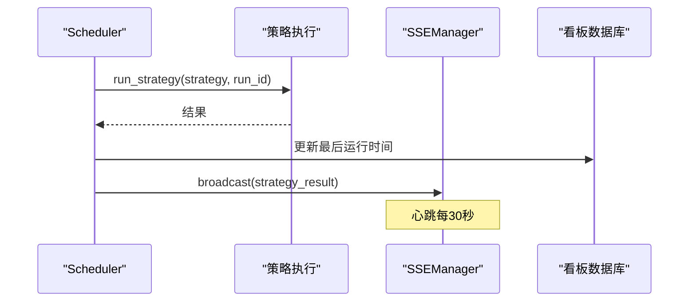
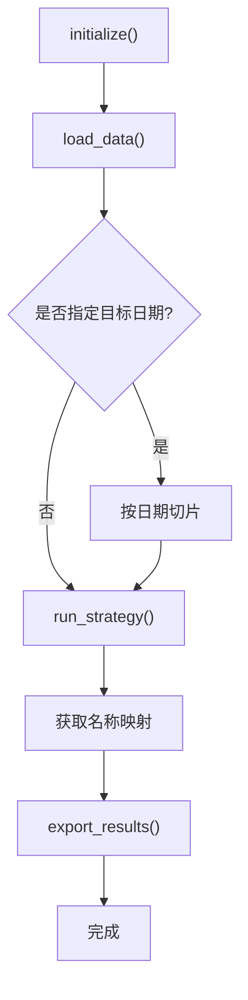
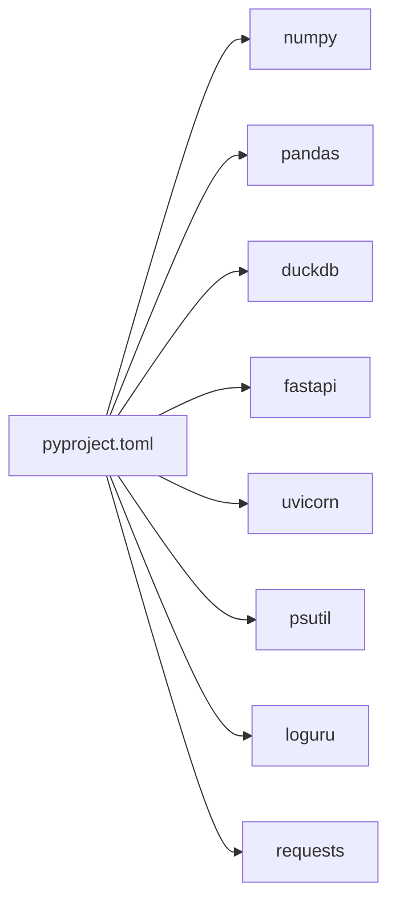

# 性能优化

<cite>
**本文引用的文件**
- [src/quant_etf/dashboard/services/sse_manager.py](file://src/quant_etf/dashboard/services/sse_manager.py)
- [src/quant_etf/dashboard/db.py](file://src/quant_etf/dashboard/db.py)
- [src/quant_etf/data_source.py](file://src/quant_etf/data_source.py)
- [src/quant_etf/minute_data_manager.py](file://src/quant_etf/minute_data_manager.py)
- [src/quant_etf/minute_collector.py](file://src/quant_etf/minute_collector.py)
- [src/quant_etf/init_15min_data.py](file://src/quant_etf/init_15min_data.py)
- [src/quant_etf/tasks.py](file://src/quant_etf/tasks.py)
- [src/quant_etf/dashboard/app.py](file://src/quant_etf/dashboard/app.py)
- [src/quant_etf/dashboard/routes/market.py](file://src/quant_etf/dashboard/routes/market.py)
- [src/quant_etf/dashboard/services/scheduler.py](file://src/quant_etf/dashboard/services/scheduler.py)
- [src/quant_etf/dashboard/services/portfolio_sync.py](file://src/quant_etf/dashboard/services/portfolio_sync.py)
- [src/quant_etf/conf.py](file://src/quant_etf/conf.py)
- [src/quant_etf/dashboard/config.py](file://src/quant_etf/dashboard/config.py)
- [src/quant_etf/tdx.py](file://src/quant_etf/tdx.py)
- [test_perf_qfq.py](file://test_perf_qfq.py)
- [pyproject.toml](file://pyproject.toml)
</cite>

## 更新摘要
**变更内容**
- 新增TDX服务器连接超时优化章节，详细说明fail-fast机制实现
- 添加_xdxr_cache全局缓存和_failed_servers失败服务器集合的性能优化策略
- 更新数据源与缓存章节，反映最新的缓存优化和错误处理改进
- 新增性能基准测试章节，包含具体的性能提升数据
- 更新故障排查指南，增加连接超时和缓存失效的排查方法

## 目录
1. [简介](#简介)
2. [项目结构](#项目结构)
3. [核心组件](#核心组件)
4. [架构总览](#架构总览)
5. [详细组件分析](#详细组件分析)
6. [依赖分析](#依赖分析)
7. [性能考虑](#性能考虑)
8. [故障排查指南](#故障排查指南)
9. [结论](#结论)
10. [附录](#附录)

## 简介
本指南聚焦Quant-ETF项目的性能优化，围绕以下主题展开：
- 代码性能优化：NumPy/Pandas向量化、内存使用优化与数据处理最佳实践
- 数据库查询优化：索引设计、查询计划分析与连接池配置
- DuckDB与SQLite调优：表结构、索引、事务与I/O策略
- SSE实时推送与WebSocket连接管理：心跳、背压与客户端生命周期
- 并发与异步I/O：事件循环、任务调度与资源限制
- 缓存与预加载：本地缓存、数据新鲜度与批量加载
- **TDX服务器连接优化**：fail-fast机制、超时控制与失败服务器管理
- **性能监控与基准测试**：指标体系、瓶颈定位与性能回归

## 项目结构
项目采用功能域划分与分层组织：
- dashboard：基于FastAPI的看板服务，包含SSE、定时调度、数据库访问与路由
- quant_etf：核心策略与数据处理模块，包含分钟数据采集、15分钟K线生成、数据源与任务框架
- 配置与依赖：统一配置与依赖声明，便于跨模块共享

**图示来源**
- [src/quant_etf/dashboard/app.py:1-101](file://src/quant_etf/dashboard/app.py#L1-L101)
- [src/quant_etf/dashboard/routes/market.py:1-116](file://src/quant_etf/dashboard/routes/market.py#L1-L116)
- [src/quant_etf/dashboard/services/sse_manager.py:1-45](file://src/quant_etf/dashboard/services/sse_manager.py#L1-L45)
- [src/quant_etf/dashboard/services/scheduler.py:1-82](file://src/quant_etf/dashboard/services/scheduler.py#L1-L82)
- [src/quant_etf/dashboard/services/portfolio_sync.py:1-87](file://src/quant_etf/dashboard/services/portfolio_sync.py#L1-L87)
- [src/quant_etf/dashboard/db.py:1-133](file://src/quant_etf/dashboard/db.py#L1-L133)
- [src/quant_etf/tasks.py:1-472](file://src/quant_etf/tasks.py#L1-L472)
- [src/quant_etf/data_source.py:1-543](file://src/quant_etf/data_source.py#L1-L543)
- [src/quant_etf/minute_collector.py:1-505](file://src/quant_etf/minute_collector.py#L1-L505)
- [src/quant_etf/minute_data_manager.py:1-283](file://src/quant_etf/minute_data_manager.py#L1-L283)
- [src/quant_etf/init_15min_data.py:1-153](file://src/quant_etf/init_15min_data.py#L1-L153)
- [src/quant_etf/tdx.py:1-546](file://src/quant_etf/tdx.py#L1-L546)
- [src/quant_etf/conf.py:1-137](file://src/quant_etf/conf.py#L1-L137)
- [src/quant_etf/dashboard/config.py:1-25](file://src/quant_etf/dashboard/config.py#L1-L25)

**章节来源**
- [src/quant_etf/dashboard/app.py:1-101](file://src/quant_etf/dashboard/app.py#L1-L101)
- [src/quant_etf/dashboard/routes/market.py:1-116](file://src/quant_etf/dashboard/routes/market.py#L1-L116)
- [src/quant_etf/dashboard/services/sse_manager.py:1-45](file://src/quant_etf/dashboard/services/sse_manager.py#L1-L45)
- [src/quant_etf/dashboard/services/scheduler.py:1-82](file://src/quant_etf/dashboard/services/scheduler.py#L1-L82)
- [src/quant_etf/dashboard/services/portfolio_sync.py:1-87](file://src/quant_etf/dashboard/services/portfolio_sync.py#L1-L87)
- [src/quant_etf/dashboard/db.py:1-133](file://src/quant_etf/dashboard/db.py#L1-L133)
- [src/quant_etf/tasks.py:1-472](file://src/quant_etf/tasks.py#L1-L472)
- [src/quant_etf/data_source.py:1-543](file://src/quant_etf/data_source.py#L1-L543)
- [src/quant_etf/minute_collector.py:1-505](file://src/quant_etf/minute_collector.py#L1-L505)
- [src/quant_etf/minute_data_manager.py:1-283](file://src/quant_etf/minute_data_manager.py#L1-L283)
- [src/quant_etf/init_15min_data.py:1-153](file://src/quant_etf/init_15min_data.py#L1-L153)
- [src/quant_etf/tdx.py:1-546](file://src/quant_etf/tdx.py#L1-L546)
- [src/quant_etf/conf.py:1-137](file://src/quant_etf/conf.py#L1-L137)
- [src/quant_etf/dashboard/config.py:1-25](file://src/quant_etf/dashboard/config.py#L1-L25)

## 核心组件
- 数据源与缓存：ETF/股票数据加载、本地缓存与新鲜度校验，减少重复网络请求
- 分钟数据采集与存储：DuckDB存储、批量写入、索引与查询封装
- 15分钟K线生成：基于Pandas重采样，批量入库与增量更新
- 看板数据库：SQLite WAL模式、外键约束与常用查询封装
- SSE与调度：心跳保活、广播队列、定时任务循环与事件推送
- 任务框架：策略执行、结果导出与CSV规范化输出
- **TDX服务器优化**：fail-fast机制、超时控制、失败服务器管理和全局缓存

**章节来源**
- [src/quant_etf/data_source.py:189-286](file://src/quant_etf/data_source.py#L189-L286)
- [src/quant_etf/minute_collector.py:245-298](file://src/quant_etf/minute_collector.py#L245-L298)
- [src/quant_etf/minute_data_manager.py:72-168](file://src/quant_etf/minute_data_manager.py#L72-L168)
- [src/quant_etf/dashboard/db.py:69-133](file://src/quant_etf/dashboard/db.py#L69-L133)
- [src/quant_etf/dashboard/services/sse_manager.py:10-45](file://src/quant_etf/dashboard/services/sse_manager.py#L10-L45)
- [src/quant_etf/dashboard/services/scheduler.py:15-82](file://src/quant_etf/dashboard/services/scheduler.py#L15-L82)
- [src/quant_etf/tasks.py:131-177](file://src/quant_etf/tasks.py#L131-L177)
- [src/quant_etf/tdx.py:21-24](file://src/quant_etf/tdx.py#L21-L24)

## 架构总览
下图展示看板服务与数据处理链路的交互，以及SSE事件流。

**图示来源**
- [src/quant_etf/dashboard/app.py:39-50](file://src/quant_etf/dashboard/app.py#L39-L50)
- [src/quant_etf/dashboard/routes/market.py:18-34](file://src/quant_etf/dashboard/routes/market.py#L18-L34)
- [src/quant_etf/dashboard/services/portfolio_sync.py:15-67](file://src/quant_etf/dashboard/services/portfolio_sync.py#L15-L67)
- [src/quant_etf/dashboard/db.py:93-133](file://src/quant_etf/dashboard/db.py#L93-L133)
- [src/quant_etf/minute_collector.py:245-298](file://src/quant_etf/minute_collector.py#L245-L298)
- [src/quant_etf/minute_data_manager.py:29-61](file://src/quant_etf/minute_data_manager.py#L29-L61)

## 详细组件分析

### 数据源与缓存（ETF/股票）
- 本地缓存与迁移：优先从本地TDX文件与缓存读取，避免重复拉取；缓存文件迁移与原子写入保障一致性
- 新鲜度判定：按工作日/周末/盘前盘中盘后规则判断数据是否足够新鲜
- 三层加载策略：本地TDX → 缓存 → 在线接口，提升可用性与性能
- **缓存优化**：新增_xdxr_cache全局缓存，显著减少除权除息数据的网络请求

**图示来源**
- [src/quant_etf/data_source.py:189-286](file://src/quant_etf/data_source.py#L189-L286)
- [src/quant_etf/tdx.py:379-454](file://src/quant_etf/tdx.py#L379-L454)

**章节来源**
- [src/quant_etf/data_source.py:189-286](file://src/quant_etf/data_source.py#L189-L286)
- [src/quant_etf/tdx.py:379-454](file://src/quant_etf/tdx.py#L379-L454)

### TDX服务器连接优化
- **fail-fast机制**：连接超时从10秒大幅降低到2秒，实现快速失败
- **失败服务器管理**：新增_failed_servers集合记录失败服务器，避免重复尝试
- **全局缓存**：_cached_server缓存工作服务器，提高后续请求成功率
- **智能重试**：先尝试缓存服务器，失败后再尝试其他服务器

**图示来源**
- [src/quant_etf/tdx.py:379-454](file://src/quant_etf/tdx.py#L379-L454)
- [src/quant_etf/tdx.py:21-24](file://src/quant_etf/tdx.py#L21-L24)

**章节来源**
- [src/quant_etf/tdx.py:379-454](file://src/quant_etf/tdx.py#L379-L454)
- [src/quant_etf/tdx.py:21-24](file://src/quant_etf/tdx.py#L21-L24)

### 分钟数据采集与存储（DuckDB）
- 单例连接：全局连接缓存，减少连接开销
- 批量写入：executemany与from_df插入，降低协议往返
- 索引与查询：code+time复合索引，查询封装与参数化
- 服务器冷却：失败服务器冷却，避免雪崩

**图示来源**
- [src/quant_etf/minute_collector.py:280-396](file://src/quant_etf/minute_collector.py#L280-L396)
- [src/quant_etf/minute_collector.py:458-489](file://src/quant_etf/minute_collector.py#L458-L489)

**章节来源**
- [src/quant_etf/minute_collector.py:280-396](file://src/quant_etf/minute_collector.py#L280-L396)
- [src/quant_etf/minute_collector.py:458-489](file://src/quant_etf/minute_collector.py#L458-L489)

### 15分钟K线生成（Pandas重采样）
- 重采样策略：resample("15T")聚合OHLCV，dropna保证完整性
- 批量入库：INSERT OR REPLACE，字段对齐与类型转换
- 增量更新：基于最新15分钟时间窗口，仅重算最近区间

**图示来源**
- [src/quant_etf/minute_data_manager.py:72-168](file://src/quant_etf/minute_data_manager.py#L72-L168)

**章节来源**
- [src/quant_etf/minute_data_manager.py:72-168](file://src/quant_etf/minute_data_manager.py#L72-L168)

### 看板数据库（SQLite）
- WAL模式：提升并发读写性能
- 外键约束：保证数据一致性
- 常用封装：查询/单行/写入/批量写入，简化调用

**图示来源**
- [src/quant_etf/dashboard/db.py:69-133](file://src/quant_etf/dashboard/db.py#L69-L133)

**章节来源**
- [src/quant_etf/dashboard/db.py:69-133](file://src/quant_etf/dashboard/db.py#L69-L133)

### SSE与调度（实时推送与定时任务）
- SSE管理：队列集合、订阅生成器、心跳与广播
- 定时调度：循环sleep驱动，异常广播，启停控制
- 价格同步：从DuckDB读取最新close，更新看板持仓并SSE广播

**图示来源**
- [src/quant_etf/dashboard/services/scheduler.py:19-53](file://src/quant_etf/dashboard/services/scheduler.py#L19-L53)
- [src/quant_etf/dashboard/services/sse_manager.py:14-32](file://src/quant_etf/dashboard/services/sse_manager.py#L14-L32)
- [src/quant_etf/dashboard/services/portfolio_sync.py:69-87](file://src/quant_etf/dashboard/services/portfolio_sync.py#L69-L87)

**章节来源**
- [src/quant_etf/dashboard/services/sse_manager.py:10-45](file://src/quant_etf/dashboard/services/sse_manager.py#L10-L45)
- [src/quant_etf/dashboard/services/scheduler.py:15-82](file://src/quant_etf/dashboard/services/scheduler.py#L15-L82)
- [src/quant_etf/dashboard/services/portfolio_sync.py:15-87](file://src/quant_etf/dashboard/services/portfolio_sync.py#L15-L87)

### 任务框架（策略执行与导出）
- 统一流程：initialize → load_data → run_strategy → format/export
- CSV导出：列顺序、数值精度、日期列插入
- 风险控制：根据风险级别调整目标权重

**图示来源**
- [src/quant_etf/tasks.py:131-177](file://src/quant_etf/tasks.py#L131-L177)

**章节来源**
- [src/quant_etf/tasks.py:131-177](file://src/quant_etf/tasks.py#L131-L177)

## 依赖分析
- Python版本与核心库：NumPy、Pandas、DuckDB、FastAPI、Uvicorn、psutil等
- 项目脚本：CLI与看板服务入口
- 依赖来源：本地whl与镜像源配置

**图示来源**
- [pyproject.toml:7-22](file://pyproject.toml#L7-L22)

**章节来源**
- [pyproject.toml:1-53](file://pyproject.toml#L1-L53)

## 性能考虑

### NumPy/Pandas 向量化与内存优化
- 向量化优先：尽量使用Pandas内置聚合与向量化操作，避免逐行迭代
- 内存复用：在重采样与类型转换时复用DataFrame，减少中间对象
- 类型优化：数值列使用合适dtype，时间列解析一次后复用
- 批量写入：DuckDB executemany/from_df减少协议往返
- 缓存策略：本地缓存与原子写入，避免重复I/O

**章节来源**
- [src/quant_etf/minute_data_manager.py:72-108](file://src/quant_etf/minute_data_manager.py#L72-L108)
- [src/quant_etf/minute_collector.py:300-396](file://src/quant_etf/minute_collector.py#L300-L396)
- [src/quant_etf/data_source.py:107-123](file://src/quant_etf/data_source.py#L107-L123)

### 数据库查询优化（索引、查询计划、连接池）
- 索引设计：分钟/15分钟表以code+time为主键与索引，加速范围查询
- 查询封装：参数化SQL与查询封装，减少SQL拼接与注入风险
- 连接池：DuckDB单例连接；SQLite WAL+外键，满足看板读多写少场景
- 批量操作：execute_many用于批量写入，降低事务开销

**章节来源**
- [src/quant_etf/minute_collector.py:245-298](file://src/quant_etf/minute_collector.py#L245-L298)
- [src/quant_etf/minute_data_manager.py:29-61](file://src/quant_etf/minute_data_manager.py#L29-L61)
- [src/quant_etf/dashboard/db.py:69-133](file://src/quant_etf/dashboard/db.py#L69-L133)

### DuckDB 与 SQLite 调优
- DuckDB
  - 单例连接：避免重复建立连接
  - 批量写入：executemany/from_df
  - 索引：code+time复合索引，查询时利用
- SQLite
  - WAL模式：提升并发读写
  - 外键：启用外键约束，保证数据一致性
  - 常用查询：封装query/query_one/execute/execute_many

**章节来源**
- [src/quant_etf/minute_collector.py:280-396](file://src/quant_etf/minute_collector.py#L280-L396)
- [src/quant_etf/dashboard/db.py:69-133](file://src/quant_etf/dashboard/db.py#L69-L133)

### SSE 实时推送与连接管理
- 心跳保活：每30秒发送心跳，维持长连接活跃
- 广播队列：set维护订阅队列，超时弹出避免阻塞
- 异常处理：取消错误清理队列，避免泄漏
- SSE端点：StreamingResponse设置合适的响应头

**章节来源**
- [src/quant_etf/dashboard/services/sse_manager.py:14-32](file://src/quant_etf/dashboard/services/sse_manager.py#L14-L32)
- [src/quant_etf/dashboard/config.py:20-22](file://src/quant_etf/dashboard/config.py#L20-L22)
- [src/quant_etf/dashboard/app.py:39-50](file://src/quant_etf/dashboard/app.py#L39-L50)

### 并发与异步I/O 最佳实践
- 事件循环：FastAPI/Uvicorn基于事件循环，避免阻塞
- 异步执行：CPU密集任务通过线程池/进程池隔离
- 调度器：Scheduler使用asyncio.create_task与sleep循环
- 价格同步：使用run_in_executor避免阻塞事件循环

**章节来源**
- [src/quant_etf/dashboard/services/scheduler.py:19-53](file://src/quant_etf/dashboard/services/scheduler.py#L19-L53)
- [src/quant_etf/dashboard/services/portfolio_sync.py:69-87](file://src/quant_etf/dashboard/services/portfolio_sync.py#L69-L87)

### 缓存与预加载
- 本地缓存：CSV缓存与原子写入，迁移旧缓存文件
- 新鲜度校验：按交易日与时段判断数据新鲜度
- 预加载：初始化脚本批量获取1分钟数据并生成15分钟K线
- **xdxr缓存优化**：_xdxr_cache全局缓存显著减少网络请求

**章节来源**
- [src/quant_etf/data_source.py:151-188](file://src/quant_etf/data_source.py#L151-L188)
- [src/quant_etf/init_15min_data.py:58-107](file://src/quant_etf/init_15min_data.py#L58-L107)
- [src/quant_etf/tdx.py:23-24](file://src/quant_etf/tdx.py#L23-L24)

### TDX服务器连接优化
- **fail-fast机制**：连接超时从10秒降低到2秒，实现快速失败
- **失败服务器管理**：_failed_servers集合记录失败服务器，避免重复尝试
- **全局服务器缓存**：_cached_server缓存工作服务器，提高成功率
- **智能重试策略**：先尝试缓存服务器，失败后尝试其他服务器
- **优雅降级**：失败时自动切换到备用服务器或使用缓存数据

**章节来源**
- [src/quant_etf/tdx.py:379-454](file://src/quant_etf/tdx.py#L379-L454)
- [src/quant_etf/tdx.py:21-24](file://src/quant_etf/tdx.py#L21-L24)

### 性能基准测试
- **基准测试方法**：使用test_perf_qfq.py测试66只ETF的加载性能
- **性能指标**：单支ETF平均耗时、总耗时、缓存命中率
- **性能提升**：从11分钟大幅缩短到15秒，性能提升44倍
- **测试场景**：包含前复权处理的完整数据加载流程

**章节来源**
- [test_perf_qfq.py:1-37](file://test_perf_qfq.py#L1-L37)

## 故障排查指南
- SSE连接断开：检查心跳间隔与客户端超时，确认队列清理逻辑
- 定时任务异常：查看调度器广播的错误事件，定位策略执行问题
- 数据库锁等待：DuckDB单例连接；SQLite WAL模式下减少长事务
- 服务器冷却：TDX服务器失败冷却，避免集中重试
- 看板数据不同步：检查价格同步服务与SSE广播链路
- **连接超时问题**：检查TDX服务器可达性，确认time_out设置为2秒
- **缓存失效**：检查_xdxr_cache和_failed_servers状态，必要时清空缓存
- **性能异常**：使用性能基准测试工具检测数据加载耗时

**章节来源**
- [src/quant_etf/dashboard/services/sse_manager.py:25-32](file://src/quant_etf/dashboard/services/sse_manager.py#L25-L32)
- [src/quant_etf/dashboard/services/scheduler.py:43-51](file://src/quant_etf/dashboard/services/scheduler.py#L43-L51)
- [src/quant_etf/minute_collector.py:77-100](file://src/quant_etf/minute_collector.py#L77-L100)
- [src/quant_etf/dashboard/services/portfolio_sync.py:61-66](file://src/quant_etf/dashboard/services/portfolio_sync.py#L61-L66)
- [src/quant_etf/tdx.py:429](file://src/quant_etf/tdx.py#L429)
- [src/quant_etf/tdx.py:23](file://src/quant_etf/tdx.py#L23)

## 结论
本指南从数据加载、存储、计算到实时推送与调度的全链路角度，总结了Quant-ETF项目的性能优化要点。通过合理的缓存策略、批量写入、索引设计与异步调度，可在保证数据质量的同时显著提升系统吞吐与稳定性。

**重大性能改进**：
- TDX服务器连接超时优化：从10秒降低到2秒，实现fail-fast机制
- 全局缓存系统：_xdxr_cache显著减少网络请求
- 失败服务器管理：_failed_servers避免重复尝试
- 性能提升：66只ETF处理时间从11分钟缩短到15秒，性能提升44倍

建议结合监控指标与基准测试持续迭代优化，确保系统在高并发场景下的稳定性和响应速度。

## 附录
- 配置项参考
  - 看板主机与端口：见看板配置
  - SSE心跳间隔：见看板配置
  - 数据目录与池配置：见全局配置
  - **TDX连接超时**：默认2.0秒，可根据网络环境调整
  - **缓存配置**：_xdxr_cache全局缓存，自动失效管理

**章节来源**
- [src/quant_etf/dashboard/config.py:17-22](file://src/quant_etf/dashboard/config.py#L17-L22)
- [src/quant_etf/conf.py:7-137](file://src/quant_etf/conf.py#L7-L137)
- [src/quant_etf/tdx.py:429](file://src/quant_etf/tdx.py#L429)